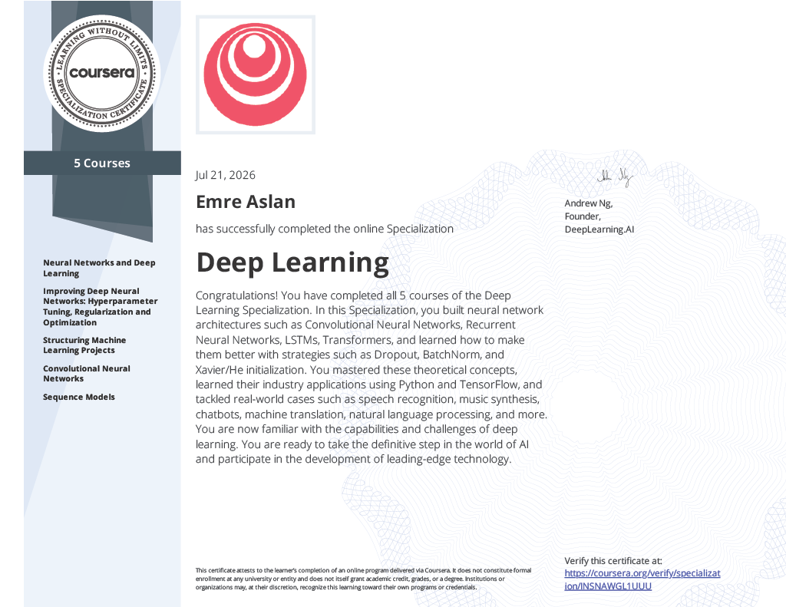

  

  <a href="https://coursera.org/verify/specialization/INSNAWGL1UUU" target="_blank" style="font-size: 13px;">
    🔗 Verify on Coursera ↗
  </a>

<h1 align="center" style="margin-top: 5vh;">
  Deep Learning Notes
</h1>

  <i>Notes taken during the <a href="https://www.coursera.org/specializations/deep-learning-introduction">Deep Learning Specialization</a>
   by <a href="https://www.coursera.org/instructor/andrewng" target="_blank">Andrew Ng</a> &amp; <a href="https://www.coursera.org/instructor/~170597538" target="_blank">Eddy Shyu</a>
   <strong>Stanford University &amp; DeepLearning.AI</strong></i>

---

### What I Built

| #   | Course                                    | Focus                                                                                                                                                                                                              |
| --- | ----------------------------------------- | ------------------------------------------------------------------------------------------------------------------------------------------------------------------------------------------------------------------ |
| 1   | **Neural Networks and Deep Learning**     | Logistic regression as a neural network, shallow & deep networks, forward/backpropagation                                                                                                                          |
| 2   | **Improving Deep Neural Networks**        | Hyperparameter tuning, regularization (Dropout, BatchNorm), optimization (Momentum, Adam), Xavier/He initialization                                                                                                |
| 3   | **Structuring Machine Learning Projects** | Train/dev/test splits, error analysis, transfer learning, end-to-end deep learning                                                                                                                                 |
| 4   | **Convolutional Neural Networks**         | CNNs, edge detection, classic & modern architectures (LeNet, AlexNet, VGG, ResNet, Inception, MobileNet, EfficientNet), object detection (YOLO), face recognition (FaceNet, Siamese), neural style transfer, U-Net |
| 5   | **Sequence Models**                       | RNNs, GRUs, LSTMs, word embeddings (Word2Vec, GloVe), attention models, Transformers, speech recognition, music synthesis, machine translation, chatbots                                                           |

---

  <i>&mdash; emreaslan &mdash;</i>

