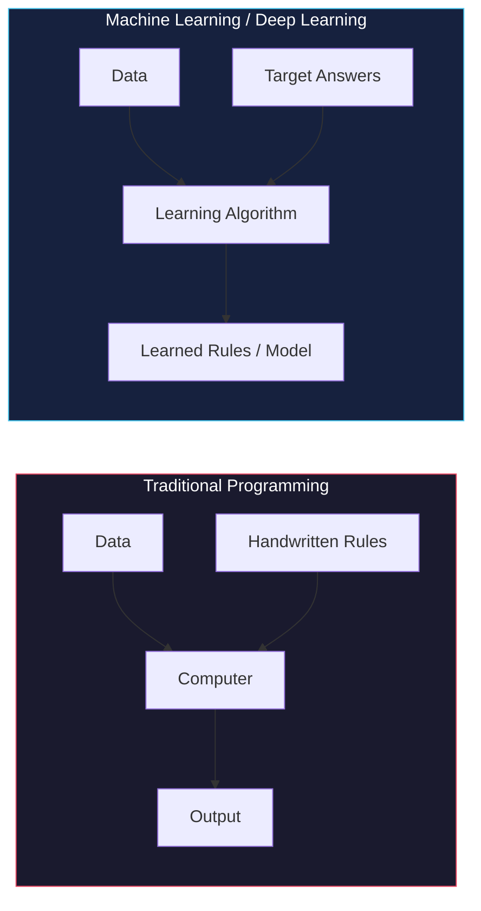
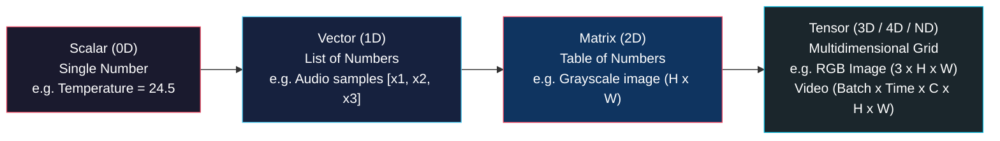

# Introducing Deep Learning and the PyTorch Library

<!-- toc -->

<div style="margin-bottom: 20px;">
  <a href="https://colab.research.google.com/github/emreaslan7/ai/blob/main/notebooks/deep-learning-with-pytorch/01-introducing-deep-learning-and-the-pytorch-library.ipynb" target="_blank">
    
  </a>
</div>

Welcome to the world of deep learning with PyTorch. If you have ever wondered how computers can recognize faces in photos, translate spoken sentences in real time, or generate realistic images from text prompts, deep learning is the technology behind these breakthroughs.

This chapter introduces the fundamental concepts of deep learning from the ground up. You will learn what deep learning is, how it differs from traditional machine learning, what a tensor is in simple terms, why PyTorch has become the primary tool for researchers and engineers worldwide, and how a typical deep learning project is structured.

---

## 1. What is Deep Learning?

For decades, traditional computer programs were written using explicit, handcrafted rules. A human programmer would write logic: *"If temperature is above 30 and humidity is high, turn on the air conditioner."*

However, for complex real-world tasks like identifying a pedestrian in a camera feed or understanding a spoken language, writing manual rules is practically impossible. There are simply too many variations in lighting, pose, clothing, and accents.



Deep learning flips the traditional programming paradigm. Instead of writing rules by hand, we feed the computer thousands of examples (inputs and their correct answers), and the computer **learns the mathematical rules automatically**.

As the computer scientist Edsger W. Dijkstra famously observed:
> *"The question of whether machines can think is about as relevant as whether submarines can swim."*

In deep learning, we do not need machines to have human consciousness; we simply need them to reliably approximate complex functions that map inputs to outputs.

---

## 2. The Shift from Machine Learning to Deep Learning

To understand why deep learning revolutionized artificial intelligence, we must look at how classical machine learning handled data compared to deep learning.


### 2.1 The Bottleneck of Feature Engineering

In classical machine learning, the machine learning algorithm itself (such as a Support Vector Machine or Linear Regression) cannot process raw pixel grids directly with high accuracy. A human engineer had to spend weeks manually extracting "features":
- Computing color histograms
- Designing edge filters
- Extracting corner descriptors (like SIFT or Harris corners)

If the human designed poor features, the model failed. The performance was fundamentally limited by human domain expertise.

### 2.2 Hierarchical Representation Learning

Deep learning replaces manual feature engineering with **layered representations**. A deep neural network is composed of successive layers of artificial neurons. Each layer takes the output of the previous layer and transforms it:

1. **First Layers:** Learn simple geometrical primitives, such as oriented lines, color boundaries, and brightness gradients.
2. **Middle Layers:** Combine edges to detect textures, corners, contours, and basic shapes (circles, stripes).
3. **Deeper Layers:** Combine shapes to detect semantic components (eyes, wheels, dog ears, door handles).
4. **Final Layer:** Combines object parts to produce the final classification decision.

Because every layer is differentiable, the entire hierarchy is optimized simultaneously through **gradient descent**.

<figure style="display:flex; justify-content: center; margin: 25px 0;">
  <div style="text-align: center;">
    
    <figcaption style="margin-top: 0.6em; text-align: center; font-size: 13px; color: #888;"><em>Hierarchical representation learning: transforming raw, chaotic sensory data into structured abstract concepts across successive network layers.</em></figcaption>
  </div>
</figure>

---

## 3. What is a Tensor?

To work with PyTorch, you need to understand its fundamental data structure: the **Tensor**.

At first, the word *tensor* may sound intimidating. But in computer science, a tensor is simply a generalization of numbers, vectors, and matrices to any number of dimensions:

```
Dimension 0 (Scalar):    42
Dimension 1 (Vector):    [1.0, 2.5, 3.8]
Dimension 2 (Matrix):    [[1, 2],
                          [3, 4]]
Dimension 3 (3D Tensor): Array with Depth, Height, Width (e.g., Color Image)
Dimension 4 (4D Tensor): Batch of Images or a Video (Batch, Channels, Height, Width)
```



### 3.1 Executable PyTorch Example: Creating Tensors

Here is an interactive Python script demonstrating how simple it is to create and inspect tensors in PyTorch:

```python
import torch

# 1. Scalar (0-dimensional tensor)
scalar = torch.tensor(42.0)
print("Scalar:", scalar)
print("Scalar dimension (ndim):", scalar.ndim)

# 2. Vector (1-dimensional tensor)
vector = torch.tensor([1.5, 3.0, 4.5])
print("\nVector:", vector)
print("Vector shape:", vector.shape)

# 3. Matrix (2-dimensional tensor: 2 rows, 3 columns)
matrix = torch.tensor([[1, 2, 3], 
                       [4, 5, 6]], dtype=torch.float32)
print("\nMatrix:\n", matrix)
print("Matrix shape (Rows, Columns):", matrix.shape)

# 4. 3D Tensor representing a small 3-channel (RGB) image (3 x 2 x 2)
rgb_image = torch.zeros((3, 2, 2))
print("\n3D Tensor (Channels x Height x Width) shape:", rgb_image.shape)
```

---

## 4. Why PyTorch?

PyTorch was created by researchers at Meta AI (formerly Facebook AI Research) and open-sourced in 2017. In just a few years, it became the undisputed standard framework for academic research and production AI.

What makes PyTorch special?

### 4.1 Pythonic and Intuitive (Eager Execution)

In early deep learning frameworks (like TensorFlow 1.x), writing code required two separate stages: first defining an abstract "symbolic graph", and then running that graph inside a "session". If your code crashed, the error message pointed to internal graph engines rather than your Python lines.

PyTorch introduced **Eager Mode (Define-by-Run)**:
- PyTorch code executes immediately line by line, exactly like standard Python and NumPy.
- You can print tensor values at any time using `print()`.
- You can use regular Python `for` loops, `if` statements, and standard debuggers (`pdb`).

```python
import torch

# Dynamic control flow in pure Python
x = torch.tensor([2.0, -3.0, 5.0])

for val in x:
    if val > 0:
        print(f"Positive value detected: {val.item()}")
    else:
        print(f"Negative value detected: {val.item()}")
```

### 4.2 Seamless GPU Acceleration

PyTorch makes running computations on NVIDIA GPUs as simple as calling `.to("cuda")` or `.to(device)`:

```python
import torch

# Check if an NVIDIA CUDA GPU is available
device = "cuda" if torch.cuda.is_available() else "cpu"
print(f"Using device: {device}")

# Create two matrices and multiply them on the target device
a = torch.randn(1000, 1000, device=device)
b = torch.randn(1000, 1000, device=device)
c = torch.matmul(a, b)

print(f"Matrix multiplication result shape on {device}: {c.shape}")
```

### 4.3 The Bridge to Production: `torch.compile` in PyTorch 2.x

In modern PyTorch 2.0 and later, you no longer have to choose between dynamic research flexibility and static production speed. Adding a single line `torch.compile(model)` automatically optimizes and fuses your operations into high-speed C++/Triton GPU kernels behind the scenes.

---

## 5. The Anatomy of a Deep Learning Project

Every deep learning application built with PyTorch follows a structured, 5-step lifecycle:


1. **Data Ingestion (`Dataset` & `DataLoader`):** Raw files (images, audio, text, CT scans) on disk are loaded, converted into numeric tensors, normalized, and grouped into mini-batches.
2. **Model Definition (`nn.Module`):** We define the neural network architecture by connecting mathematical layers (linear projections, convolutions, attention blocks).
3. **Loss Function (Criterion):** We evaluate model predictions against ground-truth labels using a loss function (such as Mean Squared Error or Cross-Entropy Loss) that outputs a single numerical penalty score.
4. **Optimization Loop (Autograd & Optimizer):** The optimizer (such as SGD or AdamW) calculates gradients via PyTorch's automatic differentiation engine (`autograd`) and slightly adjusts the model parameters to reduce the loss.
5. **Deployment:** The trained model is saved, exported (via ONNX, LibTorch, or `torch.export`), and served via an API server (FastAPI) or deployed on edge devices (mobile phones, embedded cameras).

<figure style="display:flex; justify-content: center; margin: 25px 0;">
  <div style="text-align: center;">
    
    <figcaption style="margin-top: 0.6em; text-align: center; font-size: 13px; color: #888;"><em>End-to-end deep learning project lifecycle: from multiprocess data loading and distributed training across GPU clusters to production deployment.</em></figcaption>
  </div>
</figure>

---

## 6. Verifying Your Installation and Hardware Setup

To follow along with the exercises and practical code in this book, run the following diagnostic script in your Python environment or Jupyter Notebook:

```python
import sys
import torch

print("=== System and PyTorch Diagnostics ===")
print(f"Python Version: {sys.version.split()[0]}")
print(f"PyTorch Version: {torch.__version__}")

# GPU Availability
cuda_available = torch.cuda.is_available()
print(f"CUDA Available: {cuda_available}")

if cuda_available:
    device_count = torch.cuda.device_count()
    device_name = torch.cuda.get_device_name(0)
    print(f"Number of GPUs: {device_count}")
    print(f"Primary GPU Device Name: {device_name}")
else:
    print("Running on CPU mode. Standard training in Part 1 will run fine.")

print("PyTorch environment successfully verified!")
```

---

## 7. Summary and Key Takeaways

- **Deep Learning vs. Classical ML:** Classical machine learning relies on human feature engineering. Deep learning automatically learns hierarchical, layered representations directly from raw data.
- **Tensors:** Tensors are multidimensional arrays of numbers (scalars, vectors, matrices, 3D/4D grids) and serve as the universal language of PyTorch.
- **Eager Execution:** PyTorch executes code dynamically line by line, making model construction, debugging, and experimentation natural and intuitive.
- **The Core Project Loop:** Deep learning projects follow a repeatable pattern: Data Loading $\to$ Model Architecture $\to$ Loss Calculation $\to$ Backpropagation Optimization $\to$ Deployment.
