# It Starts with a Tensor: Storage, Strides, and Memory Layouts

<!-- toc -->

<div style="margin-bottom: 20px;">
  <a href="https://colab.research.google.com/github/emreaslan7/ai/blob/main/notebooks/deep-learning-with-pytorch/03-it-starts-with-a-tensor.ipynb" target="_blank">
    
  </a>
</div>

Deep neural networks do not operate directly on raw JPEG files, English sentences, or audio waveforms. Before any neural computation, loss evaluation, or backpropagation can take place, input modalities must be translated into multidimensional arrays of numerical floating-point values: **tensors**.

A tensor is the fundamental mathematical abstraction and primary data structure in PyTorch. However, treating a tensor merely as a nested list or a black-box container overlooks the computational and memory engine that powers modern deep learning. Behind every PyTorch tensor lies a physical, contiguous one-dimensional memory buffer (**`Storage`**), indexed via mathematical **strides** and **offsets** to enable zero-copy views, high-throughput memory transfers, and GPU acceleration.

This chapter explores the complete anatomy of PyTorch tensors from first principles, following *Chapter 3* of *Deep Learning with PyTorch (2nd Edition)*:
1. **The World as Floating-Point Numbers:** How continuous representations enable gradient-based optimization.
2. **Tensors vs. Python Lists:** Boxed object overhead and cache locality vs. contiguous C-level memory allocations.
3. **Indexing, Slicing & Broadcasting:** Multi-axis access patterns and virtual dimension expansion.
4. **Named Tensors:** Semantic dimension tagging and compile-time shape verification.
5. **Tensor Data Types (`dtype`):** Numeric precision formats (`float32`, `bfloat16`, `float16`, `int64`) and memory consumption.
6. **The Tensor API & In-Place Semantics:** Functional transformations, dimension reductions, and the mutation safety rules of trailing underscores (`_`).
7. **Physical Storage Anatomy:** The 1D contiguous `Storage` buffer, raw memory pointers, and untyped allocations.
8. **Stride Mathematics & Zero-Copy Views:** The offset mapping formula $\text{Offset} = \text{storage\\_offset} + \sum\_{k=0}^{n-1} i\_k \cdot \text{stride}[k]$, dimension transpositions (`.t()`, `.permute()`), and memory contiguity (`.is_contiguous()`, `.contiguous()`).
9. **Low-Level Memory Manipulation:** Surgical strided windows via `as_strided()`.
10. **Hardware Device Management:** Host RAM $\leftrightarrow$ GPU VRAM transfers, CUDA streams, and pinned memory buffers.
11. **NumPy Interoperability:** Zero-copy buffer sharing between Python scientific ecosystems.
12. **Generalized Tensors:** Quantized, sparse, and nested tensor abstractions.
13. **Serialization & Persistence:** PyTorch checkpoints (`torch.save` / `torch.load`) and high-performance **HDF5 (`h5py`)** storage.
14. **Chapter Exercises & Analytical Solutions:** Rigorous breakdown of Chapter 3's memory and storage problems.

---

## 1. The World as Floating-Point Numbers

In traditional symbolic artificial intelligence, knowledge was encoded through discrete symbols (such as truth tables, graph nodes, and Boolean predicates). Deep learning fundamentally replaces discrete symbol manipulation with **geometric transformations over continuous vector spaces**.

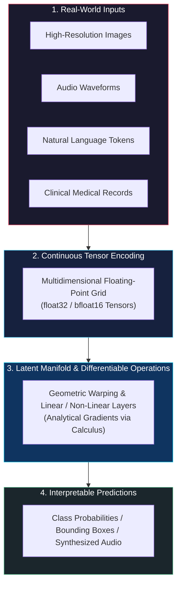
```mermaid
flowchart TD
    subgraph Inputs["1. Real-World Inputs"]
        I1["High-Resolution Images"]
        I2["Audio Waveforms"]
        I3["Natural Language Tokens"]
        I4["Clinical Medical Records"]
    end

    subgraph Encoding["2. Continuous Tensor Encoding"]
        E["Multidimensional Floating-Point Grid\n(float32 / bfloat16 Tensors)"]
    end

    subgraph Manifold["3. Latent Manifold & Differentiable Operations"]
        M["Geometric Warping & Linear / Non-Linear Layers\n(Analytical Gradients via Calculus)"]
    end

    subgraph Target["4. Interpretable Predictions"]
        O["Class Probabilities / Bounding Boxes / Synthesized Audio"]
    end

    Inputs --> Encoding --> Manifold --> Target

    style Inputs fill:#1a1a2e,stroke:#e94560,color:#fff
    style Encoding fill:#16213e,stroke:#4cc9f0,color:#fff
    style Manifold fill:#0f3460,stroke:#00b4d8,color:#fff
    style Target fill:#1b262c,stroke:#52b788,color:#fff
```

Floating-point numbers allow neural networks to compute infinitesimally small directional updates via calculus. When an image pixel changes slightly in intensity, the corresponding model loss changes continuously:

$$ \lim\_{\Delta x \to 0} \frac{f(x + \Delta x) - f(x)}{\Delta x} = \frac{\partial f}{\partial x} $$

Because floating-point numbers approximate real numbers ($\mathbb{R}$), gradient descent can smoothly steer millions of model weights toward low-loss configurations on a high-dimensional loss surface.


<figure style="display:flex; justify-content: center; margin: 25px 0;">
  <div style="text-align: center;">
    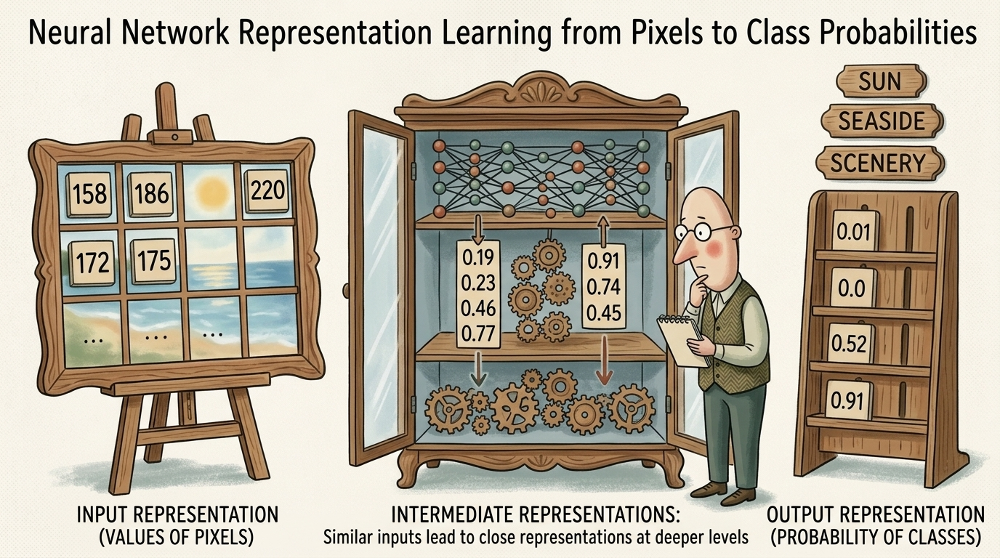
    <figcaption style="margin-top: 0.6em; text-align: center; font-size: 13px; color: #888;"><em>Transformation of continuous sensory inputs (pixel values) into intermediate representations and final class probability distributions.</em></figcaption>
  </div>
</figure>

> **Key Insight:** Deep learning models are continuous function approximators. Tensors of floating-point numbers provide the substrate upon which differentiable optimization operates.

---

## 2. Tensors: Multidimensional Arrays

At a mathematical level, a scalar is a 0D tensor, a vector is a 1D tensor, a matrix is a 2D tensor, and an array with three or more axes is an N-dimensional tensor.

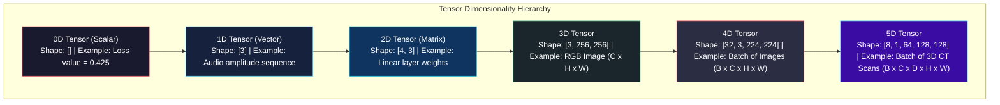
```mermaid
flowchart TD
    subgraph DimensionHierarchy["Tensor Dimensionality Hierarchy"]
        D0["0D Tensor (Scalar)\nShape: [] | Example: Loss value = 0.425"]
        D1["1D Tensor (Vector)\nShape: [3] | Example: Audio amplitude sequence"]
        D2["2D Tensor (Matrix)\nShape: [4, 3] | Example: Linear layer weights"]
        D3["3D Tensor\nShape: [3, 256, 256] | Example: RGB Image (C x H x W)"]
        D4["4D Tensor\nShape: [32, 3, 224, 224] | Example: Batch of Images (B x C x H x W)"]
        D5["5D Tensor\nShape: [8, 1, 64, 128, 128] | Example: Batch of 3D CT Scans (B x C x D x H x W)"]
    end

    D0 --> D1 --> D2 --> D3 --> D4 --> D5

    style D0 fill:#1a1a2e,stroke:#e94560,color:#fff
    style D1 fill:#16213e,stroke:#4cc9f0,color:#fff
    style D2 fill:#0f3460,stroke:#00b4d8,color:#fff
    style D3 fill:#1b262c,stroke:#52b788,color:#fff
    style D4 fill:#2b2d42,stroke:#e94560,color:#fff
    style D5 fill:#3a0ca3,stroke:#4cc9f0,color:#fff
```


<figure style="display:flex; justify-content: center; margin: 25px 0;">
  <div style="text-align: center;">
    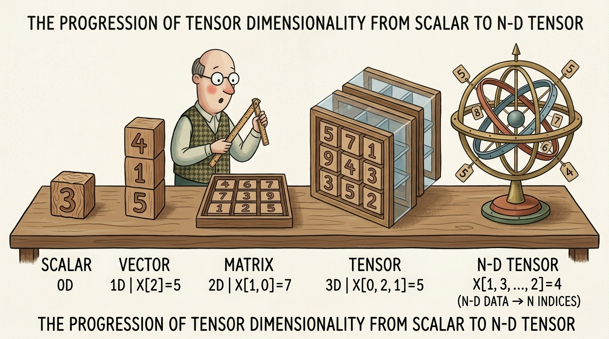
    <figcaption style="margin-top: 0.6em; text-align: center; font-size: 13px; color: #888;"><em>Progression of tensor dimensionality: from 0D scalars and 1D vectors to 2D matrices, 3D spatial grids, and N-dimensional tensors.</em></figcaption>
  </div>
</figure>

### 2.1 From Python Lists to PyTorch Tensors

Why not simply use native Python lists (`list`) of numbers? Python is an interpreted, dynamically typed language. In a native Python list:
1. Every number is wrapped in a full `PyObject` structure on the heap (**boxed representation**), consuming up to 24–28 bytes for a single 64-bit integer or float.
2. The list itself is an array of memory pointers pointing to scattered heap locations. Accessing elements requires pointer dereferencing, causing massive **CPU cache misses**.
3. Python lists cannot be executed on SIMD vector registers or dispatched to GPU compute cores.

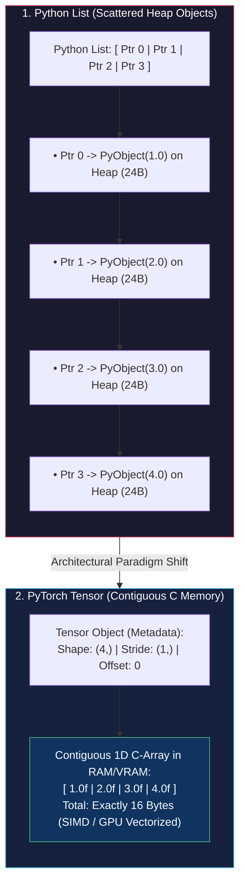
```mermaid
flowchart TD
    subgraph PythonList["1. Python List (Scattered Heap Objects)"]
        direction TB
        L["Python List: [ Ptr 0 | Ptr 1 | Ptr 2 | Ptr 3 ]"]
        P0["• Ptr 0 -> PyObject(1.0) on Heap (24B)"]
        P1["• Ptr 1 -> PyObject(2.0) on Heap (24B)"]
        P2["• Ptr 2 -> PyObject(3.0) on Heap (24B)"]
        P3["• Ptr 3 -> PyObject(4.0) on Heap (24B)"]
        L --> P0 --> P1 --> P2 --> P3
    end

    subgraph PyTorchTensor["2. PyTorch Tensor (Contiguous C Memory)"]
        direction TB
        T["Tensor Object (Metadata):<br/>Shape: (4,) | Stride: (1,) | Offset: 0"]
        S["Contiguous 1D C-Array in RAM/VRAM:<br/>[ 1.0f | 2.0f | 3.0f | 4.0f ]<br/>Total: Exactly 16 Bytes (SIMD / GPU Vectorized)"]
        T --> S
    end

    PythonList -->|Architectural Paradigm Shift| PyTorchTensor

    style PythonList fill:#1a1a2e,stroke:#e94560,color:#fff
    style PyTorchTensor fill:#16213e,stroke:#4cc9f0,color:#fff
    style S fill:#0f3460,stroke:#52b788,color:#fff
```


<figure style="display:flex; justify-content: center; margin: 25px 0;">
  <div style="text-align: center;">
    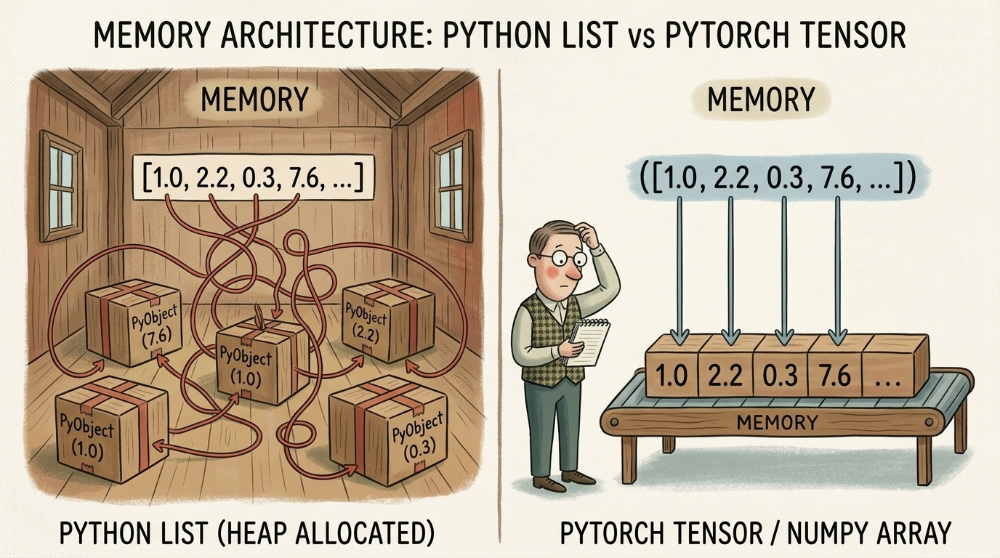
    <figcaption style="margin-top: 0.6em; text-align: center; font-size: 13px; color: #888;"><em>Memory layout comparison: scattered heap-allocated boxed objects in Python lists vs. contiguous, unboxed 1D C arrays in PyTorch tensors.</em></figcaption>
  </div>
</figure>

In contrast, a PyTorch `torch.Tensor` stores raw, unboxed binary values directly in a contiguous block of memory allocated in C/C++ memory. A 1,000,000-element `float32` tensor occupies exactly $1{,}000{,}000 \times 4 \text{ bytes} = 4 \text{ MB}$, loaded cleanly into CPU L1/L2/L3 caches and vectorized via AVX-512 or CUDA cores.

### 2.2 Constructing Our First Tensors

Let us initialize our first PyTorch tensors using primary creation factory functions. We specify dimensions and verify their shapes, element counts, and dimensions.

First, import PyTorch and construct a 1D tensor from a native Python list:

```python
import torch

# Construct a 1D tensor from a Python list
a = torch.tensor([1.0, 2.0, 3.0])
print(f"Tensor a: {a}")
print(f"Shape: {a.shape} | Number of elements: {a.numel()} | Dimension rank: {a.dim()}")
```

Next, create multidimensional tensors populated with constant values (ones, zeros, or uniform random values) without allocating intermediate Python lists:

```python
# Create a 2D tensor of ones with 3 rows and 2 columns
ones_2d = torch.ones(3, 2)
print(f"2D Ones Tensor (3x2):\n{ones_2d}")

# Create a 3D tensor of zeros representing 2 channels of 4x4 spatial grids
zeros_3d = torch.zeros(2, 4, 4)
print(f"3D Zeros Tensor (2x4x4) shape: {zeros_3d.shape}")
```

---

## 3. Indexing and Slicing Tensors

PyTorch tensors support the complete Python slicing syntax, identical to NumPy arrays. Slicing along multiple dimensions allows sub-region extraction, row/column slicing, and negative indexing.

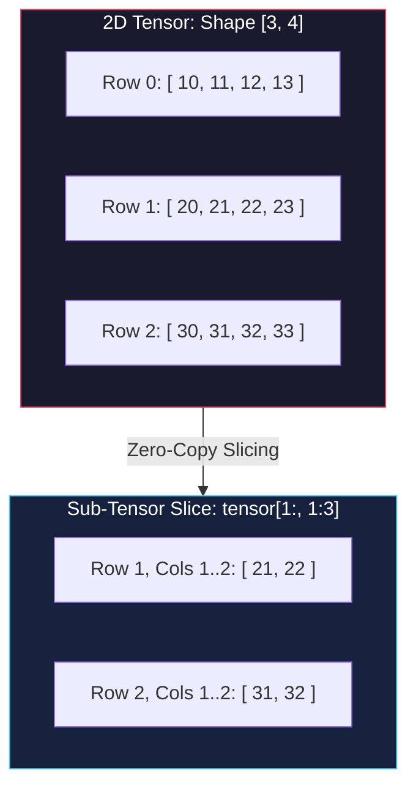
```mermaid
flowchart TD
    subgraph Matrix2D["2D Tensor: Shape [3, 4]"]
        R0["Row 0: [ 10,  11,  12,  13 ]"]
        R1["Row 1: [ 20,  21,  22,  23 ]"]
        R2["Row 2: [ 30,  31,  32,  33 ]"]
    end

    subgraph SliceExtraction["Sub-Tensor Slice: tensor[1:, 1:3]"]
        S0["Row 1, Cols 1..2: [ 21,  22 ]"]
        S1["Row 2, Cols 1..2: [ 31,  32 ]"]
    end

    Matrix2D -->|Zero-Copy Slicing| SliceExtraction

    style Matrix2D fill:#1a1a2e,stroke:#e94560,color:#fff
    style SliceExtraction fill:#16213e,stroke:#4cc9f0,color:#fff
```

Let us construct a $3 \times 4$ matrix and extract sub-tensors using multidimensional slicing:

```python
# Construct a 3x4 tensor with sequential values from 1 to 12
grid = torch.arange(1, 13, dtype=torch.float32).reshape(3, 4)
print(f"Original 3x4 grid:\n{grid}")

# Extract a single scalar element at row index 1, column index 2
element = grid[1, 2]
print(f"Element at row 1, col 2: {element.item()}")

# Extract all rows for column 0 (1D slice)
first_column = grid[:, 0]
print(f"First column (all rows, col 0): {first_column}")

# Extract a 2x2 sub-matrix: rows 1 to end, columns 1 to 3 (exclusive)
sub_grid = grid[1:, 1:3]
print(f"Sub-matrix grid[1:, 1:3]:\n{sub_grid}")
```

---

## 4. Broadcasting Mechanics

When performing element-wise arithmetic operations between two tensors of differing dimensions, PyTorch automatically applies **broadcasting rules** (inherited from NumPy). Broadcasting virtually expands singleton dimensions (dimensions of size 1) without physically duplicating memory in RAM or VRAM.

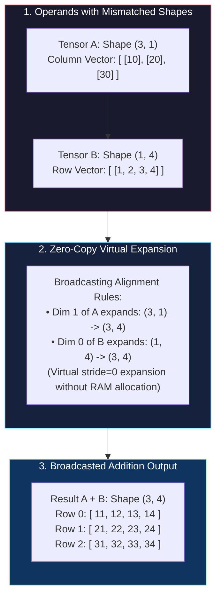
```mermaid
flowchart TD
    subgraph Inputs["1. Operands with Mismatched Shapes"]
        direction TB
        A["Tensor A: Shape (3, 1)<br/>Column Vector: [ [10], [20], [30] ]"]
        B["Tensor B: Shape (1, 4)<br/>Row Vector: [ [1, 2, 3, 4] ]"]
        A --> B
    end

    subgraph Expansion["2. Zero-Copy Virtual Expansion"]
        direction TB
        EXP["Broadcasting Alignment Rules:<br/>• Dim 1 of A expands: (3, 1) -> (3, 4)<br/>• Dim 0 of B expands: (1, 4) -> (3, 4)<br/>(Virtual stride=0 expansion without RAM allocation)"]
    end

    subgraph Result["3. Broadcasted Addition Output"]
        direction TB
        OUT["Result A + B: Shape (3, 4)<br/>Row 0: [ 11, 12, 13, 14 ]<br/>Row 1: [ 21, 22, 23, 24 ]<br/>Row 2: [ 31, 32, 33, 34 ]"]
    end

    Inputs --> Expansion --> Result

    style Inputs fill:#1a1a2e,stroke:#e94560,color:#fff
    style Expansion fill:#16213e,stroke:#4cc9f0,color:#fff
    style Result fill:#0f3460,stroke:#52b788,color:#fff
```

### The Two Rules of Broadcasting:
1. **Dimension Alignment:** Alignment begins from the **trailing (rightmost) dimension** and works backwards to the leading dimension.
2. **Compatibility Condition:** Two dimensions are compatible if:
   - They are equal in size, or
   - One of them is equal to $1$, or
   - One of the dimensions does not exist (prepended virtually with size $1$).

Let us demonstrate broadcasting in practice:

```python
# Construct a (3, 1) column vector
col_vector = torch.tensor([[10.0], [20.0], [30.0]])
print(f"col_vector shape: {col_vector.shape}")

# Construct a (1, 4) row vector
row_vector = torch.tensor([[1.0, 2.0, 3.0, 4.0]])
print(f"row_vector shape: {row_vector.shape}")

# Broadcasted addition produces a (3, 4) matrix with zero data replication
broadcasted_sum = col_vector + row_vector
print(f"Broadcasted result shape: {broadcasted_sum.shape}")
print(f"Broadcasted result values:\n{broadcasted_sum}")
```

---

## 5. Named Tensors and Modern Dimension Manipulation (`einops`)

In production deep learning pipelines with 4D or 5D tensors (e.g. `[Batch, Channel, Height, Width]` in Computer Vision or `[Batch, Sequence, Heads, HeadDim]` in Transformers), indexing by positional integers (such as `x.transpose(1, 2)`) frequently causes subtle transposition bugs.

PyTorch introduced **Named Tensors** as an experimental feature allowing dimensions to be tagged with explicit string identifiers:

```python
# Create a 4D tensor with explicit dimension names (Experimental PyTorch API)
images = torch.zeros(2, 3, 28, 28, names=('batch', 'channels', 'rows', 'cols'))
print(f"Named Tensor dimensions: {images.names}")

# Reorder dimensions using align_to without memorizing integer axis indices
reordered_images = images.align_to('batch', 'rows', 'cols', 'channels')
print(f"Reordered tensor dimensions: {reordered_images.names}")
print(f"Reordered tensor shape: {reordered_images.shape}")
```

### 5.1 The Modern Industry Standard: `einops`

While native Named Tensors provided a compelling concept, they remained experimental with limited PyTorch operator support. In modern deep learning (PyTorch 2.x+) and production Vision Transformer / LLM codebases, the undisputed industry standard for dimension manipulation is **`einops`** (`from einops import rearrange, reduce, repeat`).

`einops` provides expressive, declarative, and self-documenting tensor transformations across PyTorch, JAX, and TensorFlow:

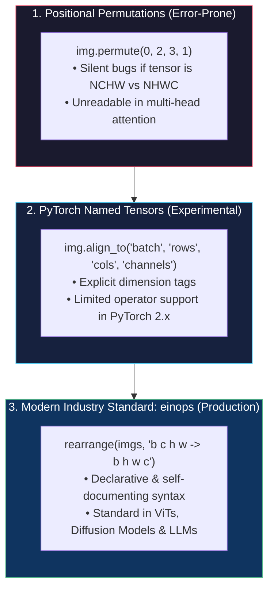
```mermaid
flowchart TD
    subgraph Positional["1. Positional Permutations (Error-Prone)"]
        direction TB
        P["img.permute(0, 2, 3, 1)<br/>• Silent bugs if tensor is NCHW vs NHWC<br/>• Unreadable in multi-head attention"]
    end

    subgraph NamedNative["2. PyTorch Named Tensors (Experimental)"]
        direction TB
        N["img.align_to('batch', 'rows', 'cols', 'channels')<br/>• Explicit dimension tags<br/>• Limited operator support in PyTorch 2.x"]
    end

    subgraph EinopsModern["3. Modern Industry Standard: einops (Production)"]
        direction TB
        E["rearrange(imgs, 'b c h w -> b h w c')<br/>• Declarative & self-documenting syntax<br/>• Standard in ViTs, Diffusion Models & LLMs"]
    end

    Positional --> NamedNative --> EinopsModern

    style Positional fill:#1a1a2e,stroke:#e94560,color:#fff
    style NamedNative fill:#16213e,stroke:#4cc9f0,color:#fff
    style EinopsModern fill:#0f3460,stroke:#52b788,color:#fff
```

Let us demonstrate dimension rearrangement using `einops`:

```python
# %pip install einops
import torch
from einops import rearrange

# 1. Construct input tensor in NCHW format
imgs = torch.randn(2, 3, 28, 28)

# 2. Declare dimension names and transform to target layout (NCHW -> NHWC)
imgs_reordered = rearrange(imgs, 'batch channels rows cols -> batch rows cols channels')

print("Original Shape :", imgs.shape)          # torch.Size([2, 3, 28, 28])
print("Reordered Shape:", imgs_reordered.shape)  # torch.Size([2, 28, 28, 3])
```

---

## 6. Tensor Element Types (`dtype`)

A tensor's numeric representation is determined by its **`dtype`** (data type). Choosing the appropriate precision format is crucial for balancing mathematical precision, memory consumption, and GPU arithmetic throughput.

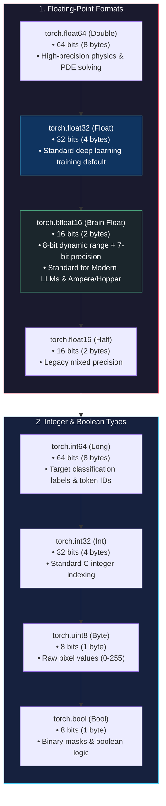
```mermaid
flowchart TD
    subgraph FloatingTypes["1. Floating-Point Formats"]
        direction TB
        F64["torch.float64 (Double)<br/>• 64 bits (8 bytes)<br/>• High-precision physics & PDE solving"]
        F32["torch.float32 (Float)<br/>• 32 bits (4 bytes)<br/>• Standard deep learning training default"]
        BF16["torch.bfloat16 (Brain Float)<br/>• 16 bits (2 bytes)<br/>• 8-bit dynamic range + 7-bit precision<br/>• Standard for Modern LLMs & Ampere/Hopper"]
        F16["torch.float16 (Half)<br/>• 16 bits (2 bytes)<br/>• Legacy mixed precision"]
        F64 --> F32 --> BF16 --> F16
    end

    subgraph IntegerTypes["2. Integer & Boolean Types"]
        direction TB
        I64["torch.int64 (Long)<br/>• 64 bits (8 bytes)<br/>• Target classification labels & token IDs"]
        I32["torch.int32 (Int)<br/>• 32 bits (4 bytes)<br/>• Standard C integer indexing"]
        U8["torch.uint8 (Byte)<br/>• 8 bits (1 byte)<br/>• Raw pixel values (0-255)"]
        B1["torch.bool (Bool)<br/>• 8 bits (1 byte)<br/>• Binary masks & boolean logic"]
        I64 --> I32 --> U8 --> B1
    end

    FloatingTypes --> IntegerTypes

    style FloatingTypes fill:#1a1a2e,stroke:#e94560,color:#fff
    style IntegerTypes fill:#16213e,stroke:#4cc9f0,color:#fff
    style F32 fill:#0f3460,stroke:#4cc9f0,color:#fff
    style BF16 fill:#1b262c,stroke:#52b788,color:#fff
```

### 6.1 Precision Comparison Table

| Data Type | PyTorch Type Name | Size in Bytes | Dynamic Range (Exponent) | Numerical Precision (Mantissa) | Typical Application |
| :--- | :--- | :--- | :--- | :--- | :--- |
| **Double** | `torch.float64` / `torch.double` | 8 bytes (64 bits) | 11 bits | 52 bits | High-precision physics & PDE solving |
| **Float** | `torch.float32` / `torch.float` | 4 bytes (32 bits) | 8 bits | 23 bits | Standard training default |
| **Bfloat16** | `torch.bfloat16` | 2 bytes (16 bits) | 8 bits (same as fp32) | 7 bits | Modern LLM / Transformer mixed precision |
| **Half** | `torch.float16` / `torch.half` | 2 bytes (16 bits) | 5 bits | 10 bits | Legacy GPU mixed precision (requires loss scaling) |
| **Long** | `torch.int64` / `torch.long` | 8 bytes (64 bits) | N/A | N/A | Target labels, embedding lookup indices |
| **Byte** | `torch.uint8` | 1 byte (8 bits) | N/A | N/A | Raw uint8 image datasets ($0 \dots 255$) |

### 6.2 Managing and Casting `dtype`

Let us inspect the default `dtype` and convert between precision formats using `.to()` and convenient casting aliases:

```python
# Default float tensor creation uses float32
default_float = torch.tensor([1.0, 2.0, 3.0])
print(f"Default float dtype: {default_float.dtype}")

# Explicitly cast to bfloat16 for high-throughput memory-efficient training
bf16_tensor = default_float.to(dtype=torch.bfloat16)
print(f"Cast to bfloat16: {bf16_tensor.dtype} | Element size: {bf16_tensor.element_size()} bytes")

# Integer casting for target classification labels
int_labels = torch.tensor([0, 2, 1], dtype=torch.int64)
print(f"Classification labels dtype: {int_labels.dtype}")
```

---

## 7. The Tensor API & Operation Semantics

The PyTorch Tensor API provides hundreds of operators spanning mathematical functions, linear algebra routines, and shape reductions.


<figure style="display:flex; justify-content: center; margin: 25px 0;">
  <div style="text-align: center;">
    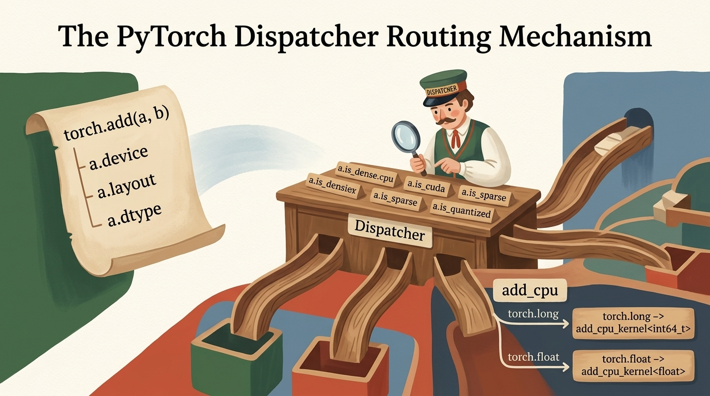
    <figcaption style="margin-top: 0.6em; text-align: center; font-size: 13px; color: #888;"><em>The PyTorch Dispatcher architecture: dynamically routing tensor operations to specialized CPU/CUDA C++ kernels based on device, layout, and dtype.</em></figcaption>
  </div>
</figure>

### 7.1 Mathematical Functions and Dimensional Reductions

Most mathematical operations (`torch.sin`, `torch.exp`, `torch.sqrt`, etc.) operate element-wise. Reduction operations like `torch.mean` and `torch.sum` allow collapsing specific axes using the `dim` parameter.

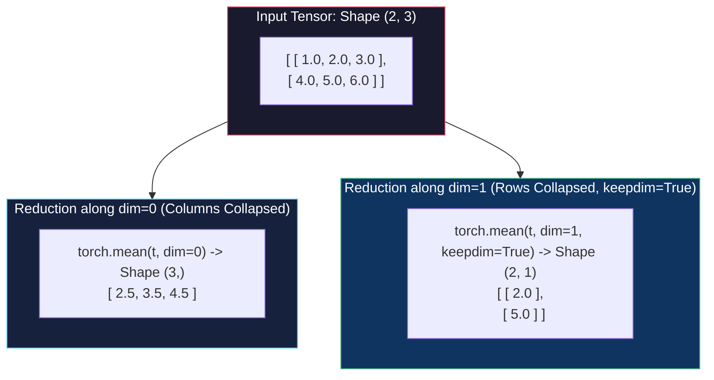
```mermaid
flowchart TD
    subgraph MatrixInput["Input Tensor: Shape (2, 3)"]
        M0["[ [ 1.0, 2.0, 3.0 ],\n  [ 4.0, 5.0, 6.0 ] ]"]
    end

    subgraph Dim0["Reduction along dim=0 (Columns Collapsed)"]
        D0["torch.mean(t, dim=0) -> Shape (3,)\n[ 2.5, 3.5, 4.5 ]"]
    end

    subgraph Dim1["Reduction along dim=1 (Rows Collapsed, keepdim=True)"]
        D1["torch.mean(t, dim=1, keepdim=True) -> Shape (2, 1)\n[ [ 2.0 ],\n  [ 5.0 ] ]"]
    end

    MatrixInput --> Dim0
    MatrixInput --> Dim1

    style MatrixInput fill:#1a1a2e,stroke:#e94560,color:#fff
    style Dim0 fill:#16213e,stroke:#4cc9f0,color:#fff
    style Dim1 fill:#0f3460,stroke:#52b788,color:#fff
```

Let us compute dimensional reductions:

```python
# Construct a 2x3 matrix
matrix = torch.tensor([[1.0, 2.0, 3.0], [4.0, 5.0, 6.0]])

# Reduce along dimension 0 (collapse rows -> compute column averages)
mean_dim0 = torch.mean(matrix, dim=0)
print(f"Mean across dim=0: {mean_dim0} | Shape: {mean_dim0.shape}")

# Reduce along dimension 1 with keepdim=True (preserves 2D rank)
mean_dim1_kept = torch.mean(matrix, dim=1, keepdim=True)
print(f"Mean across dim=1 (keepdim=True):\n{mean_dim1_kept} | Shape: {mean_dim1_kept.shape}")
```

### 7.2 In-Place Operations (`_` Suffix)

Any operation in PyTorch that ends with a trailing underscore (such as `.zero_()`, `.add_()`, `.mul_()`, `.copy_()`) mutates the tensor's underlying memory **in-place** rather than allocating a new tensor.

> [!WARNING]
> **Autograd In-Place Safety Rule:** In-place operations mutate memory buffers directly. If an in-place modification overwrites a tensor value required later during the backward pass for gradient computation, PyTorch's Autograd engine will throw a runtime error. Use in-place operations with caution in differentiable computational graphs.

```python
# Create a tensor and mutate its values in-place
x = torch.ones(2, 2)
print(f"Original x:\n{x}")

# Add 5 to every element in-place
x.add_(5.0)
print(f"x after x.add_(5.0):\n{x}")

# In-place zeroing out of the entire tensor
x.zero_()
print(f"x after x.zero_():\n{x}")
```

---

## 8. Tensors: Scenic Views of Storage

To master PyTorch performance, one must understand how memory is physically structured. A `torch.Tensor` is fundamentally a lightweight **view object** containing metadata (`shape`, `stride`, `storage_offset`, `dtype`, `device`), which references a single contiguous 1D memory array: the **`Storage`** buffer.

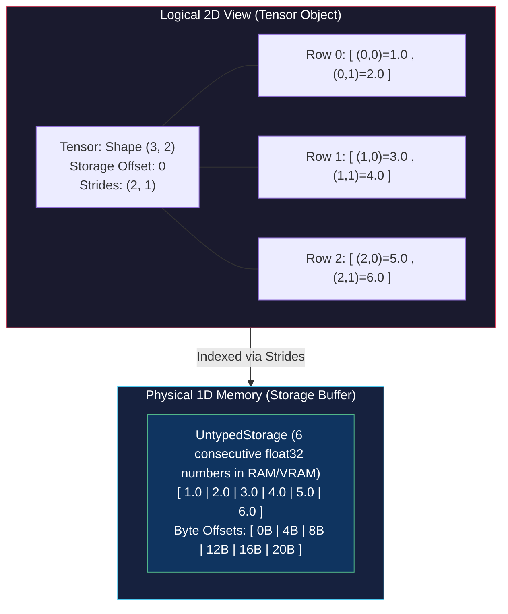
```mermaid
flowchart TD
    subgraph LogicalView["Logical 2D View (Tensor Object)"]
        T["Tensor: Shape (3, 2)\nStorage Offset: 0\nStrides: (2, 1)"]
        R0["Row 0: [ (0,0)=1.0 , (0,1)=2.0 ]"]
        R1["Row 1: [ (1,0)=3.0 , (1,1)=4.0 ]"]
        R2["Row 2: [ (2,0)=5.0 , (2,1)=6.0 ]"]
        T --- R0 & R1 & R2
    end

    subgraph PhysicalMemory["Physical 1D Memory (Storage Buffer)"]
        S["UntypedStorage (6 consecutive float32 numbers in RAM/VRAM)\n[ 1.0 | 2.0 | 3.0 | 4.0 | 5.0 | 6.0 ]\nByte Offsets: [ 0B | 4B | 8B | 12B | 16B | 20B ]"]
    end

    LogicalView -->|Indexed via Strides| PhysicalMemory

    style LogicalView fill:#1a1a2e,stroke:#e94560,color:#fff
    style PhysicalMemory fill:#16213e,stroke:#4cc9f0,color:#fff
    style S fill:#0f3460,stroke:#52b788,color:#fff
```


<figure style="display:flex; justify-content: center; margin: 25px 0;">
  <div style="text-align: center;">
    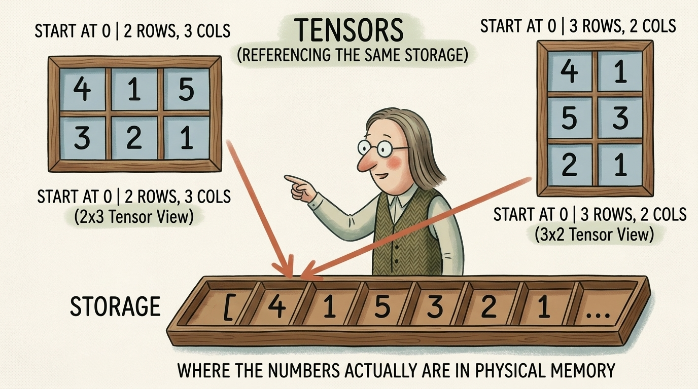
    <figcaption style="margin-top: 0.6em; text-align: center; font-size: 13px; color: #888;"><em>Multiple distinct multidimensional tensor views referencing the exact same underlying 1D contiguous physical Storage buffer.</em></figcaption>
  </div>
</figure>

### 8.1 Inspecting the Underlying 1D Storage (`UntypedStorage` in PyTorch 2.x)

Let us inspect the storage buffer of a 2D tensor using `.untyped_storage()`:

```python
# Construct a 2D tensor of shape (3, 2)
points = torch.tensor([[1.0, 2.0], [3.0, 4.0], [5.0, 6.0]])
print(f"Tensor points (3x2):
{points}")

# Access the physical 1D storage
points_storage = points.untyped_storage()
print(f"Physical 1D Storage byte size: {len(points_storage)} bytes")
print(f"Storage raw byte contents: {[points_storage[i] for i in range(len(points_storage))]}")
```

> [!NOTE]
> **PyTorch 2.x `UntypedStorage` Architecture:**  
> In older PyTorch versions, `points.storage()` returned a type-aware storage (such as `FloatStorage`). In modern PyTorch 2.x+, `.untyped_storage()` manages raw binary bytes (`uint8`). Consequently, `len(points_storage)` returns the **total number of bytes** ($6 \text{ float32 elements} \times 4 \text{ bytes} = 24 \text{ bytes}$), not the logical element count.

### 8.2 Modifying Storage Mutates All Views

Because multiple tensor views point to the exact same physical storage buffer, mutating values through one view or directly in storage immediately alters all other views sharing that storage.

When indexing `UntypedStorage` directly, values must be assigned as integer bytes ($0 \dots 255$ `int`). Alternatively, mutating via any logical tensor view updates the float representation across all sharing views:

```python
# 1. Mutating the underlying storage byte directly (must be an integer byte 0-255 in PyTorch 2.x)
points_storage[0] = 99

# 2. Or mutating via a tensor view (floating-point mutation)
points[0, 0] = 99.0

# The 2D tensor view and all shared views reflect the change immediately
print(f"Points tensor after mutation:
{points}")
```

---

## 9. Tensor Metadata: Size, Storage Offset, and Strides

How does PyTorch translate a multidimensional coordinate $(i\_0, i\_1, \dots, i\_{n-1})$ into a 1D flat storage index? It evaluates the **stride linear mapping equation**:

$$ \text{Physical Storage Offset} = \text{storage\\_offset} + \sum\_{k=0}^{n-1} i\_k \cdot \text{stride}[k] $$

Where:
- $\text{storage\\_offset}$: The index in the 1D storage corresponding to the first element of the tensor $(0, 0, \dots, 0)$.
- $\text{stride}[k]$: The number of physical 1D elements one must skip in memory to advance by 1 unit along dimension $k$.

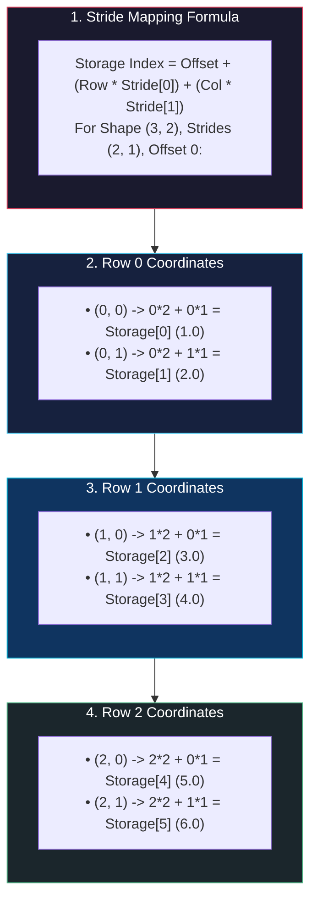
```mermaid
flowchart TD
    subgraph StrideFormula["1. Stride Mapping Formula"]
        direction TB
        F["Storage Index = Offset + (Row * Stride[0]) + (Col * Stride[1])<br/>For Shape (3, 2), Strides (2, 1), Offset 0:"]
    end

    subgraph Row0["2. Row 0 Coordinates"]
        direction TB
        R0["• (0, 0) -> 0*2 + 0*1 = Storage[0] (1.0)<br/>• (0, 1) -> 0*2 + 1*1 = Storage[1] (2.0)"]
    end

    subgraph Row1["3. Row 1 Coordinates"]
        direction TB
        R1["• (1, 0) -> 1*2 + 0*1 = Storage[2] (3.0)<br/>• (1, 1) -> 1*2 + 1*1 = Storage[3] (4.0)"]
    end

    subgraph Row2["4. Row 2 Coordinates"]
        direction TB
        R2["• (2, 0) -> 2*2 + 0*1 = Storage[4] (5.0)<br/>• (2, 1) -> 2*2 + 1*1 = Storage[5] (6.0)"]
    end

    StrideFormula --> Row0 --> Row1 --> Row2

    style StrideFormula fill:#1a1a2e,stroke:#e94560,color:#fff
    style Row0 fill:#16213e,stroke:#4cc9f0,color:#fff
    style Row1 fill:#0f3460,stroke:#00b4d8,color:#fff
    style Row2 fill:#1b262c,stroke:#52b788,color:#fff
```


<figure style="display:flex; justify-content: center; margin: 25px 0;">
  <div style="text-align: center;">
    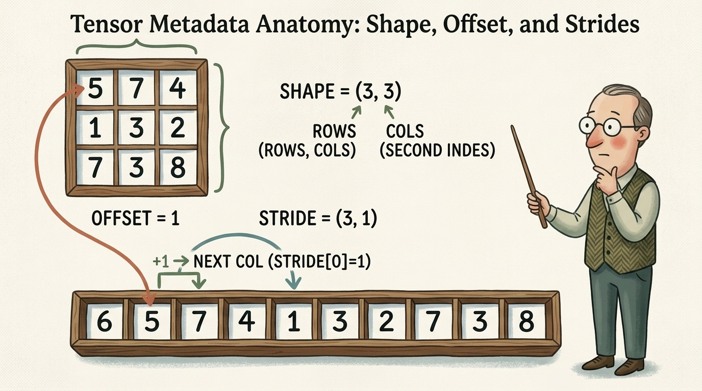
    <figcaption style="margin-top: 0.6em; text-align: center; font-size: 13px; color: #888;"><em>Tensor metadata anatomy: mapping 2D matrix coordinates to 1D physical storage offsets via storage offset and row/column strides.</em></figcaption>
  </div>
</figure>

### 9.1 Slicing Creates Sub-Tensor Views (Zero Memory Allocation)

When we slice a tensor (e.g. `second_point = points[1]`), PyTorch does **not** allocate new memory or copy data. It merely creates a new `torch.Tensor` header pointing to the same storage with an updated `storage_offset`:

```python
# Construct points tensor
points = torch.tensor([[1.0, 2.0], [3.0, 4.0], [5.0, 6.0]])

# Extract the second row (index 1)
second_point = points[1]

print(f"second_point values: {second_point}")
print(f"second_point shape: {second_point.shape}")
print(f"second_point storage_offset: {second_point.storage_offset()}")
print(f"second_point stride: {second_point.stride()}")

# Verify that points and second_point share the exact same underlying storage pointer
print(f"Shared storage: {points.untyped_storage().data_ptr() == second_point.untyped_storage().data_ptr()}")
```

### 9.2 Transposing Without Copying (Zero-Copy Transposition)

To transpose a 2D matrix from shape $(M, N)$ to $(N, M)$, PyTorch does **not** reorder numbers in RAM. It simply **swaps the strides** of dimension 0 and dimension 1:

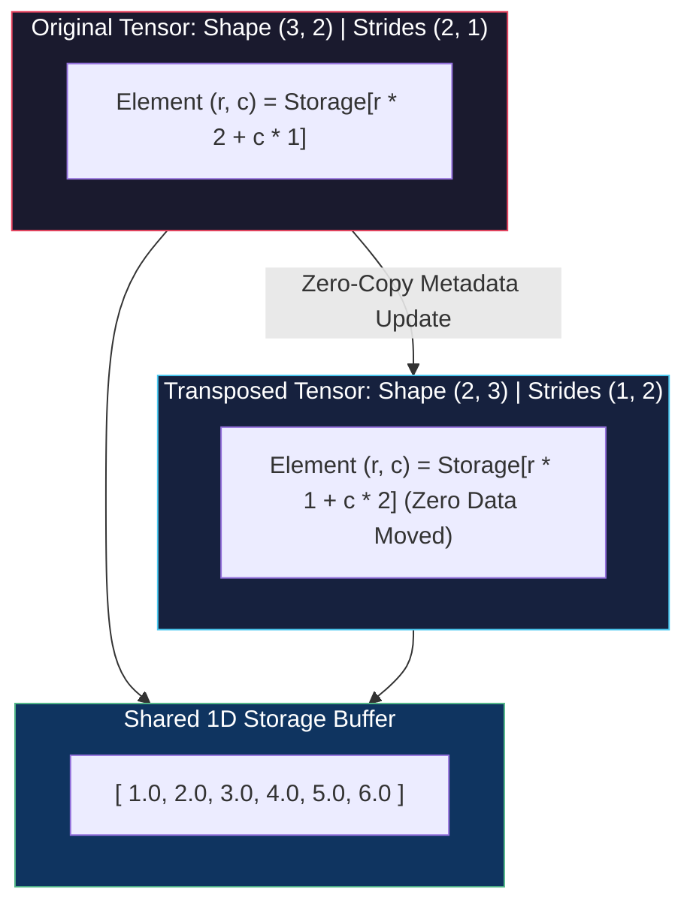
```mermaid
flowchart TD
    subgraph OriginalTensor["Original Tensor: Shape (3, 2) | Strides (2, 1)"]
        O_desc["Element (r, c) = Storage[r * 2 + c * 1]"]
    end

    subgraph TransposedTensor["Transposed Tensor: Shape (2, 3) | Strides (1, 2)"]
        T_desc["Element (r, c) = Storage[r * 1 + c * 2] (Zero Data Moved)"]
    end

    subgraph SameStorage["Shared 1D Storage Buffer"]
        S["[ 1.0, 2.0, 3.0, 4.0, 5.0, 6.0 ]"]
    end

    OriginalTensor -->|Zero-Copy Metadata Update| TransposedTensor
    OriginalTensor --> SameStorage
    TransposedTensor --> SameStorage

    style OriginalTensor fill:#1a1a2e,stroke:#e94560,color:#fff
    style TransposedTensor fill:#16213e,stroke:#4cc9f0,color:#fff
    style SameStorage fill:#0f3460,stroke:#52b788,color:#fff
```


<figure style="display:flex; justify-content: center; margin: 25px 0;">
  <div style="text-align: center;">
    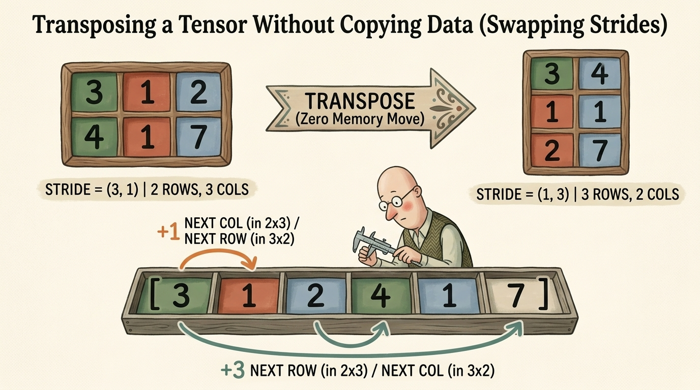
    <figcaption style="margin-top: 0.6em; text-align: center; font-size: 13px; color: #888;"><em>Zero-copy matrix transposition: swapping stride dimensions allows reinterpreting row and column order over unchanged physical storage.</em></figcaption>
  </div>
</figure>

Let us verify transposition strides in Python:

```python
# Original 3x2 tensor
points = torch.tensor([[1.0, 2.0], [3.0, 4.0], [5.0, 6.0]])
print(f"points shape: {points.shape} | stride: {points.stride()}")

# Transpose the 2D tensor
points_t = points.t()
print(f"points_t shape: {points_t.shape} | stride: {points_t.stride()}")
print(f"points_t values:\n{points_t}")

# Verify data pointer identity
print(f"Memory shared: {points.data_ptr() == points_t.data_ptr()}")
```

### 9.3 Higher-Dimensional Transposition (`.permute()` & `.transpose()`)

For tensors with 3 or more dimensions, `torch.transpose` swaps two specified dimensions, while `.permute()` reorders all axes simultaneously:

```python
# Create a 3D tensor of shape (2, 3, 4)
tensor_3d = torch.zeros(2, 3, 4)
print(f"tensor_3d shape: {tensor_3d.shape} | stride: {tensor_3d.stride()}")

# Permute dimensions to (4, 2, 3)
permuted_3d = tensor_3d.permute(2, 0, 1)
print(f"permuted_3d shape: {permuted_3d.shape} | stride: {permuted_3d.stride()}")
```

### 9.4 Memory Contiguity (`.is_contiguous()` and `.contiguous()`)

A tensor is defined as **C-contiguous** (row-major order) if traversing elements in sequential index order visits physical 1D storage elements in strict sequential order $0, 1, 2, \dots$ without jumps.

When a tensor is transposed, its strides are swapped, making the layout **non-contiguous**. Many high-performance operations (such as `.view()`, FFTs, and CUDA custom kernels) require contiguous memory layouts.

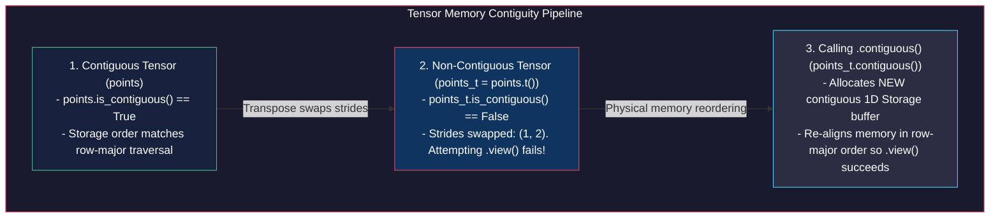
```mermaid
flowchart TD
    subgraph ContiguityFlow["Tensor Memory Contiguity Pipeline"]
        C["1. Contiguous Tensor (points)\n- points.is_contiguous() == True\n- Storage order matches row-major traversal"]
        N["2. Non-Contiguous Tensor (points_t = points.t())\n- points_t.is_contiguous() == False\n- Strides swapped: (1, 2). Attempting .view() fails!"]
        R["3. Calling .contiguous() (points_t.contiguous())\n- Allocates NEW contiguous 1D Storage buffer\n- Re-aligns memory in row-major order so .view() succeeds"]
    end

    C -->|Transpose swaps strides| N -->|Physical memory reordering| R

    style ContiguityFlow fill:#1a1a2e,stroke:#e94560,color:#fff
    style C fill:#16213e,stroke:#52b788,color:#fff
    style N fill:#0f3460,stroke:#e94560,color:#fff
    style R fill:#2b2d42,stroke:#4cc9f0,color:#fff
```

Let us examine contiguity in code:

```python
# Check contiguity of original and transposed tensors
print(f"points.is_contiguous(): {points.is_contiguous()}")
print(f"points_t.is_contiguous(): {points_t.is_contiguous()}")

# Attempting .view() on a non-contiguous tensor raises a RuntimeError
try:
    points_t.view(6)
except RuntimeError as e:
    print(f"Expected view error on non-contiguous tensor: {e}")

# .contiguous() copies elements into a fresh, contiguous storage buffer
points_t_cont = points_t.contiguous()
print(f"points_t_cont.is_contiguous(): {points_t_cont.is_contiguous()}")
print(f"points_t_cont stride: {points_t_cont.stride()}")
print(f"points_t_cont.view(6) works: {points_t_cont.view(6)}")
```

---

## 10. Low-Level Memory Manipulation with `as_strided`

For custom low-level operations (such as convolution sliding windows or image patch extraction), PyTorch allows creating custom tensor views by defining exact `size`, `stride`, and `storage_offset` parameters via `torch.as_strided()`.

```python
# Construct a 1D tensor with sequential values
base = torch.arange(10, dtype=torch.float32)
print(f"Base 1D tensor: {base}")

# Create a 2D sliding window view of shape (7, 4) with stride (1, 1)
# Window size = 4, Step = 1 across 10 elements -> 7 windows
sliding_windows = base.as_strided(size=(7, 4), stride=(1, 1), storage_offset=0)
print(f"Sliding window view (zero copy!):\n{sliding_windows}")
```

---

## 11. Moving Tensors to the GPU

PyTorch allows executing tensor operations on hardware accelerators (NVIDIA CUDA GPUs, Apple MPS, AMD ROCm). A tensor's location is governed by its `device` attribute.

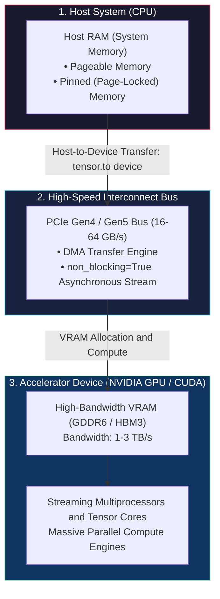
```mermaid
flowchart TD
    subgraph HostCPU["1. Host System (CPU)"]
        direction TB
        CPU_RAM["Host RAM (System Memory)<br/>• Pageable Memory<br/>• Pinned (Page-Locked) Memory"]
    end

    subgraph PCIeBus["2. High-Speed Interconnect Bus"]
        direction TB
        Transfer["PCIe Gen4 / Gen5 Bus (16-64 GB/s)<br/>• DMA Transfer Engine<br/>• non_blocking=True Asynchronous Stream"]
    end

    subgraph DeviceGPU["3. Accelerator Device (NVIDIA GPU / CUDA)"]
        direction TB
        GPU_VRAM["High-Bandwidth VRAM (GDDR6 / HBM3)<br/>Bandwidth: 1-3 TB/s"]
        CUDA_CORES["Streaming Multiprocessors and Tensor Cores<br/>Massive Parallel Compute Engines"]
        GPU_VRAM --> CUDA_CORES
    end

    CPU_RAM -->|Host-to-Device Transfer: tensor.to device| Transfer
    Transfer -->|VRAM Allocation and Compute| GPU_VRAM

    style HostCPU fill:#1a1a2e,stroke:#e94560,color:#fff
    style PCIeBus fill:#16213e,stroke:#4cc9f0,color:#fff
    style DeviceGPU fill:#0f3460,stroke:#52b788,color:#fff
```

### 11.1 Managing the `device` Attribute

Let us detect hardware accelerator availability and construct tensors directly on device:

```python
# Configure hardware accelerator device dynamically
device = torch.device('cuda' if torch.cuda.is_available() else 'cpu')
print(f"Selected computation device: {device}")

# Move CPU tensor to GPU
cpu_tensor = torch.ones(3, 3)
gpu_tensor = cpu_tensor.to(device=device)
print(f"Tensor device: {gpu_tensor.device}")

# Perform mathematical operations directly on the GPU
gpu_result = 2.0 * gpu_tensor + 1.0
print(f"GPU result device: {gpu_result.device}")
```

> [!IMPORTANT]
> **Device Matching Constraint:** Operations between tensors residing on different devices (e.g. CPU tensor + CUDA tensor) are illegal and will raise a `RuntimeError: Expected all tensors to be on the same device`. Always transfer input tensors and model weights to the same device.

---

## 12. NumPy Interoperability

PyTorch provides seamless, **zero-copy** bidirectional interoperability with NumPy arrays on CPU. Because PyTorch CPU tensors and NumPy arrays share the exact same underlying C-contiguous memory buffer, converting between them has zero performance or memory overhead.

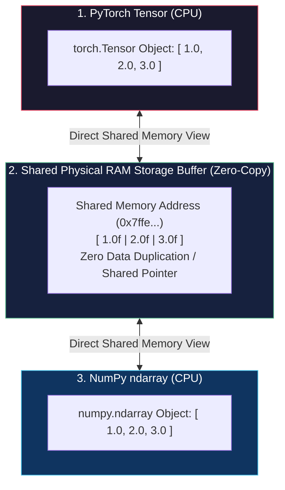
```mermaid
flowchart TD
    subgraph PyTorchCPU["1. PyTorch Tensor (CPU)"]
        PT["torch.Tensor Object: [ 1.0, 2.0, 3.0 ]"]
    end

    subgraph SharedBuffer["2. Shared Physical RAM Storage Buffer (Zero-Copy)"]
        RAM["Shared Memory Address (0x7ffe...)\n[ 1.0f | 2.0f | 3.0f ]\nZero Data Duplication / Shared Pointer"]
    end

    subgraph NumPyArray["3. NumPy ndarray (CPU)"]
        NP["numpy.ndarray Object: [ 1.0, 2.0, 3.0 ]"]
    end

    PyTorchCPU <-->|Direct Shared Memory View| SharedBuffer <-->|Direct Shared Memory View| NumPyArray

    style PyTorchCPU fill:#1a1a2e,stroke:#e94560,color:#fff
    style SharedBuffer fill:#16213e,stroke:#52b788,color:#fff
    style NumPyArray fill:#0f3460,stroke:#4cc9f0,color:#fff
```

Let us verify zero-copy memory sharing:

```python
import numpy as np

# Convert PyTorch tensor to NumPy array
torch_orig = torch.ones(3, dtype=torch.float32)
numpy_view = torch_orig.numpy()
print(f"NumPy view: {numpy_view}")

# Mutate the PyTorch tensor in-place
torch_orig.add_(10.0)

# The NumPy view immediately reflects the modification
print(f"NumPy view after PyTorch mutation: {numpy_view}")

# Convert NumPy array back to PyTorch tensor with torch.from_numpy
np_arr = np.array([5.0, 6.0, 7.0], dtype=np.float32)
torch_from_np = torch.from_numpy(np_arr)
print(f"PyTorch tensor from NumPy: {torch_from_np}")
```

---

## 13. Generalized Tensors

Modern PyTorch extends the core dense strided tensor abstraction with specialized generalized tensor variants designed for memory compression and irregular data structures:

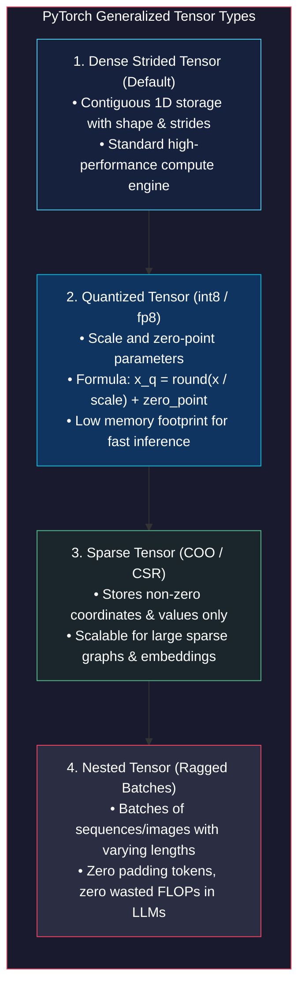
```mermaid
flowchart TD
    subgraph GeneralizedTensors["PyTorch Generalized Tensor Types"]
        direction TB
        D["1. Dense Strided Tensor (Default)<br/>• Contiguous 1D storage with shape & strides<br/>• Standard high-performance compute engine"]
        Q["2. Quantized Tensor (int8 / fp8)<br/>• Scale and zero-point parameters<br/>• Formula: x_q = round(x / scale) + zero_point<br/>• Low memory footprint for fast inference"]
        S["3. Sparse Tensor (COO / CSR)<br/>• Stores non-zero coordinates & values only<br/>• Scalable for large sparse graphs & embeddings"]
        N["4. Nested Tensor (Ragged Batches)<br/>• Batches of sequences/images with varying lengths<br/>• Zero padding tokens, zero wasted FLOPs in LLMs"]
        D --> Q --> S --> N
    end

    style GeneralizedTensors fill:#1a1a2e,stroke:#e94560,color:#fff
    style D fill:#16213e,stroke:#4cc9f0,color:#fff
    style Q fill:#0f3460,stroke:#00b4d8,color:#fff
    style S fill:#1b262c,stroke:#52b788,color:#fff
    style N fill:#2b2d42,stroke:#e94560,color:#fff
```

Let us construct a sparse coordinate (COO) tensor to represent a $1000 \times 1000$ matrix with only 3 non-zero entries:

```python
# Coordinates of non-zero entries: (0, 2), (1, 0), (2, 1)
indices = torch.tensor([[0, 1, 2], [2, 0, 1]], dtype=torch.int64)
values = torch.tensor([3.0, 4.0, 5.0], dtype=torch.float32)

# Construct 1000x1000 sparse tensor
sparse_tensor = torch.sparse_coo_tensor(indices, values, (1000, 1000))
print(f"Sparse tensor non-zero elements: {sparse_tensor._nnz()}")
print(f"Sparse tensor shape: {sparse_tensor.shape}")
```

---

## 14. Serializing Tensors (Checkpoints & HDF5)

Preserving trained model parameters, embeddings, and intermediate representations to disk is a core requirement in deep learning systems.

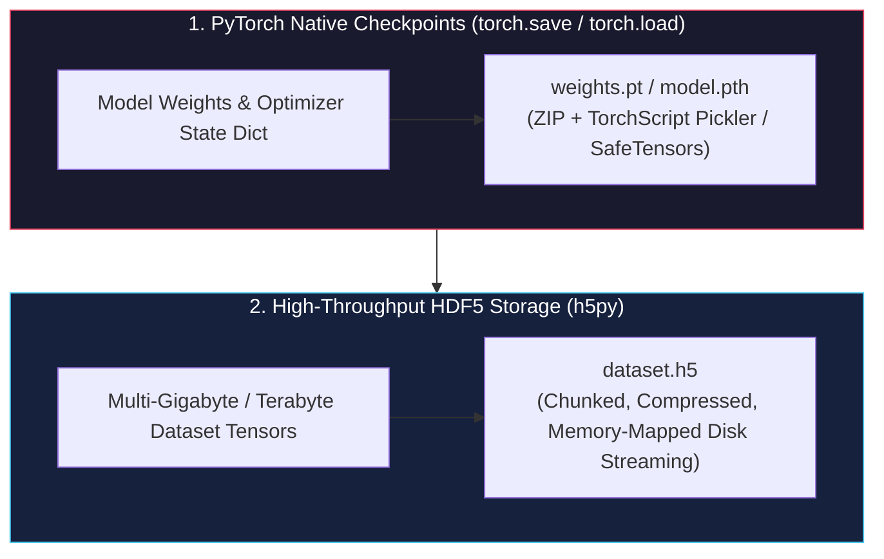
```mermaid
flowchart TD
    subgraph PyTorchNative["1. PyTorch Native Checkpoints (torch.save / torch.load)"]
        P_T["Model Weights & Optimizer State Dict"] --> P_F["weights.pt / model.pth\n(ZIP + TorchScript Pickler / SafeTensors)"]
    end

    subgraph HDF5Storage["2. High-Throughput HDF5 Storage (h5py)"]
        H_T["Multi-Gigabyte / Terabyte Dataset Tensors"] --> H_F["dataset.h5\n(Chunked, Compressed, Memory-Mapped Disk Streaming)"]
    end

    PyTorchNative --> HDF5Storage

    style PyTorchNative fill:#1a1a2e,stroke:#e94560,color:#fff
    style HDF5Storage fill:#16213e,stroke:#4cc9f0,color:#fff
```

### 14.1 PyTorch Native Serialization (`torch.save` & `torch.load`)

Let us serialize a tensor and reload it safely using `weights_only=True`:

```python
import os

# Create sample state dictionary
checkpoint = {
    'model_weights': torch.randn(4, 4),
    'epoch': 10,
    'learning_rate': 1e-3
}

# Save checkpoint to disk
torch.save(checkpoint, 'checkpoint.pt')

# Load checkpoint securely (preventing arbitrary code execution)
loaded_checkpoint = torch.load('checkpoint.pt', weights_only=True)
print(f"Loaded checkpoint keys: {list(loaded_checkpoint.keys())}")
print(f"Loaded weights shape: {loaded_checkpoint['model_weights'].shape}")

# Clean up temporary file
if os.path.exists('checkpoint.pt'):
    os.remove('checkpoint.pt')
```

### 14.2 High-Throughput HDF5 Storage (`h5py`)

For multi-terabyte scientific datasets (e.g. 3D medical CT scans), standard pickling is inefficient. The **HDF5** binary data format enables memory-mapped, chunked disk access without loading the entire dataset into RAM:

```python
import h5py

# Write tensor data directly to HDF5 binary container
tensor_to_save = torch.arange(100, dtype=torch.float32).reshape(10, 10)

with h5py.File('dataset_sample.h5', 'w') as h5f:
    h5f.create_dataset('features', data=tensor_to_save.numpy())

# Read sliced sub-regions without loading the entire file into RAM
with h5py.File('dataset_sample.h5', 'r') as h5f:
    hdf5_data = h5f['features']
    # Load only rows 2 to 5 directly into PyTorch
    sub_tensor = torch.from_numpy(hdf5_data[2:5, :])
    print(f"Loaded HDF5 sub-tensor shape: {sub_tensor.shape}")

# Clean up temporary file
if os.path.exists('dataset_sample.h5'):
    os.remove('dataset_sample.h5')
```

---

## 15. Chapter Exercises & Analytical Solutions

To solidify intuition on tensor storage, strides, and memory layouts, let us work through the official exercises from *Section 3.15* of *Deep Learning with PyTorch (2nd Edition)*.

### Exercise 1: Storage, Views, and Offset Analysis

**Task 1.a:** Create a tensor `a = torch.tensor(list(range(9)))`. Predict and check its size, storage offset, and stride. Then create `b = a.view(3, 3)`. Verify whether `a` and `b` share the same storage.

```python
# Create 1D tensor of 9 elements
a = torch.tensor(list(range(9)))
print(f"Tensor a: size={a.size()}, offset={a.storage_offset()}, stride={a.stride()}")

# Reshape into a 3x3 matrix via view
b = a.view(3, 3)
print(f"Tensor b: size={b.size()}, offset={b.storage_offset()}, stride={b.stride()}")

# Verify shared storage
print(f"Do a and b share the exact same storage pointer? {a.untyped_storage().data_ptr() == b.untyped_storage().data_ptr()}")
```

**Task 1.b:** Create a sub-tensor `c = b[1:, 1:]`. Predict and check its size, storage offset, and stride.

```python
# Slice sub-matrix starting from row 1, col 1
c = b[1:, 1:]
print(f"Tensor c:\n{c}")
print(f"Tensor c: size={c.size()}, offset={c.storage_offset()}, stride={c.stride()}")
```

*Mathematical Verification:*
- Element $(0, 0)$ of `c` corresponds to `b[1, 1]`, which is at index $1 \times 3 + 1 = 4$ in the original 1D storage. Thus $\text{storage\\_offset} = 4$.
- Shape is $(2, 2)$, and strides remain $(3, 1)$.

---

### Exercise 2: Mathematical Operations and In-Place Semantics

**Task 2:** Pick a mathematical operation like cosine or square root. Test whether PyTorch provides an in-place version, apply it element-wise, and analyze the required type conversions.

```python
# Construct integer tensor
int_tensor = torch.tensor([1, 4, 9, 16], dtype=torch.int32)

# Attempting torch.sqrt_() directly on an integer tensor raises a RuntimeError
try:
    int_tensor.sqrt_()
except RuntimeError as e:
    print(f"In-place sqrt on integer tensor failed as expected: {e}")

# Convert to float32 before in-place computation
float_tensor = int_tensor.to(dtype=torch.float32)
float_tensor.sqrt_()
print(f"Successful in-place sqrt on float tensor: {float_tensor}")
```

---

## 16. Summary & Key Architectural Takeaways

1. **Continuous Tensor Representation:** Deep learning models require continuous vector spaces of floating-point numbers (`float32`, `bfloat16`) to compute analytical gradients and optimize loss surfaces.
2. **Physical Storage vs. Logical Views:** A PyTorch tensor separates its high-level multidimensional indexing view from its underlying physical 1D contiguous memory buffer (`torch.Storage`).
3. **Stride Indexing Equation:** Memory locations are computed via $\text{Offset} = \text{storage\\_offset} + \sum\_{k=0}^{n-1} i\_k \cdot \text{stride}[k]$. Slicing, transposing, and permuting update only metadata and require **zero data copying**.
4. **Contiguity & Reordering:** Transposing swaps strides, making tensors non-contiguous. High-performance operations like `.view()` require calling `.contiguous()` to copy elements into row-major order.
5. **Zero-Copy NumPy Interoperability:** PyTorch and NumPy share CPU memory pointers directly via `torch.from_numpy` and `.numpy()`.
6. **Device Memory Hierarchy:** Transferring data between CPU RAM and GPU VRAM across the PCIe bus is a primary bottleneck in production pipelines. Use pinned memory and batch operations to saturate memory bandwidth.
