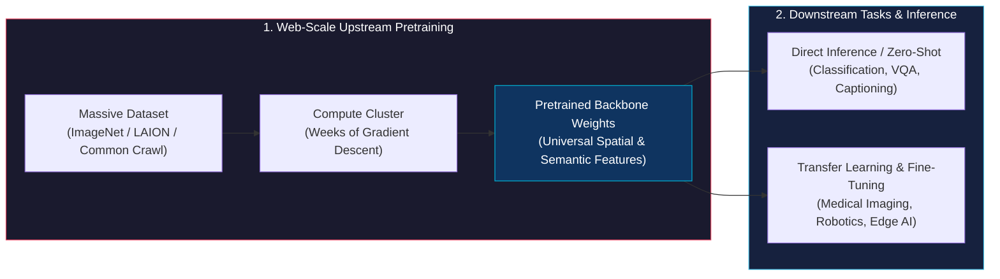
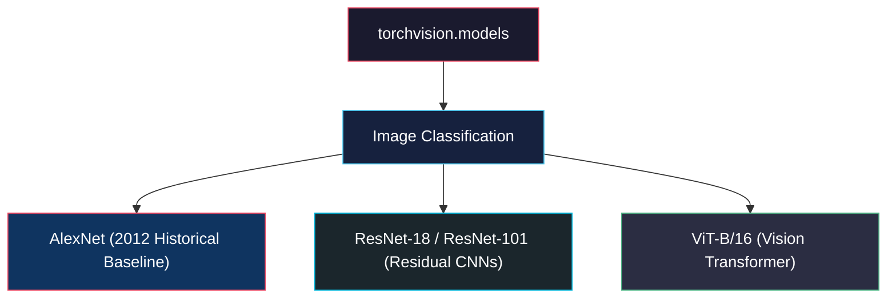
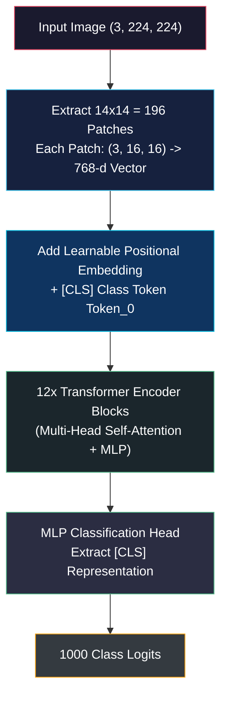
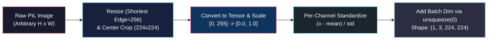
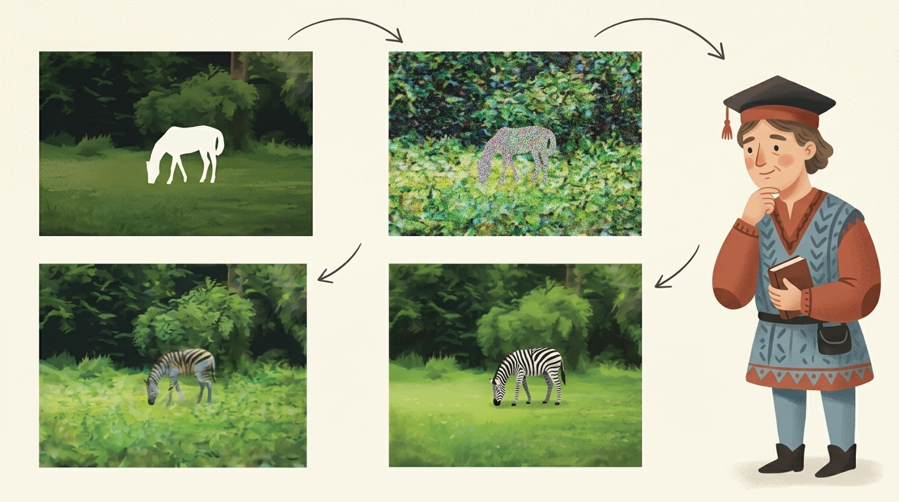
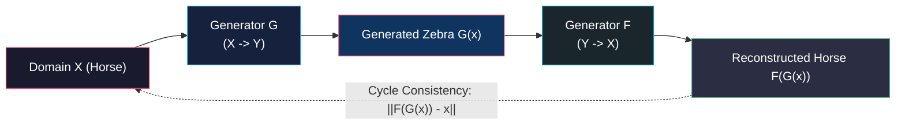
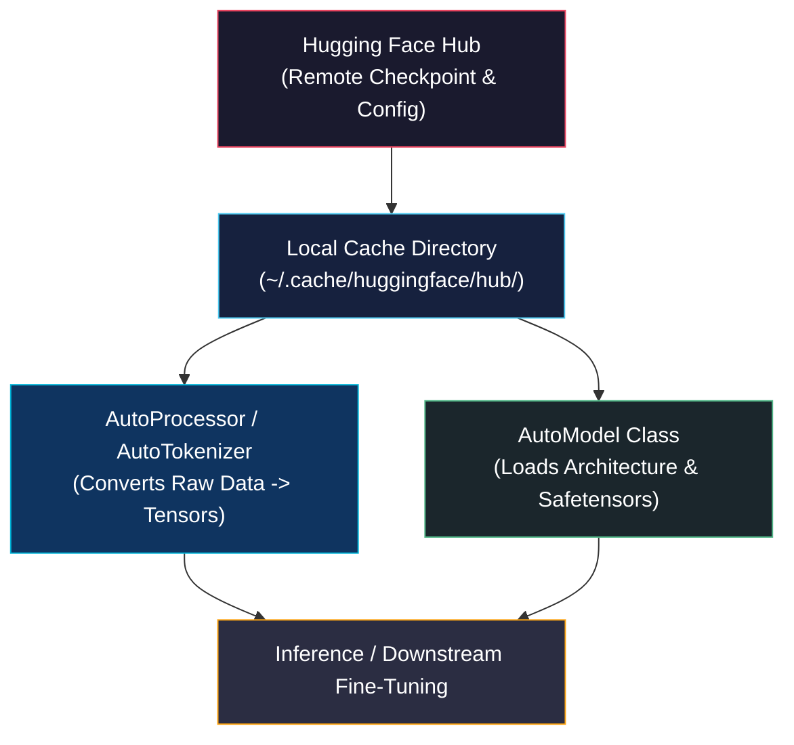

# Pretrained Networks and the Model Zoo

<!-- toc -->

<div style="margin-bottom: 20px;">
  <a href="https://colab.research.google.com/github/emreaslan7/ai/blob/main/notebooks/deep-learning-with-pytorch/02-pretrained-networks-and-model-zoo.ipynb" target="_blank">
    
  </a>
</div>

Training modern deep neural networks from scratch on web-scale datasets like **ImageNet** (1.2 million labeled images across 1,000 classes) or **LAION** requires hundreds of GPU hours, massive compute clusters, and substantial engineering budgets. In modern production machine learning, engineers rarely start from random parameter initializations ($W \sim \mathcal{N}(0, \sigma^2)$). Instead, they build upon **pretrained foundation networks** that have already learned high-capacity visual and multimodal representations.

This chapter walks step-by-step through the core pretrained models covered in *Chapter 2* of *Deep Learning with PyTorch (2nd Edition)*:
1. **Visual Recognition:** Classic CNNs (**AlexNet**, **ResNet-101**) and modern **Vision Transformers (ViT)**.
2. **Generative Image Synthesis:** Text-conditioned inpainting with **Latent Diffusion (Stable Diffusion)** and unpaired image translation with **CycleGAN (Horse $\to$ Zebra)**.
3. **The Hugging Face Ecosystem:** Universal model repositories and standardized processor/model interfaces.
4. **Multimodal Vision-Language:** Scene understanding and automated image captioning with **BLIP**.

---

## 1. The Pretrained Foundation Model Paradigm

In classical software engineering, developers reuse vetted libraries for encryption or database operations rather than reimplementing algorithms from scratch. Pretrained deep neural networks provide the exact same modularity for artificial intelligence:



### The ImageNet Benchmark and Visual Hierarchy
The canonical benchmark for computer vision is **ImageNet**, organized according to the **WordNet** lexical noun hierarchy. ImageNet contains over 14 million images, with its primary competition subset (**ILSVRC**) featuring **1,000 distinct object categories** (e.g., dog breeds, vehicles, everyday tools).

When a network learns to discriminate across these 1,000 classes, its internal layers build a hierarchical visual vocabulary:
- **Early layers:** Detect low-level spatial primitives (Gabor-like edges, color contrasts, line orientations).
- **Middle layers:** Assemble edges into textures, surface curvatures, corners, and contours.
- **Deep layers:** Compose textures into complex semantic entities (eyes, snouts, wheels, object assemblies).

> **Key Insight:** Pretrained weights freeze thousands of GPU hours of gradient descent optimization into physical tensor checkpoints. Loading these weights gives your model immediate high-level visual and semantic perception capabilities.

---

## 2. Image Recognition: Torchvision Model Zoo

The `torchvision.models` subpackage provides instant access to vetted computer vision architectures and their pretrained weights.



### 2.1 Inspecting Available Architectures

Before instantiating a model, we can query all available models in the Torchvision catalog using `models.list_models()`.

```python
import torch
import torchvision
from torchvision import models

# List all available models in torchvision
available_models = models.list_models()
print(f"Total available models in Torchvision: {len(available_models)}")
print("Sample models:", available_models[:10])
```

---

### 2.2 AlexNet: The 2012 Deep Learning Revolution

**AlexNet** (Krizhevsky, Sutskever, & Hinton, 2012) triggered the modern deep learning boom by winning the ILSVRC 2012 competition, slashing the top-5 error rate from **28.2%** (classical feature extraction methods like SIFT/HOG) to **16.4%**.

<figure style="display:flex; justify-content: center; margin: 25px 0;">
  <div style="text-align: center;">
    
    <figcaption style="margin-top: 0.6em; text-align: center; font-size: 13px; color: #888;"><em>AlexNet Architecture: 5 sequential convolutional blocks (96, 256, 384, 384, 256 feature channels) followed by 3 dense classifier layers (4096, 4096, 1000 logits).</em></figcaption>
  </div>
</figure>

AlexNet contains **61.1 million parameters** across 5 convolutional layers and 3 fully connected layers.

#### Step 1: Instantiating AlexNet with Weights
In modern Torchvision (v0.13+), models are loaded using explicit `Weights` enum objects rather than legacy boolean flags (`pretrained=True`). This guarantees reproducibility and automatically bundles the exact preprocessing transformations used during training.

```python
from torchvision.models import AlexNet_Weights

# Instantiate AlexNet with default pretrained ImageNet weights
alexnet_weights = AlexNet_Weights.DEFAULT
alexnet = models.alexnet(weights=alexnet_weights)

# Inspect network topology
print(alexnet)
```

The output reveals two main submodules:
1. `features`: A sequential cascade of `Conv2d`, `ReLU`, and `MaxPool2d` layers that progressively downsample spatial resolution while expanding feature channels ($3 \to 64 \to 192 \to 384 \to 256$).
2. `classifier`: Fully connected linear layers with `Dropout(p=0.5)` ending with `Linear(in_features=4096, out_features=1000)` producing logits for each ImageNet category.

---

### 2.3 The Vision Transformer (ViT): Attention Replaces Convolution

In 2020, Dosovitskiy et al. introduced **An Image is Worth 16x16 Words: Transformers for Image Recognition at Scale (ViT)**. ViT discards convolutional inductive biases (translational equivariance and local receptive fields) in favor of **Self-Attention** across flattened image patches.



#### Step 1: Instantiating ViT-B/16
We load the Vision Transformer Base model with $16 \times 16$ patch resolution (`vit_b_16`):

```python
from torchvision.models import ViT_B_16_Weights

# Instantiate ViT-B/16 with default pretrained weights
vit_weights = ViT_B_16_Weights.DEFAULT
vit = models.vit_b_16(weights=vit_weights)

# Inspect network topology
print(vit)
```

In `vit_b_16`, the $224 \times 224$ input is divided into $14 \times 14 = 196$ non-overlapping patches of size $16 \times 16 \times 3 = 768$ values. A learnable class token (`[CLS]`) is prepended to the sequence (making sequence length $197$), and $12$ Transformer encoder blocks process global dependencies via multi-head self-attention.

---

### 2.4 Mathematical Input Preprocessing Pipeline

Neural network weights are mathematically calibrated to the exact mean and variance of their training data. Feeding raw unnormalized RGB pixel values into a pretrained network causes severe distribution shift, resulting in random garbage outputs.



The mathematical transformation pipeline consists of four deterministic operations:

1. **Spatial Rescaling & Central Cropping:**
   The image is scaled so its shortest side is 256 pixels, followed by a central crop of size $224 \times 224$:
   $$ \mathbf{X} \in \mathbb{R}^{3 \times 224 \times 224} $$

2. **Pixel Intensity Normalization:**
   Integer byte values $x \in [0, 255]$ are mapped to floating-point numbers in $[0.0, 1.0]$:
   $$ x_{\text{norm}} = \frac{x}{255.0} $$

3. **Per-Channel Standardization:**
   Each RGB channel $c \in \{0, 1, 2\}$ is standardized using ImageNet dataset statistics:
   $$ x'\_{c,i,j} = \frac{x\_{c,i,j} - \mu\_c}{\sigma\_c} $$
   $$ \boldsymbol{\mu} = [0.485, 0.456, 0.406], \quad \boldsymbol{\sigma} = [0.229, 0.224, 0.225] $$

#### Step 1: Retrieving the Official Preprocessing Transform
Instead of manually hardcoding normalization vectors, we retrieve the exact transformation pipeline bound to the model weights:

```python
# Extract the official preprocessing pipeline
preprocess = alexnet_weights.transforms()
print("Preprocessing Pipeline Configuration:")
print(preprocess)
```

#### Step 2: Downloading a Real Test Image
We load the canonical Golden Retriever test photo directly from PyTorch's official repository:

```python
import urllib.request
from PIL import Image

# Download and open real test image
url = "https://raw.githubusercontent.com/pytorch/hub/master/images/dog.jpg"
with urllib.request.urlopen(url) as response:
    img = Image.open(response).convert("RGB")

print(f"Original image format: {img.format}, dimensions: {img.size}")
```

#### Step 3: Applying Preprocessing Transformations
We apply the preprocessing pipeline to transform the PIL image into a standardized $(3, 224, 224)$ float tensor:

```python
# Apply preprocessing transformations: PIL Image -> (3, 224, 224) Tensor
img_t = preprocess(img)
print(f"Preprocessed tensor shape: {img_t.shape}")
print(f"Tensor dtype: {img_t.dtype}, min: {img_t.min():.2f}, max: {img_t.max():.2f}")
```

#### Step 4: Adding Batch Dimension via `unsqueeze(0)`
PyTorch models expect a 4D tensor representing `(Batch, Channels, Height, Width)`. We add the batch dimension using `torch.unsqueeze(0)`:

```python
import torch

# Add batch dimension: (3, 224, 224) -> (1, 3, 224, 224)
batch_t = torch.unsqueeze(img_t, 0)
print(f"Input batch tensor shape: {batch_t.shape}")
```

---

### 2.5 Running Inference and Decoding Class Probabilities

#### Step 1: Setting Evaluation Mode & Forward Pass
Before performing inference, we MUST set the model to evaluation mode using `model.eval()`. This freezes stochastic behavior in layers like `Dropout` and fixes running statistics in `BatchNorm2d`.

We wrap the forward pass inside `with torch.inference_mode():` to disable autograd and memory version counter tracking:

```python
# 1. Set model to evaluation mode
alexnet.eval()

# 2. Select target computation device
device = torch.device("cuda" if torch.cuda.is_available() else "cpu")
alexnet = alexnet.to(device)
batch_t = batch_t.to(device)

# 3. Perform forward pass
with torch.inference_mode():
    out = alexnet(batch_t)

print(f"Output raw logits shape: {out.shape}")  # (1, 1000)
```

#### Step 2: Softmax Normalization & Top-5 Extraction
The network outputs raw, unnormalized logits $\mathbf{z} \in \mathbb{R}^{1000}$. To convert logits into valid probabilities $P(Y = k) \in (0, 1)$ such that $\sum_k P(Y=k) = 1$, we apply the **Softmax** function:

$$ P(Y = k \mid \mathbf{x}) = \text{Softmax}(z_k) = \frac{\exp(z_k)}{\sum_{j=1}^{1000} \exp(z_j)} $$

We then extract the top-5 most confident class predictions using `torch.topk`:

```python
# 1. Apply Softmax along class dimension (dim=1)
probabilities = torch.softmax(out, dim=1)

# 2. Extract top-5 predictions
top5_prob, top5_catid = torch.topk(probabilities, 5)

# 3. Retrieve category names from weights metadata
categories = alexnet_weights.meta["categories"]

print("\n=== AlexNet Top-5 Class Predictions for Golden Retriever ===")
for i in range(top5_prob.size(1)):
    cat_id = top5_catid[0][i].item()
    score = top5_prob[0][i].item() * 100.0
    print(f"{i+1}. {categories[cat_id]:<35} ({score:.2f}%)")
```

#### Step 3: Comparative Inference with Vision Transformer (ViT-B/16)
Let's run the exact same test image through ViT-B/16 to inspect how global self-attention compares with AlexNet:

```python
vit.eval()
vit_preprocess = vit_weights.transforms()
vit_batch_t = torch.unsqueeze(vit_preprocess(img), 0).to(device)

with torch.inference_mode():
    vit_out = vit(vit_batch_t)

vit_probs = torch.softmax(vit_out, dim=1)
vit_top5_prob, vit_top5_catid = torch.topk(vit_probs, 5)
vit_categories = vit_weights.meta["categories"]

print("=== ViT-B/16 Top-5 Class Predictions ===")
for i in range(vit_top5_prob.size(1)):
    cat_id = vit_top5_catid[0][i].item()
    score = vit_top5_prob[0][i].item() * 100.0
    print(f"{i+1}. {vit_categories[cat_id]:<35} ({score:.2f}%)")
```

---

## 3. Generative Vision Pipelines: Inpainting & CycleGAN

While classification models learn discriminative boundaries ($P(Y \mid X)$), **generative models** learn the underlying data distribution to synthesize new realistic visual content ($P(X)$ or $P(X \mid \text{Prompt})$).

### 3.1 The Inpainting Process with Latent Diffusion Models (Stable Diffusion)

Generative inpainting restores, alters, or replaces masked sections of an image based on a natural language text prompt.

<figure style="display:flex; justify-content: center; margin: 25px 0;">
  <div style="text-align: center;">
    
    <figcaption style="margin-top: 0.6em; text-align: center; font-size: 13px; color: #888;"><em>Inpainting Input Setup: A text Prompt ('Change this horse into a zebra'), a source Image, and a binary Mask board specifying the target region.</em></figcaption>
  </div>
</figure>

#### Why Latent Diffusion?
Standard diffusion models operate directly in high-dimensional pixel space ($512 \times 512 \times 3 = 786,432$ values), making multi-step denoising computationally prohibitive. 

**Latent Diffusion Models (LDMs)** compress the image $8\times$ spatially into a lower-dimensional latent space $z = \mathcal{E}(x)$ of shape $(4, 64, 64) = 16,384$ values using a pretrained Variational Autoencoder (VAE). The denoising U-Net operates entirely in this compact latent manifold:

$$ \mathcal{L}\_{\text{LDM}}(\theta) = \mathbb{E}\_{\mathbf{x}, \mathbf{y}, \boldsymbol{\epsilon}, t} \left[ \left\\| \boldsymbol{\epsilon} - \boldsymbol{\epsilon}\_\theta(\mathbf{z}\_t, t, \tau\_\theta(\mathbf{y})) \right\\|\_2^2 \right] $$

Where:
- $\mathbf{z}_t$: Latent image at noise step $t$.
- $\tau_\theta(\mathbf{y})$: Conditioning text embedding from the CLIP text encoder.
- $\boldsymbol{\epsilon}_\theta$: U-Net predicting the noise perturbation.

<figure style="display:flex; justify-content: center; margin: 25px 0;">
  <div style="text-align: center;">
    
    <figcaption style="margin-top: 0.6em; text-align: center; font-size: 13px; color: #888;"><em>Iterative Denoising Progression: From the initial masked cutout through high-variance Gaussian noise to the final synthesized zebra.</em></figcaption>
  </div>
</figure>

#### Step 1: Loading the Inpainting Pipeline via Diffusers
We instantiate the Stable Diffusion 2.0 Inpainting pipeline using the open community weights (`sd2-community/stable-diffusion-2-inpainting`):

```python
from diffusers import StableDiffusionInpaintPipeline
import torch

# Select device and float16 precision for memory efficiency
device = "cuda" if torch.cuda.is_available() else "cpu"
dtype = torch.float16 if device == "cuda" else torch.float32

# Load Stable Diffusion 2.0 Inpainting pipeline
pipe = StableDiffusionInpaintPipeline.from_pretrained(
    "sd2-community/stable-diffusion-2-inpainting",
    dtype=dtype
).to(device)

# Upcast VAE to Float32 to eliminate FP16 numerical overflow (NaN / Black images)
if device == "cuda" and dtype == torch.float16:
    if hasattr(pipe, "upcast_vae"):
        pipe.upcast_vae()
    else:
        pipe.vae.to(dtype=torch.float32)

print(f"Pipeline successfully loaded on device: {device}")
```

#### Step 2: Loading Benchmark Image, Binary Mask, and Text Prompt
Inpainting requires three inputs:
1. `image`: The original base image ($512 \times 512$).
2. `mask_image`: A grayscale mask image where white pixels ($255$) indicate the region to be repainted, and black pixels ($0$) remain preserved.
3. `prompt`: A descriptive text string guiding the diffusion generation.

We load the canonical benchmark image and mask from the official CompVis Latent Diffusion repository:

```python
from PIL import Image
import urllib.request

# Load official Latent Diffusion inpainting benchmark image and mask
img_url = "https://raw.githubusercontent.com/CompVis/latent-diffusion/main/data/inpainting_examples/overture-creations-5sI6fQgYIuo.png"
mask_url = "https://raw.githubusercontent.com/CompVis/latent-diffusion/main/data/inpainting_examples/overture-creations-5sI6fQgYIuo_mask.png"

with urllib.request.urlopen(img_url) as response:
    init_image = Image.open(response).convert("RGB").resize((512, 512))

with urllib.request.urlopen(mask_url) as response:
    mask_image = Image.open(response).convert("L").resize((512, 512))

prompt = "a sitting cat on a park bench, 8k resolution, photorealistic"

print(f"Base Image Size: {init_image.size} | Mask Image Size: {mask_image.size}")
print(f"Target Text Prompt: '{prompt}'")
```

#### Step 3: Executing the Inpainting Denoising Loop
We run diffusion inference with classifier-free guidance scale $7.5$ across $25$ denoising timesteps:

```python
# Execute diffusion sampling loop
with torch.inference_mode():
    output = pipe(
        prompt=prompt,
        image=init_image,
        mask_image=mask_image,
        num_inference_steps=25,
        guidance_scale=7.5,
        generator=torch.Generator(device=device).manual_seed(42) if device == "cuda" else None
    )

inpainted_image = output.images[0]
print(f"Inpainting complete! Output dimensions: {inpainted_image.size}")
```

---

### 3.2 Unpaired Image-to-Image Translation: CycleGAN (Horse $\to$ Zebra)

In classical supervised learning, image translation requires paired examples $(x_i, y_i)$—such as exact photos of a horse and the exact same scene with a zebra in identical pose and lighting. Because such datasets are virtually impossible to capture, **CycleGAN** (Zhu et al., 2017) introduced **unpaired image-to-image translation**.



#### The Cycle Consistency Principle
If you translate a sentence from English to French ($G$) and then translate it back from French to English ($F$), you should recover the original sentence. Similarly, in CycleGAN:

$$ F(G(x)) \approx x \quad \text{and} \quad G(F(y)) \approx y $$

The training objective couples adversarial losses ($\mathcal{L}\_{\text{GAN}}$) with the $L_1$ **Cycle Consistency Loss** ($\mathcal{L}\_{\text{cyc}}$):

$$ \mathcal{L}\_{\text{total}}(G, F, D_X, D_Y) = \mathcal{L}\_{\text{GAN}}(G, D_Y, X, Y) + \mathcal{L}\_{\text{GAN}}(F, D_X, Y, X) + \lambda \mathcal{L}\_{\text{cyc}}(G, F) $$

$$ \mathcal{L}\_{\text{cyc}}(G, F) = \mathbb{E}\_x \left[ \\| F(G(x)) - x \\\|\_1 \right] + \mathbb{E}\_y \left[ \\| G(F(y)) - y \\\|\_1 \right] $$

#### Step 1: Instantiating the ResNet Generator
The generator architecture consists of downsampling convolutional blocks, 9 residual blocks (preserving spatial context), and upsampling transpose convolutions:

```python
import torch
import torch.nn as nn

# Define a standard CycleGAN ResNet block
class ResNetBlock(nn.Module):
    def __init__(self, dim):
        super().__init__()
        self.conv_block = nn.Sequential(
            nn.ReflectionPad2d(1),
            nn.Conv2d(dim, dim, kernel_size=3, padding=0, bias=False),
            nn.InstanceNorm2d(dim),
            nn.ReLU(True),
            nn.ReflectionPad2d(1),
            nn.Conv2d(dim, dim, kernel_size=3, padding=0, bias=False),
            nn.InstanceNorm2d(dim)
        )

    def forward(self, x):
        return x + self.conv_block(x)  # Skip connection

# Instantiate generator skeleton
print("ResNetBlock architecture initialized successfully.")
```

---

## 4. The Hugging Face Ecosystem & Model Zoo

While Torchvision specializes in canonical computer vision architectures, the **Hugging Face Hub** acts as the universal open-source repository for over 500,000 deep learning models spanning NLP, Vision, Audio, Reinforcement Learning, and Multimodal domains.



Every Hugging Face model follows two standard components:
1. **AutoProcessor / AutoTokenizer:** Reconstructs the exact tokenization, scaling, vocabulary mapping, and normalization rules used during pretraining.
2. **AutoModelFor...:** Instantiates the neural architecture, downloads weights from remote sharded `.safetensors` files, and allocates parameters in memory.

---

## 5. Vision-Language Multimodal Inference: BLIP

Vision-Language Models (VLMs) bridge visual perception and natural language generation. **BLIP (Bootstrapping Language-Image Pre-training)** by Salesforce can perform:
- **Unconditional Captioning:** Generating rich natural language descriptions of images from scratch.
- **Conditional Captioning / VQA:** Answering queries about an image or completing text prefix prompts.

<figure style="display:flex; justify-content: center; margin: 25px 0;">
  <div style="text-align: center;">
    
    <figcaption style="margin-top: 0.6em; text-align: center; font-size: 13px; color: #888;"><em>BLIP Multimodal Architecture: Visual feature extraction via Vision Transformer (ViT) Image Encoder coupled with Cross-Attention Multimodal Text Decoder.</em></figcaption>
  </div>
</figure>

### Visual-Text Cross-Attention Mechanism
In the multimodal decoder layers, visual representations are injected into the text generation sequence via **Cross-Attention**:

$$ \text{CrossAttention}(\mathbf{Q}, \mathbf{K}, \mathbf{V}) = \text{softmax}\left( \frac{\mathbf{Q} \mathbf{K}^T}{\sqrt{d_k}} \right) \mathbf{V} $$

Where queries $\mathbf{Q}$ originate from previous text tokens, and keys $\mathbf{K}$ and values $\mathbf{V}$ originate from the ViT visual token embeddings.

---

### 5.1 Executable BLIP Implementation

#### Step 1: Loading Processor and Model from Hugging Face
We instantiate `BlipProcessor` and `BlipForConditionalGeneration` from Salesforce's base checkpoint:

```python
from transformers import BlipProcessor, BlipForConditionalGeneration
from PIL import Image
import torch
import urllib.request

device = torch.device("cuda" if torch.cuda.is_available() else "cpu")

# 1. Load processor and model
processor = BlipProcessor.from_pretrained("Salesforce/blip-image-captioning-base")
blip_model = BlipForConditionalGeneration.from_pretrained("Salesforce/blip-image-captioning-base").to(device)
blip_model.eval()

print("BLIP model successfully loaded.")
```

#### Step 2: Unconditional Image Captioning
We pass a real photo (such as our Golden Retriever) without any guiding prompt to let the model describe the scene from scratch:

```python
# Load sample photo
img_url = "https://raw.githubusercontent.com/pytorch/hub/master/images/dog.jpg"
with urllib.request.urlopen(img_url) as response:
    raw_image = Image.open(response).convert("RGB")

# Preprocess image into PyTorch tensors
inputs_unconditional = processor(images=raw_image, return_tensors="pt").to(device)

# Generate caption autoregressively
with torch.inference_mode():
    output_tokens = blip_model.generate(**inputs_unconditional, max_new_tokens=30)
    caption = processor.decode(output_tokens[0], skip_special_tokens=True)

print(f"Unconditional Caption: '{caption}'")
```

#### Step 3: Conditional / Prompt-Guided Captioning
We provide a prefix text prompt (e.g., `"a photography of"`) to steer caption generation:

```python
prompt_text = "a photography of"

# Preprocess both image and conditioning text prompt
inputs_conditional = processor(images=raw_image, text=prompt_text, return_tensors="pt").to(device)

# Generate conditional description
with torch.inference_mode():
    output_tokens = blip_model.generate(**inputs_conditional, max_new_tokens=30)
    conditional_caption = processor.decode(output_tokens[0], skip_special_tokens=True)

print(f"Conditional Caption:   '{conditional_caption}'")
```

---

## 6. Model Sizing, Computational Complexity (FLOPs) & GPU VRAM

When selecting foundation backbones for production deployment, engineers must analyze the trade-off between **model accuracy**, **parameter count**, and **hardware memory footprint**.

### 6.1 Architectural Comparison Table

| Architecture | Paradigm | Parameter Count | Computational Cost (FLOPs) | ImageNet Top-1 Acc | Primary Use Case |
| :--- | :--- | :---: | :---: | :---: | :--- |
| **AlexNet (2012)** | Classic CNN | 61.1 M | 0.72 GFLOPs | 56.5% | Historical baseline, education |
| **ResNet-18 (2015)** | Residual CNN | 11.7 M | 1.82 GFLOPs | 69.8% | Edge devices, IoT, mobile |
| **ResNet-101 (2015)** | Deep Residual CNN | 44.5 M | 7.85 GFLOPs | 81.9% | Robust spatial visual backbone |
| **ViT-B/16 (2020)** | Vision Transformer | 86.6 M | 17.60 GFLOPs | 84.2% | High-accuracy foundation vision |
| **BLIP-Base (2022)** | Multimodal VLM | 223.0 M | ~35.00 GFLOPs | N/A (VQA/Caption) | Image captioning, visual search |
| **SD-2.1 Inpaint (2022)** | Latent Diffusion | 865.0 M | ~150.00 GFLOPs | N/A (Generative) | Generative image editing |

### 6.2 Mathematical GPU VRAM Footprint Formula

The static GPU VRAM required to hold model parameters in memory is given by:

$$ \text{VRAM} = N\_{\text{params}} \times B\_{\text{dtype}} $$

Where $B\_{\text{dtype}}$ represents the byte width per parameter:
- **FP32 (Single Precision):** $B = 4\text{ bytes}$
- **FP16 / BF16 (Half Precision):** $B = 2\text{ bytes}$
- **INT8 (Quantized):** $B = 1\text{ byte}$
- **INT4 (4-bit NF4 / GPTQ):** $B = 0.5\text{ bytes}$

For example, loading **ResNet-101** ($44.5 \times 10^6$ parameters) in FP32 requires:

$$ 44.5 \times 10^6 \times 4 \text{ bytes} \approx 178 \text{ MB} $$

Whereas loading **Stable Diffusion 2.1** (~$865 \times 10^6$ parameters) in FP16 requires:

$$ 865 \times 10^6 \times 2 \text{ bytes} \approx 1.73 \text{ GB} $$

---

## 7. Summary and Key Takeaways

1. **Transfer Learning Efficiency:** Pretrained foundation models eliminate the need to train visual feature extractors from scratch, transferring representations learned on web-scale datasets to specialized downstream tasks.
2. **Preprocessing Consistency:** Input data must strictly match the normalization distribution of the training data (ImageNet channel means $[0.485, 0.456, 0.406]$ and stds $[0.229, 0.224, 0.225]$).
3. **Execution State Discipline:** Always call `model.eval()` to freeze stochastic layers (Dropout, BatchNorm) and wrap inference inside `with torch.inference_mode():` to eliminate gradient tracking memory overhead.
4. **Multimodal Expansion:** Hugging Face and Diffusers provide unified pipelines for multimodal VLMs (BLIP) and generative diffusion models (Stable Diffusion).
