# Real-World Data Representation Using Tensors: Images, Volumetric Data, Tables, Time Series, and Text

<!-- toc -->

<div style="margin-bottom: 20px;">
  <a href="https://colab.research.google.com/github/emreaslan7/ai/blob/main/notebooks/deep-learning-with-pytorch/04-real-world-data-representation-using-tensors.ipynb" target="_blank">
    
  </a>
</div>

Deep learning models cannot consume raw JPEG files, DICOM medical scans, spreadsheet rows, sensor logs, or English paragraphs in their native states. Every sensory and digital artifact from the physical world must first be converted into a structured, multidimensional grid of continuous floating-point numbers: a **PyTorch tensor**.

However, encoding raw real-world data is not a trivial one-size-fits-all operation. Different data modalities possess distinct spatial geometries, temporal correlations, categorical discrete structures, and dynamic range properties. A 2D photographic image requires multi-channel spatial grids with spatial locality; a 3D computed tomography (CT) scan requires volumetric physical density scaling; a tabular dataset contains mixed continuous measurements and discrete categorical codes; a time-series sequence encapsulates temporal dynamics and cyclical periodicity; and natural language text requires mapping discrete symbolic tokens onto dense continuous latent manifolds.

Following *Chapter 4* of *Deep Learning with PyTorch (2nd Edition)* by Eli Stevens, Luca Antiga, and Thomas Viehmann (with Howard Huang), this chapter provides an exhaustive, first-principles exploration of converting diverse real-world data types into optimized PyTorch tensors:
1. **Working with Images (2D Data):** Color channels (Grayscale, RGB, RGBA), bit depths (`uint8` vs `float32`), $H \times W \times C \to C \times H \times W$ layout conversions (`.permute`), contiguous vs `torch.channels_last` memory layouts, batch pre-allocation, and per-channel statistical standardization.
2. **3D Images (Volumetric Data):** Medical CT/MRI scans, DICOM/NIfTI standards, Hounsfield Units (HU) radiodensity calibration, slice stacking, and 5D tensor structures $(N, C, D, H, W)$.
3. **Representing Tabular Data:** Continuous vs ordinal vs nominal features, loading the UCI Wine Quality dataset, continuous vs categorical targets, One-Hot Encoding mechanics (`scatter_` vs `torch.nn.functional.one_hot`), $Z$-score normalization, and threshold-based classification.
4. **Working with Time Series:** Folding 2D temporal records into 3D sequence tensors $(N, L, C)$, layout transpositions (`.transpose(1, 2)`), cyclical feature encoding, and concatenating heterogeneous categorical and continuous measurements.
5. **Representing Text (Natural Language):** The tokenization hierarchy (character vs subword vs word), character/word-level One-Hot matrices, the curse of dimensionality and vector orthogonality, dense continuous embeddings with `nn.Embedding`, semantic vector arithmetic, and entity embeddings for arbitrary discrete domains.
6. **Comprehensive Modality Cheat-Sheet:** A structured reference matrix comparing tensor shapes, data types, memory formats, and normalization strategies across all deep learning domains.
7. **Chapter Exercises & Analytical Solutions:** Step-by-step mathematical and code implementations for all Chapter 4 exercises.

---

## 1. Working with Images (2D Visual Data)

Digital images are discrete 2D spatial grids of color pixels. Before feeding visual information into Convolutional Neural Networks (CNNs) or Vision Transformers (ViTs), raw pixel arrays must be loaded, transformed into the expected memory layout, batched, and statistically standardized.

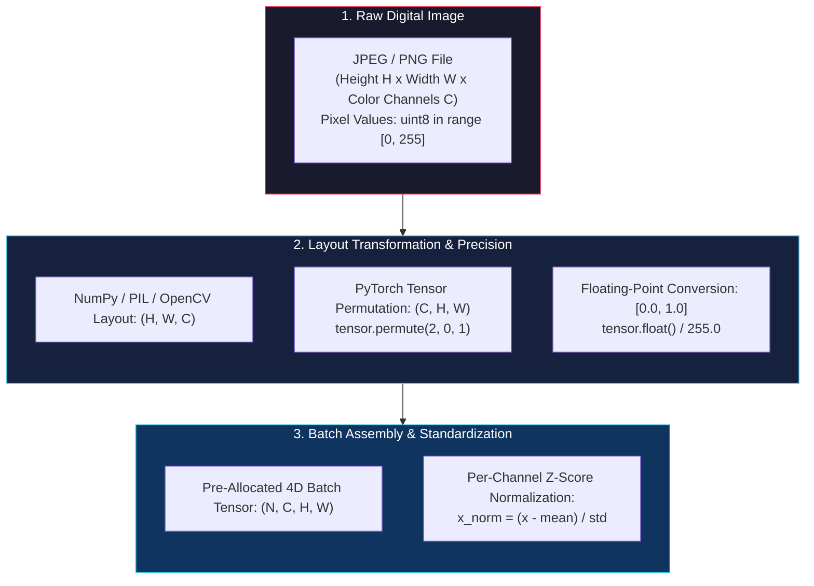

<figure style="display:flex; justify-content: center; margin: 25px 0;">
  <div style="text-align: center;">
    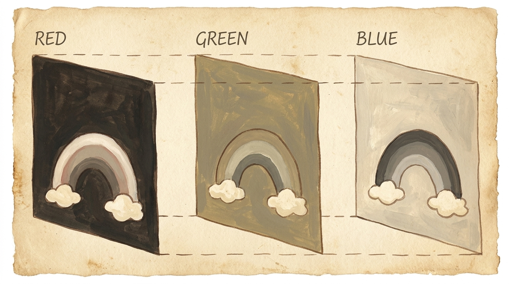
    <figcaption style="margin-top: 0.6em; text-align: center; font-size: 13px; color: #888;"><em>Decomposition of a 2D digital image into discrete Red, Green, and Blue channel intensity planes, aligned along the color dimension.</em></figcaption>
  </div>
</figure>

### 1.1 Pixel Channels, Bit-Depth, and Data Types

In digital imaging, a pixel is a quantized numerical measurement of electromagnetic radiation captured by a photosensor:
* **Grayscale (1 Channel):** Single intensity channel representing luminance from black ($0$) to white ($255$).
* **RGB (3 Channels):** Three primary additive spectral bands: Red, Green, and Blue.
* **RGBA (4 Channels):** Red, Green, Blue, plus an **Alpha** channel denoting pixel opacity/transparency.
* **Multispectral / Hyperspectral:** Remote sensing and satellite sensors capture dozens or hundreds of spectral bands (such as near-infrared, thermal infrared, and ultraviolet).

Most photographic formats (JPEG, PNG, BMP) store pixel intensities as **8-bit unsigned integers** (`uint8`), giving $2^8 = 256$ discrete intensity levels per channel in the interval $[0, 255]$. Medical cameras, scientific sensors, and HDR sensors capture **12-bit, 14-bit, or 16-bit** integers ($[0, 65535]$), or 32-bit floating-point radiance values.

> **Key Insight:** While images are stored on disk as compact `uint8` integers to save space, deep learning models require `float32` (or `bfloat16`/`float16`) tensors so that gradients $\frac{\partial \mathcal{L}}{\partial x}$ can be computed via backpropagation.

---

### 1.2 Layout Conventions: HWC vs. CHW

A critical source of shape errors when transitioning from computer vision libraries (OpenCV, PIL, Matplotlib, Scikit-Image) to PyTorch is the spatial dimension ordering:
1. **NumPy / OpenCV / PIL / Scikit-Image:** Adopt the **Channels-Last (HWC)** format:
   $$ \text{Shape}_{\text{NumPy}} = (H, W, C) = (\text{Height}, \text{Width}, \text{Channels}) $$
2. **PyTorch Core Operations (`torch.nn.Conv2d`):** Require the **Channels-First (CHW)** format for single images, and **NCHW** for batched tensors:
   $$ \text{Shape}_{\text{PyTorch}} = (N, C, H, W) = (\text{Batch Size}, \text{Channels}, \text{Height}, \text{Width}) $$

Converting an image from $(H, W, C)$ to $(C, H, W)$ in PyTorch is performed using `torch.permute()` or `torch.Tensor.permute()`:

```python
import torch
import imageio.v2 as imageio

# Action 1: Load image using ImageIO (returns a NumPy ndarray of shape H x W x C)
img_arr = imageio.imread('https://raw.githubusercontent.com/deep-learning-with-pytorch/dlwpt-code/master/data/p1ch4/image-dog/bobby.jpg')
print("Original NumPy array shape (H, W, C):", img_arr.shape)  # e.g., (720, 1280, 3)

# Action 2: Convert NumPy array to PyTorch Tensor without copying memory
img_tensor = torch.from_numpy(img_arr)
print("Initial PyTorch Tensor shape:", img_tensor.shape)       # torch.Size([720, 1280, 3])

# Action 3: Transpose dimensions from (H, W, C) -> (C, H, W) via zero-copy view
img_chw = img_tensor.permute(2, 0, 1)
print("Transposed PyTorch Tensor shape (C, H, W):", img_chw.shape)  # torch.Size([3, 720, 1280])
print("Is tensor memory contiguous?", img_chw.is_contiguous())       # False (strides were reordered)
```

> [!NOTE]
> `torch.permute(2, 0, 1)` creates a zero-copy **strided view** of the underlying storage. It modifies the tensor's `stride` metadata without copying pixel buffers in memory. If contiguous memory is strictly required downstream (e.g. for certain CUDA kernels), call `.contiguous()`.

---

### 1.3 Pre-Allocating Batches of Images

In deep learning workflows, images are processed in mini-batches rather than individually. Rather than dynamically appending tensors with `torch.cat()` (which repeatedly allocates new memory buffers), best practice dictates **pre-allocating a single 4D batch tensor**:

```python
import os
import torch
import imageio.v2 as imageio

# Action 1: Define dataset parameters
batch_size = 3
channels = 3
height = 256
width = 256

# Action 2: Pre-allocate contiguous 4D batch tensor in host memory
batch = torch.zeros(batch_size, channels, height, width, dtype=torch.uint8)
print("Allocated Batch Tensor Shape (N, C, H, W):", batch.shape)

# Action 3: Populate batch tensor by loading and permuting individual images
filenames = ['cat1.png', 'cat2.png', 'cat3.png']
for i in range(batch_size):
    # Dummy placeholder simulating image loading:
    dummy_img = torch.randint(0, 256, (height, width, channels), dtype=torch.uint8)
    # Permute from (H, W, C) to (C, H, W) and store directly into batch slice
    batch[i] = dummy_img.permute(2, 0, 1)

print("Batch storage allocated successfully. Dtype:", batch.dtype)
```

---

### 1.4 Statistical Standardization and Normalization

Neural networks train most effectively when input features have zero mean and unit variance ($\mu = 0, \sigma = 1$), or are bounded within $[0, 1]$ or $[-1, 1]$. Large unnormalized inputs ($[0, 255]$) cause exploding gradients and slow down convergence in activation functions like Sigmoid and GELU.

#### Step 1: Scaling to Unit Interval $[0.0, 1.0]$
First, cast the tensor from integer `uint8` to 32-bit floating point `float32` and scale by the maximum 8-bit dynamic range:

```python
# Action: Convert to float32 and scale to [0.0, 1.0]
batch_float = batch.float() / 255.0
print("Pixel value range:", batch_float.min().item(), "to", batch_float.max().item())
```

#### Step 2: Per-Channel Standardization ($Z$-Score)
For visual perception tasks, standardization is computed **independently across each color channel** $c \in \{R, G, B\}$ over all pixels across the spatial dimensions and mini-batch:

$$ \mu\_c = \frac{1}{N \cdot H \cdot W} \sum\_{n=1}^{N} \sum\_{h=1}^{H} \sum\_{w=1}^{W} x\_{n, c, h, w} $$

$$ \sigma^2\_c = \frac{1}{N \cdot H \cdot W} \sum\_{n=1}^{N} \sum\_{h=1}^{H} \sum\_{w=1}^{W} (x\_{n, c, h, w} - \mu\_c)^2 $$

$$ \tilde{x}\_{n, c, h, w} = \frac{x\_{n, c, h, w} - \mu\_c}{\sigma\_c + \epsilon} $$

where $\epsilon = 10^{-7}$ prevents division by zero in homogeneous regions.

```python
# Action 1: Compute mean across batch (dim 0), height (dim 2), and width (dim 3)
# Keeping only the channel dimension (dim 1)
n_channels = batch_float.shape[1]
mean = batch_float.mean(dim=[0, 2, 3])
std = batch_float.std(dim=[0, 2, 3])

print("Per-channel empirical mean (R, G, B):", mean)
print("Per-channel empirical std  (R, G, B):", std)

# Action 2: Standardize using PyTorch broadcasting via view(1, C, 1, 1)
batch_normalized = (batch_float - mean.view(1, n_channels, 1, 1)) / std.view(1, n_channels, 1, 1)

print("Normalized batch shape:", batch_normalized.shape)
print("Normalized channel 0 mean:", batch_normalized[:, 0].mean().item())  # Approx 0.0
print("Normalized channel 0 std: ", batch_normalized[:, 0].std().item())   # Approx 1.0
```

> [!TIP]
> In production computer vision models (such as ResNet, ConvNeXt, or Vision Transformers pretrained on ImageNet), the standard normalization constants are:
> * $\mu\_{\text{ImageNet}} = [0.485, 0.456, 0.406]$
> * $\sigma\_{\text{ImageNet}} = [0.229, 0.224, 0.225]$

---

## 2. 3D Images: Volumetric Medical Data

While natural photographs are 2D planar projections of 3D scenes, medical imaging modalities capture complete **3D physical volumes** consisting of cross-sectional anatomical slices.

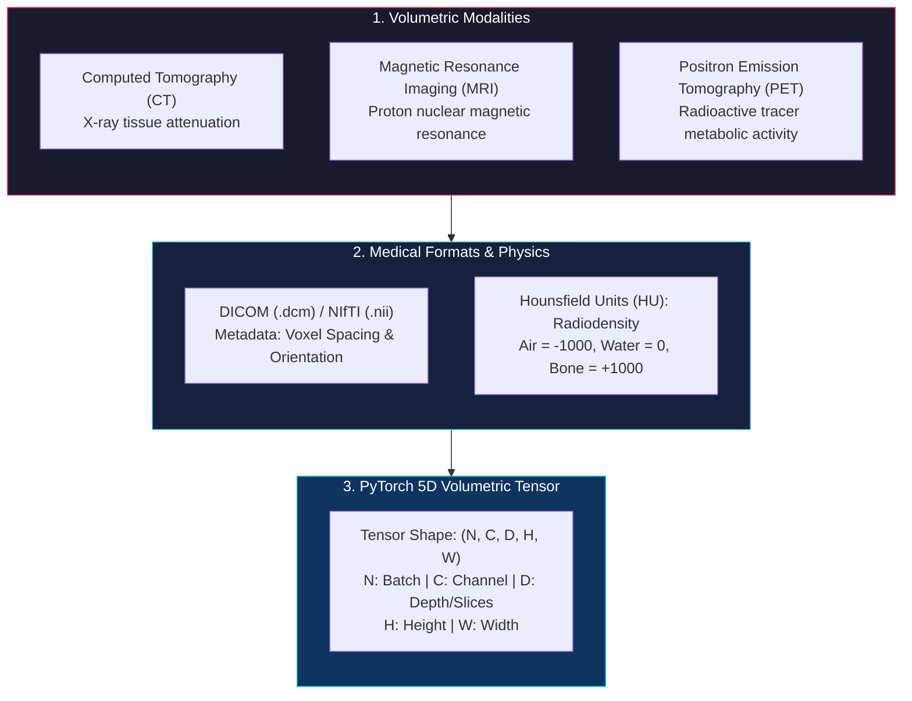

<figure style="display:flex; justify-content: center; margin: 25px 0;">
  <div style="text-align: center;">
    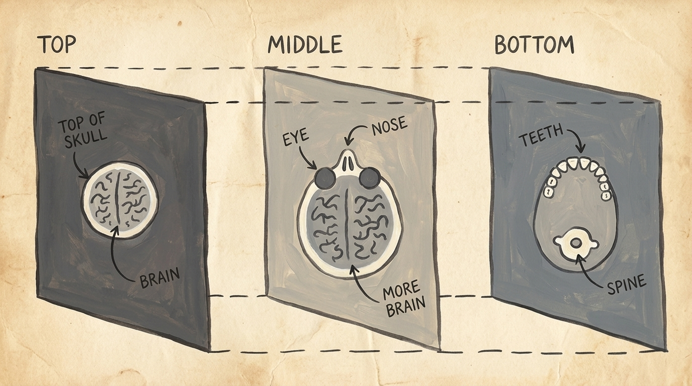
    <figcaption style="margin-top: 0.6em; text-align: center; font-size: 13px; color: #888;"><em>Volumetric CT scan cross-sections at Top (skull and brain), Middle (eyes, nose, and brain), and Bottom (teeth and spine) levels, forming a 3D volumetric tensor along the depth axis.</em></figcaption>
  </div>
</figure>

### 2.1 The 5D Volumetric Tensor Structure

In PyTorch, volumetric data is modeled as a **5-dimensional tensor**:

$$ \text{Shape}_{\text{Volumetric}} = (N, C, D, H, W) $$

Where:
* $N$: Batch dimension (number of independent patient scans in mini-batch).
* $C$: Channel dimension (typically $1$ for single-modality CT/MRI, or $>1$ for multi-parametric MRI like T1, T2, FLAIR).
* $D$: Depth dimension (number of axial cross-sectional slices along the $Z$-axis).
* $H$: Spatial height (rows of pixels per slice along the $Y$-axis).
* $W$: Spatial width (columns of pixels per slice along the $X$-axis).

---

### 2.2 Loading DICOM Volumes and Hounsfield Unit Scaling

In Computed Tomography (CT), pixel values directly correspond to physical radiodensity measured in **Hounsfield Units (HU)**:
* $\text{Air} = -1000\ \text{HU}$
* $\text{Water} = 0\ \text{HU}$
* $\text{Muscle / Soft Tissue} = +40\ \text{to}\ +80\ \text{HU}$
* $\text{Dense Bone} = +700\ \text{to}\ +3000\ \text{HU}$

```python
import torch
import imageio.v2 as imageio

# Action 1: Load a series of DICOM slices into a single 3D NumPy array
# imageio.volread automatically orders slices along depth
# In a real environment: dir_path = '../data/p1ch4/volumetric-dicom/2-LUNG 3.0  B70f-04083'
# For demonstration, we create a synthetic 3D volumetric array:
vol_depth, vol_height, vol_width = 99, 512, 512
vol_numpy = torch.randint(-1000, 1500, (vol_depth, vol_height, vol_width), dtype=torch.int16).numpy()

# Action 2: Convert to PyTorch Tensor
vol_tensor = torch.from_numpy(vol_numpy).float()
print("Raw 3D Volume Shape (D, H, W):", vol_tensor.shape)  # torch.Size([99, 512, 512])

# Action 3: Expand dimensions to conform to PyTorch 5D format: (N, C, D, H, W)
# unsqueeze(0) for Batch (N=1), unsqueeze(1) for Channel (C=1)
vol_5d = vol_tensor.unsqueeze(0).unsqueeze(0)
print("5D Volumetric Batch Shape (N, C, D, H, W):", vol_5d.shape)  # torch.Size([1, 1, 99, 512, 512])

# Action 4: Clinical Windowing / Radiodensity Clipping for Lung Tissue: [-1000 HU, +400 HU]
lung_min, lung_max = -1000.0, 400.0
vol_clipped = torch.clamp(vol_5d, min=lung_min, max=lung_max)
vol_normalized = (vol_clipped - lung_min) / (lung_max - lung_min)

print("Normalized CT volume range:", vol_normalized.min().item(), "to", vol_normalized.max().item())
```

> **Key Difference:** 2D operations utilize `torch.nn.Conv2d` and `torch.nn.MaxPool2d`. Volumetric 3D medical data utilizes `torch.nn.Conv3d` and `torch.nn.MaxPool3d`, which slide 3D volumetric convolutional kernels across all three spatial dimensions $(D, H, W)$ simultaneously.

---

## 3. Representing Tabular Data

Tabular data is the ubiquitous format of spreadsheets, relational SQL databases, and CSV files. Unlike homogeneous image grids where every element is an identical color intensity, tabular data is **heterogeneous**: different columns contain entirely different data types, physical units, dynamic ranges, and semantic meanings.

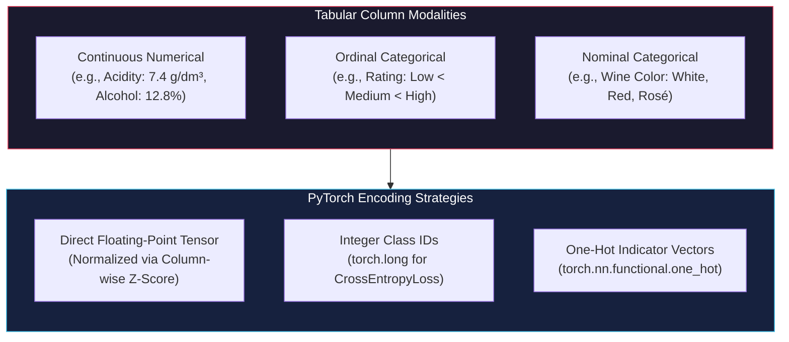

<figure style="display:flex; justify-content: center; margin: 25px 0;">
  <div style="text-align: center;">
    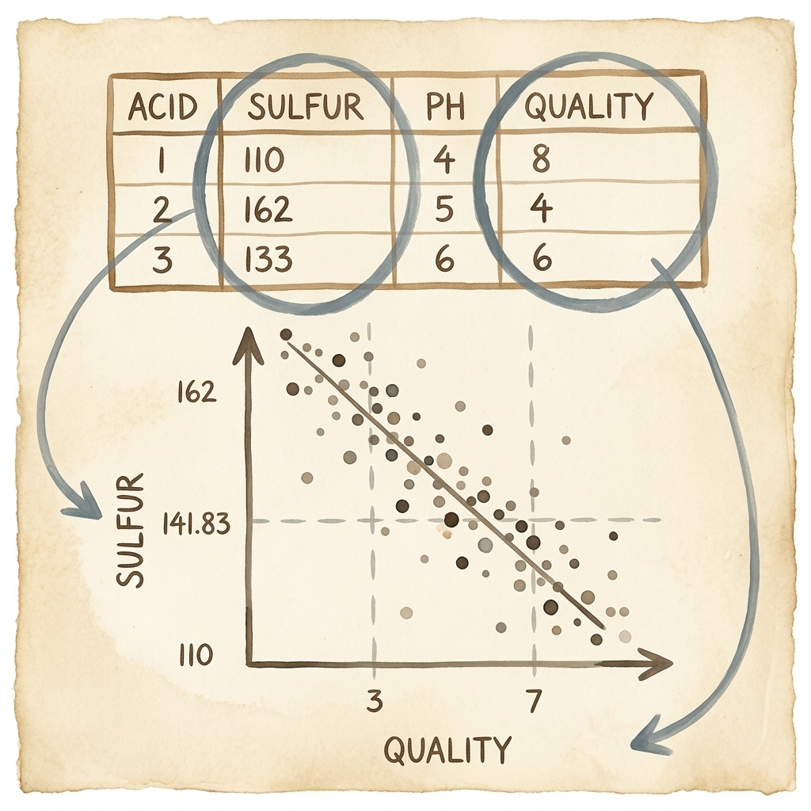
    <figcaption style="margin-top: 0.6em; text-align: center; font-size: 13px; color: #888;"><em>Extracting tabular feature columns (Sulfur Dioxide and Quality) and projecting into a 2D scatter correlation plot with threshold boundaries.</em></figcaption>
  </div>
</figure>

### 3.1 Loading Tabular Data: UCI Wine Quality Case Study

We examine the classic **UCI Wine Quality Dataset** (`winequality-white.csv`), containing $4,898$ samples of Portuguese *Vinho Verde* white wine characterized by $11$ continuous physicochemical laboratory measurements and $1$ sensory quality rating ($0-10$):

| Column Index | Feature Name | Description | Example Value |
| :--- | :--- | :--- | :--- |
| 0 | `fixed acidity` | Tartaric acid concentration ($\text{g}/\text{dm}^3$) | $7.0$ |
| 1 | `volatile acidity` | Acetic acid concentration ($\text{g}/\text{dm}^3$) | $0.27$ |
| 2 | `citric acid` | Citric acid concentration ($\text{g}/\text{dm}^3$) | $0.36$ |
| 3 | `residual sugar` | Natural sugar remaining after fermentation ($\text{g}/\text{dm}^3$) | $20.7$ |
| 4 | `chlorides` | Sodium chloride salt concentration ($\text{g}/\text{dm}^3$) | $0.045$ |
| 5 | `free sulfur dioxide` | Free $\text{SO}_2$ gas preventing microbial growth ($\text{mg}/\text{dm}^3$) | $45.0$ |
| 6 | `total sulfur dioxide` | Free + bound $\text{SO}_2$ ($\text{mg}/\text{dm}^3$) | $170.0$ |
| 7 | `density` | Water/alcohol density ratio ($\text{g}/\text{cm}^3$) | $1.001$ |
| 8 | `pH` | Acidity/alkalinity scale ($0-14$) | $3.00$ |
| 9 | `sulphates` | Potassium sulphate additive ($\text{g}/\text{dm}^3$) | $0.45$ |
| 10 | `alcohol` | Alcohol content by volume ($\%$) | $8.8$ |
| 11 | `quality` | Human sensory rating score ($0-10$) | $6$ |

Loading the tabular dataset using `numpy.loadtxt` and converting to a 2D PyTorch tensor:

```python
import numpy as np
import torch
import csv

# Action 1: Inspect CSV header line
wine_path = 'https://raw.githubusercontent.com/deep-learning-with-pytorch/dlwpt-code/master/data/p1ch4/tabular-wine/winequality-white.csv'

# Action 2: Load numerical matrix via NumPy (skipping header row, semicolon-delimited)
import urllib.request
import io

response = urllib.request.urlopen(wine_path)
csv_text = response.read().decode('utf-8')
wineq_numpy = np.loadtxt(io.StringIO(csv_text), dtype=np.float32, delimiter=';', skiprows=1)

# Action 3: Convert to PyTorch Tensor
wineq = torch.from_numpy(wineq_numpy)
print("Loaded Wine Table Tensor shape:", wineq.shape)  # torch.Size([4898, 12])
print("Tensor dtype:", wineq.dtype)                    # torch.float32
```

---

### 3.2 Feature and Target Segregation

To train machine learning models, we split the 2D tensor into **input features** ($\mathbf{X} \in \mathbb{R}^{4898 \times 11}$) and **target labels** ($\mathbf{y} \in \mathbb{R}^{4898}$):

```python
# Action 1: Extract all rows and all columns EXCEPT the last column as input features
data = wineq[:, :-1]
print("Input features shape (N, D):", data.shape)  # torch.Size([4898, 11])

# Action 2: Extract the last column (quality rating) as the target variable
target = wineq[:, -1].long()
print("Target labels shape (N):", target.shape)     # torch.Size([4898])
print("Target label values sample:", target[:5])   # e.g., tensor([6, 6, 6, 6, 6])
```

---

### 3.3 Target Encoding Strategies & When to Categorize

<figure style="display:flex; justify-content: center; margin: 25px 0;">
  <div style="text-align: center;">
    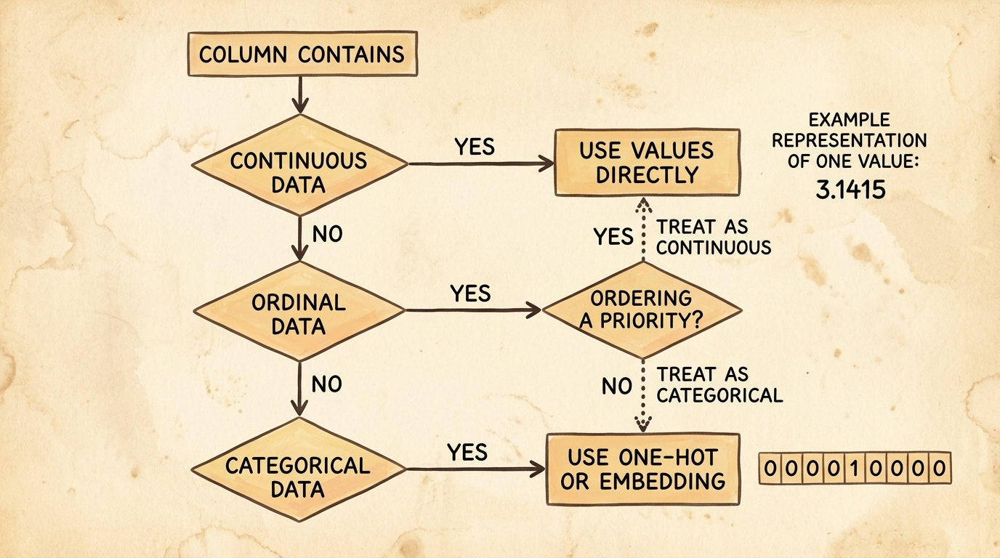
    <figcaption style="margin-top: 0.6em; text-align: center; font-size: 13px; color: #888;"><em>Decision framework for encoding tabular columns: determining whether to use direct continuous values, integer ordinal rankings, or One-Hot/dense embeddings.</em></figcaption>
  </div>
</figure>

How should features and targets be represented? Three distinct paradigms exist depending on variable structure:

1. **Continuous Regression Target:** Treat values as continuous real numbers ($y \in \mathbb{R}$). Suitable for Mean Squared Error loss ($\mathcal{L}\_{\text{MSE}}$).
2. **Discrete Integer Class Label:** Treat classes as ordinal indices ($y \in \{0, 1, \dots, C-1\}$ of type `torch.long`). Required by `torch.nn.CrossEntropyLoss()`.
3. **One-Hot Encoded Vector:** Represent each category as an orthogonal basis vector in $\mathbb{R}^{10}$, where the index corresponding to the true score is $1$ and all other entries are $0$:
   $$ \mathbf{y}\_i = [0, 0, \dots, 0, \underbrace{1}_{\text{index } k}, 0, \dots, 0]^T $$

#### Implementing One-Hot Encoding via `scatter_` and `torch.nn.functional.one_hot`

```python
import torch
import torch.nn.functional as F

num_classes = 10  # Scores range from 0 to 9 (or 10)

# Approach 1: Low-level in-place scatter_ method (classic PyTorch)
# Step a: Allocate zero-filled tensor of shape (N, num_classes)
target_onehot_scatter = torch.zeros(target.shape[0], num_classes)
# Step b: Scatter 1.0 values along dimension 1 at indices specified by target.unsqueeze(1)
target_onehot_scatter.scatter_(1, target.unsqueeze(1), 1.0)
print("Scatter One-Hot shape:", target_onehot_scatter.shape)  # torch.Size([4898, 10])
print("Sample One-Hot vector for score 6:\n", target_onehot_scatter[0])

# Approach 2: Modern PyTorch Functional API (Recommended)
target_onehot_fn = F.one_hot(target, num_classes=num_classes).float()
print("F.one_hot Tensor shape:", target_onehot_fn.shape)      # torch.Size([4898, 10])

# Verify equality of both approaches
assert torch.equal(target_onehot_scatter, target_onehot_fn)
print("Both One-Hot representations are identical.")
```

> **Key Rule on Categorical Variables:**
> * **Continuous Variables (e.g. Temperature, Density):** Have natural scale and geometric meaning. $14^\circ\text{C}$ is colder than $28^\circ\text{C}$, and the difference is exactly $14^\circ\text{C}$. Keep as floating-point numbers.
> * **Ordinal Variables (e.g. Small < Medium < Large):** Have ordering, but step sizes are not strictly equidistant. Can be encoded as integers or one-hot vectors.
> * **Nominal Categorical Variables (e.g. White, Red, Rosé):** Have **no natural ordering**. Encoding White as $1$, Red as $2$, and Rosé as $3$ falsely implies that Rosé is "greater" than White or that Red is the average of White and Rosé. **Nominal variables must ALWAYS be One-Hot encoded.**

---

### 3.4 Tabular Feature Normalization ($Z$-Score Standardization)

Because chemical columns have vastly different units and scales (e.g. `density` $\approx 0.99$, while `total sulfur dioxide` $\approx 200$), unnormalized gradient descent would oscillate erratically along large-magnitude feature dimensions.

We compute column-wise mean $\boldsymbol{\mu} \in \mathbb{R}^{11}$ and variance $\boldsymbol{\sigma}^2 \in \mathbb{R}^{11}$ across the sample dimension (`dim=0`):

$$ \mu\_j = \frac{1}{N} \sum\_{i=1}^{N} x\_{i, j}, \quad \sigma^2\_j = \frac{1}{N} \sum\_{i=1}^{N} (x\_{i, j} - \mu\_j)^2 $$

$$ z\_{i, j} = \frac{x\_{i, j} - \mu\_j}{\sqrt{\sigma^2\_j + \epsilon}} $$

```python
# Action 1: Compute column-wise statistics along dimension 0
data_mean = torch.mean(data, dim=0)
data_var = torch.var(data, dim=0, unbiased=False)

print("Column-wise Means:\n", data_mean)
print("Column-wise Variances:\n", data_var)

# Action 2: Vectorized broadcasting standardization across all 4,898 rows
data_normalized = (data - data_mean) / torch.sqrt(data_var + 1e-7)

print("Standardized Data Shape:", data_normalized.shape)
print("Normalized Column 0 Mean:", data_normalized[:, 0].mean().item())  # Approx 0.0
print("Normalized Column 0 Std: ", data_normalized[:, 0].std().item())   # Approx 1.0
```

---

### 3.5 Finding Thresholds: Simple Rule-Based Binary Classification

To demonstrate how tensor boolean masking operates on tabular data, we formulate a simple binary classification problem: distinguishing **Good Wines** ($\text{Score} > 5$) from **Bad Wines** ($\text{Score} \le 5$).

```python
# Action 1: Create boolean mask identifying high-quality wines
bad_indexes = target <= 5
good_indexes = target > 5

print("Number of Bad Wines (score <= 5):", bad_indexes.sum().item())    # 1640
print("Number of Good Wines (score > 5):", good_indexes.sum().item())   # 3258

# Action 2: Compare chemical profiles of good vs bad wines
bad_data = data[bad_indexes]
good_data = data[good_indexes]

bad_mean = torch.mean(bad_data, dim=0)
good_mean = torch.mean(good_data, dim=0)

# Column 6: Total Sulfur Dioxide | Column 10: Alcohol
print("Total Sulfur Dioxide -> Bad Mean:", bad_mean[6].item(), "| Good Mean:", good_mean[6].item())
print("Alcohol Percentage   -> Bad Mean:", bad_mean[10].item(), "| Good Mean:", good_mean[10].item())

# Action 3: Build a simple threshold classifier using Sulfur Dioxide threshold (e.g., < 141.83)
# Hypothesizing lower sulfur dioxide correlates with higher wine quality:
total_sulfur_threshold = 141.83
predicted_good = data[:, 6] < total_sulfur_threshold

# Action 4: Evaluate classification accuracy using boolean tensor operations
actual_good = target > 5
true_positives = (predicted_good & actual_good).sum().item()
total_predicted = predicted_good.sum().item()
total_actual_good = actual_good.sum().item()

precision = true_positives / total_predicted
recall = true_positives / total_actual_good
accuracy = (predicted_good == actual_good).float().mean().item()

print(f"Rule Accuracy: {accuracy * 100:.2f}% | Precision: {precision * 100:.2f}% | Recall: {recall * 100:.2f}%")
```

---

## 4. Working with Time Series Data

Time series data introduces an ordered **temporal dimension**. Successive rows are not independent and identically distributed (i.i.d.) observations; rather, each timestep is intimately correlated with preceding and future values across days, seasons, and cyclical trends.

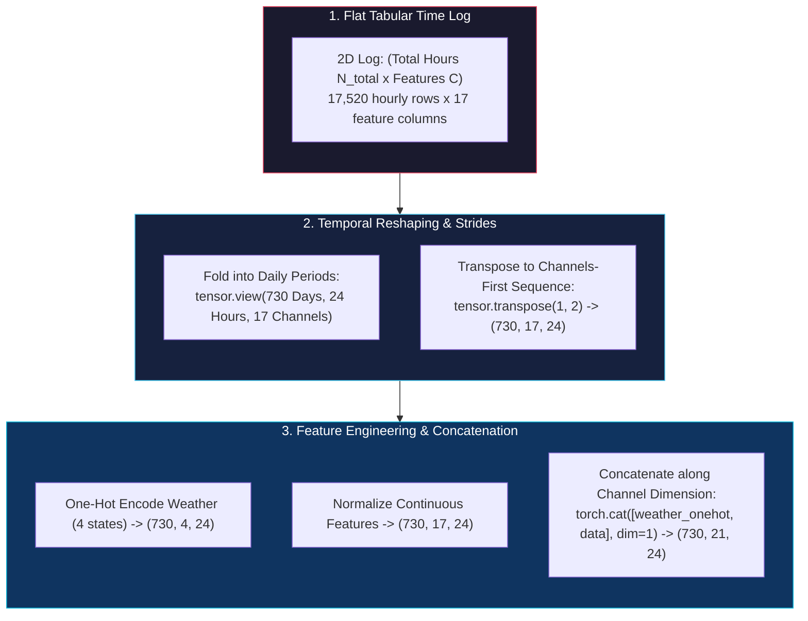

<figure style="display:flex; justify-content: center; margin: 25px 0;">
  <div style="text-align: center;">
    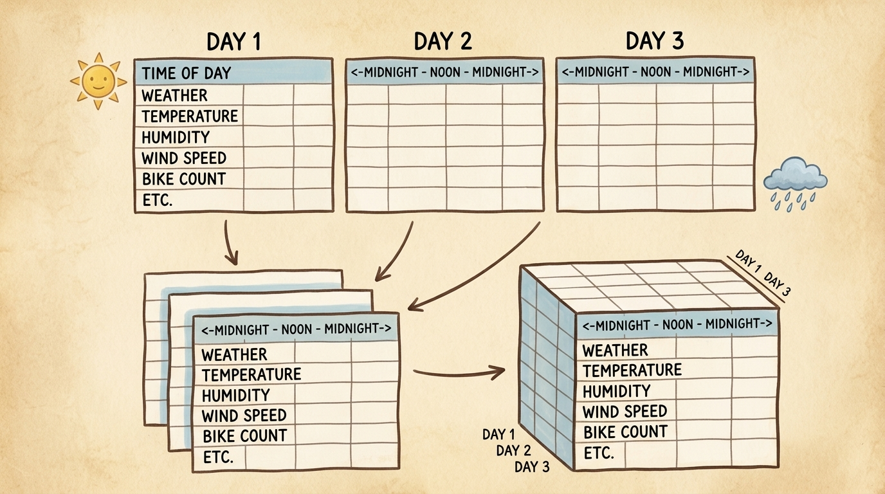
    <figcaption style="margin-top: 0.6em; text-align: center; font-size: 13px; color: #888;"><em>Folding daily tabular records (Day 1, Day 2, Day 3) across 24-hour cycles into a 3D tensor cube with Day, Hour, and Feature Channel axes.</em></figcaption>
  </div>
</figure>

### 4.1 Case Study: Capital Bikeshare Dataset

We examine the **Capital Bikeshare hourly dataset** (`hour-fixed.csv`), containing hourly bike rental records in Washington, D.C. across two full years ($2011-2012$):
* Total Hours: $17,520$ hours ($730$ days $\times 24$ hours/day).
* Features: $17$ columns (record ID, season, year, month, hour, holiday, weekday, workingday, weather situation, normalized temperature, feeling temperature, humidity, windspeed, casual riders, registered riders, total count `cnt`).

Loading and inspecting the raw 2D tabular logs:

```python
import numpy as np
import torch
import io
import urllib.request

# Action 1: Load bike sharing CSV from remote repository
bike_url = 'https://raw.githubusercontent.com/deep-learning-with-pytorch/dlwpt-code/master/data/p1ch4/bike-sharing-dataset/hour-fixed.csv'
response = urllib.request.urlopen(bike_url)
csv_bytes = response.read()

bikes_numpy = np.loadtxt(io.BytesIO(csv_bytes), dtype=np.float32, delimiter=',', skiprows=1,
                         converters={1: lambda s: float(s[8:10])})  # Parse date string day

bikes = torch.from_numpy(bikes_numpy)
print("Flat 2D Time Series Tensor shape (Total Hours, Columns):", bikes.shape)  # torch.Size([17520, 17])
```

---

### 4.2 Reshaping Flat Logs into 3D Temporal Tensors & Layout Ordering

A 2D array of $(17520, 17)$ treats all hours as a continuous flat line. However, human society operates on **cyclical circadian rhythms (24-hour periods)**. We structure the data into a 3D tensor of shape:

$$ \text{Shape}_{\text{Time Series}} = (N, L, C) = (730\ \text{Days}, 24\ \text{Hours}, 17\ \text{Channels}) $$

<figure style="display:flex; justify-content: center; margin: 25px 0;">
  <div style="text-align: center;">
    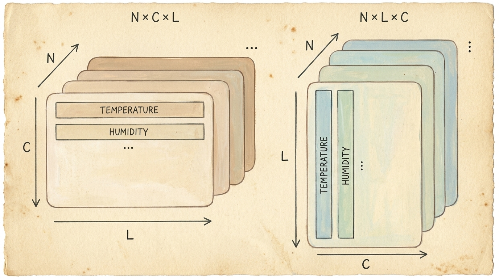
    <figcaption style="margin-top: 0.6em; text-align: center; font-size: 13px; color: #888;"><em>Comparison of Channels-First $(N \times C \times L)$ and Sequence-First $(N \times L \times C)$ tensor arrangements for multi-channel temporal data.</em></figcaption>
  </div>
</figure>

```python
# Action 1: Reshape 2D tensor into 3D tensor via zero-copy view
# 17520 total hours == 730 days * 24 hours
daily_bikes = bikes.view(-1, 24, bikes.shape[1])
print("Reshaped 3D Temporal Tensor Shape (N, L, C):", daily_bikes.shape)  # torch.Size([730, 24, 17])
print("Tensor Strides (N, L, C):", daily_bikes.stride())                   # (408, 17, 1)

# Action 2: Transpose to Channels-First Sequence layout (N, C, L) commonly expected by 1D Convolutions
daily_bikes_ncl = daily_bikes.transpose(1, 2)
print("Transposed Sequence Shape (N, C, L):", daily_bikes_ncl.shape)       # torch.Size([730, 17, 24])
print("Transposed Strides (N, C, L):", daily_bikes_ncl.stride())           # (408, 1, 17)
```

---

### 4.3 Encoding Categorical Weather Features and Channel Concatenation

Column 9 represents **Weather Situation** ($1$: Clear, $2$: Mist/Cloudy, $3$: Light Snow/Rain, $4$: Heavy Rain/Thunderstorm). Because weather conditions are nominal categories, treating them as continuous integers $1, 2, 3, 4$ imposes false linearity.

We extract the weather column, one-hot encode it into $4$ binary channels, and concatenate it back with the continuous measurements:

```python
import torch.nn.functional as F

# Action 1: Extract weather condition for all days and hours (Column index 9)
# Weather classes are 1-indexed (1 to 4); subtract 1 to get 0-indexed classes [0, 3]
weather_classes = (daily_bikes[:, :, 9].long() - 1).clamp(0, 3)
print("Weather classes slice shape (N, L):", weather_classes.shape)  # torch.Size([730, 24])

# Action 2: One-hot encode weather into shape (N, L, 4)
weather_onehot = F.one_hot(weather_classes, num_classes=4).float()
print("Weather One-Hot shape (N, L, C_weather):", weather_onehot.shape)  # torch.Size([730, 24, 4])

# Action 3: Transpose to (N, C_weather, L)
weather_onehot_ncl = weather_onehot.transpose(1, 2)
print("Weather One-Hot NCL shape:", weather_onehot_ncl.shape)             # torch.Size([730, 4, 24])

# Action 4: Concatenate weather channels with original features along Channel dimension (dim=1)
bikes_augmented = torch.cat([weather_onehot_ncl, daily_bikes_ncl], dim=1)
print("Augmented Multimodal Tensor Shape (N, C_total, L):", bikes_augmented.shape)  # torch.Size([730, 21, 24])
```

---

## 5. Representing Text (Natural Language Processing)

Unlike images (continuous spectral grids) or tabular tables (numeric records), human language is inherently **discrete, symbolic, and variable-length**. Translating text into tensors requires establishing a vocabulary mapping and projecting discrete tokens into continuous vector spaces.

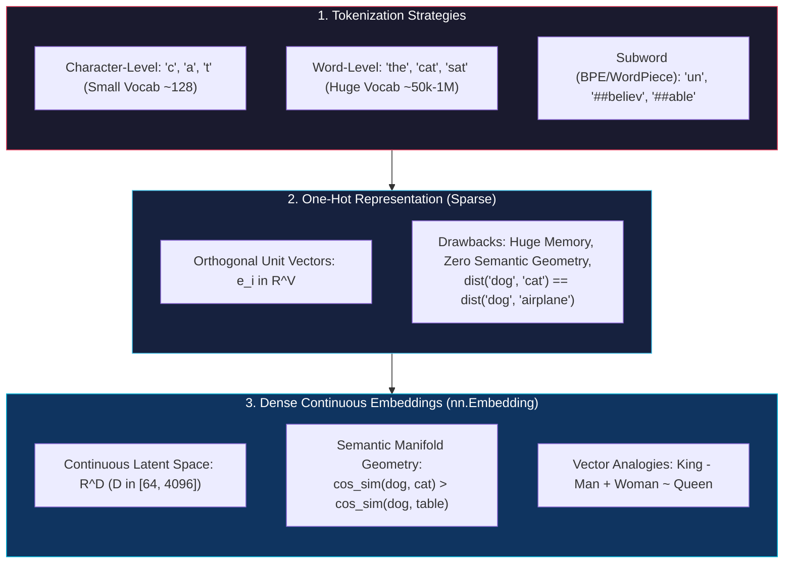

<figure style="display:flex; justify-content: center; margin: 25px 0;">
  <div style="text-align: center;">
    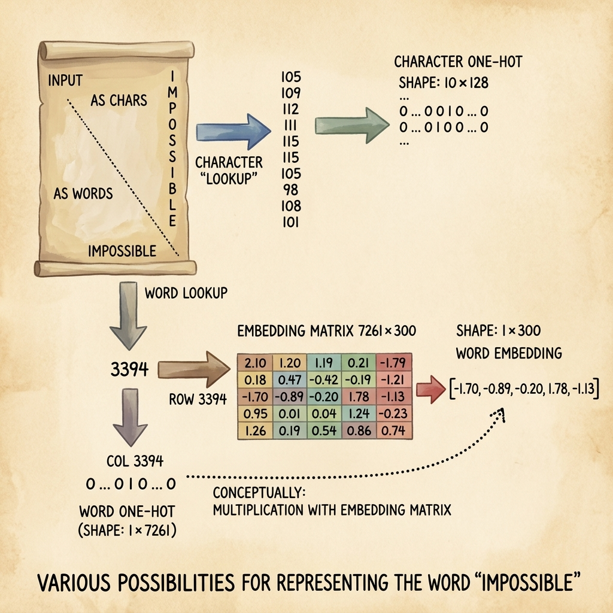
    <figcaption style="margin-top: 0.6em; text-align: center; font-size: 13px; color: #888;"><em>Representing the word 'IMPOSSIBLE': comparing character-level lookup $(10 \times 128)$ against word token lookup $(3394)$ and dense embedding matrix extraction $(1 \times 300)$.</em></figcaption>
  </div>
</figure>

### 5.1 Character-Level One-Hot Encoding

In character-level encoding, every unique typographic character (letters, digits, punctuation, whitespace) represents a distinct token:

```python
import torch

# Action 1: Define text sample
raw_text = "Pride and Prejudice by Jane Austen"

# Action 2: Build ASCII character vocabulary mapping
# Standard ASCII spans 128 characters [0, 127]
vocab_size = 128
char_tensor = torch.zeros(len(raw_text), vocab_size)

# Action 3: Populate One-Hot character matrix of shape (Seq_Len, Vocab_Size)
for i, char in enumerate(raw_text):
    char_code = ord(char)
    if char_code < vocab_size:
        char_tensor[i, char_code] = 1.0

print("Character One-Hot Matrix Shape (L, V):", char_tensor.shape)  # torch.Size([34, 128])
print("First character ('P', ASCII 80) index value:", char_tensor[0, 80].item())  # 1.0
```

---

### 5.2 Word-Level One-Hot Encoding and the Curse of Dimensionality

In word-level encoding, individual words serve as tokens:

```python
import re
import torch

# Action 1: Clean and tokenize text into words
sentence = "Deep learning with PyTorch provides powerful tools for machine learning."
clean_words = re.findall(r'\w+', sentence.lower())
print("Tokenized Words:", clean_words)

# Action 2: Construct unique word vocabulary dictionary
word_to_index = {word: idx for idx, word in enumerate(sorted(set(clean_words)))}
vocab_len = len(word_to_index)
print("Vocabulary Size:", vocab_len)
print("Vocabulary Mapping:", word_to_index)

# Action 3: Construct word-level One-Hot matrix of shape (Num_Words, Vocab_Size)
word_tensor = torch.zeros(len(clean_words), vocab_len)
for i, word in enumerate(clean_words):
    word_tensor[i, word_to_index[word]] = 1.0

print("Word-Level One-Hot Matrix Shape:", word_tensor.shape)  # torch.Size([10, 9])
```

#### Fundamental Limitations of One-Hot Encodings
1. **Curse of Dimensionality:** A standard English dictionary contains $50,000$ to $1,000,000$ words. A One-Hot vector for a single word would contain hundreds of thousands of zeros and exactly one $1$, wasting massive memory.
2. **Orthogonality & Zero Semantic Distance:** Any two distinct One-Hot vectors $\mathbf{e}\_i, \mathbf{e}\_j$ are strictly orthogonal:
   $$ \mathbf{e}\_i^T \mathbf{e}\_j = 0 \quad (\forall i \neq j) $$
   The Euclidean distance between `"cat"` and `"dog"` is exactly $\sqrt{2}$, which is identical to the distance between `"cat"` and `"refrigerator"`. One-hot encoding cannot represent semantic similarity.

---

### 5.3 Dense Text Embeddings (`torch.nn.Embedding`) & Semantic Geometry

<figure style="display:flex; justify-content: center; margin: 25px 0;">
  <div style="text-align: center;">
    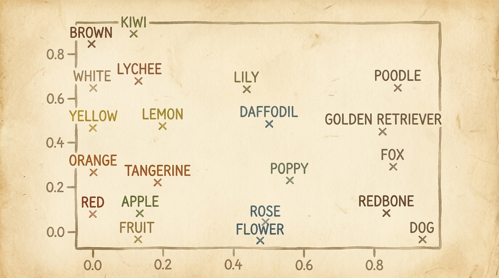
    <figcaption style="margin-top: 0.6em; text-align: center; font-size: 13px; color: #888;"><em>Continuous 2D semantic embedding space showing natural clustering of fruits/colors (left), flowers (center), and dog breeds/animals (right).</em></figcaption>
  </div>
</figure>

To solve the limitations of one-hot representations, deep learning maps discrete token IDs into a **dense continuous vector space** $\mathbb{R}^d$ (where embedding dimension $d \in [64, 4096]$):

$$ \mathbf{E}: \{0, 1, \dots, |\mathcal{V}| - 1\} \to \mathbb{R}^d $$

```python
import torch
import torch.nn as nn

# Action 1: Define vocabulary size and target embedding dimension
vocab_size = 10000     # 10,000 unique token IDs
embedding_dim = 128     # Continuous vector representation size

# Action 2: Instantiate PyTorch Embedding layer (a learnable lookup matrix of shape V x D)
embedding_layer = nn.Embedding(num_embeddings=vocab_size, embedding_dim=embedding_dim)
print("Embedding Weight Matrix Shape:", embedding_layer.weight.shape)  # torch.Size([10000, 128])

# Action 3: Convert sequence of word IDs into dense continuous tensor
input_token_ids = torch.tensor([42, 108, 999, 12, 501], dtype=torch.long)
dense_vectors = embedding_layer(input_token_ids)

print("Dense Output Tensor Shape (Seq_Len, Embed_Dim):", dense_vectors.shape)  # torch.Size([5, 128])
```

#### Geometric Semantics & Vector Arithmetic
In a well-trained embedding space (such as Word2Vec, GloVe, or LLM token embeddings), geometric distances mirror semantic relationships:
* **Cosine Similarity:** $\cos(\theta) = \frac{\mathbf{u} \cdot \mathbf{v}}{\|\mathbf{u}\| \|\mathbf{v}\|}$ is high for related words (`"doctor"`, `"hospital"`).
* **Vector Analogies:** Linear vector arithmetic captures analogical relationships:
  $$ \vec{v}\_{\text{King}} - \vec{v}\_{\text{Man}} + \vec{v}\_{\text{Woman}} \approx \vec{v}\_{\text{Queen}} $$

> **Key Takeaway (Embeddings as a Universal Blueprint):** Embeddings are not limited to text. Any high-cardinality discrete category—such as User IDs and Product IDs in recommendation systems, medical diagnostic codes (ICD-10), graph node identifiers, or postal codes—can be mapped into continuous vector spaces via `nn.Embedding`.

---

## 6. Comprehensive Modality Cheat-Sheet

The following table summarizes the standard tensor shapes, storage formats, typical data types, and normalization conventions across all primary deep learning data modalities:

| Modality | Standard PyTorch Shape | Layout Convention | Typical `dtype` | Normalization / Scaling |
| :--- | :--- | :--- | :--- | :--- |
| **2D Grayscale Images** | $(N, 1, H, W)$ | Channels-First (NCHW) | `float32` | $x / 255.0$ or $(x - \mu) / \sigma$ |
| **2D Color Images** | $(N, 3, H, W)$ | Channels-First (NCHW) / Channels-Last | `float32` / `bfloat16` | Per-channel ImageNet standardization |
| **3D Medical Volumetric (CT/MRI)** | $(N, C, D, H, W)$ | 5D Volumetric | `float32` | Hounsfield Unit Windowing / Min-Max $[0, 1]$ |
| **Video Sequences** | $(N, C, T, H, W)$ | Batch, Channel, Time, Height, Width | `float32` | Frame-wise / Channel-wise standardization |
| **Audio Waveforms** | $(N, C, L)$ | Batch, Audio Channels, Sample Length | `float32` | Peak normalization $[-1.0, 1.0]$ or RMS scaling |
| **Audio Spectrograms (STFT / Mel)** | $(N, C, F, T)$ | Batch, Channel, Freq Bins, Time Steps | `float32` | Decibel scaling ($\log \text{power}$) |
| **Tabular Continuous Features** | $(N, D)$ | Batch, Feature Dimension | `float32` | Column-wise $Z$-Score: $(x - \mu_j) / \sigma_j$ |
| **Tabular Categorical Labels** | $(N)$ or $(N, C)$ | Class ID (`long`) / One-Hot (`float32`) | `int64` / `float32` | Integer indexing or `F.one_hot` |
| **Time Series Sequences** | $(N, C, L)$ or $(N, L, C)$ | Channels-First / Channels-Last | `float32` | Per-channel Standardization + Cyclical One-Hot |
| **Text (Tokenized Sequences)** | $(N, L)$ | Batch, Sequence Length | `int64` | Token IDs mapped through `nn.Embedding` $\to (N, L, D)$ |

---

## 7. Chapter Exercises and Analytical Solutions

Below are the complete analytical and executable solutions to the exercises at the end of Chapter 4 of *Deep Learning with PyTorch*.

---

### Exercise 1: Computing Per-Channel Mean Across an Image Directory

**Problem Statement:** Load several images of different animals, crop or resize them to a uniform spatial size $(256 \times 256)$, assemble them into a 4D batch tensor $(N, C, H, W)$, and compute the empirical per-channel mean and standard deviation across the dataset.

```python
import torch

# Step 1: Simulate loading 4 RGB images resized to 256x256
batch_size = 4
C, H, W = 3, 256, 256

# Synthetic dataset with different channel distributions
torch.manual_seed(42)
imgs = torch.stack([
    torch.normal(mean=0.6, std=0.15, size=(C, H, W)),  # Image 1
    torch.normal(mean=0.4, std=0.20, size=(C, H, W)),  # Image 2
    torch.normal(mean=0.5, std=0.10, size=(C, H, W)),  # Image 3
    torch.normal(mean=0.7, std=0.25, size=(C, H, W)),  # Image 4
]).clamp(0.0, 1.0)

print("Batch shape (N, C, H, W):", imgs.shape)

# Step 2: Compute mean and standard deviation across batch, height, and width
dataset_mean = imgs.mean(dim=[0, 2, 3])
dataset_std = imgs.std(dim=[0, 2, 3])

print("Computed Per-Channel Mean (R, G, B):", dataset_mean)
print("Computed Per-Channel Std  (R, G, B):", dataset_std)

# Step 3: Verify standardized tensor properties
imgs_std = (imgs - dataset_mean.view(1, 3, 1, 1)) / dataset_std.view(1, 3, 1, 1)
print("Post-normalization overall mean:", imgs_std.mean(dim=[0, 2, 3]))  # Approx [0.0, 0.0, 0.0]
print("Post-normalization overall std: ", imgs_std.std(dim=[0, 2, 3]))   # Approx [1.0, 1.0, 1.0]
```

---

### Exercise 2: Rolling Strided Windows on Time Series

**Problem Statement:** Given a time series tensor of shape $(N\_{\text{total}}, C)$, construct a rolling temporal window tensor of shape $(N\_{\text{windows}}, L\_{\text{window}}, C)$ with a window length of $L = 24$ and a step size of $S = 1$ using PyTorch tensor unfolding.

```python
import torch

# Step 1: Create synthetic hourly time series (100 hours, 5 feature channels)
total_hours = 100
n_features = 5
time_data = torch.randn(total_hours, n_features)

# Step 2: Extract rolling windows of length 24 along dimension 0 using Tensor.unfold()
window_size = 24
step_size = 1

# unfold(dimension, size, step)
# Original shape: (100, 5) -> Unfold on dim 0 -> Shape: (num_windows, 5, window_size)
rolling_windows = time_data.unfold(dimension=0, size=window_size, step=step_size)
print("Unfolded tensor shape (Num_Windows, Features, Window_Len):", rolling_windows.shape)  # torch.Size([77, 5, 24])

# Step 3: Permute to standard (Num_Windows, Window_Len, Features)
rolling_windows_nlc = rolling_windows.permute(0, 2, 1)
print("Permuted rolling windows shape (N_windows, L, C):", rolling_windows_nlc.shape)        # torch.Size([77, 24, 5])
```

---

### Exercise 3: Text Preprocessing, Character Tokenization, and Dense Projection

**Problem Statement:** Take a block of Python source code, build a character-level vocabulary, convert the text into a sequence of integer token IDs, and project it through an `nn.Embedding` layer with dimension $d = 64$.

```python
import torch
import torch.nn as nn

# Step 1: Python source code sample
code_sample = """def compute_loss(y_pred, y_true):
    loss = torch.mean((y_pred - y_true) ** 2)
    return loss"""

# Step 2: Build character vocabulary
unique_chars = sorted(list(set(code_sample)))
char2idx = {char: idx for idx, char in enumerate(unique_chars)}
vocab_size = len(char2idx)
print(f"Unique Characters ({vocab_size}):", repr(''.join(unique_chars)))

# Step 3: Convert source code string to 1D Tensor of Token IDs
token_ids = torch.tensor([char2idx[c] for c in code_sample], dtype=torch.long)
print("Encoded Token IDs Tensor shape:", token_ids.shape)  # torch.Size([92])

# Step 4: Project token IDs through dense embedding layer
embed_dim = 64
char_embedding = nn.Embedding(num_embeddings=vocab_size, embedding_dim=embed_dim)
embedded_code = char_embedding(token_ids)

print("Dense Embedded Code Tensor shape (Seq_Len, Embed_Dim):", embedded_code.shape)  # torch.Size([92, 64])
```

---

## 8. Summary & Next Steps

In this chapter, we established how raw real-world data across every major modality is transformed into structured, continuous PyTorch tensors:
* **Images:** Loaded from disk as `uint8`, permuted from NumPy $H \times W \times C$ to PyTorch $C \times H \times W$, batched into $N \times C \times H \times W$, and standardized per channel.
* **3D Volumetric Data:** Slices stacked into 5D tensors $(N, C, D, H, W)$ with Hounsfield radiodensity windowing for 3D CNNs.
* **Tabular Data:** Heterogeneous continuous columns normalized via $Z$-score and nominal categorical features encoded into orthogonal One-Hot vectors via `torch.nn.functional.one_hot`.
* **Time Series:** Flat logs folded into 3D tensors $(N, L, C)$ or $(N, C, L)$ capturing cyclical periods, combining normalized sensor channels with one-hot temporal weather states.
* **Text & NLP:** Discrete character and word tokens projected via `nn.Embedding` into dense, continuous semantic vector spaces.

With input data reliably encoded into continuous floating-point tensors, we are now ready to build differentiable mathematical models that learn from these representations. In **Chapter 5: The Mechanics of Learning**, we will construct our first parameterized model, define loss functions, compute analytical gradients, and optimize parameters via gradient descent.
