# Telling Birds from Airplanes: Learning from Images

<!-- toc -->

<div style="margin-bottom: 20px;">
  <a href="https://colab.research.google.com/github/emreaslan7/ai/blob/main/notebooks/deep-learning-with-pytorch/07-telling-birds-from-airplanes.ipynb" target="_blank">
    
  </a>
</div>

In Chapter 6, we designed and trained our first multi-layer neural network using synthetic, scalar temperature data. We observed how stacking affine transformations with non-linear activation functions enables an artificial neural network to approximate complex non-linear curves. However, real-world machine learning rarely presents itself as clean, low-dimensional scalar series. Visual perception—our ability to distinguish objects, identify textures, and parse scenes—operates across high-dimensional pixel matrices subject to spatial shifts, illumination variations, and complex semantic hierarchies.

In this chapter, following Chapter 7 of *Deep Learning with PyTorch (2nd Edition)*, we confront a quintessential computer vision task: **classifying real-world images**. We ground our exploration on the **CIFAR-10** benchmark dataset, initially framing the problem as distinguishing between **birds** and **airplanes**. Along the way, we establish standard PyTorch data ingestion workflows using `Dataset` and `DataLoader`, perform channel-wise statistical normalization, analyze the mathematical foundations of classification loss functions (**Softmax**, **NLLLoss**, and **CrossEntropyLoss**), train a baseline fully connected network, and uncover the critical structural limitations that motivate **Convolutional Neural Networks (CNNs)**.

---

## 1. Image Classification and the CIFAR-10 Benchmark

Visual classification is fundamentally a mapping from high-dimensional spatial grids to discrete categorical distributions:
$$ f: \mathbb{R}^{C \times H \times W} \longrightarrow \Delta^{K-1} $$
where $C$ denotes color channels, $H \times W$ the spatial resolution, and $\Delta^{K-1}$ the probability simplex over $K$ distinct classes.

### 1.1 The CIFAR-10 Dataset Architecture

Compiled by Alex Krizhevsky, Vinod Nair, and Geoffrey Hinton, the **CIFAR-10** dataset is an enduring foundational benchmark in computer vision. It contains 60,000 $32 \times 32$ color (RGB) images evenly divided into 10 mutually exclusive classes:
* **Vehicles:** `airplane`, `automobile`, `ship`, `truck`
* **Animals:** `bird`, `cat`, `deer`, `dog`, `frog`, `horse`

The dataset is partitioned into 50,000 training images and 10,000 testing images (5,000 and 1,000 per class, respectively).

<figure style="display:flex; justify-content: center; margin: 25px 0;">
  <div style="text-align: center;">
    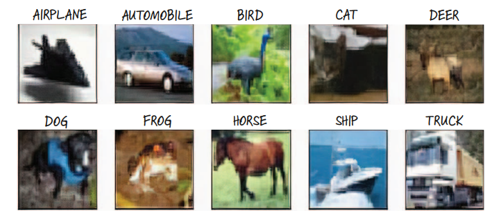
    <figcaption style="margin-top: 0.6em; text-align: center; font-size: 13px; color: #888;"><em>Figure 7.1: Sample images representing the 10 distinct classes of the CIFAR-10 dataset at native 32x32 resolution.</em></figcaption>
  </div>
</figure>

At $32 \times 32$ pixels with 3 color channels, each single image comprises $3 \times 32 \times 32 = 3{,}072$ discrete numeric values. While minute compared to modern multi-megapixel camera sensors, this resolution captures sufficient spatial and chromatic features for algorithmic discrimination while remaining lightweight enough to train quickly on consumer CPUs and entry-level GPUs.

---

## 2. Ingesting Data with PyTorch Datasets

In production deep learning pipelines, data loading must remain cleanly decoupled from model architectures and training loops. PyTorch formalizes this separation of concerns through the **`torch.utils.data.Dataset`** abstract class.

### 2.1 The `Dataset` Interface Protocol

Any PyTorch `Dataset` subclass provides a standard uniform interface by implementing two core Python dunder methods:
1. `__len__(self)`: Returns the total number of items in the collection, accessed via the Python built-in `len(dataset)`.
2. `__getitem__(self, index)`: Retrieves the sample and its corresponding ground-truth label at integer position `index`, accessed via subscripting `dataset[index]`.

<figure style="display:flex; justify-content: center; margin: 25px 0;">
  <div style="text-align: center;">
    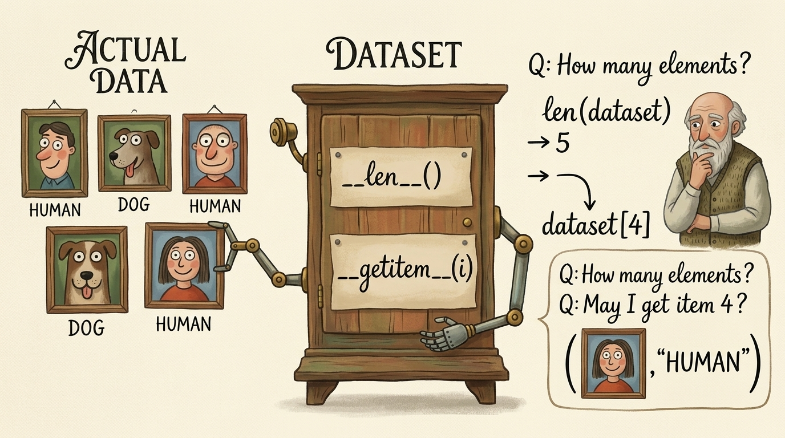
    <figcaption style="margin-top: 0.6em; text-align: center; font-size: 13px; color: #888;"><em>Figure 7.2: The PyTorch Dataset protocol: an abstraction presenting an indexed collection through standard `__len__()` and `__getitem__(index)` interfaces.</em></figcaption>
  </div>
</figure>

### 2.2 Downloading and Instantiating CIFAR-10

PyTorch provides out-of-the-box dataset access via the companion library **`torchvision`**. By default, `torchvision.datasets.CIFAR10` downloads the raw tarball, decompresses the binary batches, and serves samples as PIL (Python Imaging Library) image instances paired with integer target indices.

Let us instantiate both the training and validation splits:

```python
from pathlib import Path
import torchvision
from torchvision import datasets

# Define localized cache directory
data_path = Path("./data/cifar10")
data_path.mkdir(parents=True, exist_ok=True)

# Instantiate CIFAR-10 training partition (50,000 images)
cifar10 = datasets.CIFAR10(
    root=str(data_path),
    train=True,
    download=True
)

# Instantiate CIFAR-10 validation partition (10,000 images)
cifar10_val = datasets.CIFAR10(
    root=str(data_path),
    train=False,
    download=True
)

print(f"Training dataset size: {len(cifar10)}")
print(f"Validation dataset size: {len(cifar10_val)}")
```

When querying an arbitrary element via `cifar10[99]`, PyTorch returns a 2-element tuple:
```python
img, label = cifar10[99]
class_names = ['airplane', 'automobile', 'bird', 'cat', 'deer', 
               'dog', 'frog', 'horse', 'ship', 'truck']

print(f"Image instance type: {type(img)}")
print(f"Target integer label: {label} ({class_names[label]})")
```

The returned object is a PIL RGB image with dimensions $(32, 32)$.

<figure style="display:flex; justify-content: center; margin: 25px 0;">
  <div style="text-align: center;">
    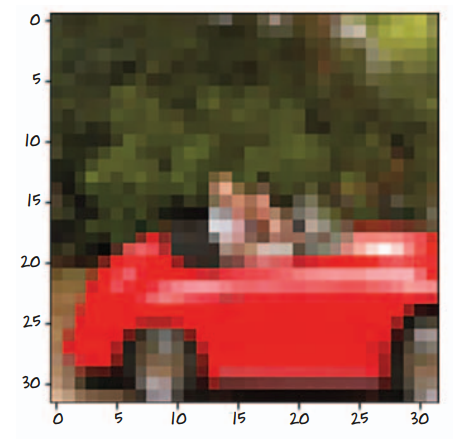
    <figcaption style="margin-top: 0.6em; text-align: center; font-size: 13px; color: #888;"><em>Figure 7.3: A single 32x32 pixel CIFAR-10 car image rendered with coordinate grid ticks.</em></figcaption>
  </div>
</figure>

---

## 3. Dataset Transforms and Tensor Normalization

Neural networks cannot ingest raw PIL images directly; computations require floating-point tensors with standardized dimensions and calibrated statistical distributions. `torchvision.transforms` provides composable operators that process images on-the-fly during indexing.

### 3.1 Converting Images to Tensors: `transforms.ToTensor`

The `transforms.ToTensor()` pipeline performs two distinct operations:
1. **Dimension Reordering:** Converts PIL image channels from standard HWC (Height, Width, Channels) layout into PyTorch's native **CHW** (Channels, Height, Width) tensor layout.
2. **Numeric Rescaling:** Converts 8-bit unsigned integers $[0, 255]$ into 32-bit floating-point numbers in the range $[0.0, 1.0]$:
   $$ x_{\text{float}} = \frac{x_{\text{uint8}}}{255.0} $$

```python
from torchvision import transforms

# Transform PIL Image -> 32-bit Floating-Point Tensor (C, H, W)
to_tensor = transforms.ToTensor()
img_t, _ = to_tensor(img), label

print(f"Tensor shape: {img_t.shape}")
print(f"Tensor dtype: {img_t.dtype}")
print(f"Dynamic range: min={img_t.min():.4f}, max={img_t.max():.4f}")
```

Notice the shape is strictly `(3, 32, 32)`: 3 channels (Red, Green, Blue) across 32 vertical rows and 32 horizontal columns.

### 3.2 The Flaws of Naive Pixel Filtering

Before diving into deep learning, one might ponder whether simple handcrafted rules—such as counting red pixels—could detect cars or birds.

<figure style="display:flex; justify-content: center; margin: 25px 0;">
  <div style="text-align: center;">
    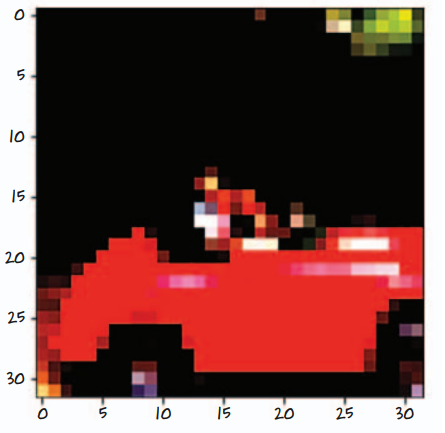
    <figcaption style="margin-top: 0.6em; text-align: center; font-size: 13px; color: #888;"><em>Figure 7.4: Naive heuristic attempt: thresholding pixels where the red channel dominates ($R > 1.4 \times B$).</em></figcaption>
  </div>
</figure>

If we threshold pixels where the red channel intensity significantly exceeds the blue channel, we might successfully isolate the body of a red convertible car. However, this naive approach collapses immediately when encountering blue cars, white cars, or red birds. Hand-crafted, localized pixel rules lack the **invariance** and **semantic hierarchy** required for robust visual understanding.

### 3.3 Statistical Normalization Across Channels

In unnormalized images, pixel values reside in $[0.0, 1.0]$. Training neural networks directly on uncentered inputs can destabilize gradient descent:
* All inputs to the first hidden layer remain strictly non-negative, forcing initial weight updates to be systematically correlated in sign.
* Differing channel color distributions can bias activations unevenly.

To guarantee zero-centered inputs with unit variance across the entire training corpus, we apply **Z-score channel normalization**:
$$ x\_{\text{norm}, c} = \frac{x\_c - \mu\_c}{\sigma\_c} $$
where $\mu\_c$ and $\sigma\_c$ represent the mean and standard deviation of channel $c \in \{0, 1, 2\}$ computed across the entire training dataset ($N = 50{,}000$ images).

Let us compute the exact population statistics over all $50{,}000$ training images:

```python
import torch

# Load training dataset with ToTensor
tensor_cifar10 = datasets.CIFAR10(
    root=str(data_path),
    train=True,
    download=False,
    transform=transforms.ToTensor()
)

# Stack all 50,000 images into a single tensor: shape (50000, 3, 32, 32)
# We rearrange to (3, 50000 * 32 * 32) to compute mean and std across all spatial pixels
imgs = torch.stack([img_t for img_t, _ in tensor_cifar10], dim=3)
print(f"Aggregated tensor shape: {imgs.shape}")  # (3, 32, 32, 50000)

# Compute mean and standard deviation along spatial and image dimensions (dims 1, 2, 3)
mean = imgs.view(3, -1).mean(dim=1)
std = imgs.view(3, -1).std(dim=1)

print(f"Per-channel Mean: {mean}")
print(f"Per-channel Std:  {std}")
```

The resulting standard empirical values for CIFAR-10 are:
$$ \mu = [0.4914, 0.4822, 0.4465], \quad \sigma = [0.2470, 0.2435, 0.2616] $$

We compose `transforms.ToTensor()` and `transforms.Normalize()` into a seamless preprocessing pipeline:

```python
transformed_cifar10 = datasets.CIFAR10(
    root=str(data_path),
    train=True,
    download=False,
    transform=transforms.Compose([
        transforms.ToTensor(),
        transforms.Normalize(
            mean=(0.4914, 0.4822, 0.4465),
            std=(0.2470, 0.2435, 0.2616)
        )
    ])
)

transformed_cifar10_val = datasets.CIFAR10(
    root=str(data_path),
    train=False,
    download=False,
    transform=transforms.Compose([
        transforms.ToTensor(),
        transforms.Normalize(
            mean=(0.4914, 0.4822, 0.4465),
            std=(0.2470, 0.2435, 0.2616)
        )
    ])
)
```

---

## 4. Problem Formulation: Birds vs. Airplanes

To develop clear intuition without getting overwhelmed by 10-way classification complexities, we follow the pedagogical strategy of Chapter 7 and reduce the problem to a **binary classification** task: distinguishing **birds** from **airplanes**.

<figure style="display:flex; justify-content: center; margin: 25px 0;">
  <div style="text-align: center;">
    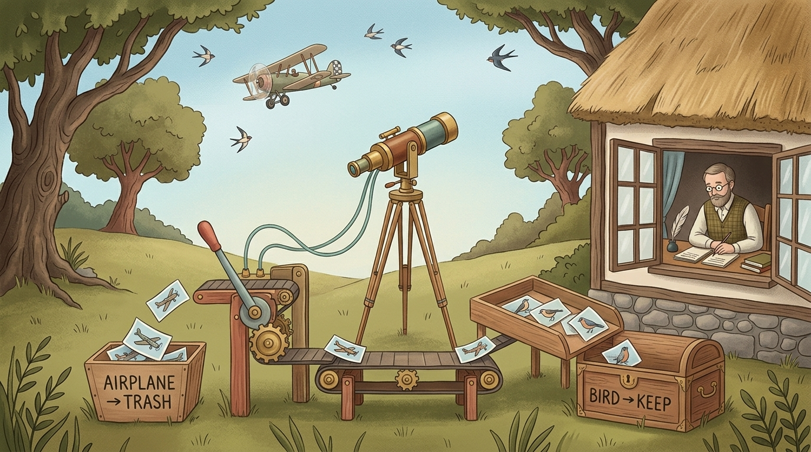
    <figcaption style="margin-top: 0.6em; text-align: center; font-size: 13px; color: #888;"><em>Figure 7.5: The binary classification scenario: an automated camera observing skyward, filtering out airplanes to trash and retaining birds.</em></figcaption>
  </div>
</figure>

### 4.1 Subsetting and Target Relabeling

In CIFAR-10:
* `airplane` corresponds to class index `0`
* `bird` corresponds to class index `2`

To train a binary classifier, we must extract only the images belonging to these two classes and relabel them:
* `airplane` ($0$) $\longrightarrow 0$
* `bird` ($2$) $\longrightarrow 1$

```python
# Label mapping: keep airplane (0) and bird (2)
label_map = {0: 0, 2: 1}
class_names = ['airplane', 'bird']

# Filter training split
cifar2 = [
    (img, label_map[label])
    for img, label in transformed_cifar10
    if label in [0, 2]
]

# Filter validation split
cifar2_val = [
    (img, label_map[label])
    for img, label in transformed_cifar10_val
    if label in [0, 2]
]

print(f"Filtered Training Samples (cifar2): {len(cifar2)}")           # 10,000 (5000 planes, 5000 birds)
print(f"Filtered Validation Samples (cifar2_val): {len(cifar2_val)}") # 2,000 (1000 planes, 1000 birds)
```

We now possess 10,000 balanced training images and 2,000 balanced validation images.

---

## 5. Building a Baseline Fully Connected Classifier

How can a standard feedforward neural network (`nn.Linear`) process a 2D color image? A linear layer accepts a 1D vector $\mathbf{x} \in \mathbb{R}^{d_{\text{in}}}$. Therefore, we must unroll or **flatten** the 3D tensor $(C, H, W)$ into a 1D feature array of length $3 \times 32 \times 32 = 3{,}072$.

<figure style="display:flex; justify-content: center; margin: 25px 0;">
  <div style="text-align: center;">
    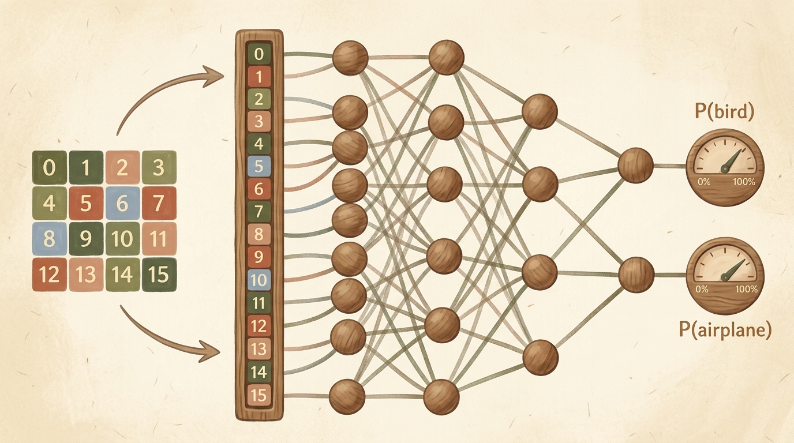
    <figcaption style="margin-top: 0.6em; text-align: center; font-size: 13px; color: #888;"><em>Figure 7.6: Flattening a 2D image grid into a 1D vector and feeding it through dense affine transformations to produce class probabilities.</em></figcaption>
  </div>
</figure>

### 5.1 Architecture and Parameter Explosion

Let us construct a two-layer multi-layer perceptron (MLP) with 512 hidden units using `nn.Sequential`:

```python
import torch.nn as nn

n_out = 2  # Binary classification: airplane vs bird

model = nn.Sequential(
    nn.Linear(3072, 512),
    nn.Tanh(),
    nn.Linear(512, n_out)
)
```

Let us calculate the total number of trainable parameters in this modest model:
1. **Layer 1 (`nn.Linear(3072, 512)`):**
   * Weight matrix: $512 \times 3{,}072 = 1{,}572{,}864$
   * Bias vector: $512$
   * Total Layer 1: $1{,}573{,}376$ parameters
2. **Layer 2 (`nn.Linear(512, 2)`):**
   * Weight matrix: $2 \times 512 = 1{,}024$
   * Bias vector: $2$
   * Total Layer 2: $1{,}026$ parameters
3. **Total Model Parameters:**
   $$ 1{,}573{,}376 + 1{,}026 = 1{,}574{,}402 \text{ parameters} $$

```python
num_params = sum(p.numel() for p in model.parameters() if p.requires_grad)
print(f"Total Trainable Parameters: {num_params:,}")
```

> [!WARNING]
> Over **1.57 million parameters** are dedicated to classifying tiny $32 \times 32$ images with just 512 hidden units! If our input were a modest smartphone photo ($1080 \times 1920 \times 3 \approx 6.22 \times 10^6$ pixels), a single linear layer with 512 units would require over **3.18 billion parameters**—exceeding the memory capacity of typical training environments before processing a single sample.

---

## 6. Output Representation, Softmax, and Classification Losses

In Chapter 6, our regression output was an unconstrained continuous scalar $\hat{y} \in \mathbb{R}$ evaluated via Mean Squared Error ($(\hat{y} - y)^2$). For classification, however, we seek **probabilities**: non-negative values that sum to $1$.

### 6.1 The Softmax Activation Function

Given raw network outputs $\mathbf{z} = [z_0, z_1, \dots, z_{K-1}]$ (often called **logits**), the **Softmax** function exponentiates each logit and normalizes by the sum of exponentials:
$$ \sigma(\mathbf{z})\_i = \frac{e^{z\_i}}{\sum\_{j=0}^{K-1} e^{z\_j}} $$

<figure style="display:flex; justify-content: center; margin: 25px 0;">
  <div style="text-align: center;">
    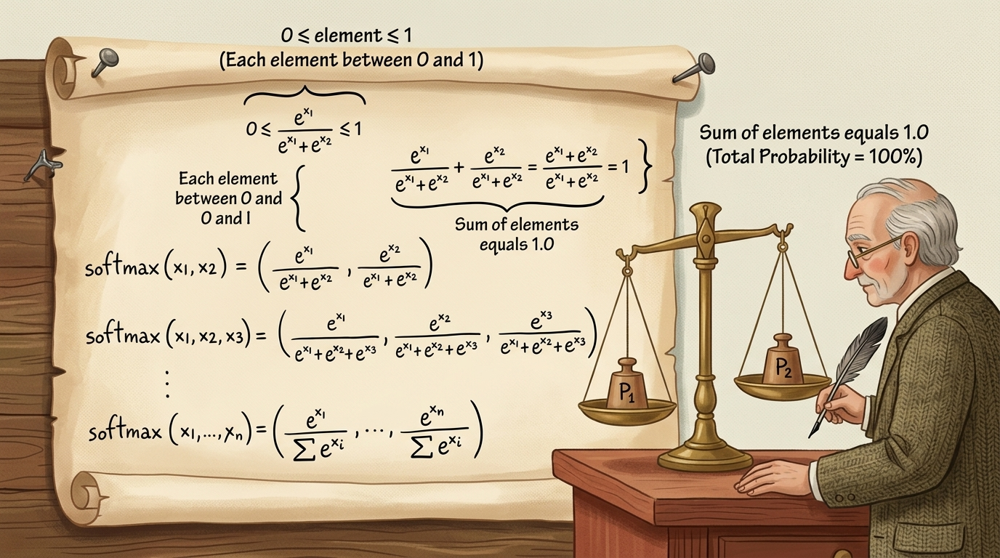
    <figcaption style="margin-top: 0.6em; text-align: center; font-size: 13px; color: #888;"><em>Figure 7.7: The Softmax function: mapping raw unbounded logits into a mathematically rigorous probability distribution bounded in $[0, 1]$ and summing to 1.</em></figcaption>
  </div>
</figure>

The Softmax transformation satisfies two indispensable mathematical invariants:
1. **Strict Non-Negativity and Boundedness:** Because $e^{z_i} > 0$ for all real $z_i$, $0 \le \sigma(\mathbf{z})\_i \le 1$.
2. **Probability Conservation (Unit Sum):**
   $$ \sum\_{i=0}^{K-1} \sigma(\mathbf{z})\_i = \sum\_{i=0}^{K-1} \frac{e^{z\_i}}{\sum\_{j=0}^{K-1} e^{z\_j}} = \frac{\sum\_{i=0}^{K-1} e^{z\_i}}{\sum\_{j=0}^{K-1} e^{z\_j}} = 1.0 $$

```python
x = torch.tensor([1.0, 2.0, 3.0])
softmax = nn.Softmax(dim=0)
probs = softmax(x)

print(f"Logits:       {x.tolist()}")
print(f"Probabilities:{probs.tolist()}")
print(f"Sum of Probs: {probs.sum().item():.6f}")
```

### 6.2 Why MSE is Inferior for Classification

Why can we not simply treat target labels as one-hot vectors ($[1, 0]$ for plane, $[0, 1]$ for bird) and train with Mean Squared Error (MSE)?

```python
# MSE on classification probabilities:
# L_MSE = (1/K) * \sum (p_i - y_i)^2
```

When probabilities approach saturation (e.g., $p \to 0$ when the target is $1$), the derivative of the squared error with respect to the pre-activation logit shrinks towards zero:
$$ \frac{\partial \mathcal{L}\_{\text{MSE}}}{\partial z} \propto p(1 - p)(p - y) $$
When $p \approx 0$ or $p \approx 1$, the gradient $p(1 - p)$ vanishes, stranding the model on a flat error plateau even when the prediction is catastrophically incorrect.

<figure style="display:flex; justify-content: center; margin: 25px 0;">
  <div style="text-align: center;">
    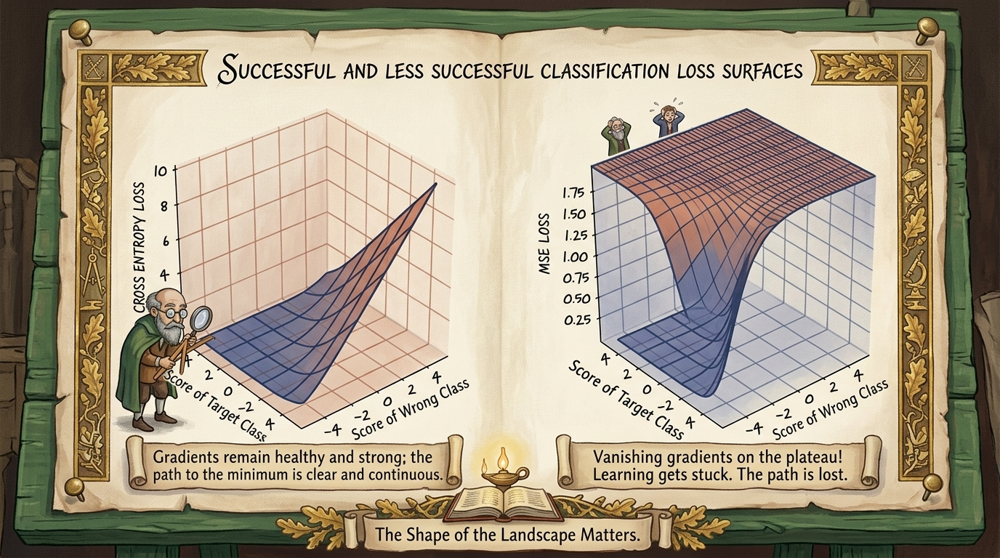
    <figcaption style="margin-top: 0.6em; text-align: center; font-size: 13px; color: #888;"><em>Figure 7.8: 3D loss surface comparison: Cross-Entropy Loss maintains steep, healthy gradients when predictions are wrong, whereas MSE creates flat, saturating plateaus.</em></figcaption>
  </div>
</figure>

### 6.3 Negative Log Likelihood (NLL) Loss and Cross-Entropy

Under maximum likelihood estimation (MLE), we want to maximize the model's assigned probability to the true class label $y$:
$$ \mathcal{P}(\text{data} \mid \theta) = \prod\_{i=1}^N p\_{i, y\_i} $$
Taking the negative logarithm converts this product into a sum of non-negative penalty terms:
$$ \mathcal{L}\_{\text{NLL}} = - \log(p\_{\text{target}}) $$

<figure style="display:flex; justify-content: center; margin: 25px 0;">
  <div style="text-align: center;">
    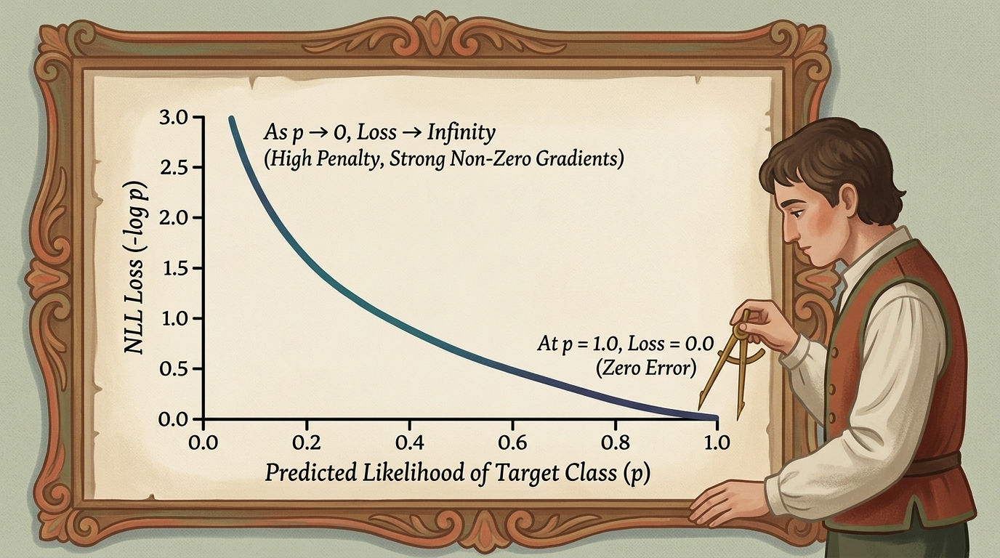
    <figcaption style="margin-top: 0.6em; text-align: center; font-size: 13px; color: #888;"><em>Figure 7.9: Negative Log Likelihood Loss as a function of predicted target probability $p$. As $p \to 1$, loss approaches 0; as $p \to 0$, loss penalizes toward infinity.</em></figcaption>
  </div>
</figure>

Notice the behavior of $-\log(p)$:
* If the network predicts $p\_{\text{target}} = 0.99$, $\mathcal{L}\_{\text{NLL}} = -\log(0.99) \approx 0.01$ (negligible penalty).
* If the network predicts $p\_{\text{target}} = 0.50$, $\mathcal{L}\_{\text{NLL}} = -\log(0.50) \approx 0.693$.
* If the network predicts $p\_{\text{target}} = 0.01$, $\mathcal{L}\_{\text{NLL}} = -\log(0.01) \approx 4.605$.
* As $p\_{\text{target}} \to 0$, $\mathcal{L}\_{\text{NLL}} \to +\infty$. The gradient never vanishes!

In PyTorch, combining `nn.LogSoftmax` with `nn.NLLLoss` implements this exact criterion:

```python
model = nn.Sequential(
    nn.Linear(3072, 512),
    nn.Tanh(),
    nn.Linear(512, 2),
    nn.LogSoftmax(dim=1)
)

loss_fn = nn.NLLLoss()
```

> [!TIP]
> **Numerical Stability with `nn.CrossEntropyLoss`:**  
> In production, avoid manually chaining `nn.LogSoftmax()` and `nn.NLLLoss()`. Instead, leave the final layer unactivated (outputting raw logits $\mathbf{z}$) and use **`nn.CrossEntropyLoss()`**. Under the hood, PyTorch combines the log-softmax and negative log likelihood operations using the **LogSumExp trick** ($\log \sum e^{z_i} = c + \log \sum e^{z_i - c}$), which prevents catastrophic floating-point underflow or overflow when logits take large positive or negative values.

---

## 7. Optimization Dynamics: Mini-Batches and DataLoaders

How should we iterate through our 10,000 training images to compute gradients and update our 1.57 million weights?

### 7.1 Full-Batch vs. Stochastic vs. Mini-Batch Gradient Descent

<figure style="display:flex; justify-content: center; margin: 25px 0;">
  <div style="text-align: center;">
    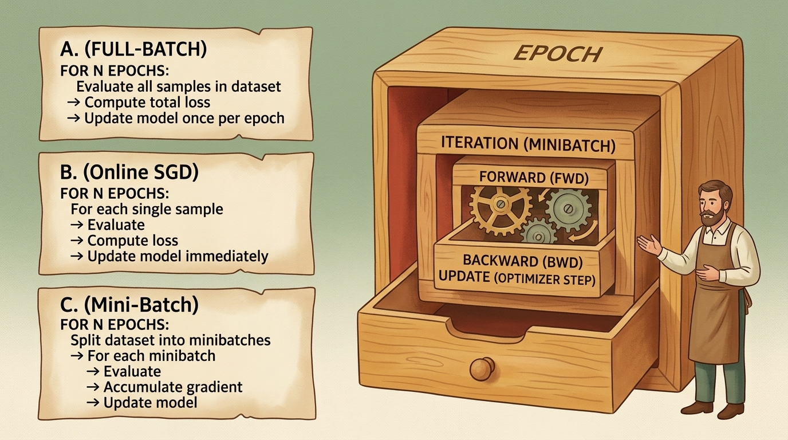
    <figcaption style="margin-top: 0.6em; text-align: center; font-size: 13px; color: #888;"><em>Figure 7.10: Three training regimes: Full-Batch (A), Online Stochastic (B), and Mini-Batch (C) alongside the nested execution clockwork of an Epoch.</em></figcaption>
  </div>
</figure>

1. **Full-Batch Gradient Descent:** Computes the loss and gradient across the entire dataset ($N = 10{,}000$) before taking a single optimizer step.
   * *Advantage:* Exact, stable gradient vector.
   * *Disadvantage:* Extremely slow per update; cannot fit massive datasets into GPU VRAM; easily traps in local shallow minima.
2. **Online Stochastic Gradient Descent (Pure SGD):** Updates parameters after every single sample ($B = 1$).
   * *Advantage:* Frequent parameter updates; highly stochastic exploration of parameter space.
   * *Disadvantage:* Terrible hardware utilization (cannot exploit vectorized SIMD/tensor cores); gradient direction fluctuates wildly.
3. **Mini-Batch Gradient Descent:** The universal compromise. Samples a small, randomized subset of size $B$ (e.g., $B = 64$ or $128$):
   $$ \mathbf{g} = \frac{1}{B} \sum\_{i=1}^B \nabla\_\theta \mathcal{L}(f(\mathbf{x}\_i; \theta), y\_i) $$

<figure style="display:flex; justify-content: center; margin: 25px 0;">
  <div style="text-align: center;">
    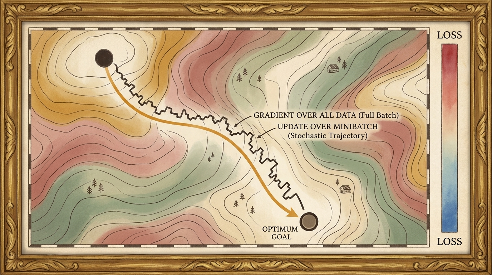
    <figcaption style="margin-top: 0.6em; text-align: center; font-size: 13px; color: #888;"><em>Figure 7.11: Loss landscape descent trajectories: smooth, deterministic path of full-batch gradient descent versus the noisy, fluctuating yet rapidly converging trajectory of mini-batch SGD.</em></figcaption>
  </div>
</figure>

### 7.2 The PyTorch `DataLoader`

The PyTorch **`torch.utils.data.DataLoader`** orchestrates batching, multiprocessing, memory pinning, and dataset shuffling:

<figure style="display:flex; justify-content: center; margin: 25px 0;">
  <div style="text-align: center;">
    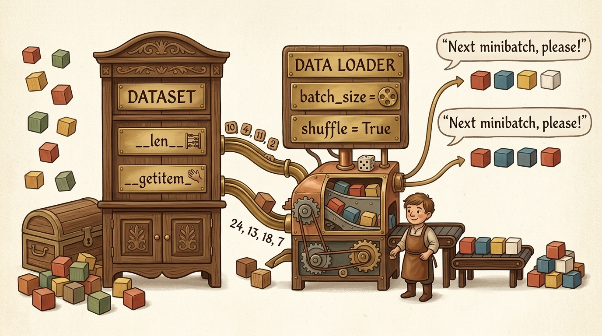
    <figcaption style="margin-top: 0.6em; text-align: center; font-size: 13px; color: #888;"><em>Figure 7.12: DataLoader in action: sampling randomized index sets, fetching individual items from Dataset, collating them into batches, and feeding minibatches seamlessly to the model.</em></figcaption>
  </div>
</figure>

```python
from torch.utils.data import DataLoader

train_loader = DataLoader(
    cifar2,
    batch_size=64,
    shuffle=True,
    num_workers=0
)

val_loader = DataLoader(
    cifar2_val,
    batch_size=64,
    shuffle=False,
    num_workers=0
)

# Inspect a single batch
imgs, labels = next(iter(train_loader))
print(f"Batch image tensor shape: {imgs.shape}")      # (64, 3, 32, 32)
print(f"Batch target tensor shape: {labels.shape}")    # (64,)
```

---

## 8. Complete Training Loop Implementation

Let us construct a clean, modular training pipeline for our fully connected classifier using mini-batch SGD:

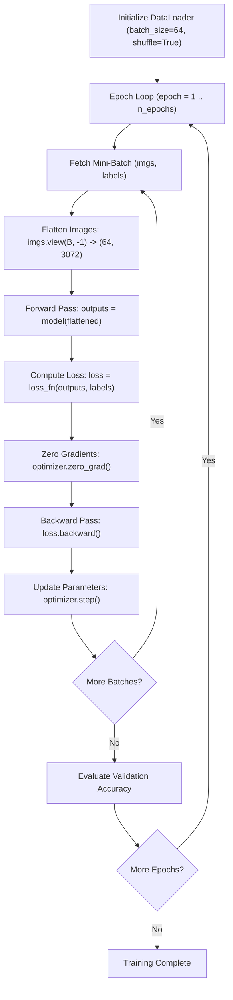

### 8.1 Training Function Definition

```python
import torch
import torch.nn as nn
import torch.optim as optim

def train_classifier(model, train_loader, val_loader, n_epochs=50, lr=1e-2, device='cpu'):
    model = model.to(device)
    loss_fn = nn.NLLLoss()
    optimizer = optim.SGD(model.parameters(), lr=lr)

    for epoch in range(1, n_epochs + 1):
        model.train()
        total_train_loss = 0.0
        
        for imgs, labels in train_loader:
            imgs, labels = imgs.to(device), labels.to(device)
            batch_size = imgs.shape[0]
            
            # Action 1: Flatten 4D tensor (B, C, H, W) to 2D matrix (B, C*H*W)
            flattened = imgs.view(batch_size, -1)
            
            # Action 2: Forward pass
            outputs = model(flattened)
            loss = loss_fn(outputs, labels)
            
            # Action 3: Backward pass & parameter update
            optimizer.zero_grad()
            loss.backward()
            optimizer.step()
            
            total_train_loss += loss.item()
            
        avg_train_loss = total_train_loss / len(train_loader)
        
        # Action 4: Validation evaluation every 10 epochs
        if epoch == 1 or epoch % 10 == 0:
            val_acc = evaluate_accuracy(model, val_loader, device=device)
            print(f"Epoch {epoch:2d}/{n_epochs:2d} | Train Loss: {avg_train_loss:.4f} | Val Accuracy: {val_acc:.2%}")

def evaluate_accuracy(model, loader, device='cpu'):
    model.eval()
    correct = 0
    total = 0
    
    with torch.no_grad():
        for imgs, labels in loader:
            imgs, labels = imgs.to(device), labels.to(device)
            batch_size = imgs.shape[0]
            flattened = imgs.view(batch_size, -1)
            
            outputs = model(flattened)
            # Take argmax across output dimension 1
            _, predicted = torch.max(outputs, dim=1)
            
            total += labels.shape[0]
            correct += int((predicted == labels).sum())
            
    return correct / total
```

### 8.2 Execution and Results

Instantiating our network with `LogSoftmax` and running 50 epochs yields:

```python
model = nn.Sequential(
    nn.Linear(3072, 512),
    nn.Tanh(),
    nn.Linear(512, 2),
    nn.LogSoftmax(dim=1)
)

train_classifier(model, train_loader, val_loader, n_epochs=50, lr=1e-2)
```

**Training Progression:**
```text
Epoch  1/50 | Train Loss: 0.5524 | Val Accuracy: 74.25%
Epoch 10/50 | Train Loss: 0.3541 | Val Accuracy: 79.80%
Epoch 20/50 | Train Loss: 0.2834 | Val Accuracy: 80.95%
Epoch 30/50 | Train Loss: 0.2215 | Val Accuracy: 81.30%
Epoch 40/50 | Train Loss: 0.1652 | Val Accuracy: 80.85%
Epoch 50/50 | Train Loss: 0.1189 | Val Accuracy: 80.40%
```

Our fully connected model attains approximately **$80.5\%$ to $81.5\%$ validation accuracy**. While superior to a random guess ($50\%$), notice that by epoch 50 the training loss dropped drastically to $0.1189$ while validation accuracy stalled around $80\%$. The model is beginning to overfit—memorizing pixel combinations rather than learning invariant visual features!

---

## 9. Structural Limitations of Fully Connected Networks for Images

Why can a multi-layer perceptron not scale effortlessly to complex visual recognition? We confront three fundamental mathematical and physical limitations:

### 9.1 Global Pixel Matrix Multiplication

In an `nn.Linear` layer, every output node is a linear combination of **every single input pixel**:

<figure style="display:flex; justify-content: center; margin: 25px 0;">
  <div style="text-align: center;">
    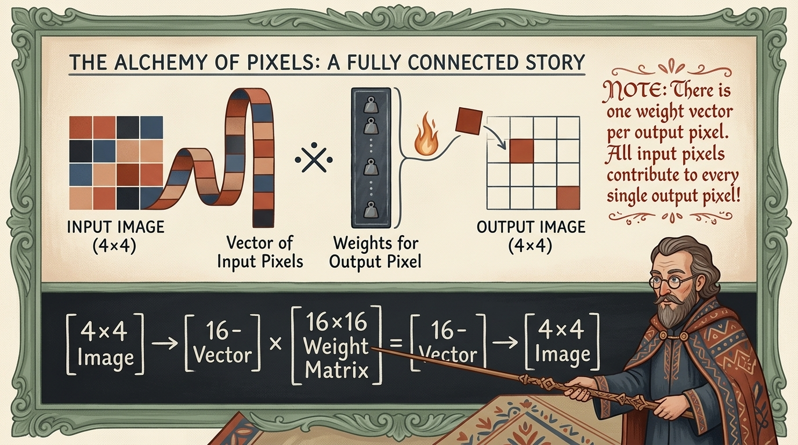
    <figcaption style="margin-top: 0.6em; text-align: center; font-size: 13px; color: #888;"><em>Figure 7.13: Fully connected weight matrix mechanics: every output pixel requires a dedicated full-length weight vector spanning all input pixels.</em></figcaption>
  </div>
</figure>

For a flattened $4 \times 4$ image (16 pixels) mapped to another 16 pixels, a $16 \times 16$ weight matrix is required. For a $1000 \times 1000$ image (1 million pixels) mapped to 1 million hidden units, the weight matrix would contain $10^{12}$ parameters (requiring 4 Terabytes of memory for a single layer!).

### 9.2 Destruction of Spatial 2D Topology

A photographic image is not an arbitrary bag of independent numbers. Its semantic meaning resides in **local spatial correlation**: a pixel at $(r, c)$ is intimately related to its direct neighbors $(r \pm 1, c \pm 1)$. Unrolling an image into a 1D vector (`img.view(-1)`) treats pixel $(0, 0)$ and pixel $(0, 1)$ with the exact same initial indifference as pixel $(0, 0)$ and pixel $(31, 31)$. The network must waste immense capacity simply re-learning which pixels are spatially adjacent.

### 9.3 The Failure of Translation Invariance

Consider an airplane silhouette centered in an image. The network learns a configuration of weights that activate strongly when pixels corresponding to the wings and fuselage light up:

<figure style="display:flex; justify-content: center; margin: 25px 0;">
  <div style="text-align: center;">
    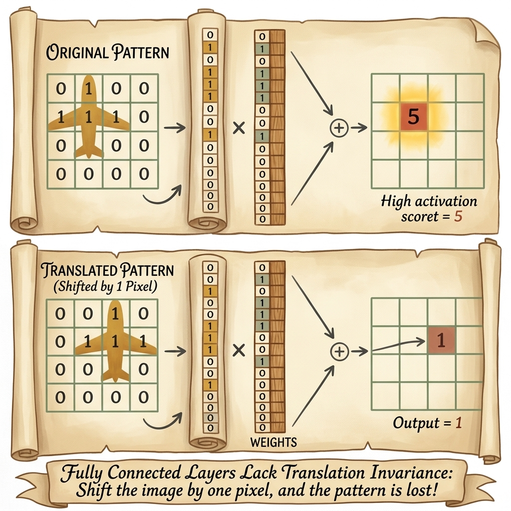
    <figcaption style="margin-top: 0.6em; text-align: center; font-size: 13px; color: #888;"><em>Figure 7.14: The fatal limitation: shifting the identical plane pattern by just 1 pixel to the right causes complete misalignment with static dense weights, causing activation to collapse from 5 down to 1.</em></figcaption>
  </div>
</figure>

Because each weight in `nn.Linear` is bound to a fixed coordinate index:
* If the airplane shifts right by **one single pixel**, its pixels multiply completely different weights!
* The network has zero intrinsic knowledge that a plane in the top-left corner is the same object as a plane in the bottom-right corner.
* To recognize shifted objects, a fully connected network would need to independently learn duplicate detector weights at every single possible $(x, y)$ coordinate across the image.

---

## 10. Summary & The Bridge to Convolutions

| Concept | Fully Connected Network (`nn.Linear`) | Convolutional Network (`nn.Conv2d` - Chapter 8) |
| :--- | :--- | :--- |
| **Connectivity** | Dense / Global (all inputs connect to all outputs) | Sparse / Local (nodes only see local $k \times k$ receptive fields) |
| **Parameter Sharing** | Zero (unique weights per spatial position) | Complete (identical kernel slides across entire image) |
| **Spatial Topology** | Destroyed by 1D flattening (`view(-1)`) | Preserved in native 2D/3D tensor grids |
| **Translation Invariance** | None (sensitive to spatial shifts) | Built-in via translation equivariance & pooling |
| **Scalability** | Parameters explode quadratically with resolution | Parameter count is independent of image resolution |

In this chapter, we successfully ingested real-world imagery, implemented standard dataset preprocessing with per-channel normalization, built a functional binary classifier for CIFAR-10, and analyzed the mechanics of Softmax and Cross-Entropy loss.

In **Chapter 8**, we will dismantle the limitations of dense layers by introducing the defining workhorse of visual deep learning: **Convolutional Neural Networks (CNNs)**!
