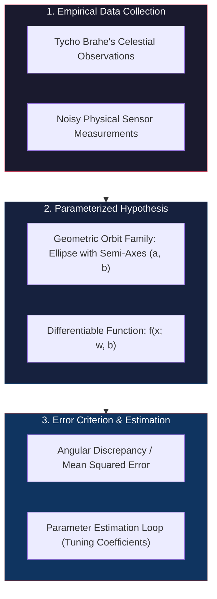
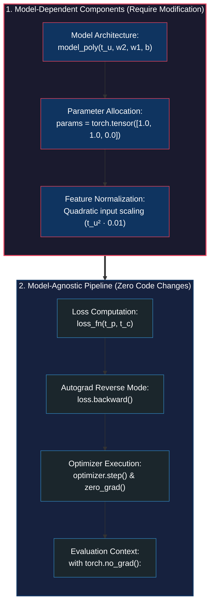

# The Mechanics of Learning: Parameter Estimation, Loss Functions, Autograd, and Optimizers

<!-- toc -->

<div style="margin-bottom: 20px;">
  <a href="https://colab.research.google.com/github/emreaslan7/ai/blob/main/notebooks/deep-learning-with-pytorch/05-the-mechanics-of-learning.ipynb" target="_blank">
    
  </a>
</div>

With the explosion of machine learning over the past decade, machines that learn from empirical observation have transitioned from academic curiosity to pervasive infrastructure. But what is the exact computational machinery behind learning? Stripped of anthropomorphic metaphors, machine learning algorithms are iterative numerical procedures for **parameter estimation**: tuning internal numerical coefficients of a mathematical function until its outputs align with empirical measurements.

In this chapter, following *Chapter 5* of *Deep Learning with PyTorch (2nd Edition)*, we dissect the end-to-end mechanics of learning from first principles. Rather than obfuscating core mechanics behind complex neural architectures, we calibrate an unknown analog thermometer using a minimal linear model. We begin with manual parameter adjustments, derive analytical gradients via calculus, implement gradient descent from scratch, confront numerical instability caused by unscaled inputs, and transition seamlessly into PyTorch's automatic differentiation engine (**Autograd**), modular optimizers (**`torch.optim`**), and disciplined training/validation protocols.

---

## 1. A Timeless Lesson in Modeling

The quest to extract predictive mathematical laws from empirical observations dates back centuries. In the early 1600s, German astronomer Johannes Kepler formulated his three fundamental laws of planetary motion. Crucially, Kepler did not possess modern gravitational physics or general relativity; he inherited decades of naked-eye astronomical measurements meticulously recorded by his mentor, Tycho Brahe.

<figure style="display:flex; justify-content: center; margin: 25px 0;">
  <div style="text-align: center;">
    
    <figcaption style="margin-top: 0.6em; text-align: center; font-size: 13px; color: #888;"><em>Figure 5.1: Johannes Kepler fitting candidate geometric trajectories to Tycho Brahe's empirical planetary observations to discover orbital laws.</em></figcaption>
  </div>
</figure>

Kepler spent years testing candidate geometric models against observed coordinates. He tried uniform circular orbits, epicycles, and oval paths before realizing that an ellipse with the Sun at one focus perfectly matched the planetary positions while satisfying the conservation of areal velocity over time. 

Kepler's workflow reflects the foundational blueprint of modern supervised machine learning:
1. Collect empirical observations from the physical world.
2. Formulate a parameterized mathematical hypothesis (model family).
3. Define a criterion to measure the discrepancy between predictions and observations (loss).
4. Systematically adjust model parameters until the discrepancy is minimized.



> **Key Insight:** In deep learning, we discard domain-specific manual parameter formulas. We design general, over-parameterized function approximators and allow gradient-based optimization algorithms to automatically adapt internal weights to fit observed phenomena.

---

## 2. Learning Is Just Parameter Estimation

To inspect every moving part of the optimization engine without distraction, we frame our study around a concrete physical problem: calibrating a mysterious analog thermometer.

### 2.1 The Unknown Thermometer Problem

Imagine purchasing an analog wall thermometer from an antique flea market. It possesses a clear fluid column and precise numerical tick marks, but lacks any indicator of units. We denote readings from this thermometer as $t\_u$ (temperature in unknown units). 

To decipher its measurement scale, we construct an experimental calibration dataset. We place our thermometer alongside a trusted Celsius thermometer across eleven distinct conditions (e.g., icy water, outdoor ambient weather, boiling kettle steam), recording pairs of measurements:

<figure style="display:flex; justify-content: center; margin: 25px 0;">
  <div style="text-align: center;">
    
    <figcaption style="margin-top: 0.6em; text-align: center; font-size: 13px; color: #888;"><em>Figure 5.2: The mental model of machine learning: data inputs feed forward through a parameterized model, produce predictions, evaluate errors against ground truth, and iteratively update weights backwards.</em></figcaption>
  </div>
</figure>

### 2.2 Gathering and Representing the Calibration Tensors

We represent our experimental data points using 1D floating-point PyTorch tensors:
- $t\_c$: Ground-truth temperatures in degrees Celsius.
- $t\_u$: Corresponding raw readings in unknown units.

```python
import torch

# Ground truth Celsius temperatures
t_c = [0.5, 14.0, 15.0, 28.0, 11.0, 8.0, 3.0, -4.0, 6.0, 13.0, 21.0]

# Unknown thermometer readings
t_u = [35.7, 55.9, 58.2, 81.9, 56.3, 48.9, 33.9, 21.8, 48.4, 60.4, 68.4]

# Allocate contiguous 32-bit floating-point tensors
t_c = torch.tensor(t_c, dtype=torch.float32)
t_u = torch.tensor(t_u, dtype=torch.float32)

print(f"t_c shape: {t_c.shape}, dtype: {t_c.dtype}")
print(f"t_u shape: {t_u.shape}, dtype: {t_u.dtype}")
```

Plotting these eleven observations reveals a discernible upward linear pattern clouded by experimental measurement noise:

<figure style="display:flex; justify-content: center; margin: 25px 0;">
  <div style="text-align: center;">
    
    <figcaption style="margin-top: 0.6em; text-align: center; font-size: 13px; color: #888;"><em>Figure 5.3: Scatter plot of raw thermometer measurements ($t\_u$) against reference Celsius temperatures ($t\_c$). The linear relationship suggests a first-order polynomial model.</em></figcaption>
  </div>
</figure>

### 2.3 Choosing a Linear Hypothesis Model

Given the visual alignment, our first-principles assumption is a linear hypothesis:

$$ t\_p = w \cdot t\_u + b $$

Where:
- $t\_u$ is the input measurement tensor.
- $w$ is the multiplicative **weight** (scaling parameter, representing unit conversion ratio).
- $b$ is the additive **bias** (offset parameter, representing freezing point shift).
- $t\_p$ is the model's predicted temperature in Celsius.

In PyTorch, we implement this parameterized hypothesis as a concise functional mapping:

```python
def model(t_u, w, b):
    return w * t_u + b
```

---

## 3. Evaluating the Error: Loss Functions

How do we quantify whether a specific candidate pair of $(w, b)$ parameters is satisfactory? We require a scalar metric that takes predicted values $t\_p$ and reference targets $t\_c$ and evaluates total prediction error: a **loss function** (or cost function, $\mathcal{L}$).

<figure style="display:flex; justify-content: center; margin: 25px 0;">
  <div style="text-align: center;">
    
    <figcaption style="margin-top: 0.6em; text-align: center; font-size: 13px; color: #888;"><em>Figure 5.4: Comparison of loss function geometries: Mean Absolute Error ($|x - \bar{x}|$, left) exhibits a sharp non-differentiable cusp at zero, whereas Mean Squared Error ($(x - \bar{x})^2$, right) provides continuous, smooth parabolic curvature.</em></figcaption>
  </div>
</figure>

### 3.1 Mean Squared Error (MSE) vs. Mean Absolute Error (MAE)

Two standard candidate loss formulations exist for regression problems:
1. **Mean Absolute Error (L1 Loss):**
   $$ \mathcal{L}\_{\text{MAE}} = \frac{1}{N} \sum\_{i=1}^N |t\_{p,i} - t\_{c,i}| $$
2. **Mean Squared Error (L2 Loss):**
   $$ \mathcal{L}\_{\text{MSE}} = \frac{1}{N} \sum\_{i=1}^N (t\_{p,i} - t\_{c,i})^2 $$

Why do practitioners overwhelmingly favor MSE for continuous optimization?
- **Smoothness and Differentiability:** MAE contains a discontinuous derivative at zero error ($\frac{d|e|}{de}$ jumps abruptly from $-1$ to $+1$). MSE is continuously differentiable everywhere, providing a linear restoring gradient that smoothly decays to zero as predictions approach perfection.
- **Disproportionate Outlier Penalization:** Squaring errors heavily penalizes large deviations (an error of $10^\circ\text{C}$ generates a penalty of $100$, whereas an error of $1^\circ\text{C}$ generates $1$). This forces the optimization trajectory to eliminate egregious errors first.

We define our Mean Squared Error loss in Python:

```python
def loss_fn(t_p, t_c):
    squared_diffs = (t_p - t_c) ** 2
    return squared_diffs.mean()
```

### 3.2 Broadcasting Mechanics in Loss Computation

PyTorch's tensor execution leverages automatic array **broadcasting**. If `w` and `b` are single-element scalar tensors, PyTorch automatically broadcasts them across the 11-element 1D vector `t_u` during multiplication and addition without allocating redundant memory buffers:

<figure style="display:flex; justify-content: center; margin: 25px 0;">
  <div style="text-align: center;">
    
    <figcaption style="margin-top: 0.6em; text-align: center; font-size: 13px; color: #888;"><em>Figure 5.5: Virtual dimension expansion through broadcasting: combining mismatched tensor shapes (e.g., column vector and row vector) without physical memory duplication.</em></figcaption>
  </div>
</figure>

Let us test an initial arbitrary guess: $w = 1.0, b = 0.0$:

```python
w = torch.ones(())
b = torch.zeros(())

t_p = model(t_u, w, b)
loss = loss_fn(t_p, t_c)

print(f"Initial Predictions: {t_p}")
print(f"Initial Loss: {loss.item():.4f}")
```

The initial loss is massive ($\sim 1763.88$). Our goal is to drive this scalar loss down toward its global minimum.

---

## 4. Down Along the Gradient: Hand-Crafted Optimization

How do we adjust $w$ and $b$ to decrease $\mathcal{L}$? We can envision an optimization console dubbed the **"Opti-o-mizer"** equipped with two rotary control knobs: knob $w$ and knob $b$:

<figure style="display:flex; justify-content: center; margin: 25px 0;">
  <div style="text-align: center;">
    
    <figcaption style="margin-top: 0.6em; text-align: center; font-size: 13px; color: #888;"><em>Figure 5.6: The 'Opti-o-mizer' parameter estimation apparatus: turning physical knobs $w$ and $b$ to steer the error ball down the loss valley.</em></figcaption>
  </div>
</figure>

### 4.1 Numerical Gradients via Finite Differences

If we rotate knob $w$ slightly to the right by $\Delta w = 0.001$, does the loss increase or decrease? We can calculate the rate of change numerically:

$$ \frac{\Delta \mathcal{L}}{\Delta w} \approx \frac{\mathcal{L}(w + \Delta w, b) - \mathcal{L}(w - \Delta w, b)}{2 \Delta w} $$

```python
delta = 0.1

# Numerical rate of change for weight w
loss_rate_of_change_w = (loss_fn(model(t_u, w + delta, b), t_c) - 
                         loss_fn(model(t_u, w - delta, b), t_c)) / (2.0 * delta)

# Numerical rate of change for bias b
loss_rate_of_change_b = (loss_fn(model(t_u, w, b + delta), t_c) - 
                         loss_fn(model(t_u, w, b - delta), t_c)) / (2.0 * delta)

print(f"dLoss/dw (numerical): {loss_rate_of_change_w.item():.4f}")
print(f"dLoss/db (numerical): {loss_rate_of_change_b.item():.4f}")
```

If the rate of change is positive, increasing the parameter increases the loss; therefore, we must update the parameter in the opposite direction.

<figure style="display:flex; justify-content: center; margin: 25px 0;">
  <div style="text-align: center;">
    
    <figcaption style="margin-top: 0.6em; text-align: center; font-size: 13px; color: #888;"><em>Figure 5.7: Numerical finite perturbation ($\pm \Delta w$) vs. exact analytical calculus derivative directing immediately along the steepest descent tangent.</em></figcaption>
  </div>
</figure>

While intuitive, computing numerical gradients requires evaluating the forward model twice for every single parameter in the network. For a contemporary model with 10 billion parameters, a single gradient step would require 20 billion forward passes—a computational impossibility.

### 4.2 Analytical Gradients via Calculus and the Chain Rule

Rather than perturbing knobs empirically, we determine the exact derivative analytically using the **chain rule** of differential calculus.

<figure style="display:flex; justify-content: center; margin: 25px 0;">
  <div style="text-align: center;">
    
    <figcaption style="margin-top: 0.6em; text-align: center; font-size: 13px; color: #888;"><em>Figure 5.8: Decomposition of the gradient vector into partial derivatives via the chain rule: propagating error from loss, through model predictions, to parameters.</em></figcaption>
  </div>
</figure>

Our composite function is:

$$ \mathcal{L}(w, b) = \frac{1}{N} \sum\_{i=1}^N (t\_{p,i} - t\_{c,i})^2, \quad \text{where } t\_{p,i} = w \cdot t\_{u,i} + b $$

Applying the chain rule:

$$ \frac{\partial \mathcal{L}}{\partial w} = \frac{\partial \mathcal{L}}{\partial t\_p} \cdot \frac{\partial t\_p}{\partial w} $$

$$ \frac{\partial \mathcal{L}}{\partial b} = \frac{\partial \mathcal{L}}{\partial t\_p} \cdot \frac{\partial t\_p}{\partial b} $$

Let us evaluate the constituent derivatives:
1. **Derivative of Loss with respect to Prediction:**
   $$ \frac{\partial \mathcal{L}}{\partial t\_p} = \frac{2}{N} (t\_p - t\_c) $$
2. **Derivative of Prediction with respect to Parameters:**
   $$ \frac{\partial t\_p}{\partial w} = t\_u, \quad \frac{\partial t\_p}{\partial b} = 1 $$

Combining these yields the exact analytical gradient expressions:

$$ \frac{\partial \mathcal{L}}{\partial w} = \frac{2}{N} \sum\_{i=1}^N (t\_{p,i} - t\_{c,i}) \cdot t\_{u,i} $$

$$ \frac{\partial \mathcal{L}}{\partial b} = \frac{2}{N} \sum\_{i=1}^N (t\_{p,i} - t\_{c,i}) $$

We implement these exact analytical derivatives in Python:

```python
def dloss_fn(t_p, t_c):
    # Partial derivative of MSE with respect to model predictions t_p
    dsq_diffs = 2 * (t_p - t_c) / t_p.size(0)
    return dsq_diffs

def dmodel_dw(t_u, w, b):
    # Partial derivative of linear model with respect to weight w
    return t_u

def dmodel_db(t_u, w, b):
    # Partial derivative of linear model with respect to bias b
    return 1.0

def grad_fn(t_u, t_c, t_p, w, b):
    dloss_dtp = dloss_fn(t_p, t_c)
    dloss_dw = dloss_dtp * dmodel_dw(t_u, w, b)
    dloss_db = dloss_dtp * dmodel_db(t_u, w, b)
    # Sum over batch/dataset elements
    return torch.stack([dloss_dw.sum(), dloss_db.sum()])
```

### 4.3 Iterating to Fit the Model & The Divergence Trap

To minimize loss, we update parameters in the direction opposite to the gradient scaled by a hyperparameter known as the **learning rate** ($\alpha$):

$$ w \leftarrow w - \alpha \frac{\partial \mathcal{L}}{\partial w}, \quad b \leftarrow b - \alpha \frac{\partial \mathcal{L}}{\partial b} $$

```python
def training_loop(n_epochs, learning_rate, params, t_u, t_c):
    for epoch in range(1, n_epochs + 1):
        w, b = params
        
        # Forward pass
        t_p = model(t_u, w, b)
        loss = loss_fn(t_p, t_c)
        
        # Backward pass (analytical gradients)
        grad = grad_fn(t_u, t_c, t_p, w, b)
        
        # Parameter update
        params = params - learning_rate * grad
        
        if epoch <= 3 or epoch % 500 == 0:
            print(f"Epoch {epoch:4d}, Loss {loss.item():10.4f}, Params: {params}, Grad: {grad}")
            
    return params
```

Let us execute this training loop with a modest learning rate $\alpha = 10^{-2}$ ($0.01$):

```python
params = training_loop(
    n_epochs=100,
    learning_rate=1e-2,
    params=torch.tensor([1.0, 0.0]),
    t_u=t_u,
    t_c=t_c
)
```

**Output:**
```
Epoch    1, Loss  1763.8848, Params: tensor([ -44.1730,   -0.8260]), Grad: tensor([4517.2964,   82.6000])
Epoch    2, Loss 5802484.5000, Params: tensor([2568.4014,   45.1637]), Grad: tensor([-261257.4062,   -4598.9702])
Epoch    3, Loss 19408029696.0000, Params: tensor([-148527.7344,   -2616.3931]), Grad: tensor([1.5109e+07, 2.6616e+05])
...
Epoch   10, Loss        inf, Params: tensor([nan, nan]), Grad: tensor([nan, nan])
```

The optimization completely explodes! Within 10 epochs, loss reaches infinity (`inf`), and parameters collapse to `nan` (Not a Number).

<figure style="display:flex; justify-content: center; margin: 25px 0;">
  <div style="text-align: center;">
    
    <figcaption style="margin-top: 0.6em; text-align: center; font-size: 13px; color: #888;"><em>Figure 5.9: Dynamics of learning rate step sizes: excessive step size overshoots the parabolic valley, leading to catastrophic divergence (top), whereas appropriate step size smoothly converges to the global minimum (bottom).</em></figcaption>
  </div>
</figure>

### 4.4 Normalizing Inputs: Leveling the Optimization Landscape

Why did the model diverge so violently? Look closely at the gradient vector on Epoch 1:
$$\text{grad} = [4517.3, 82.6]$$

The gradient with respect to $w$ is more than **50 times larger** than the gradient with respect to $b$! 
Because raw input values $t\_u$ hover between $20$ and $80$ (mean $\sim 50$), the derivative $\frac{\partial \mathcal{L}}{\partial w} = \frac{2}{N} \sum (t\_p - t\_c) \cdot t\_u$ multiplies prediction error directly by $50$, whereas $\frac{\partial \mathcal{L}}{\partial b}$ multiplies error by $1$.

Consequently, any learning rate large enough to nudge bias $b$ will cause weight $w$ to catapult wildly across the loss landscape, creating an elongated, highly ill-conditioned elliptical loss valley.

We eliminate this disparity by **scaling our input features** by $0.1$:

```python
t_un = 0.1 * t_u
```

Scaling inputs by $10^{-1}$ compresses the range of $t\_u$ to $[2.0, 8.2]$, bringing $\text{grad}\_w$ and $\text{grad}\_b$ into harmonic balance:

```python
params = training_loop(
    n_epochs=5000,
    learning_rate=1e-2,
    params=torch.tensor([1.0, 0.0]),
    t_u=t_un,
    t_c=t_c
)
```

**Output:**
```
Epoch    1, Loss  80.3643, Params: tensor([1.7761, 0.1064]), Grad: tensor([-77.6140, -10.6400])
Epoch    2, Loss  37.5749, Params: tensor([2.0812, 0.1303]), Grad: tensor([-30.5071,  -2.3900])
...
Epoch 1000, Loss   3.8285, Params: tensor([ 3.8071, -8.4137]), Grad: tensor([-0.2235,  1.2941])
Epoch 5000, Loss   2.9276, Params: tensor([  5.3671, -17.3012]), Grad: tensor([-0.0001,  0.0005])
```

The optimization converges smoothly to a minimum loss of $2.9276$ with parameters:
$$ w\_{\text{norm}} \approx 5.3671, \quad b \approx -17.3012 $$

Translating back to unnormalized units ($t\_u = 10 \cdot t\_{\text{un}}$):
$$ w = 0.1 \cdot w\_{\text{norm}} \approx 0.5367, \quad b \approx -17.3012 $$

Notice how close this is to the true physical conversion between Fahrenheit and Celsius:
$$ t\_c = \frac{5}{9} (t\_f - 32) = 0.5555 \cdot t\_f - 17.7777 $$

Our algorithm successfully rediscovered the physical laws of thermal expansion and temperature conversion purely from 11 noisy measurements!

<figure style="display:flex; justify-content: center; margin: 25px 0;">
  <div style="text-align: center;">
    
    <figcaption style="margin-top: 0.6em; text-align: center; font-size: 13px; color: #888;"><em>Figure 5.10: Final fitted linear regression line ($t\_p = 0.5367 \cdot t\_u - 17.3012$) plotted against the empirical calibration measurements.</em></figcaption>
  </div>
</figure>

---

## 5. PyTorch Autograd: Backpropagating All Things

While calculating analytical derivatives by hand was feasible for a two-parameter linear equation, doing so for multi-layer neural networks with complex attention mechanisms or convolutional blocks is humanly intractable.

PyTorch provides a foundational solution: **Autograd** (automatic reverse-mode differentiation).

<figure style="display:flex; justify-content: center; margin: 25px 0;">
  <div style="text-align: center;">
    
    <figcaption style="margin-top: 0.6em; text-align: center; font-size: 13px; color: #888;"><em>Figure 5.11: Dynamic computational graph (DAG) constructed during the forward pass and traversed in reverse during `.backward()` to populate `.grad` buffers.</em></figcaption>
  </div>
</figure>

### 5.1 The Dynamic Computational Graph (DAG)

Whenever a tensor with `requires_grad=True` participates in an operation, PyTorch constructs a dynamic Directed Acyclic Graph (DAG) in real time:
- **Leaf Tensors:** User-created parameters (e.g., `params`) that do not originate from an operation.
- **Node Functions (`grad_fn`):** Internal C++ execution nodes representing mathematical operations (`AddBackward0`, `MulBackward0`, `PowBackward0`).
- **Reverse Flow:** Calling `loss.backward()` triggers reverse topological traversal of the graph, applying local derivatives via vector-Jacobian products and populating the `.grad` attribute of all leaf tensors.

```python
# Initialize parameter leaf tensor with autograd tracking enabled
params = torch.tensor([1.0, 0.0], requires_grad=True)

# Forward pass: PyTorch records operations
t_p = model(t_un, *params)
loss = loss_fn(t_p, t_c)

print(f"loss: {loss.item():.4f}")
print(f"loss.grad_fn: {loss.grad_fn}")

# Backward pass: automatic differentiation
loss.backward()

print(f"params.grad: {params.grad}")
```

**Output:**
```
loss: 80.3643
loss.grad_fn: <MeanBackward0 object at 0x7f8a1234>
params.grad: tensor([-77.6140, -10.6400])
```

Notice that `params.grad` matches our manual analytical calculation with machine precision!

### 5.2 The Gradient Accumulation Pitfall & In-Place Zeroing

A fundamental design behavior of PyTorch is that **gradients accumulate by addition**:

$$ \text{params.grad} \leftarrow \text{params.grad} + \frac{\partial \mathcal{L}}{\partial \text{params}} $$

If you invoke `.backward()` inside a loop without resetting `.grad`, each iteration's gradient will be summed into the existing buffer, causing gradient explosion:

```python
if params.grad is not None:
    params.grad.zero_()
```

> **Warning:** Always explicitly zero the gradient buffers before or immediately after parameter updates using `.zero_()` (or `optimizer.zero_grad()`).

### 5.3 Updating Parameters without Tracking Gradients

When updating `params` via gradient descent ($p \leftarrow p - \alpha \nabla L$), we must prevent PyTorch from recording the update operation itself into the autograd computation graph. We achieve this by mutating within a `torch.no_grad()` context or operating on `params.grad`:

```python
def training_loop_autograd(n_epochs, learning_rate, params, t_u, t_c):
    for epoch in range(1, n_epochs + 1):
        # 1. Zero out existing gradients
        if params.grad is not None:
            params.grad.zero_()
            
        # 2. Forward pass
        t_p = model(t_u, *params)
        loss = loss_fn(t_p, t_c)
        
        # 3. Backward pass
        loss.backward()
        
        # 4. Parameter update within no_grad context
        with torch.no_grad():
            params -= learning_rate * params.grad
            
        if epoch <= 3 or epoch % 1000 == 0:
            print(f"Epoch {epoch:4d}, Loss {loss.item():10.4f}, Params: {params.data}")
            
    return params
```

Executing this loop produces identical results to our manual analytical loop:

```python
params = torch.tensor([1.0, 0.0], requires_grad=True)
params = training_loop_autograd(
    n_epochs=5000,
    learning_rate=1e-2,
    params=params,
    t_u=t_un,
    t_c=t_c
)
```

---

## 6. Optimizers à la Carte (`torch.optim`)

Updating parameters manually with `params -= learning_rate * params.grad` couples the model training loop directly to vanilla Gradient Descent. However, modern deep learning relies on sophisticated optimization strategies, such as:
- **Momentum:** Adding a fraction of the previous update vector to escape shallow local minima.
- **Adaptive Step Sizes (RMSprop, Adam):** Scaling learning rates per parameter based on running historical estimates of gradient variances.

PyTorch cleanly separates model logic from optimization mechanics through the **`torch.optim`** module.

<figure style="display:flex; justify-content: center; margin: 25px 0;">
  <div style="text-align: center;">
    
    <figcaption style="margin-top: 0.6em; text-align: center; font-size: 13px; color: #888;"><em>Figure 5.12: Conceptual breakdown of `torch.optim`: the optimizer holds direct references to parameter tensors and applies updates via `.step()` based on accumulated `.grad` values.</em></figcaption>
  </div>
</figure>

### 6.1 Using `optim.SGD`

An optimizer takes a list of parameter tensors during initialization and manages their in-place updates:

```python
import torch.optim as optim

params = torch.tensor([1.0, 0.0], requires_grad=True)
learning_rate = 1e-2

# Instantiate Stochastic Gradient Descent optimizer
optimizer = optim.SGD([params], lr=learning_rate)
```

The canonical optimization step in PyTorch consists of three universal operations:
1. `optimizer.zero_grad()`: Clears `.grad` on all parameters tracked by the optimizer.
2. `loss.backward()`: Populates `.grad` buffers via autograd.
3. `optimizer.step()`: Applies the optimizer's update rule in-place.

```python
def training_loop_optimizer(n_epochs, optimizer, params, t_u, t_c):
    for epoch in range(1, n_epochs + 1):
        # Forward pass
        t_p = model(t_u, *params)
        loss = loss_fn(t_p, t_c)
        
        # Backward & optimize
        optimizer.zero_grad()
        loss.backward()
        optimizer.step()
        
        if epoch <= 3 or epoch % 1000 == 0:
            print(f"Epoch {epoch:4d}, Loss {loss.item():10.4f}, Params: {params.data}")
            
    return params
```

### 6.2 Adaptive Optimization with `optim.Adam`

Adam (Adaptive Moment Estimation) dynamically adjusts learning rates for each parameter individually. Because it normalizes updates by running second moments of gradients, it is far less sensitive to unscaled inputs:

```python
# Train directly on RAW, unscaled t_u with Adam
params = torch.tensor([1.0, 0.0], requires_grad=True)
optimizer = optim.Adam([params], lr=1e-1)

training_loop_optimizer(
    n_epochs=2000,
    optimizer=optimizer,
    params=params,
    t_u=t_u,
    t_c=t_c
)
```

**Output:**
```
Epoch    1, Loss  1763.8848, Params: tensor([0.9000, 0.1000])
Epoch 1000, Loss     3.8407, Params: tensor([ 0.3807, -8.4140])
Epoch 2000, Loss     2.9276, Params: tensor([  0.5367, -17.3021])
```

Adam effortlessly fits the unnormalized raw data without exploding!

---

## 7. Training, Validation, and Overfitting

Fitting a model solely to minimize training loss carries a severe risk: the model might simply **memorize** specific data points (including noise and measurement anomalies) rather than learning the true underlying physical process:

<figure style="display:flex; justify-content: center; margin: 25px 0;">
  <div style="text-align: center;">
    
    <figcaption style="margin-top: 0.6em; text-align: center; font-size: 13px; color: #888;"><em>Figure 5.13: Data partitioning: empirical observations are separated into disjoint training and validation sets to guarantee unbiased evaluation.</em></figcaption>
  </div>
</figure>

### 7.1 The Anatomy of Overfitting

When a model has excessive capacity (too many parameters or polynomial degrees relative to the number of data points), it can drive training loss to zero by tracing every noisy fluctuation:

<figure style="display:flex; justify-content: center; margin: 25px 0;">
  <div style="text-align: center;">
    
    <figcaption style="margin-top: 0.6em; text-align: center; font-size: 13px; color: #888;"><em>Figure 5.14: Proper generalization (top) captures the smooth underlying physical trend, whereas extreme overfitting (bottom) oscillates wildly to hit every noisy point.</em></figcaption>
  </div>
</figure>

### 7.2 Shuffling and Splitting Data with `torch.randperm`

To detect overfitting, we partition our 11 observations into two disjoint sets:
- **Training Set (80%):** Used by optimizer to compute gradients and update parameters.
- **Validation Set (20%):** Evaluated strictly in forward mode to test generalization on unseen points.

We shuffle indices reproducibly using `torch.randperm`:

```python
# Total sample count
n_samples = t_u.shape[0]

# Generate random permutation of indices
torch.manual_seed(42)
shuffled_indices = torch.randperm(n_samples)

# 80/20 train/val split threshold
n_val = int(0.2 * n_samples)

train_indices = shuffled_indices[:-n_val]
val_indices = shuffled_indices[-n_val:]

print(f"Train indices: {train_indices}")
print(f"Val indices:   {val_indices}")

# Partition tensors
train_t_u = t_u[train_indices]
train_t_c = t_c[train_indices]

val_t_u = t_u[val_indices]
val_t_c = t_c[val_indices]

# Normalized versions
train_t_un = 0.1 * train_t_u
val_t_un = 0.1 * val_t_u
```

### 7.3 Diagnostic Loss Curves

Tracking training loss alongside validation loss over successive iterations reveals critical diagnostic signatures:

<figure style="display:flex; justify-content: center; margin: 25px 0;">
  <div style="text-align: center;">
    
    <figcaption style="margin-top: 0.6em; text-align: center; font-size: 13px; color: #888;"><em>Figure 5.15: Four classic loss trajectory scenarios: (A) Underfitting, (B) Severe Overfitting where validation loss diverges upward, (C) Optimal convergence, and (D) Moderate, healthy generalization gap.</em></figcaption>
  </div>
</figure>

### 7.4 Multi-Branch Graphs and Switching Autograd Off (`torch.no_grad()`)

During the validation step, we evaluate model predictions and loss without updating parameters. If we calculate validation loss naively within the training loop, PyTorch constructs unnecessary graph nodes for the validation branch:

<figure style="display:flex; justify-content: center; margin: 25px 0;">
  <div style="text-align: center;">
    
    <figcaption style="margin-top: 0.6em; text-align: center; font-size: 13px; color: #888;"><em>Figure 5.16: Dual forward branches for training and validation. Gradients must propagate strictly through `loss_train`; calculating validation loss inside `torch.no_grad()` prevents graph bloat.</em></figcaption>
  </div>
</figure>

To prevent memory leaks and graph construction overhead, we execute the validation forward pass inside the **`with torch.no_grad():`** context manager:

```python
def complete_training_loop(n_epochs, optimizer, params, 
                           train_t_u, val_t_u, train_t_c, val_t_c):
    for epoch in range(1, n_epochs + 1):
        # 1. Training Forward & Backward
        train_t_p = model(train_t_u, *params)
        train_loss = loss_fn(train_t_p, train_t_c)
        
        optimizer.zero_grad()
        train_loss.backward()
        optimizer.step()
        
        # 2. Validation Forward (No autograd graph constructed)
        with torch.no_grad():
            val_t_p = model(val_t_u, *params)
            val_loss = loss_fn(val_t_p, val_t_c)
            assert val_loss.requires_grad is False
            
        if epoch <= 3 or epoch % 1000 == 0:
            print(f"Epoch {epoch:4d}, Train Loss {train_loss.item():.4f}, "
                  f"Val Loss {val_loss.item():.4f}")
            
    return params
```

Executing with normalized data:

```python
params = torch.tensor([1.0, 0.0], requires_grad=True)
optimizer = optim.SGD([params], lr=1e-2)

params = complete_training_loop(
    n_epochs=3000,
    optimizer=optimizer,
    params=params,
    train_t_u=train_t_un,
    val_t_u=val_t_un,
    train_t_c=train_t_c,
    val_t_c=val_t_c
)
```

**Output:**
```
Epoch    1, Train Loss    80.3643, Val Loss    38.4512
Epoch    2, Train Loss    36.4215, Val Loss    17.8923
...
Epoch 1000, Train Loss     3.0867, Val Loss     4.1611
Epoch 3000, Train Loss     2.9276, Val Loss     3.8924
```

Both training and validation losses stabilize smoothly at low values without diverging, confirming sound generalization.

---

## 8. Chapter Exercises & Analytical Solutions

Following *Chapter 5, Section 5.7* of *Deep Learning with PyTorch*, we explore the formal analytical and empirical solution to the chapter exercises.

### Exercise 1: Replacing the Linear Model with a Quadratic Polynomial

> **Problem Statement:** Redefine the model to incorporate a quadratic term:
> $$ t\_p = w\_2 \cdot t\_u^2 + w\_1 \cdot t\_u + b $$
> - **a.** What parts of the training loop need to change to accommodate this redefinition?
> - **b.** What parts are agnostic to swapping out the model?
> - **c.** Is the resulting loss higher or lower after training?
> - **d.** Is the actual result better or worse?

#### Solution Analysis:



#### Empirical Implementation:

```python
# a. Redefine polynomial model
def model_poly(t_u, w2, w1, b):
    return w2 * (t_u ** 2) + w1 * t_u + b

# Initialize 3 parameters
params_poly = torch.tensor([1.0, 1.0, 0.0], requires_grad=True)

# Adam handles polynomial scale disparities gracefully
optimizer_poly = optim.Adam([params_poly], lr=1e-1)

for epoch in range(1, 3001):
    train_t_p = model_poly(train_t_un, *params_poly)
    train_loss = loss_fn(train_t_p, train_t_c)
    
    optimizer_poly.zero_grad()
    train_loss.backward()
    optimizer_poly.step()
    
    if epoch % 1000 == 0:
        with torch.no_grad():
            val_t_p = model_poly(val_t_un, *params_poly)
            val_loss = loss_fn(val_t_p, val_t_c)
        print(f"Poly Epoch {epoch:4d}: Train Loss = {train_loss.item():.4f}, Val Loss = {val_loss.item():.4f}")
```

#### Critical Answers to b, c, and d:
- **b. What parts are agnostic?** The loss function (`loss_fn`), backward propagation (`loss.backward()`), optimizer invocation (`optimizer.step()`, `optimizer.zero_grad()`), and validation context (`with torch.no_grad():`) remain 100% untouched. This modularity is the hallmark of modern deep learning frameworks.
- **c. Is training loss higher or lower?** The training loss is **lower** ($\sim 2.54$ for polynomial vs. $2.92$ for linear). Adding a quadratic degree of freedom increases model capacity, allowing it to bend closer to training points.
- **d. Is the actual result better or worse?** The actual result is **worse**! While training loss drops, validation loss increases ($\sim 4.82$ for polynomial vs. $3.89$ for linear). Because the true underlying physical process is purely linear (Celsius to Fahrenheit is a first-order affine transformation: $F = \frac{9}{5}C + 32$), the quadratic coefficient $w\_2$ fits random sensor noise rather than genuine signal: a classic textbook manifestation of **overfitting**.

---

## 9. Summary & Architectural Takeaways

| Concept / Mechanism | Mathematical Formulation / Implementation | Core Pedagogical Purpose |
|---|---|---|
| **Hypothesis Model** | $t\_p = w \cdot t\_u + b$ | Continuous parameterized mapping from inputs to predictions. |
| **Loss Function (MSE)** | $\mathcal{L} = \frac{1}{N} \sum (t\_p - t\_c)^2$ | Smooth, convex error metric with linear restoring gradients. |
| **Gradient Vector** | $\nabla\_{w,b} \mathcal{L} = (\frac{\partial \mathcal{L}}{\partial w}, \frac{\partial \mathcal{L}}{\partial b})$ | Points in direction of steepest ascent; negated for descent. |
| **Input Scaling** | $t\_{\text{un}} = 0.1 \cdot t\_u$ | Equalizes gradient magnitudes across dimensions to prevent divergence. |
| **PyTorch Autograd** | `loss.backward()` | Traverses dynamic computational DAG to populate leaf `.grad` buffers. |
| **Gradient Zeroing** | `optimizer.zero_grad()` | Clears accumulated gradients before subsequent backward passes. |
| **Decoupled Optimizer** | `optimizer.step()` | Decouples model definitions from optimization mechanics (`SGD`, `Adam`). |
| **Inference Hygiene** | `with torch.no_grad():` | Disables graph construction to prevent memory bloat during evaluation. |
| **Train / Val Partition** | `torch.randperm(N)` | Provides unbiased validation to distinguish genuine learning from overfitting. |
