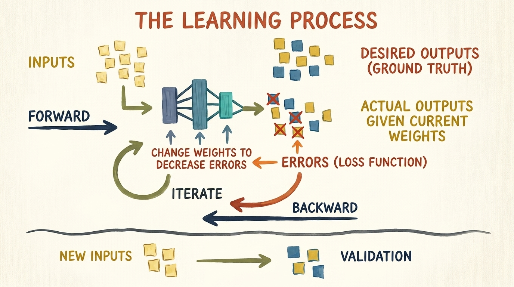
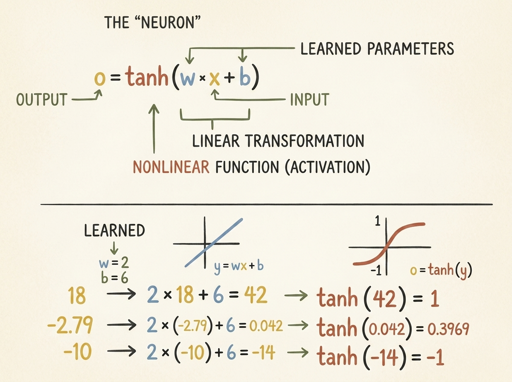
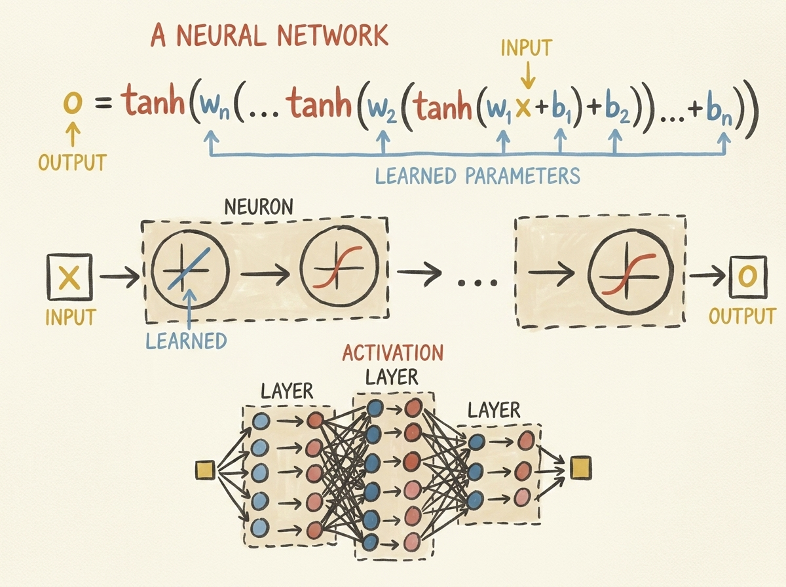
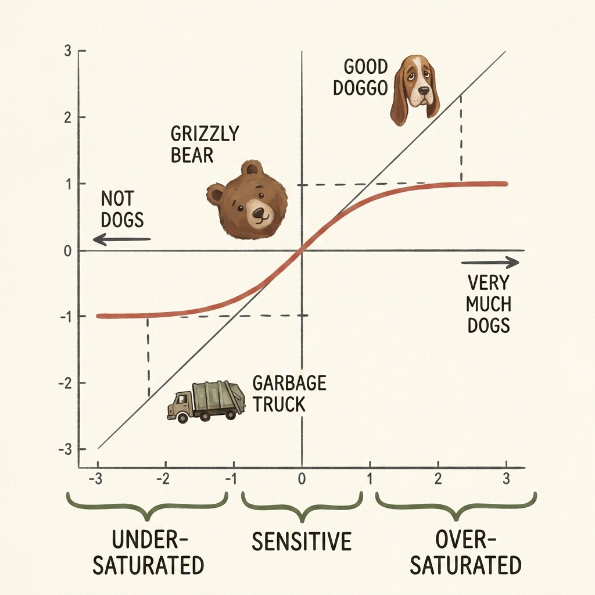
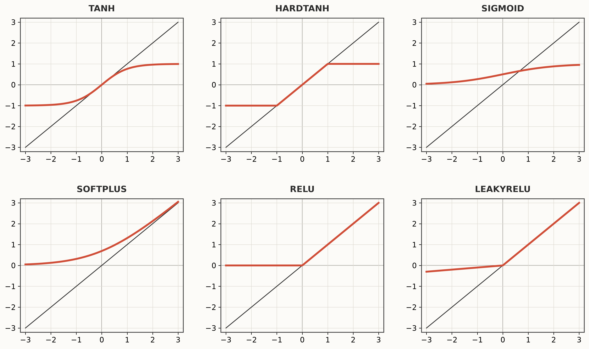
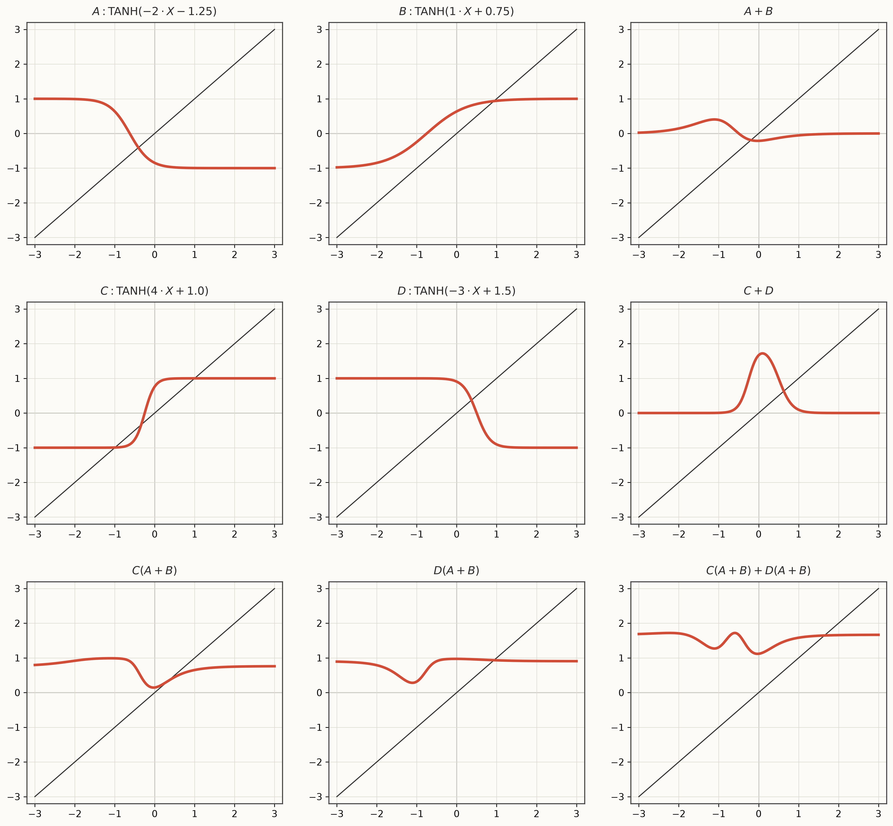
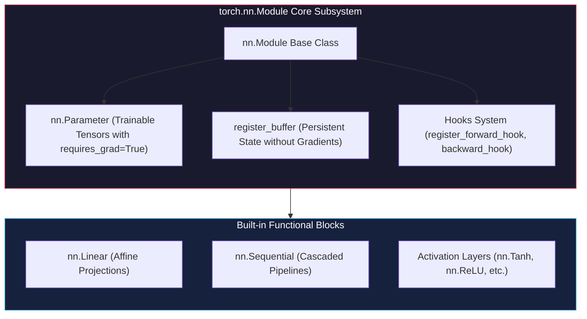
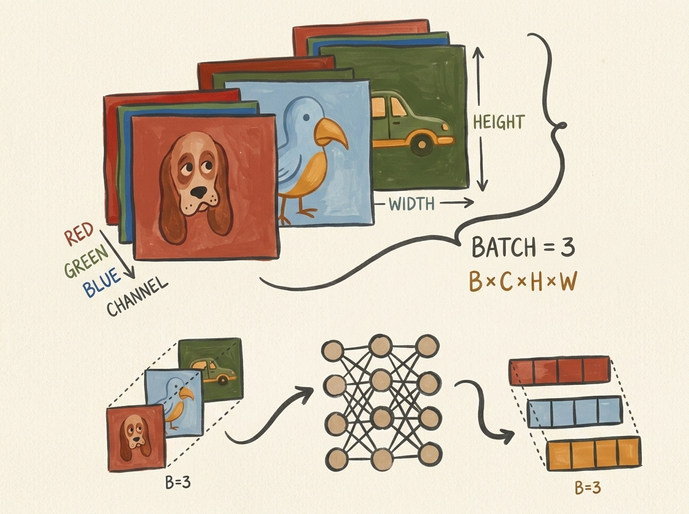
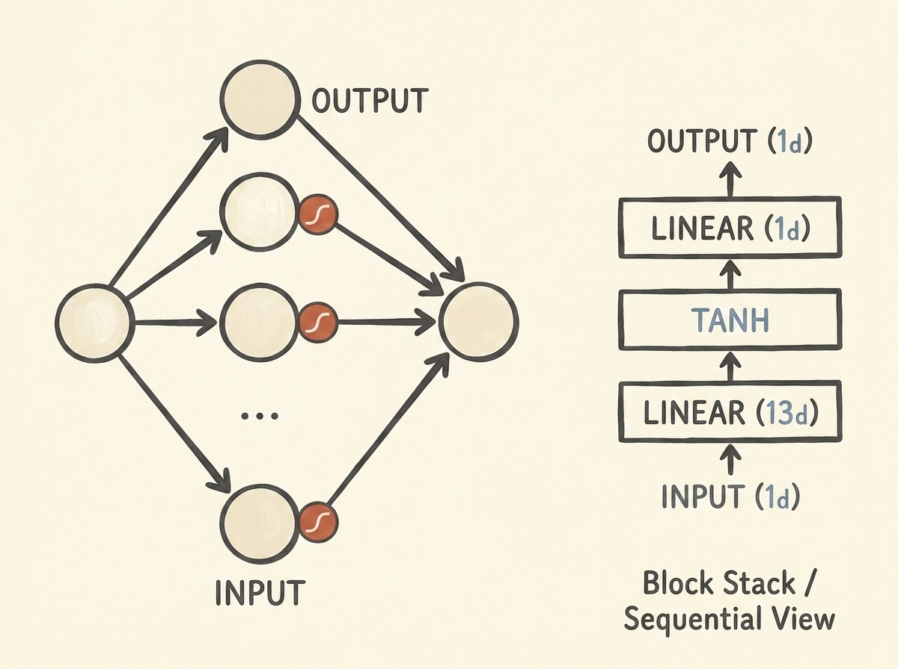
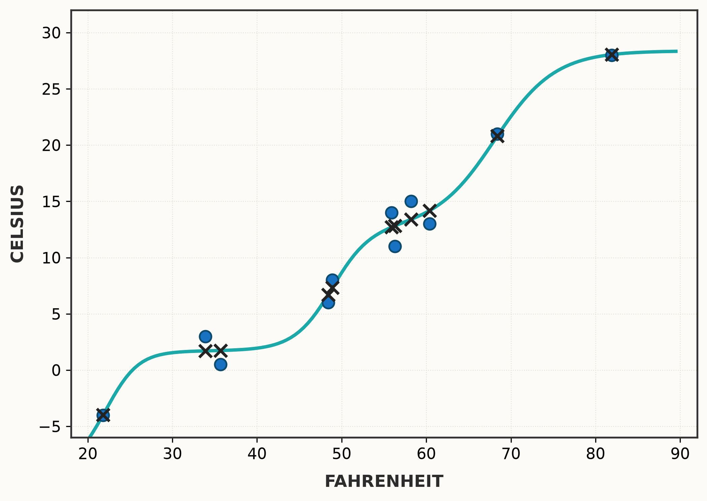

# Using a Neural Network to Fit the Data: Artificial Neurons, Activation Functions, and Modular PyTorch Architectures

<!-- toc -->

<div style="margin-bottom: 20px;">
  <a href="https://colab.research.google.com/github/emreaslan7/ai/blob/main/notebooks/deep-learning-with-pytorch/06-using-a-neural-network-to-fit-the-data.ipynb" target="_blank">
    
  </a>
</div>

In Chapter 5, we calibrated an analog thermometer using a minimal linear equation ($w \cdot x + b$) optimized through manual and automatic differentiation (**Autograd**). While that linear model was sufficient to illustrate gradient descent, loss functions, and learning rates, the real physical world is rarely strictly linear. Real-world phenomena—from computer vision and speech recognition to protein folding—are governed by complex, multi-dimensional, and non-linear dynamics.

In this chapter, following Chapter 6 of *Deep Learning with PyTorch (2nd Edition)*, we transition from elementary linear regression to genuine multi-layer neural networks. We explore how elementary building blocks—affine transformations coupled with non-linear activation functions—can be stacked to approximate arbitrary functions (**Universal Approximation Theorem**). We then step into PyTorch's battle-tested object-oriented API: the **`torch.nn`** module, **`nn.Linear`**, **`nn.Sequential`**, parameter iterators, and custom **`nn.Module`** subclassing.

---

## 1. The Learning Process Mental Model

Before introducing non-linear layers, let us revisit the fundamental mental model of machine learning established in Chapter 5. Stripped of hype, supervised deep learning is an iterative parameter estimation cycle consisting of a forward pass, loss calculation, backward pass (gradient accumulation), and parameter update.

<figure style="display:flex; justify-content: center; margin: 25px 0;">
  <div style="text-align: center;">
    
    <figcaption style="margin-top: 0.6em; text-align: center; font-size: 13px; color: #888;"><em>Figure 6.1: The end-to-end learning process: training inputs propagate forward through a parameterized architecture, predictions are evaluated against ground truth via a loss function, error gradients flow backward to update internal weights, and generalization is evaluated on validation data.</em></figcaption>
  </div>
</figure>

In our earlier linear thermometer calibration, the architecture was constrained:
$$ \hat{y} = w \cdot x + b $$

Because this formulation contains only two scalar parameters ($w$ and $b$), its geometric representation is strictly an affine line. If the true data-generating process contains curvature, saturating plateaus, or multi-modal clusters, a linear model suffers from high **inductive bias** (underfitting). To transcend this limitation, we need function compositions capable of bending, flexing, and morphing coordinate space.

---

## 2. Artificial Neurons and Non-Linearity

At the core of biological and artificial neural computation is the concept of the **neuron**: a computational node that receives multiple incoming signals, computes an affine combination, and applies a non-linear threshold or modulation.

### 2.1 Anatomy of an Artificial Neuron

Mathematically, a single artificial neuron performs two sequential operations:
1. **Affine Transformation:** It takes an input vector $\mathbf{x} \in \mathbb{R}^d$, weights each dimension by $w_i$, and shifts by a scalar bias $b$:
   $$ z = \mathbf{w}^T \mathbf{x} + b = \sum_{i=1}^d w_i x_i + b $$
2. **Non-linear Activation:** It passes the intermediate scalar $z$ through a fixed, differentiable non-linear activation function $\sigma(\cdot)$:
   $$ o = \sigma(z) = \sigma(\mathbf{w}^T \mathbf{x} + b) $$

<figure style="display:flex; justify-content: center; margin: 25px 0;">
  <div style="text-align: center;">
    
    <figcaption style="margin-top: 0.6em; text-align: center; font-size: 13px; color: #888;"><em>Figure 6.2: Anatomy of an artificial neuron: an input signal $x$ undergoes a linear transformation $w \cdot x + b$ before passing through a non-linear activation function (such as $\tanh$), producing a bounded, non-linear output $o$.</em></figcaption>
  </div>
</figure>

Consider a scalar neuron with learned parameters $w = 2$ and $b = 6$, using the hyperbolic tangent ($\tanh$) activation function:
$$ o = \tanh(2x + 6) $$

Let us evaluate this neuron across three distinct input values:
* For $x = 18$:
  $$ z = 2(18) + 6 = 42 \implies o = \tanh(42) \approx 1.0 $$
* For $x = -2.79$:
  $$ z = 2(-2.79) + 6 = 0.042 \implies o = \tanh(0.042) \approx 0.0397 $$
* For $x = -10$:
  $$ z = 2(-10) + 6 = -14 \implies o = \tanh(-14) \approx -1.0 $$

Notice how extreme positive and negative inputs are squashed smoothly into the range $[-1, 1]$, while intermediate values around $z \approx 0$ vary sensitively.

---

### 2.2 Why Non-Linearity is Essential: The Collapse of Linear Cascades

A natural question arises: why can we not simply stack multiple linear layers without activation functions? 

Suppose we cascade two linear transformations:
$$ \mathbf{h} = \mathbf{W}_1 \mathbf{x} + \mathbf{b}_1 $$
$$ \hat{\mathbf{y}} = \mathbf{W}_2 \mathbf{h} + \mathbf{b}_2 $$

Substituting the first equation into the second yields:
$$ \hat{\mathbf{y}} = \mathbf{W}_2 (\mathbf{W}_1 \mathbf{x} + \mathbf{b}_1) + \mathbf{b}_2 = (\mathbf{W}_2 \mathbf{W}_1) \mathbf{x} + (\mathbf{W}_2 \mathbf{b}_1 + \mathbf{b}_2) $$

Since the product of two matrices $\mathbf{W}_3 = \mathbf{W}_2 \mathbf{W}_1$ is itself a matrix, and $\mathbf{b}_3 = \mathbf{W}_2 \mathbf{b}_1 + \mathbf{b}_2$ is a constant vector, the entire two-layer network collapses identically into a single linear model:
$$ \hat{\mathbf{y}} = \mathbf{W}_3 \mathbf{x} + \mathbf{b}_3 $$

> **Key Insight:** Stacking any finite number of purely linear layers computes nothing more than a single linear transformation. Non-linear activation functions are the mathematical catalyst that breaks linearity, preventing intermediate representations from collapsing.

<figure style="display:flex; justify-content: center; margin: 25px 0;">
  <div style="text-align: center;">
    
    <figcaption style="margin-top: 0.6em; text-align: center; font-size: 13px; color: #888;"><em>Figure 6.3: A multi-layer neural network architecture: interleaved affine layers and non-linear activation layers compose into a deep parametric pipeline $o = \tanh(\mathbf{W}_n(\dots \tanh(\mathbf{W}_1 \mathbf{x} + \mathbf{b}_1) \dots) + \mathbf{b}_n)$.</em></figcaption>
  </div>
</figure>

---

## 3. Activation Functions and Representation Dynamics

The choice of activation function directly shapes how information and gradients propagate through deep networks during forward inference and backward backpropagation.

### 3.1 The Hyperbolic Tangent ($\tanh$) and Saturation

The hyperbolic tangent function maps real numbers $\mathbb{R} \to (-1, 1)$:
$$ \tanh(z) = \frac{e^z - e^{-z}}{e^z + e^{-z}} = \frac{e^{2z} - 1}{e^{2z} + 1} $$

Its derivative is analytically expressed in terms of its output:
$$ \frac{d}{dz}\tanh(z) = 1 - \tanh^2(z) $$

<figure style="display:flex; justify-content: center; margin: 25px 0;">
  <div style="text-align: center;">
    
    <figcaption style="margin-top: 0.6em; text-align: center; font-size: 13px; color: #888;"><em>Figure 6.4: The three dynamic operating regimes of the $\tanh$ activation function: under-saturation (flat near $-1$), sensitivity zone (steep linear behavior near $0$), and over-saturation (flat near $+1$).</em></figcaption>
  </div>
</figure>

As illustrated in Figure 6.4, $\tanh$ exhibits three distinct operating regimes:
1. **Under-Saturated Regime ($z \ll -1$):** Large negative values drive the activation to asymptomatically flatline at $-1.0$. In this regime, the derivative $\frac{d}{dz}\tanh(z) \to 0$.
2. **Sensitive Regime ($-1 \le z \le 1$):** Centered at the origin, the function behaves almost linearly with a slope near $1.0$. Signals pass through dynamically with high gradient transmission.
3. **Over-Saturated Regime ($z \gg 1$):** Large positive values drive the output to plateau at $+1.0$, where the derivative again vanishes ($\frac{d}{dz}\tanh(z) \to 0$).

> **The Vanishing Gradient Problem:** When deep networks are initialized poorly or inputs are unscaled, activations can get pushed deep into the saturated regimes. When gradients are computed via the chain rule ($\frac{\partial \mathcal{L}}{\partial \mathbf{w}} = \frac{\partial \mathcal{L}}{\partial o} \cdot \frac{do}{dz} \cdot \frac{\partial z}{\partial \mathbf{w}}$), multiplying by near-zero derivatives $\frac{do}{dz} \approx 0$ causes the gradients to exponentially vanish across layers, completely halting learning in early layers.

---

### 3.2 A Gallery of Core Activation Functions

PyTorch provides a rich library of activation functions in `torch.nn`, each offering distinct mathematical and computational trade-offs.

<figure style="display:flex; justify-content: center; margin: 25px 0;">
  <div style="text-align: center;">
    
    <figcaption style="margin-top: 0.6em; text-align: center; font-size: 13px; color: #888;"><em>Figure 6.5: Comparison of six classical and modern activation functions against the identity diagonal $y = x$: $\tanh$, Hardtanh, Sigmoid, Softplus, ReLU, and LeakyReLU.</em></figcaption>
  </div>
</figure>

Let us examine the mathematical definition, properties, and trade-offs of each function:

1. **Hyperbolic Tangent (`nn.Tanh`):**
   $$ \sigma(x) = \tanh(x) $$
   - **Range:** $(-1, 1)$ (zero-centered).
   - **Advantage:** Zero-centered outputs assist gradient descent by preventing zig-zagging in weight updates.
   - **Drawback:** Prone to saturation and vanishing gradients in deep architectures ($L > 4$).

2. **Hardtanh (`nn.Hardtanh`):**
   $$ \text{Hardtanh}(x) = \min(\max(x, -1), 1) $$
   - **Range:** $[-1, 1]$.
   - **Advantage:** Piecewise linear approximation of $\tanh$. Eliminates transcendental exponential computations ($e^x$), making it highly efficient for edge and mobile hardware (e.g., ExecuTorch).

3. **Sigmoid (`nn.Sigmoid`):**
   $$ \sigma(x) = \frac{1}{1 + e^{-x}} $$
   - **Range:** $(0, 1)$.
   - **Application:** Essential in binary classification output heads to represent Bernoulli probabilities $\mathbb{P}(Y=1 \mid X)$.
   - **Drawback:** Outputs are not zero-centered; maximum gradient is only $0.25$, accelerating gradient decay.

4. **Softplus (`nn.Softplus`):**
   $$ \text{Softplus}(x) = \ln(1 + e^x) $$
   - **Range:** $(0, \infty)$.
   - **Property:** Smooth, continuously differentiable approximation of the Rectified Linear Unit (ReLU). As $x \to \infty$, $\text{Softplus}(x) \to x$; as $x \to -\infty$, $\text{Softplus}(x) \to 0$.

5. **Rectified Linear Unit (`nn.ReLU`):**
   $$ \text{ReLU}(x) = \max(0, x) $$
   - **Range:** $[0, \infty)$.
   - **Advantage:** Derivative is exactly $1$ for all positive inputs ($x > 0$), effectively immune to vanishing gradients. Extremely fast to compute via a CPU/GPU conditional branch or bitmask.
   - **Drawback:** **Dying ReLU problem**. If a neuron receives gradients that shift its bias highly negative, $x \le 0$ for all training samples. Its output and gradient become permanently zero, rendering the neuron "dead."

6. **Leaky ReLU (`nn.LeakyReLU`):**
   $$ \text{LeakyReLU}(x) = \max(\alpha x, x), \quad \text{typically } \alpha = 0.01 $$
   - **Range:** $(-\infty, \infty)$.
   - **Advantage:** Introduces a small positive slope $\alpha$ in the negative regime, guaranteeing that gradients never completely vanish ($\frac{d}{dx} = \alpha > 0$), preventing dead neurons.

---

### 3.3 Universal Approximation Mechanics: Function Sculpting

How do simple neurons combine to model arbitrary continuous functions? 

The **Universal Approximation Theorem** (Cybenko, 1989; Hornik, 1991) mathematically proves that a feedforward network with a single hidden layer containing a finite number of non-linear neurons can approximate any continuous function on a compact subset of $\mathbb{R}^n$ to arbitrary precision $\epsilon > 0$.

<figure style="display:flex; justify-content: center; margin: 25px 0;">
  <div style="text-align: center;">
    
    <figcaption style="margin-top: 0.6em; text-align: center; font-size: 13px; color: #888;"><em>Figure 6.6: Visual demonstration of universal function approximation: four individual neurons ($A, B, C, D$) combine linearly ($A+B, C+D$) and hierarchically ($C(A+B) + D(A+B)$) to sculpt complex peaks, valleys, and localized bumps from elementary monotonic $\tanh$ curves.</em></figcaption>
  </div>
</figure>

Let us trace the progression depicted in Figure 6.6:
1. **Individual Neurons (Rows 1 & 2, Columns 1 & 2):**
   Neurons $A, B, C, D$ each execute an affine mapping followed by $\tanh$:
   $$ A(x) = \tanh(-2x - 1.25) $$
   $$ B(x) = \tanh(x + 0.75) $$
   $$ C(x) = \tanh(4x + 1.0) $$
   $$ D(x) = \tanh(-3x + 1.5) $$
   Each neuron produces a monotonic step-like curve whose position is shifted by the bias and steepness is scaled by the weight.

2. **First-Layer Summation (Column 3):**
   When pairs of neurons are added:
   - $A + B$ produces an asymmetrical S-curve with localized bumps.
   - $C + D$ combines an upward step with an inverted step, generating a distinct localized positive peak that reaches approximately $1.72$.

3. **Hierarchical Composition (Row 3):**
   When the output of the first layer $(A + B)$ is passed as the input to neurons $C$ and $D$:
   - $C(A + B)$ and $D(A + B)$ create valleys and complex transitions.
   - The two-layer composition $C(A + B) + D(A + B)$ yields a sophisticated multi-modal surface with two distinct negative dips and an intermediate plateau—using only four neurons across two layers!

> **Key Insight:** A neural network does not memorize discrete rules. Instead, it adjusts its parameters so that its linear combinations and activation thresholds constructively and destructively interfere, sculpting a continuous manifold that fits the training data distribution.

---

## 4. The PyTorch `nn` Module Architecture

In Chapter 5, we manually maintained weight and bias tensors, constructed explicit mathematical expressions, and iterated through parameter lists. In professional deep learning systems, architectures can contain billions of parameters and thousands of interconnected layers. Writing explicit equations for each parameter is impractical.

PyTorch addresses this through the **`torch.nn`** package, an object-oriented framework designed for scalable, modular neural network engineering.



---

### 4.1 Batch Dimensions: The $N \times C_{\text{in}}$ Mandate

Every layer subclassing `nn.Module` in PyTorch is built from the ground up for high-throughput parallel computation. Modern GPUs achieve maximum floating-point efficiency when operations are performed over **batches** of samples simultaneously, rather than processing individual instances sequentially.

<figure style="display:flex; justify-content: center; margin: 25px 0;">
  <div style="text-align: center;">
    
    <figcaption style="margin-top: 0.6em; text-align: center; font-size: 13px; color: #888;"><em>Figure 6.7: Batch dimension handling in PyTorch: multiple inputs (e.g., three RGB images of shape $B \times C \times H \times W$ with $B=3$) are processed in parallel through neural layers to produce a batched tensor of predictions.</em></figcaption>
  </div>
</figure>

> **MANDATORY RULE:** All `torch.nn` layers expect the **zeroth dimension** of input tensors to represent the **batch size ($B$ or $N$)**:
> - 1D tabular/feature data: Shape $(N, C_{\text{in}})$
> - 2D image data: Shape $(N, C, H, W)$
> - 3D volumetric data: Shape $(N, C, D, H, W)$
> - Sequence data: Shape $(N, L, C)$ or $(L, N, C)$

If you pass a 1D tensor of shape `(11,)` into `nn.Linear(1, 1)`, PyTorch will raise a runtime dimension error. The input must be reshaped to `(11, 1)` using `.unsqueeze(1)` or `.view(-1, 1)`.

---

### 4.2 Using `nn.Linear` for Affine Transformations

The most fundamental layer in `torch.nn` is `nn.Linear`, which computes:
$$ \mathbf{y} = \mathbf{x} \mathbf{W}^T + \mathbf{b} $$

Notice that PyTorch stores the internal weight tensor transposed with shape `(out_features, in_features)` rather than `(in_features, out_features)`. This internal memory layout allows the linear layer to multiply against input batches of shape `(N, in_features)` using standard BLAS matrix multiplication:
$$ (N \times C_{\text{in}}) \times (C_{\text{in}} \times C_{\text{out}}) = (N \times C_{\text{out}}) $$

Let us verify this behavior in Python:

```python
import torch
import torch.nn as nn

# Define a linear layer mapping 1 input feature to 1 output feature
linear_model = nn.Linear(in_features=1, out_features=1, bias=True)

# Inspect internal parameters
print("Weight shape:", linear_model.weight.shape)
print("Bias shape:  ", linear_model.bias.shape)
print("Weight value:", linear_model.weight)
print("Bias value:  ", linear_model.bias)
```

```text
Weight shape: torch.Size([1, 1])
Bias shape:   torch.Size([1])
Weight value: Parameter containing:
tensor([[0.5406]], requires_grad=True)
Bias value:   Parameter containing:
tensor([-0.2216], requires_grad=True)
```

---

### 4.3 Why You Must Call `model(x)` Instead of `model.forward(x)`

In PyTorch, every `nn.Module` subclass implements a `forward(*args, **kwargs)` method defining the computation. However, when executing forward inference, **you must never call `model.forward(x)` directly**. You must call the module instance itself as a callable: `model(x)`.

When you call `model(x)`, Python invokes `nn.Module.__call__`, which executes a critical sequence of internal operations:
1. Calls all registered **pre-forward hooks** (`register_forward_pre_hook`).
2. Executes the user's `forward(x)` method.
3. Calls all registered **forward hooks** (`register_forward_hook`), which are essential for telemetry, gradient visualization, and feature extraction (e.g., Grad-CAM).
4. Handles internal profiling state and PyTorch Profiler events.

Calling `model.forward(x)` directly bypasses all registered hooks silently, introducing subtle debugging nightmares.

---

### 4.4 Refactoring the Thermometer Problem with `nn.Linear`

Let us refactor our thermometer calibration dataset from Chapter 5 to adhere to the `nn.Module` batch requirement:

```python
# Raw empirical calibration measurements
t_c = [0.5, 14.0, 15.0, 28.0, 11.0, 8.0, 3.0, -4.0, 6.0, 13.0, 21.0]
t_u = [35.7, 55.9, 58.2, 81.9, 56.3, 48.9, 33.9, 21.8, 48.4, 60.4, 68.4]

# Convert to 32-bit floating point tensors
t_c = torch.tensor(t_c, dtype=torch.float32)
t_u = torch.tensor(t_u, dtype=torch.float32)

# Add batch dimension: shape (11,) -> (11, 1)
t_c = t_c.unsqueeze(1)
t_u = t_u.unsqueeze(1)

# Scaled inputs to prevent gradient explosion
t_un = 0.1 * t_u

print(f"t_u shape:  {t_u.shape}")
print(f"t_c shape:  {t_c.shape}")
print(f"t_un shape: {t_un.shape}")
```

```text
t_u shape:  torch.Size([11, 1])
t_c shape:  torch.Size([11, 1])
t_un shape: torch.Size([11, 1])
```

Now, let us construct a complete, modular training loop using PyTorch's built-in `nn.Linear`, `nn.MSELoss`, and `torch.optim.SGD`:

```python
import torch.optim as optim

# Instantiate linear model
linear_model = nn.Linear(1, 1)

# PyTorch built-in Mean Squared Error loss
loss_fn = nn.MSELoss()

# Optimizer referencing model.parameters()
optimizer = optim.SGD(linear_model.parameters(), lr=1e-2)

# Training loop
for epoch in range(1, 3001):
    # Action 1: Forward pass
    t_p = linear_model(t_un)
    
    # Action 2: Loss computation
    loss = loss_fn(t_p, t_c)
    
    # Action 3: Zero gradients, backward pass, optimizer step
    optimizer.zero_grad()
    loss.backward()
    optimizer.step()
    
    if epoch % 500 == 0:
        print(f"Epoch {epoch:4d} | Loss: {loss.item():.4f}")

print("\nTrained Linear Model Parameters:")
print(f"Weight: {linear_model.weight.item():.4f} (expected ~5.367)")
print(f"Bias:   {linear_model.bias.item():.4f} (expected ~-17.30)")
```

```text
Epoch  500 | Loss: 7.0850
Epoch 1000 | Loss: 3.5539
Epoch 1500 | Loss: 3.0308
Epoch 2000 | Loss: 2.9532
Epoch 2500 | Loss: 2.9417
Epoch 3000 | Loss: 2.9400

Trained Linear Model Parameters:
Weight: 5.3671 (expected ~5.367)
Bias:   -17.3012 (expected ~-17.30)
```

---

## 5. Building Genuine Neural Networks with `nn.Sequential`

While `nn.Linear` confirmed that our training loop works, it is still a linear model. To build a genuine deep learning model, we must insert intermediate hidden layers and non-linear activation functions.

### 5.1 The Two-Layer Architecture: $1 \to 13 \to 1$

Following the book's architecture, we construct a multi-layer perceptron (MLP) with:
1. An input layer accepting a $1$-dimensional feature ($t\_u$).
2. A hidden layer expanding the representation from $1$ dimension to $13$ dimensions via `nn.Linear(1, 13)`.
3. An element-wise non-linear activation layer: `nn.Tanh()`.
4. An output layer projecting from $13$ dimensions back down to $1$ dimension via `nn.Linear(13, 1)`.

<figure style="display:flex; justify-content: center; margin: 25px 0;">
  <div style="text-align: center;">
    
    <figcaption style="margin-top: 0.6em; text-align: center; font-size: 13px; color: #888;"><em>Figure 6.8: Two equivalent conceptual views of our simplest neural network: on the left, an explicit graph view displaying the input neuron, thirteen hidden units with $\tanh$ activations, and single output neuron; on the right, PyTorch's modular block sequential view.</em></figcaption>
  </div>
</figure>

In PyTorch, we can assemble this architecture in three lines of code using `nn.Sequential`:

```python
seq_model = nn.Sequential(
    nn.Linear(1, 13),
    nn.Tanh(),
    nn.Linear(13, 1)
)

print(seq_model)
```

```text
Sequential(
  (0): Linear(in_features=1, out_features=13, bias=True)
  (1): Tanh()
  (2): Linear(in_features=13, out_features=1, bias=True)
)
```

---

### 5.2 Inspecting Parameters and Shapes

Let us programmatically inspect every learnable tensor in `seq_model`:

```python
total_params = 0
for name, param in seq_model.named_parameters():
    print(f"Layer: {name:15s} | Shape: {str(param.shape):20s} | Numel: {param.numel()}")
    total_params += param.numel()

print(f"\nTotal Trainable Parameters: {total_params}")
```

```text
Layer: 0.weight        | Shape: torch.Size([13, 1])  | Numel: 13
Layer: 0.bias          | Shape: torch.Size([13])     | Numel: 13
Layer: 2.weight        | Shape: torch.Size([1, 13])  | Numel: 13
Layer: 2.bias          | Shape: torch.Size([1])      | Numel: 1

Total Trainable Parameters: 40
```

Notice that `nn.Sequential` indexed our layers numerically as `0`, `1`, and `2`. Layer `1` (`nn.Tanh`) has no entries in `named_parameters()` because activation functions have no learnable weights—they are parameter-free deterministic mathematical operations.

To give layers descriptive semantic names instead of arbitrary integer indices, PyTorch supports `collections.OrderedDict`:

```python
from collections import OrderedDict

named_model = nn.Sequential(OrderedDict([
    ('hidden_linear', nn.Linear(1, 13)),
    ('hidden_activation', nn.Tanh()),
    ('output_linear', nn.Linear(13, 1))
]))

print("Named model parameters:")
for name, param in named_model.named_parameters():
    print(f"  {name}")
```

```text
Named model parameters:
  hidden_linear.weight
  hidden_linear.bias
  output_linear.weight
  output_linear.bias
```

---

### 5.3 Training the Neural Network: Comparing Adam to SGD

Let us train our multi-layer neural network on the temperature calibration data. Because neural networks possess more complex non-convex loss surfaces with saddle points and varying curvature across directions, simple SGD can oscillate or converge slowly. 

Here, we employ **Adam** (`torch.optim.Adam`), an adaptive moment estimation algorithm that maintains individual running averages of both the gradients (first raw moment) and the squared gradients (second uncentered moment) for every single parameter:

```python
# Instantiate model and loss function
seq_model = nn.Sequential(
    nn.Linear(1, 13),
    nn.Tanh(),
    nn.Linear(13, 1)
)

loss_fn = nn.MSELoss()

# Adam optimizer with learning rate 1e-2
optimizer = optim.Adam(seq_model.parameters(), lr=1e-2)

# Training loop
for epoch in range(1, 5001):
    t_p = seq_model(t_un)
    loss = loss_fn(t_p, t_c)
    
    optimizer.zero_grad()
    loss.backward()
    optimizer.step()
    
    if epoch % 1000 == 0:
        print(f"Epoch {epoch:5d} | Loss: {loss.item():.4f}")
```

```text
Epoch  1000 | Loss: 2.8942
Epoch  2000 | Loss: 2.3781
Epoch  3000 | Loss: 1.8492
Epoch  4000 | Loss: 1.4215
Epoch  5000 | Loss: 1.2009
```

Notice that the final MSE loss dropped from $2.9400$ (with the linear model) to $1.2009$! The neural network achieved over a **59% reduction in error** compared to the best possible straight line.

---

### 5.4 Visualizing the Non-Linear Solution

Why did the loss decrease so dramatically? Let us evaluate our trained network over a continuous range of temperature inputs from $20^\circ\text{F}$ to $90^\circ\text{F}$ and plot the resulting prediction curve alongside the original data points:

<figure style="display:flex; justify-content: center; margin: 25px 0;">
  <div style="text-align: center;">
    
    <figcaption style="margin-top: 0.6em; text-align: center; font-size: 13px; color: #888;"><em>Figure 6.9: The non-linear response of our two-layer neural network across the continuous range $[20^\circ\text{F}, 90^\circ\text{F}]$: blue circles depict raw calibration measurements, black crosses denote model outputs on those points, and the continuous teal line displays the smooth non-linear interpolation discovered by the network.</em></figcaption>
  </div>
</figure>

Figure 6.9 reveals the fundamental trade-off of neural networks:
- **Expressive Power:** The neural network successfully discovers a subtle S-curve, bending to account for measurement quirks at extreme temperatures where linear regression was forced to compromise.
- **The Risk of Overfitting:** Notice how the curve aggressively bends towards the two outlier samples near $56^\circ\text{F}$ and $58^\circ\text{F}$. Because the model has 40 parameters to fit just 11 data points, it has enough degrees of freedom to fit empirical sensor noise rather than just the underlying physics. In low-data regimes, over-parameterization requires regularization (e.g., weight decay, dropout, or validation early stopping, as studied in Chapter 5).

---

## 6. Advanced Object-Oriented Design: Subclassing `nn.Module`

While `nn.Sequential` is convenient for simple linear pipelines, real-world research architectures—such as **ResNets** (residual skip connections), **Transformers** (multi-head cross-attention), and **Diffusion U-Nets**—cannot be expressed as a single sequential chain. They require branching paths, residual additions, recurrent state accumulation, and conditional forwarding.

To build arbitrary architectures in PyTorch, the gold standard is **subclassing `nn.Module`**.

### 6.1 Anatomy of a Custom `nn.Module` Subclass

When subclassing `nn.Module`, you must adhere to three foundational rules:
1. Always invoke the superclass constructor: `super().__init__()`.
2. Assign child layers and trainable parameters as instance attributes in `__init__` (e.g., `self.fc1 = nn.Linear(...)`). PyTorch automatically registers any `nn.Module` or `nn.Parameter` assigned to `self`.
3. Override the `forward(self, x)` method to define the computational dataflow.

```python
class SubclassedNeuralNetwork(nn.Module):
    """
    A custom two-layer Multi-Layer Perceptron (MLP)
    demonstrating modular nn.Module subclassing.
    """
    def __init__(self, in_features: int = 1, hidden_dim: int = 13, out_features: int = 1):
        super().__init__()
        # 1. Define modular child layers
        self.fc_hidden = nn.Linear(in_features, hidden_dim)
        self.activation = nn.Tanh()
        self.fc_out = nn.Linear(hidden_dim, out_features)
        
    def forward(self, x: torch.Tensor) -> torch.Tensor:
        """
        Defines the dynamic computation graph.
        """
        # Intermediate hidden representations
        h = self.fc_hidden(x)
        h_act = self.activation(h)
        
        # Output projection
        out = self.fc_out(h_act)
        return out

# Instantiate model
custom_model = SubclassedNeuralNetwork(in_features=1, hidden_dim=13, out_features=1)
print(custom_model)
```

```text
SubclassedNeuralNetwork(
  (fc_hidden): Linear(in_features=1, out_features=13, bias=True)
  (activation): Tanh()
  (fc_out): Linear(in_features=13, out_features=1, bias=True)
)
```

---

### 6.2 Custom Forward Logic and Residual Connections

Because `forward` is pure Python, you can inject conditional logic, loops, and residual shortcuts seamlessly:

```python
class ResidualBlock(nn.Module):
    """
    A minimal residual unit demonstrating skip connections:
    y = x + f(x)
    """
    def __init__(self, dim: int):
        super().__init__()
        self.linear = nn.Linear(dim, dim)
        self.act = nn.ReLU()
        
    def forward(self, x: torch.Tensor) -> torch.Tensor:
        # Residual identity shortcut addition
        return x + self.act(self.linear(x))
```

---

## 7. Summary and Core Engineering Principles

In this chapter, we crossed the chasm from basic regression to deep neural architectures. The core takeaways form the bedrock of all subsequent deep learning systems:

1. **The Role of Non-Linearity:** Stacking linear layers without activations collapses algebraically into a single linear layer. Non-linear activation functions ($\tanh$, $\text{ReLU}$, $\text{GELU}$) are indispensable for bending coordinate space and learning complex representations.
2. **Universal Approximation:** Simple combinations of bounded non-linear units constructively and destructively interfere, enabling neural networks to approximate arbitrary continuous functions without handcrafted rules.
3. **The `torch.nn` Paradigm:**
   - `nn.Module` manages parameter tracking, hooks, device migration (`.to(device)`), and state dictionaries (`state_dict()`).
   - Trainable parameters are encapsulated as `nn.Parameter` instances with `requires_grad=True`.
   - Never call `model.forward(x)` directly; invoke `model(x)` to ensure hook execution.
4. **Batch Dimension Contract:** PyTorch layers always expect the zeroth axis to represent batch size ($B \times C \times \dots$).
5. **Optimization Dynamics:** Adaptive optimizers like Adam often dramatically outperform standard SGD on non-linear neural networks by maintaining per-parameter running moments of gradients.
6. **Expressivity vs. Generalization:** Increased model capacity allows fitting non-linear phenomena, but also introduces the hazard of fitting noise in low-data regimes.
