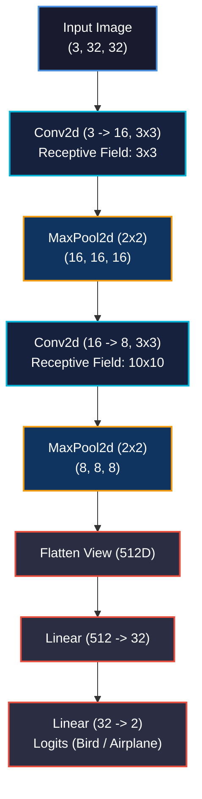

# Using Convolutions to Generalize

<!-- toc -->

<div style="margin-bottom: 20px;">
  <a href="https://colab.research.google.com/github/emreaslan7/ai/blob/main/notebooks/deep-learning-with-pytorch/08-using-convolutions-to-generalize.ipynb" target="_blank">
    
  </a>
</div>

In Chapter 7, we confronted the task of image classification on the CIFAR-10 dataset using fully connected neural networks. While our baseline multi-layer perceptron achieved better-than-chance accuracy, we quickly encountered two fundamental bottlenecks: an explosion in parameter count ($3{,}072 \times 512 = 1.57\text{M}$ weights in the input layer alone) and a complete absence of spatial inductive bias. A fully connected network treats pixel $(0, 0)$ and pixel $(0, 1)$ as completely independent features, possessing no inherent concept of spatial adjacency, localized edges, or translation invariance. If an airplane shifts five pixels to the right, a dense network perceives an entirely foreign set of active weights.

In this chapter, following Chapter 8 of *Deep Learning with PyTorch (2nd Edition)*, we adopt **convolutions** as the foundational building block for computer vision. We examine why **locality** and **translation invariance** allow convolutional layers to dramatically reduce parameter counts while radically improving generalization. We analyze handcrafted kernels, implement 2D convolution and pooling operations, build modular convolutional neural networks (`nn.Module` and `torch.nn.functional`), explore regularization strategies (**L2 weight decay**, **dropout**, and **batch normalization**), and master **residual connections** (ResNets) that allow neural signals to propagate effectively across hundreds of stacked layers.

---

## 1. The Case for Convolutions: Locality and Translation Invariance

Fully connected networks assume every input feature interacts directly with every hidden unit. For a 2D image $I \in \mathbb{R}^{C \times H \times W}$, flattening the spatial dimensions destroys the structural coordinate geometry of the visual world. Real-world visual scenes possess two foundational physical properties:

1. **Locality:** Pixels in close spatial proximity are strongly correlated. An edge, corner, or texture patch is formed by adjacent pixels, not by interactions between arbitrary opposite corners of the image.
2. **Translation Invariance:** An object's identity does not change when it shifts spatially across the visual field. A bird's beak in the upper-left quadrant possesses the exact same local visual characteristics as a beak in the center or lower-right quadrant.

<figure style="display:flex; justify-content: center; margin: 25px 0;">
  <div style="text-align: center;">
    
    <figcaption style="margin-top: 0.6em; text-align: center; font-size: 13px; color: #888;"><em>Figure 8.1: Discrete 2D convolution slides a small parameter kernel across the input grid. Computing scalar products over compact receptive fields enforces locality, while parameter sharing across spatial positions guarantees translation invariance.</em></figcaption>
  </div>
</figure>

### 1.1 The Mathematical Formulation of 2D Discrete Convolution

In continuous analysis, the convolution of two functions $f$ and $g$ is defined as $(f * g)(t) = \int\_{-\infty}^{\infty} f(\tau) g(t - \tau) d\tau$. In discrete image processing and deep learning frameworks, we compute the discrete cross-correlation (commonly referred to as convolution in machine learning literature):

$$ (I * K)(i, j) = \sum\_{m=-k\_h}^{k\_h} \sum\_{n=-k\_w}^{k\_w} I(i + m, j + n) K(m, n) $$

where $I$ represents the 2D input matrix, $K \in \mathbb{R}^{K\_H \times K\_W}$ is the learnable kernel (filter), and $(i, j)$ denotes the spatial coordinates of the output feature map.

Instead of assigning an independent weight to every coordinate pair $(i, j)$ across the entire $H \times W$ image, a convolutional layer shares the exact same small set of kernel weights $K$ across all spatial locations.

> **Key Insight:** Weight sharing reduces the parameter complexity from $\mathcal{O}(H\_{\text{in}} W\_{\text{in}} H\_{\text{out}} W\_{\text{out}})$ in dense linear layers to $\mathcal{O}(K\_H K\_W)$ per channel pair, independent of input image resolution.

### 1.2 Boundary Conditions and Padding

When sliding a kernel of size $K\_H \times K\_W$ over an image of size $H \times W$ with stride $S=1$ and without padding (**valid convolution**), the output spatial dimensions shrink according to:

$$ H\_{\text{out}} = H\_{\text{in}} - K\_H + 1, \quad W\_{\text{out}} = W\_{\text{in}} - K\_W + 1 $$

For repeated deep convolutions, spatial dimensions would rapidly collapse to zero. Furthermore, pixels on the outer borders would only participate in a tiny fraction of sliding windows compared to interior pixels. To preserve spatial resolution and maintain equal boundary representation, we pad the perimeter of the input tensor with zeros (**zero-padding**).

<figure style="display:flex; justify-content: center; margin: 25px 0;">
  <div style="text-align: center;">
    
    <figcaption style="margin-top: 0.6em; text-align: center; font-size: 13px; color: #888;"><em>Figure 8.2: Zero-padding boundary mechanism. By framing an input image with a 1-pixel border of zeros, a 3x3 kernel can center on perimeter pixels, preserving the original spatial resolution.</em></figcaption>
  </div>
</figure>

For an odd kernel size $K$, setting the padding $P$ to:

$$ P = \left\lfloor \frac{K}{2} \right\rfloor $$

guarantees that $H\_{\text{out}} = H\_{\text{in}}$ when stride $S=1$ (**same convolution**). For a standard $3 \times 3$ kernel, $P = \lfloor 3/2 \rfloor = 1$.

---

## 2. Convolutions in Action: Handcrafted Filters and Feature Detection

To build physical intuition before training networks end-to-end, we can manually define fixed kernel weights to extract specific structural features such as edges, gradients, and low-pass smoothing.

<figure style="display:flex; justify-content: center; margin: 25px 0;">
  <div style="text-align: center;">
    
    <figcaption style="margin-top: 0.6em; text-align: center; font-size: 13px; color: #888;"><em>Figure 8.3: Handcrafted 3x3 convolution filters applied to a CIFAR-10 image. High-pass filters accentuate spatial derivatives (edges, vertical, horizontal lines), while uniform averaging filters blur high frequencies.</em></figcaption>
  </div>
</figure>

### 2.1 Implementing Handcrafted Filters with `nn.Conv2d`

We construct a single-channel `nn.Conv2d` module, set `bias=False`, and manually assign specific matrix values to its `.weight` tensor parameter:

```python
import torch
import torch.nn as nn

# Define discrete derivative kernels
edge_kernel = torch.tensor([
    [-1.0, -1.0, -1.0],
    [-1.0,  8.0, -1.0],
    [-1.0, -1.0, -1.0]
])

horizontal_kernel = torch.tensor([
    [-1.0, -2.0, -1.0],
    [ 0.0,  0.0,  0.0],
    [ 1.0,  2.0,  1.0]
])

# Instantiate a 1-channel Conv2d layer with matching kernel dimensions
conv = nn.Conv2d(in_channels=1, out_channels=1, kernel_size=3, padding=1, bias=False)

# Assign manually engineered weights: Shape must be (out_channels, in_channels, k_h, k_w)
with torch.no_grad():
    conv.weight.copy_(edge_kernel.unsqueeze(0).unsqueeze(0))
```

When an edge filter slides across a uniform intensity region, the positive center weight ($+8$) exactly cancels the negative perimeter weights (eight $-1$s), outputting $0$. When an abrupt intensity boundary passes under the window, the balanced sum breaks, producing high-magnitude positive or negative activations.

### 2.2 Multi-Channel Convolutions and Parameter Dimensions

Real visual inputs contain multiple color channels ($C\_{\text{in}} = 3$ for RGB), and intermediate hidden layers contain dozens or hundreds of feature maps. 

For an input tensor $\mathbf{X} \in \mathbb{R}^{B \times C\_{\text{in}} \times H\_{\text{in}} \times W\_{\text{in}}}$, a convolutional layer with $C\_{\text{out}}$ output channels requires a 4D weight tensor $\mathbf{W} \in \mathbb{R}^{C\_{\text{out}} \times C\_{\text{in}} \times K\_H \times K\_W}$ and a 1D bias vector $\mathbf{b} \in \mathbb{R}^{C\_{\text{out}}}$.

<figure style="display:flex; justify-content: center; margin: 25px 0;">
  <div style="text-align: center;">
    
    <figcaption style="margin-top: 0.6em; text-align: center; font-size: 13px; color: #888;"><em>Figure 8.4: Multi-channel convolution pipeline. Each output feature map is generated by summing 2D convolutions across all input channels. Kernel weights are updated via backpropagation by computing the gradient of the loss with respect to filter weights.</em></figcaption>
  </div>
</figure>

The activation of output channel $c\_{\text{out}}$ at location $(i, j)$ is computed by summing across all $C\_{\text{in}}$ channels:

$$ \mathbf{Y}\_{c\_{\text{out}}, i, j} = \mathbf{b}\_{c\_{\text{out}}} + \sum\_{c\_{\text{in}}=0}^{C\_{\text{in}}-1} \sum\_{m=-k\_h}^{k\_h} \sum\_{n=-k\_w}^{k\_w} \mathbf{X}\_{c\_{\text{in}}, i+m, j+n} \mathbf{W}\_{c\_{\text{out}}, c\_{\text{in}}, m, n} $$

The total number of learnable parameters in an `nn.Conv2d` layer with bias is:

$$ \text{Parameters} = C\_{\text{out}} \times \left( C\_{\text{in}} \times K\_H \times K\_W + 1 \right) $$

For a layer with $C\_{\text{in}} = 3$, $C\_{\text{out}} = 16$, and $3 \times 3$ kernels:
$$ \text{Parameters} = 16 \times (3 \times 3 \times 3 + 1) = 16 \times 28 = 448 $$
This is orders of magnitude smaller than any equivalent linear projection.

---

## 3. Spatial Subsampling and Downsampling: Max Pooling

While convolutions preserve local spatial relationships, recognizing complex objects (e.g., an entire airplane or bird) requires integrating visual context across large areas of the image. Stacking $3 \times 3$ convolutions with stride 1 only expands the receptive field by 2 pixels per layer. To aggregate spatial information hierarchically and reduce memory consumption, we introduce **pooling**.

<figure style="display:flex; justify-content: center; margin: 25px 0;">
  <div style="text-align: center;">
    
    <figcaption style="margin-top: 0.6em; text-align: center; font-size: 13px; color: #888;"><em>Figure 8.5: Spatial downsampling via 2x2 Max Pooling. The input feature map is partitioned into non-overlapping 2x2 grids; the maximum activation in each window is propagated forward, halving spatial resolution while preserving dominant feature responses.</em></figcaption>
  </div>
</figure>

### 3.1 Max Pooling vs. Average Pooling

- **Max Pooling (`nn.MaxPool2d`):** Selects the maximum scalar value within the pooling window:
  $$ Y\_{i, j} = \max\_{m, n \in [0, K-1]} X\_{i \cdot S + m, j \cdot S + n} $$
  Because feature map activations correspond to detection confidences for specific visual patterns (edges, corners, curves), max pooling preserves the strongest detection signal in each local region, providing local translation invariance.
- **Average Pooling (`nn.AvgPool2d`):** Computes the arithmetic mean over the window. While smooth, it dilutes sharp feature activations.

### 3.2 Receptive Field Expansion

A neuron's **receptive field** is the sub-region of the original input image that can influence that neuron's activation. Downsampling feature maps via pooling exponentially increases the receptive field of subsequent convolutional layers.

<figure style="display:flex; justify-content: center; margin: 25px 0;">
  <div style="text-align: center;">
    
    <figcaption style="margin-top: 0.6em; text-align: center; font-size: 13px; color: #888;"><em>Figure 8.6: Hierarchical feature representation through cascaded convolution and pooling. Early layers detect micro-edges; intermediate layers combine edges into primitive geometric shapes; deep downsampled layers capture global composite semantic structures.</em></figcaption>
  </div>
</figure>



---

## 4. Assembling the Baseline Convolutional Network (`Net`)

We now integrate convolutions, non-linear activations, pooling layers, and fully connected classification heads into an end-to-end convolutional neural network.

<figure style="display:flex; justify-content: center; margin: 25px 0;">
  <div style="text-align: center;">
    
    <figcaption style="margin-top: 0.6em; text-align: center; font-size: 13px; color: #888;"><em>Figure 8.7: The complete end-to-end convolutional classification pipeline, transforming 3-channel input pixels through spatial feature extractions, flattening, and dense decision layers to produce calibrated class probabilities.</em></figcaption>
  </div>
</figure>

### 4.1 Architectural Breakdown and Dimensional Flow

The baseline architecture described in Chapter 8 processes $32 \times 32$ RGB images through two convolutional stages followed by a two-layer multi-layer perceptron head:

<figure style="display:flex; justify-content: center; margin: 25px 0;">
  <div style="text-align: center;">
    
    <figcaption style="margin-top: 0.6em; text-align: center; font-size: 13px; color: #888;"><em>Figure 8.8: Detailed layer-by-layer architectural blueprint of the baseline Net model, documenting exact intermediate tensor dimensions at each step.</em></figcaption>
  </div>
</figure>

Let us trace the tensor dimensions explicitly through each layer:
1. **Input:** $\mathbf{X} \in \mathbb{R}^{B \times 3 \times 32 \times 32}$.
2. **Conv 1:** `nn.Conv2d(3, 16, kernel_size=3, padding=1)`. Output: $(B, 16, 32, 32)$.
3. **Act 1:** `nn.Tanh()`. Element-wise non-linearity.
4. **Pool 1:** `nn.MaxPool2d(2)`. Output: $(B, 16, 16, 16)$.
5. **Conv 2:** `nn.Conv2d(16, 8, kernel_size=3, padding=1)`. Output: $(B, 8, 16, 16)$.
6. **Act 2:** `nn.Tanh()`. Element-wise non-linearity.
7. **Pool 2:** `nn.MaxPool2d(2)`. Output: $(B, 8, 8, 8)$.
8. **Flatten:** `.view(-1, 8 * 8 * 8)`. Output: $(B, 512)$.
9. **Linear 1:** `nn.Linear(512, 32)`. Output: $(B, 32)$.
10. **Act 3:** `nn.Tanh()`. Element-wise non-linearity.
11. **Linear 2 (Output Head):** `nn.Linear(32, 2)`. Output: $(B, 2)$ class logits.

### 4.2 Parameter Count: Dense vs. Convolutional

Let us analyze the parameter efficiency of this architecture compared to the fully connected model from Chapter 7:

| Layer | Type | Configuration | Weight Parameters | Bias Parameters | Total Parameters |
| :--- | :--- | :--- | :--- | :--- | :--- |
| `conv1` | `nn.Conv2d` | $3 \to 16$, $3 \times 3$ | $16 \times 3 \times 3 \times 3 = 432$ | $16$ | $448$ |
| `conv2` | `nn.Conv2d` | $16 \to 8$, $3 \times 3$ | $8 \times 16 \times 3 \times 3 = 1{,}152$ | $8$ | $1{,}160$ |
| `fc1` | `nn.Linear` | $512 \to 32$ | $32 \times 512 = 16{,}384$ | $32$ | $16{,}416$ |
| `fc2` | `nn.Linear` | $32 \to 2$ | $2 \times 32 = 64$ | $2$ | $66$ |
| **Total** | | | | | **$18{,}090$** |

In Chapter 7, our two-layer dense network required **$1{,}574{,}402$ parameters**. The convolutional feature extractor reduces parameter count by **over 98%**, while simultaneously learning translation-invariant spatial primitives that generalize dramatically better.

---

## 5. Refactoring with the Functional API (`torch.nn.functional`)

In PyTorch, neural networks can be authored using either stateful modules (`torch.nn`) or stateless functions (`torch.nn.functional`). 

Layers that manage trainable parameters (`nn.Conv2d`, `nn.Linear`, `nn.BatchNorm2d`) must be instantiated as submodules in `__init__` so that `nn.Module` can register their parameters into `.parameters()`. 

However, operations without parameters—such as `torch.tanh`, `F.relu`, and `F.max_pool2d`—maintain no internal weights. Defining separate member variables for every activation and pooling layer adds boilerplate. The idiomatic PyTorch convention calls stateless operations functionally inside `forward()`:

```python
import torch
import torch.nn as nn
import torch.nn.functional as F

class Net(nn.Module):
    def __init__(self):
        super().__init__()
        # Parameterized submodules registered in __init__
        self.conv1 = nn.Conv2d(3, 16, kernel_size=3, padding=1)
        self.conv2 = nn.Conv2d(16, 8, kernel_size=3, padding=1)
        self.fc1 = nn.Linear(8 * 8 * 8, 32)
        self.fc2 = nn.Linear(32, 2)

    def forward(self, x):
        # Stateless transformations invoked functionally
        out = F.max_pool2d(torch.tanh(self.conv1(x)), kernel_size=2)
        out = F.max_pool2d(torch.tanh(self.conv2(out)), kernel_size=2)
        out = out.view(-1, 8 * 8 * 8)
        out = torch.tanh(self.fc1(out))
        out = self.fc2(out)
        return out
```

---

## 6. Controlling Model Capacity and Regularization

When training neural networks on complex datasets, models often memorize idiosyncrasies of the training partition rather than generalizable semantic patterns (**overfitting**). As capacity increases, training loss approaches zero while validation loss diverges.

To achieve superior generalization, we investigate four architectural and algorithmic interventions:
1. **Network Width:** Controlling the number of channels per layer.
2. **L2 Regularization (Weight Decay):** Penalizing large parameter norms.
3. **Dropout:** Stochastically breaking co-adaptations.
4. **Batch Normalization:** Stabilizing activation distributions.

### 6.1 L2 Regularization and Weight Decay

L2 regularization augments the empirical classification loss $\mathcal{L}\_0$ with an explicit penalty proportional to the squared Euclidean norm of all weight matrices:

$$ \mathcal{L}\_{\text{total}}(\mathbf{w}) = \mathcal{L}\_0(\mathbf{w}) + \frac{\lambda}{2} \sum\_{l} \left\\| \mathbf{W}\_l \right\\|\_2^2 $$

Taking the gradient with respect to $\mathbf{w}$:

$$ \nabla\_{\mathbf{w}} \mathcal{L}\_{\text{total}} = \nabla\_{\mathbf{w}} \mathcal{L}\_0 + \lambda \mathbf{w} $$

Under stochastic gradient descent with learning rate $\eta$, the parameter update becomes:

$$ \mathbf{w}\_{t+1} = \mathbf{w}\_t - \eta \left( \nabla\_{\mathbf{w}} \mathcal{L}\_0 + \lambda \mathbf{w}\_t \right) = (1 - \eta \lambda) \mathbf{w}\_t - \eta \nabla\_{\mathbf{w}} \mathcal{L}\_0 $$

Because $(1 - \eta \lambda) < 1$, the weights are shrunk multiplicatively towards zero at each step, preventing any single weight from growing excessively large. In PyTorch, this is enabled via the `weight_decay` hyperparameter:

```python
optimizer = torch.optim.SGD(model.parameters(), lr=1e-2, weight_decay=1e-3)
```

### 6.2 Dropout and Spatial Dropout

Proposed by Srivastava et al. (2014), **Dropout** randomly zeroes activations during the forward pass with probability $p$. For spatial convolutional feature maps, standard unit dropout is suboptimal because neighboring pixels remain highly correlated. PyTorch provides **`nn.Dropout2d`**, which drops entire 2D feature map channels simultaneously:

```python
class NetDropout(nn.Module):
    def __init__(self, n_chans=32):
        super().__init__()
        self.conv1 = nn.Conv2d(3, n_chans, kernel_size=3, padding=1)
        self.conv1_dropout = nn.Dropout2d(p=0.4)
        self.conv2 = nn.Conv2d(n_chans, n_chans // 2, kernel_size=3, padding=1)
        self.conv2_dropout = nn.Dropout2d(p=0.4)
        self.fc1 = nn.Linear(8 * 8 * (n_chans // 2), 32)
        self.fc2 = nn.Linear(32, 2)

    def forward(self, x):
        out = F.max_pool2d(self.conv1_dropout(torch.tanh(self.conv1(x))), 2)
        out = F.max_pool2d(self.conv2_dropout(torch.tanh(self.conv2(out))), 2)
        out = out.view(-1, 8 * 8 * (self.conv2.out_channels))
        out = torch.tanh(self.fc1(out))
        return self.fc2(out)
```

> [!IMPORTANT]
> Because dropout alters activation magnitudes during training by scaling surviving activations by $\frac{1}{1-p}$, you **must** call `model.train()` before training and `model.eval()` before evaluation to disable dropout at inference time.

### 6.3 Batch Normalization

Introduced by Ioffe and Szegedy (2015), **Batch Normalization** addresses internal covariate shift—the continuous drift in layer input distributions as upstream parameters change during gradient descent.

<figure style="display:flex; justify-content: center; margin: 25px 0;">
  <div style="text-align: center;">
    
    <figcaption style="margin-top: 0.6em; text-align: center; font-size: 13px; color: #888;"><em>Figure 8.9: Batch Normalization mechanics. For each feature channel across the mini-batch, the sample mean and variance are calculated, normalizing activations to zero mean and unit variance before applying learnable scale and shift parameters.</em></figcaption>
  </div>
</figure>

For a mini-batch $\mathcal{B} = \{x\_1, \dots, x\_m\}$ of activations for a given channel:
1. **Batch Mean:**
   $$ \mu\_{\mathcal{B}} = \frac{1}{m} \sum\_{i=1}^{m} x\_i $$
2. **Batch Variance:**
   $$ \sigma\_{\mathcal{B}}^2 = \frac{1}{m} \sum\_{i=1}^{m} (x\_i - \mu\_{\mathcal{B}})^2 $$
3. **Normalization:**
   $$ \hat{x}\_i = \frac{x\_i - \mu\_{\mathcal{B}}}{\sqrt{\sigma\_{\mathcal{B}}^2 + \epsilon}} $$
4. **Scale and Shift (Learnable Affine Parameters):**
   $$ y\_i = \gamma \hat{x}\_i + \beta $$

During training, `nn.BatchNorm2d` computes running estimates of the population mean and variance via exponential moving averages:

$$ \mu\_{\text{running}} = (1 - \text{momentum}) \mu\_{\text{running}} + \text{momentum} \cdot \mu\_{\mathcal{B}} $$

At evaluation time (`model.eval()`), batch statistics are disabled, and the frozen running statistics are applied deterministically.

---

## 7. Going Deeper: ResNets and Skip Connections

Intuition suggests that making neural networks deeper should strictly increase representation capacity. However, as feedforward networks exceed 20 to 30 layers, a severe degradation problem emerges: accuracy saturates and then degrades rapidly. 

This degradation is not caused by overfitting (training error increases as well), but rather by **vanishing gradients**. During backpropagation, error gradients are repeatedly multiplied through layer Jacobians:

$$ \frac{\partial \mathcal{L}}{\partial \mathbf{x}\_1} = \frac{\partial \mathcal{L}}{\partial \mathbf{x}\_L} \prod\_{l=1}^{L-1} \frac{\partial \mathbf{x}\_{l+1}}{\partial \mathbf{x}\_l} $$

If the spectral norm of these Jacobian matrices is less than 1, the gradient signal decays exponentially as it propagates back toward the early layers, halting weight updates.

<figure style="display:flex; justify-content: center; margin: 25px 0;">
  <div style="text-align: center;">
    
    <figcaption style="margin-top: 0.6em; text-align: center; font-size: 13px; color: #888;"><em>Figure 8.10: Deep network architecture featuring an identity skip connection (NetRes). By bypassing intermediate convolutional transformations, input representations can flow directly forward, creating gradient superhighways for backpropagation.</em></figcaption>
  </div>
</figure>

### 7.1 The Residual Learning Formulation

In their seminal 2015 paper, Kaiming He et al. proposed **Deep Residual Learning (ResNet)**. Instead of tasking stacked layers with fitting an underlying mapping $\mathcal{H}(\mathbf{x})$, the layers are explicitly configured to approximate a residual mapping:

$$ \mathcal{F}(\mathbf{x}) = \mathcal{H}(\mathbf{x}) - \mathbf{x} $$

The original mapping is recast as:

$$ \mathcal{H}(\mathbf{x}) = \mathcal{F}(\mathbf{x}) + \mathbf{x} $$

This formulation is implemented by adding an **identity skip connection** (shortcut) that bridges the convolutional block:

<figure style="display:flex; justify-content: center; margin: 25px 0;">
  <div style="text-align: center;">
    
    <figcaption style="margin-top: 0.6em; text-align: center; font-size: 13px; color: #888;"><em>Figure 8.11: Residual block architecture (ResBlock) with Batch Normalization and skip connection, cascaded to construct very deep convolutional architectures (NetResDeep - 100 blocks).</em></figcaption>
  </div>
</figure>

Consider the gradient of the loss with respect to the input of a residual unit:

$$ \frac{\partial \mathcal{L}}{\partial \mathbf{x}} = \frac{\partial \mathcal{L}}{\partial \mathcal{H}} \frac{\partial \mathcal{H}}{\partial \mathbf{x}} = \frac{\partial \mathcal{L}}{\partial \mathcal{H}} \left( \frac{\partial \mathcal{F}(\mathbf{x})}{\partial \mathbf{x}} + \mathbf{I} \right) = \frac{\partial \mathcal{L}}{\partial \mathcal{H}} \frac{\partial \mathcal{F}(\mathbf{x})}{\partial \mathbf{x}} + \frac{\partial \mathcal{L}}{\partial \mathcal{H}} $$

The term $\frac{\partial \mathcal{L}}{\partial \mathcal{H}}$ propagates back directly without multiplying through any weight matrix! Even if $\frac{\partial \mathcal{F}(\mathbf{x})}{\partial \mathbf{x}}$ approaches zero, the identity term $\mathbf{I}$ guarantees an uninterrupted gradient flow.

### 7.2 Building `ResBlock` and `NetResDeep` in PyTorch

```python
class ResBlock(nn.Module):
    def __init__(self, n_chans):
        super().__init__()
        self.conv = nn.Conv2d(n_chans, n_chans, kernel_size=3, padding=1, bias=False)
        self.bn = nn.BatchNorm2d(num_features=n_chans)
        
    def forward(self, x):
        out = self.conv(x)
        out = self.bn(out)
        out = torch.relu(out)
        return out + x  # Add identity shortcut

class NetResDeep(nn.Module):
    def __init__(self, n_chans=32, n_blocks=100):
        super().__init__()
        self.n_chans = n_chans
        self.conv1 = nn.Conv2d(3, n_chans, kernel_size=3, padding=1)
        # Stack 100 residual blocks sequentially
        self.resblocks = nn.Sequential(
            *(n_blocks * [ResBlock(n_chans=n_chans)])
        )
        self.fc1 = nn.Linear(8 * 8 * n_chans, 32)
        self.fc2 = nn.Linear(32, 2)

    def forward(self, x):
        out = F.max_pool2d(torch.relu(self.conv1(x)), 2)
        out = self.resblocks(out)
        out = F.max_pool2d(out, 2)
        out = out.view(-1, 8 * 8 * self.n_chans)
        out = torch.relu(self.fc1(out))
        return self.fc2(out)
```

With skip connections, a network with **100 convolutional layers** trains stably without vanishing gradients.

---

## 8. Empirical Architecture Benchmarks and Comparative Analysis

To evaluate the practical efficacy of these architectural variations, we train and validate each variant on the CIFAR-2 (Birds vs Airplanes) benchmark.

<figure style="display:flex; justify-content: center; margin: 25px 0;">
  <div style="text-align: center;">
    
    <figcaption style="margin-top: 0.6em; text-align: center; font-size: 13px; color: #888;"><em>Figure 8.12: Empirical accuracy comparison across 8 network configurations on CIFAR-2. While wider models achieve near 100% training accuracy, regularized and residual architectures achieve superior test generalization.</em></figcaption>
  </div>
</figure>

### 8.1 Comparative Analysis Table

| Model Architecture | Train Accuracy | Val Accuracy | Generalization Gap | Key Characteristic |
| :--- | :--- | :--- | :--- | :--- |
| **`BASELINE`** | 93.8% | 89.7% | 4.1% | Compact 2-layer CNN ($18\text{K}$ params). |
| **`WIDTH`** | 96.8% | 90.4% | 6.4% | Doubled channel count; higher expressiveness, mild overfitting. |
| **`L2 REG`** | 90.8% | 87.9% | 2.9% | Constrained parameter magnitudes; suppresses overfitting. |
| **`DROPOUT`** | 90.2% | 88.5% | 1.7% | Smallest generalization gap; prevents co-adaptations. |
| **`BATCH_NORM`** | 99.8% | 89.9% | 9.9% | Fast convergence, stabilizes internal distributions. |
| **`DEPTH`** | 95.8% | 91.0% | 4.8% | Additional conv layer expands receptive field. |
| **`RES`** | 97.1% | 90.3% | 6.8% | Skip connection maintains gradient health. |
| **`RES DEEP`** | 97.6% | 87.2% | 10.4% | 100 residual layers; train error remains stable without vanishing gradients. |

---

## 9. Summary & Key Takeaways

1. **Inductive Biases in Vision:** Fully connected layers are fundamentally inefficient for visual processing. Convolutions exploit **locality** (compact receptive fields) and **translation invariance** (spatial weight sharing), drastically reducing parameter counts.
2. **Padding and Subsampling:** Zero-padding ($P = \lfloor K/2 \rfloor$) preserves boundary coordinates. Max pooling downsamples spatial grids, providing local invariance while expanding the receptive field to capture composite global objects.
3. **Clean PyTorch Design:** Parameterized operations belong in `__init__`, while stateless activations and pooling operations are cleanly invoked via `torch.nn.functional` inside `forward()`.
4. **Regularization Triad:** L2 weight decay constrains parameter norms; spatial dropout prevents feature co-adaptation; batch normalization stabilizes intermediate representations across mini-batches.
5. **Residual Architectures:** Identity skip connections ($\mathcal{F}(\mathbf{x}) + \mathbf{x}$) preserve gradient magnitude during backpropagation, enabling networks to scale to hundreds of layers deep without vanishing gradients.
