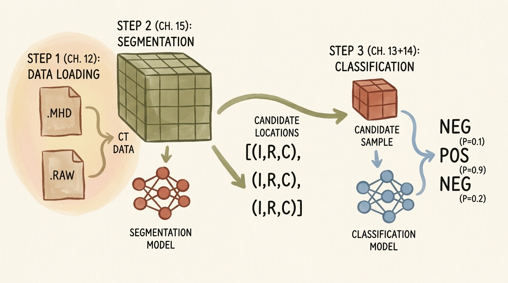
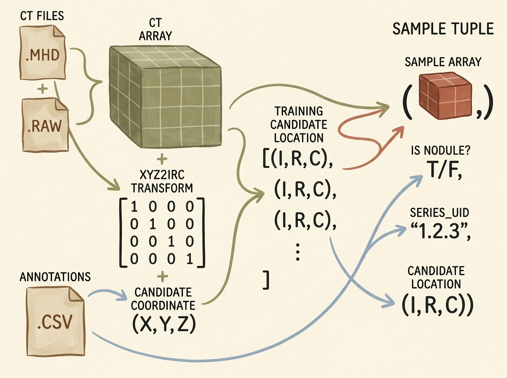
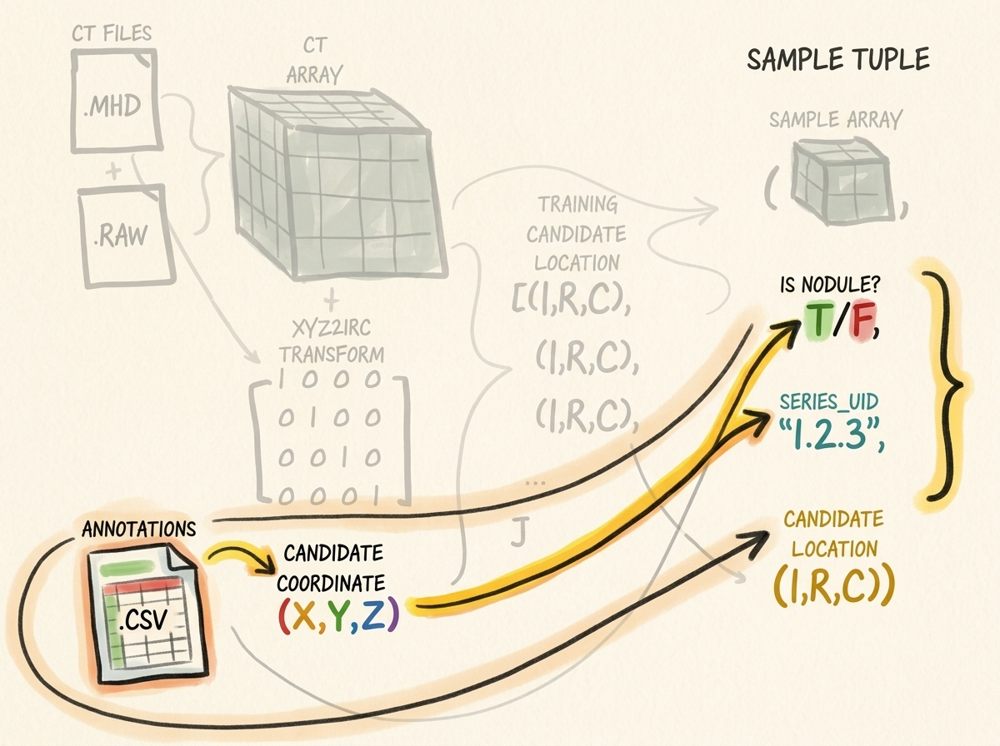
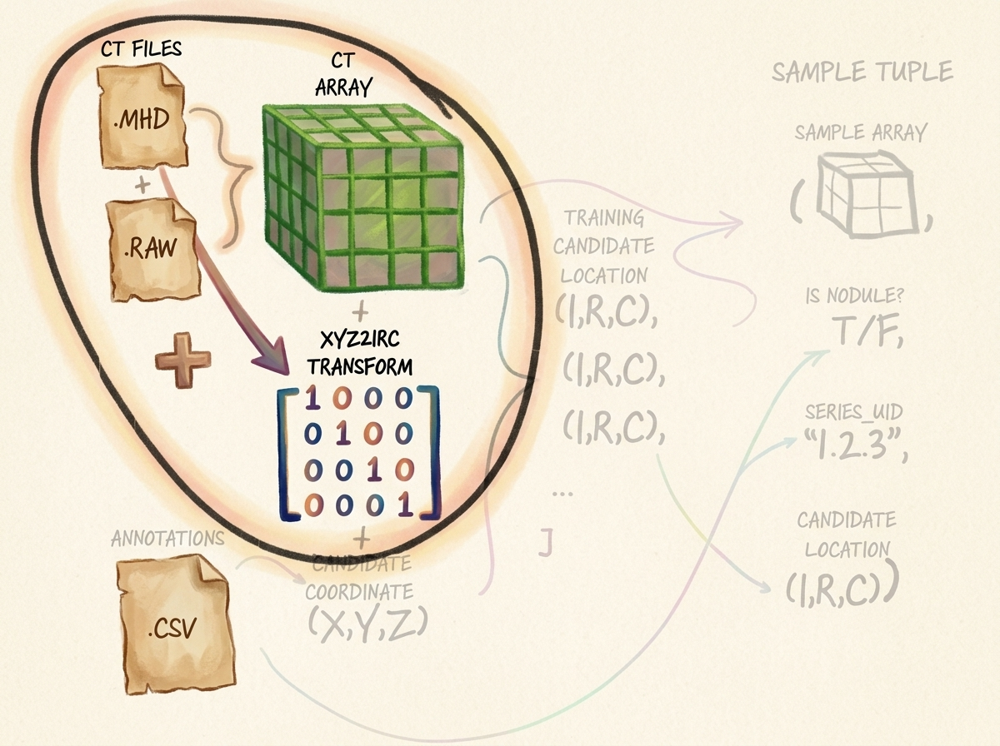
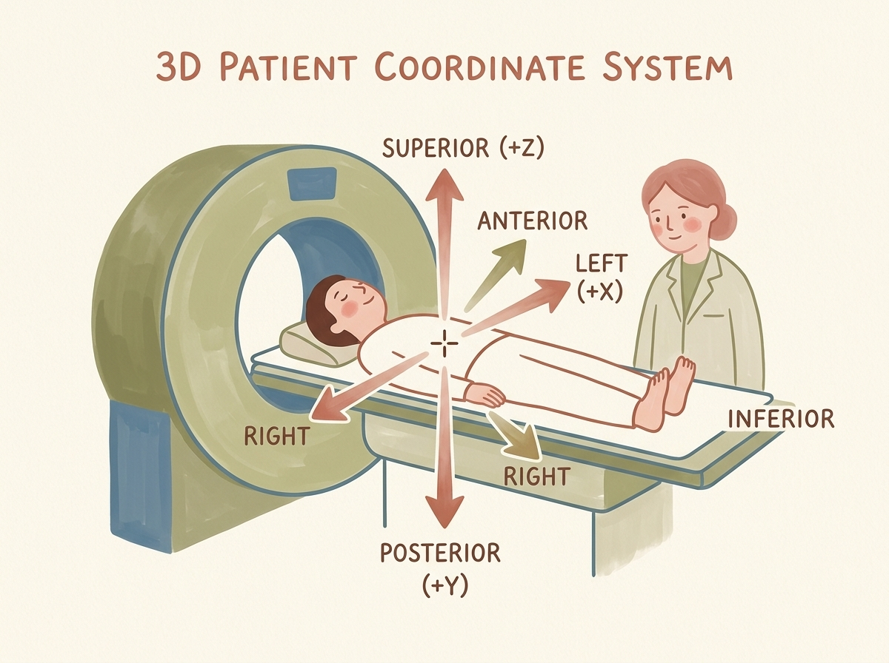
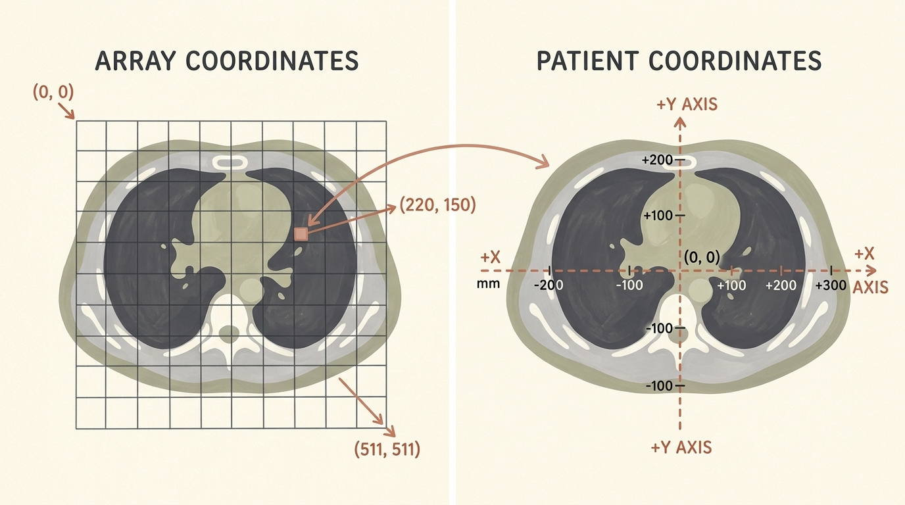
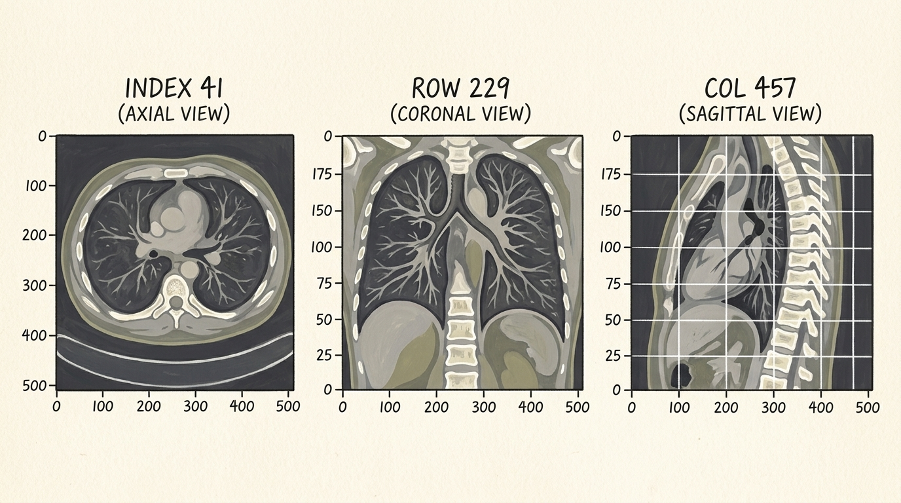
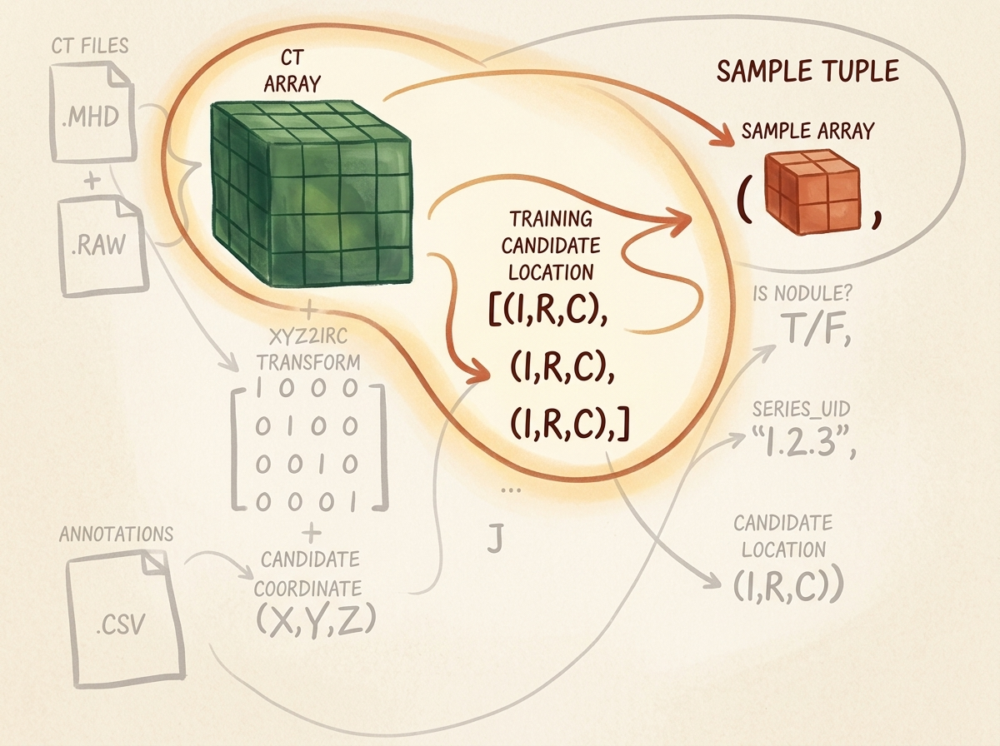
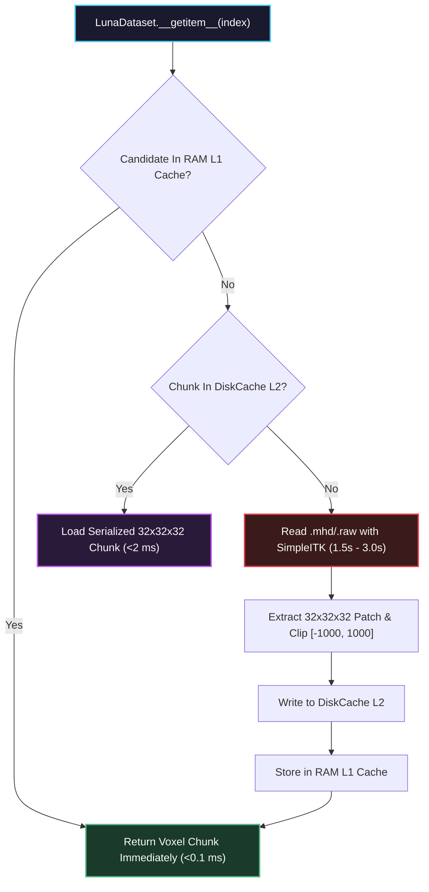

```mermaid
flowchart TD
    subgraph StorageLayer ["Disk Storage Layer"]
        direction TB
        subgraph CTFiles ["Volumetric CT Scans (.mhd / .raw)"]
            direction LR
            MHD[".mhd Header Files<br/>(Origin, Spacing, Direction)"]
            RAW[".raw Binary Files<br/>(Little-Endian Int16 HU)"]
        end
        subgraph CSVFiles ["Tabular Catalogs (.csv)"]
            direction LR
            CSVAnn["annotations.csv<br/>(True Nodules: Series, XYZ, Diam)"]
            CSVCand["candidates.csv<br/>(All Candidates: Series, XYZ, Class)"]
        end
        CTFiles --> CSVFiles
    end

    subgraph ParsingEngine ["Data Synthesis & Coordinate Resolution"]
        direction TB
        AnnotParse["Parse & Merge Annotations<br/>by series_uid & Spatial Distance"]
        SITKLoad["SimpleITK Volumetric Ingestion:<br/>Extract Origin, Spacing, Voxel Array"]
        AffineCoord["Affine Transformation:<br/>Patient Space (mm) ➔ Voxel Space (IRC)"]
        AnnotParse --> SITKLoad --> AffineCoord
    end

    subgraph MemoryOptimization ["Patch Extraction & Tiered Caching"]
        direction TB
        PatchCrop["Extract 3D Sub-Volume Patch<br/>(32 x 32 x 32 Voxels)"]
        HUClamp["Hounsfield Clamping:<br/>[-1000 HU, +1000 HU] ➔ Float32 Normalization"]
        TierCache["Tiered Caching:<br/>In-Memory (lru_cache) + Disk Persistence (diskcache)"]
        PatchCrop --> HUClamp --> TierCache
    end

    subgraph DatasetInterface ["PyTorch Dataset Abstraction (LunaDataset)"]
        direction TB
        SampleTuple["__getitem__ Output:<br/>(Tensor[1, 32, 32, 32], Label[0/1], series_uid, Center_IRC)"]
        GroupSplit["Grouped Split:<br/>10-Fold Series UID Cross-Validation (Zero Leakage)"]
        SampleTuple --> GroupSplit
    end

    StorageLayer --> ParsingEngine
    ParsingEngine --> MemoryOptimization
    MemoryOptimization --> DatasetInterface

    style StorageLayer fill:#1a1a2e,stroke:#4cc9f0,stroke-width:2px,color:#fff
    style CTFiles fill:#16213e,stroke:#4cc9f0,stroke-width:1px,color:#fff
    style CSVFiles fill:#16213e,stroke:#4cc9f0,stroke-width:1px,color:#fff
    style ParsingEngine fill:#1a3a2a,stroke:#52b788,stroke-width:2px,color:#fff
    style MemoryOptimization fill:#2a1a3a,stroke:#bd53ed,stroke-width:2px,color:#fff
    style DatasetInterface fill:#3a2a1a,stroke:#ffaa00,stroke-width:2px,color:#fff
```

# Combining Data Sources into a Unified Dataset

<!-- toc -->

<div style="margin-bottom: 20px;">
  <a href="https://colab.research.google.com/github/emreaslan7/ai/blob/main/notebooks/deep-learning-with-pytorch/12-combining-data-sources-into-a-unified-dataset.ipynb" target="_blank">
    
  </a>
</div>

---

## 1. The Data Ingestion Bottleneck in 3D Medical Deep Learning

In standard computer vision workflows—such as classification on ImageNet or object detection on COCO—datasets consist of isolated 2D PNG or JPEG image files where pixel indices directly correspond to image coordinates. Medical imaging, and high-resolution thoracic Computerized Tomography (CT) in particular, shatters this simplicity across several fundamental architectural dimensions:

1. **Massive Volumetric Scale:** A single thoracic CT scan comprises a volumetric 3D lattice consisting of hundreds of sequential 2D slices (typically $512 \times 512$ voxels across 150–500 axial planes), consuming $50\text{ MB to }200\text{ MB}$ of raw uncompressed memory per patient.
2. **Separation of Physical Space and Digital Arrays:** Physical structures in human anatomy are measured in absolute millimeters ($X, Y, Z$), whereas tensors are indexed by discrete integer matrix subscripts ($[I, R, C]$). Because scanners operate with varying slice thicknesses and field-of-view settings, the spatial relationship between physical millimeters and discrete voxels differs across patients.
3. **Severe Class Imbalance:** In the LUNA (LUng Nodule Analysis) Grand Challenge dataset, expert thoracic radiologists annotated approximately $1{,}351$ genuine malignant/benign nodules across $888$ patient scans, while automated classical candidate extractors flagged over $550{,}000$ suspicious tissue locations. Genuine nodules constitute less than $0.25\%$ of all candidate samples.
4. **Data Leakage Risks:** Multiple candidate tissue patches frequently belong to the same patient volume. Randomly shuffling candidates across train and validation splits would allow slices from the same anatomical volume into both partitions, invalidating validation accuracy.

This module establishes **Step 1: Data Loading & Preprocessing** of the end-to-end lung cancer detection system, transforming raw heterogeneous CT disk files and CSV annotation catalogs into a memory-efficient, cached PyTorch `Dataset` that yields uniform 3D tensor patches.

<figure style="display:flex; justify-content: center; margin: 25px 0;">
  <div style="text-align: center;">
    
    <figcaption style="margin-top: 0.6em; text-align: center; font-size: 13px; color: #888;"><em>Figure 1: The end-to-end lung cancer detection system pipeline. Step 1 constructs the volumetric data loading engine feeding the subsequent 3D CNN classification and U-Net segmentation models.</em></figcaption>
  </div>
</figure>



---

## 2. Master Data Pipeline Architecture

The unified dataset pipeline bridges two distinct data streams:
1. **Volumetric Medical Imaging Stream:** Large volumetric CT scans stored in the MetaImage format (`.mhd` + `.raw`).
2. **Tabular Annotation Stream:** Comma-separated value (CSV) files specifying candidate coordinates and clinical labels.

<figure style="display:flex; justify-content: center; margin: 25px 0;">
  <div style="text-align: center;">
    
    <figcaption style="margin-top: 0.6em; text-align: center; font-size: 13px; color: #888;"><em>Figure 2: Master architecture of the data ingestion pipeline. Raw CT volumes and CSV annotations are unified through an affine spatial transform matrix into structured training tuples.</em></figcaption>
  </div>
</figure>

The pipeline constructs an output tuple containing four distinct fields for each candidate item:
- **`candidate_tensor`:** A $32 \times 32 \times 32$ floating-point tensor crop centered on the candidate nodule location.
- **`is_nodule_bool`:** A boolean ground-truth label ($1$ for genuine nodules, $0$ for non-nodules).
- **`series_uid`:** A unique alphanumeric string identifying the patient scan series.
- **`candidate_location_irc`:** The discrete integer voxel coordinate tuple $(I, R, C)$ identifying the center of the crop.

---

## 3. Parsing LUNA Annotation & Candidate Records

### 3.1 Structure of the Tabular Data

The LUNA Grand Challenge distributes two separate annotation files:
1. `annotations.csv`: Contains expert radiologist consensus annotations for confirmed nodules. Each record provides:
   - `series_uid`: Unique scan identifier.
   - `coordX`, `coordY`, `coordZ`: Center location in continuous millimeters within patient coordinate space.
   - `diameter_mm`: Approximate sphere diameter of the nodule in millimeters.
2. `candidates.csv`: Contains candidate locations produced by candidate generation algorithms (heuristic filters designed for high sensitivity, catching virtually all nodules at the cost of hundreds of thousands of false positives):
   - `series_uid`: Scan identifier.
   - `coordX`, `coordY`, `coordZ`: Candidate center in millimeters.
   - `class`: Binary indicator ($1$ for confirmed nodule, $0$ for false-positive non-nodule).

<figure style="display:flex; justify-content: center; margin: 25px 0;">
  <div style="text-align: center;">
    
    <figcaption style="margin-top: 0.6em; text-align: center; font-size: 13px; color: #888;"><em>Figure 3: Parsing tabular CSV annotations. Continuous spatial coordinates $(X, Y, Z)$ are extracted and matched to ground-truth nodule labels and series identifiers.</em></figcaption>
  </div>
</figure>

### 3.2 Unifying Annotations and Candidate Coordinates

Because candidate coordinates generated by detection algorithms rarely match radiologist nodule centers down to the exact sub-millimeter, we merge the two tables by checking if candidate coordinates lie within a bounding sphere of radius $r = \frac{1}{2}\text{diameter\\_mm}$ from any confirmed annotation record for the same `series_uid`.

```python
import csv
import functools
import glob
import os
from collections import namedtuple

# Define clean immutable record types
CandidateInfoTuple = namedtuple(
    'CandidateInfoTuple',
    ['is_nodule_bool', 'diameter_mm', 'series_uid', 'center_xyz']
)

@functools.lru_cache(maxsize=1)
def get_candidate_info_list(require_on_disk_bool=True):
    """
    Parses annotations.csv and candidates.csv, merging true nodule diameters
    and candidate locations into a single unified list of CandidateInfoTuples.
    """
    mhd_list = glob.glob('data-unversioned/part2/luna/subset*/*.mhd')
    present_on_disk_set = {os.path.split(p)[-1][:-4] for p in mhd_list}

    # Step 1: Ingest true annotations and group by series_uid
    diameter_dict = {}
    with open('data/part2/luna/annotations.csv', 'r') as f:
        for row in list(csv.reader(f))[1:]:
            series_uid = row[0]
            annotation_center_xyz = tuple(float(x) for x in row[1:4])
            annotation_diameter_mm = float(row[4])

            diameter_dict.setdefault(series_uid, []).append(
                (annotation_center_xyz, annotation_diameter_mm)
            )

    # Step 2: Ingest all candidates and match with nodule diameters
    candidate_info_list = []
    with open('data/part2/luna/candidates.csv', 'r') as f:
        for row in list(csv.reader(f))[1:]:
            series_uid = row[0]
            if require_on_disk_bool and series_uid not in present_on_disk_set:
                continue

            is_nodule_bool = bool(int(row[4]))
            candidate_center_xyz = tuple(float(x) for x in row[1:4])

            candidate_diameter_mm = 0.0
            for annotation_center_xyz, annotation_diameter_mm in diameter_dict.get(series_uid, []):
                # Compute Euclidean distance in millimeter space
                delta_mm = sum((c - a) ** 2 for c, a in zip(candidate_center_xyz, annotation_center_xyz)) ** 0.5
                if delta_mm <= (annotation_diameter_mm / 2.0):
                    candidate_diameter_mm = annotation_diameter_mm
                    break

            candidate_info_list.append(CandidateInfoTuple(
                is_nodule_bool=is_nodule_bool,
                diameter_mm=candidate_diameter_mm,
                series_uid=series_uid,
                center_xyz=candidate_center_xyz
            ))

    # Sort genuine nodules first to facilitate inspection and stratified splits
    candidate_info_list.sort(reverse=True)
    return candidate_info_list
```

---

## 4. Ingesting Raw CT Scans & The MetaImage Format

### 4.1 The `.mhd` and `.raw` File Structure

A standard CT scan in the LUNA dataset consists of two paired files sharing a common basename:
- **`series_uid.mhd` (Meta-Header File):** A human-readable text file containing critical volumetric spatial calibration parameters:
  - `DimSize = 512 512 215`: Number of voxels along $(X, Y, Z)$ or $(C, R, I)$.
  - `ElementSpacing = 0.703125 0.703125 1.25`: Physical voxel dimensions $(\Delta X, \Delta Y, \Delta Z)$ in millimeters.
  - `Offset = -167.3 -172.5 -385.0`: Real-world patient coordinate origin corresponding to voxel index $(0, 0, 0)$.
  - `TransformMatrix = 1 0 0 0 1 0 0 0 1`: Direction cosines matrix describing scanner gantry orientation.
  - `ElementType = MET_SHORT`: 16-bit signed integer format (`int16`).
- **`series_uid.raw` (Binary Voxel Array):** A raw uncompressed binary byte stream containing $512 \times 512 \times 215 \times 2\text{ bytes} \approx 112.7\text{ MB}$ of signed 16-bit integers storing calibrated Hounsfield Units.

<figure style="display:flex; justify-content: center; margin: 25px 0;">
  <div style="text-align: center;">
    
    <figcaption style="margin-top: 0.6em; text-align: center; font-size: 13px; color: #888;"><em>Figure 4: CT volume ingestion. The .mhd header and .raw binary payload are loaded by SimpleITK, extracting spatial metadata alongside the calibrated 3D voxel array.</em></figcaption>
  </div>
</figure>

### 4.2 Reading CT Volumes with SimpleITK

Because NumPy and PyTorch do not natively parse DICOM or MetaImage medical headers, we employ **SimpleITK**, an industry-standard open-source medical image processing library:

```python
import SimpleITK as sitk
import numpy as np

class Ct:
    def __init__(self, series_uid):
        mhd_path = glob.glob(f"data-unversioned/part2/luna/subset*/{series_uid}.mhd")[0]
        
        # SimpleITK reads the header metadata and binary stream concurrently
        ct_itk = sitk.ReadImage(mhd_path)
        
        # Convert to a 3D NumPy ndarray (float32 for subsequent PyTorch ingestion)
        # Note: SimpleITK returns arrays ordered as (Index, Row, Column) -> (Z, Y, X)
        ct_array = np.array(sitk.GetArrayFromImage(ct_itk), dtype=np.float32)
        
        # Radiodensity clamping: lung parenchyma sits between -1000 HU (air) and +1000 HU (dense bone)
        ct_array.clip(-1000, 1000, ct_array)
        
        self.series_uid = series_uid
        self.hu_array = ct_array
        self.origin_xyz = tuple(ct_itk.GetOrigin())          # (X, Y, Z) in mm
        self.spacing_xyz = tuple(ct_itk.GetSpacing())        # (dX, dY, dZ) in mm
        self.direction_matrix = np.array(ct_itk.GetDirection()).reshape(3, 3)
```

---

## 5. Spatial Coordinate Systems & Afin Transformations

Navigating medical volumetric datasets requires mastering two distinct spatial coordinate systems and the mathematical mapping between them.

### 5.1 The Patient Coordinate System (Millimeter Space)

The **Patient Coordinate System** (also known as DICOM Patient LPS/RAS space) represents physical anatomy in millimeters:
- **Origin $(0, 0, 0)$:** Typically calibrated near the center of the scanner gantry or patient thoracic midline.
- **$X$-Axis (Left / Right):** Positive values point towards the patient's **Left**; negative values point to the patient's **Right**.
- **$Y$-Axis (Posterior / Anterior):** Positive values point towards the patient's **Posterior** (spine/back); negative values point **Anterior** (chest/front).
- **$Z$-Axis (Superior / Inferior):** Positive values point **Superior** (towards the head); negative values point **Inferior** (towards the feet).

<figure style="display:flex; justify-content: center; margin: 25px 0;">
  <div style="text-align: center;">
    
    <figcaption style="margin-top: 0.6em; text-align: center; font-size: 13px; color: #888;"><em>Figure 5: The 3D Patient Coordinate System. Millimeter coordinates $(X, Y, Z)$ describe physical position relative to patient anatomy across the Superior-Inferior, Left-Right, and Posterior-Anterior axes.</em></figcaption>
  </div>
</figure>

### 5.2 The Voxel Coordinate System (Array Space)

Unlike continuous millimeters, a computer memory array is indexed by discrete integers $[I, R, C]$:
- **$I$ (Index / Slice):** Axial slice index along the longitudinal body axis ($Z$).
- **$R$ (Row):** Vertical matrix index along the coronal/transverse axis ($Y$).
- **$C$ (Column):** Horizontal matrix index along the sagittal/transverse axis ($X$).
- **Array Origin $(0, 0, 0)$:** Located at the top-left voxel of the topmost slice.

<figure style="display:flex; justify-content: center; margin: 25px 0;">
  <div style="text-align: center;">
    
    <figcaption style="margin-top: 0.6em; text-align: center; font-size: 13px; color: #888;"><em>Figure 6: Array Coordinates vs Patient Coordinates. A discrete pixel coordinate such as $(220, 150)$ at Index 41 maps to a continuous physical millimeter position measured from anatomical midline $(0, 0)$.</em></figcaption>
  </div>
</figure>

### 5.3 Mathematical Formulation of Coordinate Transformations

The forward transformation from discrete voxel coordinates $\mathbf{v} = \begin{bmatrix} C & R & I \end{bmatrix}^T$ to continuous patient millimeter space $\mathbf{x} = \begin{bmatrix} X & Y & Z \end{bmatrix}^T$ is governed by an affine transformation:

$$ \begin{bmatrix} X \\ Y \\ Z \end{bmatrix} = \mathbf{T}\_0 + \mathbf{R} \cdot \mathbf{S} \cdot \begin{bmatrix} C \\ R \\ I \end{bmatrix} $$

Where:
- $\mathbf{T}\_0 = \begin{bmatrix} X_0 & Y_0 & Z_0 \end{bmatrix}^T$: The physical millimeter position of origin voxel $(0, 0, 0)$.
- $\mathbf{S} = \text{diag}(\Delta X, \Delta Y, \Delta Z)$: The diagonal voxel spacing matrix representing millimeters per voxel.
- $\mathbf{R}$: The $3 \times 3$ direction cosines rotation matrix ($\mathbf{R} = \mathbf{I}_{3 \times 3}$).

To locate a candidate specified by millimeter coordinates $\mathbf{x} = \begin{bmatrix} X & Y & Z \end{bmatrix}^T$ inside our CT array, we invert this affine mapping:

$$ \begin{bmatrix} C \\ R \\ I \end{bmatrix} = \text{round}\left( \mathbf{S}^{-1} \cdot \mathbf{R}^{-1} \cdot \left( \begin{bmatrix} X \\ Y \\ Z \end{bmatrix} - \mathbf{T}\_0 \right) \right) $$

Expanding this into component-wise scalar equations:

$$ C = \text{round}\left( \frac{X - X_0}{\Delta X} \right) $$

$$ R = \text{round}\left( \frac{Y - Y_0}{\Delta Y} \right) $$

$$ I = \text{round}\left( \frac{Z - Z_0}{\Delta Z} \right) $$

> **Key Insight:** Notice the coordinate reversal between SimpleITK arrays and patient coordinates! Patient millimeter coordinates are specified in $(X, Y, Z)$, whereas NumPy arrays are indexed in C-order $[I, R, C] \equiv [Z, Y, X]$. Forgetting to reverse indices will transpose patient anatomy, corrupting subsequent convolutions.

```python
from collections import namedtuple

IrcTuple = namedtuple('IrcTuple', ['index', 'row', 'col'])
XyzTuple = namedtuple('XyzTuple', ['x', 'y', 'z'])

def xyz2irc(coord_xyz, origin_xyz, spacing_xyz, direction_matrix):
    """
    Transforms continuous patient coordinates (X, Y, Z) in millimeters
    into discrete array indices (Index, Row, Col) inside the CT voxel volume.
    """
    origin_a = np.array(origin_xyz)
    spacing_a = np.array(spacing_xyz)
    coord_a = np.array(coord_xyz)
    
    # Invert rotation and translation
    difference_a = coord_a - origin_a
    current_a = np.dot(np.linalg.inv(direction_matrix), difference_a)
    
    # Scale by voxel spacing and round to nearest integer voxel index
    current_a = current_a / spacing_a
    cri_a = np.round(current_a).astype(int)
    
    # Return reversed order: (C, R, I) -> (I, R, C)
    return IrcTuple(index=int(cri_a[2]), row=int(cri_a[1]), col=int(cri_a[0]))

def irc2xyz(coord_irc, origin_xyz, spacing_xyz, direction_matrix):
    """
    Transforms discrete voxel indices (Index, Row, Col) back into
    continuous patient millimeter coordinates (X, Y, Z).
    """
    # Reverse order: (I, R, C) -> (C, R, I)
    cri_a = np.array([coord_irc.col, coord_irc.row, coord_irc.index])
    spacing_a = np.array(spacing_xyz)
    origin_a = np.array(origin_xyz)
    
    # Scale, rotate, and translate
    scaled_a = cri_a * spacing_a
    rotated_a = np.dot(direction_matrix, scaled_a)
    coord_a = rotated_a + origin_a
    
    return XyzTuple(x=float(coord_a[0]), y=float(coord_a[1]), z=float(coord_a[2]))
```

---

## 6. The Three Orthogonal Anatomical Planes

When examining a 3D thoracic volume, medical imaging software displays cross-sections across three standard orthogonal anatomical planes:
1. **Axial (Transverse) Plane:** Cross-section perpendicular to the spine ($Z$-axis / Index). Slices through the chest from head to toe, viewing lungs from below.
2. **Coronal (Frontal) Plane:** Cross-section parallel to the chest/ribcage ($Y$-axis / Row). Displays lungs and diaphragm domes from the front.
3. **Sagittal (Lateral) Plane:** Vertical cross-section from front to back ($X$-axis / Column). Views the patient from the side, revealing thoracic spine curvature and airway depth.

<figure style="display:flex; justify-content: center; margin: 25px 0;">
  <div style="text-align: center;">
    
    <figcaption style="margin-top: 0.6em; text-align: center; font-size: 13px; color: #888;"><em>Figure 7: The three orthogonal anatomical projection planes: Axial (transverse, Index 41), Coronal (frontal, Row 229), and Sagittal (lateral profile, Col 457).</em></figcaption>
  </div>
</figure>

---

## 7. Extracting 3D Volumetric Candidate Crops

A full $512 \times 512 \times 300$ CT scan cannot be fed directly into a 3D convolutional neural network during training due to GPU VRAM limits (a single 3D scan at float32 requires hundreds of megabytes of activation memory). Instead, our model operates on localized **candidate bounding cubes** centered at the candidate's $(I, R, C)$ coordinate.

<figure style="display:flex; justify-content: center; margin: 25px 0;">
  <div style="text-align: center;">
    
    <figcaption style="margin-top: 0.6em; text-align: center; font-size: 13px; color: #888;"><em>Figure 8: Volumetric patch extraction. Centered at discrete voxel index $(I, R, C)$, a $32 \times 32 \times 32$ sub-volume patch is sliced from the global CT array to serve as training input.</em></figcaption>
  </div>
</figure>

### 7.1 Slicing and Boundary Handling

We choose a bounding box of size $32 \times 32 \times 32$ voxels (covering roughly $22.5\text{ mm} \times 22.5\text{ mm} \times 40\text{ mm}$ of physical space depending on spacing), which comfortably encapsulates even large $30\text{ mm}$ nodules:

```python
def get_raw_candidate(hu_array, center_irc, width_irc):
    """
    Extracts a 3D sub-volume patch of size width_irc centered at center_irc.
    Includes boundary clamping to prevent out-of-bounds indexing errors.
    """
    slice_list = []
    for axis, center_val in enumerate(center_irc):
        start_idx = int(round(center_val - width_irc[axis] / 2))
        end_idx = int(start_idx + width_irc[axis])
        
        # Clamp bounds to valid array indices
        if start_idx < 0:
            start_idx = 0
            end_idx = int(width_irc[axis])
        if end_idx > hu_array.shape[axis]:
            end_idx = hu_array.shape[axis]
            start_idx = int(end_idx - width_irc[axis])
            
        slice_list.append(slice(start_idx, end_idx))
        
    ct_chunk = hu_array[tuple(slice_list)]
    return ct_chunk
```

---

## 8. High-Performance Caching & PyTorch Dataset Architecture

Loading a $100\text{ MB}$ `.raw` file from spinning disk or NVMe, parsing its metadata with SimpleITK, and extracting a $32^3$ crop takes approximately $1.5\text{ to }3.0\text{ seconds}$ per candidate. With $550{,}000$ candidates, an uncached training loop would take weeks just to complete epoch 0!

To achieve multi-thousand-sample-per-second throughput, we implement a **two-tiered caching strategy**:
1. **In-Memory Cache (`functools.lru_cache`):** Keeps recently accessed full CT volumes in RAM so adjacent candidates from the same patient scan require zero disk I/O.
2. **On-Disk Persistent Cache (`diskcache`):** Serializes extracted $32 \times 32 \times 32$ float32 chunks directly to an indexed disk cache, bypassing SimpleITK entirely on subsequent epochs.



### 8.1 Implementing `LunaDataset` with Zero-Leakage Splitting

```python
import copy
import random
import torch
from torch.utils.data import Dataset

class LunaDataset(Dataset):
    def __init__(self,
                 val_stride=0,
                 is_val_set_bool=None,
                 series_uid=None,
                 sortby_str='random'):
        """
        PyTorch Dataset for LUNA candidate nodule patches.
        
        Args:
            val_stride (int): Stride for 10-fold patient-wise cross validation (e.g., 10).
            is_val_set_bool (bool): If True, yields validation split; if False, yields training split.
            series_uid (str): Optional filter to restrict dataset to a single patient scan.
            sortby_str (str): Sort order for dataset items ('random', 'series_uid', 'label_and_size').
        """
        self.candidate_info_list = copy.copy(get_candidate_info_list())
        self.series_uid = series_uid

        if series_uid:
            self.candidate_info_list = [
                x for x in self.candidate_info_list if x.series_uid == series_uid
            ]

        # Critical: Patient-grouped split to prevent data leakage!
        # We split based on series_uid rather than candidate indices.
        if is_val_set_bool is not None:
            assert val_stride > 0, "val_stride must be > 0 when splitting dataset"
            if is_val_set_bool:
                self.candidate_info_list = [
                    x for x in self.candidate_info_list
                    if hash(x.series_uid) % val_stride == 0
                ]
            else:
                self.candidate_info_list = [
                    x for x in self.candidate_info_list
                    if hash(x.series_uid) % val_stride != 0
                ]

        if sortby_str == 'random':
            random.seed(42)
            random.shuffle(self.candidate_info_list)
        elif sortby_str == 'label_and_size':
            self.candidate_info_list.sort(reverse=True)

    def __len__(self):
        return len(self.candidate_info_list)

    def __getitem__(self, ndx):
        candidate_info_tup = self.candidate_info_list[ndx]
        width_irc = (32, 32, 32)
        
        # get_ct_raw_candidate handles caching and patch slicing
        candidate_a, center_irc = get_ct_raw_candidate(
            candidate_info_tup.series_uid,
            candidate_info_tup.center_xyz,
            width_irc
        )

        # Convert to PyTorch float32 tensor and unsqueeze channel dimension -> (1, D, H, W)
        candidate_t = torch.from_numpy(candidate_a).to(torch.float32)
        candidate_t = candidate_t.unsqueeze(0)

        # Build one-hot target tensor: [non_nodule_prob, nodule_prob]
        pos_t = torch.tensor([
            not candidate_info_tup.is_nodule_bool,
            candidate_info_tup.is_nodule_bool
        ], dtype=torch.long)

        return (
            candidate_t,
            pos_t,
            candidate_info_tup.series_uid,
            torch.tensor(center_irc)
        )
```

---

## 9. Conclusion & Next Steps

This module completes the foundational data ingestion pipeline of our cancer detection system. By mastering the mathematical bridge between continuous patient millimeters and discrete voxel memory arrays, handling real-world anisotropic CT spacing, and implementing a tiered cache, we transformed a massive, unwieldy 3D medical dataset into clean, uniform PyTorch sample tuples.

In the next module (**Section 2.5**), we will design and train our first 3D Convolutional Neural Network (`nn.Conv3d`, `nn.MaxPool3d`) on top of this `LunaDataset`, navigating the extreme $99.75\%$ class imbalance through customized loss weighting and ROC-AUC evaluation metrics.
