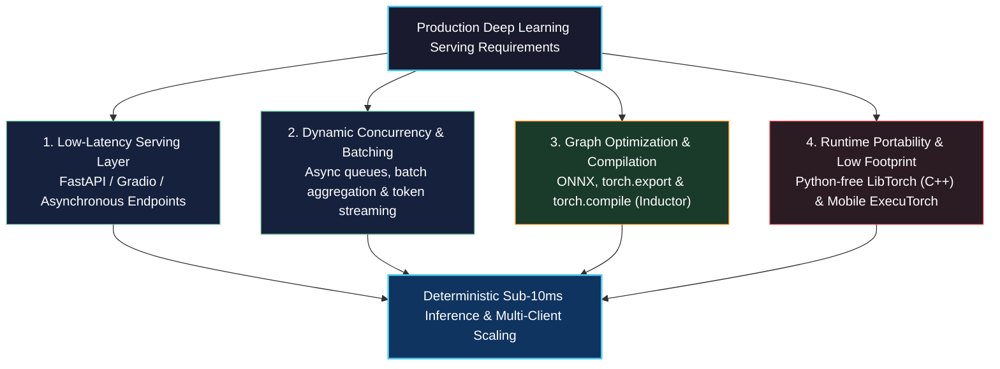
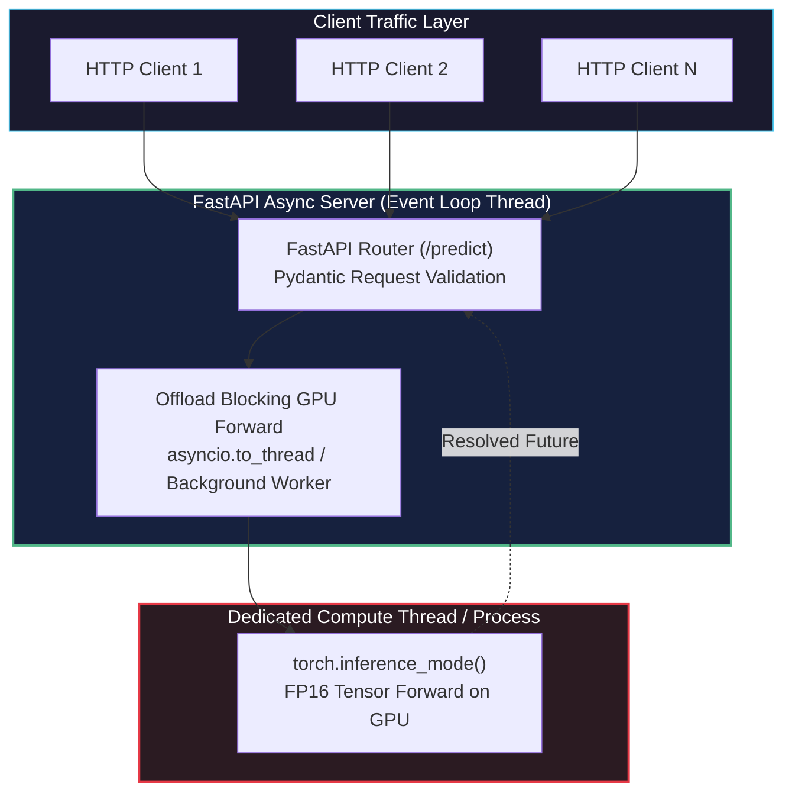
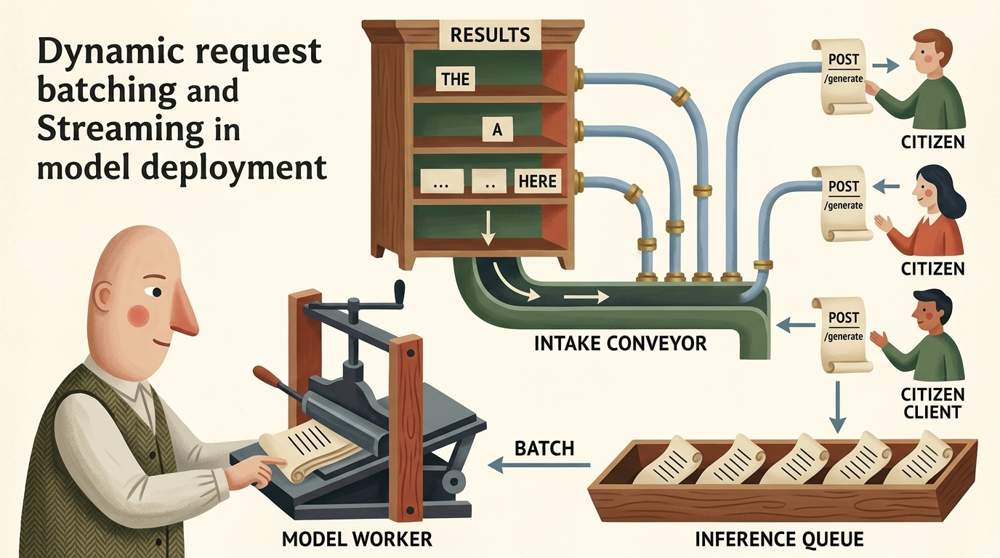
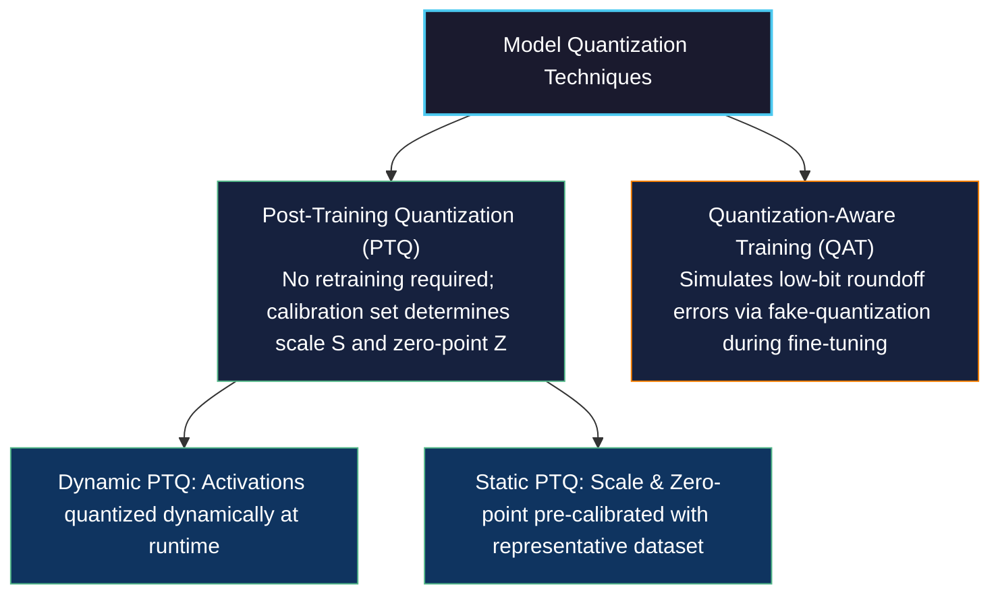
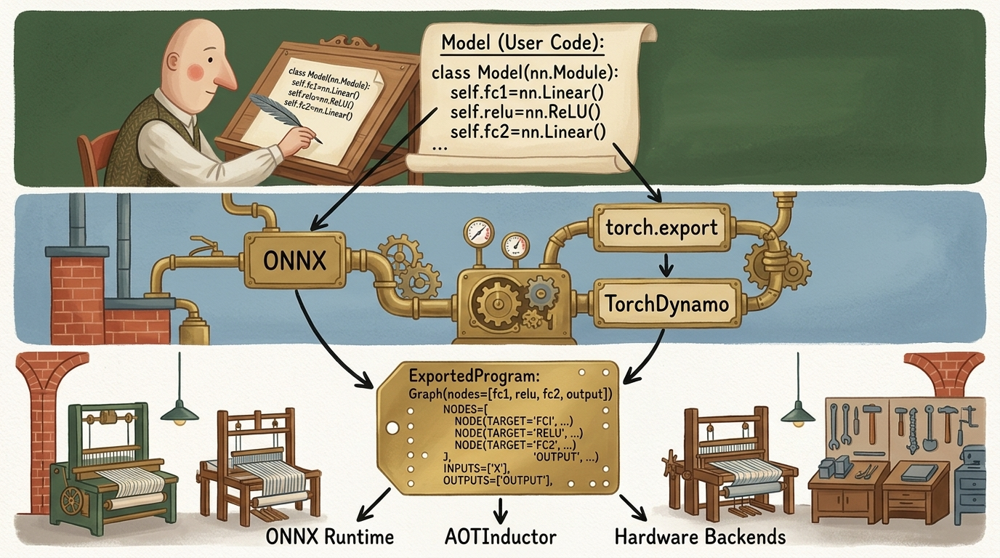
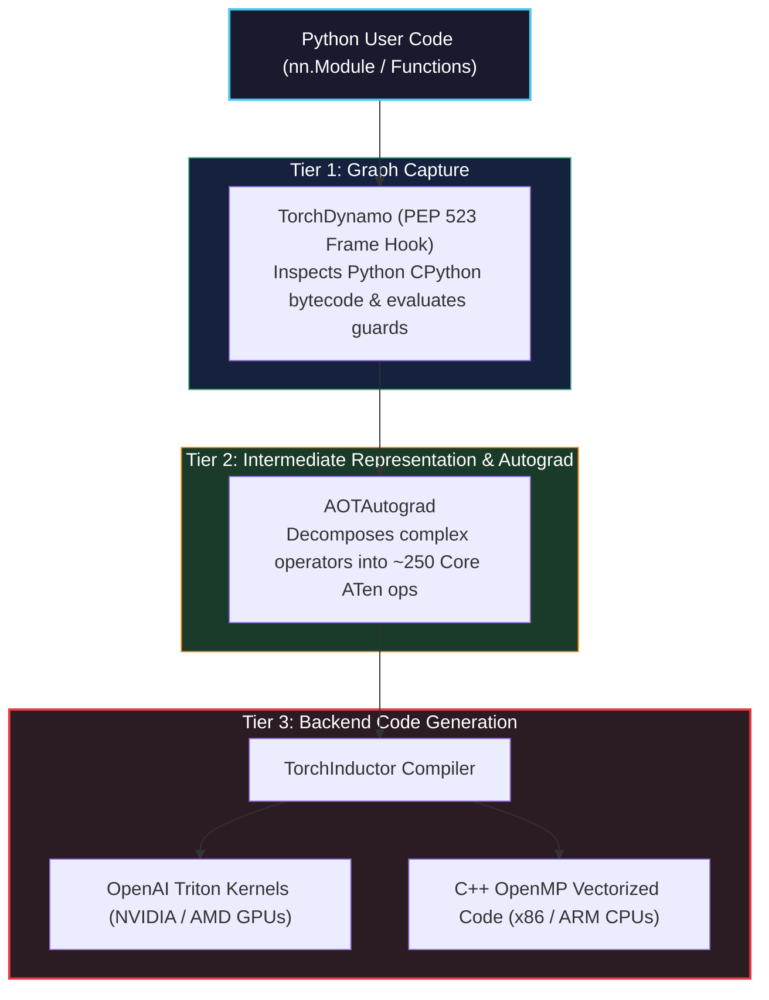
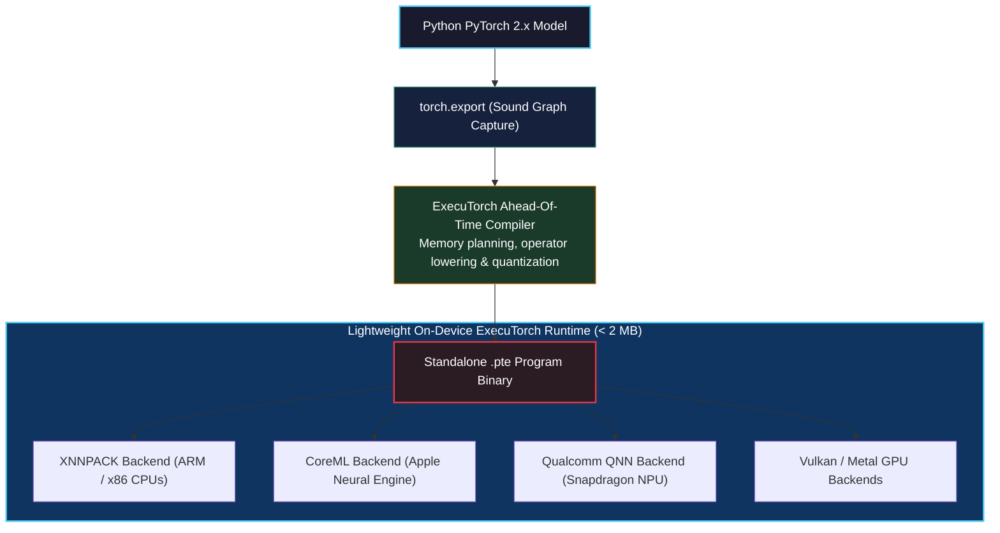
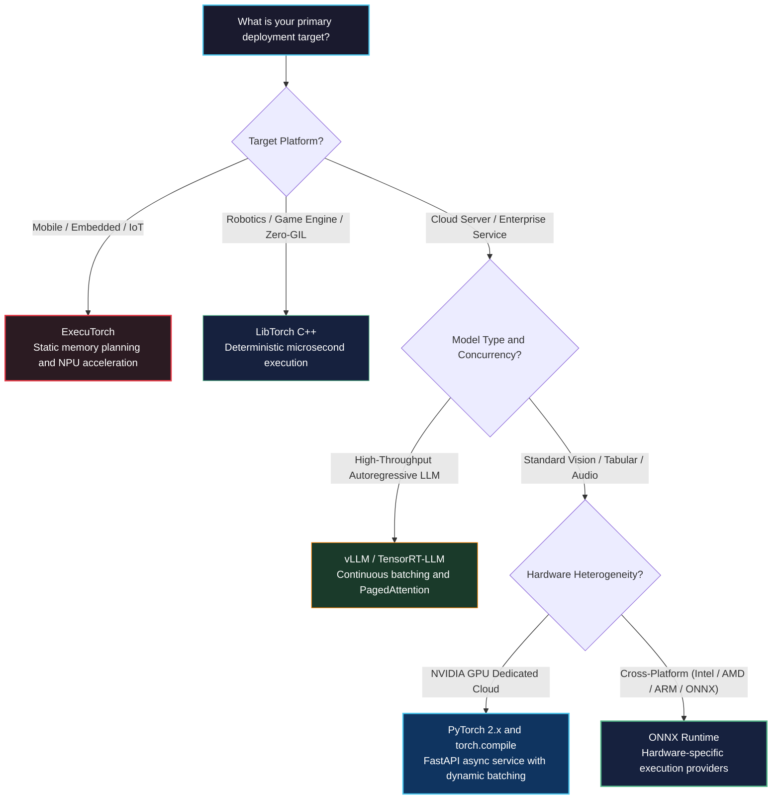

# Deploying to Production

<!-- toc -->

---

## 1. The Production Mandate: Bridging Research and Industrial Deployment

Throughout Part 1 and the preceding chapters of Part 2, our focus centered on architectural design, mathematical modeling, and training mechanics. We built convolutional vision backbones, generative diffusion pipelines, volumetric 3D tumor classification models, semantic segmentation networks, and multi-GPU distributed clusters. In all these workflows, execution occurred within an interactive Python development environment where models ran inside dedicated training loops with full access to autograd dynamic tapes, high-bandwidth accelerator memory, and the Python runtime.

However, moving a trained neural network into **production** requires an entirely different engineering mindset. A production environment imposes strict constraints that do not exist during model research:

1. **Deterministic Latency & Strict SLAs:** Client applications demand responses within strict millisecond bounds. While training can tolerate varying execution times per iteration, a clinical diagnostic API or autonomous robotics loop has a non-negotiable service-level agreement (SLA) on **Time to First Token (TTFT)** or maximum request latency.
2. **High Throughput Under Concurrent Load:** Serving hundreds or thousands of concurrent incoming requests saturates naive sequential inference pipelines. Production systems must aggregate distinct requests dynamically without starving individual users.
3. **Hardware & Runtime Isolation:** Modern production backends often cannot afford the memory footprint, startup time, or single-threaded concurrency limitations imposed by Python's Global Interpreter Lock (GIL). Autonomous mobile agents, automotive microcontrollers, and microsecond-scale trading engines require lightweight, self-contained binaries executing via C++ runtimes or specialized hardware compilers.
4. **Energy, Compute, and Memory Footprint:** Running multi-billion parameter foundation models or large 3D CNNs with full 32-bit floating-point precision on cloud accelerators is economically and thermally prohibitive. Models must be quantized, fused, and compiled to minimize high-bandwidth memory (HBM) bandwidth saturation.



> **Key Insight:** In deep learning production systems, high throughput and low latency are often in direct architectural tension. Maximizing throughput requires aggregating requests into large batches to achieve high arithmetic intensity on GPU tensor cores, whereas minimizing latency demands executing inference immediately upon request arrival. Production engineering is the science of resolving this tension via dynamic batching, asynchronous streaming, and kernel-level graph compilation.

---

## 2. Serving PyTorch Models: Interactive UIs vs. Industrial Microservices

When deploying a trained PyTorch model for inference, engineers select the serving interface based on the target consumer: human evaluators or automated client applications.

### 2.1 Rapid Human-in-the-Loop Evaluation with Gradio

During model development, clinical trials, or user acceptance testing, engineers need an interactive interface where non-technical stakeholders can upload images, adjust parameters via sliders, and immediately inspect network predictions. **Gradio** provides a zero-boilerplate abstraction designed specifically for machine learning models.

The code below initializes a pretrained vision transformer and wraps it in a Gradio user interface that accepts raw image inputs, applies ImageNet normalization transforms, and displays top-5 classification probabilities in real time:

```python
import gradio as gr
import torch
import torchvision.models as models
import torchvision.transforms as transforms
from PIL import Image

# 1. Device configuration and model initialization
device = torch.device("cuda" if torch.cuda.is_available() else "cpu")
model = models.resnet50(weights=models.ResNet50_Weights.DEFAULT)
model.eval().to(device)

# 2. Production preprocessing pipeline
preprocess = transforms.Compose([
    transforms.Resize(256),
    transforms.CenterCrop(224),
    transforms.ToTensor(),
    transforms.Normalize(
        mean=[0.485, 0.456, 0.406],
        std=[0.229, 0.224, 0.225]
    ),
])

def predict_image(image: Image.Image) -> dict:
    # 3. Micro-modular inference action
    tensor = preprocess(image).unsqueeze(0).to(device)
    
    with torch.inference_mode():
        logits = model(tensor)
        probabilities = torch.nn.functional.softmax(logits[0], dim=0)
    
    # 4. Extract top 5 class probabilities
    top5_prob, top5_catid = torch.topk(probabilities, 5)
    categories = models.ResNet50_Weights.DEFAULT.meta["categories"]
    return {categories[cat_id]: float(prob) for prob, cat_id in zip(top5_prob, top5_catid)}

demo = gr.Interface(
    fn=predict_image,
    inputs=gr.Image(type="pil"),
    outputs=gr.Label(num_top_classes=5),
    title="Clinical ResNet-50 Diagnostic Demo",
    description="Interactive evaluation interface for ImageNet classification."
)
```

Gradio is ideal for interactive demos and proof-of-concept testing. However, it is not architected for high-concurrency production microservices where hundreds of external client services make programmatic API calls over HTTP or gRPC.

### 2.2 Industrial Microservice Architecture with FastAPI

For programmatic production deployments, we encapsulate our PyTorch model behind **FastAPI**. FastAPI leverages Python's modern `asyncio` event loop, strict type validation via `Pydantic`, and asynchronous request routing through ASGI (Asynchronous Server Gateway Interface) web servers like `uvicorn`.

The architectural challenge in serving deep learning models inside an asynchronous web server is avoiding **event loop starvation**. Standard PyTorch matrix multiplications (`torch.matmul`) and convolutional forwards are synchronous, CPU/GPU-blocking calls. If a heavy tensor operation runs directly inside an `async def` route on the main event loop thread, the entire web server locks up, unable to accept new network connections or handle health checks.



The code below implements an asynchronous FastAPI server that validates incoming structured requests using Pydantic, offloads tensor computation to a dedicated thread pool to keep the event loop responsive, and returns JSON inference metrics:

```python
import asyncio
from contextlib import asynccontextmanager
from fastapi import FastAPI, HTTPException
from pydantic import BaseModel, Field
import torch
import torchvision.models as models

# 1. Pydantic request and response schemas
class InferenceRequest(BaseModel):
    features: list[float] = Field(..., min_length=10, max_length=10, description="10-element input vector")

class InferenceResponse(BaseModel):
    prediction: list[float]
    device_used: str

# 2. Lifecycle management for global model state
ml_models = {}

@asynccontextmanager
async def lifespan(app: FastAPI):
    # Setup: Allocate GPU model weights during server startup
    dev = torch.device("cuda" if torch.cuda.is_available() else "cpu")
    net = torch.nn.Sequential(
        torch.nn.Linear(10, 64),
        torch.nn.ReLU(),
        torch.nn.Linear(64, 2)
    ).to(dev)
    net.eval()
    ml_models["network"] = net
    ml_models["device"] = dev
    yield
    # Teardown: Cleanly clear CUDA allocations on shutdown
    ml_models.clear()
    if torch.cuda.is_available():
        torch.cuda.empty_cache()

app = FastAPI(lifespan=lifespan)

def compute_forward_sync(raw_data: list[float], model: torch.nn.Module, device: torch.device) -> list[float]:
    # Pure synchronous forward execution isolated from event loop
    with torch.inference_mode():
        x = torch.tensor([raw_data], dtype=torch.float32, device=device)
        logits = model(x)
        probs = torch.nn.functional.softmax(logits, dim=-1)
        return probs[0].tolist()

@app.post("/predict", response_model=InferenceResponse)
async def predict_endpoint(req: InferenceRequest):
    if "network" not in ml_models:
        raise HTTPException(status_code=503, detail="Model is still initializing")
    
    # 3. Offload blocking tensor execution to worker thread
    result = await asyncio.to_thread(
        compute_forward_sync,
        req.features,
        ml_models["network"],
        ml_models["device"]
    )
    return InferenceResponse(prediction=result, device_used=str(ml_models["device"]))
```

---

## 3. Dynamic Request Batching & Token Streaming Architecture

In a production microservice, requests arrive from independent clients at arbitrary timestamps. Processing each request in isolation with a batch size of $B = 1$ underutilizes GPU compute cores, leading to low throughput and high inference cost per query.

<figure style="display:flex; justify-content: center; margin: 25px 0;">
  <div style="text-align: center;">
    
    <figcaption style="margin-top: 0.6em; text-align: center; font-size: 13px; color: #888;"><em>Figure 1: Dynamic request batching and token streaming architecture. Distributed citizen clients submit independent asynchronous generation requests via HTTP POST into an inference queue. A background model worker aggregates queued requests into a single hardware batch, computes forward passes on accelerator cores, and streams incremental token results back to individual client channels.</em></figcaption>
  </div>
</figure>

### 3.1 The Dynamic Batching Mechanism

To maximize accelerator efficiency, production servers implement **Dynamic Batching**. An asynchronous queue collects incoming client requests. A background model worker dequeues requests up to a maximum batch capacity $B\_{\max}$, or triggers early if a maximum queue wait timeout $\tau\_{\text{batch}}$ expires:

$$ B = \min\left( B\_{\max}, \quad \text{queue.size}() \right) \quad \text{when } t - t\_{\text{arrival}} \ge \tau\_{\text{batch}} $$

The overall latency observed by an individual client $L(B)$ is the sum of queuing wait time and GPU execution time:

$$ L(B) = W\_{\text{queue}}(B) + L\_{\text{compute}}(B) $$

While $W\_{\text{queue}}(B)$ increases with larger batch limits, $L\_{\text{compute}}(B)$ scales sub-linearly on GPUs up to hardware saturation, substantially increasing overall system throughput:

$$ \text{Throughput}(B) = \frac{B}{L\_{\text{compute}}(B)} $$

The code below implements an asynchronous dynamic batching server where concurrent client requests are gathered into batches via an `asyncio.Queue`, executed in a single batched tensor forward pass, and their results are resolved back to individual client futures:

```python
import asyncio
from dataclasses import dataclass
from typing import Any
import torch

@dataclass
class QueueItem:
    input_tensor: torch.Tensor
    future: asyncio.Future

class DynamicBatcher:
    def __init__(self, model: torch.nn.Module, max_batch_size: int = 16, max_wait_time: float = 0.005):
        self.model = model
        self.max_batch_size = max_batch_size
        self.max_wait_time = max_wait_time
        self.queue: asyncio.Queue[QueueItem] = asyncio.Queue()
        self.worker_task = asyncio.create_task(self._batch_worker())

    async def predict(self, x: torch.Tensor) -> torch.Tensor:
        # Enqueue request and await dedicated response future
        loop = asyncio.get_running_loop()
        item = QueueItem(input_tensor=x, future=loop.create_future())
        await self.queue.put(item)
        return await item.future

    async def _batch_worker(self):
        while True:
            first_item = await self.queue.get()
            batch = [first_item]
            deadline = asyncio.get_event_loop().time() + self.max_wait_time

            # Accumulate requests until batch size or deadline is reached
            while len(batch) < self.max_batch_size:
                timeout = deadline - asyncio.get_event_loop().time()
                if timeout <= 0:
                    break
                try:
                    item = await asyncio.wait_for(self.queue.get(), timeout=timeout)
                    batch.append(item)
                except asyncio.TimeoutError:
                    break

            # 1. Collate individual tensors into a single hardware batch
            batch_inputs = torch.cat([item.input_tensor for item in batch], dim=0)

            # 2. Execute unified GPU forward pass
            with torch.inference_mode():
                outputs = self.model(batch_inputs)

            # 3. Scatter slices back to corresponding client futures
            for i, item in enumerate(batch):
                item.future.set_result(outputs[i:i+1])
```

### 3.2 Asynchronous Token Streaming with Server-Sent Events (SSE)

For autoregressive large language models or iterative diffusion schedulers, waiting for the entire sequence generation to finish before returning any response ruins the user experience. By streaming individual tokens back to the client as they are sampled, we reduce the perceived latency from the full generation time down to the **Time to First Token (TTFT)**.

In FastAPI, streaming is achieved using `StreamingResponse` wrapping an asynchronous Python generator:

```python
from fastapi.responses import StreamingResponse
import asyncio

async def token_generator(prompt: str):
    # Simulated autoregressive token generation stream
    tokens = ["The", " model", " predicts", " a", " healthy", " tissue", " structure."]
    for token in tokens:
        await asyncio.sleep(0.04)  # Simulate inter-token generation time
        yield f"data: {token}\n\n"

@app.get("/stream-generate")
async def stream_generate(prompt: str):
    return StreamingResponse(
        token_generator(prompt),
        media_type="text/event-stream"
    )
```

---

## 4. Inference Acceleration Techniques: Precision, Quantization, and Memory Layouts

Running models in production with default 32-bit floating point (`torch.float32`) arithmetic wastes compute throughput and exhausts accelerator memory bandwidth.

### 4.1 Reduced Precision: FP16 and BF16

Modern GPU tensor cores (NVIDIA Volta, Ampere, Hopper, Blackwell) achieve orders-of-magnitude higher floating-point throughput when executing half-precision matrix multiplications:

| Floating-Point Format | Sign Bits | Exponent Bits | Mantissa (Fraction) Bits | Dynamic Range ($10^{\pm x}$) | Precision (Decimal Digits) |
| :--- | :--- | :--- | :--- | :--- | :--- |
| **IEEE FP32** | 1 | 8 | 23 | $\approx 10^{\pm 38}$ | $\approx 7.2$ |
| **IEEE FP16** | 1 | 5 | 10 | $\approx 10^{\pm 5}$ | $\approx 3.3$ |
| **Bfloat16 (BF16)** | 1 | 8 | 7 | $\approx 10^{\pm 38}$ | $\approx 2.1$ |

In inference mode, gradients are not computed, which eliminates the need for dynamic loss scaling. Casting model weights to `torch.float16` or `torch.bfloat16` immediately reduces the model's memory footprint by $50\%$ and doubles memory-bandwidth transfer rates:

```python
# Cast model weights to half-precision
model = model.to(device=device, dtype=torch.bfloat16)

# Inference with autocast
with torch.inference_mode():
    with torch.autocast(device_type=device.type, dtype=torch.bfloat16):
        predictions = model(input_tensor.to(dtype=torch.bfloat16))
```

### 4.2 Quantization Spectrum: PTQ vs. QAT

Quantization maps continuous 32-bit or 16-bit floating-point tensors into low-bit discrete integers (typically 8-bit `int8` or 4-bit `int4`):

$$ q = \text{round}\left( \frac{x}{S} \right) + Z $$

where $S \in \mathbb{R}^+$ is the arbitrary scale factor and $Z \in \mathbb{Z}$ is the zero-point offset.



For large language models and vision transformers, 4-bit weight quantization (such as AWQ or GPTQ) and 1-bit binary representations (BitNet $b1.58$) allow billion-parameter models to execute on consumer-grade hardware by drastically lowering HBM memory-bandwidth bottlenecks.

### 4.3 Memory Layout: Channels-Last for Convolutions

By default, PyTorch allocates 4D convolutional image tensors in contiguous **NCHW** order (Batch, Channel, Height, Width). However, modern x86 CPU AVX-512 vector units and NVIDIA Tensor Cores execute convolutions significantly faster when memory is organized in **NHWC** format, referred to in PyTorch as `torch.channels_last`:

```python
# Convert convolutional model and inputs to channels-last layout
model = model.to(memory_format=torch.channels_last)
input_tensor = input_tensor.to(memory_format=torch.channels_last)
```

In `torch.channels_last`, adjacent elements in physical RAM represent different channels of the exact same pixel, enabling hardware vector registers to perform full dot products across the channel dimension with zero strided memory gathers.

---

## 5. Model Graph Capture & Export: From Python Code to Static Graphs

Deploying PyTorch models into high-performance, non-Python environments requires capturing the model's dynamic computational graph into a serialized representation.

<figure style="display:flex; justify-content: center; margin: 25px 0;">
  <div style="text-align: center;">
    
    <figcaption style="margin-top: 0.6em; text-align: center; font-size: 13px; color: #888;"><em>Figure 2: The model export and execution lifecycle. 1. High-level user model code (Python nn.Module). 2. Graph capture and tracing via ONNX and torch.export feeding into TorchDynamo. 3. Lowering to intermediate ExportedProgram representations executed across specialized backends including ONNX Runtime, AOTInductor, and mobile hardware accelerators.</em></figcaption>
  </div>
</figure>

### 5.1 The Evolution: TorchScript vs. Modern `torch.export`

Historically, PyTorch provided **TorchScript** (`torch.jit.trace` and `torch.jit.script`) to serialize models into a Python-independent intermediate format. However, TorchScript suffered from severe limitations:
- `torch.jit.trace` blindly followed a single execution path with dummy inputs, silently ignoring data-dependent `if` conditions and loops.
- `torch.jit.script` attempted to parse a subset of Python syntax into an AST, frequently failing on modern Python idioms, type annotations, and dynamic third-party libraries.

In PyTorch 2.x+, the official graph capture mechanism is **`torch.export`**. Unlike TorchScript, `torch.export`:
1. Produces an exact, sound computational graph representing PyTorch's ATen operator set.
2. Captures dynamic dimensions cleanly using explicit symbolic shapes (`torch.export.Dim`).
3. Guarantees that any unsupported dynamic construct causes an explicit export-time error rather than producing a silently corrupted graph.

The code below exports a multi-layer neural network using `torch.export`, specifying a dynamic batch size dimension so that the exported graph is valid for arbitrary batch inputs at runtime:

```python
import torch

class Classifier(torch.nn.Module):
    def __init__(self):
        super().__init__()
        self.fc1 = torch.nn.Linear(64, 32)
        self.relu = torch.nn.ReLU()
        self.fc2 = torch.nn.Linear(32, 2)

    def forward(self, x: torch.Tensor) -> torch.Tensor:
        return self.fc2(self.relu(self.fc1(x)))

model = Classifier().eval()
sample_input = (torch.randn(1, 64),)

# 1. Define symbolic dynamic dimensions for flexible serving batch sizes
batch_dim = torch.export.Dim("batch_size", min=1, max=128)
dynamic_shapes = {"x": {0: batch_dim}}

# 2. Capture sound graph representation into an ExportedProgram
exported_program: torch.export.ExportedProgram = torch.export.export(
    model,
    args=sample_input,
    dynamic_shapes=dynamic_shapes
)

# Inspect the captured ATen graph nodes
print(exported_program.graph)
```

The resulting `ExportedProgram` is completely self-contained. It stores the mathematical computation graph, parameter buffers, input/output specifications, and validation guards, and can be saved to disk with `torch.export.save(exported_program, "model.pt2")`.

### 5.2 Open Neural Network Exchange (ONNX) and ONNX Runtime

For cross-platform and multi-hardware deployment (e.g. running on Windows DirectML, Intel OpenVINO, or NVIDIA TensorRT without a PyTorch runtime), **ONNX** is the global industry standard.

In modern PyTorch, the ONNX exporter is integrated directly with TorchDynamo via the `torch.onnx.export` API:

```python
import torch

model = Classifier().eval()
dummy_input = torch.randn(1, 64)

# Export directly to ONNX binary format
torch.onnx.export(
    model,
    dummy_input,
    "model.onnx",
    export_params=True,
    opset_version=17,
    do_constant_folding=True,
    input_names=["input"],
    output_names=["output"],
    dynamic_axes={
        "input": {0: "batch_size"},
        "output": {0: "batch_size"}
    }
)
```

Once exported, high-performance C++ runtimes such as **ONNX Runtime** execute the serialized model across heterogenous hardware with hardware-specific execution providers:

```python
import onnxruntime as ort
import numpy as np

# Initialize ONNX Runtime inference session with CUDA acceleration
session = ort.InferenceSession("model.onnx", providers=["CUDAExecutionProvider", "CPUExecutionProvider"])

# Execute inference using standard NumPy buffers
input_name = session.get_inputs()[0].name
output_name = session.get_outputs()[0].name
data = np.random.randn(4, 64).astype(np.float32)

raw_outputs = session.run([output_name], {input_name: data})
```

---

## 6. Deep Dive into `torch.compile` & The Inductor Compiler Engine

Introduced in PyTorch 2.0, `torch.compile` delivers deep compiler-level optimizations while preserving the native, eager-mode Python developer experience. It requires zero code refactoring:

```python
compiled_model = torch.compile(model, mode="max-autotune")
```

Underneath this simple API call lies a sophisticated three-tier compiler subsystem:



### 6.1 The Three Subsystems of `torch.compile`

1. **TorchDynamo (Frontend):** Uses the Python C-API frame evaluation hook (`PEP 523`) to intercept execution before bytecode is executed. It analyzes Python bytecode, extracts pure tensor operations into an FX computational graph, and installs **Guards**. Guards verify that assumptions about tensor dtypes, dimensions, and global variables remain true. If a guard fails at runtime, TorchDynamo falls back to standard Python execution.
2. **AOTAutograd (Middle-tier):** Decomposes thousands of high-level PyTorch APIs into approximately 250 primitive, functional **Core ATen** operations, eliminating side-effects and standardizing mathematical semantics.
3. **TorchInductor (Backend):** The default deep learning compiler for PyTorch. Instead of relying on pre-compiled CUDA kernel libraries (like cuDNN or cuBLAS) for every individual operator, Inductor synthesizes custom **OpenAI Triton** code for GPUs and C++ with SIMD vector extensions for CPUs.

### 6.2 The Power of Operator Fusion (Eliminating the Memory Wall)

Why does `torch.compile` produce dramatic speedups on GPUs?

On modern accelerators, the theoretical compute throughput (TFLOPs) scales far faster than the memory bandwidth between High Bandwidth Memory (HBM/DRAM) and on-chip SRAM caches. In eager PyTorch, evaluating a sequential chain of point-wise operators:

$$ y = \text{GELU}(W x + b) $$

forces the accelerator to:
1. Load $W$ and $x$ from HBM, compute matrix multiplication, and write the intermediate tensor back to HBM.
2. Load the intermediate tensor from HBM into SRAM, add bias $b$, and write the result back to HBM.
3. Load the biased result from HBM into SRAM, compute the non-linear GELU activation, and write the final result back to HBM.

This constant round-tripping across the memory bus saturates memory bandwidth, leaving GPU tensor cores starved for work. **TorchInductor fuses these contiguous operations into a single custom Triton GPU kernel**. The bias addition and GELU activation execute entirely inside GPU registers while the tensor data resides in on-chip SRAM, requiring only a single write-back to main memory.

### 6.3 Diagnosing and Fixing Graph Breaks

A **Graph Break** occurs when TorchDynamo encounters a Python construct that cannot be traced into an FX graph (for example, printing to stdout, invoking an unsupported C-extension, or evaluating a data-dependent conditional statement on tensor elements like `if tensor.item() > 0:`).

When a graph break occurs, TorchDynamo is forced to split the execution into two separate compiled subgraphs, dropping back into the slow Python CPython interpreter in between:

$$\text{Graph 1 (Compiled)} \longrightarrow \text{Python Interpreter Break} \longrightarrow \text{Graph 2 (Compiled)}$$

To diagnose graph breaks in production code, PyTorch provides dedicated diagnostic utilities:

```python
import torch

# Diagnostic tool to explain why graph breaks occur
explanation = torch._dynamo.explain(model, sample_input)
print(f"Graph break count: {explanation.graph_break_count}")
print(f"Break reasons: {explanation.break_reasons}")
```

---

## 7. Execution Profiling with `torch.profiler`

Before optimizing a production service, engineers must profile the running workload to locate the true architectural bottlenecks: is execution compute-bound, memory-bandwidth bound, or dominated by CPU-side framework overheads?

The code below configures `torch.profiler.profile` to capture CPU and CUDA activities, track GPU memory allocations, and export execution traces in Chrome Trace Event format:

```python
import torch
import torchvision.models as models

device = torch.device("cuda" if torch.cuda.is_available() else "cpu")
model = models.resnet18().to(device)
inputs = torch.randn(16, 3, 224, 224, device=device)

# Configure the PyTorch profiler
with torch.profiler.profile(
    activities=[
        torch.profiler.ProfilerActivity.CPU,
        torch.profiler.ProfilerActivity.CUDA,
    ],
    record_shapes=True,
    profile_memory=True,
    with_stack=True
) as prof:
    # Warmup pass
    model(inputs)
    torch.cuda.synchronize() if torch.cuda.is_available() else None

    # Profiling target iteration
    with torch.profiler.record_function("production_inference_forward"):
        outputs = model(inputs)
        torch.cuda.synchronize() if torch.cuda.is_available() else None

# Print top operators sorted by total GPU execution time
print(prof.key_averages().table(sort_by="cuda_time_total", row_limit=10))

# Export complete execution trace for interactive visualization in chrome://tracing or Perfetto
prof.export_chrome_trace("production_profile_trace.json")
```

Inspecting the resulting trace in `chrome://tracing` or Perfetto reveals:
- **GPU Kernel Concurrency:** Whether the GPU is continuously saturated or experiencing bubbles due to CPU scheduling delays.
- **Memory Allocation Spikes:** Memory allocation and deallocation events that trigger expensive CUDA memory allocator locks.
- **Kernel Launch Overhead:** The delay between a CPU dispatch call and the actual start of execution on the GPU stream.

---

## 8. Python-Free Zero-Overhead Serving: LibTorch (C++)

While Python is the preeminent language for deep learning research, high-performance production systems often eliminate Python entirely from the serving path. Environments such as autonomous vehicle control systems, high-frequency trading platforms, robotic systems running ROS 2, and game engines require:
1. **Deterministic Latency:** Complete freedom from Python garbage collection pauses.
2. **True Multithreaded Concurrency:** Total bypass of the Python Global Interpreter Lock (GIL).
3. **Minimal Memory Footprint:** Running lean binaries on systems without a Python runtime or package manager installed.

PyTorch provides **LibTorch**, a pure C++ library containing the complete ATen tensor library and `torch::nn` module interfaces.

### 8.1 Loading and Executing Exported Models in C++

Models exported from Python (via AOTInductor or TorchScript) can be loaded directly inside a C++ application:

```cpp
#include <torch/script.h> // Or torch/all.h for full LibTorch API
#include <iostream>
#include <memory>

int main(int argc, const char* argv[]) {
    if (argc != 2) {
        std::cerr << "Usage: inference_server <path-to-exported-model>\n";
        return -1;
    }

    // 1. Configure target execution device
    torch::DeviceType device_type = torch::cuda::is_available() ? torch::kCUDA : torch::kCPU;
    torch::Device device(device_type);
    std::cout << "Executing inference on: " << (device.is_cuda() ? "CUDA GPU" : "Host CPU") << std::endl;

    // 2. Deserialize model binary from disk into C++ runtime
    torch::jit::script::Module module;
    try {
        module = torch::jit::load(argv[1]);
        module.to(device);
        module.eval();
    } catch (const c10::Error& e) {
        std::cerr << "Fatal error loading model binary: " << e.msg() << std::endl;
        return -1;
    }

    // 3. Create input tensor directly using C++ ATen API
    std::vector<torch::jit::IValue> inputs;
    torch::Tensor input_tensor = torch::randn({1, 3, 224, 224}, device);
    inputs.push_back(input_tensor);

    // 4. Zero-overhead C++ forward execution
    at::Tensor output = module.forward(inputs).toTensor();
    std::cout << "Inference completed successfully. Output shape: " << output.sizes() << std::endl;

    return 0;
}
```

### 8.2 Building with CMake

LibTorch integrates seamlessly with standard C++ build systems using CMake:

```cmake
cmake_minimum_required(VERSION 3.18 FATAL_ERROR)
project(production_inference_service CXX)

set(CMAKE_CXX_STANDARD 17)
find_package(Torch REQUIRED)

add_executable(inference_server main.cpp)
target_link_libraries(inference_server "${TORCH_LIBRARIES}")
set_property(TARGET inference_server PROPERTY CXX_STANDARD 17)
```

By compiling against LibTorch, the resulting native binary runs with zero Python dependency, achieving predictable microsecond-level latency and full integration with C++ multi-threaded thread pools.

---

## 9. Mobile & Edge Deployment: ExecuTorch

Deploying deep learning models to battery-powered, memory-constrained edge hardware (smartphones, IoT sensors, wearable medical devices) requires a radical departure from server-scale runtimes. LibTorch and standard PyTorch runtimes have binary sizes exceeding $50\text{--}100\text{ MB}$ and allocate dynamic memory continuously.

PyTorch 2.x introduces **ExecuTorch**, a modern edge runtime engineered from first principles for on-device AI.



### Key Architectural Pillars of ExecuTorch:

1. **Ultra-Lean Binary Size:** The core ExecuTorch C++ runtime fits within a tiny footprint (under $2\text{ MB}$ stripped), enabling integration into strict mobile apps and embedded firmware.
2. **Zero Dynamic Allocation at Runtime:** ExecuTorch executes an Ahead-Of-Time **Memory Planner** that pre-allocates a static memory arena for all intermediate activations. During inference, zero heap allocations (`malloc` / `new`) occur, eliminating latency jitter and preventing out-of-memory crashes on constrained operating systems.
3. **Hardware Acceleration Backends:** Seamlessly delegates subgraphs to specialized edge processors:
   - **XNNPACK:** Highly optimized SIMD kernels for ARM Cortex-A/M and x86 CPUs.
   - **CoreML:** Direct hardware access to Apple Silicon Neural Engine (ANE).
   - **Qualcomm QNN:** Native acceleration on Snapdragon Hexagon NPUs.

---

## 10. Production Decision Framework: Choosing the Right Deployment Stack

Navigating the landscape of deep learning deployment technologies requires balancing hardware constraints, request concurrency, latency SLAs, and infrastructure complexity.

| Deployment Target | Primary Stack | Strengths | Trade-offs & Limitations | Ideal Use Case |
| :--- | :--- | :--- | :--- | :--- |
| **Interactive Research & HITL** | Gradio / Streamlit | Zero-boilerplate UI, rapid parameter exploration | Single-client focus, high per-request overhead | Medical diagnostic validation, stakeholder demonstrations |
| **Asynchronous Web Microservice** | FastAPI + Uvicorn + Dynamic Batching | Python-native, async concurrency, easy scaling | Python GIL overhead, manual queue tuning required | Mid-scale internal APIs, microservice integrations |
| **High-Throughput Foundation Serving** | Triton Inference Server / vLLM / TGI | PagedAttention, continuous batching, multi-model GPU sharing | Complex Docker orchestration, higher deployment friction | Enterprise LLMs, multi-tenant cloud serving |
| **High-Performance Python Production** | `torch.compile` (Inductor) | Native PyTorch, automatic Triton kernel fusion, zero model rewrite | Initial compilation overhead on startup, potential graph breaks | High-throughput computer vision and NLP model serving |
| **Cross-Platform Enterprise Systems** | ONNX + ONNX Runtime | Broad vendor support (TensorRT, OpenVINO, DirectML), standard format | Export limitations for complex dynamic control flow | Heterogeneous enterprise hardware, legacy C#/Java/Go backends |
| **Zero-Overhead Native Serving** | LibTorch (C++) | Microsecond deterministic latency, no GIL, C++ ecosystem embedding | Requires C++ build tooling, manual memory management | Autonomous vehicles, robotics (ROS 2), game engines |
| **Resource-Constrained Edge & Mobile** | ExecuTorch | Sub-2MB runtime, zero dynamic allocation, NPU/DSP hardware delegates | Limited operator coverage, strict export pipeline | iOS/Android mobile apps, embedded wearables, IoT sensors |

### The Production Architecture Decision Tree



---

## 11. Exercises & Conceptual Verification

To solidify your mastery of deep learning deployment systems, implement solutions to the following engineering challenges:

1. **Dynamic Batching Latency Analysis:**
   - In a production server with maximum batch size $B\_{\max} = 32$ and timeout $\tau\_{\text{batch}} = 10\text{ ms}$, suppose request arrival follows a Poisson distribution with mean arrival rate $\lambda = 500\text{ requests/sec}$.
   - Calculate the average batch size $\mathbb{E}[B]$ formed by the worker.
   - Formulate the expected wait time $W\_{\text{queue}}$ experienced by the first request entering an empty queue.

2. **Benchmarking Eager vs. `torch.compile`:**
   - Take a standard ResNet-50 or Vision Transformer architecture.
   - Profile the forward pass execution time across 100 iterations under eager mode vs. `torch.compile(mode="reduce-overhead")`.
   - Measure the GPU memory bandwidth utilization and identify the specific fused operators generated by TorchInductor.

3. **Diagnosing Graph Breaks:**
   - Construct a custom `nn.Module` containing a Python `print()` statement and a dynamic tensor-dependent slice `x[:x.shape[0] // 2]`.
   - Run `torch._dynamo.explain()` to identify the exact line triggering the graph break.
   - Refactor the module using purely functional tensor operations so that `torch.compile` captures a single unified computational graph without any breaks.

---

## 12. Conclusion & Summary

In this final chapter of Part 2, we completed the journey from neural network theory and distributed training to full-scale production deployment:

- **Serving Paradigms:** We contrasted human-in-the-loop rapid interfaces (Gradio) with high-concurrency asynchronous microservices (FastAPI), establishing patterns to protect the Python asyncio event loop from blocking tensor operations.
- **Dynamic Batching & Streaming:** We analyzed how asynchronous queues aggregate discrete client requests into high-throughput hardware batches, and how Server-Sent Events stream tokens incrementally to minimize Time to First Token (TTFT).
- **Inference Optimization:** We reviewed the precision and quantization spectrum (FP16, BF16, INT8, INT4, 1-bit) and the memory bandwidth advantages of `channels_last` tensor formatting.
- **Modern Graph Export:** We traced the transition from legacy TorchScript to sound, whole-graph capture via `torch.export` and cross-platform execution via ONNX and ONNX Runtime.
- **Compiler Acceleration:** We dissected the three-tier architecture of `torch.compile` (TorchDynamo, AOTAutograd, TorchInductor) and explored how operator fusion overcomes the GPU memory bandwidth wall.
- **Non-Python Runtimes:** We evaluated zero-overhead deterministic C++ serving via LibTorch and lean, zero-allocation mobile deployment via ExecuTorch.

With these production foundations established, you possess the full-stack engineering toolkit to design, train, scale, compile, and deploy state-of-the-art deep learning systems across any industrial computing infrastructure.
