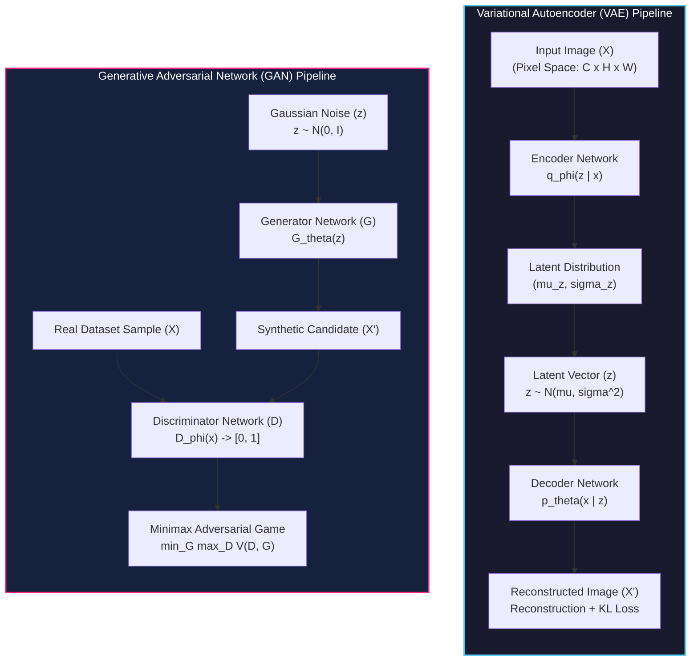
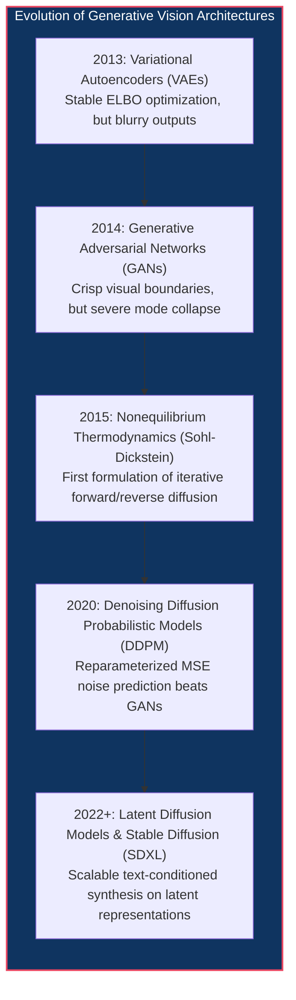
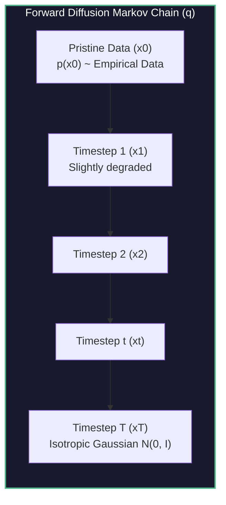
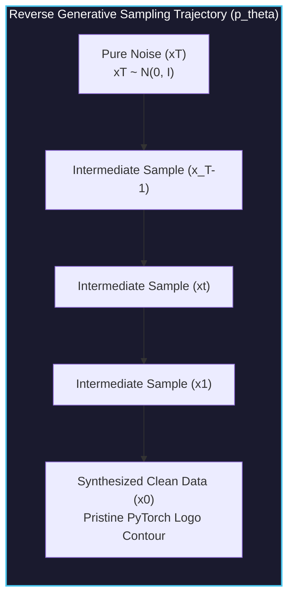

# Diffusion Models for Images

<!-- toc -->

<div style="margin-bottom: 20px;">
  <a href="https://colab.research.google.com/github/emreaslan7/ai/blob/main/notebooks/deep-learning-with-pytorch/10-diffusion-models-for-images.ipynb" target="_blank">
    
  </a>
</div>

---

## 1. The Generative Vision Paradigm: From VAEs and GANs to Diffusion

Generative artificial intelligence in computer vision seeks to solve a fundamentally inverse problem: given a high-dimensional collection of real-world observations (images), how can an algorithm model the true underlying probability distribution $p\_{\text{data}}(\mathbf{x})$ such that drawing a new sample produces a novel, visually coherent, and physically plausible scene?

In the preceding chapter on sequence modeling and transformers, tokens exhibited sequential dependencies where probability distributions factorized autoregressively across one-dimensional timelines:

$$ p(\mathbf{w}) = \prod\_{i=1}^N p(w\_i \mid w\_1, w\_2, \dots, w\_{i-1}) $$

Image generation defies trivial autoregressive ordering. An image $\mathbf{x} \in \mathbb{R}^{C \times H \times W}$ is an array of spatially correlated pixels where local patches, semantic boundaries, global illumination, and high-frequency textures exert mutual, non-causal constraints simultaneously in two-dimensional space. Historically, two generative paradigms dominated image synthesis prior to the advent of diffusion: **Variational Autoencoders (VAEs)** and **Generative Adversarial Networks (GANs)**.



### 1.1 Variational Autoencoders (VAEs)

Introduced by Kingma and Welling in late 2013, the **Variational Autoencoder (VAE)** formulates generation as probabilistic latent-variable inference. An encoder network $q\_\phi(\mathbf{z} \mid \mathbf{x})$ maps high-dimensional pixels into parameters of a multivariate Gaussian distribution over an unobserved low-dimensional latent space $\mathbf{z} \in \mathbb{R}^d$:

$$ q\_\phi(\mathbf{z} \mid \mathbf{x}) = \mathcal{N}\left(\mathbf{z};\, \boldsymbol{\mu}\_\phi(\mathbf{x}),\, \operatorname{diag}(\boldsymbol{\sigma}\_\phi^2(\mathbf{x}))\right) $$

A decoder network $p\_\theta(\mathbf{x} \mid \mathbf{z})$ reconstructs the input image from a stochastic sample drawn via the reparameterization trick $\mathbf{z} = \boldsymbol{\mu} + \boldsymbol{\sigma} \odot \boldsymbol{\epsilon}$, where $\boldsymbol{\epsilon} \sim \mathcal{N}(\mathbf{0}, \mathbf{I})$. Training optimizes the Evidence Lower Bound (ELBO):

$$ \log p(\mathbf{x}) \ge \mathbb{E}\_{q\_\phi(\mathbf{z} \mid \mathbf{x})}\left[\log p\_\theta(\mathbf{x} \mid \mathbf{z})\right] - D\_{\text{KL}}\left(q\_\phi(\mathbf{z} \mid \mathbf{x}) \parallel p(\mathbf{z})\right) $$

To synthesize brand-new imagery, the encoder is discarded: random vector $\mathbf{z} \sim \mathcal{N}(\mathbf{0}, \mathbf{I})$ is passed directly into the decoder. While theoretically elegant and stable to train, VAEs suffer from a well-documented flaw: reconstructed and sampled images frequently exhibit blurriness and lack sharp textural fidelity because the pixel-wise mean squared error (MSE) or Gaussian log-likelihood rewards averaging over ambiguous high-frequency configurations.

### 1.2 Generative Adversarial Networks (GANs)

In 2014, Goodfellow et al. introduced **Generative Adversarial Networks (GANs)**, bypassing explicit density estimation entirely in favor of a two-player zero-sum minimax game:

$$ \min\_G \max\_D V(D, G) = \mathbb{E}\_{\mathbf{x} \sim p\_{\text{data}}(\mathbf{x})}\left[\log D(\mathbf{x})\right] + \mathbb{E}\_{\mathbf{z} \sim p\_{\mathbf{z}}(\mathbf{z})}\left[\log(1 - D(G(\mathbf{z})))\right] $$

The **Generator** $G\_\theta$ maps random noise $\mathbf{z} \sim \mathcal{N}(\mathbf{0}, \mathbf{I})$ into synthetic images $G(\mathbf{z})$. The **Discriminator** $D\_\phi$ acts as a binary classifier, determining whether a given image originated from the authentic empirical dataset or the generator's synthetic distribution.

Through simultaneous gradient updates, GANs produce breathtakingly crisp, photorealistic edges. However, their training dynamics are notoriously fragile:
1. **Mode Collapse:** The generator discovers a minuscule subset of plausible visual outputs that reliably deceive the discriminator, completely ignoring the rich variety of the real distribution.
2. **Vanishing Gradients & Nash Equilibrium Instability:** When the discriminator achieves near-perfect classification early in training, gradients driving generator optimization vanish or oscillate wildly.

<figure style="display:flex; justify-content: center; margin: 25px 0;">
  <div style="text-align: center;">
    
    <figcaption style="margin-top: 0.6em; text-align: center; font-size: 13px; color: #888;"><em>Figure 10.1: Architectural paradigms of VAEs and GANs. Top: VAEs compress data through an encoder into a regularized latent space and decode it back. Bottom: GANs pit an artisanal generator against a forensic discriminator in an adversarial game.</em></figcaption>
  </div>
</figure>

---

## 2. The Modern Diffusion Revolution (DALL-E & Stable Diffusion)

In 2015, Jascha Sohl-Dickstein et al. (*Deep Unsupervised Learning Using Nonequilibrium Thermodynamics*) proposed a radically different approach inspired by physical diffusion. Rather than attempting to map arbitrary noise to an image in a single monolithic forward pass (as in GANs), they proposed systematically destroying data structure through a slow, progressive degradation process, and subsequently training a deep neural network to reverse that degradation step by step.

While initially overshadowed by GANs, diffusion models experienced an exponential breakthrough between 2020 and 2022 following Jonathan Ho, Ajay Jain, and Pieter Abbeel's landmark paper, **Denoising Diffusion Probabilistic Models (DDPM)**. Ho et al. showed that with reparameterized objectives and U-Net backbones, diffusion models systematically outperform GANs in visual sample fidelity and sample diversity without adversarial instability.

Commercial systems rapidly materialized:
- **DALL-E 2 (OpenAI):** Scaled conditional diffusion for high-fidelity cross-modal text-to-image synthesis.
- **Stable Diffusion / SDXL (CompVis, Runway, Stability AI):** Latent Diffusion Models (LDMs) that project diffusion onto low-dimensional autoencoded latent manifolds, enabling real-time, desktop-class generation of 1024x1024 photorealistic imagery.



---

## 3. Core Working Principle: Diffusion in Three Stages

The foundational engineering paradigm behind generative diffusion models decomposes into three distinct phases:

1. **Forward Process (Systematic Perturbation):** Starting from clean empirical data ($\mathbf{x}\_0$), we inject small, controlled increments of Gaussian noise across discrete timesteps ($t = 1, \dots, T$). After sufficient degradation steps (e.g., $T = 1000$), the original structural information is entirely erased, yielding pure isotropic Gaussian noise ($\mathbf{x}\_T \sim \mathcal{N}(\mathbf{0}, \mathbf{I})$).
2. **Training Phase (Noise Estimation):** A deep neural network is trained to observe a perturbed sample $\mathbf{x}\_t$ at any arbitrary timestep $t$ and answer a single question: **"What was the exact noise vector $\boldsymbol{\epsilon}$ injected into this state?"** Rather than attempting to predict the clean high-dimensional image directly, the network predicts the additive noise perturbation.
3. **Reverse Sampling Phase (Generative Synthesis):** To synthesize novel data from scratch, we sample pure noise from a standard normal distribution ($\mathbf{x}\_T$). The trained network iteratively estimates and subtracts the noise perturbation step by step ($t = T \to 0$). As noise is progressively removed, pristine, coherent visual data emerges from initial entropy.

<figure style="display:flex; justify-content: center; margin: 25px 0;">
  <div style="text-align: center;">
    
    <figcaption style="margin-top: 0.6em; text-align: center; font-size: 13px; color: #888;"><em>Figure 10.2: The forward and reverse diffusion processes. Top: Progressively injecting Gaussian perturbations until clean data dissolves into pure isotropic noise. Bottom: A learned neural network iteratively estimates and removes noise to reconstruct structured visual form from chaos.</em></figcaption>
  </div>
</figure>

---

## 4. Pedagogical Setup: 2D Point Cloud Contour (PyTorch Logo)

To build intuition without the multi-gigabyte memory overhead and lengthy training cycles of 2D convolutional networks over ImageNet, this chapter begins by modeling a two-dimensional geometric manifold: the outline coordinates of the **PyTorch Logo**.

An arbitrary image $\mathbf{x} \in \mathbb{R}^{H \times W \times C}$ is simply a collection of localized scalar measurements. Similarly, a 2D contour is a set of $N$ coordinate pairs $\mathbf{x} = (p\_0, p\_1) \in \mathbb{R}^2$. Applying diffusion to 2D coordinates demonstrates every single mathematical identity, variance schedule, noise calculation, closed-form jump, and sampling algorithm identically to high-resolution diffusion models like SDXL.

### 4.1 Extracting 2D Contour Coordinates from Logo Image

Before executing diffusion, we extract boundary points from the official PyTorch logo image. The logo can be downloaded directly from a high-resolution transparent PNG URL, resized to $256 \times 256$, and contour points extracted via edge filtering or alpha masking:

```python
import io
import urllib.request
import numpy as np
import torch
import torch.nn as nn
import torch.nn.functional as F
import matplotlib.pyplot as plt
from PIL import Image, ImageFilter

# Action 1: Set device and deterministic seed for reproducible geometry
device = torch.device("cuda" if torch.cuda.is_available() else "cpu")
torch.manual_seed(42)
np.random.seed(42)
print(f"Active Compute Device: {device}")
```

We define an extraction utility that loads the logo image from an online URL or local file, resizes it to $256 \times 256$, identifies opaque boundary edges using Sobel/edge filtering, centers the coordinates at the origin $(0, 0)$, and normalizes their variance to unit scale ($1.0$):

```python
# Action 2: Define image/URL to 2D point extraction utility
def load_pytorch_logo_points(
    source="https://res.cloudinary.com/startup-grind/image/upload/c_fill,w_500,h_500,g_center/c_fill,dpr_2.0,f_auto,g_center,q_auto:good/v1/gcs/platform-data-linuxhq/events/PyTorch_Symbol_01_OrangeOnTransparent_nUWxXkQ.png",
    num_points=3000,
    target_size=(256, 256),
):
    """
    Downloads or loads a PyTorch logo PNG, resizes to target_size (256x256),
    extracts visual edge contours, and normalizes points to zero mean & unit variance.
    """
    try:
        if source.startswith("http://") or source.startswith("https://"):
            req = urllib.request.Request(source, headers={"User-Agent": "Mozilla/5.0"})
            with urllib.request.urlopen(req, timeout=10) as resp:
                img_bytes = resp.read()
            img = Image.open(io.BytesIO(img_bytes)).convert("RGBA")
        else:
            img = Image.open(source).convert("RGBA")
    except Exception as err:
        print(f"URL loading failed ({err}). Generating parametric fallback logo...")
        # Parametric synthetic fallback (flame & ring)
        theta = np.linspace(0, 2 * np.pi, int(num_points * 0.65), endpoint=False)
        ring_x, ring_y = 1.8 * np.cos(theta), 1.8 * np.sin(theta)
        flame_pts = int(num_points * 0.35)
        flame_x = np.concatenate([np.linspace(-0.5, 0.5, flame_pts // 2), np.zeros(flame_pts - flame_pts // 2)])
        flame_y = np.concatenate([np.linspace(-1.0, 1.2, flame_pts // 2), np.linspace(0.2, 1.5, flame_pts - flame_pts // 2)])
        coords = np.stack([np.concatenate([ring_x, flame_x]), np.concatenate([ring_y, flame_y])], axis=1).astype(np.float32)
        coords -= coords.mean(axis=0, keepdims=True)
        coords /= coords.std()
        return torch.tensor(coords, dtype=torch.float32)

    # Resize to specified dimensions (256 x 256)
    img = img.resize(target_size, Image.Resampling.LANCZOS)
    
    # Extract edge contours using Sobel/FIND_EDGES filter
    gray = img.convert("L")
    edges = gray.filter(ImageFilter.FIND_EDGES)
    edge_array = np.array(edges)
    
    # Locate coordinates where edge intensity exceeds threshold
    y_indices, x_indices = np.where(edge_array > 40)
    total_found = len(x_indices)
    
    # If edge detection yields few points, fall back to alpha mask pixels
    if total_found < 500:
        alpha = np.array(img)[:, :, 3]
        y_indices, x_indices = np.where(alpha > 50)
        total_found = len(x_indices)
        
    chosen_indices = np.random.choice(total_found, num_points, replace=(total_found < num_points))
    x_pts = x_indices[chosen_indices].astype(np.float32)
    y_pts = -y_indices[chosen_indices].astype(np.float32) # Invert Y to match Cartesian plane
    
    coords = np.stack([x_pts, y_pts], axis=1)
    coords -= coords.mean(axis=0, keepdims=True)
    coords /= np.std(coords) # Unit variance normalization
    return torch.tensor(coords, dtype=torch.float32)
```

When visual contours are loaded and converted into a PyTorch floating-point tensor, the dataset tensor $\mathbf{x}\_0$ exhibits shape $(N, 2)$:

```python
# Action 3: Load PyTorch logo points (from URL / local file) into PyTorch tensor
LOGO_URL = "https://res.cloudinary.com/startup-grind/image/upload/c_fill,w_500,h_500,g_center/c_fill,dpr_2.0,f_auto,g_center,q_auto:good/v1/gcs/platform-data-linuxhq/events/PyTorch_Symbol_01_OrangeOnTransparent_nUWxXkQ.png"
x0 = load_pytorch_logo_points(source=LOGO_URL, num_points=3000, target_size=(256, 256))
print(f"Dataset x0 Tensor Shape: {x0.shape} | Mean: {x0.mean():.4f} | Std: {x0.std():.4f}")
```

<figure style="display:flex; justify-content: center; margin: 25px 0;">
  <div style="text-align: center;">
    
    <figcaption style="margin-top: 0.6em; text-align: center; font-size: 13px; color: #888;"><em>Figure 10.4: Pristine data coordinates $\mathbf{x}\_0$ extracted directly from the official PyTorch logo PNG (resized to $256 \times 256$), tracing the outer flame and circular ring normalized to zero mean and unit variance.</em></figcaption>
  </div>
</figure>

---

## 5. The Forward Diffusion Process: Systematic Destruction of Data

The **forward diffusion process** (also termed the *noising process*) gradually adds synthetic Gaussian perturbations to the ground-truth data $\mathbf{x}\_0$ over a discrete sequence of $T$ timesteps, producing a trajectory of increasingly noisy latent variables $\mathbf{x}\_1, \mathbf{x}\_2, \dots, \mathbf{x}\_T$.



### 5.1 Step-by-Step Markovian Perturbation

The forward process is modeled as a Markov chain where each transition $q(\mathbf{x}\_t \mid \mathbf{x}\_{t-1})$ depends solely on the immediately preceding state $\mathbf{x}\_{t-1}$. Each step injects a small amount of Gaussian noise controlled by a scalar variance parameter $\beta\_t \in (0, 1)$:

$$ q(\mathbf{x}\_t \mid \mathbf{x}\_{t-1}) = \mathcal{N}\left(\mathbf{x}\_t;\, \sqrt{1 - \beta\_t}\,\mathbf{x}\_{t-1},\, \beta\_t \mathbf{I}\right) $$

Notice the critical scaling factor $\sqrt{1 - \beta\_t}$ applied to the mean. Why is this scaling term necessary?
If we simply added noise without scaling down the prior data ($\mathbf{x}\_t = \mathbf{x}\_{t-1} + \sqrt{\beta\_t}\boldsymbol{\epsilon}$), the variance of $\mathbf{x}\_t$ would grow unboundedly with each timestep ($\operatorname{Var}(\mathbf{x}\_t) = \operatorname{Var}(\mathbf{x}\_{t-1}) + \beta\_t$). By weighting the prior state by $\sqrt{1 - \beta\_t}$, the total variance is preserved at unit scale across all steps:

$$ \operatorname{Var}(\mathbf{x}\_t) = (1 - \beta\_t)\operatorname{Var}(\mathbf{x}\_{t-1}) + \beta\_t \operatorname{Var}(\boldsymbol{\epsilon}) = (1 - \beta\_t)(1) + \beta\_t(1) = 1 $$

### 5.2 Variance Schedules: Linear Beta Schedule

The sequence $\beta\_1, \beta\_2, \dots, \beta\_T$ is determined by a predefined **noise schedule**. In this chapter, we use a standard linear schedule starting from $\beta\_1 = 10^{-4}$ and increasing linearly to $\beta\_T = 0.02$ across $T = 1000$ timesteps:

$$ \beta\_t = \beta\_1 + \frac{t - 1}{T - 1}(\beta\_T - \beta\_1) $$

```python
# Action 1: Construct the linear beta variance schedule
def linear_beta_schedule(timesteps=1000, start=0.0001, end=0.02):
    """
    Generates a linearly spaced 1D tensor of beta values controlling
    the variance of injected noise across discrete timesteps.
    """
    return torch.linspace(start, end, timesteps)

T = 1000
betas = linear_beta_schedule(timesteps=T)
print(f"Beta Schedule: beta_0 = {betas[0]:.6f} | beta_500 = {betas[500]:.6f} | beta_999 = {betas[-1]:.6f}")
```

Applying this transition iteratively for one step:

```python
# Action 2: Single-step Markovian forward perturbation
def diffuse_single_step(points, beta):
    """
    Applies one discrete step of Markovian Gaussian diffusion q(x_t | x_{t-1}).
    """
    # Scale down prior state
    new_mean = torch.sqrt(1.0 - beta) * points
    # Sample standard normal noise
    noise = torch.randn_like(points)
    # Scale perturbation by sqrt(beta)
    perturbation = torch.sqrt(beta) * noise
    return new_mean + perturbation, noise
```

### 5.3 Closed-Form Analytical Jump: Eliminating Iterative Loops

If training a neural network required executing a sequential loop of 800 forward steps just to compute the noisy state $\mathbf{x}\_{800}$ for an image, backpropagation would be impossibly slow and memory-prohibitive.

Remarkably, because the sum of independent Gaussian random variables is itself Gaussian, the entire chain $q(\mathbf{x}\_1 \mid \mathbf{x}\_0) \dots q(\mathbf{x}\_t \mid \mathbf{x}\_{t-1})$ can be collapsed into a **closed-form analytical jump** that calculates $\mathbf{x}\_t$ directly from $\mathbf{x}\_0$ in a single operation.

Let $\alpha\_t = 1 - \beta\_t$, and define the cumulative product:

$$ \bar{\alpha}\_t = \prod\_{s=1}^t \alpha\_s $$

Let us expand $\mathbf{x}\_t$ recursively using reparameterized noise terms $\boldsymbol{\epsilon}\_0, \boldsymbol{\epsilon}\_1, \dots \sim \mathcal{N}(\mathbf{0}, \mathbf{I})$:

$$ \mathbf{x}\_t = \sqrt{\alpha\_t}\mathbf{x}\_{t-1} + \sqrt{1 - \alpha\_t}\boldsymbol{\epsilon}\_{t-1} $$

Substitute $\mathbf{x}\_{t-1} = \sqrt{\alpha\_{t-1}}\mathbf{x}\_{t-2} + \sqrt{1 - \alpha\_{t-1}}\boldsymbol{\epsilon}\_{t-2}$:

$$ \mathbf{x}\_t = \sqrt{\alpha\_t}\left(\sqrt{\alpha\_{t-1}}\mathbf{x}\_{t-2} + \sqrt{1 - \alpha\_{t-1}}\boldsymbol{\epsilon}\_{t-2}\right) + \sqrt{1 - \alpha\_t}\boldsymbol{\epsilon}\_{t-1} $$
$$ \mathbf{x}\_t = \sqrt{\alpha\_t \alpha\_{t-1}}\mathbf{x}\_{t-2} + \sqrt{\alpha\_t(1 - \alpha\_{t-1})}\boldsymbol{\epsilon}\_{t-2} + \sqrt{1 - \alpha\_t}\boldsymbol{\epsilon}\_{t-1} $$

The two Gaussian noise terms $\sqrt{\alpha\_t(1 - \alpha\_{t-1})}\boldsymbol{\epsilon}\_{t-2}$ and $\sqrt{1 - \alpha\_t}\boldsymbol{\epsilon}\_{t-1}$ are independent. Recall that for independent Gaussians $\mathcal{N}(\mathbf{0}, \sigma\_1^2 \mathbf{I}) + \mathcal{N}(\mathbf{0}, \sigma\_2^2 \mathbf{I}) \sim \mathcal{N}(\mathbf{0}, (\sigma\_1^2 + \sigma\_2^2)\mathbf{I})$. Summing their variances:

$$ \alpha\_t(1 - \alpha\_{t-1}) + (1 - \alpha\_t) = \alpha\_t - \alpha\_t \alpha\_{t-1} + 1 - \alpha\_t = 1 - \alpha\_t \alpha\_{t-1} $$

Thus, the two noise terms collapse into a single standard Gaussian $\sqrt{1 - \alpha\_t \alpha\_{t-1}}\bar{\boldsymbol{\epsilon}}$. Unrolling this induction all the way to $\mathbf{x}\_0$:

$$ \mathbf{x}\_t = \sqrt{\bar{\alpha}\_t}\mathbf{x}\_0 + \sqrt{1 - \bar{\alpha}\_t}\boldsymbol{\epsilon}, \quad \text{where } \boldsymbol{\epsilon} \sim \mathcal{N}(\mathbf{0}, \mathbf{I}) $$

$$ q(\mathbf{x}\_t \mid \mathbf{x}\_0) = \mathcal{N}\left(\mathbf{x}\_t;\, \sqrt{\bar{\alpha}\_t}\mathbf{x}\_0,\, (1 - \bar{\alpha}\_t)\mathbf{I}\right) $$

#### Practical Anatomy of the Closed-Form Equation
This formula directly balances two complementary components:
- $\sqrt{\bar{\alpha}\_t}\mathbf{x}\_0$: **Original Signal Contribution.** As timestep $t$ increases, cumulative product $\bar{\alpha}\_t \to 0$, diminishing the weight of pristine data $\mathbf{x}\_0$.
- $\sqrt{1 - \bar{\alpha}\_t}\boldsymbol{\epsilon}$: **Injected Noise Contribution.** As $t$ increases, $1 - \bar{\alpha}\_t \to 1$, making random noise increasingly dominant.
- Because the sum of their squared coefficients $(\sqrt{\bar{\alpha}\_t})^2 + (\sqrt{1 - \bar{\alpha}\_t})^2 = \bar{\alpha}\_t + 1 - \bar{\alpha}\_t = 1$, the total variance remains preserved at exactly $1.0$ across all timesteps.

> **Key Insight:** At any arbitrary timestep $t \in [1, T]$, we can sample noisy state $\mathbf{x}\_t$ directly in $\mathcal{O}(1)$ time without traversing intermediate timesteps $1, 2, \dots, t-1$. During training, this allows instantaneous sampling of arbitrary noise levels for any training batch.

### 5.4 PyTorch Implementation of the Closed-Form Forward Sampler

We precompute $\alpha\_t$, $\bar{\alpha}\_t$, $\sqrt{\bar{\alpha}\_t}$, and $\sqrt{1 - \bar{\alpha}\_t}$ on the appropriate device:

```python
# Action 1: Precompute analytical diffusion coefficients
alphas = 1.0 - betas
alphas_cumprod = torch.cumprod(alphas, dim=0)
alphas_cumprod_prev = F.pad(alphas_cumprod[:-1], (1, 0), value=1.0)

sqrt_alphas_cumprod = torch.sqrt(alphas_cumprod)
sqrt_one_minus_alphas_cumprod = torch.sqrt(1.0 - alphas_cumprod)

# Action 2: Helper method for broadcasting 1D schedule values into N-D tensor shapes
def reshape_for_x(a, x):
    """
    Extracts the values of 1D tensor `a` indexed by timestep, and reshapes it
    to match the dimensionality of `x` with trailing singleton dimensions for broadcasting.
    """
    batch_size = x.shape[0]
    ones_to_broadcast = len(x.shape) - 1
    return a.view(batch_size, *([1] * ones_to_broadcast)).to(x.device)

# Action 3: Closed-form single-step forward sampling function
def forward_diffusion_sample(x0, t, device=device):
    """
    Samples x_t ~ q(x_t | x_0) in closed form using precomputed cumulative variance terms.
    Returns noisy tensor x_t and the exact ground-truth noise epsilon injected.
    """
    x0 = x0.to(device)
    noise = torch.randn_like(x0)
    
    # Extract coefficients for the specified batch of timesteps
    sqrt_alpha_bar = reshape_for_x(sqrt_alphas_cumprod[t], x0)
    sqrt_one_minus_alpha_bar = reshape_for_x(sqrt_one_minus_alphas_cumprod[t], x0)
    
    # Analytical linear combination
    xt = sqrt_alpha_bar * x0 + sqrt_one_minus_alpha_bar * noise
    return xt, noise
```

<figure style="display:flex; justify-content: center; margin: 25px 0;">
  <div style="text-align: center;">
    
    <figcaption style="margin-top: 0.6em; text-align: center; font-size: 13px; color: #888;"><em>Figure 10.5: Analytical closed-form forward diffusion degradation across timesteps $t \in [0, 100, 250, 500, 750, 999]$. By $t = 999$, the PyTorch logo point structure is entirely dissolved into isotropic Gaussian noise $\mathcal{N}(\mathbf{0}, \mathbf{I})$.</em></figcaption>
  </div>
</figure>

---

## 6. Learning to Reverse the Arrow of Time: Model Architecture & Training

### 6.1 Objective: Estimating Injected Noise

To generate data, we must invert the forward process: given noisy state $\mathbf{x}\_t$, we want to determine the previous, less-noisy state $\mathbf{x}\_{t-1}$.

One might intuitively suppose our neural network should directly predict the clean image $\mathbf{x}\_0$ from $\mathbf{x}\_t$. However, Ho et al. (2020) demonstrated that parameterizing the network to predict the **injected Gaussian noise vector $\boldsymbol{\epsilon}$** produces far superior empirical stability.

#### Why Predict the Noise Instead of the Image?
1. **Stationary Distribution Target:** Ground-truth training images exhibit complex, multimodal, and diverse distributions. In contrast, the noise vector $\boldsymbol{\epsilon}$ always follows a fixed, symmetric standard normal distribution ($\mathcal{N}(\mathbf{0}, \mathbf{I})$) with zero mean and unit variance. Optimizing a neural network to predict values drawn from a standardized distribution stabilizes gradient dynamics.
2. **Instant Algebraic Recovery:** Once the model predicts noise $\boldsymbol{\epsilon}\_\theta(\mathbf{x}\_t, t)$, an estimate of clean data $\mathbf{x}\_0$ is recovered instantaneously through elementary algebra:

$$ \hat{\mathbf{x}}\_0 = \frac{\mathbf{x}\_t - \sqrt{1 - \bar{\alpha}\_t}\boldsymbol{\epsilon}\_\theta(\mathbf{x}\_t, t)}{\sqrt{\bar{\alpha}\_t}} $$

### 6.2 Sinusoidal Positional Embeddings

Because a single neural network must denoise inputs across all stages of degradation—from subtle noise at $t=1$ to near-pure entropy at $t=999$—the model must know **what time $t$ it is operating on**.

Passing a raw scalar $t \in [0, 999]$ directly into a linear layer performs poorly because deep networks struggle to learn high-frequency harmonic dependencies from raw unnormalized scalars. Instead, we use **sinusoidal positional embeddings** (Vaswani et al., 2017), which project scalar inputs across geometric frequency bands:

$$ \text{PE}(t, 2i) = \sin\left(\frac{t}{10000^{2i / d}}\right), \quad \text{PE}(t, 2i+1) = \cos\left(\frac{t}{10000^{2i / d}}\right) $$

```python
# Action 1: Sinusoidal Positional Embedding Module
class SinusoidalEmbedding(nn.Module):
    """
    Transforms continuous 1D coordinates or discrete timesteps into
    high-dimensional sinusoidal representations across geometrically spaced frequencies.
    """
    def __init__(self, dim):
        super().__init__()
        self.dim = dim
        assert dim % 2 == 0, "Embedding dimension must be even."

    def forward(self, x):
        device = x.device
        half_dim = self.dim // 2
        # Precompute frequency scaling factors: 10000^(-2i / d)
        emb_scale = torch.log(torch.tensor(10000.0, device=device)) / (half_dim - 1)
        freqs = torch.exp(torch.arange(half_dim, device=device, dtype=torch.float32) * -emb_scale)
        
        # Outer product of inputs with frequencies
        args = x.view(-1, 1) * freqs.view(1, -1)
        embedding = torch.cat([torch.sin(args), torch.cos(args)], dim=-1)
        return embedding

    def __len__(self):
        return self.dim
```

### 6.3 The Denoising MLP Network Architecture

Our denoising architecture takes two coordinate inputs $(p\_0, p\_1)$ and timestep $t$. Each input is projected into a 128-dimensional sinusoidal feature representation, concatenated into a 384-dimensional feature vector, and passed through a three-layer Multi-Layer Perceptron (MLP) with ReLU non-linearities to output predicted noise $(\hat{\epsilon}\_0, \hat{\epsilon}\_1) \in \mathbb{R}^2$:

<figure style="display:flex; justify-content: center; margin: 25px 0;">
  <div style="text-align: center;">
    
    <figcaption style="margin-top: 0.6em; text-align: center; font-size: 13px; color: #888;"><em>Figure 10.3: Denoising model architecture. Continuous 2D coordinates (p0, p1) and timestep t are embedded via sinusoidal projection modules, merged, and processed through dense linear layers to predict the exact 2D noise perturbation.</em></figcaption>
  </div>
</figure>

```python
# Action 2: Denoising Neural Network with Sinusoidal Projections
class DenoisingModel(nn.Module):
    """
    Predicts the noise perturbation epsilon injected into 2D coordinates at timestep t.
    """
    def __init__(self, hidden_dim=128, num_layers=3):
        super().__init__()
        # Embeddings for x-coord, y-coord, and time
        self.pos1_mlp = SinusoidalEmbedding(hidden_dim)
        self.pos2_mlp = SinusoidalEmbedding(hidden_dim)
        self.time_mlp = SinusoidalEmbedding(hidden_dim)
        
        concat_dim = hidden_dim * 3
        
        # Construct dense residual MLP backbone
        layers = [nn.Linear(concat_dim, hidden_dim), nn.ReLU()]
        for _ in range(num_layers):
            layers.extend([nn.Linear(hidden_dim, hidden_dim), nn.ReLU()])
        # Final projection back to 2D noise coordinate space
        layers.append(nn.Linear(hidden_dim, 2))
        
        self.joint_mlp = nn.Sequential(*layers)

    def forward(self, x, t):
        # x has shape (B, 2) where column 0 is p0 and column 1 is p1
        x1_emb = self.pos1_mlp(x[:, 0])
        x2_emb = self.pos2_mlp(x[:, 1])
        t_emb = self.time_mlp(t.float())
        
        # Concatenate multi-modal spatial and temporal representations
        joint_features = torch.cat([x1_emb, x2_emb, t_emb], dim=-1)
        predicted_noise = self.joint_mlp(joint_features)
        return predicted_noise
```

### 6.4 The Simplified Training Objective ($L\_{\text{simple}}$)

Ho et al. proved that variational bound optimization simplifies into an unweighted Mean Squared Error (MSE) loss measuring the distance between true injected noise $\boldsymbol{\epsilon}$ and network prediction $\boldsymbol{\epsilon}\_\theta(\mathbf{x}\_t, t)$:

$$ L\_{\text{simple}}(\theta) = \mathbb{E}\_{t, \mathbf{x}\_0, \boldsymbol{\epsilon}} \left[ \left\Vert \boldsymbol{\epsilon} - \boldsymbol{\epsilon}\_\theta\left(\sqrt{\bar{\alpha}\_t}\mathbf{x}\_0 + \sqrt{1 - \bar{\alpha}\_t}\boldsymbol{\epsilon},\, t\right) \right\Vert^2 \right] $$

```python
# Action 3: Loss calculation function
def get_loss(model, x0, t, device=device):
    """
    Computes L_simple(theta): MSE loss between actual injected noise and network estimate.
    """
    xt, true_noise = forward_diffusion_sample(x0, t, device=device)
    predicted_noise = model(xt, t)
    return F.mse_loss(predicted_noise, true_noise)
```

### 6.5 The Complete Training Loop

In each optimization step, we draw an empirical batch $\mathbf{x}\_0$, independently sample a random integer timestep $t \sim \operatorname{Uniform}(\{0, 1, \dots, T-1\})$ for each sample, compute closed-form noisy samples $\mathbf{x}\_t$, and backpropagate the MSE loss:

```python
# Action 4: Instantiate model, optimizer, and execute training loop
model = DenoisingModel(hidden_dim=128, num_layers=3).to(device)
optimizer = torch.optim.Adam(model.parameters(), lr=0.001)

def train_diffusion(model, optimizer, x_data, num_epochs=5000, batch_size=512):
    model.train()
    num_samples = x_data.shape[0]
    
    for epoch in range(1, num_epochs + 1):
        # Sample random mini-batch of 2D contour points
        indices = torch.randint(0, num_samples, (batch_size,))
        batch_x0 = x_data[indices].to(device)
        
        # Sample random discrete timesteps uniformly across [0, T-1]
        batch_t = torch.randint(0, T, (batch_size,), device=device)
        
        optimizer.zero_grad()
        loss = get_loss(model, batch_x0, batch_t, device=device)
        loss.backward()
        optimizer.step()
        
        if epoch % 1000 == 0 or epoch == 1:
            print(f"Epoch {epoch:5d} / {num_epochs} | Denoising MSE Loss: {loss.item():.6f}")

# Execute training (5000 epochs completes in seconds on modern GPUs)
train_diffusion(model, optimizer, x0, num_epochs=5000)
```

---

## 7. Reversing the Diffusion Process: The DDPM Sampling Algorithm

### 7.1 Why Reverse Sampling Cannot Jump in a Single Step

While the **forward process** allows instantaneous closed-form evaluation from $\mathbf{x}\_0$ to $\mathbf{x}\_t$, the **reverse generative process** $p\_\theta(\mathbf{x}\_{t-1} \mid \mathbf{x}\_t)$ requires iterative, step-by-step ancestral sampling from $t = T$ down to $t = 0$.

Why can we not take pure noise $\mathbf{x}\_T \sim \mathcal{N}(\mathbf{0}, \mathbf{I})$ and jump directly to $\mathbf{x}\_0$ in one shot?
Because predicting $\mathbf{x}\_0$ from pure Gaussian noise in a single step is an ill-posed multimodal problem: millions of distinct real images are equally consistent with a given noise realization. Attempting a single-step inversion yields a blurry average over all possible modes (analogous to blurry VAE outputs). Iterative sampling allows the stochastic Markov trajectory to gradually collapse ambiguity, choosing a specific mode and progressively synthesizing fine details.

### 7.2 The Analytical Reverse Transition Formulation

From Bayes' rule conditioned on $\mathbf{x}\_0$, the true posterior transition $q(\mathbf{x}\_{t-1} \mid \mathbf{x}\_t, \mathbf{x}\_0)$ is Gaussian:

$$ q(\mathbf{x}\_{t-1} \mid \mathbf{x}\_t, \mathbf{x}\_0) = \mathcal{N}\left(\mathbf{x}\_{t-1};\, \tilde{\boldsymbol{\mu}}\_t(\mathbf{x}\_t, \mathbf{x}\_0),\, \tilde{\beta}\_t \mathbf{I}\right) $$

where the posterior variance $\tilde{\beta}\_t$ is:

$$ \tilde{\beta}\_t = \frac{1 - \bar{\alpha}\_{t-1}}{1 - \bar{\alpha}\_t} \beta\_t $$

Substituting the model's prediction $\boldsymbol{\epsilon}\_\theta(\mathbf{x}\_t, t)$ for true noise $\boldsymbol{\epsilon}$, the estimated posterior mean becomes:

$$ \boldsymbol{\mu}\_\theta(\mathbf{x}\_t, t) = \frac{1}{\sqrt{\alpha\_t}} \left( \mathbf{x}\_t - \frac{\beta\_t}{\sqrt{1 - \bar{\alpha}\_t}} \boldsymbol{\epsilon}\_\theta(\mathbf{x}\_t, t) \right) $$

To sample state $\mathbf{x}\_{t-1}$ from state $\mathbf{x}\_t$:

$$ \mathbf{x}\_{t-1} = \frac{1}{\sqrt{\alpha\_t}} \left( \mathbf{x}\_t - \frac{\beta\_t}{\sqrt{1 - \bar{\alpha}\_t}} \boldsymbol{\epsilon}\_\theta(\mathbf{x}\_t, t) \right) + \sigma\_t \mathbf{z} $$

#### Mechanics of the Reverse Step Equation
1. **Noise Subtraction:** The predicted noise vector $\boldsymbol{\epsilon}\_\theta$ is weighted and subtracted from current state $\mathbf{x}\_t$ ($\mathbf{x}\_t - \dots \boldsymbol{\epsilon}\_\theta$).
2. **Rescaling:** The remaining signal is scaled up by $1 / \sqrt{\alpha\_t}$ to maintain unit variance balance.
3. **Stochastic Annealing ($\sigma\_t \mathbf{z}$):** For all steps $t > 1$, a tiny injection of fresh Gaussian noise ($\mathbf{z} \sim \mathcal{N}(\mathbf{0}, \mathbf{I})$) prevents mode collapse and allows the trajectory to explore rich details. At terminal step $t = 0$, this stochastic term is zeroed ($\mathbf{z} = \mathbf{0}$) to yield a pristine, deterministic reconstructed output.



### 7.3 Step-by-Step Reconstruction from Pure Gaussian Noise

We implement the reverse sampling function and iterate backwards from $T-1$ down to 0:

```python
# Action 1: Precompute posterior variance terms
sqrt_recip_alphas = torch.sqrt(1.0 / alphas)
posterior_variance = betas * (1.0 - alphas_cumprod_prev) / (1.0 - alphas_cumprod)

# Action 2: Single-step reverse sampling function
@torch.no_grad()
def sample_timestep(model, x, t):
    """
    Computes reverse transition p_theta(x_{t-1} | x_t) given current noisy state x
    and current discrete timestep tensor t.
    """
    betas_t = reshape_for_x(betas[t], x)
    sqrt_one_minus_alpha_bar_t = reshape_for_x(sqrt_one_minus_alphas_cumprod[t], x)
    sqrt_recip_alpha_t = reshape_for_x(sqrt_recip_alphas[t], x)
    
    # Model mean estimation: Ho et al. Eq. 11
    model_mean = sqrt_recip_alpha_t * (
        x - (betas_t * model(x, t) / sqrt_one_minus_alpha_bar_t)
    )
    
    # Terminal step t=0 does not add noise
    if t[0] == 0:
        return model_mean
    else:
        posterior_var_t = reshape_for_x(posterior_variance[t], x)
        z = torch.randn_like(x)
        return model_mean + torch.sqrt(posterior_var_t) * z

# Action 3: Multi-step ancestral sampling loop
@torch.no_grad()
def generate_samples(model, num_points=2000):
    model.eval()
    # Step 1: Start with pure isotropic Gaussian noise
    current_x = torch.randn(num_points, 2, device=device)
    
    trajectory = {}
    save_timesteps = [999, 750, 500, 250, 100, 0]
    
    # Step 2: Traverse backwards from T-1 down to 0
    for i in reversed(range(T)):
        t = torch.full((num_points,), i, dtype=torch.long, device=device)
        current_x = sample_timestep(model, current_x, t)
        
        if i in save_timesteps:
            trajectory[i] = current_x.cpu().numpy()
            
    return current_x.cpu().numpy(), trajectory

reconstructed_logo, sampling_trajectory = generate_samples(model)
print("Generative reverse reconstruction complete!")
```

When visual inspection is conducted across $t = 999 \to 0$, the points begin as a chaotic circular cloud centered at $(0, 0)$ and gradually coalesce into the sharp flame and outer ring of the PyTorch logo.

<figure style="display:flex; justify-content: center; margin: 25px 0;">
  <div style="text-align: center;">
    
    <figcaption style="margin-top: 0.6em; text-align: center; font-size: 13px; color: #888;"><em>Figure 10.6: Generative DDPM reverse reconstruction trajectory from pure random noise ($t=999$) to reconstructed PyTorch logo ($t=0$). The denoising MLP progressively subtracts predicted Gaussian perturbations at each ancestral timestep, restoring fine geometric boundaries.</em></figcaption>
  </div>
</figure>

---

## 8. Scaling from 2D Points to Real-World Images (U-Net & Latent Diffusion)

Having mastered diffusion on 2D coordinates, how do these identical equations scale to high-resolution image synthesis?

### 8.1 2D Convolutional U-Net Architecture

For natural images $\mathbf{x} \in \mathbb{R}^{B \times C \times H \times W}$, the linear MLP is replaced with a **2D Convolutional U-Net** backbone:
1. **Contracting (Encoder) Path:** Successive residual convolutional blocks downsample spatial resolution via strided convolutions while increasing channel dimensionality (e.g., $64 \to 128 \to 256 \to 512$).
2. **Bottleneck with Self-Attention:** Multi-Head Self-Attention layers compute global spatial dependencies at low spatial resolutions.
3. **Expanding (Decoder) Path:** Successive transposed convolutions or nearest-neighbor upsamplings restore spatial dimensions, assisted by **Skip Connections** that concatenate high-resolution feature maps directly from encoder stages.
4. **Time & Text Conditioning:** Timestep $t$ is projected via sinusoidal embeddings followed by MLPs and injected into every ResNet block via scale-and-shift Adaptive Group Normalization (`AdaGN`):

$$ \text{AdaGN}(\mathbf{h}, t) = \mathbf{w}(t) \odot \left[\frac{\mathbf{h} - \mu}{\sigma}\right] + \mathbf{b}(t) $$

### 8.2 Latent Diffusion Models (LDMs / Stable Diffusion)

Direct pixel-space diffusion on $1024 \times 1024$ images requires astronomical computational resources because high-frequency pixel details require large tensor footprints.

**Latent Diffusion Models (LDMs)** solve this by decomposing generation into two stages:
1. **Perceptual Compression (Autoencoder):** A pretrained VAE encoder compresses high-resolution images $\mathbf{x} \in \mathbb{R}^{3 \times 512 \times 512}$ by an 8x factor into a compact latent space $\mathbf{z} = \mathcal{E}(\mathbf{x}) \in \mathbb{R}^{4 \times 64 \times 64}$.
2. **Latent Space Diffusion:** Diffusion operates entirely within the low-dimensional latent space $\mathbf{z}$.
3. **Cross-Attention Conditioning:** Text prompts are encoded via CLIP / OpenCLIP text encoders and fused into the U-Net via Cross-Attention layers:

$$ \operatorname{Attention}(\mathbf{Q}, \mathbf{K}, \mathbf{V}) = \operatorname{softmax}\left(\frac{\mathbf{Q}\mathbf{K}^T}{\sqrt{d\_k}}\right)\mathbf{V} $$

where queries $\mathbf{Q}$ are projected from spatial latent features and keys/values $(\mathbf{K}, \mathbf{V})$ are projected from token embeddings.

---

## 9. Exercises & Complete Analytical Solutions

### Question 1: Fundamental Paradigm Differences
*What are the core mathematical and operational differences between VAEs, GANs, and Diffusion Models for image synthesis?*

**Solution:**
- **VAEs:** Maximize the Evidence Lower Bound (ELBO) using an encoder-decoder architecture. The latent space is explicitly regularized toward $\mathcal{N}(\mathbf{0}, \mathbf{I})$ via KL divergence. They offer fast, single-pass sampling and smooth latent interpolation, but produce blurry images due to pixel-wise MSE/Gaussian likelihood objectives.
- **GANs:** Optimize an implicit minimax zero-sum game between a Generator and Discriminator without computing likelihoods. They achieve sharp boundaries in a single forward pass, but suffer from mode collapse, training instability, and lack full distribution coverage.
- **Diffusion Models:** Formulate generation as reversing a forward Markov chain that systematically adds Gaussian noise. They optimize a convex, stable MSE loss ($\left\Vert \boldsymbol{\epsilon} - \boldsymbol{\epsilon}\_\theta \right\Vert^2$) across all noise levels, achieving superior distribution diversity and sample fidelity without adversarial fragility. Their trade-off is inference latency due to iterative multi-step sampling.

### Question 2: Point Coordinates vs. Image Pixels
*How does adding noise to 2D coordinates $(p\_0, p\_1)$ mathematically compare to injecting noise into RGB image pixels $\mathbf{x} \in \mathbb{R}^{3 \times H \times W}$?*

**Solution:**
The mathematical operations are identical. In both cases, the data is represented as a tensor of continuous real-valued floats. The closed-form jump $\mathbf{x}\_t = \sqrt{\bar{\alpha}\_t}\mathbf{x}\_0 + \sqrt{1 - \bar{\alpha}\_t}\boldsymbol{\epsilon}$ operates element-wise across each tensor entry, whether the shape is $(N, 2)$ or $(B, 3, H, W)$. The only difference lies in the network architecture used to predict $\boldsymbol{\epsilon}$: 2D points use simple MLPs with sinusoidal coordinate embeddings, whereas images utilize 2D convolutional U-Nets with spatial receptive fields and self-attention.

### Question 3: Noise Schedule Dynamics
*Why must $\beta\_t$ remain small ($\beta\_1 = 10^{-4}$), and what happens if a constant schedule $\beta\_t = 0.1$ is used instead?*

**Solution:**
The reverse step approximation $p\_\theta(\mathbf{x}\_{t-1} \mid \mathbf{x}\_t) \approx q(\mathbf{x}\_{t-1} \mid \mathbf{x}\_t)$ mathematically assumes that each forward transition $q(\mathbf{x}\_t \mid \mathbf{x}\_{t-1})$ is a tiny perturbation such that the true reverse distribution remains Gaussian. If $\beta\_t$ is excessively large (e.g., $0.1$ from step 1), the local Gaussian assumption breaks down, the model cannot distinguish intermediate structural scales, and reverse trajectory integration diverges into garbage artifacts.

### Question 4: Accelerating Diffusion Sampling
*Why is standard DDPM slow during inference, and how do modern frameworks (such as DDIM or SDXL-Lightning) overcome this limitation?*

**Solution:**
Standard DDPM requires $T \approx 1000$ sequential evaluations of the neural network to sample a single image because each step takes a microscopic reverse Markov jump. Modern techniques accelerate this:
1. **DDIM (Denoising Diffusion Implicit Models):** Replaces the stochastic Markov chain with a non-Markovian deterministic ODE solver that skips intermediate timesteps, generating high-quality samples in 20–50 steps.
2. **Flow Matching & Consistency Models (SDXL-Lightning / FLUX):** Train models to map any point along the trajectory directly to the clean distribution or integrate continuous-time velocity fields, reducing sampling to 1–4 inference steps.

---

## 10. Chapter Summary & Key Takeaways

- **Generative Vision Goal:** Image synthesis models the true underlying data distribution $p\_{\text{data}}(\mathbf{x})$ to sample novel, coherent visual scenes.
- **Predecessor Architectures:** VAEs maximize the ELBO via latent autoencoding (yielding stable but blurry images); GANs pit generator against discriminator in a minimax game (producing sharp images vulnerable to mode collapse).
- **Physical Analogy:** Diffusion models reverse a physical noising process, progressively destroying data structure into standard Gaussian entropy ($\mathcal{N}(\mathbf{0}, \mathbf{I})$) and learning to reconstruct it step by step.
- **Forward Closed-Form Expression:** Using $\alpha\_t = 1 - \beta\_t$ and cumulative product $\bar{\alpha}\_t = \prod\_{s=1}^t \alpha\_s$, any noisy state $\mathbf{x}\_t$ is sampled in $\mathcal{O}(1)$ time via:
  $$ \mathbf{x}\_t = \sqrt{\bar{\alpha}\_t}\mathbf{x}\_0 + \sqrt{1 - \bar{\alpha}\_t}\boldsymbol{\epsilon} $$
- **Training Objective ($L\_{\text{simple}}$):** The neural network $\boldsymbol{\epsilon}\_\theta(\mathbf{x}\_t, t)$ is trained via unweighted Mean Squared Error (MSE) to predict the injected noise vector:
  $$ L\_{\text{simple}}(\theta) = \mathbb{E}\_{t, \mathbf{x}\_0, \boldsymbol{\epsilon}}\left[ \left\Vert \boldsymbol{\epsilon} - \boldsymbol{\epsilon}\_\theta(\mathbf{x}\_t, t) \right\Vert^2 \right] $$
- **Sinusoidal Embeddings:** Multi-scale trigonometric embeddings inject critical continuous time and coordinate parameters into linear layers and ResNet blocks.
- **Reverse Sampling:** Ancestral sampling iteratively denoises pure Gaussian noise from $t=T$ to $t=0$, reconstructing crisp geometric and pixel structures from chaos.
- **Industry Scale:** Foundation models (DALL-E, Stable Diffusion, SDXL) leverage 2D Convolutional U-Nets, Latent Autoencoders (LDMs), and Cross-Attention to generate photorealistic imagery from natural language prompts.
