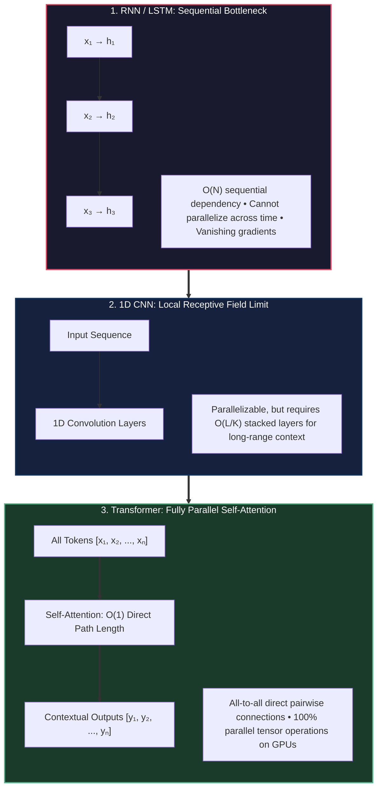
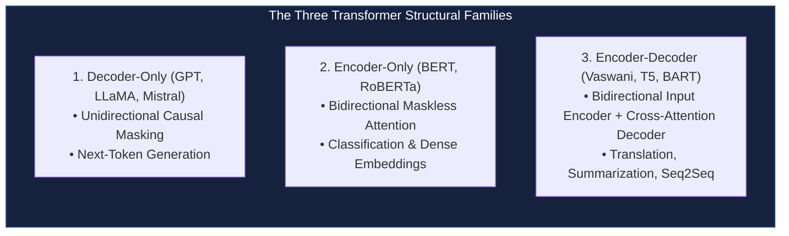

# How Transformers Work

<!-- toc -->

<div style="margin-bottom: 20px;">
  <a href="https://colab.research.google.com/github/emreaslan7/ai/blob/main/notebooks/deep-learning-with-pytorch/09-how-transformers-work.ipynb" target="_blank">
    
  </a>
</div>

## 1. The Architectural Paradigm Shift to Transformers

Before the advent of the Transformer architecture ([Vaswani et al., 2017](https://arxiv.org/abs/1706.03762)), deep learning architectures for sequence modeling were overwhelmingly dominated by **Recurrent Neural Networks (RNNs)**, Long Short-Term Memory networks (**LSTMs**), and Gated Recurrent Units (**GRUs**). While these models naturally captured temporal sequences through a recurrent hidden state $h_t = f(h_{t-1}, x_t)$, they suffered from two catastrophic structural bottlenecks:

1. **The Sequential Execution Bottleneck ($O(N)$ Computational Path):** Because $h_t$ strictly depends on $h_{t-1}$, forward and backward passes cannot be parallelized across the time dimension. Compute clusters packed with thousands of GPU cores sit idling, constrained by sequential memory transfers.
2. **Gradient Attenuation Across Temporal Distance:** Information passing across long token spans decays exponentially or explodes ($W_{hh}^T$ repeated multiplications), limiting effective historical context to a few dozen steps despite gating mechanisms.

Convolutional Neural Networks (CNNs) alleviated the parallelization issue by computing local 1D convolutions across the sequence simultaneously. However, a standard 1D CNN with kernel size $K$ has a fixed local receptive field; capturing dependencies between tokens separated by distance $L$ requires stacking $O(L / K)$ convolutional layers (or $O(\log L)$ with dilated convolutions).



The Transformer eliminated recurrence and convolutions entirely, replacing them with **Self-Attention**. Every token interacts directly with every other token in the sequence in a single layer ($O(1)$ path length), and the entire computation maps cleanly to dense matrix multiplications perfectly suited for modern Tensor Cores.

---

## 2. A Motivating Example: Generating Names Character by Character

To master Transformer mechanics from first principles without drowning in linguistic abstraction, we begin with a foundational generative modeling task: building an autoregressive model that learns the statistical structure of human names and generates novel, plausible names character by character.

### 2.1 Vocabulary Construction & Tokenization

Every natural language processing pipeline begins with a discrete symbol alphabet termed a **Vocabulary** ($\mathcal{V}$). In our character-level model, $\mathcal{V}$ consists of:
- The 26 lowercase English characters: `'a'` through `'z'`.
- A dedicated sentinel boundary character: `'$'`. The sentinel serves a dual operational role: it acts both as a *Start-of-Sequence (SOS)* prompt signaling the model to begin generating, and as an *End-of-Sequence (EOS)* token signaling that name generation is complete.

<figure style="display:flex; justify-content: center; margin: 25px 0;">
  <div style="text-align: center;">
    
    <figcaption style="margin-top: 0.6em; text-align: center; font-size: 13px; color: #888;"><em>Figure 9.1: The character-level generative pipeline. The vocabulary maps discrete characters to token IDs, forming sequences like ['$', 'j', 'o', 'h'] fed into the model to predict the next token 'n'.</em></figcaption>
  </div>
</figure>

Mathematically, tokenization is a bijective mapping between discrete characters and zero-indexed contiguous integers:

$$ \text{stoi}: c \in \mathcal{V} \mapsto i \in \{0, 1, \dots, |\mathcal{V}|-1\} $$

$$ \text{itos}: i \in \{0, 1, \dots, |\mathcal{V}|-1\} \mapsto c \in \mathcal{V} $$

Let us implement this foundational tokenizer in PyTorch:

```python
import torch
import torch.nn as nn
import torch.nn.functional as F

# Define full character alphabet and special sequence boundary sentinel
special_char = '$'
alphabet = [chr(i) for i in range(ord('a'), ord('z') + 1)]
vocab = [special_char] + alphabet

# Construct bidirectional mapping dictionaries
stoi = {char: idx for idx, char in enumerate(vocab)}
itos = {idx: char for idx, char in enumerate(vocab)}

vocab_size = len(vocab)
print(f"Vocabulary Size: {vocab_size} (Indices: 0 to {vocab_size - 1})")
print(f"Example encoding: 'john' -> {[stoi[c] for c in '$john$']}")
```

### 2.2 Autoregressive Causal Factorization

Given an ordered sequence of discrete tokens $\mathbf{x} = (x_1, x_2, \dots, x_T)$, the joint probability distribution $P(\mathbf{x})$ can be rigorously decomposed using the probability chain rule:

$$ P(x_1, x_2, \dots, x_T) = \prod_{t=1}^T P(x_t \mid x_1, x_2, \dots, x_{t-1}) = \prod_{t=1}^T P(x_t \mid x_{<t}) $$

The goal of our generative model is to approximate the true conditional probability distribution $P(x_t \mid x_{<t})$ over all possible vocabulary tokens at each step $t$, parameterizing it as a neural network $P_\theta(x_t \mid x_{<t})$.

---

## 3. Self-Supervised Learning & Limits of the Bigram Model

Before implementing multi-head self-attention, we evaluate the baseline statistical model: the **Bigram Language Model**.

### 3.1 Self-Supervised Paradigm

Self-supervised learning eliminates the requirement for expensive human annotations. The raw input data itself provides both the training inputs and the training supervision targets:
- Given any input string, such as `"$sada$"`, the network receives prefix sub-windows as inputs and is tasked with predicting the immediate subsequent token as the ground-truth label.
- The supervisor is simply the subsequent character already present in the unannotated corpus.

### 3.2 The Bigram Matrix Formulation

A Bigram model makes a strict **first-order Markov assumption**: the conditional probability of the current token $x_t$ depends *exclusively* on the single immediately preceding token $x_{t-1}$, discarding all earlier history:

$$ P(x_t \mid x_1, x_2, \dots, x_{t-1}) \approx P(x_t \mid x_{t-1}) $$

<figure style="display:flex; justify-content: center; margin: 25px 0;">
  <div style="text-align: center;">
    
    <figcaption style="margin-top: 0.6em; text-align: center; font-size: 13px; color: #888;"><em>Figure 9.2: The 2D Bigram transition probability matrix. Rows index the conditioning character $c_i$; columns index the candidate next character $c_j$.</em></figcaption>
  </div>
</figure>

We compute the maximum likelihood transition probabilities by empirical frequency counting across our training dataset:

$$ N(c_i, c_j) = \sum_{k=1}^M \sum_{t=1}^{T_k - 1} \mathbb{I}(x_{k, t} = c_i \land x_{k, t+1} = c_j) $$

$$ P(c_j \mid c_i) = \frac{N(c_i, c_j) + \alpha}{\sum_{k=1}^{|\mathcal{V}|} (N(c_i, c_k) + \alpha)} $$

where $\alpha \ge 0$ is a Laplace smoothing constant preventing zero probabilities for unseen character transitions.

```python
# Create sample training corpus of names
sample_names = ["sada", "john", "emma", "olivia", "liam", "noah", "ava", "lucas"]

# Initialize co-occurrence count matrix: [Vocab_Size, Vocab_Size]
bigram_counts = torch.zeros((vocab_size, vocab_size), dtype=torch.int32)

for name in sample_names:
    full_seq = special_char + name + special_char
    for ch1, ch2 in zip(full_seq[:-1], full_seq[1:]):
        idx1, idx2 = stoi[ch1], stoi[ch2]
        bigram_counts[idx1, idx2] += 1

# Convert counts to normalized transition probability matrix (with Laplace smoothing alpha=1)
alpha = 1.0
bigram_probs = (bigram_counts.float() + alpha)
bigram_probs /= bigram_probs.sum(dim=1, keepdim=True)

print(f"P('a' following '$'): {bigram_probs[stoi['$'], stoi['a']]:.4f}")
print(f"P('o' following 'j'): {bigram_probs[stoi['j'], stoi['o']]:.4f}")
```

### 3.3 Theoretical Failure Modes of N-Gram Baselines

While fast and analytically tractable, n-gram models collapse when applied to complex language tasks:
1. **Context Window Starvation:** A bigram model cannot remember that a name opened with `'j'` and `'o'` once it reaches character 4. It cannot distinguish whether an `'a'` ending is appropriate for feminine or masculine name conventions established 5 letters earlier.
2. **Combinatorial State Explosion:** Attempting to expand the Markov context to $N$ characters causes the transition table to explode exponentially in size: $|\mathcal{V}|^N$. For $|\mathcal{V}| = 27$ and $N = 8$, the parameter count is $27^8 \approx 2.82 \times 10^{11}$ entries—demanding hundreds of gigabytes of RAM while suffering from acute sparsity.

---

## 4. Generating Training Data: Autoregressive Prefixes & Targets

To train a neural network with backpropagation, we must convert each raw name into structured pairs of input subsequences and target labels.

<figure style="display:flex; justify-content: center; margin: 25px 0;">
  <div style="text-align: center;">
    
    <figcaption style="margin-top: 0.6em; text-align: center; font-size: 13px; color: #888;"><em>Figure 9.3: Autoregressive prefix expansion for the name "$sada$". Each prefix subsequence is paired with its immediate next token as the ground-truth target.</em></figcaption>
  </div>
</figure>

Given a tokenized name sequence such as `"$sada$"` represented by token integers `[0, 1, 4, 1, 0]`, we extract expanding prefix windows:

| Step | Prefix Subsequence (Input $\mathbf{x}$) | Target Token (Label $y$) | Contextual Prediction Task |
| :---: | :--- | :---: | :--- |
| **1** | `[0]` (`'$'`) | `1` (`'a'`) | Predict first character given start sentinel |
| **2** | `[0, 1]` (`'$a'`) | `4` (`'d'`) | Predict second character given 2 preceding characters |
| **3** | `[0, 1, 4]` (`'$ad'`) | `1` (`'a'`) | Predict third character given 3 preceding characters |
| **4** | `[0, 1, 4, 1]` (`'$ada'`) | `0` (`'$'`) | Predict end sentinel given full prefix |

Let us implement a modular PyTorch `Dataset` that dynamically generates these training pairs:

```python
from torch.utils.data import Dataset, DataLoader

class CharAutoregressiveDataset(Dataset):
    """
    Constructs autoregressive input prefixes and corresponding next-token targets
    from a list of raw strings.
    """
    def __init__(self, names, stoi, block_size):
        self.block_size = block_size
        self.stoi = stoi
        self.inputs = []
        self.targets = []
        
        for name in names:
            encoded = [stoi[special_char]] + [stoi[c] for c in name] + [stoi[special_char]]
            for i in range(1, len(encoded)):
                # Extract prefix context up to current length
                subseq = encoded[:i]
                target = encoded[i]
                
                # Truncate or left-pad with special_char to maintain fixed block_size
                if len(subseq) > block_size:
                    subseq = subseq[-block_size:]
                else:
                    subseq = [stoi[special_char]] * (block_size - len(subseq)) + subseq
                    
                self.inputs.append(torch.tensor(subseq, dtype=torch.long))
                self.targets.append(torch.tensor(target, dtype=torch.long))
                
        self.inputs = torch.stack(self.inputs)
        self.targets = torch.stack(self.targets)
        
    def __len__(self):
        return len(self.inputs)
        
    def __getitem__(self, idx):
        return self.inputs[idx], self.targets[idx]

# Instantiate dataset with a fixed context window of 6 characters
dataset = CharAutoregressiveDataset(sample_names, stoi, block_size=6)
dataloader = DataLoader(dataset, batch_size=4, shuffle=True)

sample_x, sample_y = next(iter(dataloader))
print(f"Batch X shape: {sample_x.shape} (Batch, Block_Size)")
print(f"Batch Y shape: {sample_y.shape} (Batch)")
```

---

## 5. Token Embeddings & The Limits of Linear Flattening

How do discrete integer tokens enter a continuous, differentiable neural network?

### 5.1 One-Hot Encoding vs. Continuous Dense Embeddings

The most naive continuous representation is **One-Hot Encoding**: representing token $i$ as a sparse vector $\mathbf{e}_i \in \{0, 1\}^{|\mathcal{V}|}$ where index $i$ is 1 and all other positions are 0.
However, one-hot vectors suffer from acute geometric limitations:
- **Orthogonality:** For all $i \neq j$, $\mathbf{e}_i^T \mathbf{e}_j = 0$. The Euclidean distance between `'a'` and `'e'` (both vowels) is exactly the same as between `'a'` and `'z'`. There is zero notion of semantic or phonetic proximity.
- **Dimensional Inefficiency:** For large vocabularies (e.g. $|\mathcal{V}| = 50,000$ in modern LLMs), sparse one-hot vectors waste immense GPU memory bandwidth.

### 5.2 The Embedding Lookup Table

An **Embedding Layer** solves this by maintaining a trainable dense parameter matrix $W_E \in \mathbb{R}^{|\mathcal{V}| \times d_{\text{model}}}$, where $d_{\text{model}}$ is the embedding dimensionality.

<figure style="display:flex; justify-content: center; margin: 25px 0;">
  <div style="text-align: center;">
    
    <figcaption style="margin-top: 0.6em; text-align: center; font-size: 13px; color: #888;"><em>Figure 9.4: The embedding lookup operation. Given an integer token index (e.g., 5), the layer retrieves row 5 from the dense matrix $W_E$, returning a continuous representation vector $[-0.30, 0.50, 0.62]$.</em></figcaption>
  </div>
</figure>

In PyTorch, `nn.Embedding(num_embeddings, embedding_dim)` performs an $O(1)$ memory lookup into $W_E$ rather than a matrix multiplication:

```python
# Initialize continuous embedding table
embedding_dim = 3  # Low dimension for pedagogical visualization
emb_table = nn.Embedding(num_embeddings=vocab_size, embedding_dim=embedding_dim)

# Look up representations for tokens [0, 5, 2]
tokens_to_lookup = torch.tensor([0, 5, 2], dtype=torch.long)
dense_vectors = emb_table(tokens_to_lookup)

print(f"Retrieved dense vectors shape: {dense_vectors.shape}")
print(f"Vector for index 5:\n{dense_vectors[1].detach()}")
```

### 5.3 The Naive Baseline: Embedding + Flattening to Linear Layers

Suppose we attempt to model sequences using standard feedforward networks: we embed each token, flatten the resulting 2D sequence matrix $(T \times d_{\text{model}})$ into a flat 1D vector of length $T \cdot d_{\text{model}}$, and pass it through successive linear layers.

<figure style="display:flex; justify-content: center; margin: 25px 0;">
  <div style="text-align: center;">
    
    <figcaption style="margin-top: 0.6em; text-align: center; font-size: 13px; color: #888;"><em>Figure 9.5: The naive sequence processing architecture. Tokens are embedded and flattened into a single flat vector. This architecture fails to share parameters across time and cannot handle variable sequence lengths.</em></figcaption>
  </div>
</figure>

Why does this naive approach inevitably fail?
1. **Rigid Window Constraints:** The first linear layer has input weight dimensions $W_1 \in \mathbb{R}^{d_{\text{hidden}} \times (T \cdot d_{\text{model}})}$. If a sequence has length $T+1$, the matrix multiplication fails immediately due to shape mismatch.
2. **Lack of Position Invariance:** A pattern appearing at indices $0..2$ activates entirely different weights than the exact same pattern appearing at indices $3..5$. The model cannot generalize knowledge learned at the beginning of an input to later positions.
3. **Quadratic Parameter Scaling:** As context length $T$ grows from 64 to 2048, the linear layer weights explode to tens of millions of parameters for a single projection.

### 5.4 3D Geometric Space of Learned Embeddings

When embedding parameters are optimized via backpropagation, the gradient descent updates organize tokens geometrically based on their semantic and syntactic co-occurrence statistics.

<figure style="display:flex; justify-content: center; margin: 25px 0;">
  <div style="text-align: center;">
    
    <figcaption style="margin-top: 0.6em; text-align: center; font-size: 13px; color: #888;"><em>Figure 9.6: 3D latent representation space. Vowels (a, e, i, o, u) naturally cluster together, consonants group by phonetic articulation, and special sentinels ($) isolate along an orthogonal subspace.</em></figcaption>
  </div>
</figure>

> **Key Insight:** In embedding space, dot-product similarity reflects contextual substitutability: two characters that frequently follow the same prefix patterns will be pulled closer together by backpropagation gradients, minimizing cross-entropy loss.

---

## 6. The Mechanics of Attention: From Dot Product to Causal Self-Attention

To solve the limitations of linear flattening and recurrent bottlenecks, the Transformer introduces **Self-Attention**. Rather than forcing tokens through fixed positional linear connections, self-attention allows each token to dynamically route information from any other token based on *content similarity*.

### 6.1 Conceptual Analogy: Queries, Keys, and Values

The attention mechanism operates as a continuous, differentiable database lookup:
- **Query ($\mathbf{q}_i$):** What token $i$ is currently searching for (e.g., *"I am a consonant at position 3; I need preceding vowels"*).
- **Key ($\mathbf{k}_j$):** What token $j$ contains or offers (e.g., *"I am an 'a', a vowel located at position 1"*).
- **Value ($\mathbf{v}_j$):** The actual informational content that token $j$ transmits if a match occurs.

Given an input representation matrix $X \in \mathbb{R}^{T \times d_{\text{in}}}$, we project each token into Query, Key, and Value spaces using three learned projection matrices $W_Q, W_K \in \mathbb{R}^{d_{\text{in}} \times d_k}$ and $W_V \in \mathbb{R}^{d_{\text{in}} \times d_v}$:

$$ Q = X W_Q, \quad K = X W_K, \quad V = X W_V $$

### 6.2 Dot-Product Alignment & Value Aggregation

The affinity score between Query token $i$ and Key token $j$ is quantified by their dot product:

$$ \text{Score}_{i, j} = \mathbf{q}_i \cdot \mathbf{k}_j^T $$

A higher dot product indicates greater directional alignment in the latent feature space.

<figure style="display:flex; justify-content: center; margin: 25px 0;">
  <div style="text-align: center;">
    
    <figcaption style="margin-top: 0.6em; text-align: center; font-size: 13px; color: #888;"><em>Figure 9.7: Value transformation and weighted aggregation. Inputs $x_i$ produce Values $v_i$. Attention weights ($0.6, 0.3, 0.1$) scale each value vector, summing to construct Output 1.</em></figcaption>
  </div>
</figure>

Once normalized, the attention weights $\alpha_{i, j}$ compute the output vector $\mathbf{y}_i$ as a convex combination of all value vectors:

$$ \mathbf{y}\_i = \sum\_{j=1}^T \alpha\_{i, j} \mathbf{v}\_j $$

### 6.3 Why Scale by $\sqrt{d_k}$? (The Scaled Dot-Product)

Why does the canonical formula divide $Q K^T$ by $\sqrt{d_k}$?
Assume the components of $\mathbf{q}_i$ and $\mathbf{k}_j$ are independent random variables with zero mean and unit variance:

$$ \mathbb{E}[q_{i, m}] = 0, \quad \text{Var}(q_{i, m}) = 1, \quad \mathbb{E}[k_{j, m}] = 0, \quad \text{Var}(k_{j, m}) = 1 $$

The dot product is the sum of $d_k$ independent random variables:

$$ S_{i, j} = \sum_{m=1}^{d_k} q_{i, m} k_{j, m} $$

Using the properties of independent random variables:

$$ \mathbb{E}[S_{i, j}] = \sum_{m=1}^{d_k} \mathbb{E}[q_{i, m}] \mathbb{E}[k_{j, m}] = 0 $$

$$ \text{Var}(S_{i, j}) = \sum_{m=1}^{d_k} \text{Var}(q_{i, m} k_{j, m}) = \sum_{m=1}^{d_k} \text{Var}(q_{i, m}) \text{Var}(k_{j, m}) = d_k \cdot (1 \cdot 1) = d_k $$

When $d_k$ is large (e.g., $d_k = 64$ or $128$ in production models), the variance of the logits is $64$ or $128$, meaning dot products regularly take values exceeding $\pm 20$.
Passing such large magnitudes into $\text{softmax}(z)_i = \frac{e^{z_i}}{\sum_k e^{z_k}}$ pushes the exponential function into extreme saturation:
- The highest logit receives a probability close to $1.0$, while all other tokens drop to $0.0$.
- In this saturated regime, the gradient of the softmax function vanishes: $\frac{\partial \text{softmax}(z)_i}{\partial z_j} \to 0$. Backpropagation stalls completely.

Dividing by $\sqrt{d_k}$ normalizes the variance back to $1.0$:

$$ \text{Var}\left(\frac{S_{i, j}}{\sqrt{d_k}}\right) = \frac{1}{d_k} \text{Var}(S_{i, j}) = \frac{d_k}{d_k} = 1 $$

This preserves healthy gradient flow across deep networks regardless of embedding dimension.

### 6.4 Autoregressive Causal Masking

In generative language modeling, token $i$ must **never** be allowed to attend to future tokens $j > i$. If token 2 could see token 3 during training, the next-token prediction task becomes a trivial copy operation, and the model will fail entirely during autoregressive inference when future tokens do not yet exist.

<figure style="display:flex; justify-content: center; margin: 25px 0;">
  <div style="text-align: center;">
    
    <figcaption style="margin-top: 0.6em; text-align: center; font-size: 13px; color: #888;"><em>Figure 9.8: Causal attention pipeline. Inputs project to $Q$ and $K$. Their dot product receives an upper-triangular $-\infty$ mask, forcing future positions strictly to zero after softmax.</em></figcaption>
  </div>
</figure>

We enforce causality mathematically by adding an upper-triangular **Causal Mask** $M \in \{0, -\infty\}^{T \times T}$ to the scaled dot-product matrix prior to softmax normalization:

$$ M_{i, j} = \begin{cases} 0 & \text{if } j \le i \\ -\infty & \text{if } j > i \end{cases} $$

$$ \text{Attention}(Q, K, V) = \text{softmax}\left(\frac{QK^T}{\sqrt{d_k}} + M\right) V $$

Because $e^{-\infty} = 0$, any position where $j > i$ receives an attention weight of exactly $0.0$.

<figure style="display:flex; justify-content: center; margin: 25px 0;">
  <div style="text-align: center;">
    
    <figcaption style="margin-top: 0.6em; text-align: center; font-size: 13px; color: #888;"><em>Figure 9.9: Causal attention heatmap for sequence ['$', 'j', 'o', 'h', 'n', '$']. The upper triangle is strictly locked to 0.0, forming a strictly lower-triangular stochastic matrix where each row sums to 1.0.</em></figcaption>
  </div>
</figure>

---

## 7. The GPT-Style Decoder Block Architecture

We now assemble self-attention into the complete **Decoder Block** that powers modern generative models such as GPT-4 and LLaMA.

<figure style="display:flex; justify-content: center; margin: 25px 0;">
  <div style="text-align: center;">
    
    <figcaption style="margin-top: 0.6em; text-align: center; font-size: 13px; color: #888;"><em>Figure 9.10: The GPT-style Transformer Decoder Block. Token and positional embeddings enter stacked blocks containing Multi-Head Masked Attention, Layer Normalization, Residual Connections, and Feed-Forward Networks.</em></figcaption>
  </div>
</figure>

### 7.1 Multi-Head Attention (MHA)

A single attention head averages all information across the embedding dimensions. However, a token may simultaneously need to track syntactic dependencies (e.g., subject-verb agreement) and semantic references (e.g., pronoun antecedents).
**Multi-Head Attention** projects queries, keys, and values into $h$ separate lower-dimensional subspaces of dimension $d_k = d_{\text{model}} / h$:

$$ \text{MultiHead}(Q, K, V) = \text{Concat}(\text{head}_1, \dots, \text{head}_h) W_O $$

$$ \text{where} \quad \text{head}_i = \text{Attention}(Q W_i^Q, K W_i^K, V W_i^V) $$

and $W_O \in \mathbb{R}^{d_{\text{model}} \times d_{\text{model}}}$ is an output projection matrix blending information across heads.

### 7.2 Deep Dive: Batch Normalization vs. Layer Normalization

In computer vision (Chapter 8), we relied extensively on **Batch Normalization**. In Transformers, however, Batch Normalization fails catastrophically and is replaced by **Layer Normalization** ([Ba et al., 2016](https://arxiv.org/abs/1607.06450)).

<figure style="display:flex; justify-content: center; margin: 25px 0;">
  <div style="text-align: center;">
    
    <figcaption style="margin-top: 0.6em; text-align: center; font-size: 13px; color: #888;"><em>Figure 9.11: Comparison of normalization axes. BatchNorm normalizes each feature across all batch samples (horizontally). LayerNorm normalizes each sample across all its internal features (vertically).</em></figcaption>
  </div>
</figure>

Let us examine the exact mathematical formulations:

#### Batch Normalization (Across Batch Dimension $B$):
For each feature $j \in \{1, \dots, D\}$, statistics are computed across the batch:

$$ \mu_j = \frac{1}{B} \sum_{i=1}^B x_{i, j}, \quad \sigma_j^2 = \frac{1}{B} \sum_{i=1}^B (x_{i, j} - \mu_j)^2 $$

$$ \hat{x}_{i, j} = \frac{x_{i, j} - \mu_j}{\sqrt{\sigma_j^2 + \epsilon}} \cdot \gamma_j + \beta_j $$

#### Layer Normalization (Across Feature Dimension $D$):
For each individual sample $i \in \{1, \dots, B\}$, statistics are computed across its own features:

$$ \mu_i = \frac{1}{D} \sum_{j=1}^D x_{i, j}, \quad \sigma_i^2 = \frac{1}{D} \sum_{j=1}^D (x_{i, j} - \mu_i)^2 $$

$$ \hat{x}_{i, j} = \frac{x_{i, j} - \mu_i}{\sqrt{\sigma_i^2 + \epsilon}} \cdot \gamma_j + \beta_j $$

| Architectural Property | Batch Normalization (`BatchNorm1d/2d`) | Layer Normalization (`LayerNorm`) |
| :--- | :--- | :--- |
| **Normalization Axis** | Across batch samples ($B$) per feature channel | Across feature dimensions ($D$) per token |
| **Batch Size Sensitivity** | Catastrophic failure for small batch sizes ($B < 8$) | **Completely independent of batch size** ($B=1$ valid) |
| **Variable Sequence Lengths** | Cannot handle dynamic padding without distorted stats | **Processes each token position independently** |
| **Inference Behavior** | Requires tracking running moving average and variance | **Exact same deterministic computation at train and test** |

### 7.3 Complete PyTorch Implementation of a GPT-Style Language Model

We now write the complete, micro-modular PyTorch implementation of the decoder architecture:

```python
class CausalSelfAttention(nn.Module):
    """
    Multi-head masked self-attention module with causal lower-triangular masking.
    """
    def __init__(self, d_model, n_heads, block_size, dropout=0.1):
        super().__init__()
        assert d_model % n_heads == 0, "d_model must be divisible by n_heads"
        self.d_model = d_model
        self.n_heads = n_heads
        self.d_k = d_model // n_heads
        
        # Fused linear projection for Query, Key, and Value
        self.c_attn = nn.Linear(d_model, 3 * d_model)
        self.c_proj = nn.Linear(d_model, d_model)
        
        self.attn_dropout = nn.Dropout(dropout)
        self.resid_dropout = nn.Dropout(dropout)
        
        # Register persistent causal mask buffer in DAG
        mask = torch.tril(torch.ones(block_size, block_size)).view(1, 1, block_size, block_size)
        self.register_buffer("causal_mask", mask, persistent=False)
        
    def forward(self, x):
        B, T, C = x.shape  # Batch, Time (Sequence Length), Channels (d_model)
        
        # Calculate Q, K, V and split into heads: (B, n_heads, T, d_k)
        q, k, v = self.c_attn(x).split(self.d_model, dim=2)
        q = q.view(B, T, self.n_heads, self.d_k).transpose(1, 2)
        k = k.view(B, T, self.n_heads, self.d_k).transpose(1, 2)
        v = v.view(B, T, self.n_heads, self.d_k).transpose(1, 2)
        
        # Scaled dot-product: (B, n_heads, T, T)
        att = (q @ k.transpose(-2, -1)) * (1.0 / (self.d_k ** 0.5))
        att = att.masked_fill(self.causal_mask[:, :, :T, :T] == 0, float('-inf'))
        att = F.softmax(att, dim=-1)
        att = self.attn_dropout(att)
        
        # Weighted sum of values: (B, n_heads, T, d_k) -> (B, T, C)
        y = att @ v
        y = y.transpose(1, 2).contiguous().view(B, T, C)
        
        return self.resid_dropout(self.c_proj(y))


class FeedForward(nn.Module):
    """
    Position-wise two-layer MLP with expansion factor 4 and GELU activation.
    """
    def __init__(self, d_model, dropout=0.1):
        super().__init__()
        self.net = nn.Sequential(
            nn.Linear(d_model, 4 * d_model),
            nn.GELU(),
            nn.Linear(4 * d_model, d_model),
            nn.Dropout(dropout)
        )
        
    def forward(self, x):
        return self.net(x)


class TransformerBlock(nn.Module):
    """
    Pre-LayerNorm Transformer Decoder Block with residual connections.
    """
    def __init__(self, d_model, n_heads, block_size, dropout=0.1):
        super().__init__()
        self.ln1 = nn.LayerNorm(d_model)
        self.attn = CausalSelfAttention(d_model, n_heads, block_size, dropout)
        self.ln2 = nn.LayerNorm(d_model)
        self.mlp = FeedForward(d_model, dropout)
        
    def forward(self, x):
        # Pre-LN architecture: residual connection wraps normalized sub-layers
        x = x + self.attn(self.ln1(x))
        x = x + self.mlp(self.ln2(x))
        return x


class GPTLanguageModel(nn.Module):
    """
    Complete GPT-style autoregressive character-level language model.
    """
    def __init__(self, vocab_size, d_model=64, n_heads=4, n_layers=4, block_size=16, dropout=0.1):
        super().__init__()
        self.block_size = block_size
        self.token_embedding = nn.Embedding(vocab_size, d_model)
        self.pos_embedding = nn.Embedding(block_size, d_model)
        
        self.blocks = nn.Sequential(*[
            TransformerBlock(d_model, n_heads, block_size, dropout) for _ in range(n_layers)
        ])
        self.ln_f = nn.LayerNorm(d_model)
        self.lm_head = nn.Linear(d_model, vocab_size, bias=False)
        
        # Weight tying: share token embedding weights with output projection matrix
        self.token_embedding.weight = self.lm_head.weight
        
    def forward(self, idx, targets=None):
        B, T = idx.shape
        assert T <= self.block_size, f"Cannot forward sequence of length {T}, block size is {self.block_size}"
        
        # Combine token content with spatial position indices
        pos = torch.arange(0, T, dtype=torch.long, device=idx.device)
        tok_emb = self.token_embedding(idx)       # (B, T, d_model)
        pos_emb = self.pos_embedding(pos)         # (T, d_model)
        x = tok_emb + pos_emb                     # (B, T, d_model)
        
        x = self.blocks(x)
        x = self.ln_f(x)
        logits = self.lm_head(x)                  # (B, T, vocab_size)
        
        loss = None
        if targets is not None:
            if targets.dim() == 1:
                loss = F.cross_entropy(logits[:, -1, :], targets)
            else:
                loss = F.cross_entropy(logits.view(-1, logits.size(-1)), targets.view(-1))
            
        return logits, loss
```

---

## 8. Alternative Transformer Architectures: Encoders & Cross-Attention

While GPT-style models rely exclusively on masked decoders, the Transformer design space encompasses three fundamental archetypes:



### 8.1 The Transformer Encoder (BERT-Style)

In discriminative tasks—such as sentence classification, token tagging, or extractive search—causal masking is unnecessary and counterproductive. An **Encoder** uses unmasked, fully bidirectional multi-head attention: token $i$ attends simultaneously to both preceding ($j < i$) and succeeding ($j > i$) tokens.

<figure style="display:flex; justify-content: center; margin: 25px 0;">
  <div style="text-align: center;">
    
    <figcaption style="margin-top: 0.6em; text-align: center; font-size: 13px; color: #888;"><em>Figure 9.12: The Transformer Encoder. Unlike the decoder, the Multi-Head Attention block contains no causal mask, allowing full bidirectional contextualization across the entire sequence.</em></figcaption>
  </div>
</figure>

### 8.2 The Full Encoder-Decoder Architecture & Cross-Attention

For sequence-to-sequence translation (e.g., French $\to$ English) or document summarization, the original [Vaswani et al. (2017)](https://arxiv.org/abs/1706.03762) architecture combines an unmasked Encoder with a causally masked Decoder connected via **Cross-Attention**.

<figure style="display:flex; justify-content: center; margin: 25px 0;">
  <div style="text-align: center;">
    
    <figcaption style="margin-top: 0.6em; text-align: center; font-size: 13px; color: #888;"><em>Figure 9.13: The full Encoder-Decoder architecture. The encoder processes the source sequence bidirectionally. The decoder uses causal self-attention on generated tokens, followed by Cross-Attention querying the encoder representations.</em></figcaption>
  </div>
</figure>

In **Cross-Attention**:
- The **Queries ($Q$)** originate from the Decoder's previous layer: $Q = X_{\text{dec}} W_Q$.
- The **Keys ($K$)** and **Values ($V$)** originate from the final output representations of the Encoder: $K = H_{\text{enc}} W_K, \quad V = H_{\text{enc}} W_V$.
- The decoder dynamically attends to relevant source tokens regardless of their position in the source sentence.

---

## 9. Tokenization Paradigms & Autoregressive Decoding

### 9.1 Subword Tokenization: BPE & WordPiece

While character-level modeling is pedagogically pristine, modeling human language character by character results in long sequences: a 500-word paragraph spans 3,000 characters. Because self-attention has $O(T^2)$ memory and compute complexity, character-level processing becomes computationally prohibitive for books and long contexts.

Modern LLMs utilize **Subword Tokenization**:
- **Byte Pair Encoding (BPE)**: Iteratively merges the most frequent pairs of bytes or characters in a training corpus until a predefined vocabulary size (typically 32,000 to 128,000 tokens) is reached.
- Common words like `"the"` or `"learning"` become single tokens. Rare words like `"translatability"` decompose into meaningful subword chunks: `["trans", "lat", "ability"]`.

### 9.2 Autoregressive Text Generation Strategies

During inference, given a prompt sequence $x_{1:t}$, the model produces output logits $\mathbf{z}_{t+1} \in \mathbb{R}^{|\mathcal{V}|}$. How do we sample the next token?

```python
@torch.inference_mode()
def generate(model, prompt, max_new_tokens=20, temperature=1.0, top_k=None):
    """
    Autoregressive generation loop with temperature scaling and Top-K truncation.
    """
    model.eval()
    idx = prompt  # Shape: (1, T)
    
    for _ in range(max_new_tokens):
        # Crop context if it exceeds model block size
        idx_cond = idx[:, -model.block_size:] if idx.size(1) > model.block_size else idx
        
        # Forward pass to retrieve next-token logits
        logits, _ = model(idx_cond)
        logits = logits[:, -1, :] / max(temperature, 1e-5)  # Scale by temperature
        
        # Optional Top-K truncation
        if top_k is not None:
            v, _ = torch.topk(logits, min(top_k, logits.size(-1)))
            logits[logits < v[:, [-1]]] = -float('Inf')
            
        probs = F.softmax(logits, dim=-1)
        next_idx = torch.multinomial(probs, num_samples=1)
        
        # Append new token to sequence
        idx = torch.cat((idx, next_idx), dim=1)
        
        # Terminate early if sentinel is generated
        if next_idx.item() == stoi[special_char]:
            break
            
    return idx
```

1. **Greedy Search ($T \to 0$):** Always picks $x_{t+1} = \arg\max_i z_i$. Highly deterministic, but prone to repetitive loops and degenerate phrasing.
2. **Temperature Scaling ($T > 0$):** Modulates probability entropy via $P(x_i) = \frac{e^{z_i / T}}{\sum_j e^{z_j / T}}$. $T < 1.0$ sharpens confidence onto high-probability modes; $T > 1.0$ flattens the distribution, injecting creative variance.
3. **Top-K Truncation:** Filters out all tokens outside the $K$ highest-probability candidates before sampling, eliminating erratic tail tokens.
4. **Top-P (Nucleus) Sampling:** Accumulates tokens in decreasing probability order until their cumulative sum reaches probability threshold $p$ (e.g., $p=0.90$), dynamically adapting the candidate pool size based on model confidence.

---

## 10. Computer Vision Meets Transformers: The Vision Transformer (ViT)

In 2020, Dosovitskiy et al. published the landmark paper *"An Image is Worth 16x16 Words: Transformers for Image Recognition at Scale"*, demonstrating that pure Transformer architectures can outperform state-of-the-art CNNs on computer vision benchmarks.

### 10.1 Image Patch Extraction as Tokenization

How do we feed a 2D continuous pixel tensor $\mathbf{x} \in \mathbb{R}^{H \times W \times C}$ into a 1D Transformer sequence model?
The Vision Transformer partitions the image into a grid of non-overlapping square patches of spatial resolution $P \times P$ (typically $16 \times 16$ or $14 \times 14$):

$$ N = \frac{H \cdot W}{P^2} $$

<figure style="display:flex; justify-content: center; margin: 25px 0;">
  <div style="text-align: center;">
    
    <figcaption style="margin-top: 0.6em; text-align: center; font-size: 13px; color: #888;"><em>Figure 9.14: Patch extraction in Vision Transformers. An image of resolution $224 \times 224 \times 3$ is partitioned into 196 non-overlapping $16 \times 16$ patches, each flattened into a 768-dimensional token vector.</em></figcaption>
  </div>
</figure>

For a standard ImageNet input of $224 \times 224$ RGB image with patch size $P=16$:
- Number of patches: $N = \frac{224 \times 224}{16 \times 16} = 14 \times 14 = 196$ patches.
- Raw patch vector length: $P^2 \cdot C = 16 \times 16 \times 3 = 768$.

In PyTorch, rather than manually slicing tensor loops, patch extraction and linear projection are computed in a single GPU operation using a 2D convolution whose `kernel_size` and `stride` are both equal to patch size $P$:

```python
# Optimal PyTorch patch projection using strided 2D convolution
patch_size = 16
in_channels = 3
d_model = 768

patch_proj = nn.Conv2d(
    in_channels=in_channels,
    out_channels=d_model,
    kernel_size=patch_size,
    stride=patch_size
)

# Test with standard input batch: (B=1, C=3, H=224, W=224)
dummy_img = torch.randn(1, 3, 224, 224)
projected_patches = patch_proj(dummy_img)  # Shape: (1, 768, 14, 14)

# Flatten spatial dimensions into token sequence: (B, N, d_model)
tokens = projected_patches.flatten(2).transpose(1, 2)
print(f"ViT Token Sequence Shape: {tokens.shape} -> (Batch=1, N=196, d_model=768)")
```

### 10.2 The Complete ViT Pipeline

<figure style="display:flex; justify-content: center; margin: 25px 0;">
  <div style="text-align: center;">
    
    <figcaption style="margin-top: 0.6em; text-align: center; font-size: 13px; color: #888;"><em>Figure 9.15: The complete Vision Transformer (ViT) architecture. Flattened patch embeddings receive a learnable [CLS] token and positional encodings, passing through Transformer Encoders before class prediction via the [CLS] head.</em></figcaption>
  </div>
</figure>

1. **The Prepended `[CLS]` Token:** Following BERT convention, ViT prepends a learnable classification parameter token $\mathbf{x}_{\text{class}} \in \mathbb{R}^{1 \times 1 \times d_{\text{model}}}$ to the patch sequence, expanding the sequence length from $N$ to $N+1 = 197$. Because self-attention allows all-to-all information routing, $\mathbf{x}_{\text{class}}$ aggregates holistic visual representations from all patches across layers without favoring any specific spatial coordinate.
2. **1D Learnable Positional Embeddings:** Transformers have zero inherent awareness of spatial geometry. To encode 2D spatial layout, a learnable positional embedding matrix $E_{\text{pos}} \in \mathbb{R}^{1 \times (N+1) \times d_{\text{model}}}$ is added elementwise:
   $$ \mathbf{z}_0 = [\mathbf{x}_{\text{class}}; \, \mathbf{x}_p^1 E; \, \dots; \, \mathbf{x}_p^N E] + E_{\text{pos}} $$
3. **Transformer Encoder Processing:** The resulting sequence passes through $L$ standard bidirectional Transformer Encoder blocks (LayerNorm, Multi-Head Attention, MLP).
4. **Classification Head:** The representation of the `[CLS]` token at layer $L$ ($\mathbf{z}_L^0$) is extracted, normalized via LayerNorm, and passed through a final linear layer to predict class logits:
   $$ \mathbf{y} = \text{Linear}(\text{LayerNorm}(\mathbf{z}_L^0)) $$

### 10.3 Inductive Biases: CNNs vs. Vision Transformers

| Dimension | Convolutional Neural Networks (CNNs) | Vision Transformers (ViTs) |
| :--- | :--- | :--- |
| **Inherent Inductive Biases** | **High:** Translation equivariance & spatial locality hardcoded into kernel operations | **Minimal:** Zero built-in spatial bias; must learn 2D relationships purely from data |
| **Receptive Field Growth** | Expands linearly or logarithmically with depth | **Global ($O(1)$) from the very first layer** |
| **Data Efficiency on Small Datasets** | Strong performance on small datasets (ImageNet-1K) | Prone to overfitting on small datasets without heavy regularization |
| **Scaling Ceiling at Massive Scale** | Performance saturates as dataset scales to $>100\text{M}$ images | **Continues scaling log-linearly without saturation** (JFT-300M, ImageNet-22K) |

---

## 11. Computational Complexity & Memory Profiling

Understanding the compute and memory profile of the Transformer architecture is crucial for systems engineering:

### 11.1 Self-Attention Quadratic Scaling

Let $T$ denote sequence length and $d$ denote embedding dimension:
1. **Projection Matrices ($Q, K, V$):** Computing $X W_Q, X W_K, X W_V$ requires $3 \times (T \cdot d \cdot d) = 3 T d^2$ FLOPs.
2. **Attention Score Matrix ($Q K^T$):** Multiplying $(T \times d)$ by $(d \times T)$ requires $T^2 d$ FLOPs.
3. **Softmax Normalization:** Computing exponentials and row sums requires $O(T^2)$ operations.
4. **Value Aggregation ($A V$):** Multiplying $(T \times T)$ attention matrix by $(T \times d)$ requires $T^2 d$ FLOPs.
5. **Output Projection:** Multiplying by $W_O$ requires $T d^2$ FLOPs.

$$ \text{Total Self-Attention FLOPs} \approx 4 T d^2 + 2 T^2 d $$

> **Architectural Bottleneck:** When context length $T \gg d$, the $2 T^2 d$ term dominates. In contemporary LLMs extending to 32K or 128K context windows, naive attention matrix storage requires $T \times T \times \text{heads} \times 2\text{ bytes}$ of VRAM, which triggered the invention of memory-efficient GPU kernel fusions like **FlashAttention-2** ([Dao, 2023](https://arxiv.org/abs/2307.08691)).

---

## 12. Summary & Key Takeaways

1. **The Fundamental Shift:** Transformers replaced recurrent sequential dependencies ($O(N)$ path length) with self-attention ($O(1)$ pairwise path length), unlocking full GPU tensor parallelism.
2. **Self-Supervised Autoregressive Formulation:** Training language models requires no human annotations; raw text sequences are sliced into expanding causal prefixes paired with immediate next-token labels.
3. **Scaled Dot-Product Necessity:** Dividing query-key dot products by $\sqrt{d_k}$ prevents logits from entering extreme softmax saturation where gradients vanish.
4. **Causal Masking:** Adding an upper-triangular $-\infty$ mask ensures autoregressive decoders cannot peek into future tokens during training.
5. **Layer Normalization Independence:** Unlike Batch Normalization which computes statistics across samples and breaks on variable-length text, Layer Normalization computes statistics across feature channels per token, operating identically during training and inference.
6. **Vision Transformers (ViT):** By partitioning 2D images into $P \times P$ pixel patches and projecting them linearly into 1D token embeddings, Transformers achieve state-of-the-art computer vision performance with minimal inductive bias.
