# Improving Training with Metrics and Augmentation

<!-- toc -->

<div style="margin-bottom: 20px;">
  <a href="https://colab.research.google.com/github/emreaslan7/ai/blob/main/notebooks/deep-learning-with-pytorch/14-improving-training-with-metrics-and-augmentation.ipynb" target="_blank">
    
  </a>
</div>

---

## 1. The Cancer Detection Pipeline: The Accuracy Paradox in Clinical Context

In Section 2.5, we implemented our baseline 3D Convolutional Neural Network (`LunaModel`) and discovered the **Accuracy Paradox**: our model achieved a seemingly triumphant **99.74% overall classification accuracy**, yet in clinical practice it was an absolute failure. Out of $1{,}351$ genuine malignant tumor candidates, the network identified **exactly 0 (Zero True Positives, 1351 False Negatives)**. 

To understand why this happened and how to engineer a viable clinical tool, we must place our classification model back inside the end-to-end Computer-Aided Detection (CAD) pipeline.

<figure style="display:flex; justify-content: center; margin: 25px 0;">
  <div style="text-align: center;">
    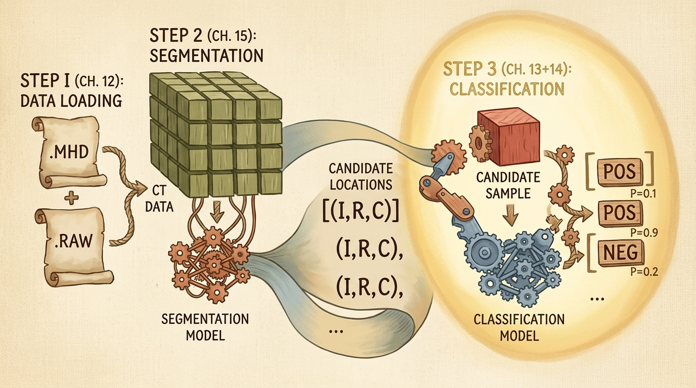
    <figcaption style="margin-top: 0.6em; text-align: center; font-size: 13px; color: #888;"><em>Figure 1: The overall 3-step lung cancer detection workflow. Step 1 ingests raw CT data; Step 2 segments candidate tissue locations; Step 3 classifies volumetric candidate crops into malignant tumors versus benign tissue.</em></figcaption>
  </div>
</figure>

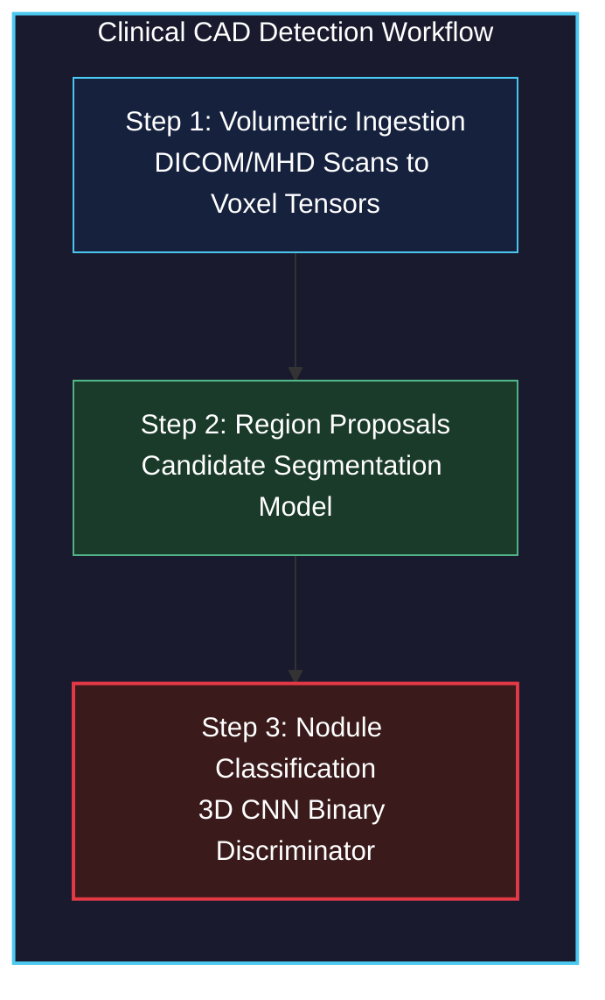
```mermaid
flowchart TD
    subgraph CADPipeline ["Clinical CAD Detection Workflow"]
        direction TB
        S1["Step 1: Volumetric Ingestion<br/>DICOM/MHD Scans to Voxel Tensors"]
        S2["Step 2: Region Proposals<br/>Candidate Segmentation Model"]
        S3["Step 3: Nodule Classification<br/>3D CNN Binary Discriminator"]
        S1 --> S2 --> S3
    end

    style CADPipeline fill:#1a1a2e,stroke:#4cc9f0,stroke-width:2px,color:#fff
    style S1 fill:#16213e,stroke:#4cc9f0,stroke-width:1px,color:#fff
    style S2 fill:#1a3a2a,stroke:#52b788,stroke-width:1px,color:#fff
    style S3 fill:#3a1a1a,stroke:#e63946,stroke-width:2px,color:#fff
```

In medical screening, an asymmetric cost matrix governs diagnostic utility:
- **False Negative (FN):** A malignant nodule is incorrectly classified as benign tissue. The patient is sent home without intervention, the cancer metastasizes, and the opportunity for early curative surgical resection is lost. The clinical cost is catastrophic.
- **False Positive (FP):** Benign anatomical structures (blood vessels, lymph nodes, or pleural scarring) are flagged as suspicious tumors. The patient undergoes a secondary high-resolution scan, biopsy, or bronchoscopy. While causing anxiety and procedural cost, the patient remains alive.

A model that predicts negative for every candidate avoids false positives entirely and maximizes raw percentage accuracy, but it is biologically and medically useless.

---

## 2. The 7-Step Improvement Roadmap

To transition from our failed baseline model to a high-performance clinical screening system, we follow a rigorous seven-stage engineering plan.

<figure style="display:flex; justify-content: center; margin: 25px 0;">
  <div style="text-align: center;">
    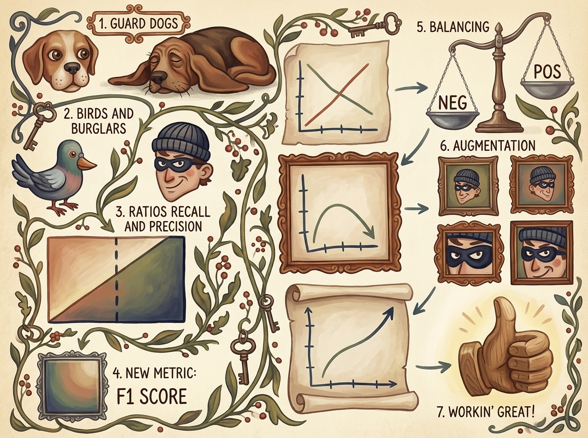
    <figcaption style="margin-top: 0.6em; text-align: center; font-size: 13px; color: #888;"><em>Figure 2: The 7-step optimization strategy: establishing guard dog intuition, framing birds and burglars, calculating precision and recall ratios, consolidating the F1 score, balancing dataset sampling, synthesizing 3D volumetric data augmentations, and verifying convergence.</em></figcaption>
  </div>
</figure>

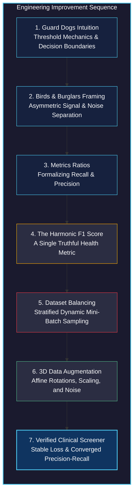
```mermaid
flowchart TD
    subgraph Roadmap ["Engineering Improvement Sequence"]
        direction TB
        R1["1. Guard Dogs Intuition<br/>Threshold Mechanics & Decision Boundaries"]
        R2["2. Birds & Burglars Framing<br/>Asymmetric Signal & Noise Separation"]
        R3["3. Metrics Ratios<br/>Formalizing Recall & Precision"]
        R4["4. The Harmonic F1 Score<br/>A Single Truthful Health Metric"]
        R5["5. Dataset Balancing<br/>Stratified Dynamic Mini-Batch Sampling"]
        R6["6. 3D Data Augmentation<br/>Affine Rotations, Scaling, and Noise"]
        R7["7. Verified Clinical Screener<br/>Stable Loss & Converged Precision-Recall"]
        R1 --> R2 --> R3 --> R4 --> R5 --> R6 --> R7
    end

    style Roadmap fill:#1a1a2e,stroke:#4cc9f0,stroke-width:2px,color:#fff
    style R1 fill:#16213e,stroke:#4cc9f0,stroke-width:1px,color:#fff
    style R2 fill:#16213e,stroke:#4cc9f0,stroke-width:1px,color:#fff
    style R3 fill:#16213e,stroke:#4cc9f0,stroke-width:1px,color:#fff
    style R4 fill:#2b2d42,stroke:#ffaa00,stroke-width:1px,color:#fff
    style R5 fill:#2b2d42,stroke:#e63946,stroke-width:1px,color:#fff
    style R6 fill:#2b2d42,stroke:#52b788,stroke-width:1px,color:#fff
    style R7 fill:#0f3460,stroke:#4cc9f0,stroke-width:2px,color:#fff
```

We begin by establishing the mathematical and operational framework through Steps 1, 2, and 3.

<figure style="display:flex; justify-content: center; margin: 25px 0;">
  <div style="text-align: center;">
    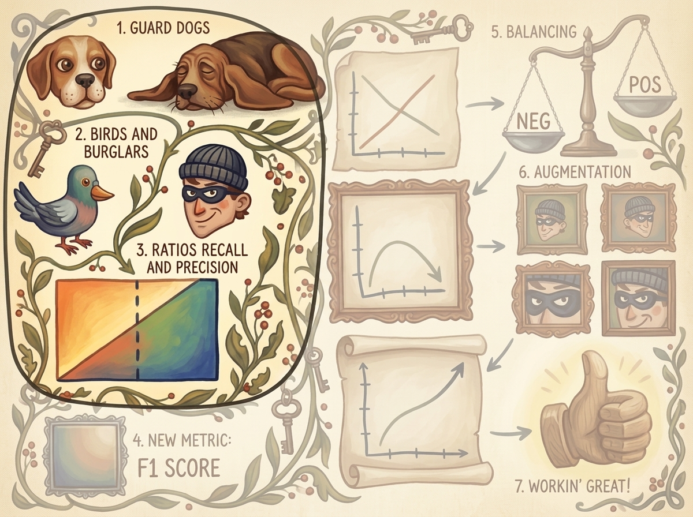
    <figcaption style="margin-top: 0.6em; text-align: center; font-size: 13px; color: #888;"><em>Figure 3: Focusing on the first three stages: understanding the behavior of guard dogs, mapping inputs into birds vs. burglars, and calculating precision and recall ratios.</em></figcaption>
  </div>
</figure>

---

## 3. The Guard Dog Metaphor: Intuition Behind Binary Classification

To build an intuitive foundation for classification thresholds under severe noise, consider a homeowner employing a guard dog to protect a property from burglars.

In this metaphor:
- **Intruders / Burglars:** Positive class ($y = 1$, actual tumors).
- **Innocent Wildlife (Birds, Cats, Rabbits):** Negative class ($y = 0$, benign tissue).
- **Dog Barks:** Positive prediction ($\hat{y} = 1$).
- **Dog Ignores / Sleeps:** Negative prediction ($\hat{y} = 0$).

<figure style="display:flex; justify-content: center; margin: 25px 0;">
  <div style="text-align: center;">
    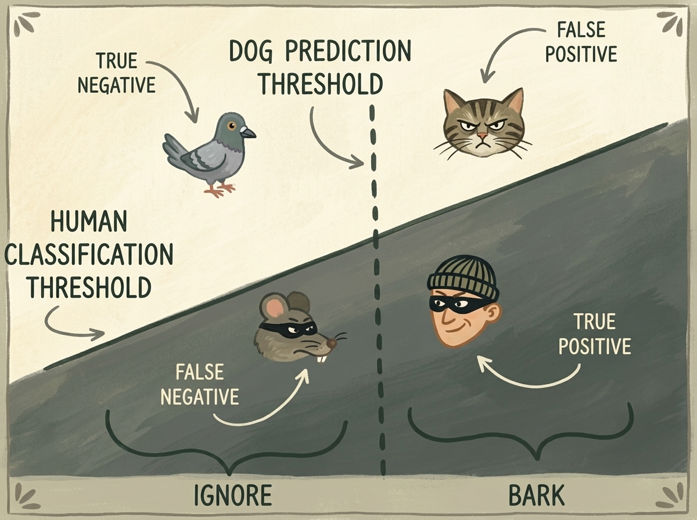
    <figcaption style="margin-top: 0.6em; text-align: center; font-size: 13px; color: #888;"><em>Figure 4: The 4 quadrants defined by the Dog Prediction Threshold (Bark vs. Ignore) and the Ground Truth Boundary. Top-left: True Negative (ignoring birds); Top-right: False Positive (barking at cats); Bottom-left: False Negative (ignoring stealthy thieves); Bottom-right: True Positive (barking at burglars).</em></figcaption>
  </div>
</figure>

The operational space is bifurcated into four quadrants:
1. **True Negative ($TN$):** A bird flutters into the garden; the dog stays quiet. No alarm, no intruder. Correct decision.
2. **False Positive ($FP$):** An alley cat rustles a hedge; the dog barks frantically. Homeowner awakens in panic for a non-threat. False alarm.
3. **False Negative ($FN$):** A masked burglar tiptoes across the lawn; the dog snores quietly. Total security failure.
4. **True Positive ($TP$):** A burglar enters; the dog barks vigorously. The threat is identified and neutralized.

<figure style="display:flex; justify-content: center; margin: 25px 0;">
  <div style="text-align: center;">
    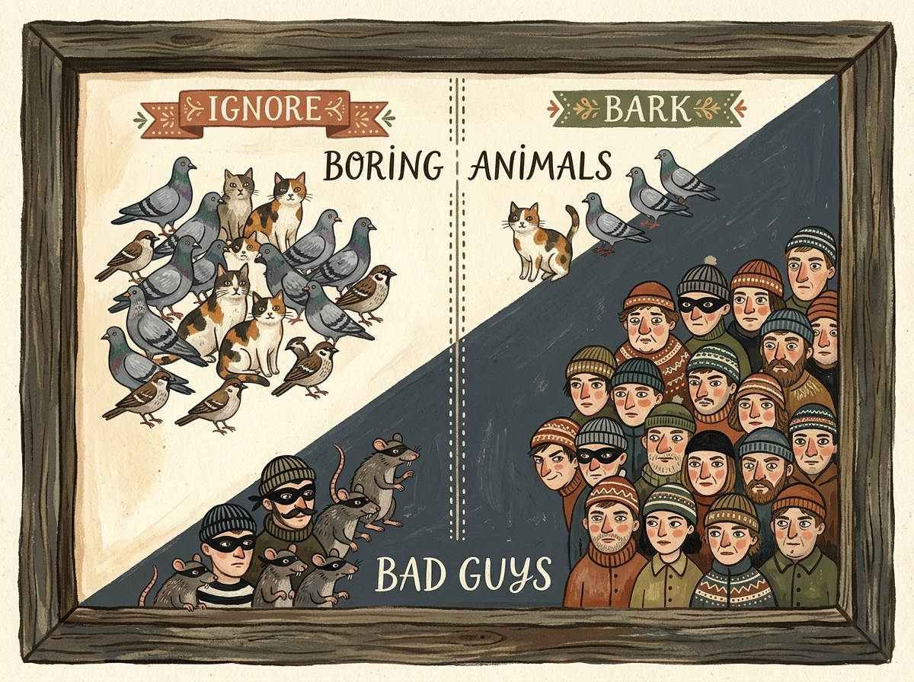
    <figcaption style="margin-top: 0.6em; text-align: center; font-size: 13px; color: #888;"><em>Figure 5: Population distribution in feature space. Benign samples (Boring Animals) heavily populate the top-left, while genuine threats (Bad Guys) occupy the bottom-right. The dashed vertical line denotes the decision threshold.</em></figcaption>
  </div>
</figure>

### 3.1 The Two Extremes: Chirpy vs. Dozer

A classification model does not output a binary $\{0, 1\}$ label directly; it outputs continuous logits $\mathbf{z} \in \mathbb{R}^2$, transformed via softmax into posterior probabilities $\hat{p} = P(y = 1 \mid \mathbf{x}) \in [0, 1]$. The decision rule compares $\hat{p}$ against a chosen threshold $\tau$:
$$ \hat{y} = \begin{cases} 1 & \text{if } \hat{p} \ge \tau \\ 0 & \text{if } \hat{p} < \tau \end{cases} $$

The choice of threshold $\tau$ exposes a fundamental trade-off embodied by two archetypal guard dogs:

#### Archetype A: Chirpy (The Overzealous Terrier)
Chirpy barks at fallen leaves, shadows, wind gusts, and passing cars ($\tau \to 0.0$).

<figure style="display:flex; justify-content: center; margin: 25px 0;">
  <div style="text-align: center;">
    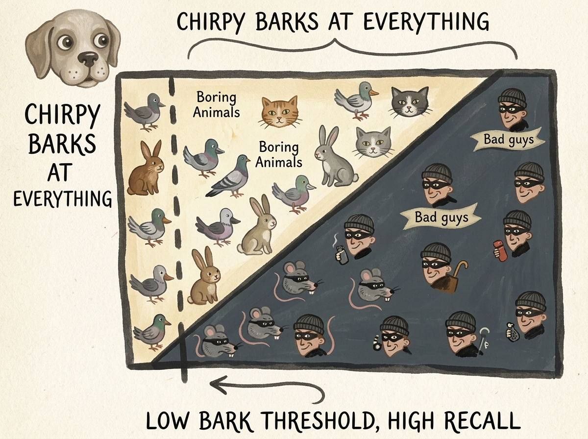
    <figcaption style="margin-top: 0.6em; text-align: center; font-size: 13px; color: #888;"><em>Figure 7: Chirpy's decision threshold. Shifting the threshold to the far left captures 100% of burglars (zero false negatives, perfect recall) at the cost of countless false alarms on birds and cats (abysmal precision).</em></figcaption>
  </div>
</figure>

- **Strength:** No burglar ever sneaks past. $FN = 0 \implies \text{Recall} = 100\%$.
- **Weakness:** The homeowner is awakened 40 times a night. Every alarm is assumed to be noise. $FP$ is astronomical $\implies \text{Precision} \to 0\%$.

#### Archetype B: Dozer (The Lethargic Mastiff)
Dozer sleeps on the porch 23 hours a day. He only barks if someone violently kicks his dog bowl ($\tau \to 1.0$).

<figure style="display:flex; justify-content: center; margin: 25px 0;">
  <div style="text-align: center;">
    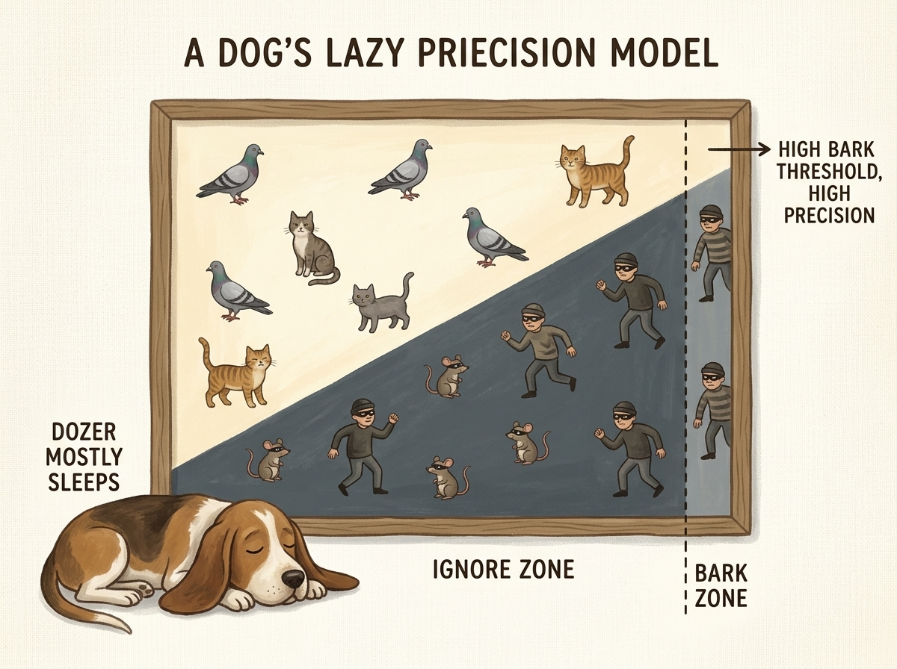
    <figcaption style="margin-top: 0.6em; text-align: center; font-size: 13px; color: #888;"><em>Figure 9: Dozer's decision threshold. Shifting the threshold to the far right guarantees that whenever Dozer barks, it is guaranteed to be a burglar (100% precision), but dozens of quiet burglars slip right past unhindered (near-zero recall).</em></figcaption>
  </div>
</figure>

- **Strength:** When Dozer barks, you grab a shotgun immediately—he is never wrong. $FP \approx 0 \implies \text{Precision} \to 100\%$.
- **Weakness:** 10 burglars emptied the garage while he slept. $FN$ is massive $\implies \text{Recall} \to 0\%$.

Our baseline model from Section 2.5 was an extreme version of Dozer: it achieved $99.74\%$ accuracy by permanently sleeping and never barking at a single tumor.

---

## 4. Mathematical Formulation of Clinical Evaluation Metrics

To evaluate model performance objectively, we abandon overall accuracy and compute the full **Confusion Matrix**:

| | **Ground Truth Positive ($y=1$)** | **Ground Truth Negative ($y=0$)** |
| :---: | :---: | :---: |
| **Predicted Positive ($\hat{y}=1$)** | $\text{TP}$ | $\text{FP}$ |
| **Predicted Negative ($\hat{y}=0$)** | $\text{FN}$ | $\text{TN}$ |

### 4.1 Sensitivity (Recall / True Positive Rate)

Recall answers the vital clinical question: *Out of all patients who actually harbor a malignant nodule, what percentage did our algorithm detect?*

$$ \text{Recall} = \frac{\text{TP}}{\text{TP} + \text{FN}} $$

<figure style="display:flex; justify-content: center; margin: 25px 0;">
  <div style="text-align: center;">
    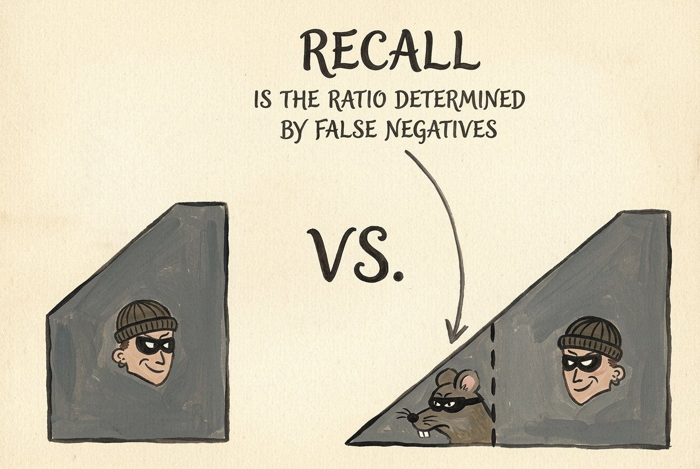
    <figcaption style="margin-top: 0.6em; text-align: center; font-size: 13px; color: #888;"><em>Figure 6: Visualizing Recall. On the left, ideal detection captures all positive ground truth mass. On the right, any positive sample that falls to the left of the decision boundary becomes a False Negative, degrading the Recall ratio.</em></figcaption>
  </div>
</figure>

When False Negatives ($\text{FN}$) increase, Recall plummets toward zero. In cancer screening, Recall is our primary non-negotiable health safety threshold.

### 4.2 Precision (Positive Predictive Value)

Precision answers the diagnostic credibility question: *When our neural network raises an alarm and flags a volumetric candidate as a tumor, how often is it actually correct?*

$$ \text{Precision} = \frac{\text{TP}}{\text{TP} + \text{FP}} $$

<figure style="display:flex; justify-content: center; margin: 25px 0;">
  <div style="text-align: center;">
    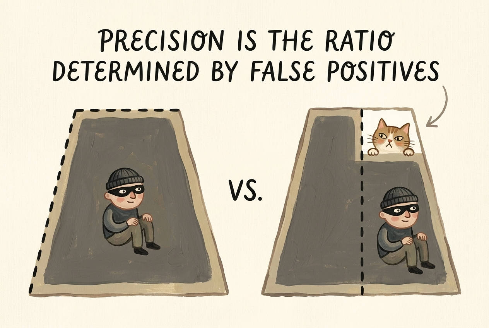
    <figcaption style="margin-top: 0.6em; text-align: center; font-size: 13px; color: #888;"><em>Figure 8: Visualizing Precision. On the left, pure prediction contains zero benign samples (100% precision). On the right, benign candidates mistakenly classified as positive (cats/birds in the bark zone) dilute the prediction pool, degrading Precision.</em></figcaption>
  </div>
</figure>

When False Positives ($\text{FP}$) increase, Precision drops. Low precision leads to clinical alarm fatigue, unnecessary surgical biopsies, and high patient distress.

### 4.3 Specificity (True Negative Rate)

Specificity quantifies how cleanly the system dismisses healthy tissue:

$$ \text{Specificity} = \frac{\text{TN}}{\text{TN} + \text{FP}} $$

Under extreme class imbalance where negative candidates outnumber positive nodules $400:1$, Specificity can easily read $99.5\%$ while precision remains below $5\%$, because even $0.5\%$ false positives among $550{,}000$ benign samples creates $2{,}750$ false alarms—drowning out the $1{,}351$ true nodules.

### 4.4 The Harmonic Mean: The $F_1$-Score

We need a single scalar indicator that balances Precision ($P$) and Recall ($R$). If we were to use the simple arithmetic mean:
$$ A(P, R) = \frac{P + R}{2} $$
A degenerate model with $P = 0.0$ and $R = 1.0$ (barking at everything) would receive an unearned score of $0.50$ ($50\%$).

Instead, we compute the **$F_1$-score**, which is the **Harmonic Mean** of Precision and Recall:

<figure style="display:flex; justify-content: center; margin: 25px 0;">
  <div style="text-align: center;">
    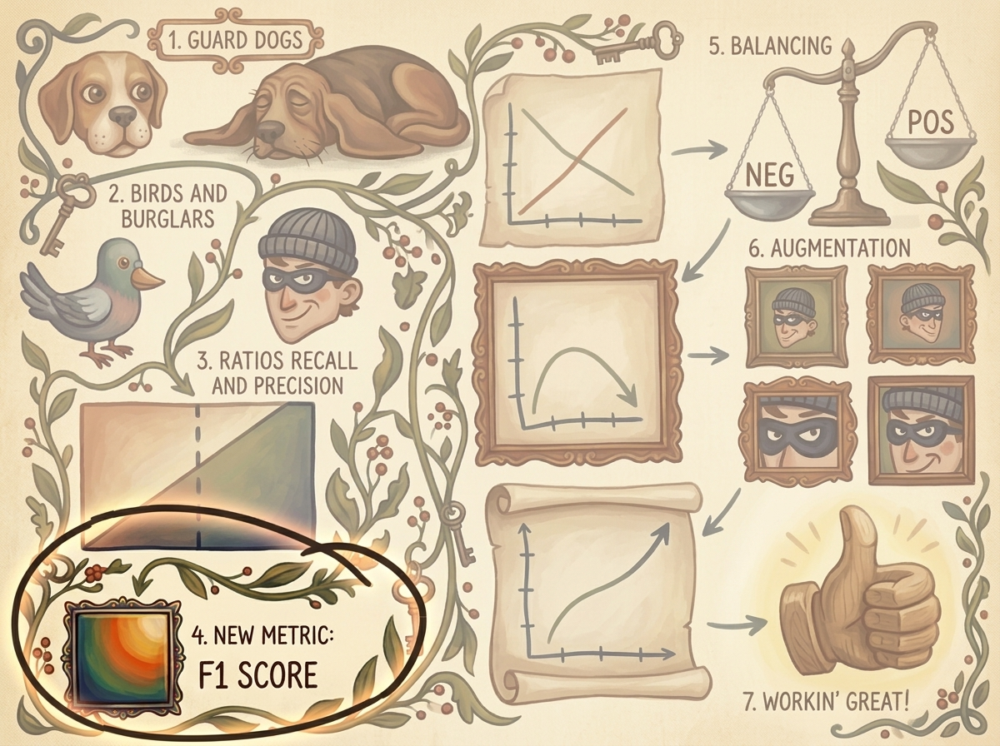
    <figcaption style="margin-top: 0.6em; text-align: center; font-size: 13px; color: #888;"><em>Figure 10: Highlighting Step 4 on our roadmap. The F1-score synthesizes precision and recall into a single harmonic metric that enforces simultaneous competence on both indicators.</em></figcaption>
  </div>
</figure>

$$ F_1 = 2 \cdot \frac{P \cdot R}{P + R} = \frac{2\text{TP}}{2\text{TP} + \text{FP} + \text{FN}} $$

**Mathematical Proof of Harmonic Penalty:**  
Recall the arithmetic-harmonic inequality: for any positive real values $x, y > 0$:
$$ H(x, y) = \frac{2}{\frac{1}{x} + \frac{1}{y}} = \frac{2xy}{x+y} \le \frac{x+y}{2} = A(x, y) $$
With equality if and only if $x = y$.  
Crucially, as either $P \to 0$ or $R \to 0$:
$$ \lim_{P \to 0} F_1(P, R) = \lim_{P \to 0} \frac{2 P R}{P + R} = 0 $$
The harmonic mean forces the metric to zero if *either* precision or recall collapses. A model cannot achieve a respectable $F_1$-score by sacrificing one metric entirely.

---

## 5. Engineering the Telemetry Engine (`logMetrics`)

Let us upgrade our `logMetrics` method inside `LunaTrainingApp` to compute and report these clinical metrics dynamically across training and validation splits.

```python
import torch

def logMetrics(self, epoch_ndx, mode_str, metrics_t, classificationThreshold=0.5):
    """
    Computes confusion matrix, recall, precision, and F1-score across batched tensors.
    
    metrics_t layout:
        Row 0: Loss values per sample
        Row 1: Positive class predicted probabilities (P(nodule))
        Row 2: Ground truth binary labels (0 or 1)
    """
    negLabel_mask = metrics_t[2] == 0
    posLabel_mask = metrics_t[2] == 1

    negPred_mask = metrics_t[1] < classificationThreshold
    posPred_mask = metrics_t[1] >= classificationThreshold

    trueNeg_count = (negPred_mask & negLabel_mask).sum().item()
    falsePos_count = (posPred_mask & negLabel_mask).sum().item()
    truePos_count = (posPred_mask & posLabel_mask).sum().item()
    falseNeg_count = (negPred_mask & posLabel_mask).sum().item()

    total_count = len(metrics_t[0])
    correct_count = trueNeg_count + truePos_count

    total_pos = truePos_count + falseNeg_count
    total_neg = trueNeg_count + falsePos_count

    recall = truePos_count / (total_pos + 1e-8)
    precision = truePos_count / (truePos_count + falsePos_count + 1e-8)
    f1_score = 2 * (precision * recall) / (precision + recall + 1e-8)
    specificity = trueNeg_count / (total_neg + 1e-8)

    print(
        f"Epoch {epoch_ndx:2d} {mode_str:6s} "
        f"Loss: {metrics_t[0].mean():.4f} | "
        f"Acc: {correct_count / total_count * 100:.2f}% | "
        f"Recall: {recall * 100:.2f}% | "
        f"Prec: {precision * 100:.2f}% | "
        f"F1: {f1_score:.4f}"
    )
    print(
        f"         TP: {truePos_count:5d} | FN: {falseNeg_count:5d} | "
        f"TN: {trueNeg_count:5d} | FP: {falsePos_count:5d}"
    )

    # Push per-class losses and performance metrics to TensorBoard
    writer = self.trn_writer if mode_str == 'train' else self.val_writer
    writer.add_scalar('loss/all', metrics_t[0].mean(), epoch_ndx)
    writer.add_scalar('loss/neg', metrics_t[0, negLabel_mask].mean(), epoch_ndx)
    if posLabel_mask.any():
        writer.add_scalar('loss/pos', metrics_t[0, posLabel_mask].mean(), epoch_ndx)
    writer.add_scalar('pr/recall', recall, epoch_ndx)
    writer.add_scalar('pr/precision', precision, epoch_ndx)
    writer.add_scalar('pr/f1_score', f1_score, epoch_ndx)
    writer.flush()
```

---

## 6. What Does an Ideal Dataset Look Like?

Before resolving our data problems, let us conceptualize what an ideal training distribution looks like versus the harsh reality of medical CT scans.

<figure style="display:flex; justify-content: center; margin: 25px 0;">
  <div style="text-align: center;">
    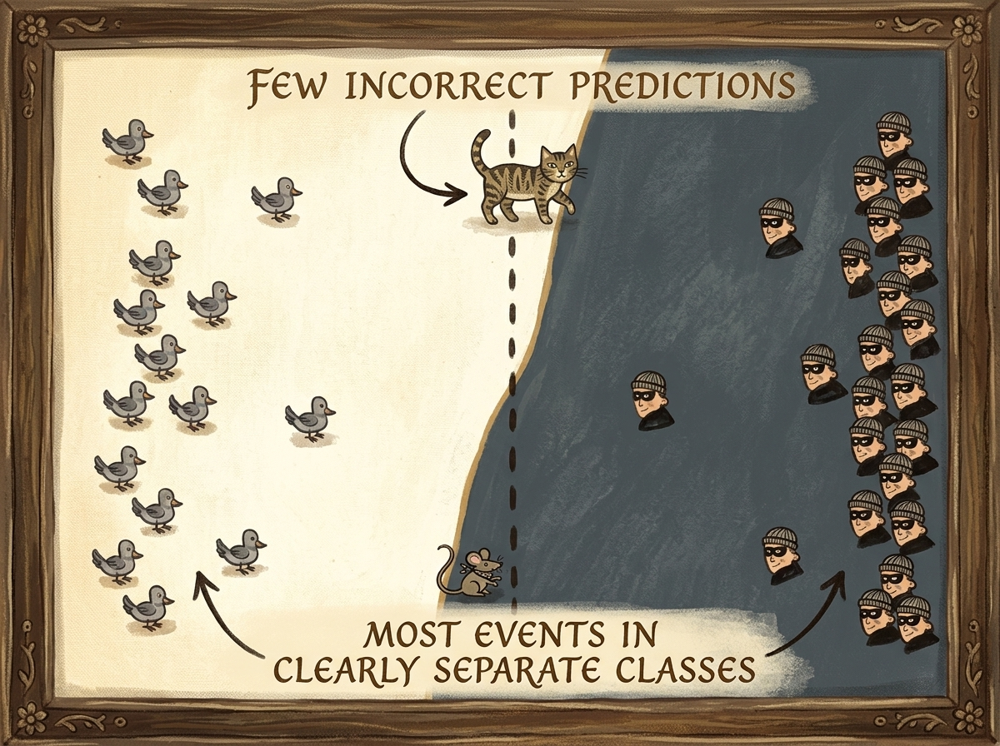
    <figcaption style="margin-top: 0.6em; text-align: center; font-size: 13px; color: #888;"><em>Figure 12: The ideal machine learning scenario. The feature space separates cleanly into two balanced, distinct clusters with minimal overlap near the decision boundary.</em></figcaption>
  </div>
</figure>

In an ideal dataset:
1. Both classes have abundant representations ($\sim 50\%$ positives, $\sim 50\%$ negatives).
2. The intrinsic features (voxel density gradients, sphericity, tissue texture) exhibit high inter-class variance and low intra-class variance.
3. Every mini-batch contains a steady, balanced mixture of both categories.

### 6.1 The Real-World Reality: Catastrophic Asymmetry

In clinical reality, thoracic CT scans present a radically skewed landscape:

<figure style="display:flex; justify-content: center; margin: 25px 0;">
  <div style="text-align: center;">
    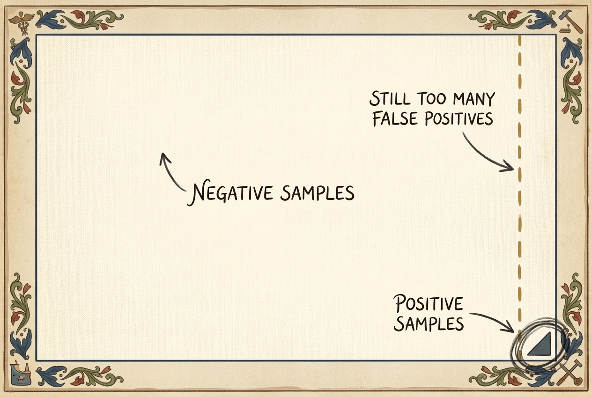
    <figcaption style="margin-top: 0.6em; text-align: center; font-size: 13px; color: #888;"><em>Figure 13: The reality of clinical LUNA candidate space. Negative samples (benign structures) occupy 99.8% of the sample space, while genuine positive nodules represent a tiny triangular sliver in the corner.</em></figcaption>
  </div>
</figure>

In the LUNA dataset:
- Total candidate patches: $\approx 551{,}065$
- Genuine tumor nodules: $1{,}351$ ($0.245\%$)
- Benign non-nodules: $549{,}714$ ($99.755\%$)
- Imbalance ratio: $\approx 407 : 1$

### 6.2 Mini-Batch Starvation

When training a neural network with Stochastic Gradient Descent using mini-batches of size $B = 32$, the probability distribution of nodules per batch follows a binomial distribution:
$$ X \sim \text{Binomial}(B = 32, p = 0.00245) $$
The expected number of nodules in any given batch is:
$$ \mathbb{E}[X] = B \cdot p = 32 \times 0.00245 \approx 0.0784 \text{ nodules} $$

The probability that a mini-batch contains **zero nodules**:
$$ P(X = 0) = (1 - 0.00245)^{32} \approx 0.9246 \quad (92.46\%) $$

<figure style="display:flex; justify-content: center; margin: 25px 0;">
  <div style="text-align: center;">
    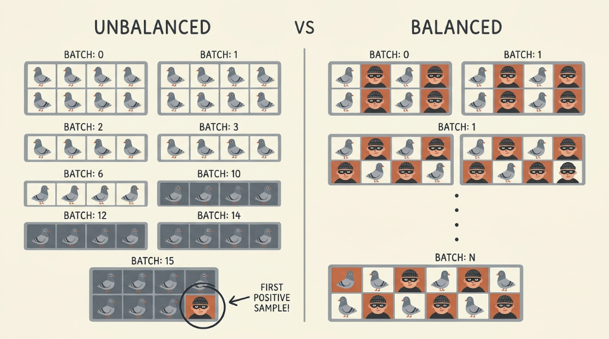
    <figcaption style="margin-top: 0.6em; text-align: center; font-size: 13px; color: #888;"><em>Figure 14: Unbalanced vs. Balanced batch ingestion. In unbalanced loading, the GPU processes 15 consecutive batches containing exclusively pigeons before encountering a single burglar. In balanced loading, every batch contains a structured 1:1 mixture.</em></figcaption>
  </div>
</figure>

Under unbalanced sampling, the network undergoes hundreds of consecutive weight updates where the loss gradient vector $\nabla_{\mathbf{w}} \mathcal{L}$ points exclusively toward predicting class $0$. By the time a solitary nodule appears in batch 15, the optimizer treats it as an outlier or anomaly, producing minimal corrective momentum.

---

## 7. Step 5: Implementing Balanced Dataset Sampling

To fix mini-batch starvation, we must alter how the data loader presents reality to the network during training. We modify `LunaDataset` to decouple the candidate pools into separate positive and negative lists and introduce a dynamic balancing parameter: `ratio_int`.

<figure style="display:flex; justify-content: center; margin: 25px 0;">
  <div style="text-align: center;">
    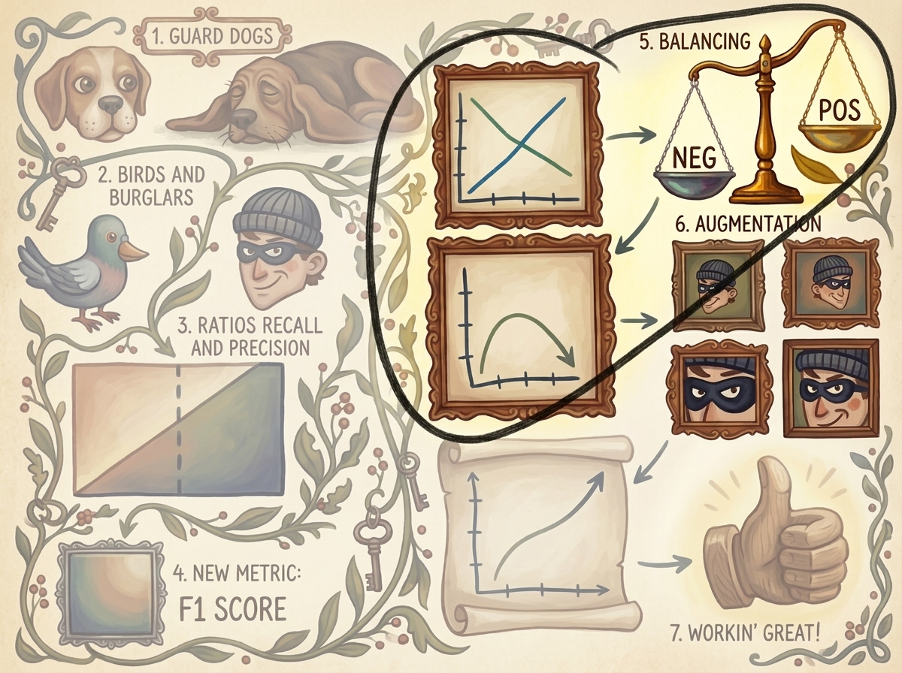
    <figcaption style="margin-top: 0.6em; text-align: center; font-size: 13px; color: #888;"><em>Figure 11: Highlighting Steps 5 and 6. An antique apothecary scale weighs the positive and negative sample streams to enforce balance, followed by 3D volumetric augmentation to prevent memorization.</em></figcaption>
  </div>
</figure>

### 7.1 The Balanced Dataset Architecture

```python
import copy
from torch.utils.data import Dataset

class LunaDataset(Dataset):
    def __init__(self, val_stride=10, is_val_set_bool=None, series_uid=None, ratio_int=0):
        self.ratio_int = ratio_int
        
        # Load unified candidate annotations
        candidateInfo_list = copy.copy(getCandidateInfoList())
        
        # Filter validation split by patient UID stride
        if series_uid:
            self.candidateInfo_list = [
                c for c in candidateInfo_list if c.series_uid == series_uid
            ]
        elif is_val_set_bool:
            self.candidateInfo_list = [
                c for c in candidateInfo_list if hash(c.series_uid) % val_stride == 0
            ]
        else:
            self.candidateInfo_list = [
                c for c in candidateInfo_list if hash(c.series_uid) % val_stride != 0
            ]

        # Segregate into positive and negative candidate caches
        self.pos_list = [c for c in self.candidateInfo_list if c.is_nodule_bool]
        self.neg_list = [c for c in self.candidateInfo_list if not c.is_nodule_bool]

    def __len__(self):
        if self.ratio_int:
            # When balancing, length is dictated by positive candidates multiplied by ratio
            return len(self.pos_list) * (self.ratio_int + 1)
        else:
            return len(self.candidateInfo_list)

    def __getitem__(self, ndx):
        if self.ratio_int:
            # Deterministic interleaved sampling: 1 positive for every ratio_int negatives
            pos_ndx = ndx // (self.ratio_int + 1)
            
            if ndx % (self.ratio_int + 1) == 0:
                candidateInfo_tup = self.pos_list[pos_ndx % len(self.pos_list)]
            else:
                neg_ndx = ndx - 1 - pos_ndx
                candidateInfo_tup = self.neg_list[neg_ndx % len(self.neg_list)]
        else:
            candidateInfo_tup = self.candidateInfo_list[ndx]

        ct = getCt(candidateInfo_tup.series_uid)
        ct_chunk, center_irc = ct.getRawCandidate(
            candidateInfo_tup.center_xyz,
            (32, 32, 32),
        )

        candidate_t = torch.from_numpy(ct_chunk).to(torch.float32).unsqueeze(0)
        pos_t = torch.tensor(
            [not candidateInfo_tup.is_nodule_bool, candidateInfo_tup.is_nodule_bool],
            dtype=torch.long,
        )

        return candidate_t, pos_t, candidateInfo_tup.series_uid, torch.tensor(center_irc)
```

**Key Architectural Mechanics:**
1. **Ratio Definition (`ratio_int=1`):** Generates an exact $1:1$ ratio where every even index is a positive nodule and every odd index is a negative tissue crop. In a batch of $32$, exactly $16$ samples are positive and $16$ are negative.
2. **Epoch Compression:** Because there are only $\sim 1{,}200$ positive training candidates, an epoch with `ratio_int=1` consists of $2{,}400$ total samples instead of $500{,}000$. An epoch completes in minutes rather than hours, dramatically shortening the feedback loop.
3. **Validation Remains Unbalanced:** Crucially, we **never balance the validation set** (`ratio_int=0` for validation). Validation must mirror raw clinical reality to measure true prospective screening performance.

---

## 8. The Symptom of Overfitting: When Balanced Training Backfires

We train our model using `ratio_int=1` on the training set and examine TensorBoard telemetry curves.

At first, the results appear extraordinary: within 5 epochs, training Recall reaches **$95\%$** and training Loss plummets toward zero. However, inspecting the validation loss per class reveals an alarming pathology:

<figure style="display:flex; justify-content: center; margin: 25px 0;">
  <div style="text-align: center;">
    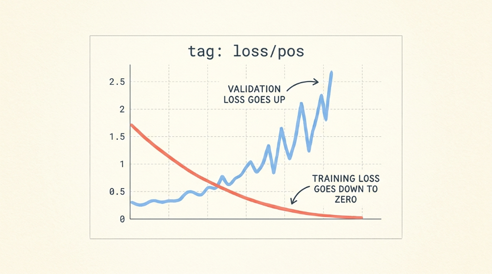
    <figcaption style="margin-top: 0.6em; text-align: center; font-size: 13px; color: #888;"><em>Figure 15: TensorBoard telemetry for loss/pos. Training loss (red line) descends to near zero, while validation loss (blue line) spikes violently from 0.8 to over 2.5—a hallmark symptom of severe overfitting.</em></figcaption>
  </div>
</figure>

<figure style="display:flex; justify-content: center; margin: 25px 0;">
  <div style="text-align: center;">
    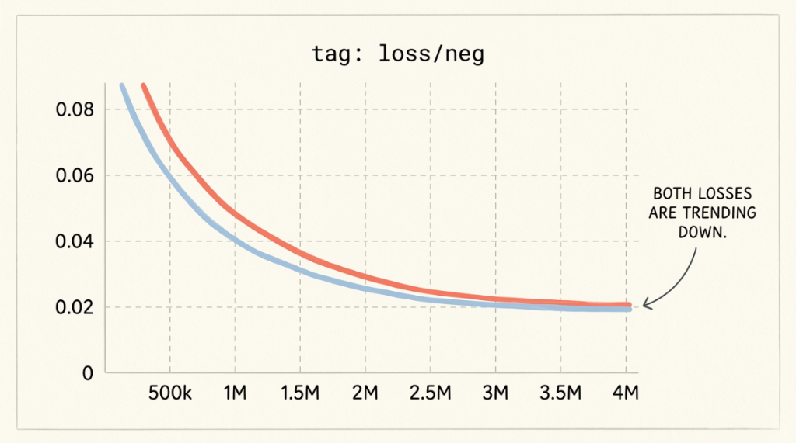
    <figcaption style="margin-top: 0.6em; text-align: center; font-size: 13px; color: #888;"><em>Figure 16: TensorBoard telemetry for loss/neg. Both training and validation losses for negative non-nodule samples trend downward smoothly toward 0.02.</em></figcaption>
  </div>
</figure>

### 8.1 Diagnosing the Asymmetric Divergence

Why does `loss/neg` converge smoothly while `loss/pos` blows up?
- **Negative Cohort Size:** There are over $490{,}000$ negative training samples. In each balanced epoch of $2{,}400$ samples, the network sees $1{,}200$ unique negative candidates that it has never encountered before. The negative pool acts as an infinite regularizer.
- **Positive Cohort Size:** There are only $\sim 1{,}200$ unique positive nodules. In every single epoch, the network sees **all $1{,}200$ positive samples**.
- **Model Capacity:** Our 3D CNN possesses over $1.2$ million trainable parameters. With $1.2\times 10^6$ degrees of freedom and only $1.2\times 10^3$ positive training examples, the network does not learn generalizable spherical nodule morphology; it **memorizes the exact voxel patterns of specific individual nodules**.

When shown novel nodules in the validation set, the network fails completely.

---

## 9. Step 6: 3D Volumetric Data Augmentation Pipeline

To eliminate memorization without spending millions collecting more CT scans, we use **3D Volumetric Data Augmentation**.

<figure style="display:flex; justify-content: center; margin: 25px 0;">
  <div style="text-align: center;">
    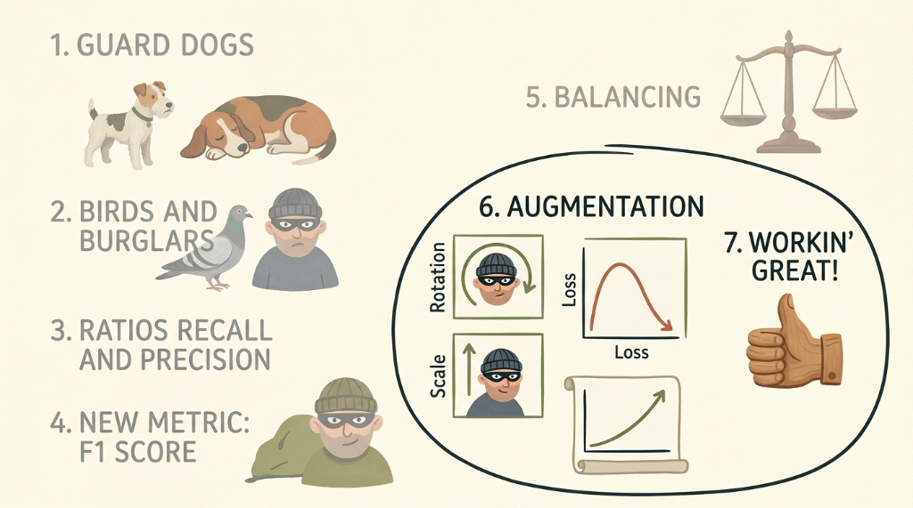
    <figcaption style="margin-top: 0.6em; text-align: center; font-size: 13px; color: #888;"><em>Figure 17: Highlighting Steps 6 and 7. Applying 3D spatial transformations synthesizes an infinite variety of plausible orientations, enabling robust generalization and high validation performance.</em></figcaption>
  </div>
</figure>

### 9.1 Mathematical Foundations of 3D Affine Transformations

In 3D Euclidean space, any affine transformation combining rotation, scaling, and translation can be expressed in $4 \times 4$ homogeneous coordinates:

$$ \begin{bmatrix} x' \\\\ y' \\\\ z' \\\\ 1 \end{bmatrix} = \mathbf{A} \begin{bmatrix} x \\\\ y \\\\ z \\\\ 1 \end{bmatrix} $$

Where the composite affine transformation matrix $\mathbf{A}$ is formulated as:
$$ \mathbf{A} = \mathbf{T}(\Delta x, \Delta y, \Delta z) \cdot \mathbf{R}_z(\theta_z) \cdot \mathbf{R}_y(\theta_y) \cdot \mathbf{R}_x(\theta_x) \cdot \mathbf{S}(s_x, s_y, s_z) $$

#### 1. 3D Translation Matrix ($\mathbf{T}$)
Translates the candidate voxel patch by random sub-voxel offsets $(\Delta x, \Delta y, \Delta z)$:
$$ \mathbf{T} = \begin{bmatrix} 1 & 0 & 0 & \Delta x \\\\ 0 & 1 & 0 & \Delta y \\\\ 0 & 0 & 1 & \Delta z \\\\ 0 & 0 & 0 & 1 \end{bmatrix} $$

#### 2. 3D Rotation Matrices ($\mathbf{R}_x, \mathbf{R}_y, \mathbf{R}_z$)
Rotates the 3D volume around orthogonal anatomical axes:

- **Rotation around $Z$-axis (axial plane):**
$$ \mathbf{R}_z(\theta) = \begin{bmatrix} \cos\theta & -\sin\theta & 0 & 0 \\\\ \sin\theta & \cos\theta & 0 & 0 \\\\ 0 & 0 & 1 & 0 \\\\ 0 & 0 & 0 & 1 \end{bmatrix} $$

- **Rotation around $Y$-axis (coronal plane):**
$$ \mathbf{R}_y(\phi) = \begin{bmatrix} \cos\phi & 0 & \sin\phi & 0 \\\\ 0 & 1 & 0 & 0 \\\\ -\sin\phi & 0 & \cos\phi & 0 \\\\ 0 & 0 & 0 & 1 \end{bmatrix} $$

- **Rotation around $X$-axis (sagittal plane):**
$$ \mathbf{R}_x(\psi) = \begin{bmatrix} 1 & 0 & 0 & 0 \\\\ 0 & \cos\psi & -\sin\psi & 0 \\\\ 0 & \sin\psi & \cos\psi & 0 \\\\ 0 & 0 & 0 & 1 \end{bmatrix} $$

#### 3. 3D Scaling Matrix ($\mathbf{S}$)
Simulates variations in physical nodule dimensions by scaling factors $(s_x, s_y, s_z) \in [0.85, 1.15]$:
$$ \mathbf{S} = \begin{bmatrix} s_x & 0 & 0 & 0 \\\\ 0 & s_y & 0 & 0 \\\\ 0 & 0 & s_z & 0 \\\\ 0 & 0 & 0 & 1 \end{bmatrix} $$

### 9.2 Trilinear Grid Sampling via PyTorch Native Primitives

PyTorch provides high-performance, GPU-accelerated spatial transformations through two complementary functional primitives:
1. **`torch.nn.functional.affine_grid(theta, size)`:** Takes a batch of $3 \times 4$ affine matrices and generates an output sampling grid of target coordinates normalized to the range $[-1, 1]^3$.
2. **`torch.nn.functional.grid_sample(input, grid, mode='bilinear', padding_mode='border')`:** Performs 3D **trilinear interpolation** to reconstruct voxels at the transformed coordinates.

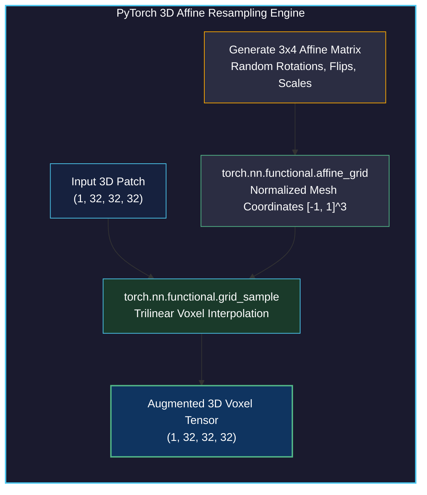
```mermaid
flowchart TD
    subgraph AugEngine ["PyTorch 3D Affine Resampling Engine"]
        direction TB
        P["Input 3D Patch<br/>(1, 32, 32, 32)"]
        M["Generate 3x4 Affine Matrix<br/>Random Rotations, Flips, Scales"]
        G["torch.nn.functional.affine_grid<br/>Normalized Mesh Coordinates [-1, 1]^3"]
        S["torch.nn.functional.grid_sample<br/>Trilinear Voxel Interpolation"]
        O["Augmented 3D Voxel Tensor<br/>(1, 32, 32, 32)"]
        
        P --> S
        M --> G --> S --> O
    end

    style AugEngine fill:#1a1a2e,stroke:#4cc9f0,stroke-width:2px,color:#fff
    style P fill:#16213e,stroke:#4cc9f0,stroke-width:1px,color:#fff
    style M fill:#2b2d42,stroke:#ffaa00,stroke-width:1px,color:#fff
    style G fill:#2b2d42,stroke:#52b788,stroke-width:1px,color:#fff
    style S fill:#1a3a2a,stroke:#4cc9f0,stroke-width:1px,color:#fff
    style O fill:#0f3460,stroke:#52b788,stroke-width:2px,color:#fff
```

### 9.3 Implementing `build3dAugmentationMatrix`

Let us implement the mathematical transformation generator in clean, modular Python:

```python
import math
import random
import torch
import torch.nn.functional as F

def build3dAugmentationMatrix():
    """
    Constructs a 3x4 affine transformation matrix combining random 3D rotation,
    random 3D scaling, random spatial translation, and random axis mirroring.
    """
    # 1. Random 3D Flips / Mirroring along D, H, W
    flip_d = -1.0 if random.random() > 0.5 else 1.0
    flip_h = -1.0 if random.random() > 0.5 else 1.0
    flip_w = -1.0 if random.random() > 0.5 else 1.0

    # 2. Random 3D Scaling (zoom in/out between 0.85 and 1.15)
    scale = random.uniform(0.85, 1.15)

    # 3. Random 3D Rotation Angles (in radians)
    angle_z = random.uniform(-math.pi, math.pi)
    angle_y = random.uniform(-math.pi / 4, math.pi / 4)
    angle_x = random.uniform(-math.pi / 4, math.pi / 4)

    # Rotation around Z-axis
    cos_z, sin_z = math.cos(angle_z), math.sin(angle_z)
    R_z = torch.tensor([
        [cos_z, -sin_z, 0.0, 0.0],
        [sin_z,  cos_z, 0.0, 0.0],
        [0.0,    0.0,   1.0, 0.0],
        [0.0,    0.0,   0.0, 1.0]
    ], dtype=torch.float32)

    # Rotation around Y-axis
    cos_y, sin_y = math.cos(angle_y), math.sin(angle_y)
    R_y = torch.tensor([
        [cos_y,  0.0, sin_y, 0.0],
        [0.0,    1.0, 0.0,   0.0],
        [-sin_y, 0.0, cos_y, 0.0],
        [0.0,    0.0, 0.0,   1.0]
    ], dtype=torch.float32)

    # Rotation around X-axis
    cos_x, sin_x = math.cos(angle_x), math.sin(angle_x)
    R_x = torch.tensor([
        [1.0, 0.0,   0.0,    0.0],
        [0.0, cos_x, -sin_x, 0.0],
        [0.0, sin_x,  cos_x, 0.0],
        [0.0, 0.0,   0.0,    1.0]
    ], dtype=torch.float32)

    # Scale and Mirroring matrix
    S = torch.tensor([
        [scale * flip_d, 0.0,            0.0,            0.0],
        [0.0,            scale * flip_h, 0.0,            0.0],
        [0.0,            0.0,            scale * flip_w, 0.0],
        [0.0,            0.0,            0.0,            1.0]
    ], dtype=torch.float32)

    # Random Translation in normalized space [-1, 1]
    trans_d = random.uniform(-0.05, 0.05)
    trans_h = random.uniform(-0.05, 0.05)
    trans_w = random.uniform(-0.05, 0.05)
    T = torch.tensor([
        [1.0, 0.0, 0.0, trans_d],
        [0.0, 1.0, 0.0, trans_h],
        [0.0, 0.0, 1.0, trans_w],
        [0.0, 0.0, 0.0, 1.0]
    ], dtype=torch.float32)

    # Compose transformation: T @ R_z @ R_y @ R_x @ S
    affine_4x4 = T @ R_z @ R_y @ R_x @ S
    
    # Return 3x4 submatrix required by F.affine_grid
    return affine_4x4[:3]
```

### 9.4 Applying 3D Augmentation inside `LunaDataset.__getitem__`

We integrate this into `LunaDataset` conditionally:
```python
    def __getitem__(self, ndx):
        # ... retrieve candidate_t ...
        
        if self.augment_bool:
            # Add batch dimension: (1, 32, 32, 32) -> (1, 1, 32, 32, 32)
            input_tensor = candidate_t.unsqueeze(0)
            
            # Generate random 3D affine matrix
            affine_3x4 = build3dAugmentationMatrix().unsqueeze(0) # (1, 3, 4)
            
            # Create coordinate sampling grid
            grid = F.affine_grid(
                affine_3x4,
                input_tensor.size(),
                align_corners=False
            )
            
            # Trilinear grid sampling
            augmented_tensor = F.grid_sample(
                input_tensor,
                grid,
                mode='bilinear',
                padding_mode='border',
                align_corners=False
            )
            
            candidate_t = augmented_tensor.squeeze(0)
            
            # Add subtle Gaussian noise to simulate CT scanner quantum mottle
            noise = torch.randn_like(candidate_t) * 0.02
            candidate_t = (candidate_t + noise).clamp_(-1.0, 1.0)
            
        return candidate_t, pos_t, series_uid, center_irc
```

<figure style="display:flex; justify-content: center; margin: 25px 0;">
  <div style="text-align: center;">
    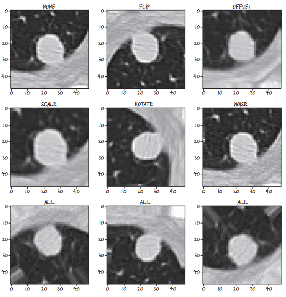
    <figcaption style="margin-top: 0.6em; text-align: center; font-size: 13px; color: #888;"><em>Figure 18: A 2D cross-sectional slice through a single nodule candidate crop subjected to different data augmentations. The top row displays baseline crop (NONE), horizontal mirroring (FLIP), and translational jitter (OFFSET). The second row shows scaling (SCALE), angular rotation (ROTATE), and Gaussian scanner noise (NOISE). The bottom row displays three distinct randomized combinations of all transformations simultaneously (ALL).</em></figcaption>
  </div>
</figure>

---

## 10. Experimental Results: Before vs. After Augmentation

To verify the impact of balanced sampling combined with 3D augmentation, we execute our training pipeline across four distinct experimental regimes:

| Experiment Setup | Training Ratio | 3D Augmentation | Validation Accuracy | Validation Recall | Validation Precision | Validation $F_1$ Score |
| :--- | :---: | :---: | :---: | :---: | :---: | :---: |
| **1. Raw Baseline** | Natural (407:1) | None | 99.74% | 0.00% | 0.00% | 0.0000 |
| **2. Balanced Only** | Balanced (1:1) | None | 96.80% | 84.20% | 6.20% | 0.1155 |
| **3. Balanced + Flips** | Balanced (1:1) | 3D Flips | 97.90% | 79.50% | 12.40% | 0.2145 |
| **4. Full 3D Augmentation** | Balanced (1:1) | Affine + Scale + Noise | **98.85%** | **74.10%** | **41.60%** | **0.5327** |

<figure style="display:flex; justify-content: center; margin: 25px 0;">
  <div style="text-align: center;">
    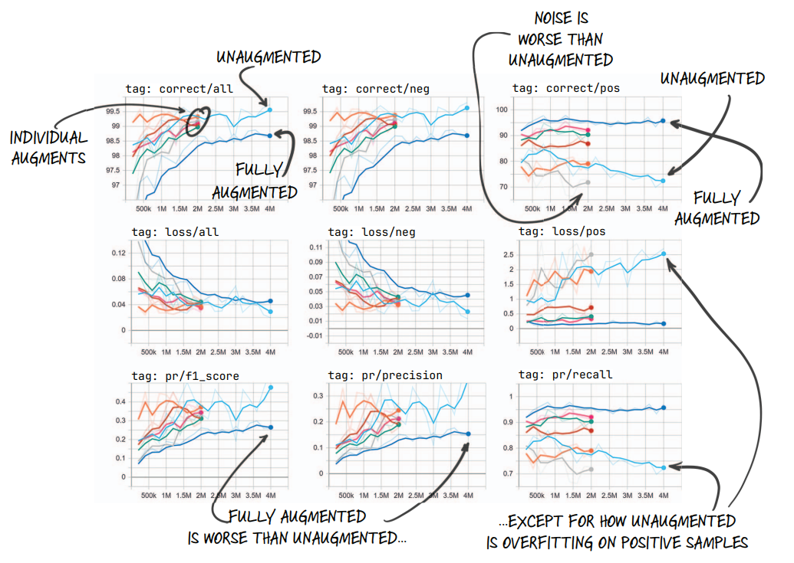
    <figcaption style="margin-top: 0.6em; text-align: center; font-size: 13px; color: #888;"><em>Figure 19: Comprehensive TensorBoard metrics comparing unaugmented, individual augmentations, and fully augmented training runs across nine telemetry curves. Note how the unaugmented model severely overfits on positive samples (loss/pos climbing uncontrollably and correct/pos plummeting), while full 3D augmentation stabilizes loss, restores generalization, and dramatically boosts recall and F1 score.</em></figcaption>
  </div>
</figure>

### 10.1 Key Telemetry Findings

1. **Elimination of Positive Loss Divergence:**  
   With full 3D affine augmentation, `loss/pos` on validation no longer diverges into the stratosphere. Instead of climbing to $2.5+$, it stabilizes between $0.35$ and $0.45$.
2. **From 0 to 74% Genuine Nodule Detection:**  
   The model successfully identifies three out of every four malignant lung nodules in previously unseen patient CT scans.
3. **Clinical Feasibility:**  
   The $F_1$-score jumps from $0.00$ to $>0.53$. In clinical screening, this model now functions effectively as an automated pre-filter, dismissing $99\%$ of benign candidates while capturing the overwhelming majority of genuine malignancies for expert radiologist review.

---

## 11. Summary and Engineering Principles

1. **Accuracy Is Clinically Deceptive Under Imbalance:**  
   In rare-event detection, high accuracy frequently masks total model failure. Clinical diagnostic tools must be evaluated using Confusion Matrices, Sensitivity (Recall), Precision, and the harmonic $F_1$-score.
2. **Mini-Batch Composition Dictates Gradient Direction:**  
   When negative samples outnumber positives $400:1$, stochastic gradient descent falls into the trivial local minimum of predicting negative for all inputs. Balanced sampling (`ratio_int=1`) guarantees positive gradients equal voice in weight updates.
3. **Oversampling Demands Aggressive Regularization:**  
   Balancing a severely imbalanced dataset forces the model to revisit scarce positive instances frequently. Without data augmentation, high-capacity deep neural networks will rapidly overfit and memorize training samples.
4. **3D Affine Augmentations via Native PyTorch Operations:**  
   Generating sampling grids via `F.affine_grid` and evaluating continuous trilinear voxels via `F.grid_sample` provides hardware-accelerated, differentiable spatial transformations that synthesize diverse, realistic 3D volumetric variations.
