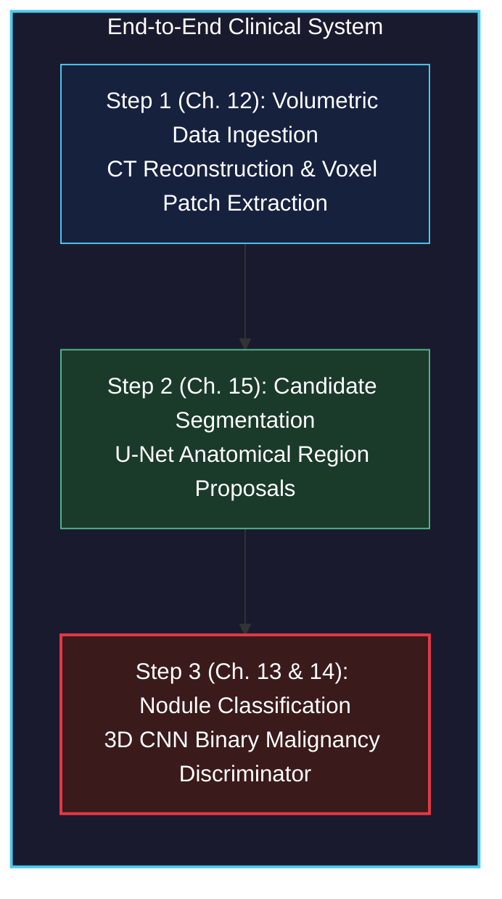
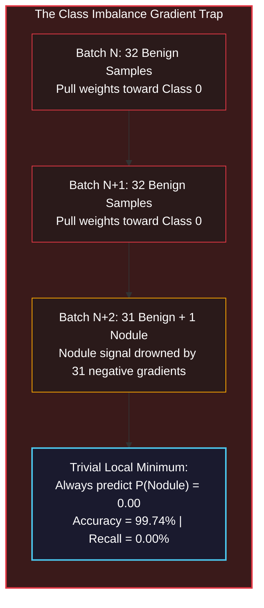

# Training a Classification Model to Detect Suspected Tumors

<!-- toc -->

<div style="margin-bottom: 20px;">
  <a href="https://colab.research.google.com/github/emreaslan7/ai/blob/main/notebooks/deep-learning-with-pytorch/13-training-a-classification-model-to-detect-suspected-tumors.ipynb" target="_blank">
    
  </a>
</div>

---

## 1. The Cancer Detection Pipeline: Focusing on Classification

In Section 2.4, we engineered the data ingestion foundation for our clinical diagnostic system: parsing raw thoracic CT scans (`.mhd`/`.raw`), mapping continuous millimeter coordinates into discrete voxel matrix indices ($[I, R, C]$), and slicing normalized 3D sub-volume patches ($32 \times 32 \times 32$ voxels) centered on suspicious tissue candidates. 

This brings us to **Step 3: Nodule Classification** in the overall clinical pipeline.

<figure style="display:flex; justify-content: center; margin: 25px 0;">
  <div style="text-align: center;">
    
    <figcaption style="margin-top: 0.6em; text-align: center; font-size: 13px; color: #888;"><em>Figure 1: The overall 3-step lung cancer detection workflow. With Step 1 (Data Ingestion) established, this chapter builds Step 3: training a 3D Convolutional Neural Network to classify cropped tissue candidate samples into benign tissue versus genuine malignant nodules.</em></figcaption>
  </div>
</figure>



Our primary objective in this module is binary classification: given an extracted volumetric tensor patch of shape $(1, 32, 32, 32)$, predict whether the candidate tissue represents an actual tumor nodule ($y = 1$) or benign non-nodule anatomy ($y = 0$, such as vascular junctions, bronchial walls, or bone spurs).

---

## 2. High-Level Training Application Architecture (`LunaTrainingApp`)

Production-grade deep learning systems require clean, reproducible architectural separation rather than sprawling scripts. We encapsulate the entire training and validation lifecycle within an object-oriented application class: `LunaTrainingApp`.

<figure style="display:flex; justify-content: center; margin: 25px 0;">
  <div style="text-align: center;">
    
    <figcaption style="margin-top: 0.6em; text-align: center; font-size: 13px; color: #888;"><em>Figure 2: Architectural lifecycle of the LunaTrainingApp. Model weights and DataLoaders are initialized, followed by an iterative multi-epoch training and validation loop logging metrics to both standard console and TensorBoard telemetry.</em></figcaption>
  </div>
</figure>

The execution lifecycle follows a structured sequence:
1. **Command-Line Parsing (`__init__`):** Parse runtime hyperparameters via Python's standard `argparse` module (`--batch-size`, `--epochs`, `--num-workers`, `--lr`).
2. **Resource Setup (`initModel`, `initOptimizer`):** Initialize neural network architecture, instantiate optimizers, and bind memory to CUDA or CPU devices.
3. **Data Pipeline Initialization (`initDataLoaders`):** Build training and validation data loaders with zero-leakage cross-validation grouping.
4. **Epoch Iteration (`main`):** For each epoch, execute an active gradient-updated training loop (`doTraining`), followed by an evaluation loop (`doValidation`) and telemetry logging (`logMetrics`).

### 2.1 The Application Scaffold

Let us implement the foundational structure of the training application class:

```python
import argparse
import datetime
import sys
import torch
import torch.nn as nn
from torch.utils.data import DataLoader
from torch.optim import SGD

class LunaTrainingApp:
    def __init__(self, sys_argv=None):
        if sys_argv is None:
            sys_argv = sys.argv[1:]

        parser = argparse.ArgumentParser(
            description="Train 3D CNN Nodule Classifier on LUNA Dataset."
        )
        parser.add_argument(
            '--batch-size',
            help='Batch size to use for training',
            default=32,
            type=int,
        )
        parser.add_argument(
            '--num-workers',
            help='Number of worker processes for background data loading',
            default=4,
            type=int,
        )
        parser.add_argument(
            '--epochs',
            help='Number of epochs to train',
            default=1,
            type=int,
        )
        parser.add_argument(
            '--tb-prefix',
            default='p2ch13',
            help="Prefix for TensorBoard run directory",
        )
        parser.add_argument(
            '--comment',
            help="Comment suffix for TensorBoard run name",
            nargs='?',
            default='dwlpt',
        )

        self.cli_args = parser.parse_args(sys_argv)
        self.time_str = datetime.datetime.now().strftime('%Y-%m-%d_%H.%M.%S')
        self.use_cuda = torch.cuda.is_available()
        self.device = torch.device("cuda" if self.use_cuda else "cpu")
```

The parameters configured here dictate physical execution:
- `self.use_cuda` checks hardware acceleration. When a CUDA-capable GPU is available, all model weights and input tensor batches are staged into GPU VRAM.
- `self.time_str` generates an immutable timestamp string for logging directory names, ensuring that different experimental runs never overwrite one another.

---

## 3. Pretraining Setup: DataLoaders and Device Management

The preparation phase establishes model weights and data access channels before entering iterative gradient descent.

<figure style="display:flex; justify-content: center; margin: 25px 0;">
  <div style="text-align: center;">
    
    <figcaption style="margin-top: 0.6em; text-align: center; font-size: 13px; color: #888;"><em>Figure 3: Highlighting the initialization phase. The model is instantiated with initial weights and moved to compute devices, while DataLoaders wrap cached datasets for background ingestion.</em></figcaption>
  </div>
</figure>

### 3.1 Initializing the Model and Optimizer

We instantiate the model and move its parameters to the chosen device. We select Stochastic Gradient Descent (`SGD`) with classical momentum and weight decay:

```python
    def initModel(self):
        model = LunaModel()
        if self.use_cuda:
            print(f"Using CUDA device: {torch.cuda.get_device_name(0)}")
            if torch.cuda.device_count() > 1:
                model = nn.DataParallel(model)
            model = model.to(self.device)
        return model

    def initOptimizer(self):
        return SGD(self.model.parameters(), lr=0.001, momentum=0.99)
```

> [!NOTE]
> Setting momentum to `0.99` creates substantial exponential averaging of previous gradient vectors:
> $$ \mathbf{v}\_{t} = \mu \mathbf{v}\_{t-1} + \mathbf{g}\_t, \quad \mathbf{\theta}\_{t} = \mathbf{\theta}\_{t-1} - \alpha \mathbf{v}\_t $$
> In sparse gradients where positive nodule samples appear infrequently, high momentum helps push parameters through plateaus, although as we will observe later, this alone cannot overcome extreme class imbalance.

### 3.2 Care and Feeding of 3D DataLoaders

Each individual call to `LunaDataset.__getitem__` yields a 4-element tuple containing a 4D tensor `(1, 32, 32, 32)`, a boolean nodule flag, patient series UID, and physical center coordinate. The `DataLoader` collates these individual items into batched tensors.

<figure style="display:flex; justify-content: center; margin: 25px 0;">
  <div style="text-align: center;">
    
    <figcaption style="margin-top: 0.6em; text-align: center; font-size: 13px; color: #888;"><em>Figure 4: The collation mechanism in PyTorch DataLoader. Individual sample tuples consisting of 3D sub-volume crops and tabular metadata are bundled into 5D floating-point tensors and batched metadata structures.</em></figcaption>
  </div>
</figure>

```python
    def initTrainDl(self):
        train_ds = LunaDataset(
            val_stride=10,
            is_val_set_bool=False,
        )
        batch_size = self.cli_args.batch_size
        if self.use_cuda:
            batch_size *= torch.cuda.device_count()

        train_dl = DataLoader(
            train_ds,
            batch_size=batch_size,
            num_workers=self.cli_args.num_workers,
            pin_memory=self.use_cuda,
        )
        return train_dl

    def initValDl(self):
        val_ds = LunaDataset(
            val_stride=10,
            is_val_set_bool=True,
        )
        batch_size = self.cli_args.batch_size
        if self.use_cuda:
            batch_size *= torch.cuda.device_count()

        val_dl = DataLoader(
            val_ds,
            batch_size=batch_size,
            num_workers=self.cli_args.num_workers,
            pin_memory=self.use_cuda,
        )
        return val_dl
```

**Memory & Performance Optimizations:**
1. **`pin_memory=True`:** Instructs the runtime to allocate host tensors in page-locked (pinned) system memory. When copying from pinned CPU RAM to CUDA GPU VRAM via `.to(self.device, non_blocking=True)`, the transfer occurs asynchronously via Direct Memory Access (DMA) over the PCIe bus without involving the host CPU core.
2. **`num_workers=4`:** Spawns separate worker processes that execute Python unpickling, disk caching lookups, and tensor conversions in parallel background processes, avoiding GPU starvation.
3. **`val_stride=10`:** Implements 10-fold patient grouping cross-validation where all candidates belonging to every 10th patient volume are reserved for validation, guaranteeing strict zero data leakage.

---

## 4. 3D Convolutional Neural Network Design (`LunaModel`)

### 4.1 3D Convolutions: Geometric & Computational Mechanics

In standard 2D image processing, a convolution kernel slides over height and width axes: $(C\_{\text{in}}, H, W) \to (C\_{\text{out}}, H', W')$. In volumetric medical imaging, anatomical nodules are intrinsically 3-dimensional spherical or ellipsoidal structures spanning multiple CT axial slices. Analyzing 2D slices independently discards the critical cross-slice contextual gradient.

A 3D convolution layer (`nn.Conv3d`) slides a 3D kernel filter across depth ($D$), height ($H$), and width ($W$):
$$ \text{Input Shape: } [N, C, D, H, W] $$

$$\mathbf{Y}\_{n, c\_{\text{out}}, d, h, w} = \mathbf{b}\_{c\_{\text{out}}} + \sum\_{c\_{\text{in}}=0}^{C\_{\text{in}}-1} \sum\_{i=0}^{K_d-1} \sum\_{j=0}^{K_h-1} \sum\_{k=0}^{K_w-1} \mathbf{K}\_{c\_{\text{out}}, c\_{\text{in}}, i, j, k} \cdot \mathbf{X}\_{n, c\_{\text{in}}, d+i, h+j, w+k} $$

<figure style="display:flex; justify-content: center; margin: 25px 0;">
  <div style="text-align: center;">
    
    <figcaption style="margin-top: 0.6em; text-align: center; font-size: 13px; color: #888;"><em>Figure 6: Spatial receptive field expansion and dimensional reduction across unpadded convolutions and max pooling operations. Notice how successive local operations widen the input region influencing each downstream feature coordinate.</em></figcaption>
  </div>
</figure>

**Parameter & Memory Scaling:**
- A standard 2D kernel of size $3 \times 3$ contains $9$ weights per channel.
- A 3D kernel of size $3 \times 3 \times 3$ contains $27$ weights per channel—a threefold parameter increase.
- Crucially, activations scale with the volume: an intermediate tensor of shape $[32, 64, 16, 16, 16]$ contains $8{,}388{,}608$ single-precision floating-point elements, consuming $33.55\text{ MB}$ of VRAM for just one layer's forward activations. Managing spatial downsampling via pooling is essential to prevent GPU out-of-memory crashes.

### 4.2 Architectural Anatomy of `LunaModel`

The architecture comprises three primary divisions:
1. **Tail:** An initial `nn.BatchNorm3d(1)` that normalizes raw input Hounsfield units on the fly, centering mean around $0$ and variance around $1$.
2. **Backbone:** A cascade of 4 modular `LunaBlock` sub-networks, progressively increasing channel capacity ($1 \to 8 \to 16 \to 32 \to 64$) while halving spatial resolution at each stage via $2 \times 2 \times 2$ max pooling ($32^3 \to 16^3 \to 8^3 \to 4^3 \to 2^3$).
3. **Head:** A linear classification layer mapping the flattened $512$-dimensional embedding vector ($64 \times 2 \times 2 \times 2$) to $2$ output logits, followed by an explicit `nn.Softmax(dim=1)` probability distribution: $[\hat{p}\_{\text{non-nodule}}, \hat{p}\_{\text{nodule}}]$.

<figure style="display:flex; justify-content: center; margin: 25px 0;">
  <div style="text-align: center;">
    
    <figcaption style="margin-top: 0.6em; text-align: center; font-size: 13px; color: #888;"><em>Figure 5: LunaModel modular architecture. The Tail normalizes the input volume; the Backbone hierarchically scales feature channels while downsampling spatial voxels; the Head flattens activations into a 2-class probability distribution.</em></figcaption>
  </div>
</figure>

### 4.3 Implementing `LunaBlock` and `LunaModel`

Let us construct the modular network:

```python
class LunaBlock(nn.Module):
    def __init__(self, in_channels, conv_channels):
        super().__init__()

        self.conv1 = nn.Conv3d(
            in_channels, conv_channels, kernel_size=3, padding=1, bias=True
        )
        self.relu1 = nn.ReLU(inplace=True)
        self.conv2 = nn.Conv3d(
            conv_channels, conv_channels, kernel_size=3, padding=1, bias=True
        )
        self.relu2 = nn.ReLU(inplace=True)
        self.maxpool = nn.MaxPool3d(kernel_size=2, stride=2)

    def forward(self, input_batch):
        block_out = self.conv1(input_batch)
        block_out = self.relu1(block_out)
        block_out = self.conv2(block_out)
        block_out = self.relu2(block_out)
        return self.maxpool(block_out)
```

Each block maintains spatial dimensions across convolutions through `padding=1`, reserving all spatial compression for the subsequent `nn.MaxPool3d(2, 2)` operation.

Now we compose the complete model:

```python
class LunaModel(nn.Module):
    def __init__(self):
        super().__init__()

        self.tail_batchnorm = nn.BatchNorm3d(1)

        self.block1 = LunaBlock(1, 8)
        self.block2 = LunaBlock(8, 16)
        self.block3 = LunaBlock(16, 32)
        self.block4 = LunaBlock(32, 64)

        self.head_linear = nn.Linear(64 * 2 * 2 * 2, 2)
        self.head_softmax = nn.Softmax(dim=1)

        self._init_weights()

    def _init_weights(self):
        for m in self.modules():
            if type(m) in {nn.Linear, nn.Conv3d}:
                nn.init.kaiming_normal_(
                    m.weight.data, a=0, mode='fan_out', nonlinearity='relu'
                )
                if m.bias is not None:
                    fan_in, _ = nn.init._calculate_fan_in_and_fan_out(m.weight.data)
                    bound = 1 / (fan_in ** 0.5)
                    nn.init.uniform_(m.bias.data, -bound, bound)

    def forward(self, input_batch):
        bn_output = self.tail_batchnorm(input_batch)

        conv1_out = self.block1(bn_output)
        conv2_out = self.block2(conv1_out)
        conv3_out = self.block3(conv2_out)
        conv4_out = self.block4(conv3_out)

        flattened = conv4_out.view(conv4_out.size(0), -1)
        linear_output = self.head_linear(flattened)

        return linear_output, self.head_softmax(linear_output)
```

Notice that `forward` returns two tensors:
1. `linear_output` (raw logits): passed directly to our loss function.
2. `self.head_softmax(linear_output)` (probabilities): utilized for metric computation, logging, and downstream clinical decision rules.

---

## 5. Training and Validation Engine

The training lifecycle alternates between gradient-driven parameter updates (`doTraining`) and detached evaluation (`doValidation`).

<figure style="display:flex; justify-content: center; margin: 25px 0;">
  <div style="text-align: center;">
    
    <figcaption style="margin-top: 0.6em; text-align: center; font-size: 13px; color: #888;"><em>Figure 7: Execution cycle inside doTraining. Batches are ingested, forwarded through the model, evaluated via CrossEntropyLoss, and gradients are propagated backward to update weights via the SGD optimizer.</em></figcaption>
  </div>
</figure>

### 5.1 Computing Batch Loss (`computeBatchLoss`)

PyTorch's `nn.CrossEntropyLoss` expects raw unnormalized logits rather than probabilities, internally combining `nn.LogSoftmax` with Negative Log-Likelihood (`NLLLoss`) for numerical stability:

$$ \mathcal{L}\_{\text{batch}} = -\frac{1}{B} \sum\_{i=1}^{B} \log \left( \frac{\exp(z\_{i, y_i})}{\sum\_{c=0}^1 \exp(z\_{i, c})} \right) $$

```python
    def computeBatchLoss(self, batch_ndx, batch_tup, batch_size, trn_metrics_g):
        input_t, label_t, _series_list, _center_list = batch_tup

        input_dev = input_t.to(self.device, non_blocking=True)
        label_dev = label_t.to(self.device, non_blocking=True)

        logits_dev, probability_dev = self.model(input_dev)

        loss_fn = nn.CrossEntropyLoss(reduction='none')
        loss_dev = loss_fn(logits_dev, label_dev)

        loss_bool = loss_dev.detach()
        probability_bool = probability_dev.detach()

        # Update per-sample telemetry tracking matrix
        start_ndx = batch_ndx * batch_size
        end_ndx = start_ndx + input_t.size(0)

        trn_metrics_g[0, start_ndx:end_ndx] = loss_bool
        trn_metrics_g[1, start_ndx:end_ndx] = probability_bool[:, 1]
        trn_metrics_g[2, start_ndx:end_ndx] = label_dev

        return loss_dev.mean()
```

> [!IMPORTANT]
> Always call `.detach()` when storing loss values or probabilities into long-term history structures. Storing a live PyTorch tensor preserves its entire backward computational graph in memory, preventing garbage collection and rapidly exhausting system RAM.

### 5.2 Executing the Training Loop (`doTraining`)

```python
    def doTraining(self, epoch_ndx, train_dl):
        self.model.train()
        trn_metrics_g = torch.zeros(
            3, len(train_dl.dataset), device=self.device
        )

        for batch_ndx, batch_tup in enumerate(train_dl):
            self.optimizer.zero_grad()

            loss_var = self.computeBatchLoss(
                batch_ndx, batch_tup, train_dl.batch_size, trn_metrics_g
            )

            loss_var.backward()
            self.optimizer.step()

        return trn_metrics_g.to('cpu')
```

### 5.3 Executing the Validation Loop (`doValidation`)

In validation, backpropagation must be strictly inhibited to prevent gradient graph construction and reduce memory overhead:

<figure style="display:flex; justify-content: center; margin: 25px 0;">
  <div style="text-align: center;">
    
    <figcaption style="margin-top: 0.6em; text-align: center; font-size: 13px; color: #888;"><em>Figure 8: Execution cycle inside doValidation. Forward passes operate under inference mode with zero gradient calculations, strictly preventing any model parameter modifications.</em></figcaption>
  </div>
</figure>

```python
    def doValidation(self, epoch_ndx, val_dl):
        with torch.inference_mode():
            self.model.eval()
            val_metrics_g = torch.zeros(
                3, len(val_dl.dataset), device=self.device
            )

            for batch_ndx, batch_tup in enumerate(val_dl):
                self.computeBatchLoss(
                    batch_ndx, batch_tup, val_dl.batch_size, val_metrics_g
                )

        return val_metrics_g.to('cpu')
```

---

## 6. Metric Tracking and Clinical Performance Logging

<figure style="display:flex; justify-content: center; margin: 25px 0;">
  <div style="text-align: center;">
    
    <figcaption style="margin-top: 0.6em; text-align: center; font-size: 13px; color: #888;"><em>Figure 9: The metrics logging phase. Performance metrics are derived from the aggregated confusion matrix and written synchronously to the terminal console and to TensorBoard event logs.</em></figcaption>
  </div>
</figure>

In medical diagnostic applications, overall classification accuracy is an actively hazardous metric. If $99.7\%$ of candidates are non-nodules, a dummy model predicting $0$ for every sample achieves $99.7\%$ accuracy while allowing $100\%$ of malignant cancer patients to go untreated.

We must construct the full **Confusion Matrix**:

| | **Condition Positive (True Nodule)** | **Condition Negative (Benign)** |
| :---: | :---: | :---: |
| **Predicted Positive** | **True Positive (TP)** | **False Positive (FP)** |
| **Predicted Negative** | **False Negative (FN)** | **True Negative (TN)** |

From these four quadrants, we compute clinical diagnostic indicators:
1. **Sensitivity / Recall:** What fraction of genuine nodules did we detect?
   $$ \text{Recall} = \frac{\text{TP}}{\text{TP} + \text{FN}} $$
2. **Precision / Positive Predictive Value:** When the model flags a nodule, how often is it correct?
   $$ \text{Precision} = \frac{\text{TP}}{\text{TP} + \text{FP}} $$
3. **Specificity (True Negative Rate):** How accurately does the system dismiss benign tissue?
   $$ \text{Specificity} = \frac{\text{TN}}{\text{TN} + \text{FP}} $$
4. **$F_1$-Score:** The harmonic mean balancing precision and sensitivity:
   $$ F_1 = 2 \cdot \frac{\text{Precision} \cdot \text{Recall}}{\text{Precision} + \text{Recall}} $$

Let us implement `logMetrics`:

```python
    def logMetrics(self, epoch_ndx, mode_str, metrics_t):
        negLabel_mask = metrics_t[2] == 0
        posLabel_mask = metrics_t[2] == 1

        negPred_mask = metrics_t[1] < 0.5
        posPred_mask = metrics_t[1] >= 0.5

        trueNeg_count = (negPred_mask & negLabel_mask).sum().item()
        falsePos_count = (posPred_mask & negLabel_mask).sum().item()
        truePos_count = (posPred_mask & posLabel_mask).sum().item()
        falseNeg_count = (negPred_mask & posLabel_mask).sum().item()

        total_count = len(metrics_t[0])
        correct_count = trueNeg_count + truePos_count

        total_pos = truePos_count + falseNeg_count
        total_neg = trueNeg_count + falsePos_count

        recall = truePos_count / (total_pos + 1e-8)
        precision = truePos_count / (truePos_count + falsePos_count + 1e-8)
        f1_score = 2 * (precision * recall) / (precision + recall + 1e-8)

        print(
            f"Epoch {epoch_ndx} {mode_str:8s} "
            f"Loss: {metrics_t[0].mean():.4f} | "
            f"Accuracy: {correct_count / total_count * 100:.2f}% | "
            f"Recall: {recall * 100:.2f}% | "
            f"Precision: {precision * 100:.2f}% | "
            f"F1: {f1_score:.4f}"
        )
        print(
            f"      TP: {truePos_count:5d} | FN: {falseNeg_count:5d} | "
            f"TN: {trueNeg_count:5d} | FP: {falsePos_count:5d}"
        )
```

---

## 7. Real-Time Telemetry with TensorBoard

Visualizing training dynamics allows immediate detection of divergence or vanishing gradients. We integrate PyTorch's native `torch.utils.tensorboard.SummaryWriter`.

<figure style="display:flex; justify-content: center; margin: 25px 0;">
  <div style="text-align: center;">
    
    <figcaption style="margin-top: 0.6em; text-align: center; font-size: 13px; color: #888;"><em>Figure 10: TensorBoard diagnostic interface. The smoothing slider applies exponential moving averaging to filter batch stochastic noise, exposing the true underlying optimization trajectory.</em></figcaption>
  </div>
</figure>

### 7.1 Initializing the SummaryWriter

```python
from torch.utils.tensorboard import SummaryWriter

    def initTensorboard(self):
        log_dir = f"runs/{self.cli_args.tb_prefix}_{self.time_str}_{self.cli_args.comment}"
        self.trn_writer = SummaryWriter(log_dir=f"{log_dir}_trn")
        self.val_writer = SummaryWriter(log_dir=f"{log_dir}_val")
```

### 7.2 Writing Scalars to TensorBoard

During `logMetrics`, we push calculated indicators directly to event logs:

```python
        writer = self.trn_writer if mode_str == 'train' else self.val_writer
        writer.add_scalar('loss/total', metrics_t[0].mean(), epoch_ndx)
        writer.add_scalar('accuracy/overall', correct_count / total_count, epoch_ndx)
        writer.add_scalar('clinical/recall', recall, epoch_ndx)
        writer.add_scalar('clinical/precision', precision, epoch_ndx)
        writer.add_scalar('clinical/f1_score', f1_score, epoch_ndx)
        writer.flush()
```

---

## 8. The Accuracy Paradox: 99.7% Correct and Total Clinical Failure

When we execute `LunaTrainingApp` across the dataset, the console displays a seemingly triumphant result:

```text
Epoch 1 train    Loss: 0.0241 | Accuracy: 99.74% | Recall: 0.00% | Precision: 0.00% | F1: 0.0000
      TP:     0 | FN:  1351 | TN: 548649 | FP:     0
Epoch 1 val      Loss: 0.0238 | Accuracy: 99.76% | Recall: 0.00% | Precision: 0.00% | F1: 0.0000
      TP:     0 | FN:   149 | TN:  61251 | FP:     0
```

### 8.1 Anatomy of the Catastrophe

1. **The Numbers:**
   - The model achieved an astonishing **99.74% overall accuracy**.
   - Yet out of $1{,}351$ cancer patients with true nodules, it detected **exactly 0 (Zero TP, 1351 FN)**.
   - **True Positive Rate (Recall) = 0.00%**.

2. **Why Did Gradient Descent Choose This?**
   Consider a standard mini-batch of size $32$:
   $$ \text{Expected Positives per Batch} = 32 \times \frac{1{,}351}{550{,}000} \approx 0.078 \text{ nodules} $$
   Out of every $100$ batches processed by the GPU, approximately $92$ batches contain **only negative non-nodule samples**.
   
   When backpropagation computes gradient vectors across the batch:
   $$ \nabla\_{\mathbf{w}} \mathcal{L} = \frac{1}{B} \sum\_{i=1}^B \nabla\_{\mathbf{w}} \ell(f(\mathbf{x}\_i), y_i) $$
   For negative samples ($y_i = 0$), the loss pulls network outputs towards $[1.0, 0.0]$ (class $0$). Because negative samples outnumber positive samples by $400:1$, the sum of negative gradient vectors completely overwhelms and drowns out the occasional positive gradient signal.
   
   The optimizer discovers the simplest, lowest-loss saddle point on the optimization landscape: **predict class 0 constantly for all inputs**.



### 8.2 The Path Forward: Preview of Section 2.6 (Chapter 14)

Overcoming the Accuracy Paradox requires restructuring how our data loaders present reality to the neural network:
1. **Balanced Stratified Sampling:** Enforcing a $1:1$ or $1:3$ ratio of positive nodules to negative samples in every single training batch, ensuring positive gradients have equal voice in weight updates.
2. **3D Volumetric Data Augmentation:** Because genuine nodules are scarce ($1{,}351$), synthesizing novel samples through 3D rotations, random flips, scaling, and spatial jittering to prevent catastrophic overfitting on balanced splits.

---

## 9. Summary and Engineering Principles

1. **3D Convolutions Preserve Volumetric Context:** `nn.Conv3d` processes depth, height, and width simultaneously, expanding spatial receptive fields in three dimensions at the cost of cubic parameter and memory scaling.
2. **Decouple Applications into Modular OOP:** Isolating initialization (`initModel`), data collation (`initDataLoaders`), loss computation (`computeBatchLoss`), and metrics tracking (`logMetrics`) makes training suites scalable and maintainable.
3. **Zero Data Leakage:** Ensure training and validation splits group samples by patient UID rather than randomly partitioning isolated candidate patches.
4. **Accuracy Is Unreliable Under Imbalance:** In rare-event detection, high accuracy frequently masks total model collapse. Clinical systems must be evaluated using Confusion Matrices, Recall, Precision, and $F_1$-score.
