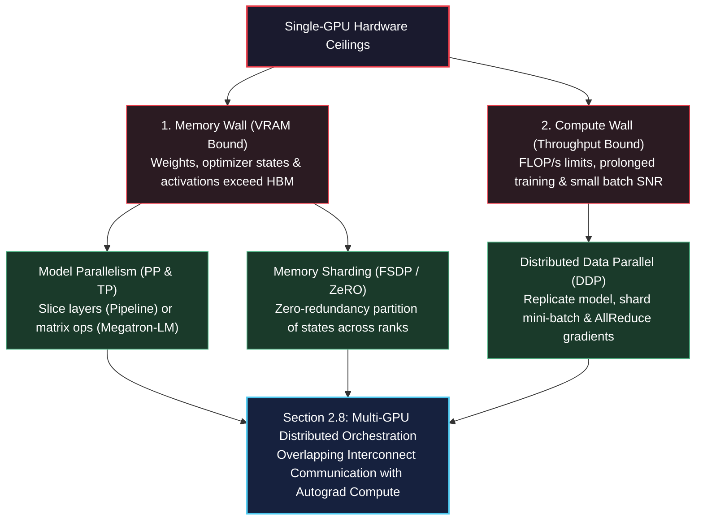
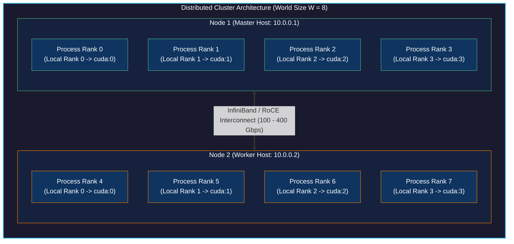
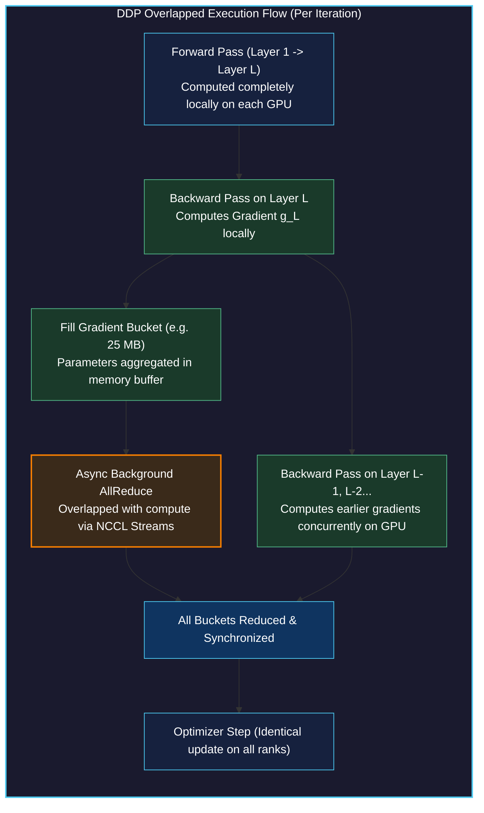
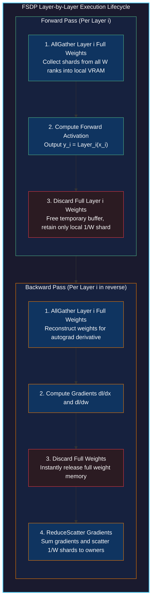
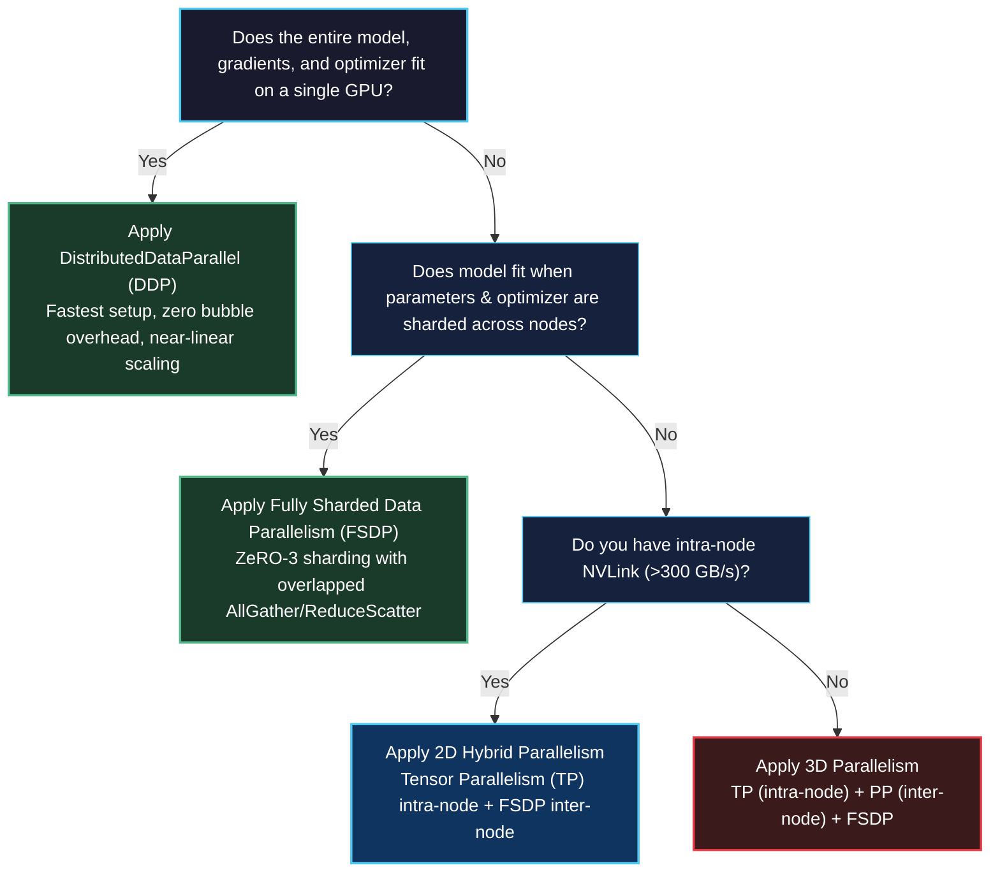

# Training Models on Multiple GPUs

<!-- toc -->

---

## 1. Scaling Beyond a Single GPU: The Distributed Computing Mandate

In Sections 2.3 through 2.7, we engineered a complete clinical computer-aided detection (CAD) pipeline for lung cancer screening. We extracted calibrated volumetric Hounsfield unit tensors from raw 3D CT scans, formulated candidate proposal segmentation networks, and trained deep 3D convolutional classification models. Throughout those experiments, all model parameters, intermediate activation tensors, and autograd dynamic computational graphs resided on a **single graphics processing unit (GPU)**.

However, modern deep learning research quickly collides with fundamental physical hardware ceilings:
1. **Volumetric & Spatial VRAM Limits:** In Section 2.7, processing full 3D CT scans ($512 \times 512 \times 400$ voxels) on a single accelerator forced us to either slice volumes into 2D axial planes or restrict 3D candidate crops to small $32 \times 48 \times 48$ subvolumes due to the strict 16 GB to 80 GB VRAM boundary.
2. **Computational Latency & Wall-Clock Bottlenecks:** Training large vision backbones (such as Vision Transformers) or 3D dense networks across hundreds of gigabytes of medical scans takes days or weeks on a single GPU.
3. **Parameter Footprint Explosion:** Modern foundation models, diffusion architectures (Section 2.2), and generative transformers (Section 2.1) range from 7 billion to hundreds of billions of parameters. Storing model weights, AdamW optimizer states, and forward activations requires hundreds of gigabytes of high-bandwidth memory (HBM)—far exceeding the capacity of any individual accelerator.

To scale our engineering workflows beyond single-device constraints, we must transition to **Distributed Deep Learning**. In Section 2.8, we investigate the mathematical foundations, collective communication primitives, and systems architectures required to orchestrate training across multiple GPUs and multiple server nodes.



> **Key Insight:** Distributed deep learning is fundamentally an exercise in navigating the trade-off between **compute throughput** and **interconnect communication overhead**. Achieving near-linear scaling requires overlapping tensor communications directly with autograd computation.

---

## 2. Distributed Computing Foundations & Topology

Before writing distributed PyTorch code, we must establish a rigorous vocabulary describing computing topologies, process hierarchies, and hardware interconnect fabrics.

<figure style="display:flex; justify-content: center; margin: 25px 0;">
  <div style="text-align: center;">
    
    <figcaption style="margin-top: 0.6em; text-align: center; font-size: 13px; color: #888;"><em>Figure 1: Distributed processor topologies. Left: Single process execution on an isolated accelerator. Center: Single machine multi-GPU setup with 4 local ranks (Rank 0 to 3) inside one node. Right: Multimachine cluster spanning Node 1 (Rank 0–3, Local Rank 0–3) and Node 2 (Rank 4–7, Local Rank 0–3).</em></figcaption>
  </div>
</figure>

### 2.1 Core Terminology: World Size, Rank, and Local Rank

A distributed PyTorch program operates as a cluster of concurrent processes collaborating across a communication mesh:

- **Node (Machine):** A physical server motherboard containing its own CPU sockets, system RAM, network interface cards (NICs), and PCIe slots holding one or more GPUs.
- **World Size ($W$):** The total integer count of participating worker processes across the entire distributed cluster. If a cluster contains $N$ machines with $G$ GPUs each, the total world size is:

$$ W = N \times G $$

- **Rank ($r$):** The unique global integer identifier assigned to each process in the distributed group, satisfying:

$$ r \in \{0, 1, 2, \dots, W - 1\} $$

  Process $r = 0$ is traditionally designated as the **Master Rank** (or Coordinator Rank), responsible for coordinating rendezvous discovery, logging global metrics, and saving master checkpoint binaries.
- **Local Rank ($l$):** The zero-indexed position of a worker process relative only to the specific physical node it resides on:

$$ l \in \{0, 1, \dots, G - 1\} $$

  For example, in a 2-node cluster with 4 GPUs per node ($W = 8$), the process executing on Node 2 with global rank $r = 5$ has local rank $l = 1$, which maps directly to hardware device `cuda:1` on that physical motherboard.



### 2.2 Hardware Interconnects: NVLink, PCIe, and InfiniBand

The choice of physical interconnect strictly governs which distributed parallelism strategy is viable:

| Interconnect Technology | Physical Scope | Unidirectional Bandwidth | Typical Round-Trip Latency | Ideal Parallelism Strategy |
| :--- | :--- | :--- | :--- | :--- |
| **PCIe Gen4 / Gen5** | Intra-Node (Motherboard Bus) | $32\text{--}64\text{ GB/s}$ | $\sim 1\text{--}2\ \mu\text{s}$ | Data Parallelism (DDP) |
| **NVIDIA NVLink / NVSwitch** | Intra-Node (Dedicated Mesh) | $300\text{--}900\text{ GB/s}$ | $< 1\ \mu\text{s}$ | Tensor Parallelism (TP), FSDP |
| **InfiniBand (HDR/NDR) / RoCE** | Inter-Node (Network Fabric) | $25\text{--}50\text{ GB/s}$ ($200\text{--}400\text{ Gbps}$) | $\sim 2\text{--}5\ \mu\text{s}$ | Data Parallelism (DDP), Pipeline Parallelism (PP) |
| **Standard Ethernet (1GbE/10GbE)** | Inter-Node (Standard LAN) | $0.125\text{--}1.25\text{ GB/s}$ | $\sim 50\text{--}100\ \mu\text{s}$ | Asynchronous Training, Small DDP |

---

## 3. Process Lifecycle & Bootstrapping: From `mp.spawn` to `torchrun`

Transforming a single-device script into a distributed cluster execution follows a strict three-phase lifecycle: process creation, communication rendezvous, and distributed-aware training execution.

<figure style="display:flex; justify-content: center; margin: 25px 0;">
  <div style="text-align: center;">
    
    <figcaption style="margin-top: 0.6em; text-align: center; font-size: 13px; color: #888;"><em>Figure 2: The distributed initialization lifecycle. 1. Spawning individual OS processes for each rank. 2. Bootstrapping communication through a shared key-value store (TCPStore) on Rank 0. 3. Transforming standard sequential training logic into distributed-aware replicated execution.</em></figcaption>
  </div>
</figure>

### 3.1 Step 1 & 2: Process Spawning and TCPStore Rendezvous

In Python, each participating rank must run in its own independent operating system process to bypass the Python Global Interpreter Lock (GIL). In early PyTorch workflows, developers explicitly spawned processes using `torch.multiprocessing`:

The code below initializes a distributed cluster using `torch.multiprocessing.spawn` and sets up a `dist.TCPStore` instance on the master node so that worker ranks can register their network addresses:

```python
import os
import torch
import torch.distributed as dist
import torch.multiprocessing as mp

def init_process_with_store(rank: int, world_size: int, backend: str = "gloo"):
    """
    Manually bootstraps a distributed process group using TCPStore rendezvous.
    Processes connect to MASTER_ADDR:MASTER_PORT where Rank 0 hosts the store.
    """
    master_addr = os.environ.get("MASTER_ADDR", "localhost")
    master_port = int(os.environ.get("MASTER_PORT", "12355"))
    
    # Instantiate the key-value store for process group rendezvous
    store = dist.TCPStore(
        host_name=master_addr,
        port=master_port,
        world_size=world_size,
        is_master=(rank == 0)
    )
    
    # Initialize the default distributed process group
    dist.init_process_group(
        backend=backend,
        store=store,
        rank=rank,
        world_size=world_size
    )
    
    print(f"[Rank {rank}/{world_size}] Initialized successfully with backend: {backend}")
    
    # Synchronize all processes to guarantee clean cluster startup
    dist.barrier()
    
    # Tear down communication channels when execution finishes
    dist.destroy_process_group()

if __name__ == "__main__":
    num_processes = 4
    os.environ["MASTER_ADDR"] = "localhost"
    os.environ["MASTER_PORT"] = "12355"
    
    # mp.spawn automatically passes the process index (0 to num_processes - 1) as argument 1
    mp.spawn(
        init_process_with_store,
        args=(num_processes, "gloo"),
        nprocs=num_processes,
        join=True
    )
```

### 3.2 Step 3: Modern Distributed Orchestration via `torchrun`

While `mp.spawn` is instructive for understanding low-level process creation, modern production distributed PyTorch relies on the **`torchrun`** command-line utility. 

`torchrun` eliminates manual store initialization, automatically detects hardware accelerators, sets cluster environment variables (`RANK`, `LOCAL_RANK`, `WORLD_SIZE`, `MASTER_ADDR`, `MASTER_PORT`), and provides automatic fault tolerance with elastic worker restarting:

```bash
# Launch a 4-process distributed training job on a single machine
torchrun --standalone --nproc-per-node=4 train_distributed.py

# Launch on a multi-node cluster (executing on Node 1 with 2 total nodes)
torchrun --nproc-per-node=8 \
         --nnodes=2 \
         --node-rank=0 \
         --master-addr="10.0.0.1" \
         --master-port=29500 \
         train_distributed.py
```

Inside `train_distributed.py`, the initialization code shrinks to a clean, minimal contract:

```python
import os
import torch
import torch.distributed as dist

def init_distributed():
    """
    Standard production distributed initialization reading environment variables
    injected automatically by the torchrun launcher.
    """
    # Initialize process group; backend defaults to 'nccl' on CUDA, 'gloo' on CPU
    backend = "nccl" if torch.cuda.is_available() else "gloo"
    dist.init_process_group(backend=backend)
    
    local_rank = int(os.environ["LOCAL_RANK"])
    global_rank = int(os.environ["RANK"])
    world_size = int(os.environ["WORLD_SIZE"])
    
    if torch.cuda.is_available():
        # Bind the current process to its dedicated physical GPU device
        torch.cuda.set_device(local_rank)
        device = torch.device(f"cuda:{local_rank}")
    else:
        device = torch.device("cpu")
        
    print(f"[Rank {global_rank}/{world_size}] Bound to local accelerator device: {device}")
    return device, global_rank, local_rank, world_size
```

### 3.3 Communication Backends: NCCL vs. Gloo

The `backend` argument in `dist.init_process_group` designates the underlying low-level transport engine:
- **`nccl` (NVIDIA Collective Communications Library):** The gold standard for GPU-to-GPU communication. Implements hardware-accelerated Ring-AllReduce and Tree-AllReduce algorithms over NVLink and InfiniBand with GPUDirect RDMA (Remote Direct Memory Access, bypassing host CPU RAM entirely).
- **`gloo`:** A portable collective communications library developed by Meta. Required for CPU-only clusters or testing environments (such as Windows environments lacking native NCCL support). While Gloo can technically handle GPU tensors, it does so by staging tensors through host CPU RAM, incurring severe PCIe latency penalties.

---

## 4. Collective Communication Primitives

Distributed deep learning algorithms do not exchange ad-hoc point-to-point messages; they rely on structured mathematical operations termed **Collectives**. Every rank in the active `ProcessGroup` participates concurrently in collective operations.

<figure style="display:flex; justify-content: center; margin: 25px 0;">
  <div style="text-align: center;">
    
    <figcaption style="margin-top: 0.6em; text-align: center; font-size: 13px; color: #888;"><em>Figure 3: Core collective communication primitives. Left: Broadcast transmits a tensor from a single source rank (Rank 0) to all participating worker nodes. Right: AllReduce gathers individual tensors (T0, T1, T2, T3) from all ranks, applies a reduction operator (summation), and distributes the reduced result back to all ranks simultaneously.</em></figcaption>
  </div>
</figure>

### 4.1 Broadcast vs. AllReduce: Mechanics and Algorithms

The two foundational collectives illustrated above serve distinct functional purposes in training:

#### 1. Broadcast (One-to-All)
A single designated root rank (`src=0`) transmits its local tensor $\mathbf{T}\_0$ to every process in the group. Upon completion, every rank holds an exact replica of $\mathbf{T}\_0$:

$$ \mathbf{T}\_r \leftarrow \mathbf{T}\_{\text{src}}, \quad \forall r \in \{0, \dots, W-1\} $$

*Primary Application:* Synchronizing initial randomized model weights $\theta\_0$ across all workers at epoch 0 so every GPU starts from the exact same parameter coordinates.

#### 2. AllReduce (All-to-All Reduction)
Every rank starts with its own local tensor $\mathbf{T}\_r$. A specified associative reduction operator $\oplus$ (such as summation $\sum$ or average) combines the tensors element-wise across all ranks. The resulting reduced tensor $\mathbf{T}^*$ is copied back to all ranks:

$$ \mathbf{T}^* = \bigoplus\_{r=0}^{W-1} \mathbf{T}\_r = \sum\_{r=0}^{W-1} \mathbf{T}\_r $$

$$ \mathbf{T}\_r \leftarrow \mathbf{T}^*, \quad \forall r \in \{0, \dots, W-1\} $$

*Primary Application:* Synchronizing autograd gradient tensors ($\nabla\_\theta \mathcal{L}$) across all data-parallel replicas after every backward pass.

### 4.2 The Ring-AllReduce Algorithm & Bandwidth Optimality

Naively routing all tensors to Rank 0 for summation and broadcasting the result creates a fatal network bottleneck on Rank 0. Modern distributed systems execute **Ring-AllReduce**:

1. Logically arrange the $W$ ranks into a unidirectional ring: $\text{Rank } 0 \to \text{Rank } 1 \to \dots \to \text{Rank } (W-1) \to \text{Rank } 0$.
2. Split each tensor of size $M$ elements into $W$ equal chunks: $\mathbf{T} = [C_0, C_1, \dots, C_{W-1}]$, each of size $\frac{M}{W}$.
3. **Scatter-Reduce Phase ($W-1$ communication steps):** In step $k$, rank $r$ sends chunk $(r - k) \pmod W$ to rank $(r + 1)$ and simultaneously receives chunk $(r - k - 1) \pmod W$ from rank $(r - 1)$, accumulating received values into its local buffer. After $W-1$ steps, each rank holds the fully reduced sum of one chunk.
4. **AllGather Phase ($W-1$ communication steps):** Each rank transmits its fully reduced chunk around the ring so all ranks receive all reduced chunks.

The total volume of data transmitted by each rank across both phases is:

$$ \text{Data Transferred per Rank} = 2 \times \frac{W - 1}{W} \times M \approx 2M \quad (\text{as } W \to \infty) $$

> **Key Insight:** The network communication volume per GPU in Ring-AllReduce is completely **independent of the cluster size $W$**! Adding more GPUs to the cluster does not increase the per-GPU communication payload, providing optimal weak scaling.

### 4.3 Collective Operations in PyTorch Code

The snippet below demonstrates broadcast and all-reduce operations executing across ranks:

```python
import torch
import torch.distributed as dist

def run_collectives_demo(rank: int, world_size: int, device: torch.device):
    """
    Demonstrates broadcast and all_reduce collective communications in PyTorch.
    """
    # 1. Demonstration of Broadcast
    if rank == 0:
        # Rank 0 creates the definitive initialization payload
        payload = torch.tensor([42.0, 99.0, 108.0], dtype=torch.float32, device=device)
    else:
        # Other ranks allocate uninitialized receptor memory of identical shape and dtype
        payload = torch.zeros(3, dtype=torch.float32, device=device)
        
    print(f"Before Broadcast [Rank {rank}]: {payload}")
    
    # Broadcast from src=0 to all ranks in the group
    dist.broadcast(payload, src=0)
    print(f"After Broadcast [Rank {rank}]: {payload}")
    
    dist.barrier()
    
    # 2. Demonstration of AllReduce
    # Each rank generates a unique local tensor proportional to its rank ID
    local_tensor = torch.tensor([float(rank) + 1.0, float(rank) * 10.0], device=device)
    print(f"Before AllReduce [Rank {rank}]: {local_tensor}")
    
    # Sum elements across all ranks and distribute the sum to every rank
    dist.all_reduce(local_tensor, op=dist.ReduceOp.SUM)
    print(f"After AllReduce SUM [Rank {rank}]: {local_tensor}")
    
    # Calculate global average: divide by world size
    local_tensor /= world_size
    print(f"Global Average [Rank {rank}]: {local_tensor}")
```

---

## 5. Data Parallelism & DistributedDataParallel (DDP)

Data Parallelism is the most widespread and efficient distributed scaling strategy in deep learning. In this paradigm, **the entire model is replicated on every GPU**, while the global training dataset is partitioned into disjoint mini-batches across workers.

<figure style="display:flex; justify-content: center; margin: 25px 0;">
  <div style="text-align: center;">
    
    <figcaption style="margin-top: 0.6em; text-align: center; font-size: 13px; color: #888;"><em>Figure 4: The fundamental dilemma in Data Parallelism. If two identical model replicas process distinct mini-batches (D1 and D2), they generate distinct loss values (Loss 1 != Loss 2) and diverging autograd gradients. Executing optimizer.step() without communication causes the models to instantly diverge.</em></figcaption>
  </div>
</figure>

### 5.1 The Gradient Divergence Problem

Consider two worker devices ($W = 2$). At step $t$, both start with identical parameter weights $\theta\_t$:
- Worker 1 ingests mini-batch $\mathcal{B}\_1 \sim \mathcal{D}$ and computes loss $\mathcal{L}\_1(\theta\_t; \mathcal{B}\_1)$ and gradients $\mathbf{g}\_1 = \nabla\_\theta \mathcal{L}\_1$.
- Worker 2 ingests mini-batch $\mathcal{B}\_2 \sim \mathcal{D}$ and computes loss $\mathcal{L}\_2(\theta\_t; \mathcal{B}\_2)$ and gradients $\mathbf{g}\_2 = \nabla\_\theta \mathcal{L}\_2$.

Because $\mathcal{B}\_1 \neq \mathcal{B}\_2$, the individual gradients differ:

$$ \mathbf{g}\_1 \neq \mathbf{g}\_2 $$

If each worker immediately updates its local weights using an optimizer (e.g., SGD: $\theta\_{t+1}^{(i)} = \theta\_t - \eta \mathbf{g}\_i$), the two models immediately diverge into entirely separate parameter spaces:

$$ \theta\_{t+1}^{(1)} \neq \theta\_{t+1}^{(2)} $$

To maintain mathematical equivalence with a large single-GPU batch of size $B\_{\text{global}} = W \times B\_{\text{local}}$, workers must synchronize their gradients via an AllReduce average before updating weights:

$$ \bar{\mathbf{g}} = \frac{1}{W} \sum\_{i=1}^W \mathbf{g}\_i $$

$$ \theta\_{t+1} = \theta\_t - \eta \bar{\mathbf{g}} $$

### 5.2 Internal Architecture of `DistributedDataParallel` (DDP)

PyTorch provides two data-parallel wrappers: `torch.nn.DataParallel` (DP) and `torch.nn.parallel.DistributedDataParallel` (DDP). 

> [!WARNING]
> **Never use `torch.nn.DataParallel`:** `DataParallel` is a legacy single-process, multi-threaded wrapper subject to Python's GIL. It gathers all outputs on GPU 0 to calculate loss, creating severe GPU 0 memory imbalances and massive PCIe transmission bottlenecks. Always use multi-process **`DistributedDataParallel` (DDP)**.

DDP achieves high performance through two architectural mechanisms:
1. **Autograd Backward Hooks & Overlapping:** Rather than waiting for the entire backward pass to finish before starting network transfers, DDP registers autograd backward hooks on individual parameter tensors. The moment a layer finishes computing its gradients, DDP immediately dispatches an asynchronous non-blocking AllReduce call over the network while earlier layers are still computing their backward pass on the GPU.
2. **Gradient Bucketing:** Communicating millions of tiny gradient tensors individually incurs overwhelming network latency overhead. DDP groups parameters into contiguous memory buffers called **buckets** (typically 25 MB each). An AllReduce collective is triggered only when an entire bucket fills with computed gradients.



### 5.3 Deterministic Data Sharding with `DistributedSampler`

To ensure each rank ingests non-overlapping training samples, we wrap our `Dataset` inside a `torch.utils.data.distributed.DistributedSampler`.

The sampler splits the dataset indices into $W$ subsets. Calling `sampler.set_epoch(epoch)` before each training epoch guarantees deterministic yet diverse shuffling across epochs:

```python
import torch
import torch.nn as nn
from torch.utils.data import Dataset, DataLoader
from torch.utils.data.distributed import DistributedSampler
from torch.nn.parallel import DistributedDataParallel as DDP

def setup_ddp_training(rank: int, world_size: int, device: torch.device, dataset: Dataset):
    """
    Constructs a complete production DDP pipeline with DistributedSampler.
    """
    # 1. Instantiate the neural network and move it to the process-assigned GPU
    model = nn.Sequential(
        nn.Linear(128, 256),
        nn.ReLU(),
        nn.Linear(256, 10)
    ).to(device)
    
    # 2. Wrap model in DDP; broadcast_buffers=False prevents unnecessary buffer syncs
    ddp_model = DDP(
        model,
        device_ids=[device.index] if device.type == "cuda" else None,
        output_device=device.index if device.type == "cuda" else None,
        find_unused_parameters=False
    )
    
    # 3. Configure DistributedSampler for disjoint batch feeding
    sampler = DistributedSampler(
        dataset,
        num_replicas=world_size,
        rank=rank,
        shuffle=True,
        drop_last=True
    )
    
    # Critical: batch_size specifies samples PER GPU, not total cluster batch!
    loader = DataLoader(
        dataset,
        batch_size=32,
        sampler=sampler,
        num_workers=4,
        pin_memory=True
    )
    
    optimizer = torch.optim.AdamW(ddp_model.parameters(), lr=1e-3)
    criterion = nn.CrossEntropyLoss()
    
    # 4. Standard training loop with epoch seeding
    for epoch in range(5):
        # Mandatory: seeds the pseudo-random generator across ranks for this epoch
        sampler.set_epoch(epoch)
        ddp_model.train()
        
        for batch_idx, (inputs, targets) in enumerate(loader):
            inputs = inputs.to(device, non_blocking=True)
            targets = targets.to(device, non_blocking=True)
            
            optimizer.zero_grad()
            outputs = ddp_model(inputs)
            loss = criterion(outputs, targets)
            
            # Autograd backward: DDP hooks automatically trigger bucketed AllReduce
            loss.backward()
            
            # All gradients are now identical across all ranks
            optimizer.step()
```

---

## 6. Model Parallelism: Splitting Massive Architectures

While Data Parallelism replicates the model on every GPU, modern deep learning architectures often exceed the memory capacity of a single GPU.

### 6.1 The GPU Memory Consumption Breakdown

During training, GPU High Bandwidth Memory (HBM) is consumed by four distinct memory pools:
1. **Model Parameters ($\Phi$):** Storing weights in 32-bit floating point requires $4\Phi$ bytes (or $2\Phi$ bytes in FP16/BF16).
2. **Autograd Gradients:** Requires matching storage to model parameters ($4\Phi$ bytes in FP32).
3. **Optimizer States:** The standard AdamW optimizer maintains two 32-bit tracking moments per parameter (running first moment $m\_t$ and second moment $v\_t$) plus FP32 master weights, totaling **$12\Phi$ to $16\Phi$ bytes**!
4. **Intermediate Activations & KV Caches:** All forward intermediate activations required for backward gradient computation.

For a 7-billion parameter ($7\text{B}$) model:

$$ \text{Static Memory} \approx 4\Phi (\text{params}) + 4\Phi (\text{grads}) + 12\Phi (\text{AdamW}) = 20\Phi \approx 140\text{ GB} $$

A $140\text{ GB}$ footprint cannot fit onto an 80 GB NVIDIA H100 or A100 GPU. We must divide the model itself across multiple devices—a paradigm known as **Model Parallelism**.

<figure style="display:flex; justify-content: center; margin: 25px 0;">
  <div style="text-align: center;">
    
    <figcaption style="margin-top: 0.6em; text-align: center; font-size: 13px; color: #888;"><em>Figure 5: Model Parallelism fundamentals. Left: Original monolithic multi-layer neural network. Right: Model partitioning across 3 devices (Device 0, Device 1, Device 2). Only intermediate activation tensors cross physical device boundaries.</em></figcaption>
  </div>
</figure>

---

## 7. Pipeline Parallelism (PP) & Microbatching

When dividing a model across layers, consecutive layers are placed on separate accelerators: Device 0 computes layers 1 to $K$, Device 1 computes layers $K+1$ to $2K$, and so on. This approach is called **Pipeline Parallelism (PP)**.

However, naive inter-layer partitioning suffers from severe device under-utilization: while Device 1 is computing, Device 0 and Device 2 sit completely idle, waiting for activations. The fraction of wasted time is known as the **Pipeline Bubble**.

### 7.1 The Pipeline Bubble & Microbatching Mechanics

To reduce bubble overhead, Pipeline Parallelism splits each training mini-batch into $M$ smaller **microbatches**:
- As soon as Device 0 finishes the forward pass on Microbatch 0, it sends intermediate activations to Device 1 and immediately begins computing Microbatch 1.
- In modern **1F1B (One Forward, One Backward)** scheduling, devices alternate between executing one forward microbatch and one backward microbatch once the pipeline warms up, keeping activation memory bounded.

<figure style="display:flex; justify-content: center; margin: 25px 0;">
  <div style="text-align: center;">
    
    <figcaption style="margin-top: 0.6em; text-align: center; font-size: 13px; color: #888;"><em>Figure 6: Timeline schedule of Pipeline Parallelism across 3 ranks over time. Green blocks indicate forward passes on microbatches 0, 1, 2 cascading from Rank 0 down to Rank 2. Red blocks indicate backward passes cascading back up from Rank 2 to Rank 0.</em></figcaption>
  </div>
</figure>

### 7.2 Mathematical Formulation of the Pipeline Bubble

For a pipeline consisting of $K$ pipeline stages (devices) and $M$ microbatches, the theoretical bubble fraction $F\_{\text{bubble}}$ in a GPipe schedule is:

$$ F\_{\text{bubble}} = \frac{K - 1}{M + K - 1} $$

As the number of microbatches $M$ grows significantly larger than the stage count $K$ ($M \gg K$), the bubble fraction approaches zero:

$$ \lim\_{M \to \infty} F\_{\text{bubble}} = 0 $$

However, increasing $M$ increases the number of un-freed activation tensors stored in memory simultaneously, creating a direct trade-off between memory footprint and hardware efficiency.

---

## 8. Tensor Parallelism (TP) vs. Pipeline Parallelism

While Pipeline Parallelism partitions models **inter-layer** (between layers), **Tensor Parallelism (TP)** partitions individual weight matrices **intra-layer** (within each layer).

<figure style="display:flex; justify-content: center; margin: 25px 0;">
  <div style="text-align: center;">
    
    <figcaption style="margin-top: 0.6em; text-align: center; font-size: 13px; color: #888;"><em>Figure 7: Pipeline Parallelism versus Tensor Parallelism. Top (Pipeline Parallelism): Distinct layers are placed sequentially on distinct GPUs (GPU 0 hosts Linear Layer 1; GPU 1 hosts Linear Layer 2). Bottom (Tensor Parallelism): Every individual linear layer is vertically sliced across GPU 0 and GPU 1.</em></figcaption>
  </div>
</figure>

### 8.1 The Megatron-LM Tensor Parallel Formulation

In deep networks, multi-layer perceptrons (MLPs) and self-attention projections are composed of consecutive matrix multiplications:

$$ \mathbf{Z} = \text{GELU}(\mathbf{X} \mathbf{W}\_1) \mathbf{W}\_2 $$

Megatron-LM parallelizes this operation across two devices by pairing a **Column-Parallel Linear layer** with a **Row-Parallel Linear layer**:

#### Step 1: Column-Parallel Projection
We split weight matrix $\mathbf{W}\_1 \in \mathbb{R}^{d\_{\text{in}} \times d\_{\text{mid}}}$ along its column dimension into two equal halves: $\mathbf{W}\_1 = [\mathbf{W}\_{1,1} \mid \mathbf{W}\_{1,2}]$. Both GPUs receive the full input $\mathbf{X}$ and compute their local projection independently without communication:

$$ \mathbf{Y}\_1 = \mathbf{X} \mathbf{W}\_{1,1}, \quad \mathbf{Y}\_2 = \mathbf{X} \mathbf{W}\_{1,2} $$

$$ \mathbf{A}\_1 = \text{GELU}(\mathbf{Y}\_1), \quad \mathbf{A}\_2 = \text{GELU}(\mathbf{Y}\_2) $$

#### Step 2: Row-Parallel Projection
We split the second weight matrix $\mathbf{W}\_2 \in \mathbb{R}^{d\_{\text{mid}} \times d\_{\text{out}}}$ along its row dimension:

$$ \mathbf{W}\_2 = \begin{bmatrix} \mathbf{W}\_{2,1} \\\\ \mathbf{W}\_{2,2} \end{bmatrix} $$

Each GPU computes its local matrix product:

$$ \mathbf{Z}\_1 = \mathbf{A}\_1 \mathbf{W}\_{2,1}, \quad \mathbf{Z}\_2 = \mathbf{A}\_2 \mathbf{W}\_{2,2} $$

The mathematical sum of the two products yields the exact global result:

$$ \mathbf{Z} = \mathbf{Z}\_1 + \mathbf{Z}\_2 = \mathbf{A}\_1 \mathbf{W}\_{2,1} + \mathbf{A}\_2 \mathbf{W}\_{2,2} $$

To produce $\mathbf{Z}$, the two GPUs execute a single **AllReduce (SUM)** collective.

> **Key Architectural Insight:** Across a two-layer MLP block, Tensor Parallelism requires only **one AllReduce communication** in the forward pass and **one AllReduce communication** in the backward pass!

### 8.2 Architectural Trade-Offs: TP vs. PP

| Characteristic | Tensor Parallelism (TP) | Pipeline Parallelism (PP) |
| :--- | :--- | :--- |
| **Partitioning Axis** | Intra-layer (splits matrices) | Inter-layer (splits layers) |
| **Communication Frequency** | Every single layer (high frequency) | Once per pipeline stage (low frequency) |
| **Communication Volume** | High volume of activation slices | Small boundary activation tensors |
| **Hardware Requirement** | **Strictly intra-node NVLink** ($>300\text{ GB/s}$) | Inter-node InfiniBand / PCIe ($25\text{--}50\text{ GB/s}$) |
| **Bubble Overhead** | Zero bubble overhead ($F\_{\text{bubble}} = 0$) | Bubbles exist ($F\_{\text{bubble}} = \frac{K-1}{M+K-1}$) |
| **Scalability Limit** | Typically capped at 8 GPUs (single node) | Scales across dozens of physical nodes |

---

## 9. N-Dimensional Parallelism & PyTorch `DeviceMesh`

Real-world foundation models cannot rely solely on one parallelism strategy; they compose multiple techniques simultaneously in a multi-dimensional grid.

For instance, an 8-GPU node cluster can be organized into a **2D Device Mesh** combining Data Parallelism across replicas and Tensor Parallelism across model partitions.

<figure style="display:flex; justify-content: center; margin: 25px 0;">
  <div style="text-align: center;">
    
    <figcaption style="margin-top: 0.6em; text-align: center; font-size: 13px; color: #888;"><em>Figure 8: A (2, 4) 2D Device Mesh. The mesh consists of 2 data-parallel replica rows (X1 and X2) and 4 model-parallel column partitions (M1, M2, M3, M4). Communication across Dimension 0 coordinates model parallelism, while communication across Dimension 1 synchronizes data-parallel replicas.</em></figcaption>
  </div>
</figure>

### 9.1 PyTorch 2.x `init_device_mesh` Implementation

PyTorch 2.x introduced the **`DeviceMesh`** abstraction to eliminate tedious manual calculation of process ranks and communicators.

The code below configures a 2D `(2, 4)` device mesh spanning 8 GPUs:

```python
import os
import torch
import torch.distributed as dist
from torch.distributed.device_mesh import init_device_mesh

def setup_2d_device_mesh():
    """
    Initializes a 2D DeviceMesh with 2 data-parallel replicas and 4 tensor-parallel ranks.
    Requires an 8-GPU cluster launched via torchrun --nproc-per-node=8.
    """
    dist.init_process_group(backend="nccl")
    local_rank = int(os.environ["LOCAL_RANK"])
    torch.cuda.set_device(local_rank)
    
    # Construct a 2D mesh grid of shape (2, 4)
    # Dimension 0 ('dp'): 2 data-parallel groups of size 4
    # Dimension 1 ('tp'): 4 tensor-parallel groups of size 2
    mesh_2d = init_device_mesh(
        device_type="cuda",
        mesh_shape=(2, 4),
        mesh_dim_names=("dp", "tp")
    )
    
    dp_group = mesh_2d["dp"]
    tp_group = mesh_2d["tp"]
    
    print(f"[Rank {dist.get_rank()}] Full Mesh: {mesh_2d}")
    print(f"[Rank {dist.get_rank()}] DP Sub-Mesh: {dp_group}, TP Sub-Mesh: {tp_group}")
    
    return mesh_2d
```

---

## 10. Fully Sharded Data Parallelism (FSDP / ZeRO)

While traditional DDP replicates all weights, gradients, and optimizer states across every GPU, **Fully Sharded Data Parallelism (FSDP)**—based on the DeepSpeed **ZeRO-3 (Zero Redundancy Optimizer)** paper—shards all three state components across data-parallel ranks.

### 10.1 The ZeRO Memory Sharding Hierarchy

The ZeRO protocol defines three progressive levels of memory de-duplication:
1. **ZeRO-1 ($\text{P}\_{\text{os}}$):** Optimizer states are partitioned across $W$ ranks ($4\times$ memory reduction).
2. **ZeRO-2 ($\text{P}\_{\text{os+g}}$):** Optimizer states and autograd gradients are both partitioned ($8\times$ memory reduction).
3. **ZeRO-3 / FSDP ($\text{P}\_{\text{os+g+p}}$):** Optimizer states, gradients, and **model parameters** are all partitioned across $W$ ranks. Each GPU stores only $\frac{1}{W}$ of the entire model footprint during resting state!



### 10.2 Modern PyTorch 2.x `fully_shard` API

In PyTorch 2.x, FSDP was completely redesigned into the clean, composable `fully_shard` API:

```python
import torch
import torch.nn as nn
from torch.distributed.device_mesh import init_device_mesh
from torch.distributed.fsdp import fully_shard

class DeepTransformerBlock(nn.Module):
    def __init__(self, dim: int = 1024):
        super().__init__()
        self.fc1 = nn.Linear(dim, dim * 4)
        self.relu = nn.ReLU()
        self.fc2 = nn.Linear(dim * 4, dim)

    def forward(self, x: torch.Tensor) -> torch.Tensor:
        return x + self.fc2(self.relu(self.fc1(x)))

def apply_fsdp_sharding(model: nn.Module, mesh):
    """
    Shards sub-modules individually and then shards the top-level container.
    """
    # 1. Shard individual building blocks for fine-grained forward AllGather/freeing
    for module in model.modules():
        if isinstance(module, DeepTransformerBlock):
            fully_shard(module, mesh=mesh)
            
    # 2. Shard root model container
    fully_shard(model, mesh=mesh)
    return model
```

---

## 11. Advanced LLM Parallelisms: Context & Expert Parallelism

When training generative transformers (Section 2.1) on extreme sequence lengths or sparse architectures, two specialized distributed strategies become indispensable:

### 11.1 Context Parallelism (CP) and Ring Attention
Standard multi-head attention scales quadratically with sequence length $L$:

$$ \text{Memory}\_{\text{attn}} = \mathcal{O}(L^2) $$

When processing 128k or 1M token documents, a single accelerator's memory is exhausted simply storing the attention score matrix $\mathbf{Q} \mathbf{K}^T$.

**Context Parallelism** partitions the sequence dimension $L$ across $C$ ranks so that each GPU holds only $\frac{L}{C}$ tokens. Using **Ring Attention**, each GPU computes attention queries $\mathbf{Q}$ locally while rotating key $\mathbf{K}$ and value $\mathbf{V}$ blocks around an intra-node ring, maintaining causal masking invariants while dividing peak activation memory by $C$.

### 11.2 Expert Parallelism (EP) for Mixture-of-Experts (MoE)
In modern sparse Mixture-of-Experts architectures (such as Mixtral or DeepSeek-V3), feed-forward layers are replaced with an ensemble of $E$ specialized expert networks. 

**Expert Parallelism** assigns different expert subnetworks to different physical GPUs. During the forward pass, a learned router assigns tokens to specific experts; tokens are dispatched across GPUs using high-speed **`All-to-All`** collective communications and recombined post-computation.

---

## 12. Production Distributed Systems: TorchTitan & Summary

Orchestrating 3D/4D hybrid parallelism (combining DDP, FSDP, TP, PP, and CP) in production requires clean engineering frameworks. To showcase native, un-bloated PyTorch 2.x distributed scaling, the Meta PyTorch team released **TorchTitan** (`github.com/pytorch/torchtitan`).

TorchTitan provides clean reference implementations of LLaMA 3 and modern transformer architectures scaled across thousands of GPUs using only pure upstream PyTorch primitives without third-party wrapper bloat.

### 12.1 Distributed Parallelism Decision Matrix

When architecting a distributed system, select strategies based on model parameter count, cluster scale, and interconnect speed:

| Model Scale | Single GPU Feasible? | Recommended Parallelism Strategy | Critical Interconnect Requirement |
| :--- | :---: | :--- | :--- |
| **&lt; 1B Parameters** (e.g. LUNA 3D CNNs) | Yes | **DistributedDataParallel (DDP)** | Standard PCIe / 10GbE Network |
| **1B – 15B Parameters** (e.g. LLaMA-3 8B) | No | **FSDP (ZeRO-3)** | PCIe Gen4/5 or Intra-Node NVLink |
| **15B – 70B Parameters** | No | **2D Hybrid: FSDP + Tensor Parallelism (TP)** | Intra-Node NVLink + Inter-Node InfiniBand |
| **&gt; 70B Parameters** | No | **3D/4D Hybrid: FSDP + TP + PP (+ CP)** | Full NVLink NVSwitch + Multi-Rail InfiniBand |


