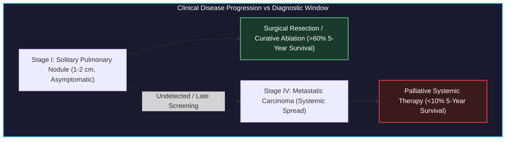
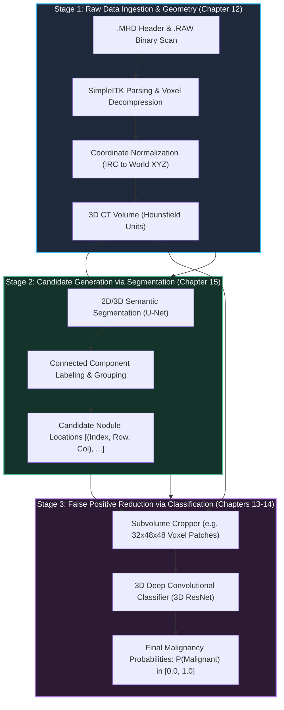
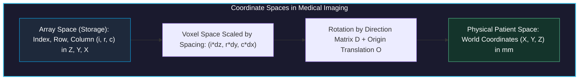

# Using PyTorch to Fight Cancer

<!-- toc -->

<div style="margin-bottom: 20px;">
  <a href="https://colab.research.google.com/github/emreaslan7/ai/blob/main/notebooks/deep-learning-with-pytorch/11-using-pytorch-to-fight-cancer.ipynb" target="_blank">
    
  </a>
</div>

---

## 1. The Clinical Problem: Lung Cancer & The LUNA Grand Challenge

Lung cancer is the leading cause of cancer-related mortality worldwide, accounting for roughly 1.8 million deaths annually. The clinical tragedy of lung cancer lies in its asymptomatic progression: early-stage pulmonary nodules rarely cause discomfort, meaning the majority of patients are diagnosed only after malignant cells have metastasized to regional lymph nodes or distant organs, dropping five-year survival rates precipitously from over 60% down to less than 10%.



When low-dose helical Computerized Tomography (CT) screening was validated by the National Lung Screening Trial (NLST), evidence confirmed that proactive screening reduced lung cancer mortality by 20%. However, this diagnostic advantage introduced a severe radiologist bottleneck:
1. **Volumetric Information Overload:** A modern high-resolution thoracic CT scan comprises hundreds of axial slices per patient, producing millions of individual voxels that a human expert must visually inspect.
2. **False-Positive Fatigue:** The overwhelming majority (frequently $>95\%$) of tiny candidate tissue clusters identified during initial screening are benign granulomas, intrapulmonary lymph nodes, or apical scars.
3. **Inter-Reader Variability:** Subtle visual cues differentiating an indolent benign hamartoma from an invasive adenocarcinoma (such as ground-glass opacity, lobulation, or coronal spiculation) often lead to discordant clinical opinions.

To catalyze automated computer-aided detection (CAD) systems, the academic and clinical research community assembled the **LUng Nodule Analysis (LUNA) Grand Challenge** (built upon the public LIDC-IDRI database). LUNA provides standardized, expert-annotated thoracic CT volumes alongside rigid evaluation metrics (such as the Free-Response Receiver Operating Characteristic, FROC), establishing the definitive benchmark for computer vision systems operating on volumetric medical imagery.

---

## 2. What Is a CT Scan, Exactly?

### 2.1 The Physics of X-Ray Computed Tomography

Unlike standard photography—which captures photons reflected off the opaque outer surface of objects across visible wavelengths—Computed Tomography measures the **attenuation** of high-energy electromagnetic radiation (X-rays, photon energy roughly $20\text{ to }140\text{ keV}$) as it penetrates through heterogeneous biological matter.

When a narrow beam of monoenergetic X-ray photons with initial incident intensity $I\_0$ travels a path length $x$ through a uniform medium with linear attenuation coefficient $\mu$, photon absorption and Compton scattering diminish beam intensity according to the classical **Beer-Lambert Law**:

$$ I = I\_0 \, e^{-\mu x} $$

In the human body, tissues possess continuously varying elemental compositions and physical densities $\rho(\mathbf{x})$, yielding a spatially continuous attenuation field $\mu(x, y, z)$. As the X-ray tube and detector array rotate synchronously around the patient's gantry, the detector records line integrals of attenuation (the **Radon Transform**):

$$ p(\theta, s) = \int\_{-\infty}^{\infty} \int\_{-\infty}^{\infty} \mu(x, y) \, \delta(x \cos\theta + y \sin\theta - s) \, dx \, dy $$

Applying the **Fourier Slice Theorem** and filtered backprojection (FBP) or iterative algebraic reconstruction algorithms, tomographic reconstruction algorithms reconstruct the internal 2D cross-sectional slice $\mu(x, y)$ from hundreds of 1D angular projection profiles.

<div style="text-align: center; margin: 25px 0;">
  
  <figcaption style="font-size: 0.9em; color: #888; margin-top: 8px;"><strong>Figure 11.1:</strong> Axial cross-section of an abdominal/lumbar CT scan showing anatomical soft tissue, cortical bone, intestinal gas, and baseline calibration phantom pellets positioned beneath the patient table.</figcaption>
</div>

### 2.2 The Hounsfield Unit (HU) Radiodensity Scale

Raw attenuation coefficients $\mu$ depend heavily on the X-ray tube peak kilovoltage ($kVp$) and beam hardening artifacts. To standardize readings across scanner manufacturers, imaging protocols, and hospital sites, Sir Godfrey Hounsfield established a calibrated, unitless radiodensity metric known as the **Hounsfield Unit (HU)**. 

The HU transformation maps physical attenuation linearly relative to the attenuation of distilled water ($\mu\_{\text{water}}$) and ambient air ($\mu\_{\text{air}} \approx 0$) under standard temperature and pressure:

$$ \text{HU} = 1000 \times \frac{\mu - \mu\_{\text{water}}}{\mu\_{\text{water}} - \mu\_{\text{air}}} $$

By international convention and physical definition:
- **Air:** $-1000\text{ HU}$ (minimal photon attenuation)
- **Lung Parenchyma (aerated alveoli):** $-900\text{ to }-500\text{ HU}$
- **Fat (Adipose Tissue):** $-120\text{ to }-90\text{ HU}$
- **Distilled Water:** $0\text{ HU}$ (the baseline reference)
- **Blood & Muscle / Soft Tissue:** $+20\text{ to }+50\text{ HU}$
- **Pulmonary Nodules / Solid Tumors:** $+30\text{ to }+100\text{ HU}$
- **Dense Cortical Bone:** $+500\text{ to }+1500\text{ HU}$
- **Metal Implants (Dental fills, surgical clips):** $+3000\text{ HU}$ and above

```mermaid
flowchart TD
    subgraph HUScale ["Hounsfield Unit (HU) Radiodensity Spectrum"]
        Air["Air (-1000 HU)"] --> Lung["Lung Tissue (-900 to -500 HU)"]
        Lung --> Fat["Adipose Tissue (-100 HU)"]
        Fat --> Water["Water Reference (0 HU)"]
        Water --> Soft["Soft Tissue / Blood (+30 to +60 HU)"]
        Soft --> Nodule["Solid Tumors / Nodules (+50 to +100 HU)"]
        Nodule --> Bone["Cortical Bone (+700 to +1500 HU)"]
    end
    style Air fill:#0f172a,stroke:#38bdf8,color:#fff
    style Lung fill:#1e293b,stroke:#0ea5e9,color:#fff
    style Water fill:#0284c7,stroke:#38bdf8,color:#fff
    style Soft fill:#1e3a5f,stroke:#60a5fa,color:#fff
    style Nodule fill:#b91c1c,stroke:#f87171,color:#fff
    style Bone fill:#475569,stroke:#cbd5e1,color:#fff
```



Because human visual perception cannot resolve the full dynamic range of roughly 4000 distinct Hounsfield values on an 8-bit display ($256$ grayscale levels), medical imaging software applies **Windowing** (Window Width $W$ and Window Level $L$):

$$ I\_{\text{display}} = \text{clip}\left( \frac{\text{HU} - (L - W/2)}{W} \times 255, \, 0, \, 255 \right) $$

For pulmonary nodule evaluation, radiologists select a **Lung Window** ($W = 1500, L = -600$), which expands aerated lung structures across full contrast while clipping dense mediastinal and bone structures to pure white ($255$).

---

## 3. 3D Volumetric Representation & Cartesian Space

A standard photographic image is a 2D matrix of square pixels indexed by row and column $(r, c)$. In contrast, a modern thoracic CT acquisition yields a 3D volumetric array of rectangular cuboids known as **voxels** (volume elements).

<div style="text-align: center; margin: 25px 0;">
  
  <figcaption style="font-size: 0.9em; color: #888; margin-top: 8px;"><strong>Figure 11.2:</strong> 3D volumetric bounding box rendering of a human thoracic CT scan in Cartesian patient coordinates $(X, Y, Z)$ up to $500 \times 500 \times 600\text{ mm}$, visualizing the rib cage, vertebral column, and bronchial tree.</figcaption>
</div>

### 3.1 Non-Isotropic Voxel Geometry

A critical difference between standard computer vision inputs and medical CT arrays is that CT voxels are frequently **non-isotropic** (the spatial resolution is not equal along all three spatial axes):
- **In-Plane Resolution ($\Delta x, \Delta y$):** Typically $0.6\text{ to }0.8\text{ mm}$ per pixel across a $512 \times 512$ axial slice grid.
- **Slice Thickness ($\Delta z$):** The distance between consecutive gantry acquisitions along the patient's cranio-caudal axis. In high-resolution screening protocols, $\Delta z$ ranges from $1.0\text{ mm}$ to $2.5\text{ mm}$, but older or routine clinical scans often possess slice thicknesses of $5.0\text{ mm}$.

If a deep neural network processes raw voxel arrays without accounting for voxel spacing $(\Delta z, \Delta y, \Delta x)$, a spherical $10\text{ mm}$ nodule will appear severely compressed or elongated along the $Z$-axis, distorting morphological features and degrading convolutional filter responses.

---

## 4. The Project Architecture: An End-to-End Cancer Detector

Directly feeding a full $512 \times 512 \times 400$ thoracic CT volume into a 3D convolutional neural network is computationally intractable. A single patient volume contains:

$$ 512 \times 512 \times 400 = 104,857,600 \text{ voxels} $$

At 32-bit floating point precision ($4\text{ bytes}$ per voxel), storing one volume in memory requires over $419\text{ MB}$ of VRAM. Retaining intermediate feature activations during backpropagation for modern deep 3D architectures (such as 3D ResNets) quickly exceeds the physical memory limits of even flagship datacenter GPUs ($80\text{ GB}$).

Furthermore, a typical solitary pulmonary nodule spans roughly $10\text{ to }15\text{ voxels}$ in diameter, occupying a microscopic volume of roughly $1000\text{ voxels}$—less than **0.001%** of the total scan volume. Designing a single model to find this tiny needle in a $105\text{ million}$ voxel haystack induces catastrophic class imbalance.

To resolve this challenge, the standard industry and literature approach decomposes the cancer detection task into an elegant **three-stage divide-and-conquer pipeline**:

<div style="text-align: center; margin: 25px 0;">
  
  <figcaption style="font-size: 0.9em; color: #888; margin-top: 8px;"><strong>Figure 11.3:</strong> Naive storybook architectural diagram of the complete three-stage LUNA lung cancer detection pipeline: Data Loading (.MHD/.RAW) $\to$ Candidate Segmentation $\to$ 3D CNN Classification.</figcaption>
</div>



### Breakdown of the Pipeline Stages:

1. **Stage 1 (Data Ingestion & Coordinate Geometry — Chapter 12):**
   Parse raw medical formats (`.mhd` / `.raw`), extract affine orientation and spacing matrices, normalize voxel intensities to standardized Hounsfield Units, and map coordinates between discrete array storage and millimeter patient space.
2. **Stage 2 (Candidate Generation via Segmentation — Chapter 15):**
   Deploy a fast semantic segmentation network (such as a 2D or 3D U-Net) to identify all high-density spherical candidates inside lung parenchyma. This stage is tuned for **near-100% sensitivity (recall)**: we accept thousands of false alarms (blood vessel bifurcations, bronchial wall thickenings) to ensure zero true malignant nodules are overlooked.
3. **Stage 3 (False Positive Reduction & Classification — Chapters 13 & 14):**
   Extract compact 3D bounding cubes (e.g., $32 \times 48 \times 48\text{ voxels}$) centered precisely at each candidate location. A specialized 3D Convolutional Neural Network evaluates fine-grained volumetric texture, boundary spiculation, internal calcification patterns, and surrounding vascular attachments to filter out benign structures and assign calibrated malignancy scores.

---

## 5. What Is a Nodule? Anatomy & Morphology

Clinically, a **pulmonary nodule** is defined as a well-circumscribed, roughly spherical radiographic opacity with a diameter of up to $30\text{ mm}$ surrounded by aerated lung tissue. Lesions larger than $30\text{ mm}$ are classified as **pulmonary masses** and carry a dramatically higher statistical probability of active malignancy.

<div style="text-align: center; margin: 25px 0;">
  
  <figcaption style="font-size: 0.9em; color: #888; margin-top: 8px;"><strong>Figure 11.4:</strong> Three orthogonal planar cross-sections through the same patient volume: Axial plane (Index 522, horizontal), Coronal plane (Row 267, frontal), and Sagittal plane (Col 367, lateral).</figcaption>
</div>

### 5.1 The Three Orthogonal Viewing Planes

Because a CT scan is a contiguous 3D volume, it can be resliced along any arbitrary geometric plane. Three anatomical orthogonal planes form the foundation of clinical radiology:
- **Axial (Transverse) Plane:** Slices perpendicular to the spine, looking upward from the patient's feet toward the head ($XY$-plane at constant $Z$, indexed as `Index`).
- **Coronal (Frontal) Plane:** Slices slicing through the body from chest to back ($XZ$-plane at constant $Y$, indexed as `Row`).
- **Sagittal (Lateral) Plane:** Slices dividing the patient into left and right halves ($YZ$-plane at constant $X$, indexed as `Col`).

Examining lesions across all three orthogonal projections is mandatory: a tubular blood vessel running along the axial plane may appear circular like a nodule on a single 2D slice, but coronal and sagittal views immediately expose its elongated, branching vascular geometry.

### 5.2 Sequential Multi-Slice Spherical Expansion

Because nodules are 3D spherical or ellipsoidal geometries, slicing sequentially through the volume reveals a distinct cross-sectional profile: the nodule appears as a faint point, grows symmetrically to its maximum equatorial diameter, and contracts until fading out of view.

<div style="text-align: center; margin: 25px 0;">
  
  <figcaption style="font-size: 0.9em; color: #888; margin-top: 8px;"><strong>Figure 11.5:</strong> Sequential axial Z-slices (slices 5 through 21) capturing a solitary pulmonary nodule expanding to peak cross-sectional area at slices 12-13 and contracting symmetrically.</figcaption>
</div>

### 5.3 Benign vs Malignant Pathological Indicators

Radiologists evaluate several subtle textural and structural features to differentiate benign lesions from malignant carcinomas:
- **Spiculation:** Sharp, needle-like radiating strands extending outward from the lesion margin into aerated lung parenchyma. Strongest clinical indicator of invasive malignancy.
- **Lobulation:** Scalloped, uneven contour lobes reflecting uneven clonal growth rates of malignant cells.
- **Calcification Patterns:** Dense central, concentric, or "popcorn" calcification patterns typically signify benign granulomas or hamartomas. Eccentric, stippled calcifications suggest malignancy.
- **Ground-Glass Opacity (GGO):** Hazy attenuation that does not obscure underlying bronchial structures and blood vessels, frequently associated with early adenocarcinoma in situ.

<div style="text-align: center; margin: 25px 0;">
  
  <figcaption style="font-size: 0.9em; color: #888; margin-top: 8px;"><strong>Figure 11.6:</strong> Multi-planar localization of a large malignant tumor with spiculation and cavitary structure. Top: Full thorax views (Axial, Coronal, Sagittal). Bottom: 48x48 voxel crops centered on the lesion.</figcaption>
</div>

---

## 6. The LUNA Grand Challenge Dataset Anatomy

The LUNA16 challenge dataset provides 888 thoracic CT scans categorized into 10 subsets (`subset0` through `subset9`).

### 6.1 MetaImage Format: `.mhd` Headers & `.raw` Binary Buffers

Rather than storing hundreds of separate DICOM files per patient, LUNA encodes each volume as a paired **MetaImage** dataset:
1. **`.mhd` (MetaImage Header):** A clean plain-text ASCII header file detailing dimensional metadata:
   - `DimSize = 512 512 360` (dimensions along X, Y, and Z)
   - `ElementType = MET_SHORT` (signed 16-bit integer, `int16`)
   - `ElementSpacing = 0.703125 0.703125 1.25` (physical voxel size in mm)
   - `Offset = -175.2 -175.2 -312.5` (origin of voxel `[0, 0, 0]` in patient mm space)
   - `TransformMatrix = 1 0 0 0 1 0 0 0 1` (direction cosine orientation)
   - `ElementDataFile = 1.3.6.1.4.1.14519.5.2.1.6279.6001.100225287222365630678668347788.raw`
2. **`.raw` (Binary Image Buffer):** Uncompressed, contiguous 1D binary buffer of signed 16-bit integers storing all voxels sequentially in row-major order.

### 6.2 Annotation Schema: Ground Truth vs Candidate Lists

LUNA provides two distinct CSV annotation files:
1. `annotations.csv`: Ground truth pulmonary nodules consensus-annotated by at least 3 out of 4 expert thoracic radiologists.
   - `seriesuid`: Unique patient scan identifier string.
   - `coordX, coordY, coordZ`: Exact spatial centroid of the nodule in millimeter patient space.
   - `diameter_mm`: Equivalent spherical diameter in millimeters.
2. `candidates.csv`: A comprehensive list of approximately 750,000 candidate locations generated by classical candidate filtering algorithms.
   - `seriesuid, coordX, coordY, coordZ`: Candidate centroid location.
   - `class`: Binary label (`0` for benign non-nodule/false alarm, `1` for true validated nodule). True positives account for roughly 1,351 out of 750,000 entries (a severe 1:550 imbalance).

---

## 7. Coordinate Geometry: From Array Indices to Millimeter Space

A frequent source of catastrophic bugs in medical deep learning pipelines is coordinate system confusion. Array indices in memory and physical patient locations in space do not share origin, orientation, or units.



### 7.1 Coordinate Definitions

- **Array Space ($I, R, C$):** Discrete 0-based integer indices indexing the 3D tensor buffer:
  - $I$ (`Index`): Slice along $Z$-axis (axial gantry position).
  - $R$ (`Row`): Row index along $Y$-axis (vertical dimension of axial image).
  - $C$ (`Column`): Column index along $X$-axis (horizontal dimension of axial image).
- **Physical World Space ($X, Y, Z$):** Continuous floating-point coordinates measured in millimeters relative to the scanner's physical origin isocenter:
  - $X$: Left $(-)$ to Right $(+)$ across the patient's body.
  - $Y$: Anterior / front $(-)$ to Posterior / back $(+)$.
  - $Z$: Inferior / feet $(-)$ to Superior / head $(+)$.

### 7.2 The Transformation Formulas

Given origin $\mathbf{O} = (O\_x, O\_y, O\_z)$, voxel spacing $\mathbf{s} = (s\_x, s\_y, s\_z)$, and direction matrix $\mathbf{D} \in \mathbb{R}^{3 \times 3}$, mapping an array index $\mathbf{v}\_{\text{irc}} = (i, r, c)^T$ (note the reverse order to $(c, r, i) = (x, y, z)$) to patient world coordinates $\mathbf{x}\_{\text{xyz}} = (x, y, z)^T$ follows the affine transformation:

$$ \mathbf{x}\_{\text{xyz}} = \mathbf{O} + \mathbf{D} \begin{bmatrix} c \cdot s\_x \\ r \cdot s\_y \\ i \cdot s\_z \end{bmatrix} $$

Assuming an identity orientation matrix $\mathbf{D} = \mathbf{I}\_3$ (standard for LUNA scans), the inverse mapping from millimeter patient space to discrete array indices is computed as:

$$ c = \text{round}\left( \frac{x - O\_x}{s\_x} \right), \quad r = \text{round}\left( \frac{y - O\_y}{s\_y} \right), \quad i = \text{round}\left( \frac{z - O\_z}{s\_z} \right) $$

---

## 8. Micro-Modular Implementation Walkthrough

Let us implement the core data structures and geometric transformations using PyTorch and NumPy.

### Step 1: Defining Coordinate Data Structures

We construct lightweight named tuples to prevent inversion bugs between $(X, Y, Z)$ and $(I, R, C)$ coordinate orders:

```python
from collections import namedtuple
import numpy as np
import torch

# Immutable, strongly-typed representations of our coordinate spaces
IrcTuple = namedtuple('IrcTuple', ['index', 'row', 'col'])
XyzTuple = namedtuple('XyzTuple', ['x', 'y', 'z'])
```

### Step 2: Bidirectional Coordinate Transformation Functions

Next, we define mathematical transform functions mapping between physical millimeter coordinates and discrete voxel array indices:

```python
def xyz2irc(coord_xyz: XyzTuple, origin_xyz: XyzTuple, vx_per_mm_xyz: XyzTuple, direction_mat: np.ndarray = None) -> IrcTuple:
    """
    Transforms continuous physical world millimeter coordinates (X, Y, Z)
    into discrete 3D array indices (Index, Row, Column).
    """
    # Offset from physical origin
    diff_x = coord_xyz.x - origin_xyz.x
    diff_y = coord_xyz.y - origin_xyz.y
    diff_z = coord_xyz.z - origin_xyz.z
    
    # Scale by voxels per millimeter (1 / spacing)
    col = int(round(diff_x * vx_per_mm_xyz.x))
    row = int(round(diff_y * vx_per_mm_xyz.y))
    index = int(round(diff_z * vx_per_mm_xyz.z))
    
    return IrcTuple(index=index, row=row, col=col)

def irc2xyz(coord_irc: IrcTuple, origin_xyz: XyzTuple, spacing_xyz: XyzTuple, direction_mat: np.ndarray = None) -> XyzTuple:
    """
    Transforms discrete 3D array indices (Index, Row, Column)
    into continuous physical world millimeter coordinates (X, Y, Z).
    """
    x = coord_irc.col * spacing_xyz.x + origin_xyz.x
    y = coord_irc.row * spacing_xyz.y + origin_xyz.y
    z = coord_irc.index * spacing_xyz.z + origin_xyz.z
    
    return XyzTuple(x=x, y=y, z=z)
```

### Step 3: Hounsfield Unit Windowing and Tensor Normalization

To prepare raw CT volumes for neural network ingestion, we construct a windowing function that clamps values to the standard clinical lung window $[-1000\text{ HU}, +400\text{ HU}]$ and normalizes intensities to the $[0.0, 1.0]$ range:

```python
def apply_lung_window(ct_tensor: torch.Tensor, min_hu: float = -1000.0, max_hu: float = 400.0) -> torch.Tensor:
    """
    Clamps raw CT Hounsfield Units to the standard lung window range
    and normalizes linearly to [0.0, 1.0].
    
    Args:
        ct_tensor (torch.Tensor): Raw voxel tensor in Hounsfield Units.
        min_hu (float): Lower HU bound (pure air = -1000).
        max_hu (float): Upper HU bound (mediastinum/bone = +400).
        
    Returns:
        torch.Tensor: Normalized floating-point tensor in [0.0, 1.0].
    """
    clamped = torch.clamp(ct_tensor, min=min_hu, max=max_hu)
    normalized = (clamped - min_hu) / (max_hu - min_hu)
    return normalized
```

### Step 4: Extracting Fixed 3D Candidate Subvolumes for PyTorch

Finally, given a candidate coordinate $(I, R, C)$, we extract a fixed cubic bounding patch (e.g., $32 \times 48 \times 48\text{ voxels}$) suitable for direct feeding into a 3D PyTorch convolution layer:

```python
def extract_candidate_subvolume(
    ct_volume: torch.Tensor,
    center_irc: IrcTuple,
    crop_shape_irc: tuple = (32, 48, 48)
) -> torch.Tensor:
    """
    Extracts a 3D subvolume tensor centered at center_irc, padding with air (-1000 HU)
    if the crop boundary exceeds the scan volume dimensions.
    
    Returns:
        torch.Tensor: Tensor with shape (1, 1, Depth, Height, Width) ready for 3D CNNs.
    """
    half_i = crop_shape_irc[0] // 2
    half_r = crop_shape_irc[1] // 2
    half_c = crop_shape_irc[2] // 2
    
    pad_i = max(0, half_i - center_irc.index)
    pad_r = max(0, half_r - center_irc.row)
    pad_c = max(0, half_c - center_irc.col)
    
    start_i = max(0, center_irc.index - half_i)
    end_i = min(ct_volume.shape[0], center_irc.index + half_i)
    
    start_r = max(0, center_irc.row - half_r)
    end_r = min(ct_volume.shape[1], center_irc.row + half_r)
    
    start_c = max(0, center_irc.col - half_c)
    end_c = min(ct_volume.shape[2], center_irc.col + half_c)
    
    subvolume = ct_volume[start_i:end_i, start_r:end_r, start_c:end_c]
    
    # Pad to exact crop_shape if near scan boundaries
    subvolume_padded = torch.nn.functional.pad(
        subvolume,
        (
            max(0, half_c - (center_irc.col - start_c)),
            max(0, half_c - (end_c - center_irc.col)),
            max(0, half_r - (center_irc.row - start_r)),
            max(0, half_r - (end_r - center_irc.row)),
            max(0, half_i - (center_irc.index - start_i)),
            max(0, half_i - (end_i - center_irc.index)),
        ),
        value=-1000.0 # Pad with air HU
    )
    
    # Reshape to (Batch, Channel, Depth, Height, Width)
    return subvolume_padded.unsqueeze(0).unsqueeze(0)
```

---

## 9. Summary & Looking Ahead to Chapter 12

In this chapter, we established the foundational principles of medical computerized tomography and the end-to-end lung cancer detection problem:
1. **CT Physics & Radiometry:** CT measures physical attenuation of X-rays, standardized into unitless Hounsfield Units (HU) relative to air ($-1000$) and water ($0$).
2. **Volumetric Geometry:** Thoracic CT scans are 3D arrays of non-isotropic voxels, requiring explicit conversion between discrete array indexing $(I, R, C)$ and continuous millimeter patient space $(X, Y, Z)$.
3. **The Divide-and-Conquer Architecture:** Due to extreme memory constraints ($>100\text{ million voxels}$) and severe class imbalance ($1:550$), the system splits the task into Data Ingestion (Ch. 12), Candidate Segmentation (Ch. 15), and 3D Classification (Ch. 13–14).

In **Chapter 12: Combining Data Sources into a Unified Dataset**, we will build a high-throughput, multi-threaded PyTorch `Dataset` that reads raw `.mhd` and `.raw` files using SimpleITK, caches parsed volumes to high-speed storage, and dynamically streams balanced candidate batches into our training loops.
