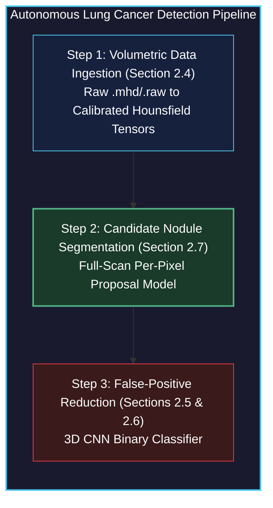
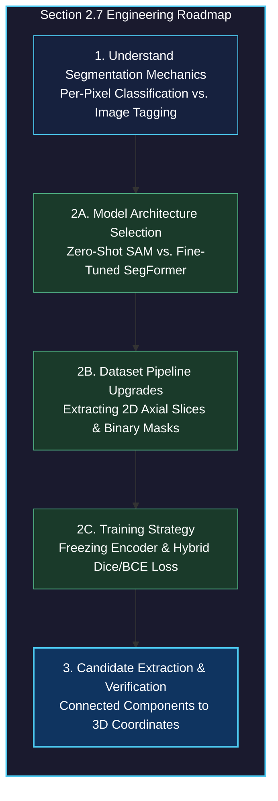

# Using Segmentation to Find Suspected Nodules

<!-- toc -->

<div style="margin-bottom: 20px;">
  <a href="https://colab.research.google.com/github/emreaslan7/ai/blob/main/notebooks/deep-learning-with-pytorch/15-using-segmentation-to-find-suspected-nodules.ipynb" target="_blank">
    
  </a>
</div>

---

## 1. The Cancer Detection Pipeline: Why Candidate Proposal is Essential

In Sections 2.5 and 2.6, we designed, trained, and optimized a 3D Convolutional Neural Network (`LunaModel`) capable of discriminating small volumetric crops into malignant tumors versus benign anatomical structures. Through precision-recall metrics and 3D affine data augmentations, we achieved an effective clinical classifier. 

However, that classifier operated under a massive foundational assumption: **it required candidate coordinate locations to be provided beforehand**. In the LUNA dataset, candidate locations were provided by expert radiologist annotations (`annotations.csv` and `candidates.csv`). 

In a genuine hospital radiology environment, when a patient undergoes a low-dose computed tomography (CT) scan, the system is handed raw volumetric data with zero annotations. A standard CT scan encompasses a volume of approximately $512 \times 512 \times 400$ voxels—roughly **100 million voxels**. If we were to slide our Section 2.5 3D classifier across every possible $32 \times 48 \times 48$ subvolume in the chest cavity, we would evaluate tens of millions of windows. This brute-force sliding-window approach suffers from two fatal flaws:
1. **Extreme Computational Latency:** Evaluating millions of 3D convolutional forward passes per patient would require tens of minutes of GPU compute per scan.
2. **False Positive Explosion:** Even with a 99.9% specificity rate, evaluating $10^7$ negative windows would produce $10{,}000$ false alarms per patient, completely overwhelming radiologists.

To build an autonomous clinical screening pipeline, we need an upstream model whose purpose is **candidate proposal**: scanning the entire volume rapidly to flag a small handful (e.g., 20–50) of high-suspicion regions. This is the domain of **Semantic Segmentation**.

<figure style="display:flex; justify-content: center; margin: 25px 0;">
  <div style="text-align: center;">
    
    <figcaption style="margin-top: 0.6em; text-align: center; font-size: 13px; color: #888;"><em>Figure 1: The complete 3-step CAD pipeline. Step 1 (Section 2.4) loads raw .mhd/.raw CT scans; Step 2 (Section 2.7, highlighted) uses semantic segmentation to propose candidate coordinate locations [(I, R, C), ...]; Step 3 (Sections 2.5 & 2.6) classifies candidate subvolumes into malignant nodules versus benign tissue.</em></figcaption>
  </div>
</figure>



> **Key Insight:** In computer-aided detection (CAD), segmentation acts as a high-recall filter. Its job is not to make the final diagnostic diagnosis, but to reduce the search space from 100 million voxels down to a few dozen candidate coordinates without missing genuine tumors.

---

## 2. Section 2.7 System Roadmap

To implement Step 2 of our pipeline, we navigate a structured engineering trajectory covering architectural concepts, data transformations, training mechanics, and inference candidate extraction.

<figure style="display:flex; justify-content: center; margin: 25px 0;">
  <div style="text-align: center;">
    
    <figcaption style="margin-top: 0.6em; text-align: center; font-size: 13px; color: #888;"><em>Figure 2: The Section 2.7 roadmap: 1. Segmentation architectures (U-Net and Vision Transformers); 2. Core pipeline updates (2A Model outputting masks, 2B Dataset feeding 2D slices, 2C Training with Dice/BCE loss); 3. Validation results and candidate coordinate generation.</em></figcaption>
  </div>
</figure>



---

## 3. Classification vs. Semantic Segmentation: The Per-Pixel Spatial Mandate

To understand why a dedicated segmentation model is necessary, consider the difference in output semantics between image-level classification and semantic segmentation.

<figure style="display:flex; justify-content: center; margin: 25px 0;">
  <div style="text-align: center;">
    
    <figcaption style="margin-top: 0.6em; text-align: center; font-size: 13px; color: #888;"><em>Figure 3: Classification vs. Segmentation. Left: Classification outputs a global image-level verdict ('CAT: YES') without spatial localization. Right: Semantic segmentation outputs a dense binary mask highlighting the exact pixel boundaries of the object ('CAT: HERE').</em></figcaption>
  </div>
</figure>

### 3.1 Mathematical Formulation of Output Spaces

In binary classification, the neural network maps an input image or volumetric tensor $\mathbf{X} \in \mathbb{R}^{C \times H \times W}$ to a single scalar probability representing class membership:

$$ f_{\text{cls}}(\mathbf{X}) = \hat{y} \in [0, 1] $$

In contrast, **Semantic Segmentation** performs dense, per-pixel (or per-voxel) classification. The network outputs a spatial probability map of identical height and width as the input:

$$ f_{\text{seg}}(\mathbf{X}) = \hat{\mathbf{M}} \in [0, 1]^{H \times W} $$

Where each individual element $\hat{\mathbf{M}}_{i, j}$ represents the conditional probability that pixel $(i, j)$ belongs to the target foreground class (the tumor nodule):

$$ \hat{\mathbf{M}}\_{i, j} = P(Y\_{i, j} = 1 \mid \mathbf{X}) $$

### 3.2 The Spatial Bottleneck in Standard Classification Networks

Why can't we simply use our classification CNN from Section 2.5 to tell us *where* the nodule is? 

Standard classification architectures rely on progressive spatial downsampling (strided convolutions and max pooling) to aggregate spatial contexts into higher-level semantic features (textures $\to$ object parts $\to$ semantic concepts). At the terminal end of the network, a Global Average Pooling or fully connected layer collapses all remaining spatial dimensions into a 1D vector:

<figure style="display:flex; justify-content: center; margin: 25px 0;">
  <div style="text-align: center;">
    
    <figcaption style="margin-top: 0.6em; text-align: center; font-size: 13px; color: #888;"><em>Figure 4: The spatial bottleneck in classification networks. Pixels pass through convolutional layers capturing textures and shapes, but pooling operations progressively collapse the 2D spatial grid into a 1D vector of category probabilities (Apple: No, Bear: No, Cat: Yes). Spatial coordinate information is irrecoverably discarded.</em></figcaption>
  </div>
</figure>

```markdown
Input: (C, H, W) ──> Conv/Pool ──> (C_1, H/2, W/2) ──> ... ──> (C_k, 1, 1) ──> Linear ──> (K classes)
```

Once the tensor is collapsed into a 1D vector of logits, spatial coordinates $(x, y)$ are destroyed. To preserve and reconstruct dense spatial coordinates, segmentation architectures require an **encoder-decoder topology** (such as U-Net or SegFormer) that downsamples for semantic context, then systematically upsamples back to the original resolution while maintaining spatial detail via skip connections or multi-scale attention.

---

## 4. Foundation Models in Vision: Meta's Segment Anything Model (SAM)

Historically, semantic segmentation required training fully convolutional networks (such as U-Net or DeepLabV3) from scratch on tens of thousands of manually labeled per-pixel masks. In 2023, Meta AI introduced the **Segment Anything Model (SAM)** (Kirillov et al.), representing a paradigm shift toward promptable foundation models for computer vision.

<figure style="display:flex; justify-content: center; margin: 25px 0;">
  <div style="text-align: center;">
    
    <figcaption style="margin-top: 0.6em; text-align: center; font-size: 13px; color: #888;"><em>Figure 5: Meta's SAM architecture. An Image Encoder (heavy ViT) converts the input image into spatial patch embeddings. A Prompt Encoder embeds point clicks or bounding boxes. A lightweight two-way Mask Decoder combines these embeddings to output candidate segmentation masks with ambiguity resolution.</em></figcaption>
  </div>
</figure>

### 4.1 SAM Architectural Breakdown

SAM is engineered as a three-component system designed for real-time promptable inference:

1. **Image Encoder (Heavy Backbone):**
   - Built on a Vision Transformer (ViT-B, ViT-L, or ViT-H) pretrained with Masked Autoencoders (MAE).
   - Ingests a high-resolution $1024 \times 1024$ image, divides it into $16 \times 16$ non-overlapping patches, and processes them through windowed self-attention blocks.
   - Outputs a spatial feature map of shape $64 \times 64 \times 256$ (a $\times 16$ downsampled dense image embedding).
   - *Computational characteristic:* Heavy compute footprint ($\approx 90\text{M}$ to $600\text{M}$ parameters), run only once per image.

2. **Prompt Encoder (Lightweight):**
   - Handles sparse prompts: foreground/background points, bounding boxes, or rough text prompts.
   - Points and boxes are encoded using positional embeddings combined with learned embeddings representing point types ($1 = \text{foreground click}, 0 = \text{background click}$).
   - Dense mask prompts are embedded via convolutional convolutions.
   - *Computational characteristic:* Extremely lightweight ($< 1\text{ ms}$ on CPU/GPU).

3. **Mask Decoder (Real-Time Fusion):**
   - A two-layer transformer decoder that performs two-way cross-attention: prompt tokens attend to image patch embeddings, and image embeddings attend back to prompt tokens.
   - **Ambiguity Resolution:** A single point prompt can legitimately denote multiple nested objects (e.g., clicking on a dog's nose could mean the whole dog, the snout, or just the nose tip). SAM's decoder simultaneously predicts 3 candidate masks at varying granularities along with an estimated IoU score.

### 4.2 Using SAM Off-the-Shelf for Point-Guided Segmentation

We can invoke SAM to segment anatomical structures zero-shot by providing an interactive point prompt. First, we install the official library from GitHub:

```bash
pip install git+https://github.com/facebookresearch/segment-anything.git
```

We instantiate SAM, load the pretrained weights (`sam_vit_b_01ec64.pth`), transfer to GPU, and initialize the `SamPredictor` wrapper:

```python
import torch
from segment_anything import sam_model_registry, SamPredictor

device = torch.device("cuda" if torch.cuda.is_available() else "cpu")

# Load ViT-Base checkpoint (91M parameters)
sam_checkpoint = "sam_vit_b_01ec64.pth"
model_type = "vit_b"

sam = sam_model_registry[model_type](checkpoint=sam_checkpoint)
sam.to(device=device)

# Initialize promptable predictor
predictor = SamPredictor(sam)
```

---

## 5. Volumetric Slicing: Bridging 3D CT Scans to 2D Foundation Models

A major architectural challenge in medical computer vision is the **dimensional mismatch**:
- Vision foundation models (SAM, SegFormer, CLIP, Stable Diffusion) are trained on massive datasets of **2D natural images** (e.g., SA-1B contains 11 million 2D images).
- Medical CT scans are **3D volumetric scalar fields** ($D \times H \times W$) representing tissue radiodensity.

True 3D foundation models do not exist at the scale of 2D models because 3D volumetric medical datasets are small and 3D memory footprints grow cubically ($O(N^3)$). To exploit the rich representational capacity of 2D foundation models, we systematically partition our 3D CT scans into **2D axial slices along the Z-axis**.

<figure style="display:flex; justify-content: center; margin: 25px 0;">
  <div style="text-align: center;">
    
    <figcaption style="margin-top: 0.6em; text-align: center; font-size: 13px; color: #888;"><em>Figure 6: Volumetric CT scan slicing. A continuous 3D volume is decomposed into sequential 2D axial planar slices along the cranial-caudal Z-axis, showing cranial structures at the top, mid-thoracic lung fields in the middle, and spinal/abdominal anatomy at the bottom.</em></figcaption>
  </div>
</figure>

### 5.1 Anatomical Coordinate Transformation

Recall from Section 2.4 that patient coordinates are expressed in millimeters $(x, y, z)_{\text{mm}}$ with respect to an arbitrary scanner origin. To extract the exact 2D axial slice containing a known nodule candidate, we convert the millimeter coordinates into integer voxel indices:

$$ i_z = \left\lfloor \frac{z_{\text{mm}} - z_{\text{origin}}}{s_z} \right\rceil, \quad i_r = \left\lfloor \frac{y_{\text{mm}} - y_{\text{origin}}}{s_y} \right\rceil, \quad i_c = \left\lfloor \frac{x_{\text{mm}} - x_{\text{origin}}}{s_x} \right\rceil $$

Where $s_x, s_y, s_z$ represent the scanner voxel spacing in millimeters.

```python
# Converting millimeter coordinates to discrete voxel index space
slice_ndx = int(round((center_xyz[2] - ct.origin_xyz[2]) / ct.vxSpacing_xyz[2]))
row_ndx = int(round((center_xyz[1] - ct.origin_xyz[1]) / ct.vxSpacing_xyz[1]))
col_ndx = int(round((center_xyz[0] - ct.origin_xyz[0]) / ct.vxSpacing_xyz[0]))

# Extracting a 2D axial slice from the 3D Hounsfield tensor
ct_slice_hu = ct.hu_a[slice_ndx]  # Shape: (512, 512)
```

### 5.2 Radiodensity Windowing and Normalization

Raw CT voxels are calibrated in Hounsfield Units (HU), ranging from $-1000\text{ HU}$ (air) to $+1000\text{ HU}$ (dense cortical bone). Because 2D vision models expect normalized inputs in the range $[0, 1]$ or $[0, 255]$, we apply **Lung Windowing**:
- Window Center (Level): $L = -600\text{ HU}$
- Window Width: $W = 1500\text{ HU}$
- Effective Range: $[-1350\text{ HU}, +150\text{ HU}]$

Any tissue denser than $+150\text{ HU}$ is clipped to 1.0 (white), and any air less than $-1350\text{ HU}$ is clipped to 0.0 (black), maximizing contrast across pulmonary parenchyma and soft nodules.

<figure style="display:flex; justify-content: center; margin: 25px 0;">
  <div style="text-align: center;">
    
    <figcaption style="margin-top: 0.6em; text-align: center; font-size: 13px; color: #888;"><em>Figure 7: High-resolution 512x512 axial thoracic CT slice at index 90. In the lower right lung field, a solitary pulmonary nodule is visible, centered at voxel coordinate (Row: 366, Column: 316), marked with a red star.</em></figcaption>
  </div>
</figure>

```python
import numpy as np

def normalize_lung_window(slice_hu, vmin=-1000.0, vmax=400.0):
    """Normalize raw CT Hounsfield Units into [0, 1] range."""
    clipped = np.clip(slice_hu, vmin, vmax)
    normalized = (clipped - vmin) / (vmax - vmin)
    return normalized.astype(np.float32)
```

---

## 6. Building the Segmentation Dataset with SAM Pseudo-Ground-Truth

To train an automated segmentation network, we require paired inputs: an input CT slice $\mathbf{X}$ and a corresponding binary ground-truth mask $\mathbf{Y} \in \{0, 1\}^{H \times W}$. 

While the LUNA dataset provides candidate centroid coordinates $(x, y, z)$ and approximate diameters, it does **not** provide pixel-level polygon masks for all nodules. Here, we leverage **SAM as an annotation assistant**:
1. We feed the normalized 2D CT slice to SAM's image encoder.
2. We supply the known nodule voxel coordinate $(col, row) = (316, 366)$ as a single positive point prompt.
3. SAM segments the exact morphological boundary of the nodule in milliseconds, generating our ground-truth mask $\mathbf{Y}$.

```python
# Format normalized slice as 3-channel uint8 image for SAM
slice_rgb = np.repeat((normalized_slice * 255).astype(np.uint8)[:, :, None], 3, axis=2)

# Pass image to SAM
predictor.set_image(slice_rgb)

# Supply the known nodule coordinate as a positive point prompt (label=1)
point_coords = np.array([[col_ndx, row_ndx]])
point_labels = np.array([1])

# Predict binary masks
masks, scores, logits = predictor.predict(
    point_coords=point_coords,
    point_labels=point_labels,
    multimask_output=True
)

# Select the mask with the highest predicted IoU score
best_mask = masks[np.argmax(scores)]  # Shape: (512, 512), dtype: bool
```

### 6.1 Dataset Directory Architecture

We persist these generated slice-mask pairs into a high-performance, structured dataset directory on disk:

<figure style="display:flex; justify-content: center; margin: 25px 0;">
  <div style="text-align: center;">
    
    <figcaption style="margin-top: 0.6em; text-align: center; font-size: 13px; color: #888;"><em>Figure 8: Segmentation dataset structure. Three components: ct/ containing 2D axial CT image slices; mask/ containing corresponding binary segmentation masks; and metadata.jsonl recording slice indices, series UIDs, coordinates, and relative paths.</em></figcaption>
  </div>
</figure>

```
data-segmentation/
├── ct/
│   ├── slice_00090.png
│   ├── slice_00124.png
│   └── ...
├── mask/
│   ├── mask_00090.png
│   ├── mask_00124.png
│   └── ...
└── metadata.jsonl
```

Each entry in `metadata.jsonl` stores structured JSON records enabling reproducible train/validation splitting:

```json
{"index": 90, "series_uid": "1.3.6.1.4.1.14519...", "image_path": "ct/slice_00090.png", "mask_path": "mask/mask_00090.png", "row": 366, "col": 316}
```

---

## 7. Fully Automated Unprompted Segmentation with SegFormer

While SAM is exceptional at zero-shot interactive segmentation when prompted with a point or bounding box, **it cannot be deployed directly as an autonomous clinical screener**. An autonomous scanner must ingest an unannotated CT scan and identify nodules *without any human clicking where the nodule is*.

For autonomous semantic segmentation, the authors of *Deep Learning with PyTorch (2nd Ed)* transition to **SegFormer** (Xie et al., NeurIPS 2021).

<figure style="display:flex; justify-content: center; margin: 25px 0;">
  <div style="text-align: center;">
    
    <figcaption style="margin-top: 0.6em; text-align: center; font-size: 13px; color: #888;"><em>Figure 9: The SegFormer architecture and fine-tuning strategy. The hierarchical Mix Transformer (MiT) encoder is frozen during training (requires_grad = False). Only the lightweight All-MLP Decoder is fine-tuned, enabling fast convergence on a single GPU.</em></figcaption>
  </div>
</figure>

### 7.1 SegFormer Architecture: Hierarchical Transformer + All-MLP Decoder

SegFormer overcomes the computational bottlenecks of standard Vision Transformers through two core innovations:

1. **Hierarchical Mix Transformer (MiT) Encoder:**
   - Unlike ViT, which generates single-resolution feature maps via fixed patch embeddings, SegFormer uses **Overlapping Patch Merging** to produce hierarchical multi-scale feature maps at $\{1/4, 1/8, 1/16, 1/32\}$ of the original resolution.
   - It eliminates positional embeddings entirely, using depthwise $3 \times 3$ convolutions directly within feed-forward blocks (**Mix-FFN**). This allows the model to process variable input resolutions without interpolating positional encodings.
   - It uses **Efficient Self-Attention**: reducing the spatial sequence length of Key and Value matrices by a reduction ratio $R$, reducing attention computational complexity from $\mathcal{O}(N^2)$ to $\mathcal{O}\left(\frac{N^2}{R}\right)$.

2. **Lightweight All-MLP Decoder:**
   - Traditional segmentation decoders (like U-Net) use compute-intensive deconvolutional layers.
   - SegFormer's decoder consists solely of Multi-Layer Perceptrons (MLPs). It projects multi-scale features from the 4 encoder stages to a unified channel dimension $C$, upsamples them bilinearly to $1/4$ resolution, concatenates them, and applies a final linear layer to predict per-pixel class logits.

### 7.2 Fine-Tuning Strategy: Freezing the Encoder

Because medical imaging datasets are small, training an entire Vision Transformer from scratch risks catastrophic overfitting. We adopt a **Parameter-Efficient Fine-Tuning (PEFT)** strategy:
- We load the pretrained `nvidia/mit-b0` checkpoint (the most lightweight SegFormer variant, with only 3.7 million total parameters).
- We **freeze all parameters of the MiT encoder**, locking its rich visual representation features.
- We **fine-tune only the All-MLP Decoder**, adapting its terminal projection to medical CT nodule distributions.

```python
from transformers import SegformerForSemanticSegmentation

# Load pretrained SegFormer with 2 output classes: background (0) and nodule (1)
model = SegformerForSemanticSegmentation.from_pretrained(
    "nvidia/mit-b0",
    num_labels=2,
    ignore_mismatched_sizes=True
)

# Freeze all encoder parameters
for param in model.segformer.encoder.parameters():
    param.requires_grad = False

# Verify trainable parameter count
trainable_params = sum(p.numel() for p in model.parameters() if p.requires_grad)
total_params = sum(p.numel() for p in model.parameters())

print(f"Total Parameters: {total_params:,}")
print(f"Trainable Parameters (Decoder Only): {trainable_params:,} ({100 * trainable_params / total_params:.2f}%)")
```

---

## 8. Loss Functions for Extreme Foreground-Background Imbalance: BCE + Dice Loss

In medical segmentation, class imbalance is significantly more severe than in classification. In a $512 \times 512$ CT slice, there are $262{,}144$ pixels. A small lung nodule might measure 10 pixels in diameter, occupying roughly $78$ pixels:

$$ \frac{\text{Nodule Pixels}}{\text{Total Pixels}} = \frac{78}{262{,}144} \approx 0.0003 \quad (0.03\%) $$

If we train a segmentation network using standard per-pixel Cross-Entropy Loss, the model quickly realizes it can achieve **99.97% accuracy** by predicting background ($0$) for every single pixel.

### 8.1 Binary Cross-Entropy with Logits

The standard per-pixel classification loss evaluates each pixel independently:

$$ \mathcal{L}\_{\text{BCE}}(\mathbf{y}, \hat{\mathbf{p}}) = -\frac{1}{N} \sum_{i=1}^N \left[ y_i \log(\hat{p}_i) + (1 - y_i) \log(1 - \hat{p}_i) \right] $$

Where $y_i \in \{0, 1\}$ and $\hat{p}_i = \sigma(z_i) \in [0, 1]$. Because the sum is dominated by the $99.97\%$ background pixels, the gradients from the few nodule pixels are drowned out.

### 8.2 Soft Dice Loss (Sørensen–Dice Coefficient)

To directly optimize overlap regardless of class size, we employ **Dice Loss**, derived from the Sørensen–Dice similarity metric (closely related to Intersection over Union / Jaccard Index):

$$ \text{Dice} = \frac{2 |\mathbf{Y} \cap \hat{\mathbf{P}}|}{|\mathbf{Y}| + |\hat{\mathbf{P}}|} = \frac{2 \sum\_{i=1}^N y\_i \hat{p}\_i}{\sum\_{i=1}^N y\_i + \sum\_{i=1}^N \hat{p}\_i} $$

To make this metric differentiable for backpropagation, we formulate the **Soft Dice Loss** with a Laplace smoothing term $\epsilon = 1.0$ (to prevent division by zero when both prediction and ground truth are empty):

$$ \mathcal{L}\_{\text{Dice}}(\mathbf{y}, \hat{\mathbf{p}}) = 1 - \frac{2 \sum\_{i=1}^N y\_i \hat{p}\_i + \epsilon}{\sum\_{i=1}^N y\_i + \sum\_{i=1}^N \hat{p}\_i + \epsilon} $$

### 8.3 The Hybrid Loss: Combining Local and Global Objectives

In practice, combining BCE with Soft Dice Loss yields the most stable convergence:
- BCE provides smooth gradient flow when predictions are completely wrong ($|\mathbf{Y} \cap \hat{\mathbf{P}}| = 0$).
- Dice Loss ensures the network pays equal attention to small nodule boundaries regardless of slice resolution.

$$ \mathcal{L}\_{\text{total}} = \mathcal{L}\_{\text{BCE}} + \lambda \mathcal{L}\_{\text{Dice}} $$

```python
import torch
import torch.nn as nn
import torch.nn.functional as F

class DiceBCELoss(nn.Module):
    """
    Hybrid loss combining Binary Cross-Entropy and Soft Dice Loss
    for highly imbalanced semantic segmentation.
    """
    def __init__(self, dice_weight=1.0, smooth=1.0):
        super().__init__()
        self.dice_weight = dice_weight
        self.smooth = smooth
        self.bce = nn.BCEWithLogitsLoss()

    def forward(self, logits, targets):
        # Flatten batch and spatial dimensions
        logits_flat = logits.view(-1)
        targets_flat = targets.view(-1)

        # Compute Binary Cross Entropy
        bce_loss = self.bce(logits_flat, targets_flat.float())

        # Compute Soft Dice Loss
        probs = torch.sigmoid(logits_flat)
        intersection = (probs * targets_flat).sum()
        dice_loss = 1.0 - (2.0 * intersection + self.smooth) / (
            probs.sum() + targets_flat.sum() + self.smooth
        )

        return bce_loss + self.dice_weight * dice_loss
```

---

## 9. Training, Checkpointing, and Candidate Coordinate Extraction

### 9.1 Training Loop Implementation

We train our fine-tuned SegFormer using the `AdamW` optimizer with a learning rate of $5 \times 10^{-4}$ and weight decay of $10^{-2}$.

```python
from torch.optim import AdamW
from torch.utils.data import DataLoader

# Optimizer applied ONLY to trainable parameters (the decoder)
optimizer = AdamW(
    filter(lambda p: p.requires_grad, model.parameters()),
    lr=5e-4,
    weight_decay=1e-2
)

criterion = DiceBCELoss(dice_weight=1.0)
num_epochs = 20

model.to(device)

for epoch in range(1, num_epochs + 1):
    model.train()
    running_train_loss = 0.0

    for batch_images, batch_masks in train_loader:
        batch_images = batch_images.to(device)
        batch_masks = batch_masks.to(device)

        optimizer.zero_grad()

        # Forward pass: SegFormer outputs logits
        outputs = model(pixel_values=batch_images)
        logits = outputs.logits  # Shape: (B, num_classes, H/4, W/4)

        # Bilinearly interpolate logits to match ground-truth resolution (512, 512)
        upsampled_logits = F.interpolate(
            logits,
            size=batch_masks.shape[-2:],
            mode="bilinear",
            align_corners=False
        )

        # Compute loss on nodule class (channel 1)
        loss = criterion(upsampled_logits[:, 1], batch_masks)

        loss.backward()
        optimizer.step()

        running_train_loss += loss.item()

    avg_train_loss = running_train_loss / len(train_loader)
    print(f"Epoch {epoch:02d}/{num_epochs:02d} | Train Loss: {avg_train_loss:.4f}")
```

### 9.2 Saving and Loading the Fine-Tuned Checkpoint

Upon completion of 20 epochs, we save the trained state dictionary:

```python
# Save model parameters to disk
torch.save(model.state_dict(), "segformer_nodule_epoch_20.pt")

# Loading for production inference
model.load_state_dict(torch.load("segformer_nodule_epoch_20.pt", map_location=device))
model.eval()
```

### 9.3 Candidate Extraction via Connected Component Analysis

Once the model generates a predicted probability map $\hat{\mathbf{M}}$ for an axial slice, we convert the continuous probability map into discrete nodule candidate bounding coordinates:
1. **Thresholding:** Apply a probability cutoff (e.g., $\hat{\mathbf{M}}_{i, j} > 0.5$) to produce a clean binary mask.
2. **Connected Components:** Run `scipy.ndimage.label` or OpenCV `cv2.connectedComponentsWithStats` to group contiguous positive pixels into discrete candidate clusters.
3. **Centroid Extraction:** Compute the center of mass $(r_c, c_c)$ for each component.
4. **Coordinate Mapping:** Map $(slice\_ndx, r_c, c_c)$ back into millimeter space $(x, y, z)_{\text{mm}}$ using voxel spacing.

These extracted candidate coordinates are then fed directly into our Section 2.6 3D classifier, completing the autonomous Computer-Aided Detection pipeline.

---

## 10. Summary and Key Insights

1. **CAD Pipeline Step 2:** Candidate proposal via semantic segmentation eliminates the computational impossibility of sliding 3D convolutional classifiers across 100 million voxels, reducing candidate regions to a manageable few dozen.
2. **Per-Pixel vs Global Semantics:** Classification compresses spatial information into 1D class probabilities, destroying coordinate localization. Segmentation preserves spatial dimensions via encoder-decoder topologies.
3. **Foundation Models in Vision:** Meta's Segment Anything Model (SAM) provides instant zero-shot promptable segmentation for ground-truth mask synthesis when guided by radiologist coordinate clicks.
4. **3D to 2D Decomposition:** Extracting 2D axial slices along the cranial-caudal Z-axis allows medical pipelines to leverage billion-parameter 2D vision foundation models without requiring impossible 3D memory allocations.
5. **Autonomous Unprompted Segmentation:** Because SAM requires interactive prompts, we fine-tune **SegFormer (`nvidia/mit-b0`)** for fully automated, unprompted semantic segmentation.
6. **Parameter-Efficient Transfer Learning:** Freezing the Mix Transformer (MiT) encoder and fine-tuning only the lightweight All-MLP Decoder enables rapid training on a single GPU while preventing overfitting.
7. **Hybrid Dice + BCE Loss:** Combines smooth global gradient flow with direct spatial overlap optimization, resolving the severe $99.97\%$ background class imbalance inherent in medical segmentation.

