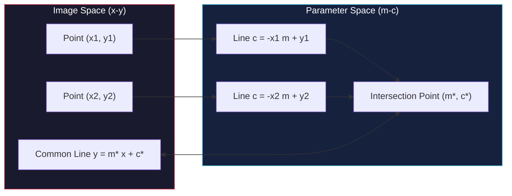

# Hough Transform and Generalized Hough Transform

<!-- toc -->

This technical note covers **Hough Transform** and **Generalized Hough Transform (GHT)**, powerful voting mechanisms in computer vision used to detect parametric primitives (lines, circles) and arbitrary non-parametric shapes in noisy binary edge maps with missing fragments and clutter.

---

## 1. Hough Transform

Binary edge maps produced by low-level edge detectors contain background clutter, disconnected fragments, and noise. Classical line fitting methods can fail completely when outliers are present.

<figure style="display:flex; justify-content: center; margin: 20px 0;">
  

    
    <figcaption style="margin-top: 0.5em; text-align: center; font-size: 13px; color: #888;"><em>Figure 1: Inlier points lying on true line $y = mx + c$ (dark grey) vs outlier background noise points (light grey) in Image Space.</em></figcaption>
  

</figure>

The **Hough Transform** overcomes the inlier-outlier problem by converting pixel detection in image space into a robust voting procedure in a discrete parameter space.

---

### 1.1. Line Detection

Consider detecting straight lines in an image using the Cartesian line equation $y = mx + c$.

#### 1.1.1. Geometrical Duality Concept

Rewriting the line equation in terms of parameters yields:

$$c = - m x_i + y_i$$

This relationship establishes a fundamental geometric duality between **Image Space ($x-y$)** and **Parameter Space ($m-c$)**:

1. **A Single Point $(x_i, y_i)$ in Image Space:** Maps to **a straight line** $c = -x_i m + y_i$ in parameter space. This line represents all possible $(m, c)$ combinations passing through $(x_i, y_i)$.
2. **A Straight Line in Image Space:** Maps to a single point $(m^*, c^*)$ in parameter space.

<figure style="display:flex; justify-content: center; margin: 20px 0;">
  

    
    <figcaption style="margin-top: 0.5em; text-align: center; font-size: 13px; color: #888;"><em>Figure 2: Image points mapping to lines in parameter space, intersecting at candidate parameter pair $(m, c)$.</em></figcaption>
  

</figure>

3. **Intersection Logic:** Collinear pixels lying on the same line in image space correspond to intersecting lines in parameter space that concur at a single point $(m^*, c^*)$. Outlier noise pixels map to independent non-concurring lines.

<figure style="display:flex; justify-content: center; margin: 20px 0;">
  

    
    <figcaption style="margin-top: 0.5em; text-align: center; font-size: 13px; color: #888;"><em>Figure 3: Geometric duality summary: collinear image points concur at a single point $(m, c)$ in parameter space, whereas outlier points pass elsewhere.</em></figcaption>
  

</figure>

---

#### 1.1.2. Polar Normal Parametrization ($\theta - \rho$)

The slope-intercept parameterization $y = mx + c$ fails for vertical lines because $m \to \infty$, requiring an unbounded parameter space. To resolve this, the **polar normal parametrization** is used:

$$x \sin\theta - y \cos\theta + \rho = 0 \implies \rho = y_i \cos\theta - x_i \sin\theta$$

Where:
- $\theta \in [0, \pi)$: The bounded angle of the line's normal vector with the x-axis.
- $\rho \in [-\sqrt{M^2+N^2}, \sqrt{M^2+N^2}]$: The perpendicular distance from the origin to the line (bounded by the image diagonal).

<figure style="display:flex; justify-content: center; margin: 20px 0;">
  

    
    <figcaption style="margin-top: 0.5em; text-align: center; font-size: 13px; color: #888;"><em>Figure 4: Polar parametrization ($\theta - \rho$): image points map to sinusoidal curves in parameter space, intersecting at common parameters $(\theta^*, \rho^*)$.</em></figcaption>
  

</figure>

---

#### 1.1.3. The Accumulator Voting Algorithm

Line detection via Hough voting executes the following algorithmic steps:

1. **Parameter Space Discretization:** The $(\theta, \rho)$ domain is quantized into a 2D discrete accumulator array $A(\theta, \rho)$, initialized to zero.
2. **Voting Procedure:** For each edge pixel $(x_i, y_i)$, $\theta$ is stepped from $0$ to $\pi$, computing $\rho = y_i \cos\theta - x_i \sin\theta$. The corresponding accumulator bin is incremented:

$$A(\theta, \rho) = A(\theta, \rho) + 1$$

<figure style="display:flex; justify-content: center; margin: 20px 0;">
  

    
    <figcaption style="margin-top: 0.5em; text-align: center; font-size: 13px; color: #888;"><em>Figure 5: Discrete accumulator matrix $A(m, c)$ voting concept: 3 collinear image points yield a peak count of 3.</em></figcaption>
  

</figure>

3. **Peak Finding:** After voting completes, local maxima (peaks) in $A(\theta, \rho)$ are extracted. Peak bin coordinates correspond directly to line parameters $(\theta^*, \rho^*)$ in image space.

<figure style="display:flex; justify-content: center; margin: 20px 0;">
  

    
    <figcaption style="margin-top: 0.5em; text-align: center; font-size: 13px; color: #888;"><em>Figure 6: Four distinct lines forming a polygon in image space map to four clear intersection peaks in parameter space.</em></figcaption>
  

</figure>

---

#### 1.1.4. Practical Engineering Trade-offs

<figure style="display:flex; justify-content: center; margin: 20px 0;">
  

    
    <figcaption style="margin-top: 0.5em; text-align: center; font-size: 13px; color: #888;"><em>Figure 7: Real Hough line detection pipeline on camera film roll: Original Image $\rightarrow$ Gradient $\rightarrow$ Thresholded Edges $\rightarrow$ Accumulator $A(\rho, \theta)$ peaks $\rightarrow$ Detected red lines.</em></figcaption>
  

</figure>

<figure style="display:flex; justify-content: center; margin: 20px 0;">
  

    
    <figcaption style="margin-top: 0.5em; text-align: center; font-size: 13px; color: #888;"><em>Figure 8: Hough line detection on an industrial machine panel with accumulator peak extraction.</em></figcaption>
  

</figure>

- **Bin Resolution Selection:** Coarse quantization (low resolution) merges distinct lines into single accumulator bins, reducing angular precision. Fine quantization (high resolution) splits votes across neighboring bins due to noise and discretization errors, obscuring peaks.
- **Patch Voting:** To improve noise robustness, each edge point casts votes into a small Gaussian-weighted patch of accumulator bins rather than a single discrete bin.
- **Peak Extraction & NMS:** Noise causes vote clusters around true peak values. A **Non-Maximal Suppression (NMS)** algorithm isolates distinct local peaks and filters out spurious detections.

---

### 1.2. Circle Detection

The geometric equation of a circle involves three parameters:

$$(x - a)^2 + (y - b)^2 = r^2$$

Where $(a, b)$ are center coordinates and $r$ is the radius.

#### 1.2.1. Known Radius $r$ (2D Parameter Space $A(a, b)$)

If the radius $r$ is fixed, the parameter space is 2D: $A(a, b)$. Each edge point $(x_i, y_i)$ votes along a circle of radius $r$ centered at $(x_i, y_i)$ in parameter space.

<figure style="display:flex; justify-content: center; margin: 20px 0;">
  

    
    <figcaption style="margin-top: 0.5em; text-align: center; font-size: 13px; color: #888;"><em>Figure 9: Single image point $(x_i, y_i)$ voting along a circle of radius $r$ in parameter space $A(a, b)$.</em></figcaption>
  

</figure>

The intersection of these voting circles pinpoints the true circle center $(a^*, b^*)$.

<figure style="display:flex; justify-content: center; margin: 20px 0;">
  

    
    <figcaption style="margin-top: 0.5em; text-align: center; font-size: 13px; color: #888;"><em>Figure 10: Overlapping voting circles from all edge points along a circle concurring at center $(a^*, b^*)$.</em></figcaption>
  

</figure>

<figure style="display:flex; justify-content: center; margin: 20px 0;">
  

    
    <figcaption style="margin-top: 0.5em; text-align: center; font-size: 13px; color: #888;"><em>Figure 11: Real coin detection: accumulators $A_1(a,b)$ for Penny ($r = r_1$) and $A_2(a,b)$ for Quarter ($r = r_2$).</em></figcaption>
  

</figure>

---

#### 1.2.2. Fast Voting Using Edge Orientation (Gradient Direction)

When edge gradient orientation $\phi_i$ is known, the circle center must lie along the normal direction at distance $r$ from edge point $(x_i, y_i)$.

Instead of voting along an entire circle, votes are cast into only two candidate center locations:

$$a = x_i \pm r \cos\phi_i \quad \text{and} \quad b = y_i \pm r \sin\phi_i$$

> **Key Insight:** Incorporating gradient directions reduces voting complexity from $\mathcal{O}(N \cdot 360)$ to $\mathcal{O}(N \cdot 2)$, achieving massive speedups and dramatically reducing noise accumulation.

---

#### 1.2.3. Unknown Radius $r$ (3D Parameter Space $A(a, b, r)$)

When radius $r$ is unknown, the parameter space expands to 3D: $A(a, b, r)$. Each edge point casts votes along a **3D cone surface**. As parameters increase beyond three, accumulator memory and computation scale exponentially, making classical Hough voting intractable.

---

## 2. Generalized Hough Transform (GHT)

While the classical Hough transform detects shapes defined by analytic equations (lines, circles, ellipses), the **Generalized Hough Transform (GHT)** detects arbitrary non-parametric shapes (e.g., logos, animals, or vehicle outlines) using a template-driven voting table.

---

### 2.1. Offline Model Construction and the $\phi$-Table

Before searching an image, a geometric model of the target template shape is extracted offline:

1. **Reference Point Selection:** An arbitrary reference point $(x_c, y_c)$ (e.g., centroid) is chosen inside the template boundary.
2. **Boundary Vector Extraction:** For each boundary point $v_i$, the local edge orientation angle $\phi_i$ is computed.

<figure style="display:flex; justify-content: center; margin: 20px 0;">
  

    
    <figcaption style="margin-top: 0.5em; text-align: center; font-size: 13px; color: #888;"><em>Figure 12: GHT model geometry: reference center $(x_c, y_c)$, edge orientation $\phi_i$, and polar vector $\vec{r}_k^i = (r_k^i, \alpha_k^i)$.</em></figcaption>
  

</figure>

3. **Polar Vector Computation:** A displacement vector $r = (r_i, \alpha_i)$ from $(x_c, y_c)$ to boundary point $v_i$ is calculated:
   - $r_i = \sqrt{(x_i - x_c)^2 + (y_i - y_c)^2}$: Distance to reference center.
   - $\alpha_i = \operatorname{atan2}(y_c - y_i, x_c - x_i)$: Direction angle of displacement vector.
4. **$\phi$-Table Construction:** Indexed by edge orientation angle $\phi$, the table stores lists of displacement vectors $(r, \alpha)$ associated with each orientation angle.

<figure style="display:flex; justify-content: center; margin: 20px 0;">
  

    
    <figcaption style="margin-top: 0.5em; text-align: center; font-size: 13px; color: #888;"><em>Figure 13: $\phi$-Table data structure mapping edge orientation $\phi_i$ to lists of displacement vectors $\vec{r} = (r, \alpha)$.</em></figcaption>
  

</figure>

---

### 2.2. Online Detection Procedure

Searching for the target template in an unseen image proceeds as follows:

1. Initialize a 2D accumulator array $A(x_c, y_c)$ to zero.
2. For each edge pixel $(x_i, y_i)$ with gradient orientation $\phi_i$:
   - Look up matching displacement vectors $(r, \alpha)$ in the $\phi$-Table using index $\phi_i$.
   - Calculate candidate reference center coordinates for each vector:

$$x_c = x_i + r \cos\alpha \quad \text{and} \quad y_c = y_i + r \sin\alpha$$

   - Increment the accumulator bin:

$$A(x_c, y_c) = A(x_c, y_c) + 1$$

<figure style="display:flex; justify-content: center; margin: 20px 0;">
  

    
    <figcaption style="margin-top: 0.5em; text-align: center; font-size: 13px; color: #888;"><em>Figure 14: GHT online voting into reference center accumulator $A(x_c, y_c)$ producing a sharp peak at true center location.</em></figcaption>
  

</figure>

3. Locate local maxima (peaks) in $A(x_c, y_c)$. Peak coordinates correspond to detected target reference centers $(x_c, y_c)$ in the search image.

<figure style="display:flex; justify-content: center; margin: 20px 0;">
  

    
    <figcaption style="margin-top: 0.5em; text-align: center; font-size: 13px; color: #888;"><em>Figure 15: Practical GHT detection results: leaf template detected among flowers (top) and cat template detected among rabbits (bottom).</em></figcaption>
  

</figure>

---

### 2.3. Handling Scale and Rotation Variances

If the target object appears under unknown uniform scaling $s$ and rotation angle $\theta$, the parameter space expands to a 4D accumulator $A(x_c, y_c, s, \theta)$.

The reference center equation is updated:

$$x_c = x_i + r \cdot s \cdot \cos(\alpha + \theta)$$

$$y_c = y_i + r \cdot s \cdot \sin(\alpha + \theta)$$

> **Algorithmic Limitation:** Voting in 4D space requires excessive memory and computational complexity ($\mathcal{O}(N \cdot S \cdot R)$), making 4D GHT impractically slow for real-time applications without hierarchical optimization.
