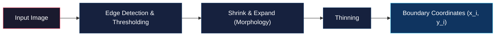

# Overview, Fitting Lines and Curves, and Active Contours

<!-- toc -->

This technical note covers **Boundary Detection**, a fundamental problem in computer vision that bridges the gap between low-level pixel edges and high-level geometric object boundaries. We examine the physical challenges of real-world boundaries, analytical **Least Squares Line and Curve Fitting**, vertical line failure modes, perpendicular distance normal forms, and dynamic deformable contours known as **Active Contours (Snakes)** along with their discrete energy optimization.

---

## 1. Overview of Boundary Detection

Output from edge detection algorithms consists of discrete, disconnected pixels, noise artifacts, and background clutter. The primary objective of computer vision is to group and fit these pixel fragments into continuous geometric lines or closed curves representing object boundaries (silhouettes). This formulation is known as **Boundary Detection**.

<figure style="display:flex; justify-content: center; margin: 20px 0;">
  

    
    <figcaption style="margin-top: 0.5em; text-align: center; font-size: 13px; color: #888;"><em>Figure 1: Full boundary processing pipeline on an antique vase: input image, edge detection, thresholding, morphological filtering (shrink & expand), thinning, and final continuous boundary detection.</em></figcaption>
  

</figure>

### 1.1. Key Differences Between Edge Detection and Boundary Detection

- **Edge Detection:** A local pixel-level operation that detects rapid intensity variations (gradient magnitudes). The output is a binary edge map.
- **Boundary Detection:** A semantic and geometric global process that aggregates binary edge pixels into structural object contours or parametric curves.

### 1.2. Principal Physical and Geometric Challenges

Boundary detection algorithms must overcome three major challenges present in natural images:

1. **Extraneous Data:** Images contain thousands of irrelevant edge pixels generated by background textures, surface markings, or illumination shadows. The algorithm must differentiate object boundaries from clutter.
2. **Incomplete Data and Occlusions:** Low contrast, internal object shading, or partial occlusion by other objects cause missing edge fragments and large gaps along object boundaries.
3. **Image Noise:** Sensor noise creates false edge responses in smooth regions and causes true boundary coordinates to shift spatially.

---

## 2. Fitting Lines and Curves

The simplest boundary detection task involves fitting a parametric line or low-degree polynomial curve to a set of noisy edge coordinates.

### 2.1. Preprocessing Pipeline for Edge Images

Raw edge maps are rarely suitable for direct curve fitting. The image undergoes a structured preprocessing sequence:

1. **Edge Detection & Thresholding:** Applying an edge operator (e.g., Sobel) computes gradient magnitudes, which are thresholded to yield a binary edge map.
2. **Shrink & Expand (Morphology):** Morphological shrinking removes isolated noise pixels, after which remaining components are expanded to restore edge continuity.
3. **Thinning:** Thickened edge segments are reduced to single-pixel width, yielding clean coordinate pairs $(x_i, y_i)$ for line/curve fitting.

---

### 2.2. Least Squares Line Fitting

Consider fitting a straight line $y = mx + c$ to a set of $N$ edge points $(x_i, y_i)$ by finding optimal slope $m$ and intercept $c$.

#### 2.2.1. Vertical Distance Minimization

The standard formulation minimizes the average squared vertical distance from each point to the candidate line.

<figure style="display:flex; justify-content: center; margin: 20px 0;">
  

    
    <figcaption style="margin-top: 0.5em; text-align: center; font-size: 13px; color: #888;"><em>Figure 2: Least squares line fitting: vertical distance $|y_i - mx_i - c|$ from point $(x_i, y_i)$ to line $y = mx + c$.</em></figcaption>
  

</figure>

The vertical distance from point $(x_i, y_i)$ to the line is $y_i - mx_i - c$. The mean squared error energy (cost) function is defined as:

$$E = \frac{1}{N} \sum_{i=1}^{N} (y_i - m x_i - c)^2$$

Setting the partial derivatives with respect to $m$ and $c$ to zero yields:

$$\frac{\partial E}{\partial m} = 0 \implies \sum_{i=1}^{N} (y_i - m x_i - c)x_i = 0$$

$$\frac{\partial E}{\partial c} = 0 \implies \sum_{i=1}^{N} (y_i - m x_i - c) = 0$$

Solving for intercept $c$ from the second equation:

$$c = \bar{y} - m\bar{x} \quad \text{where} \quad \bar{x} = \frac{1}{N}\sum_{i=1}^N x_i, \quad \bar{y} = \frac{1}{N}\sum_{i=1}^N y_i$$

Substituting $c$ into the first equation yields the closed-form analytical solution for slope $m$:

$$m = \frac{\sum_{i=1}^{N} (x_i - \bar{x})(y_i - \bar{y})}{\sum_{i=1}^{N} (x_i - \bar{x})^2}$$

---

#### 2.2.2. The Vertical Line Failure Mode

Vertical distance minimization fails completely when edge points form a near-vertical line.

<figure style="display:flex; justify-content: center; margin: 20px 0;">
  

    
    <figcaption style="margin-top: 0.5em; text-align: center; font-size: 13px; color: #888;"><em>Figure 3: Vertical line failure: minimizing vertical distance on vertically aligned points fits a completely wrong horizontal line.</em></figcaption>
  

</figure>

- **Physical Cause:** The slope of a vertical line approaches infinity ($m \to \infty$). The denominator term $\sum (x_i - \bar{x})^2$ approaches zero, causing numerical breakdown.
- **Pathological Behavior:** Because the cost function measures vertical distances, vertical offsets to a true vertical line are infinite. To minimize these vertical offsets, the algorithm rotates the candidate line to horizontal—producing an entirely incorrect fit.

---

### 2.3. Perpendicular Distance Minimization

To eliminate vertical singularities, lines are expressed using the normal parameterization:

$$x \sin\theta - y \cos\theta + \rho = 0$$

<figure style="display:flex; justify-content: center; margin: 20px 0;">
  

    
    <figcaption style="margin-top: 0.5em; text-align: center; font-size: 13px; color: #888;"><em>Figure 4: Normal form parameterization ($\theta, \rho$), where $\theta$ is the normal angle and $\rho$ is the perpendicular distance to the origin.</em></figcaption>
  

</figure>

Here, $\theta$ represents the angle of the normal vector with the x-axis, and $\rho$ is the perpendicular distance from the origin to the line. The perpendicular distance $r_i$ from point $(x_i, y_i)$ to the line is:

$$r_i = x_i \sin\theta - y_i \cos\theta + \rho$$

The objective energy function minimizes mean squared perpendicular distances:

$$E = \frac{1}{N} \sum_{i=1}^{N} (x_i \sin\theta - y_i \cos\theta + \rho)^2$$

> **Key Insight (Equivalence to Axis of Minimum Second Moment):** Perpendicular distance minimization is mathematically identical to finding the **axis of minimum second moment** in binary image analysis.

Treating point coordinates as binary image pixels, the central second moments relative to the centroid $(\bar{x}, \bar{y})$ are:

$$a = \sum_{i=1}^N (x_i - \bar{x})^2, \quad c = \sum_{i=1}^N (y_i - \bar{y})^2, \quad b = 2 \sum_{i=1}^N (x_i - \bar{x})(y_i - \bar{y})$$

Solving for parameters $\theta$ and $\rho$ provides a numerically stable fit for all orientations, including vertical lines:

$$\tan(2\theta) = \frac{b}{a - c}$$

$$\rho = \bar{y}\cos\theta - \bar{x}\sin\theta$$

---

### 2.4. Curve Fitting and Overdetermined Linear Systems

When boundaries exhibit curvature, higher-order polynomial models such as cubic polynomials ($y = ax^3 + bx^2 + cx + d$) are employed.

<figure style="display:flex; justify-content: center; margin: 20px 0;">
  

    
    <figcaption style="margin-top: 0.5em; text-align: center; font-size: 13px; color: #888;"><em>Figure 5: Fitting a parametric polynomial curve $y = f(x)$ to a set of 2D coordinates.</em></figcaption>
  

</figure>

The vertical squared error energy is:

$$E = \frac{1}{N} \sum_{i=1}^{N} (y_i - a x_i^3 - b x_i^2 - c x_i - d)^2$$

Rather than solving complex system derivatives manually, the problem is formulated as an **overdetermined linear system of equations**.

Evaluating each coordinate pair $(x_i, y_i)$ yields $N$ linear equations:

$$\begin{aligned}
y_1 &= a x_1^3 + b x_1^2 + c x_1 + d \\
y_2 &= a x_2^3 + b x_2^2 + c x_2 + d \\
&\ \ \vdots \\
y_N &= a x_N^3 + b x_N^2 + c x_N + d
\end{aligned}$$

With $m$ unknown coefficients (here $m=4$: $a, b, c, d$) and $N$ data points ($N > m$), the system is written in matrix form:

$$X a = y$$

$$\begin{bmatrix} 
x_1^3 & x_1^2 & x_1 & 1 \\ 
x_2^3 & x_2^2 & x_2 & 1 \\ 
\vdots & \vdots & \vdots & \vdots \\ 
x_N^3 & x_N^2 & x_N & 1 
\end{bmatrix}_{N \times m} 
\begin{bmatrix} a \\ b \\ c \\ d \end{bmatrix}_{m \times 1} = 
\begin{bmatrix} y_1 \\ y_2 \\ \vdots \\ y_N \end{bmatrix}_{N \times 1}$$

Since input matrix $X$ ($N \times m$) is non-square, its direct matrix inverse does not exist. Premultiplying both sides by $X^T$ converts the system into an $m \times m$ square matrix:

$$X^T X a = X^T y \implies a = (X^T X)^{-1} X^T y$$

The matrix $X^+ = (X^T X)^{-1} X^T$ is the **Moore-Penrose Pseudo-Inverse**. This linear algebraic solution provides a robust closed-form fit for polynomial curve fitting of any degree.

---

## 3. Active Contours (Snakes)

**Active Contours (Snakes)** are dynamic, deformable energy-minimizing curves placed in the vicinity of an object boundary. Under internal structural forces and external image forces, the contour iteratively contracts and shapes itself until it locks onto salient image boundaries like an elastic band.

<figure style="display:flex; justify-content: center; margin: 20px 0;">
  

    
    <figcaption style="margin-top: 0.5em; text-align: center; font-size: 13px; color: #888;"><em>Figure 6: Examples of deformable boundaries: lip contours deforming during speech (top) and vehicle outlines changing across viewpoints (bottom).</em></figcaption>
  

</figure>

### 3.1. Discrete Representation of Contours

A contour is discretized into an ordered sequence of $N$ control points (vertices) connected by straight segments of uniform length:

$$v_i = (x_i, y_i) \quad \text{for} \quad i = 0, 1, 2, \dots, N-1$$

<figure style="display:flex; justify-content: center; margin: 20px 0;">
  

    
    <figcaption style="margin-top: 0.5em; text-align: center; font-size: 13px; color: #888;"><em>Figure 7: Discrete representation of a closed contour using control points $v_i = (x_i, y_i)$.</em></figcaption>
  

</figure>

<figure style="display:flex; justify-content: center; margin: 20px 0;">
  

    
    <figcaption style="margin-top: 0.5em; text-align: center; font-size: 13px; color: #888;"><em>Figure 8: Initialized control points roughly sketched around a US quarter coin.</em></figcaption>
  

</figure>

---

### 3.2. Energy Formulation and Force Balance

Contour deformation is governed by balancing internal forces (maintaining curve smoothness) against external forces (attracting the curve to image boundaries).

#### 3.2.1. Internal Contour Energy ($E_{contour}$)

Internal bending energy prevents the contour from developing severe kinks, tangles, or oscillations under noisy conditions. It combines two physical properties:

<figure style="display:flex; justify-content: center; margin: 20px 0;">
  

    
    <figcaption style="margin-top: 0.5em; text-align: center; font-size: 13px; color: #888;"><em>Figure 9: Physical intuition of internal energies: elasticity acts like a contracting rubber band, while smoothness behaves like a flexible metal strip.</em></figcaption>
  

</figure>

1. **Elasticity ($E_{elastic}$):** Encourages contraction like a rubber band, keeping distances between neighboring vertices minimal. In continuous form it corresponds to the squared first derivative ($|\frac{\partial v}{\partial s}|^2$), discretized as squared differences between adjacent vertices:

$$E_{elastic} = \sum_{i=0}^{N-1} |v_{i+1} - v_i|^2$$

2. **Smoothness ($E_{smooth}$):** Minimizes curvature, preventing sharp corners and making the curve bend smoothly like a thin metal strip. In continuous form it corresponds to the squared second derivative ($|\frac{\partial^2 v}{\partial s^2}|^2$), discretized via second-order differences:

$$E_{smooth} = \sum_{i=0}^{N-1} |v_{i+1} - 2v_i + v_{i-1}|^2$$

Combining both components with weighting parameters $\alpha$ and $\beta$ yields the internal contour energy:

$$E_{contour} = \alpha E_{elastic} + \beta E_{smooth} = \alpha \sum_{i=0}^{N-1} |v_{i+1} - v_i|^2 + \beta \sum_{i=0}^{N-1} |v_{i+1} - 2v_i + v_{i-1}|^2$$

---

#### 3.2.2. External Image Energy ($E_{image}$)

External forces pull the contour toward high-gradient image edges using squared gradient magnitude ($|\nabla I|^2$). However, if the contour is distant from boundaries, edge gradients drop to zero, leaving no attraction force.

<figure style="display:flex; justify-content: center; margin: 20px 0;">
  

    
    <figcaption style="margin-top: 0.5em; text-align: center; font-size: 13px; color: #888;"><em>Figure 10: External image energy: initial contour (left), raw gradient magnitude $\|\nabla I\|^2$ (center), and Gaussian-blurred potential field $\|\nabla G_\sigma * I\|^2$ creating a wide region of attraction (right).</em></figcaption>
  

</figure>

> **The Gaussian Blurring Trick:** Convolving the gradient map with a broad Gaussian filter ($G_\sigma$) spreads out edge forces into a wide potential field. This attraction field enables distant control points to feel pulling forces toward object boundaries.

Because energy minimization drives the snake into potential wells, external energy is negated:

$$E_{image} = - \sum_{i=0}^{N-1} |\nabla (G_\sigma * I(v_i))|^2$$

---

#### 3.2.3. Total Energy ($E_{total}$)

The total energy optimized by the active contour model is the sum of internal and external energies:

$$E_{total} = E_{image} + E_{contour}$$

---

### 3.3. Contour Deformation via the Greedy Algorithm

Minimizing total energy is commonly implemented using a fast, practical **Greedy Algorithm**:

<figure style="display:flex; justify-content: center; margin: 20px 0;">
  

    
    <figcaption style="margin-top: 0.5em; text-align: center; font-size: 13px; color: #888;"><em>Figure 11: Local neighborhood search windows $W$ evaluated for each control point (red dots) during greedy energy minimization.</em></figcaption>
  

</figure>

1. **Uniform Re-sampling:** Vertices are redistributed along the curve to maintain equal spacing between adjacent control points.
   - *Critical Importance:* Without uniform re-sampling, elastic forces cause control points to bunch together, tangling the curve geometry.
2. **Local Neighborhood Search:** For each vertex $v_i$, candidates within a small neighborhood window $W$ (e.g., $3 \times 3$ or $5 \times 5$ pixels) are evaluated. The vertex moves to the neighbor that minimizes local $E_{total}$.
3. **Termination Condition:** Iteration stops when total vertex displacement across the contour drops below a small threshold $\epsilon$. Otherwise, the process repeats from Step 1.

<figure style="display:flex; justify-content: center; margin: 20px 0;">
  

    
    <figcaption style="margin-top: 0.5em; text-align: center; font-size: 13px; color: #888;"><em>Figure 12: Contour failure mode when uniform re-sampling is omitted, causing vertex clustering and self-intersection loops.</em></figcaption>
  

</figure>

---

### 3.4. Parameter Analysis and Advanced Extensions

#### 3.4.1. Impact of Elasticity Parameter $\alpha$

The elasticity coefficient $\alpha$ controls how strongly the snake contracts.

<figure style="display:flex; justify-content: center; margin: 20px 0;">
  

    
    <figcaption style="margin-top: 0.5em; text-align: center; font-size: 13px; color: #888;"><em>Figure 13: Effect of $\alpha$ on two adjacent coins: large $\alpha$ forces the contour into narrow concave gaps like a tight rubber band (left), while small $\alpha$ maintains a relaxed outer boundary (right).</em></figcaption>
  

</figure>

- **Large $\alpha$:** High elastic tension pulls the curve tightly into narrow concave gaps between adjacent objects.
- **Small $\alpha$:** Low elastic tension keeps the curve relaxed, bridging over narrow gaps without snapping inwards.

#### 3.4.2. Model Limitations and Advanced Formulations

- **Initialization Sensitivity:** Active contours require reasonable initial guesses. If initialized far outside the attraction zone, the snake fails to lock onto the target and gets trapped in local background clutter.
- **Ballooning Forces:** While standard snakes contract inward, adding an outward pressure (balloon) force expands the contour from inside an object out to its boundaries.
- **Prior Shape Models:** For objects with known shape geometry (e.g., hearts, eyes, or hands), a prior shape energy term $E_{prior}$ penalizes deviations from expected structural templates.
