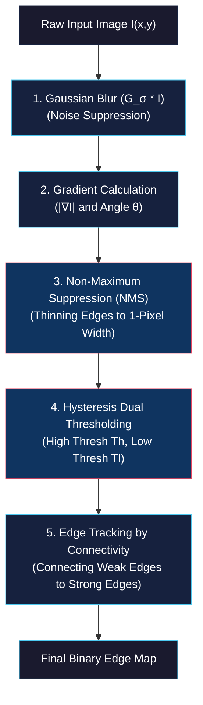
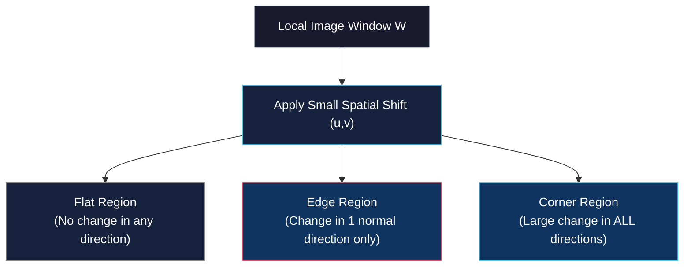
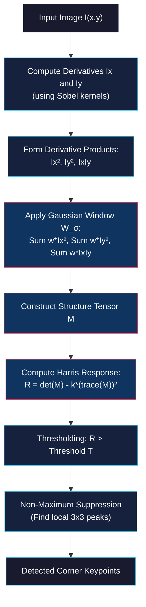

# Canny Edge Detector and Corner Detection

<!-- toc -->

This technical note covers advanced feature extraction techniques in computer vision, focusing on the optimal **Canny Edge Detector** and **Harris Corner Detection** (Structure Tensor analysis). We examine their mathematical derivations, multi-scale behavior, spatial autocorrelation, eigenvalue analysis of second moment matrices, and practical algorithmic implementations.

---

## 1. Canny Edge Detector

The **Canny Edge Detector**, developed by John F. Canny in 1986, is widely regarded as the optimal edge detection algorithm for 2D images. It formulates edge detection as an analytical optimization problem subject to precise mathematical constraints.

### 1.1. John Canny's Optimization Criteria

Canny defined three fundamental criteria that an optimal edge detector must satisfy:

1. **Low Error Rate (Optimal Detection):** The operator must maximize the signal-to-noise ratio (SNR) by catching all true physical edges while minimizing false positives caused by noise.
2. **Localization Accuracy:** The distance between the detected edge pixel coordinates and the true physical center of the edge boundary must be minimized.
3. **Single Response Constraint:** The detector must return only one pixel-wide response for each single edge boundary, avoiding multiple thick response bands.

---

### 1.2. The 5-Step Canny Pipeline

#### Step 1: Gaussian Smoothing
To suppress high-frequency image noise, the raw image $I(x,y)$ is convolved with a 2D Gaussian kernel $G_\sigma(x,y)$:

$$I_\sigma(x,y) = G_\sigma(x,y) * I(x,y) = \frac{1}{2\pi \sigma^2} e^{-\frac{x^2+y^2}{2\sigma^2}} * I(x,y)$$

#### Step 2: Gradient Vector Calculation
The smoothed image $I_\sigma$ is processed using Sobel or central difference derivative operators to derive horizontal ($I_x$) and vertical ($I_y$) partial derivatives:

$$|\nabla I| = \sqrt{I_x^2 + I_y^2}, \quad \theta = \tan^{-1} \left( \frac{I_y}{I_x} \right)$$

#### Step 3: Non-Maximum Suppression (NMS)
NMS thins the thick gradient magnitude response map into crisp, 1-pixel-wide candidate edges. For each pixel $(x,y)$:
1. Quantize the gradient direction $\theta(x,y)$ into one of four principal sectors: $0^\circ$ (horizontal), $45^\circ$ (positive diagonal), $90^\circ$ (vertical), or $135^\circ$ (negative diagonal).
2. Compare the magnitude $|\nabla I(x,y)|$ with its two immediate neighbors along the gradient normal direction.
3. If $|\nabla I(x,y)|$ is smaller than either neighbor, suppress it to zero ($|\nabla I_{NMS}(x,y)| = 0$); otherwise, retain it.

$$\begin{aligned}
0^\circ \text{ Sector:} \quad & \text{Compare with } (x+1, y) \text{ and } (x-1, y) \\
90^\circ \text{ Sector:} \quad & \text{Compare with } (x, y+1) \text{ and } (x, y-1) \\
45^\circ \text{ Sector:} \quad & \text{Compare with } (x+1, y+1) \text{ and } (x-1, y-1) \\
135^\circ \text{ Sector:} \quad & \text{Compare with } (x+1, y-1) \text{ and } (x-1, y+1)
\end{aligned}$$

#### Step 4: Hysteresis Dual Thresholding
To resolve broken edge segments without admitting noisy pixels, two thresholds are applied:
- **Strong Edges:** $|\nabla I_{NMS}| \ge T_{high} \rightarrow$ Marked as valid edge pixels.
- **Weak Edges:** $T_{low} \le |\nabla I_{NMS}| < T_{high} \rightarrow$ Candidates for edge connectivity.
- **Suppressed:** $|\nabla I_{NMS}| < T_{low} \rightarrow$ Rejected.

#### Step 5: Edge Tracking by Connectivity
A weak edge pixel is preserved **if and only if** it is connected to a strong edge pixel within an 8-neighbor spatial path. This connected-component analysis prevents edge fragmentation while eliminating isolated noise spikes.

---

### 1.3. Multi-Scale Edge Detection ($\sigma$ Parameter)

The standard deviation $\sigma$ of the Gaussian filter acts as a scale-space parameter:
- **Small $\sigma$ (Fine Scale):** Preserves sharp details, subtle textures, and fine corners, but remains more susceptible to noise.
- **Large $\sigma$ (Coarse Scale):** Filters out fine textures and noise, highlighting major structural object boundaries, but degrades localization accuracy.

<figure style="display:flex; justify-content: center; margin: 20px 0;">
  

    
    <figcaption style="margin-top: 0.5em; text-align: center; font-size: 13px; color: #888;"><em>Canny edge detection on Lena image across scale parameters σ = 1, σ = 2, and σ = 4 showing structural scale selection.</em></figcaption>
  

</figure>

---

## 2. Corner Detection (Harris & Moravec Corner Detector)

While edges provide 1D constraints along boundary curves, **corners (keypoints / interest points)** provide 2D point constraints. A corner is defined as an image location where intensity changes significantly across all 2D spatial directions.

### 2.1. Why Corners? (2D Constraints & Aperture Problem)

Corners are exceptionally valuable features for camera calibration, 3D reconstruction, optical flow tracking, and object recognition:
- **Aperture Problem Mitigation:** When viewed through a small local window (aperture), a straight 1D edge suffers from ambiguity along its boundary direction. A corner resolves this ambiguity because its location is constrained in both $x$ and $y$.
- **Perceptual Salience:** As demonstrated by visual perception experiments (e.g., Ewald Hering's 1861 orientation illusion), human vision relies heavily on intersecting lines and corner junctions to perceive structural geometry.

<figure style="display:flex; justify-content: center; margin: 20px 0;">
  

    
    <figcaption style="margin-top: 0.5em; text-align: center; font-size: 13px; color: #888;"><em>Ewald Hering illusion (1861): human visual perception of straight parallel lines is distorted by intersecting orientation background rays.</em></figcaption>
  

</figure>

---

### 2.2. Categorization of Image Neighborhoods

Local image patches are classified into three fundamental geometric categories based on intensity variation when shifting a local window $W$:

<figure style="display:flex; justify-content: center; margin: 20px 0;">
  

    
    <figcaption style="margin-top: 0.5em; text-align: center; font-size: 13px; color: #888;"><em>Basic image patch categories: Flat Region (homogeneous intensity), Edge Region (1D gradient), Corner Region (2D gradient).</em></figcaption>
  

</figure>

1. **Flat Region:** Shifting the window in any direction results in virtually zero intensity change.
2. **Edge Region:** Shifting the window parallel to the edge direction results in zero intensity change; shifting perpendicular to the edge results in a large intensity change.
3. **Corner Region:** Shifting the window in **any** spatial direction results in a significant intensity change.

<figure style="display:flex; justify-content: center; margin: 20px 0;">
  

    
    <figcaption style="margin-top: 0.5em; text-align: center; font-size: 13px; color: #888;"><em>Decomposition of Flat, Edge, and Corner regions into intensity I and partial gradient maps Ix = ∂I/∂x and Iy = ∂I/∂y.</em></figcaption>
  

</figure>

---

### 2.3. Mathematical Formulation (Sum of Squared Differences & Taylor Series)

The change in intensity $E(u,v)$ produced by shifting a window $w(x,y)$ by displacement vector $(u,v)$ is formulated using the Sum of Squared Differences (SSD):

$$E(u,v) = \sum_{x,y} w(x,y) \left[ I(x+u, y+v) - I(x,y) \right]^2$$

Where $w(x,y)$ is a window function (either a uniform box window or a 2D Gaussian weighting window $e^{-\frac{x^2+y^2}{2\sigma^2}}$).

Using a first-order 2D **Taylor Series expansion** for small displacements $(u,v)$:

$$I(x+u, y+v) \approx I(x,y) + u I_x(x,y) + v I_y(x,y)$$

Substituting this back into the SSD equation yields:

$$E(u,v) \approx \sum_{x,y} w(x,y) \left[ u I_x(x,y) + v I_y(x,y) \right]^2$$

Expanding the quadratic term and writing in matrix form:

$$E(u,v) \approx \begin{bmatrix} u & v \end{bmatrix} M \begin{bmatrix} u \\[6pt] v \end{bmatrix}$$

Where $M$ is the **Second Moment Matrix** (also known as the **Structure Tensor**):

$$M = \sum_{x,y} w(x,y) \begin{bmatrix} I_x^2 & I_x I_y \\[6pt] I_x I_y & I_y^2 \end{bmatrix} = \begin{bmatrix} \sum w I_x^2 & \sum w I_x I_y \\[6pt] \sum w I_x I_y & \sum w I_y^2 \end{bmatrix}$$

---

### 2.4. Second Moment Matrix ($M$) and Eigenvalue Analysis

The Second Moment Matrix $M$ summarizes the local gradient distribution inside the window.

<figure style="display:flex; justify-content: center; margin: 20px 0;">
  

    
    <figcaption style="margin-top: 0.5em; text-align: center; font-size: 13px; color: #888;"><em>Scatter plots of (Ix, Iy) gradient distributions: Flat region (cluster at origin), Edge region (line distribution along normal), Corner region (broad multidirectional distribution).</em></figcaption>
  

</figure>

Let $\lambda_1$ and $\lambda_2$ be the two eigenvalues of matrix $M$. These eigenvalues represent the principal curvatures of the local auto-correlation quadratic surface $E(u,v)$:
- $\lambda_1$: Length of the semi-major axis of the gradient uncertainty ellipse.
- $\lambda_2$: Length of the semi-minor axis of the gradient uncertainty ellipse.

<figure style="display:flex; justify-content: center; margin: 20px 0;">
  

    
    <figcaption style="margin-top: 0.5em; text-align: center; font-size: 13px; color: #888;"><em>Covariance ellipses formed by eigenvalues λ1 and λ2 representing semi-major and semi-minor axes for Flat, Edge, and Corner patches.</em></figcaption>
  

</figure>

> **Physical Analogy (Moments of Inertia):**
> As established in binary image geometry, the eigenvalues $\lambda_1$ and $\lambda_2$ correspond to the principal moments of inertia of the local gradient scatter mass: $\lambda_1 = E_{max}$ (maximum moment of inertia) and $\lambda_2 = E_{min}$ (minimum moment of inertia).

<figure style="display:flex; justify-content: center; margin: 20px 0;">
  

    
    <figcaption style="margin-top: 0.5em; text-align: center; font-size: 13px; color: #888;"><em>Physical moment of inertia interpretation: λ1 = Emax (semi-major axis) and λ2 = Emin (semi-minor axis).</em></figcaption>
  

</figure>

#### Classification of Image Regions Based on Eigenvalues:

<figure style="display:flex; justify-content: center; margin: 20px 0;">
  

    
    <figcaption style="margin-top: 0.5em; text-align: center; font-size: 13px; color: #888;"><em>Region classification summary: Flat (λ1 ~ λ2 small), Edge (λ1 >> λ2), Corner (λ1 ~ λ2 both large).</em></figcaption>
  

</figure>

| Region Type | Eigenvalue Relations | Mathematical Condition | Physical Meaning |
| :--- | :--- | :--- | :--- |
| **Flat Region** | $\lambda_1 \approx \lambda_2 \approx 0$ | Both $\lambda_1, \lambda_2$ are small | Insignificant gradient variation in any direction. |
| **Edge Region** | $\lambda_1 \gg \lambda_2 \approx 0$ | One large $\lambda_1$, one near-zero $\lambda_2$ | Strong gradient variation along 1 normal direction only. |
| **Corner Region**| $\lambda_1 \approx \lambda_2 \gg 0$ | Both $\lambda_1, \lambda_2$ are large | Strong gradient variation in all spatial directions. |

---

### 2.5. Harris Corner Response Function ($R$)

Explicitly calculating eigenvalues $\lambda_1, \lambda_2$ for every single pixel requires taking matrix square roots ($\sqrt{b^2 - 4ac}$), which is computationally expensive. Chris Harris and Mike Stephens (1988) devised an elegant scalar response function $R$ using matrix trace and determinant:

$$\det(M) = \lambda_1 \lambda_2 = (\sum w I_x^2)(\sum w I_y^2) - (\sum w I_x I_y)^2$$

$$\operatorname{trace}(M) = \lambda_1 + \lambda_2 = \sum w I_x^2 + \sum w I_y^2$$

The **Harris Corner Response $R$** is defined as:

$$R = \det(M) - k \operatorname{trace}(M)^2 = \lambda_1 \lambda_2 - k (\lambda_1 + \lambda_2)^2$$

Where $k$ is an empirical tunable constant, typically set within $0.04 \le k \le 0.06$.

<figure style="display:flex; justify-content: center; margin: 20px 0;">
  

    
    <figcaption style="margin-top: 0.5em; text-align: center; font-size: 13px; color: #888;"><em>Partitioning of the (λ1, λ2) feature space using Harris response function R = det(M) - k(trace(M))² for threshold R > T.</em></figcaption>
  

</figure>

#### Response Map Partitioning Rules:
- **Corner Region:** $R > T$ (large positive value).
- **Edge Region:** $R < -T$ (large negative value, since $\operatorname{trace}(M)^2 \gg \det(M)$).
- **Flat Region:** $|R| < T$ (small magnitude close to zero).

---

### 2.6. Complete Harris Corner Detection Pipeline

The full Harris Corner Detection algorithm proceeds as follows:

<figure style="display:flex; justify-content: center; margin: 20px 0;">
  

    
    <figcaption style="margin-top: 0.5em; text-align: center; font-size: 13px; color: #888;"><em>Harris corner response map R and thresholded corner points R > T on the BBC logo image.</em></figcaption>
  

</figure>

<figure style="display:flex; justify-content: center; margin: 20px 0;">
  

    
    <figcaption style="margin-top: 0.5em; text-align: center; font-size: 13px; color: #888;"><em>Complete Harris corner detection pipeline on a microcircuit image: raw image, response map R, thresholding (R > 5.1×10⁷), and final detected corners.</em></figcaption>
  

</figure>

---

## 3. Summary Comparison of Edge vs Corner Detection

| Attribute / Property | Canny Edge Detector | Harris Corner Detector |
| :--- | :--- | :--- |
| **Constraint Dimension** | 1D Spatial Boundary Contours | 2D Point Constraints (Keypoints) |
| **Mathematical Basis** | Gradient Vector $\nabla I$ + NMS + Hysteresis | Structure Tensor $M$ Eigenvalue Analysis |
| **Primary Metric** | Gradient Magnitude $|\nabla I|$ | Response Function $R = \det(M) - k \operatorname{trace}(M)^2$ |
| **Rotation Invariance** | Dependent on gradient quantization | **Fully Rotation Invariant** (Isotropic Tensor) |
| **Scale Sensitivity** | Sensitive to Gaussian parameter $\sigma$ | Sensitive to window scale (requires Harris-Laplacian for scale invariance) |
| **Primary Applications** | Image Segmentation, Object Boundaries | Keypoint Matching, SLAM, Image Stitching, Tracking |
