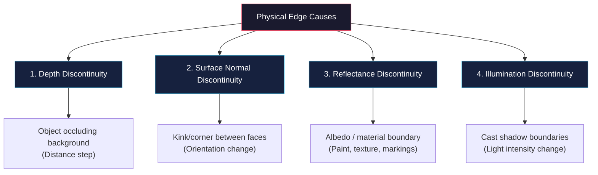
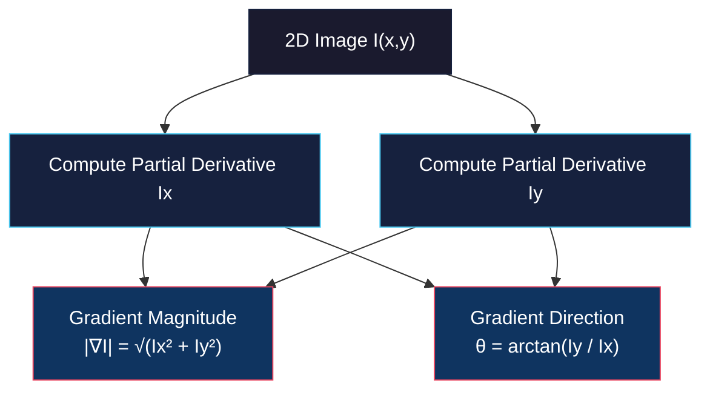
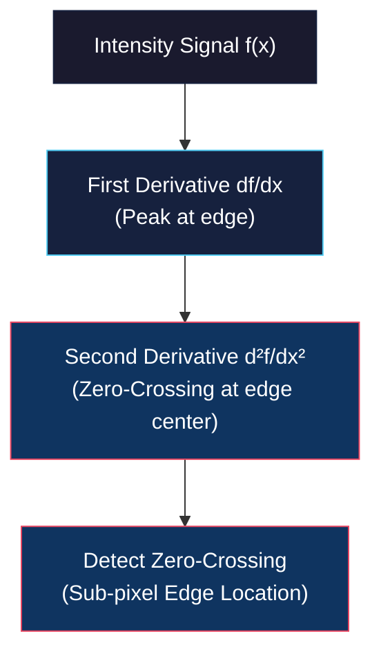

# Overview, Gradients, and Laplacian Edge Detection

<!-- toc -->

This technical note covers one of the fundamental information theory topics in computer vision: **Edge Detection**. We explore its physical origins, mathematical formulations based on first derivatives (Gradients), and second derivatives (Laplacian), along with their practical discrete implementations.

---

## 1. Introduction and What is an Edge?

### 1.1. Definition of Edge and Information Theory Perspective

In computer vision, an **edge** is defined as a set of connected pixels in a local neighborhood across which the image intensity (brightness) undergoes a sharp, abrupt, and directional change.

From an **information theory** perspective, edges carry the vast majority of semantic and geometric information of a scene while discarding illumination variations and homogeneous regions:
- **Data Sparsity:** Retaining only edge pixels dramatically compresses the image payload, transforming dense pixel matrices into sparse structures.
- **Perceptual Sufficiency:** Human visual perception relies heavily on boundary contours. As demonstrated by Vic Nalwa using Henry Moore's sculpture artwork, comparing a high-resolution photograph of a 3D sculpture with a minimal line sketch reveals that human visual cortex can reconstruct 3D shape, curvature, and surface highlights using almost exclusively sparse line contours.

<figure style="display:flex; justify-content: center; margin: 20px 0;">
  

    
    <figcaption style="margin-top: 0.5em; text-align: center; font-size: 13px; color: #888;"><em>Visual information sparsity: Henry Moore 3D sculpture photograph alongside minimal line sketch (Nalwa).</em></figcaption>
  

</figure>

> **Key Insight:** Edges maximize information density by encoding 3D object geometry, surface boundaries, and illumination transitions while suppressing redundant homogeneous background data.

---

### 1.2. Physical Causes of Edges

Intensity discontinuities in the image plane stem from four fundamental physical phenomena in the 3D world:

1. **Depth Discontinuity:** Occurs when an object occludes another object or background, producing an abrupt step change in distance relative to the camera sensor.
2. **Surface Normal Discontinuity:** Occurs at geometric boundaries where two surfaces meet at an angle (e.g., the edge of a cube). Even if both surfaces possess identical material properties, their distinct 3D orientations cause them to receive different amounts of incident light.
3. **Surface Reflectance Discontinuity:** Occurs due to changes in surface material composition, paint, or albedo (e.g., printed text on a label, surface markings).
4. **Illumination / Shadow Discontinuity:** Occurs at boundaries formed by cast shadows or specular highlights, where incident light intensity changes abruptly.

<figure style="display:flex; justify-content: center; margin: 20px 0;">
  

    
    <figcaption style="margin-top: 0.5em; text-align: center; font-size: 13px; color: #888;"><em>Physical edge drivers demonstrated on a bottle object: depth, surface normal, reflectance, and illumination discontinuities.</em></figcaption>
  

</figure>

---

### 1.3. Edge Profile Types and Real-World Challenges

Mathematically, edge profiles are categorized into idealized 1D models:

- **Step Edge:** An instantaneous transition from intensity $I_0$ to $I_1$.
- **Ramp / Step Edge with Gradient:** A continuous, sloped intensity transition across a finite spatial width.
- **Roof Edge / Line Edge:** A thin ridge formed by two adjacent ramp transitions (a rising ramp immediately followed by a falling ramp).

$$\begin{aligned}
\text{Step Edge:} \quad & f(x) = \begin{cases} I_0, & x < 0 \\ I_1, & x \ge 0 \end{cases} \\
\text{Roof Edge:} \quad & f(x) = \begin{cases} I_0 + k x, & x < 0 \\ I_0 - k x, & x \ge 0 \end{cases}
\end{aligned}$$

<figure style="display:flex; justify-content: center; margin: 20px 0;">
  

    
    <figcaption style="margin-top: 0.5em; text-align: center; font-size: 13px; color: #888;"><em>Standard 1D geometric edge profiles: Step Edges, Roof Edge, and Line Edges.</em></figcaption>
  

</figure>

In real-world camera systems, ideal step edges do not exist due to physical degradation factors:
- Sensor noise (shot noise, thermal noise)
- Optical blur and point spread function (PSF) limitations
- Spatial discretization (sampling) and quantization noise
- Out-of-focus defocus blur

<figure style="display:flex; justify-content: center; margin: 20px 0;">
  

    
    <figcaption style="margin-top: 0.5em; text-align: center; font-size: 13px; color: #888;"><em>Real-world edge profile exhibiting continuous slope, noise fluctuations, and spatial sampling discretization.</em></figcaption>
  

</figure>

---

### 1.4. Criteria for an Ideal Edge Operator

An edge detection operator processes local pixel neighborhoods and must output three key measurements for every pixel:
1. **Edge Position:** Precise pixel or sub-pixel spatial coordinates $(x, y)$.
2. **Edge Strength / Magnitude:** The degree of intensity contrast.
3. **Edge Orientation:** The normal direction angle $\theta$ relative to the horizontal axis.

John Canny formalized the optimal mathematical performance requirements for edge detectors into three criteria:

> **Canny's Optimal Detection Criteria:**
> 1. **High Detection Rate (Low Error Rate):** Minimize false negatives (missing true edges) and false positives (marking noise as edges).
> 2. **Good Localization:** The distance between the detected edge pixel and the true physical edge center must be minimized.
> 3. **Single Response Constraint:** The operator must return only one response per single edge (preventing thick, multiple response bands).

---

## 2. Edge Detection Using Gradients

Gradient-based edge detection computes first-order spatial derivatives to detect high rates of intensity change.

### 2.1. 1D Signal Analysis

For a 1D continuous intensity function $f(x)$:
- The first derivative $\frac{df}{dx}$ produces a local maximum (positive peak) for a rising edge.
- For a falling edge, $\frac{df}{dx}$ yields a local minimum (negative valley).
- Taking the absolute value $\left| \frac{df}{dx} \right|$ converts both rising and falling transitions into positive peaks. The peak location indicates the **edge center**, and the peak height reflects the **edge contrast strength**.

$$\frac{df}{dx} = \lim_{\Delta x \to 0} \frac{f(x + \Delta x) - f(x)}{\Delta x}$$

<figure style="display:flex; justify-content: center; margin: 20px 0;">
  

    
    <figcaption style="margin-top: 0.5em; text-align: center; font-size: 13px; color: #888;"><em>Continuous 1D intensity profile f(x) with rising and falling edge boundaries.</em></figcaption>
  

</figure>

<figure style="display:flex; justify-content: center; margin: 20px 0;">
  

    
    <figcaption style="margin-top: 0.5em; text-align: center; font-size: 13px; color: #888;"><em>First derivative ∂f/∂x extrema and its absolute value |∂f/∂x| positive peaks corresponding to edge locations.</em></figcaption>
  

</figure>

---

### 2.2. 2D Gradient Vector ($\nabla I$)

In 2D continuous space, intensity variations depend on direction. The **Gradient Vector** $\nabla I$ (or $\text{grad } I$) points in the direction of the steepest intensity increase:

$$\nabla I = \begin{bmatrix} \frac{\partial I}{\partial x} \\[6pt] \frac{\partial I}{\partial y} \end{bmatrix} = \begin{bmatrix} I_x \\[6pt] I_y \end{bmatrix}$$

From the partial derivatives $I_x$ and $I_y$, we compute two essential spatial metrics:

1. **Gradient Magnitude (Edge Strength):**
   $$|\nabla I| = \sqrt{I_x^2 + I_y^2} \approx |I_x| + |I_y|$$

2. **Gradient Orientation (Normal Angle):**
   $$\theta = \tan^{-1} \left( \frac{I_y}{I_x} \right)$$

<figure style="display:flex; justify-content: center; margin: 20px 0;">
  

    
    <figcaption style="margin-top: 0.5em; text-align: center; font-size: 13px; color: #888;"><em>Behavior of 2D gradient vector ∇I for vertical (Ix ≠ 0, Iy = 0), horizontal (Ix = 0, Iy ≠ 0), and angled edge boundaries.</em></figcaption>
  

</figure>

<figure style="display:flex; justify-content: center; margin: 20px 0;">
  

    
    <figcaption style="margin-top: 0.5em; text-align: center; font-size: 13px; color: #888;"><em>Decomposition of Lena image into horizontal partial derivative ∂I/∂x, vertical partial derivative ∂I/∂y, and combined Gradient Magnitude map |∇I|.</em></figcaption>
  

</figure>

> **Note on Orientation:** The gradient direction $\theta$ is perpendicular to the boundary contour of the edge. The actual tangent boundary line runs at an angle of $\theta + \frac{\pi}{2}$.

---

### 2.3. Finite Differences in Discrete Images

On a discrete 2D grid, continuous derivatives are approximated using **finite differences**. Using a symmetric center scheme requires small neighborhood windows:

$$\frac{\partial I}{\partial x} \approx \frac{I(x+1, y) - I(x-1, y)}{2\Delta x}, \quad \frac{\partial I}{\partial y} \approx \frac{I(x, y+1) - I(x, y-1)}{2\Delta y}$$

Assuming unit inter-pixel distance $\epsilon = 1$, 2D finite difference convolution kernels are expressed as:

$$M_x = \frac{1}{2} \begin{bmatrix} -1 & 1 \\ -1 & 1 \end{bmatrix}, \quad M_y = \frac{1}{2} \begin{bmatrix} 1 & 1 \\ -1 & -1 \end{bmatrix}$$

---

### 2.4. Comparison of Classic Gradient Filters

To mitigate high-frequency sensor noise, modern gradient operators combine a finite-difference derivative filter with a low-pass smoothing filter (e.g., Gaussian or uniform box filter).

<figure style="display:flex; justify-content: center; margin: 20px 0;">
  

    
    <figcaption style="margin-top: 0.5em; text-align: center; font-size: 13px; color: #888;"><em>Discrete gradient operator kernels (Roberts, Prewitt, Sobel 3x3, Sobel 5x5) and the fundamental trade-off between localization vs noise robustness.</em></figcaption>
  

</figure>

| Operator | Kernel Size | Mathematical Formulation | Properties & Trade-offs |
| :--- | :---: | :--- | :--- |
| **Roberts Cross** | $2 \times 2$ | $D_x = \begin{bmatrix} 0 & 1 \\ -1 & 0 \end{bmatrix}, \, D_y = \begin{bmatrix} 1 & 0 \\ 0 & -1 \end{bmatrix}$ | Extremely fast, high localization accuracy, but **highly sensitive to noise**. |
| **Prewitt** | $3 \times 3$ | $P_x = \begin{bmatrix} -1 & 0 & 1 \\ -1 & 0 & 1 \\ -1 & 0 & 1 \end{bmatrix}, \, P_y = \begin{bmatrix} 1 & 1 & 1 \\ 0 & 0 & 0 \\ -1 & -1 & -1 \end{bmatrix}$ | Combines 1D uniform smoothing with 1D central difference. Good noise attenuation. |
| **Sobel** | $3 \times 3$ | $S_x = \begin{bmatrix} -1 & 0 & 1 \\ -2 & 0 & 2 \\ -1 & 0 & 1 \end{bmatrix}, \, S_y = \begin{bmatrix} 1 & 2 & 1 \\ 0 & 0 & 0 \\ -1 & -2 & -1 \end{bmatrix}$ | Weight of 2 at center pixel provides **Gaussian smoothing**. Industry standard $3 \times 3$ operator. |
| **Extended Sobel** | $5 \times 5+$ | Larger Gaussian-weighted derivative kernels | Excellent noise suppression, but **degrades edge localization** due to spatial blurring. |

---

### 2.5. Thresholding and Hysteresis

Once the gradient magnitude map $|\nabla I|$ is computed, binary edge maps are extracted via thresholding:

1. **Single Global Thresholding:**
   $$E(x,y) = \begin{cases} 1, & |\nabla I(x,y)| \ge T \\ 0, & |\nabla I(x,y)| < T \end{cases}$$
   - *Problem:* A high $T$ causes broken contours; a low $T$ introduces excessive false edges caused by noise.

2. **Hysteresis Dual Thresholding:**
   Uses two thresholds: a high threshold $T_{high}$ and a low threshold $T_{low}$.
   - **Strong Edges:** $|\nabla I| \ge T_{high} \rightarrow$ Immediately accepted.
   - **Weak Edges:** $T_{low} \le |\nabla I| < T_{high} \rightarrow$ Accepted **only** if connected to a strong edge path.
   - **Non-Edges:** $|\nabla I| < T_{low} \rightarrow$ Rejected.

---

## 3. Edge Detection Using Laplacian

While gradient operators rely on first-order derivatives, the **Laplacian** approach uses second-order derivatives.

### 3.1. Second Derivative and Zero-Crossings

For a continuous 1D function $f(x)$, the second derivative $\frac{d^2f}{dx^2}$ measures acceleration in intensity change:
- At the inflection point (the exact center of a ramp edge), the second derivative passes through zero.
- The transition from positive peak to negative valley creates a sharp **Zero-Crossing**.

$$\frac{d^2f}{dx^2} = \lim_{\Delta x \to 0} \frac{f(x+\Delta x) - 2f(x) + f(x-\Delta x)}{\Delta x^2}$$

<figure style="display:flex; justify-content: center; margin: 20px 0;">
  

    
    <figcaption style="margin-top: 0.5em; text-align: center; font-size: 13px; color: #888;"><em>Comparison of first derivative extrema vs second derivative zero-crossings indicating exact edge centers.</em></figcaption>
  

</figure>

> **Key Advantage:** Finding local maxima of first derivatives is computationally sensitive to threshold choices, whereas finding **zero-crossings** of second derivatives provides precise, closed edge contours.

---

### 3.2. 2D Laplacian Operator ($\nabla^2 I$)

The 2D Laplacian operator is an isotropic (rotation-invariant) scalar operator defined as the sum of unmixed second partial derivatives:

$$\nabla^2 I = \frac{\partial^2 I}{\partial x^2} + \frac{\partial^2 I}{\partial y^2}$$

**Key Properties:**
- **Isotropic:** Responds equally to edges in all orientations.
- **Scalar Output:** Returns a single scalar response map rather than a vector.
- **No Orientation Info:** Unlike $\nabla I$, the Laplacian $\nabla^2 I$ does **not** provide the edge orientation angle $\theta$.

---

### 3.3. Discrete Laplacian Kernels and Diagonal Correction

In discrete grids, 2D second derivatives are approximated using 3x3 stencil operations:

<figure style="display:flex; justify-content: center; margin: 20px 0;">
  

    
    <figcaption style="margin-top: 0.5em; text-align: center; font-size: 13px; color: #888;"><em>Discrete finite difference formulas for 2D Laplacian and comparison of standard 4-neighbor vs diagonal-corrected 8-neighbor convolution kernels.</em></figcaption>
  

</figure>

1. **Standard 4-Neighbor Laplacian Kernel:**
   $$L_4 = \begin{bmatrix} 0 & 1 & 0 \\ 1 & -4 & 1 \\ 0 & 1 & 0 \end{bmatrix}$$

2. **Diagonal-Corrected 8-Neighbor Laplacian Kernel:**
   To correct for spatial anisotropy along $45^\circ$ diagonal pixel distances ($\sqrt{2}\epsilon$), the weighted 8-neighbor stencil is preferred:
   $$L_8 = \begin{bmatrix} 1 & 4 & 1 \\ 4 & -20 & 4 \\ 1 & 4 & 1 \end{bmatrix}$$

<figure style="display:flex; justify-content: center; margin: 20px 0;">
  

    
    <figcaption style="margin-top: 0.5em; text-align: center; font-size: 13px; color: #888;"><em>Lena image processed with 2D Laplacian (mapped to 128 mid-gray level) and extracted binary zero-crossing edge contours.</em></figcaption>
  

</figure>

---

### 3.4. Noise Sensitivity and Solution: Gaussian Smoothing (LoG and DoG)

Second derivatives severely amplify high-frequency noise. Taking the second derivative of raw image noise yields unmanageable noise spikes.

<figure style="display:flex; justify-content: center; margin: 20px 0;">
  

    
    <figcaption style="margin-top: 0.5em; text-align: center; font-size: 13px; color: #888;"><em>Severe noise amplification: taking the derivative of a noisy step signal obscures the true edge.</em></figcaption>
  

</figure>

To solve this, the image must first be smoothed with a 2D Gaussian filter $G_\sigma(x,y)$:

$$G_\sigma(x,y) = \frac{1}{2\pi \sigma^2} e^{-\frac{x^2+y^2}{2\sigma^2}}$$

<figure style="display:flex; justify-content: center; margin: 20px 0;">
  

    
    <figcaption style="margin-top: 0.5em; text-align: center; font-size: 13px; color: #888;"><em>Mitigating noise: convolving noisy signal with Gaussian filter prior to derivative evaluation.</em></figcaption>
  

</figure>

By the associative property of linear convolution:

$$\nabla^2 \left( G_\sigma * I \right) = \left( \nabla^2 G_\sigma \right) * I$$

<figure style="display:flex; justify-content: center; margin: 20px 0;">
  

    
    <figcaption style="margin-top: 0.5em; text-align: center; font-size: 13px; color: #888;"><em>Derivative of Gaussian (DoG) associative property: ∇(n_σ * f) = ∇(n_σ) * f saves one convolution step.</em></figcaption>
  

</figure>

This leads to the **Laplacian of Gaussian (LoG)** operator (also known as the *Mexican Hat Operator* due to its 3D inverted shape):

$$\text{LoG}(x,y) = -\frac{1}{\pi \sigma^4} \left[ 1 - \frac{x^2+y^2}{2\sigma^2} \right] e^{-\frac{x^2+y^2}{2\sigma^2}}$$

<figure style="display:flex; justify-content: center; margin: 20px 0;">
  

    
    <figcaption style="margin-top: 0.5em; text-align: center; font-size: 13px; color: #888;"><em>Laplacian of Gaussian (LoG) linear property: ∇²(n_σ * f) = ∇²(n_σ) * f yielding clean zero-crossing edge locator.</em></figcaption>
  

</figure>

<figure style="display:flex; justify-content: center; margin: 20px 0;">
  

    
    <figcaption style="margin-top: 0.5em; text-align: center; font-size: 13px; color: #888;"><em>3D surface visualizations of Derivative of Gaussian (∇G) directional filters vs Laplacian of Gaussian (∇²G) isotropic Inverted Sombrero kernel.</em></figcaption>
  

</figure>

Alternatively, **Difference of Gaussians (DoG)** efficiently approximates LoG by subtracting two Gaussian-blurred images with slightly different scale factors $\sigma_1$ and $\sigma_2$:

$$\text{DoG}(x,y) = G_{\sigma_1}(x,y) - G_{\sigma_2}(x,y) \approx (\sigma_1 - \sigma_2) \nabla^2 G_\sigma$$

---

## 4. Comparison of Gradient and Laplacian Operators

The following matrix summarizes the fundamental trade-offs between Gradient-based and Laplacian-based edge detection techniques:

| Feature / Metric | Gradient Operator ($\nabla I$) | Laplacian Operator ($\nabla^2 I$ / LoG) |
| :--- | :--- | :--- |
| **Mathematical Basis** | First Derivative (Spatial Rate of Change) | Second Derivative (Inflection / Acceleration) |
| **Primary Output** | Edge Position, Magnitude $|\nabla I|$, and Angle $\theta$ | Edge Position via **Zero-Crossings** only |
| **Edge Orientation ($\theta$)** | **Provided** ($\theta = \arctan(I_y / I_x)$) | **Not Provided** (Isotropic / Rotationally Symmetric) |
| **Linearity** | **Non-Linear** (contains sqrt and arctan) | **Linear** (computed via linear matrix convolution) |
| **Computational Complexity**| Higher (requires 2 directional convolutions + nonlinear algebra) | Lower (single matrix convolution) |
| **Detection Principle** | Local Maxima Peak Detection + Thresholding | Zero-Crossing sign change detection |
| **Noise Sensitivity** | Moderate (mitigated by Sobel/Prewitt smoothing) | High (requires prior Gaussian filtering: LoG / DoG) |

> **Conclusion:** Gradient operators provide direction and magnitude, making them essential for feature extraction and vector field computation. Laplacian operators provide mathematically continuous, closed zero-crossing boundaries. The fusion of these two methodologies led directly to the development of the **Canny Edge Detector**.
