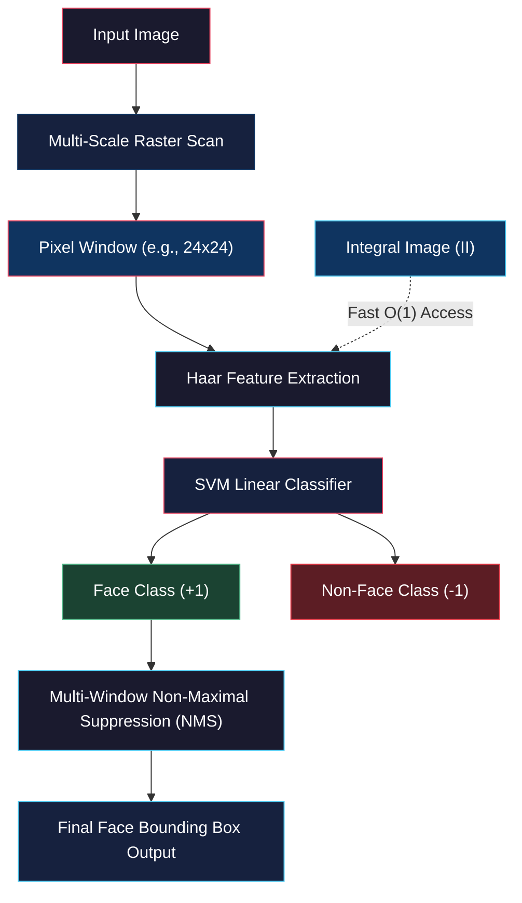

# Face Detection

<!-- toc -->

## 1. Overview

**Face detection** is a fundamental computer vision task that aims to determine the coordinates and extent of all human faces within a digital input image or video stream. The primary output of the detection algorithm is a local search window (bounding box) placed around each detected face.

<figure style="display:flex; justify-content: center; margin: 20px 0;">
  

    
    <figcaption style="margin-top: 0.5em; text-align: center; font-size: 13px; color: #888;"><em>Figure 1: Detection of human faces within a digital image using bounding boxes.</em></figcaption>
  

</figure>

<figure style="display:flex; justify-content: center; margin: 20px 0;">
  

    
    <figcaption style="margin-top: 0.5em; text-align: center; font-size: 13px; color: #888;"><em>Figure 2: Extracting feature vector f from a local candidate window and matching against a face model for binary prediction.</em></figcaption>
  

</figure>

### 1.1 Key Challenges in Face Detection

A robust face detection system must tolerate significant physical variations:

- **Scale Invariance:** Due to varying distances from the camera, facial bounding box sizes change continuously. The system must scan windows across multiple scale spaces.
- **Illumination Invariance:** Distinct facial geometry must remain detectable under diverse lighting conditions, specular highlights, and harsh shadows.
- **Pose Tolerance:** Slight in-plane tilts or out-of-plane head rotations (pose) must not collapse detection quality. To simplify initial theory, algorithms initially focus on frontal head-on faces.

<figure style="display:flex; justify-content: center; margin: 20px 0;">
  

    
    <figcaption style="margin-top: 0.5em; text-align: center; font-size: 13px; color: #888;"><em>Figure 3: Contrast between face class instances (left) and arbitrary non-face background scenes (right).</em></figcaption>
  

</figure>

### 1.2 Limitations & Comparison of Other Feature Models

The choice of visual features dictates both system execution speed and classification accuracy. Traditional feature representations exhibit distinct shortcomings in face detection:

1. **Edges and Corners:** A massive number of edge/corner pixels are produced by background clutter and image noise. Their discriminative power for defining complex face morphology is very low.
2. **SIFT (Scale-Invariant Feature Transform):** SIFT excels at matching identical local patches across different views of a specific object instance (appearance matching). However, face detection is not instance recognition; its goal is to draw general class decision boundaries between face vs. non-face patterns. Because human faces vary greatly across identities and expressions, SIFT fails to generalize efficiently for detection.
3. **Facial Component Templates:** Designing independent templates for facial sub-components (eyes, nose, mouth) and searching via cross-correlation (template matching) suffers from high shape variability within components (especially eyes), yielding historically limited success.

<figure style="display:flex; justify-content: center; margin: 20px 0;">
  

    
    <figcaption style="margin-top: 0.5em; text-align: center; font-size: 13px; color: #888;"><em>Figure 4: Conceptual limitations of traditional interest points (edges/corners/SIFT) and isolated facial component templates.</em></figcaption>
  

</figure>

> **Key Insight:** Because face detection is evaluated billions of times across every pixel and scale of an image, the chosen features must be both **highly discriminative** and **extremely fast to compute**. The visual representation satisfying both criteria is **Haar Features**.

---

## 2. Uses of Face Detection

Face detection serves as an essential precursor step across modern commercial and industrial applications:

- **Smartphone Cameras & Mobile Photography:** Opening a phone camera triggers real-time face detection. Hardware parameters such as autofocus, automatic exposure (AE), and color balance are dynamically adjusted to optimize the rendering quality of detected face regions.
- **Visual Search Engines:** Searching for "gates" in a search engine returns physical gates as well as people like Bill Gates. Filtering by "Face" executes background face detection to isolate images containing human faces.
- **Demographic Analytics & Intelligent Marketing:** Used in retail and public spaces to analyze customer demographics. For instance, digital vending machines at Shinagawa Station in Japan detect a customer's face to estimate gender and age (within a 5-year margin). Based on this demographic profile, targeted product recommendations are dynamically displayed. Additionally, shopping mall attention mapping uses face detection to price digital billboards.
- **Biometrics, Security & Surveillance:** Serving as the foundational first step for access control systems, crowd density monitoring, and real-time suspect identification in public or private security camera networks.

---

## 3. Haar Features

**Haar Features** used in face detection are two-valued filter masks based on 2D Haar Wavelet theory and rectangular box functions.

### 3.1 Principle & Mathematical Definition

Each Haar filter consists of adjacent white (+1 weight) and black (-1 weight) rectangular regions placed within a local analysis window.

Physically, sliding a Haar filter across an image computes a cross-correlation operation. Standard correlation requires multiplying pixel values by filter weights and summing them up. However, because Haar weights are strictly $+1$ and $-1$, the operation simplifies entirely to pure **additions and subtractions**, completely bypassing multiplications:

$$\text{Haar Response} = \sum_{(x,y) \in \text{White}} I(x,y) - \sum_{(x,y) \in \text{Black}} I(x,y)$$

where $I(x,y)$ represents original pixel intensity values. Eliminating multiplications provides an immense computational advantage for hardware processors (CPUs/GPUs).

<figure style="display:flex; justify-content: center; margin: 20px 0;">
  

    
    <figcaption style="margin-top: 0.5em; text-align: center; font-size: 13px; color: #888;"><em>Figure 5: Overlaying Haar filter H_A over facial structure (White=1, Black=-1) for correlation.</em></figcaption>
  

</figure>

<figure style="display:flex; justify-content: center; margin: 20px 0;">
  

    
    <figcaption style="margin-top: 0.5em; text-align: center; font-size: 13px; color: #888;"><em>Figure 6: Convolving the input image with filter cascade H_A, H_B, H_C, H_D to produce feature vector f[i,j].</em></figcaption>
  

</figure>

### 3.2 Haar Filter Types & Derivative Analogy

Haar filter banks are structured into scales and orientations to extract diverse geometric patterns:

1. **Two-Rectangle Filters (Vertical/Horizontal):** A vertical filter with white on the left and black on the right captures sharp horizontal intensity transitions. It acts analogously to a first-order derivative (gradient) operator and functions as a large-scale edge detector.
2. **Three-Rectangle Filters (e.g., White-Black-White):** Filters with a central black strip flanked by white rectangles simulate a second-order derivative (Laplacian) operator, detecting line and ridge structures.
3. **Complex Multi-Rectangle Filters:** Four-rectangle diagonal patterns represent higher-order partial derivatives, capturing complex texture transitions.

<figure style="display:flex; justify-content: center; margin: 20px 0;">
  

    
    <figcaption style="margin-top: 0.5em; text-align: center; font-size: 13px; color: #888;"><em>Figure 7: Bank of Haar filters arranged across columns representing multiple spatial scales and aspect ratios.</em></figcaption>
  

</figure>

### 3.3 Standard Computation Cost

For a standard image patch, computing the response of a single $N \times M$ Haar filter directly requires:

$$\text{Number of Addition Operations} = (N \times M) - 1$$

Although multiplication-free, evaluating this for millions of image pixels across dozens of scales and hundreds of feature templates creates a massive computational bottleneck, preventing real-time performance. This challenge is overcome using the **Integral Image**.

---

## 4. Integral Image

An **Integral Image (Summed-Area Table)** is an intermediate image representation that enables computing the sum of pixel values within *any* rectangular sub-region in **$O(1)$ constant time**, independent of rectangle size.

### 4.1 Mathematical Definition

For an original image $I(x,y)$, the integral image $II(x,y)$ stores the sum of all pixels above and to the left of $(x,y)$, inclusive:

$$II(x,y) = \sum_{x' \le x, \, y' \le y} I(x',y')$$

<figure style="display:flex; justify-content: center; margin: 20px 0;">
  

    
    <figcaption style="margin-top: 0.5em; text-align: center; font-size: 13px; color: #888;"><em>Figure 8: Pixel matrix Image I (left) vs Integral Image II (right), storing top-left cumulative area sums at each cell.</em></figcaption>
  

</figure>

### 4.2 Single-Pass Raster Construction

The integral image is constructed in a single raster scan over the image ($O(N)$ complexity). The integral value at coordinate $O(x,y)$ is computed recursively using its left neighbor ($A$), top neighbor ($B$), and top-left diagonal neighbor ($C$):

$$II(O) = II(A) + II(B) - II(C) + I(O)$$

> **Logic / Proof:** Summing the top region ($II(B)$) and left region ($II(A)$) double-counts their intersection area ($II(C)$). Subtracting $II(C)$ once corrects this double counting before adding the current pixel value $I(O)$.

<figure style="display:flex; justify-content: center; margin: 20px 0;">
  

    
    <figcaption style="margin-top: 0.5em; text-align: center; font-size: 13px; color: #888;"><em>Figure 9: Computing cell A recursively during single-pass raster scanning (II_A = II_B + II_C - II_D + I_A).</em></figcaption>
  

</figure>

### 4.3 $O(1)$ Constant Time Rectangle Sum Calculation

Once built, the pixel sum inside any target rectangle $D$ bounded by vertices $P, Q, R, S$ requires only **4 array lookups** and **3 arithmetic operations**:

$$\text{Rectangle Sum} = II(P) - II(Q) - II(S) + II(R)$$

<figure style="display:flex; justify-content: center; margin: 20px 0;">
  

    
    <figcaption style="margin-top: 0.5em; text-align: center; font-size: 13px; color: #888;"><em>Figure 10: Computing rectangular area sum in only 3 addition/subtraction steps using corner lookups P, Q, R, S (3490 - 1137 - 1249 + 417 = 1521).</em></figcaption>
  

</figure>

**Explanation:** Bottom-right vertex $II(P)$ gives the total sum of the entire top-left region. Subtracting top strip $II(Q)$ and left strip $II(S)$ removes non-target regions. Because intersection region $II(R)$ was subtracted twice, adding $II(R)$ back restores exact balance.

This calculation cost is strictly constant ($O(1)$) whether the rectangle spans $3 \times 3$ or $300 \times 300$ pixels.

### 4.4 Application to Haar Features & Computational Speedup

A two-rectangle Haar feature (one black, one white region) is modeled as two adjacent rectangles:

1. White region sum is obtained using 4 corner lookups ($O, T, R, S$).
2. Black region sum is obtained using 4 corner lookups ($P, Q, T, O$).

Subtracting the two region sums cancels out shared border vertices:

$$\text{Haar Response} = (II(O) - II(T) + II(R) - II(S)) - (II(P) - II(Q) + II(T) - II(O))$$

<figure style="display:flex; justify-content: center; margin: 20px 0;">
  

    
    <figcaption style="margin-top: 0.5em; text-align: center; font-size: 13px; color: #888;"><em>Figure 11: Evaluating a two-rectangle Haar filter response in exactly 7 addition operations via shared integral boundary cancellation.</em></figcaption>
  

</figure>

After simplification, any Haar feature response is evaluated in exactly **7 addition/subtraction operations**. This constant-time evaluation provides dramatic acceleration for multi-scale face detection.

---

## 5. Nearest Neighbor Classifier

After extracting Haar feature vectors from candidate windows, a classification model determines whether the vector represents a face or non-face.

### 5.1 Principle

A training dataset of thousands of labeled face and non-face image patches is collected. An $N$-element Haar feature vector is represented as a point in $N$-dimensional feature space.

<figure style="display:flex; justify-content: center; margin: 20px 0;">
  

    
    <figcaption style="margin-top: 0.5em; text-align: center; font-size: 13px; color: #888;"><em>Figure 12: Mapping test query windows into N-dimensional feature space to assign Face (left) or Non-Face (right) class labels based on closest training point.</em></figcaption>
  

</figure>

In a **Nearest Neighbor (NN)** classifier:

1. A candidate window feature vector is computed and positioned in $N$-dimensional space.
2. Geometric Euclidean distances to all stored training samples are computed.
3. The label of the closest training point (closest neighbor) is retrieved.
4. The test window is assigned the retrieved class label (Face or Non-Face).

### 5.2 False Positives & Dataset Expansion

If a non-face test pattern resembles facial geometry (e.g., a cat face or unaligned partial feature), its vector may fall near the face cluster, causing a **false positive**.

<figure style="display:flex; justify-content: center; margin: 20px 0;">
  

    
    <figcaption style="margin-top: 0.5em; text-align: center; font-size: 13px; color: #888;"><em>Figure 13: Misclassifying a cat face as false positive (left) vs surrounding feature space outliers by expanding non-face training data (right).</em></figcaption>
  

</figure>

The direct resolution is expanding the training dataset—particularly with diverse non-face examples. Densely surrounding non-face geometric outliers with non-face labels prevents misclassifications.

### 5.3 Computational Bottleneck & Need for Decision Boundaries

However, scaling training data creates severe latency issues. A brute-force NN classifier evaluates test points against every stored training sample ($O(N \cdot d)$ time). Even with indexing trees (K-D Trees), performing exhaustive point searches across millions of windows per frame is computationally prohibitive.

<figure style="display:flex; justify-content: center; margin: 20px 0;">
  

    
    <figcaption style="margin-top: 0.5em; text-align: center; font-size: 13px; color: #888;"><em>Figure 14: Constructing a geometric decision plane between face and non-face clusters to bypass point-by-point database searching.</em></figcaption>
  

</figure>

> **Key Insight:** To eliminate linear scan overhead, instead of searching individual database points, geometric **Decision Boundaries** are placed between face and non-face clusters. Once a decision boundary is established, evaluating a new point requires only checking which side of the boundary hyperplane it lies on.

---

## 6. Support Vector Machine (SVM)

A **Support Vector Machine (SVM)** computes the mathematically optimal linear decision boundary separating face and non-face feature clusters while maximizing geometric margins.

### 6.1 Geometric Formulation of Linear Decision Boundaries

The dimensionality of feature space determines the boundary geometry:

- **2D Space:** The boundary is a 1D line.
- **3D Space:** The boundary is a 2D plane.
- **N-D Space:** The boundary is an $(N-1)$-dimensional hyperplane.

In all dimensions, the hyperplane is expressed in vector form:

$$\mathbf{w}^T \mathbf{f} + b = 0$$

<figure style="display:flex; justify-content: center; margin: 20px 0;">
  

    
    <figcaption style="margin-top: 0.5em; text-align: center; font-size: 13px; color: #888;"><em>Figure 15: Vector representation of decision line w^T f + b = 0 and evaluating side orientation signs.</em></figcaption>
  

</figure>

where:
- $\mathbf{w}$: Weight vector defining hyperplane orientation and coefficients.
- $\mathbf{f}$: Input Haar feature vector.
- $b$: Scalar bias (intercept) parameter.

For a query vector $\mathbf{f}$, the sign of the hyperplane equation yields the class:
- If $\mathbf{w}^T \mathbf{f} + b > 0 \rightarrow$ Classified as **Face (+1)**.
- If $\mathbf{w}^T \mathbf{f} + b < 0 \rightarrow$ Classified as **Non-Face (-1)**.

### 6.2 Safe Zone & Margin ($\rho$)

Infinitely many hyperplanes can separate linearly separable training sets. Selecting an arbitrary boundary risks poor generalization on unseen data.

<figure style="display:flex; justify-content: center; margin: 20px 0;">
  

    
    <figcaption style="margin-top: 0.5em; text-align: center; font-size: 13px; color: #888;"><em>Figure 16: Multiple valid decision lines capable of zero-error separation on training data.</em></figcaption>
  

</figure>

To maximize stability, a **safe zone** of total thickness **margin ($\rho$)** is constructed around the decision boundary. The margin represents the maximum width the boundary strip can expand before contacting training points.

SVM optimizes: Maximizing the margin thickness ($\rho$) separating face (+1) and non-face (-1) classes (**maximum margin classification**).

<figure style="display:flex; justify-content: center; margin: 20px 0;">
  

    
    <figcaption style="margin-top: 0.5em; text-align: center; font-size: 13px; color: #888;"><em>Figure 17: Selecting maximum safe margin (Margin I, left) over narrow unstable candidate decision lines (right).</em></figcaption>
  

</figure>

### 6.3 Support Vectors

Training points touching the outer boundaries of the safe zone are called **Support Vectors**.

<figure style="display:flex; justify-content: center; margin: 20px 0;">
  

    
    <figcaption style="margin-top: 0.5em; text-align: center; font-size: 13px; color: #888;"><em>Figure 18: Support vectors (circled points) touching boundary safe zone margins and controlling boundary location.</em></figcaption>
  

</figure>

> **Key Insight:** The optimal decision hyperplane depends exclusively on support vectors. Once calculated, all other training points outside the safe zone boundary can be safely discarded, drastically reducing memory footprint and prediction latency.

### 6.4 Mathematical Optimization & Constraints

For $k$ training vectors $\mathbf{f}_i$ with labels $\lambda_i \in \{+1, -1\}$:

- Face points ($\lambda_i = +1$): $\mathbf{w}^T \mathbf{f}_i + b \geq \frac{\rho}{2}$
- Non-face points ($\lambda_i = -1$): $\mathbf{w}^T \mathbf{f}_i + b \leq -\frac{\rho}{2}$

Combined constraint formulation:

$$\lambda_i \left( \mathbf{w}^T \mathbf{f}_i + b \right) \geq \frac{\rho}{2}$$

For support vectors $\mathbf{f}_s$, the constraint holds with strict equality: $\lambda_s (\mathbf{w}^T \mathbf{f}_s + b) = \frac{\rho}{2}$. Convex quadratic optimization algorithms solve for optimal parameters $\mathbf{w}$ and $b$.

### 6.5 Classifying New Data Points

For a new window feature vector $\mathbf{f}$, signed distance $d$ to the decision boundary is computed:

$$d = \mathbf{w}^T \mathbf{f} + b$$

Classification rules:

<figure style="display:flex; justify-content: center; margin: 20px 0;">
  

    
    <figcaption style="margin-top: 0.5em; text-align: center; font-size: 13px; color: #888;"><em>Figure 19: Classification decision rules comparing signed distance d against margin limits.</em></figcaption>
  

</figure>

- $d \ge \frac{\rho}{2} \rightarrow$ Outside safe zone on face side; **Definitely Face**.
- $d \le -\frac{\rho}{2} \rightarrow$ Outside safe zone on non-face side; **Definitely Non-Face**.
- $0 < d < \frac{\rho}{2} \rightarrow$ Inside safe zone on face side; **Probably Face**.
- $-\frac{\rho}{2} < d < 0 \rightarrow$ Inside safe zone on non-face side; **Probably Not Face**.

### 6.6 Non-Maximal Suppression (NMS)

Scanning a video frame produces multiple overlapping bounding box detections around a single face because neighboring window offsets also pass the classifier threshold. **Non-Maximal Suppression (NMS)** merges overlapping candidate bounding boxes, retaining only the highest-scoring detection window.

---

## 7. Summary & Final Evaluation

1. **Mature Technology:** Face detection represents a mature computer vision technology deployed pervasively across consumer devices and security infrastructure.
2. **Handling Pose Variations:** Frontal models struggle with profile views. Systems integrate multi-pose models (e.g., dedicated classifiers trained for 30–60° or full profile angles).
3. **Surpassing Human Performance:** Modern face recognition systems built atop face detection pipelines exceed human visual recognition accuracy on benchmark evaluation datasets.
