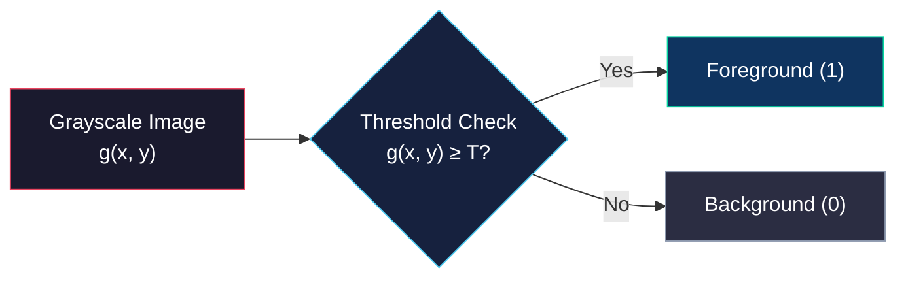
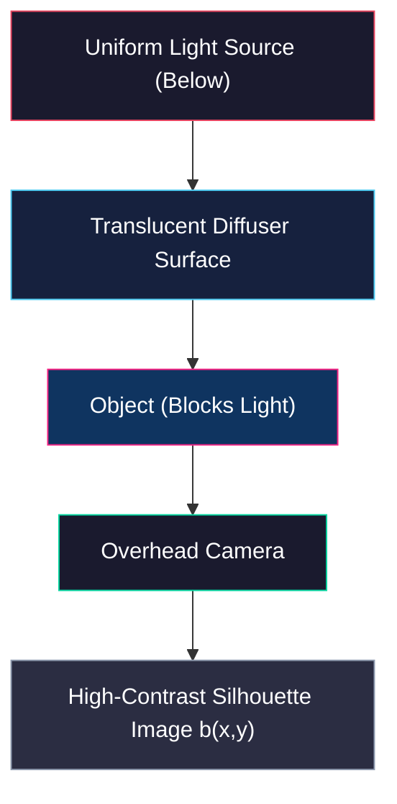
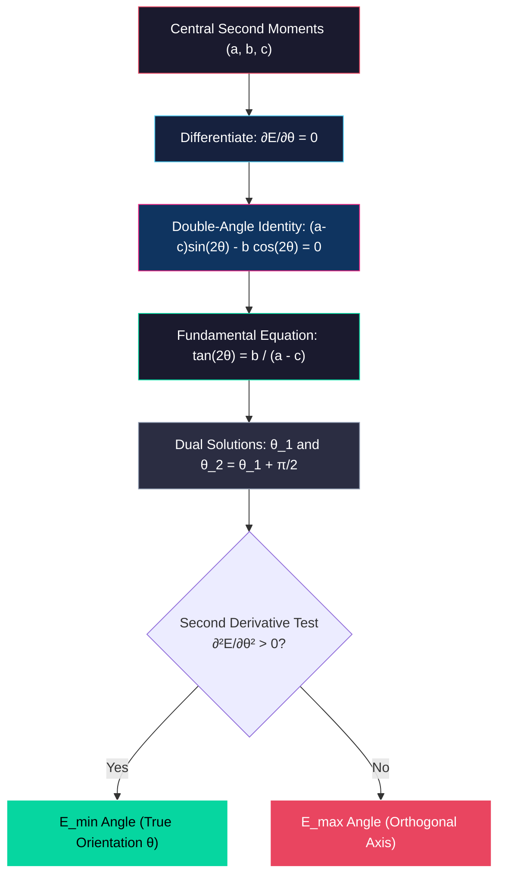

# Mathematical Foundations and Geometric Properties of Binary Images

<!-- toc -->

Binary images represent the simplest yet most robust and computationally efficient image representation in computer vision, particularly within industrial automation and structured environments. This section explores the physical and mathematical processes involved in converting grayscale images into binary representations, alongside the continuous and discrete geometric moment calculations used to determine the position, orientation, and structural properties of single objects.

> **Key Insight:** Binary images eliminate complex color and texture details to focus exclusively on object geometry. Through appropriate optical setup and moment analysis, an object's position ($x, y$), area ($A$), and orientation ($\theta$) can be computed with $O(N)$ complexity in milliseconds.

---

## 1. The Nature and Acquisition of Binary Images

A binary image is a matrix structure where each pixel takes one of only two possible values ($0$ or $1$). Typically, a value of $1$ (white) denotes the foreground object under analysis, while $0$ (black) represents the background.

### 1.1 Thresholding and the Characteristic Function

The mathematical transformation used to convert a grayscale image $g(x,y)$ into a binary image $b(x,y)$ is called **thresholding**. This operation is defined by the characteristic (indicator) function:

$$b(x,y) = \begin{cases} 0, & g(x,y) < T \\ 1, & g(x,y) \ge T \end{cases}$$

Here, $T$ denotes the global threshold value defining the intensity boundary.

### 1.2 Selection of Optimum Threshold Value (Histogram Valley)

To automatically determine an optimal threshold $T$, the brightness histogram of the grayscale image is analyzed. In controlled lighting environments, the histogram typically exhibits a **bimodal** distribution:

1. **First Mode (Peak):** Corresponding to the concentration of background pixels.
2. **Second Mode (Peak):** Corresponding to the concentration of foreground object pixels.

The deepest point between these two peaks is called the **valley**. Selecting the ideal threshold $T$ at this valley intensity provides the most stable separation of object boundaries.

<figure style="display:flex; justify-content: center; margin: 20px 0;">
  

    
    <figcaption style="margin-top: 0.5em; text-align: center; font-size: 13px; color: #888;"><em>Grayscale Image, Brightness Histogram, and Optimum Threshold (T) Selection</em></figcaption>
  

</figure>

### 1.3 Stable Configurations and Silhouette Imaging

Three-dimensional objects resting on a planar surface assume a finite number of **stable configurations** under gravity. A overhead camera observes the object in one of these stable resting poses (subject to 2D translation and rotation). This property allows 3D objects to be identified and localized via 2D binary silhouette analysis.

However, under direct top-down illumination, shadows, specularities, surface textures, and material reflectance often cause simple thresholding to fail. To overcome these physical limitations, a **Backlighting** optical arrangement is employed:

- Objects are placed on a translucent surface illuminated uniformly from below.
- When viewed from above, the object completely blocks the light, delivering a high-contrast, smooth, and noise-free silhouette directly to the camera sensor.

<figure style="display:flex; justify-content: center; margin: 20px 0;">
  

    
    <figcaption style="margin-top: 0.5em; text-align: center; font-size: 13px; color: #888;"><em>Overhead Illumination (Frontlighting) vs. Backlighting Comparison</em></figcaption>
  

</figure>

> **Key Insight:** Backlighting leverages optical physics rather than heavy software preprocessing to generate flawless binary silhouettes directly at the sensor level.

---

## 2. Geometric Moments and Position Estimation in Continuous Binary Images

Geometric properties are analyzed under the assumption that a single object is present in continuous space. The characteristic function takes $b(x,y) = 1$ over the object domain and $b(x,y) = 0$ over the background.

### 2.1 Area (Zero-th Moment)

The total area ($A$) occupied by the object represents the zeroth moment of the image, calculated by integrating over the image domain:

$$A = \iint b(x,y) \, dx \, dy$$

Area is the most fundamental invariant feature for distinguishing among a finite set of known objects regardless of translation or rotation.

### 2.2 Position (Center of Area / Centroid - First Moment)

The object's position in the image plane is defined by its **center of area (centroid)**. This center directly corresponds to the center of mass of a thin planar plate with uniform density. Dividing the first moments by the total area yields the centroid coordinates $(\bar{x}, \bar{y})$:

$$\bar{x} = \frac{1}{A} \iint x \cdot b(x,y) \, dx \, dy$$

$$\bar{y} = \frac{1}{A} \iint y \cdot b(x,y) \, dx \, dy$$

<figure style="display:flex; justify-content: center; margin: 20px 0;">
  

    
    <figcaption style="margin-top: 0.5em; text-align: center; font-size: 13px; color: #888;"><em>Area (Zeroth Moment) and Center of Area (First Moment / Centroid) in Continuous Domain</em></figcaption>
  

</figure>

---

## 3. Determining Object Orientation (Axis of Least Second Moment)

For a robotic arm to grasp an object accurately, it requires both the centroid position and the planar **orientation** of the object. Orientation is defined mathematically by the **Axis of Least Second Moment**.

### 3.1 Second Moment Function ($E$) and Line Parameterization

The second moment ($E$) about any axis is the integral of the squared perpendicular distances ($r$) from all object points to that axis:

$$E = \iint r^2 \cdot b(x,y) \, dx \, dy$$

The standard line equation $y = mx + b$ introduces singularity errors in optimization as vertical lines approach $m \to \infty$. Therefore, a trigonometric line parameterization is used:

$$x \sin\theta - y \cos\theta + \rho = 0$$

Where:
- $\theta$: The angle between the normal to the line and the horizontal axis ($\theta \in [0, 2\pi]$).
- $\rho$: The perpendicular distance from the origin to the line.

The perpendicular distance $r$ from point $(x,y)$ to this line simplifies directly using $\sin^2\theta + \cos^2\theta = 1$:

$$r = x \sin\theta - y \cos\theta + \rho$$

### 3.2 Proof That the Axis Passes Through the Center of Area

Expanding the second moment expression yields:

$$E(\theta, \rho) = \iint (x \sin\theta - y \cos\theta + \rho)^2 \cdot b(x,y) \, dx \, dy$$

To find the value of $\rho$ that minimizes $E$, we set the partial derivative with respect to $\rho$ to zero:

$$\frac{\partial E}{\partial \rho} = 2 \iint (x \sin\theta - y \cos\theta + \rho) \cdot b(x,y) \, dx \, dy = 0$$

Distributing the integral and substituting the zeroth and first moment definitions ($A, \bar{x}, \bar{y}$):

$$\sin\theta \iint x \cdot b(x,y) \, dx \, dy - \cos\theta \iint y \cdot b(x,y) \, dx \, dy + \rho \iint b(x,y) \, dx \, dy = 0$$

$$A \bar{x} \sin\theta - A \bar{y} \cos\theta + A \rho = 0$$

Since $A \neq 0$, dividing by $A$ gives:

$$\bar{x} \sin\theta - \bar{y} \cos\theta + \rho = 0$$

> **Mathematical Proof:** This equation confirms that the axis of least second moment must pass through the object's center of area $(\bar{x}, \bar{y})$.

### 3.3 Eliminating $\rho$ via Coordinate Translation

Given that the axis passes through the centroid, we translate the origin to $(\bar{x}, \bar{y})$:

$$x' = x - \bar{x} \quad \text{and} \quad y' = y - \bar{y}$$

In this translated coordinate system, $\rho = 0$, reducing the second moment to:

$$E(\theta) = a \sin^2\theta - b \sin\theta \cos\theta + c \cos^2\theta$$

Where $a, b, c$ are the **central second moments** of the image:

- $a = \iint (x')^2 \cdot b(x,y) \, dx' \, dy'$ (moment of inertia about the $y$-axis)
- $b = 2 \iint (x' y') \cdot b(x,y) \, dx' \, dy'$ (product / correlation moment)
- $c = \iint (y')^2 \cdot b(x,y) \, dx' \, dy'$ (moment of inertia about the $x$-axis)

---

## 4. Solving Orientation Angle and Shape Analysis

### 4.1 Orientation Angle Formula ($\theta$)

Differentiating $E(\theta)$ with respect to $\theta$ and setting it to zero yields:

$$\frac{\partial E}{\partial \theta} = 2a \sin\theta \cos\theta - b(\cos^2\theta - \sin^2\theta) - 2c \sin\theta \cos\theta = 0$$

Applying double-angle identities ($\sin 2\theta = 2\sin\theta\cos\theta$ and $\cos 2\theta = \cos^2\theta - \sin^2\theta$):

$$(a - c) \sin 2\theta - b \cos 2\theta = 0$$

Which gives the fundamental orientation equation:

$$\tan 2\theta = \frac{b}{a - c}$$

### 4.2 Dual Solution Geometry and Second Derivative Test

Due to the identity $\tan 2\theta = \tan(2\theta + \pi)$, there are two orthogonal solutions in $[0, 2\pi]$:

$$\theta_1 = \frac{1}{2} \text{atan2}(b, a-c)$$
$$\theta_2 = \theta_1 + \frac{\pi}{2}$$

One solution minimizes the second moment ($E_{min}$), while the other maximizes it ($E_{max}$). The second derivative test distinguishes the minimum:

$$\frac{\partial^2 E}{\partial \theta^2} = 2(a - c) \cos 2\theta + 2b \sin 2\theta$$

- If $\frac{\partial^2 E}{\partial \theta^2} > 0$, the angle $\theta$ minimizes $E$ ($E_{min}$).
- If $\frac{\partial^2 E}{\partial \theta^2} < 0$, the angle $\theta$ maximizes $E$ ($E_{max}$).

### 4.3 Roundedness Measure

To quantify whether an object is circular or elongated, the ratio of minimum to maximum second moment is evaluated:

$$\text{Roundedness} = \frac{E_{min}}{E_{max}}$$

This ratio ranges in $$:
- **Elongated Objects:** $E_{min} \ll E_{max}$, causing the ratio to approach $0$.
- **Perfect Disk / Circle:** Every axis passing through the centroid has identical moments of inertia ($a=c, b=0$). The roundedness ratio is exactly $1.0$.

<figure style="display:flex; justify-content: center; margin: 20px 0;">
  

    
    <figcaption style="margin-top: 0.5em; text-align: center; font-size: 13px; color: #888;"><em>Binary Images, Orientation Axis, and Roundedness Values for Various Geometries</em></figcaption>
  

</figure>

---

## 5. Discrete Binary Images and Real-Time Hardware Computation

In digital systems, images consist of discrete pixels, where $b_{ij} \in \{0, 1\}$ represents the pixel value at row $i$ and column $j$.

### 5.1 Discrete Moment Formulas

- **Area (Zero-th Moment):**
  $$A = \sum_{i} \sum_{j} b_{ij}$$

- **Center of Area (First Moment):**
  $$\bar{x} = \frac{1}{A} \sum_{i} \sum_{j} j \cdot b_{ij} \quad \text{and} \quad \bar{y} = \frac{1}{A} \sum_{i} \sum_{j} i \cdot b_{ij}$$

<figure style="display:flex; justify-content: center; margin: 20px 0;">
  

    
    <figcaption style="margin-top: 0.5em; text-align: center; font-size: 13px; color: #888;"><em>Discrete Binary Pixel Grid Representation and Coordinate System</em></figcaption>
  

</figure>

### 5.2 Real-Time Hardware Calculation Strategy

During pixel streaming from a sensor, the centroid $(\bar{x}, \bar{y})$ is not yet known. Calculating moments directly relative to the centroid would require storing the full frame and making a second pass over memory, introducing latency.

To solve this, intermediate moments ($a', b', c'$) are accumulated relative to the top-left origin during streaming:

$$a' = \sum_{i} \sum_{j} j^2 \cdot b_{ij}$$
$$b' = 2 \sum_{i} \sum_{j} i \cdot j \cdot b_{ij}$$
$$c' = \sum_{i} \sum_{j} i^2 \cdot b_{ij}$$

These intermediate accumulators ($a', b', c'$), area $A$, and first-order sums ($\sum j \cdot b_{ij}, \sum i \cdot b_{ij}$) are updated on-the-fly in hardware during a single pixel pass.

Once frame readout finishes, the central second moments ($a, b, c$) relative to the object centroid are computed instantly via algebraic shift equations:

$$a = a' - A \bar{x}^2$$
$$b = b' - 2A \bar{x}\bar{y}$$
$$c = c' - A \bar{y}^2$$

> **Industrial Significance:** This single-pass hardware strategy enables sub-millisecond calculation of object position, area, orientation, and shape features in high-speed industrial vision applications.
