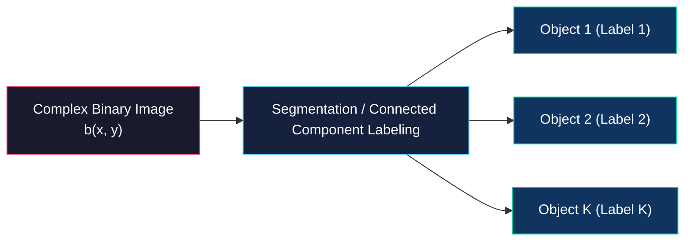
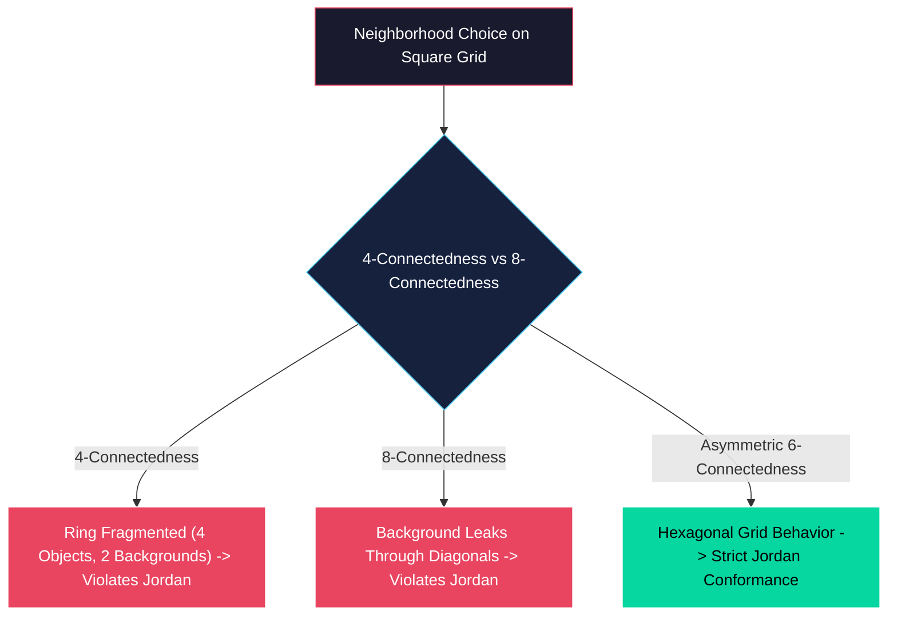

# Segmenting Binary Images and Iterative Modification

<!-- toc -->

In real-world computer vision applications, binary images contain multiple independent objects rather than a single shape. This section explores **Segmentation (Connected Component Labeling)** techniques used to differentiate and assign unique labels to individual objects, alongside **Iterative Modification** algorithms designed to expand object boundaries or extract single-pixel topological skeletons without altering an object's topological integrity.

> **Key Insight:** In multi-object scenes, every object must be assigned a unique numerical label prior to computing individual geometric moments. During iterative modification, preserving the Euler number ensures that topological properties (number of bodies and holes) remain unchanged throughout morphological processing.

---

## 1. Segmenting Binary Images

### 1.1 Multi-Object Problem and Connected Component Definition

Computing geometric moments assumes the presence of only a single object in the image domain. However, practical scenes typically contain multiple distinct objects. To analyze geometric properties such as area, position, and orientation for each object independently, pixels must be scanned to separate objects and assign each a unique numerical identifier. This process is known as **Segmentation** or **Connected Component Labeling**.

Mathematically, an object corresponds to a **connected component** within a binary image. Two pixels ($A$ and $B$) are connected if a continuous path of pixels exists between them over which the image intensity remains constant (i.e., all $1$s). An object is defined as a maximal connected set of such connected pixels.



### 1.2 Region Growing Algorithm

From an intuitive standpoint, the most basic segmentation method is the **Region Growing** algorithm, which initializes at "seed" pixels and expands outward. The algorithm proceeds through the following steps:

1. **Seed Search:** The image is scanned in raster order (top-to-bottom, left-to-right) to find the first unlabeled object pixel with value $1$.
2. **Label Assignment:** The discovered seed pixel is assigned a new unique label (e.g., "Label 3").
3. **Neighbor Search:** All direct neighbors of the seed pixel with value $1$ (that remain unlabeled) receive the same label.
4. **Iterative Expansion:** The process repeats for neighbors of neighbors, expanding outward until reaching object boundaries. Growth terminates when no unlabeled connected 1-pixels remain.
5. **Loop Return:** Return to step 1 to locate an unlabeled seed pixel for the next object.

### 1.3 Neighborhood Theory and Violation of Jordan's Curve Theorem

The mathematical definition of pixel neighborhood is critical for topological consistency. On a square pixel grid, two standard definitions exist:

- **4-Connectedness:** Only the 4 horizontal and vertical neighbors are considered connected.
- **8-Connectedness:** The 4 diagonal neighbors are included alongside horizontal and vertical neighbors, forming 8 connected directions.

<figure style="display:flex; justify-content: center; margin: 20px 0;">
  <div style="text-align: center;">
    
    <figcaption style="margin-top: 0.5em; text-align: center; font-size: 13px; color: #888;"><em>4-Connectedness (4-C) and 8-Connectedness (8-C) Pixel Neighborhood Definitions</em></figcaption>
  </div>
</figure>

However, both definitions violate **Jordan's Curve Theorem** on a square grid. Jordan's theorem states that a closed curve in a 2D plane must partition the plane into exactly two disconnected regions (an interior and an exterior).

Consider a closed ring geometry formed by diagonal pixels (e.g., a $2\times2$ arrangement of diagonal 1-pixels):

- **If 4-Connectedness is used:** Diagonal pixels are not considered connected, splitting the ring itself into 4 separate objects. Yet the enclosed background zero-pixels remain isolated from the outer background. This results in 4 disconnected object components and 2 disconnected background components, violating Jordan's theorem because the background is split without a single connected curve.
- **If 8-Connectedness is used:** Diagonal pixels are connected, forming a single continuous ring object. However, diagonal background zero-pixels are also considered connected, allowing interior zeros to leak through diagonal corners to connect with exterior zeros. A closed ring failing to separate interior from exterior again violates Jordan's curve theorem.

<figure style="display:flex; justify-content: center; margin: 20px 0;">
  <div style="text-align: center;">
    
    <figcaption style="margin-top: 0.5em; text-align: center; font-size: 13px; color: #888;"><em>Jordan's Curve Theorem Violation on Square Pixel Grids (4-C Hole Without Loop vs 8-C Leaking Background)</em></figcaption>
  </div>
</figure>

### 1.4 Asymmetric 6-Connectedness Solution

This geometric paradox is solved by introducing an artificial asymmetry into the neighborhood definition. In **6-Connectedness**, two symmetric diagonal neighbors (e.g., top-right and bottom-left) are removed from the 8-neighborhood definition, leaving exactly 6 neighbors.

<figure style="display:flex; justify-content: center; margin: 20px 0;">
  <div style="text-align: center;">
    
    <figcaption style="margin-top: 0.5em; text-align: center; font-size: 13px; color: #888;"><em>Asymmetric 6-Connectedness (6-C) Configurations Resolving Jordan's Paradox into Two Line Segments</em></figcaption>
  </div>
</figure>

This asymmetric definition causes a square pixel grid to behave like a **hexagonal grid**. On a hexagonal grid, neighborhood relationships are smooth, leak-free, and strictly conform to Jordan's curve theorem.

<figure style="display:flex; justify-content: center; margin: 20px 0;">
  <div style="text-align: center;">
    
    <figcaption style="margin-top: 0.5em; text-align: center; font-size: 13px; color: #888;"><em>Asymmetry Causing a Square Pixel Grid to Equivalently Perform as a Hexagonal Grid</em></figcaption>
  </div>
</figure>



---

## 2. Sequential Labeling Algorithm

### 2.1 Algorithm Logic and Neighborhood Rules

Far more efficient and memory-conscious than region growing, **Sequential Labeling** is a two-pass algorithm. It scans the image in a single pass in raster order.

To label any current pixel $A$, only its previously scanned neighbors—top ($D$), top-left ($C$), and left ($B$)—are inspected:

```text
  C   D
  B   A  <-- target pixel (A)
```

Decision rules proceed as follows:

1. **Background:** If $A = 0$, skip without labeling.
2. **New Object:** If $A = 1$ and all neighbors ($B, C, D$) are $0$, assign $A$ a new unique label.
3. **Top Neighbor Connection:** If $A = 1$ and $D$ is labeled, assign $A$ the label of $D$ ($\text{label}(A) = \text{label}(D)$).
4. **Top-Left Neighbor Connection:** If $A = 1$, $D = 0$, and $C$ is labeled, assign $A$ the label of $C$ ($\text{label}(A) = \text{label}(C)$).
5. **Left Neighbor Connection:** If $A = 1$, $D = 0$, $C = 0$, and $B$ is labeled, assign $A$ the label of $B$ ($\text{label}(A) = \text{label}(B)$).

### 2.2 Conflict Resolution and Equivalence Table

If $A = 1$, $D = 0$, but both $B$ and $C$ are labeled with different tags (e.g., $B = 1$, $C = 2$), a **conflict** arises. This situation indicates two separate object branches merging at pixel $A$.

**Resolution:** Assign pixel $A$ one of the two labels (e.g., $B$'s tag). Record the equivalence of tags $1$ and $2$ in an **Equivalence Table**.

After completing the first pass, the equivalence table is collapsed. A second pass updates all pixel labels to their canonical tags, fully resolving conflicts.

---

## 3. Iterative Modification

Local pixel values in a segmented binary image can be modified based on neighbor configurations without breaking topological structure to extract morphological information.

### 3.1 Euler Number ($E$) and Topological Integrity

The fundamental criterion for maintaining topological integrity is the **Euler Number**. The Euler number ($E$) is defined as the number of connected object components ($C$) minus the number of holes ($H$):

$$E = \text{Number of Bodies } (C) - \text{Number of Holes } (H)$$

**Topological Examples:**
- **Letter "B":** 1 body, 2 holes $\implies E = 1 - 2 = -1$
- **Letter "i":** 2 bodies, 0 holes $\implies E = 2 - 0 = 2$
- **Letter "n":** 1 body, 0 holes $\implies E = 1 - 0 = 1$

A crucial property of the Euler number is **additivity**. Partitioning an image into non-overlapping subregions and summing their individual Euler numbers yields the Euler number of the entire image.

<figure style="display:flex; justify-content: center; margin: 20px 0;">
  <div style="text-align: center;">
    
    <figcaption style="margin-top: 0.5em; text-align: center; font-size: 13px; color: #888;"><em>Euler Number Calculation Example on Binary Text ($E = B - H$) and Additive Property Demonstration</em></figcaption>
  </div>
</figure>

> **Conservative Operators:** Operations that preserve local Euler numbers during pixel modification prevent objects from fusing together or breaking apart.

### 3.2 Euler Differential ($E^*$) and Neighborhood Classes

The change in the total Euler number caused by changing a pixel from $0$ to $1$ (or $1$ to $0$) is called the **Euler Differential ($E^*$)**.

On a hexagonal pixel grid, each pixel has 6 neighbors, giving $2^6 = 64$ possible neighborhood patterns. These 64 patterns are categorized into 4 classes based on $E^*$:

1. **$N_{+1}$ Class ($E^* = 1$):** Changing the center pixel from $0$ to $1$ increases $E$ by 1 (creates a new body).
2. **$N_{0}$ Class ($E^* = 0$):** Changing the center pixel leaves $E$ unchanged. Conservative operations (erasing $1 \to 0$ or adding $0 \to 1$ safely) belong to this class.
3. **$N_{-1}$ Class ($E^* = -1$):** Setting the center pixel to $1$ connects two separate bodies, decreasing $E$ by 1 ($E^* = -1$).
4. **$N_{-2}$ Class ($E^* = -2$):** Pixel modification decreases $E$ by 2.

### 3.3 Parallelization and Three Fields Strategy

Because iterative modification operators are local, pixels can theoretically be updated in parallel. However, updating adjacent pixels simultaneously might produce topological errors (e.g., erasing a two-pixel-thick line entirely).

To prevent this, the pixel grid is partitioned into **three fields**. Pixels in the first field are updated in parallel, followed by the second and third fields sequentially. This pass repeats until no pixel values change.

### 3.4 Mathematical Notation, 16 Algorithms, and Thinning (Skeletonization)

To specify an iterative modification algorithm, we select a target neighborhood set $S$ (for conservative operations, $S \in N_0$).

- Let $a_{ij} = 1$ if the neighborhood of pixel $(i,j)$ belongs to $S$, else $a_{ij} = 0$.
- Let $b_{ij}$ be the current pixel value, and $c_{ij}$ the output value.

Combining $(a_{ij}, b_{ij})$ yields 4 possible input pairs, resulting in $2^4 = 16$ distinct output combinations. This defines **16 fundamental iterative modification algorithms**.

Two algorithms are of paramount importance:

- **Algorithm 7 (Growing / Dilation):** With $S \in N_0$, expands object boundaries safely without merging distinct objects.
- **Algorithm 4 (Thinning / Skeletonization):** With $S \in N_0$, erodes object boundaries inward without creating holes or breaking connectivity. Repeated application reduces objects to a single-pixel **topological skeleton**.

<figure style="display:flex; justify-content: center; margin: 20px 0;">
  <div style="text-align: center;">
    
    <figcaption style="margin-top: 0.5em; text-align: center; font-size: 13px; color: #888;"><em>Butterfly Silhouette Thinning via Algorithm 4 (Preserving Euler Number) to Extract Topological Skeleton</em></figcaption>
  </div>
</figure>

> **Applications:** Skeleton extraction (thinning) is widely applied in human pose estimation, optical character recognition (OCR), and vascular network analysis to compress data volume while retaining shape topology.
