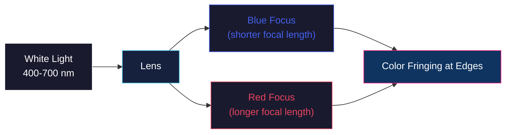

# Advanced Optical Systems: Aberrations, Wide-Angle Imaging, and Biological Eyes

<!-- toc -->

## 1. Lens Aberrations

Even perfect lenses produce unwanted effects called **aberrations** due to the nature of light. These are physical limitations, not manufacturing defects.

### 1.1 Vignetting

Vignetting is the darkening of image corners caused by:

1. The lens body mechanically blocking oblique rays.
2. A reduction in **solid angle** at the periphery of the image field.

The result is a gradual fall-off in brightness from the center to the corners of the image.

<figure style="display:flex; justify-content: center;">

<figcaption style="margin-top: 0.5em; text-align: center;"><em>Ray diagram showing mechanical blockage of oblique rays in multi-lens systems.</em></figcaption>

</figure>

<figure style="display:flex; justify-content: center;">

<figcaption style="margin-top: 0.5em; text-align: center;"><em>Vignetting effect on a flat white surface and a natural scene.</em></figcaption>

</figure>

### 1.2 Chromatic Aberration

The refractive index of glass depends on the wavelength ($\lambda$) of light. In the visible spectrum (400 nm — 700 nm), **blue light (400 nm) bends more than red light (700 nm)**. This causes different colors to focus at different planes, producing color fringing at object edges.

<figure style="display:flex; justify-content: center;">

<figcaption style="margin-top: 0.5em; text-align: center;"><em>Chromatic aberration and edge fringing caused by different wavelengths bending differently.</em></figcaption>

</figure>

### 1.3 Geometric Distortions

**Radial distortion** (barrel distortion) causes the image to bulge outward. These effects can be corrected in computer vision software through inverse mapping — a calibration process that models the distortion parameters and inverts them.

| Distortion Type | Effect | Visual |
|----------------|--------|--------|
| **Barrel (Fıçı)** | Lines bow outward from center | 👁️ Wide-angle look |
| **Pincushion (İğne Yastığı)** | Lines bow inward toward center | 🔍 Telephoto look |

> **Key Insight:** Distortion is deterministic and correctable — knowing the lens model allows precise geometric rectification.

<figure style="display:flex; justify-content: center;">

<figcaption style="margin-top: 0.5em; text-align: center;"><em>Radial (barrel/pincushion) and tangential geometric distortion diagram from lens imperfections.</em></figcaption>

</figure>

<figure style="display:flex; justify-content: center;">

<figcaption style="margin-top: 0.5em; text-align: center;"><em>Barrel-distorted corridor photo before and after software rectification.</em></figcaption>

</figure>

## 2. Wide-Angle and Catadioptric Imaging Systems

These systems are designed to overcome the limitations of standard perspective projection and are strategically important in security and robotics.

### 2.1 Fisheye Lenses

Fisheye lenses use meniscus elements to achieve extreme light bending. The **single viewpoint constraint** is critical for software rectification — all rays must appear to converge at a single optical center for the image to be mathematically unwrapped.

<figure style="display:flex; justify-content: center;">

<figcaption style="margin-top: 0.5em; text-align: center;"><em>Fisheye lens design using meniscus elements for extreme light bending.</em></figcaption>

</figure>

<figure style="display:flex; justify-content: center;">

<figcaption style="margin-top: 0.5em; text-align: center;"><em>Fisheye lens and the 180-degree hemispherical image it captures.</em></figcaption>

</figure>

### 2.2 Catadioptric Systems

Catadioptric systems combine mirrors (catoptric) and lenses (dioptric):

| Type | Mirror Shape | Use Case |
|------|-------------|----------|
| **Telescope** | Parabolic | Collects parallel rays at a single point |
| **Omnidirectional** | Hyperbolic (convex) | Captures 360° panoramic view for surveillance |

<figure style="display:flex; justify-content: center;">

<figcaption style="margin-top: 0.5em; text-align: center;"><em>Ray tracing diagram showing rays reflecting from a hyperbolic mirror converging at a virtual focus.</em></figcaption>

</figure>

<figure style="display:flex; justify-content: center;">

<figcaption style="margin-top: 0.5em; text-align: center;"><em>Parabolic mirror orthographic projection capturing parallel rays.</em></figcaption>

</figure>

<figure style="display:flex; justify-content: center;">

<figcaption style="margin-top: 0.5em; text-align: center;"><em>James Webb Space Telescope's massive concave mirror system.</em></figcaption>

</figure>

### 2.3 Corneal Imaging

The human cornea acts as a convex mirror. Using **limbus detection** and corneal reflection analysis, it is possible to determine what a person is looking at (their retinal image) from a high-resolution photograph taken from outside.

<figure style="display:flex; justify-content: center;">

<figcaption style="margin-top: 0.5em; text-align: center;"><em>Elliptical limbus boundary detection for eye position and orientation.</em></figcaption>

</figure>

<figure style="display:flex; justify-content: center;">

<figcaption style="margin-top: 0.5em; text-align: center;"><em>Extracting the surrounding scene from corneal reflection and estimating the retinal fovea image.</em></figcaption>

</figure>

## 3. Biological Eye Designs and Evolution

Eyes in nature represent the evolutionary perfection of image formation principles. A simulation by Nilsson demonstrated that a flat, light-sensitive epithelium could evolve into a complex eye in **just 400,000 generations**.

### 3.1 The Evolutionary Path

<figure style="display:flex; justify-content: center;">

<figcaption style="margin-top: 0.5em; text-align: center;"><em>Simulation of eye evolution from flat tissue to camera-type eye (Nilsson-Pelger model).</em></figcaption>

</figure>

### 3.2 Comparative Biology

| Species | Eye Type | Key Feature |
|---------|----------|-------------|
| **Trilobites** (400M years ago) | Compound eye | Thousands of calcite crystal lenses |
| **Human** | Single lens eye | Corneal bending power + crystalline lens accommodation |
| **Scallop** | Multiple mirror eyes | Concave parabolic mirrors (like James Webb Telescope) |

> **Fascinating Fact:** Trilobite eyes used calcite — a mineral that does not soften with age — as their lens material, giving them perfect vision throughout their lifespan.

<figure style="display:flex; justify-content: center;">

<figcaption style="margin-top: 0.5em; text-align: center;"><em>Anatomical comparison of primitive eye designs: pit, pinhole, spherical lens, and vertebrate.</em></figcaption>

</figure>

<figure style="display:flex; justify-content: center;">

<figcaption style="margin-top: 0.5em; text-align: center;"><em>Ancient trilobite compound eye fossil with calcite crystal lenses.</em></figcaption>

</figure>

<figure style="display:flex; justify-content: center;">

<figcaption style="margin-top: 0.5em; text-align: center;"><em>Scallop eye with concave parabolic mirror telescopes along its shell edge.</em></figcaption>

</figure>

### 3.3 The Human Eye and Accommodation

The human eye combines two optical elements:

1. **Cornea** — Provides most of the bending power (refractive index difference between air and tissue).
2. **Crystalline Lens** — A fluid-filled flexible lens that adjusts shape for **accommodation** (focusing at different distances).

As we age, the crystalline lens hardens (presbyopia):

$$
\text{Minimum Focus Distance} \approx 
\begin{cases}
7 \text{ cm} & \text{at age 10} \\
10 \text{ cm} & \text{at age 20} \\
50 \text{ cm} & \text{at age 50+}
\end{cases}
$$

<figure style="display:flex; justify-content: center;">

<figcaption style="margin-top: 0.5em; text-align: center;"><em>Optical anatomy of the human eye including lens, pupil, fovea, and retinal layers.</em></figcaption>

</figure>

<figure style="display:flex; justify-content: center;">

<figcaption style="margin-top: 0.5em; text-align: center;"><em>Accommodation diagram: lens bulging when focusing near and flattening for distance.</em></figcaption>

</figure>

<figure style="display:flex; justify-content: center;">

<figcaption style="margin-top: 0.5em; text-align: center;"><em>Graph showing near focus point receding as the lens hardens with age.</em></figcaption>

</figure>

<figure style="display:flex; justify-content: center;">

<figcaption style="margin-top: 0.5em; text-align: center;"><em>Myopia correction using a diverging (concave) lens.</em></figcaption>

</figure>

<figure style="display:flex; justify-content: center;">

<figcaption style="margin-top: 0.5em; text-align: center;"><em>Hyperopia correction using a converging (convex) lens.</em></figcaption>

</figure>

### 3.4 Scallop Eyes: Nature's Mirror Telescopes

Scallops have hundreds of eyes, each using a **concave parabolic mirror** rather than a lens to focus light. This is the same optical principle used by the James Webb Space Telescope — a remarkable case of convergent evolution between biology and engineering.

---

## Summary

- **Aberrations** (vignetting, chromatic, distortion) are unavoidable physical effects of lens systems.
- **Catadioptric systems** combine mirrors and lenses for specialized imaging (panoramic, telescope).
- **Corneal imaging** allows gaze detection from external photographs.
- **Biological eyes** evolved through a well-understood path and offer diverse optical strategies — pinhole (nautilus), compound (trilobite), refractive (human), and reflective (scallop).
- Whether an ancient trilobite lens or a modern liquid lens, image formation is the central achievement of both biological and technological evolution in understanding the 3D world on a 2D plane.
