# Lens Systems and Depth of Field

<!-- toc -->

## 1. Why Lenses?

Pinhole cameras produce sharp images, but the extremely small aperture collects very little light — the Flatiron building example required a **12-second exposure**. Lenses solve this problem by refracting light from a wide aperture to converge at a single point, increasing brightness while preserving the perspective model.

> **Fundamental Trade-off:** Lenses collect more light but introduce a finite depth of field — only one plane is perfectly in focus.

## 2. Gaussian Lens Law

For a thin lens, the relationship between the object distance ($o$), image distance ($i$), and focal length ($f$) is given by the **Gaussian Lens Law**:

$$
\frac{1}{i} + \frac{1}{o} = \frac{1}{f}
$$

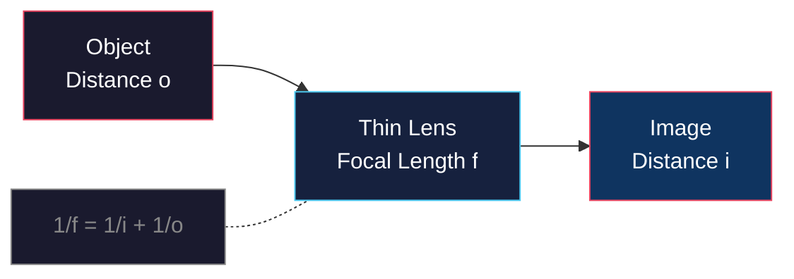

**Numerical Example:** With a lens of $f = 50$mm focused on an object at $o = 300$mm:

$$
\frac{1}{i} = \frac{1}{50} - \frac{1}{300} = \frac{6 - 1}{300} = \frac{5}{300}
$$

$$
i = 60 \text{ mm}
$$

The image forms 60 mm behind the lens.

<figure style="display:flex; justify-content: center;">

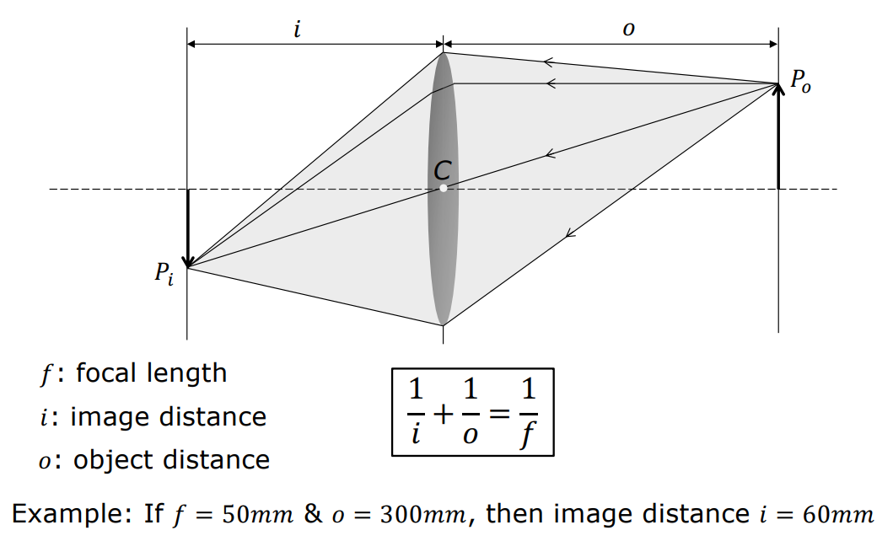
<figcaption style="margin-top: 0.5em; text-align: center;"><em>Similar triangles derive the Gaussian Lens Law equations.</em></figcaption>

</figure>

<figure style="display:flex; justify-content: center;">

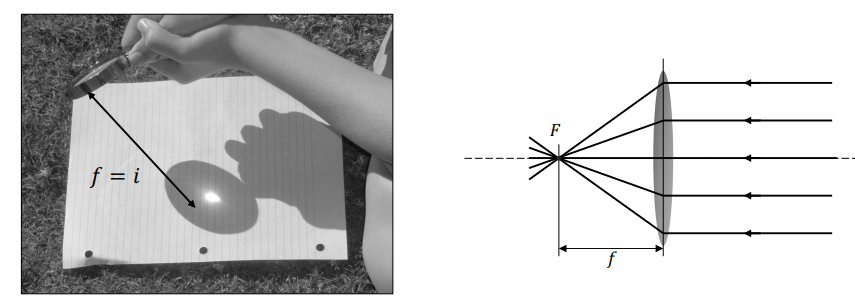
<figcaption style="margin-top: 0.5em; text-align: center;"><em>Measuring focal length with a street lamp in practice.</em></figcaption>

</figure>

### 2.1 Aperture and f-Number

The light-gathering capacity of a lens is determined by the aperture diameter ($D$). The **f-number** ($N$) is defined as:

$$
N = \frac{f}{D}
$$

| Aperture | f-Number | Light Collected | Depth of Field |
|----------|----------|-----------------|----------------|
| Wide open | Low $N$ (e.g., $f/1.4$) | High | Shallow |
| Stopped down | High $N$ (e.g., $f/16$) | Low | Deep |

<figure style="display:flex; justify-content: center;">

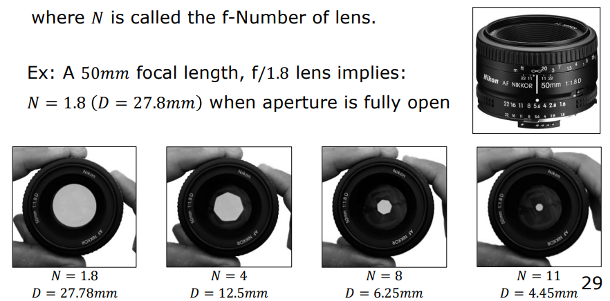
<figcaption style="margin-top: 0.5em; text-align: center;"><em>Aperture blades create different f-number openings.</em></figcaption>

</figure>

### 2.2 The Tissue Box Experiment

A fascinating and counter-intuitive observation: **covering half of a lens does not break or defocus the image.** It only reduces the light reaching the sensor, darkening the image. Every unblocked portion of the lens continues to project the entire scene onto the focal plane.

> **Why?** Each point on the lens receives light from all scene points within its field of view. Blocking part of the lens reduces the number of rays but does not change their geometric paths — the entire scene is still projected, just dimmer.

<figure style="display:flex; justify-content: center;">

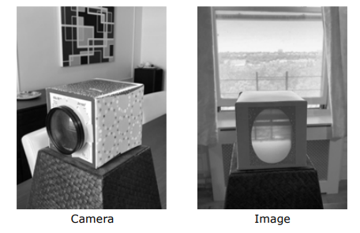
<figcaption style="margin-top: 0.5em; text-align: center;"><em>A tissue box camera demonstrates the lens principle.</em></figcaption>

</figure>

<figure style="display:flex; justify-content: center;">

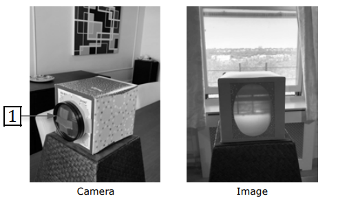
<figcaption style="margin-top: 0.5em; text-align: center;"><em>Blocking half the lens only darkens the image.</em></figcaption>

</figure>

### 2.3 Zoom

Zoom is the process of changing the magnification by moving lens elements within a multi-lens system. This changes the effective focal length without physically swapping lenses.

<figure style="display:flex; justify-content: center;">

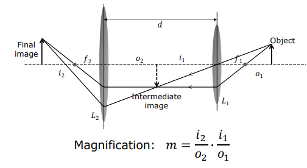
<figcaption style="margin-top: 0.5em; text-align: center;"><em>Two-lens system enables zoom by moving elements.</em></figcaption>

</figure>

## 3. Defocus Blur and Depth of Field

A lens system perfectly focuses only a single **focal plane** at a specific sensor position. Points outside this plane form a **blur circle** (circle of confusion) on the image plane.

<figure style="display:flex; justify-content: center;">

<figcaption style="margin-top: 0.5em; text-align: center;"><em>Depth of field varies with aperture size in practice.</em></figcaption>

</figure>

### 3.1 The Blur Circle

Using similar triangles, the diameter of the blur circle ($b$) is related to the aperture diameter ($D$):

$$
\frac{b}{D} = \frac{|i' - i|}{i'}
$$

Where $i'$ is the image distance of the out-of-focus point, and $i$ is the sensor distance.

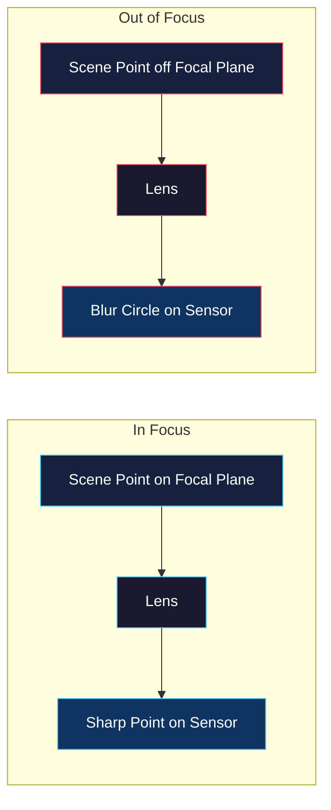

This equation proves that the blur circle diameter is **directly proportional to the aperture diameter** — wider apertures produce more defocus blur.

### 3.2 Depth of Field (DoF)

The **Depth of Field** is the range of depths over which the blur circle diameter remains smaller than the pixel size ($C$). If $b < C$, the image is perceived as "sharp."

$$
\text{DoF} \propto \frac{N \cdot C \cdot o^2}{f^2}
$$

<figure style="display:flex; justify-content: center;">

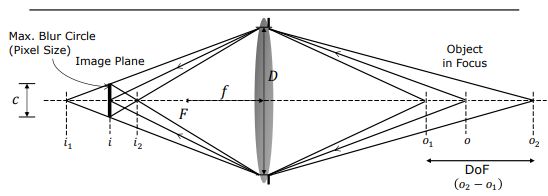
<figcaption style="margin-top: 0.5em; text-align: center;"><em>Depth of field limits where blur stays below pixel size.</em></figcaption>

</figure>

### 3.3 Hyperfocal Distance

The **hyperfocal distance** ($H$) is the focus distance at which everything from that point to infinity appears acceptably sharp:

$$
H = \frac{f^2}{N \cdot C} + f
$$

Smartphone cameras strategically use this parameter — their small sensors and short focal lengths produce a very large hyperfocal distance, ensuring nearly everything is in focus without active focusing.

<figure style="display:flex; justify-content: center;">

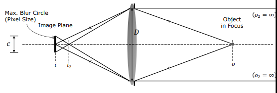
<figcaption style="margin-top: 0.5em; text-align: center;"><em>Hyperfocal distance ensures sharpness from H to infinity.</em></figcaption>

</figure>

### 3.4 The Critical Trade-off

| Scenario | Aperture | Light | Exposure Time | Depth of Field |
|----------|----------|-------|---------------|----------------|
| Bright, shallow DoF | Wide ($N$ low) | High | Short | Shallow |
| Dark, deep DoF | Narrow ($N$ high) | Low | Long | Deep |

<figure style="display:flex; justify-content: center;">

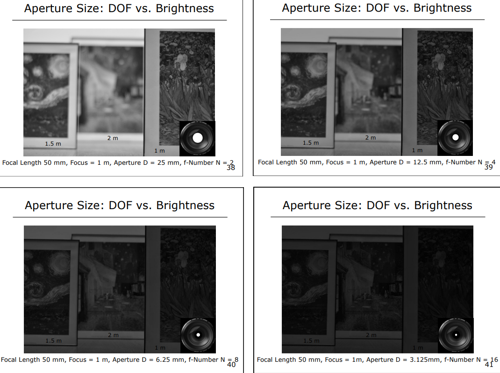
<figcaption style="margin-top: 0.5em; text-align: center;"><em>Wider aperture increases blur but gathers more light.</em></figcaption>

</figure>

There is **no free lunch** in optical design — every gain in one dimension comes at a cost in another.

---

## Summary

- **Lenses** increase light collection but introduce finite depth of field.
- **Gaussian Lens Law**: $1/i + 1/o = 1/f$ governs thin lens behavior.
- **f-Number** $N = f/D$ quantifies aperture size and directly affects light and DoF.
- **Blur circle** $b/D = |i' - i|/i'$ proves defocus is proportional to aperture.
- **Hyperfocal distance** $H = f^2/(N \cdot C) + f$ enables strategic focus optimization.
- The aperture trade-off (light vs. DoF) is fundamental and unavoidable.
