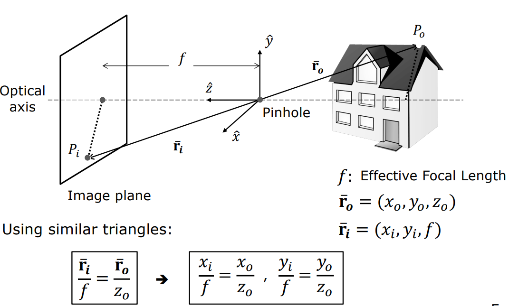
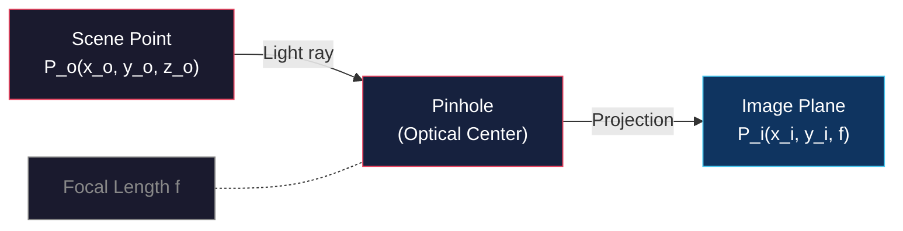
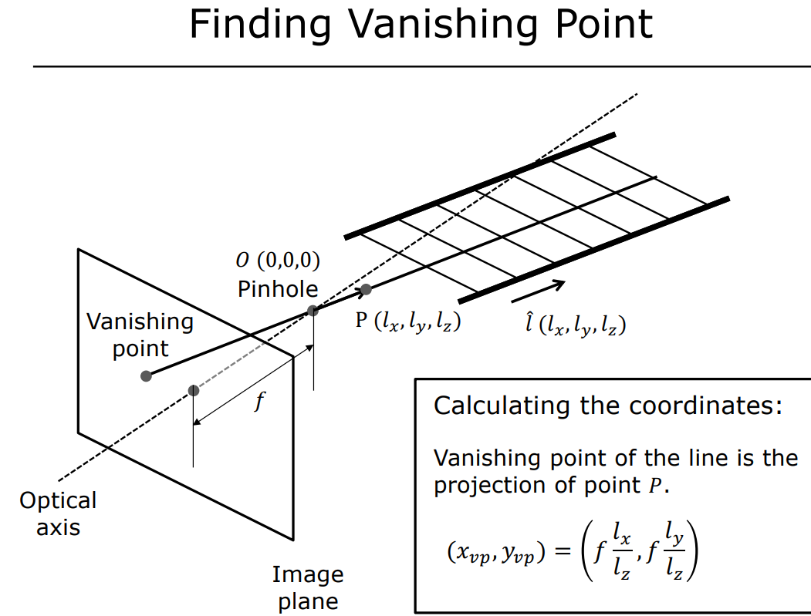
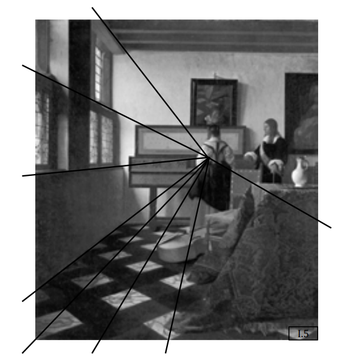
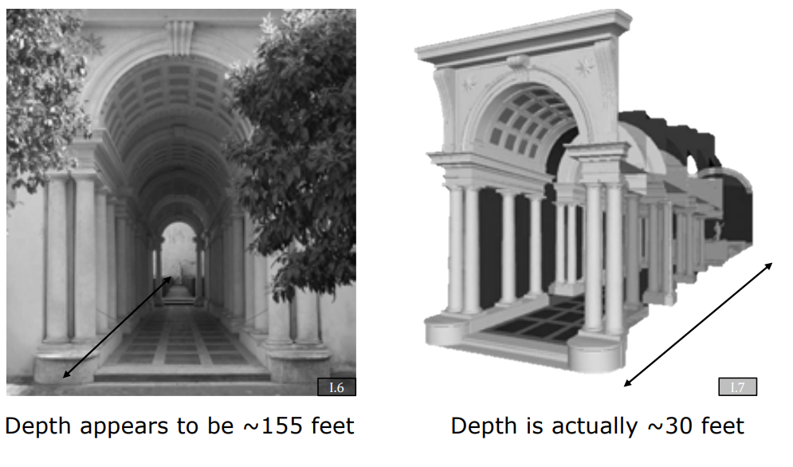
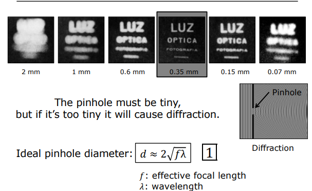

# Pinhole Camera Model and Perspective Projection

<!-- toc -->

## 1. Introduction to Image Formation

Image formation is the process of projecting the physical properties of a three-dimensional (3D) scene onto a two-dimensional (2D) plane. This process forms the foundation of computer vision and defines the relationship between the position of scene points in the image and their brightness values. To fully understand the process, it is essential to separate geometric and photometric interactions:

- **Geometric Relationships** — Determine the coordinates of a scene point on the projection plane (where it falls).
- **Photometric Relationships** — Define the intensity (brightness) at which a scene point appears in the image, based on material properties and lighting conditions.

Theoretically, a simple sensor or screen placed in front of a scene cannot produce a clear image. The fundamental reason is that each point on the sensor receives light rays from many different points in the scene, spreading in a **cone** shape. This "muddled" state of light rays causes each point to receive the average brightness of the scene, resulting in a blurred accumulation of light rather than a clear visual structure. A pinhole or lens mechanism aims to restrict this light cone and establish a one-to-one mapping between the scene and the sensor.

> **Key Insight:** Without a restricting aperture, every sensor point integrates light from a cone of scene points — producing blur, not image.

## 2. The Pinhole Camera Model

The pinhole camera model is the simplest way to prevent the "muddled" image by forcing all light rays to pass through a single point. This model forms the basis of the **perspective projection** equations — the single most critical concept in computer vision.

### 2.1 Perspective Projection Equations

In the pinhole model, the optical center (pinhole) is taken as the origin, and the $z$-axis is placed on the **optical axis** perpendicular to the image plane. The distance between the pinhole and the image plane is called the **effective focal length** ($f$). Using the principle of similar triangles, the projection $P_i(x_i, y_i, f)$ of a scene point $P_o(x_o, y_o, z_o)$ onto the image plane is given by:

$$
\frac{x_i}{f} = \frac{x_o}{z_o} \quad \text{and} \quad \frac{y_i}{f} = \frac{y_o}{z_o}
$$

These equations mathematically prove that:
1. The image is always **inverted**.
2. The size of objects is **inversely related to depth** ($z_o$).

$$
x_i = f \\frac{x_o}{z_o}, \\qquad y_i = f \\frac{y_o}{z_o}
$$

<figure style="display:flex; justify-content: center;">

<figcaption style="margin-top: 0.5em; text-align: center;"><em>Similar triangles give the pinhole projection equations.</em></figcaption>

</figure>

### 2.2 Historical Milestones

<figure style="display:flex; justify-content: center;">

<figcaption style="margin-top: 0.5em; text-align: center;"><em>Camera obscura projects an inverted image through a small aperture.</em></figcaption>

</figure>

### 2.3 Natural Pinhole: The Nautilus Eye

The *Nautilus pompilius* is a remarkable example of pinhole imaging in nature. Unlike most cephalopods, the nautilus evolved a lensless eye that works exactly like a pinhole camera. The small aperture produces a sharp image with infinite depth of field, but at the cost of light sensitivity — a fundamental trade-off that appears throughout optical design.

## 3. Magnification, Vanishing Points, and Visual Manifestations

The geometric changes in an image are direct consequences of perspective projection. These shape our depth perception and the 2D representation of 3D scenes.

### 3.1 Image Magnification

Magnification is the ratio of the image size to the scene size:

$$
|m| = \frac{f}{z_o}
$$

The inverse relationship between magnification and depth ($z_o$) is why:
- **Railroad tracks** appear to converge at the horizon.
- **Selfies** make the nose appear much larger than the ears — the nose has a smaller $z_o$ value, creating a natural distortion.

<figure style="display:flex; justify-content: center;">

<figcaption style="margin-top: 0.5em; text-align: center;"><em>Near objects magnify more than distant ones in perspective.</em></figcaption>

</figure>

### 3.2 Vanishing Points

All lines that are parallel in 3D space converge to a single point in the 2D image plane.

<figure style="display:flex; justify-content: center;">

<figcaption style="margin-top: 0.5em; text-align: center;"><em>Parallel lines converge to a single vanishing point.</em></figcaption>

</figure>

To find this point, construct a ray passing through the pinhole parallel to these lines (in direction $L_x, L_y, L_z$). The coordinates where this ray pierces the image plane are:

$$
x_{vp} = f \\cdot \\frac{L_x}{L_z}, \\qquad y_{vp} = f \\cdot \\frac{L_y}{L_z}
$$

<figure style="display:flex; justify-content: center;">

<figcaption style="margin-top: 0.5em; text-align: center;"><em>A parallel ray through the pinhole locates the vanishing point.</em></figcaption>

</figure>

### 3.3 Artistic and Architectural Applications

| Artist/Architect | Work | Technique |
|-----------------|------|-----------|
| **Vermeer** | "The Music Lesson" | Placed the vanishing point exactly at the student's elbow, directing attention to the piano-playing activity |
| **Borromini** | "Galleria Spada" | Created false perspective by shrinking columns and lowering the ceiling — a 30-meter corridor appears to be 150 meters long |

<figure style="display:flex; justify-content: center;">

<figcaption style="margin-top: 0.5em; text-align: center;"><em>Vermeer's vanishing point guides the viewer's attention.</em></figcaption>

</figure>

<figure style="display:flex; justify-content: center;">

<figcaption style="margin-top: 0.5em; text-align: center;"><em>Borromini's forced perspective tricks the eye.</em></figcaption>

</figure>

> **Key Insight:** Perspective projection is not just a mathematical constraint — it is a tool for visual storytelling, exploited by artists long before computer vision formalized it.

## 4. The Ideal Pinhole Size

While the pinhole model produces sharp images, the aperture size introduces a critical trade-off: a smaller pinhole reduces blur but also reduces light, while a larger pinhole collects more light but increases image blur. This fundamental limitation motivates the transition from pinholes to lens-based imaging systems.

<figure style="display:flex; justify-content: center;">

<figcaption style="margin-top: 0.5em; text-align: center;"><em>Optimal pinhole size balances blur and diffraction.</em></figcaption>

</figure>

---

## Summary

- Image formation requires restricting light rays through an aperture to avoid the "muddled" cone problem.
- The pinhole camera model produces **perspective projection** governed by similar triangles: $x_i/f = x_o/z_o$.
- Magnification is inversely proportional to depth: objects farther away appear smaller.
- Vanishing points are where parallel lines in 3D converge in a 2D projection.
- The pinhole's primary limitation is **light collection** — this motivates the use of lenses.
