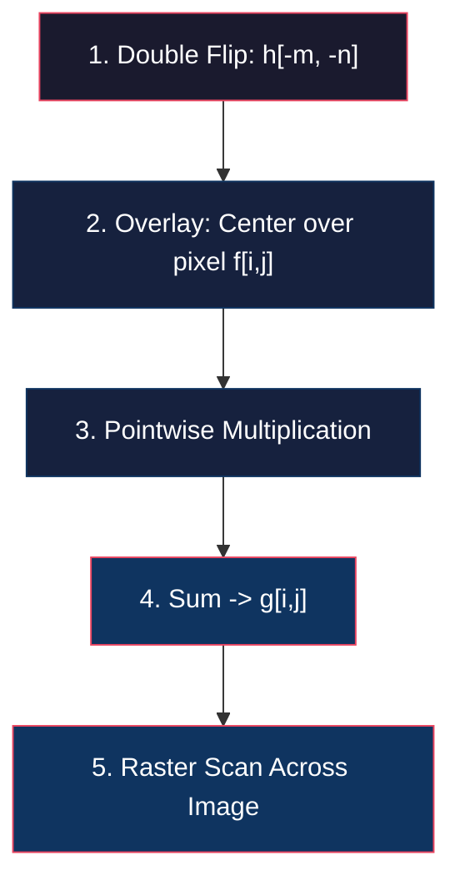
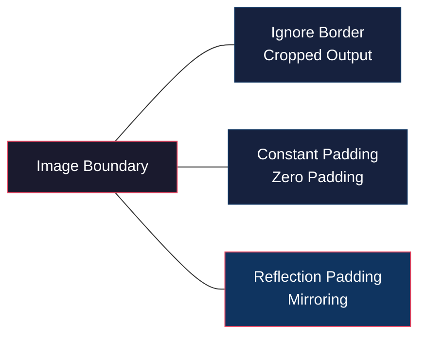
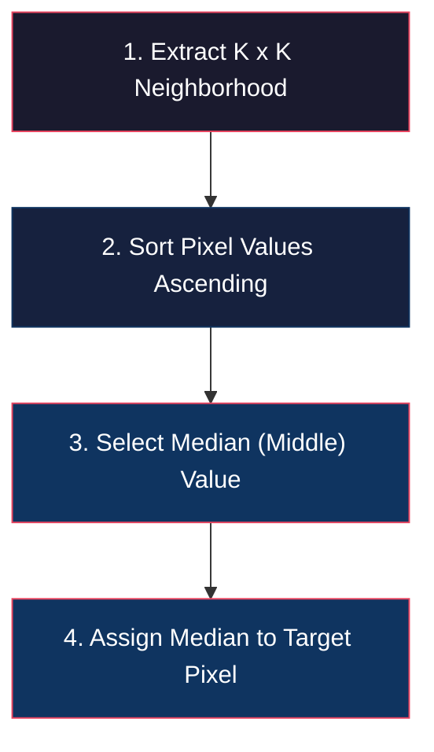
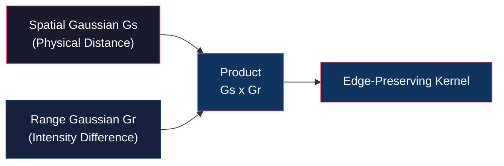

# Linear and Non-Linear Image Filters

<!-- toc -->

## 1. Discrete 2D Convolution

In computer vision applications, images are processed as discrete 2D pixel matrices rather than continuous mathematical functions. For an $M \times N$ image $f[i,j]$ and a filter kernel $h[i,j]$, discrete 2D convolution is defined as:

$$g[i,j] = f[i,j] * h[i,j] = \sum_{m} \sum_{n} f[m,n] \, h[i - m, j - n]$$

<figure style="display:flex; justify-content: center; margin: 20px 0;">
  

    
    <figcaption style="margin-top: 0.5em; text-align: center; font-size: 13px; color: #888;"><em>Discrete 2D convolution formula, filter kernel definition, and f, h, g grid matrices</em></figcaption>
  

</figure>

where $i$ represents row indices and $j$ represents column indices.

### 1.1 Discrete Convolution Pipeline

Executing discrete 2D convolution follows 5 programmatic steps:

1. **Double Flip:** Flip the filter kernel $h$ horizontally ($m$) and vertically ($n$) to form $h[-m, -n]$.
2. **Overlay:** Center the flipped kernel over target pixel $[i,j]$.
3. **Multiply:** Multiply kernel weights element-wise with overlapping pixel intensity values.
4. **Sum:** Sum all multiplication results and assign the value to output pixel $g[i,j]$.
5. **Raster Scan:** Slide the kernel across the entire image grid from left-to-right and top-to-bottom.

---

## 2. Border Problems

<figure style="display:flex; justify-content: center; margin: 20px 0;">
  

    
    <figcaption style="margin-top: 0.5em; text-align: center; font-size: 13px; color: #888;"><em>Border problem where the filter kernel hangs over image spatial boundaries</em></figcaption>
  

</figure>

When a filter kernel centers over boundary pixels, portions of the kernel extend beyond the spatial dimensions of the image where no pixel intensity data exists.

Three standard approaches are used to resolve boundary conditions:

### 2.1 Ignore Border
Compute convolution only for interior pixels where the entire kernel fits strictly inside the image frame. The resulting output image is cropped along its perimeter by the kernel radius.

### 2.2 Constant / Zero Padding
Pad the regions outside the image boundaries with a constant value (commonly 0 for black or the mean image intensity).

### 2.3 Reflection Padding
Mirror boundary pixels across the edge boundary. Reflection padding produces the most natural transition and prevents artificial boundary seam artifacts.

---

## 3. Classic Linear Filter Types

### 3.1 Impulse Filter
A kernel containing 1 at its center cell and 0 elsewhere passes the input image through unchanged due to the sifting property:

$$g[i,j] = f[i,j] * \delta[i,j] = f[i,j]$$

<figure style="display:flex; justify-content: center; margin: 20px 0;">
  

    
    <figcaption style="margin-top: 0.5em; text-align: center; font-size: 13px; color: #888;"><em>Identity output produced by convolving an image with an Impulse Filter</em></figcaption>
  

</figure>

### 3.2 Shift Filter
Placing the unit impulse at the bottom-right corner of the kernel shifts the output image down and to the right by 1 pixel, due to the double-flip nature of convolution:

$$h = \begin{bmatrix} 0 & 0 & 0 \\ 0 & 0 & 0 \\ 0 & 0 & 1 \end{bmatrix} \implies g[i,j] = f[i-1, j-1]$$

<figure style="display:flex; justify-content: center; margin: 20px 0;">
  

    
    <figcaption style="margin-top: 0.5em; text-align: center; font-size: 13px; color: #888;"><em>Spatial image shifting produced by an offset Shift Filter kernel</em></figcaption>
  

</figure>

### 3.3 Box / Averaging Filter
Used to smooth spatial noise across local pixel neighborhoods. Consider an unnormalized $5 \times 5$ box kernel with all entries set to 1:

$$h_{\text{unnorm}} = \begin{bmatrix} 1 & 1 & 1 & 1 & 1 \\ \vdots & & \ddots & & \vdots \\ 1 & 1 & 1 & 1 & 1 \end{bmatrix}$$

> **Warning: Saturation and Normalization**  
> Applying an unnormalized box filter causes output pixel values to scale up by $25\times$, exceeding the 8-bit dynamic range (255) and resulting in total white saturation.  

<figure style="display:flex; justify-content: center; margin: 20px 0;">
  

    
    <figcaption style="margin-top: 0.5em; text-align: center; font-size: 13px; color: #888;"><em>Total white saturation artifact caused by applying an unnormalized 5x5 box filter</em></figcaption>
  

</figure>

> **Solution:** The sum of all kernel weights must equal 1. Divide each element by the total kernel area ($25$):
>
> $$h_{\text{box}} = \frac{1}{25} \begin{bmatrix} 1 & 1 & 1 & 1 & 1 \\ \vdots & & \ddots & & \vdots \\ 1 & 1 & 1 & 1 & 1 \end{bmatrix}$$

<figure style="display:flex; justify-content: center; margin: 20px 0;">
  

    
    <figcaption style="margin-top: 0.5em; text-align: center; font-size: 13px; color: #888;"><em>Clean smoothed output obtained using a normalized 5x5 box filter</em></figcaption>
  

</figure>

> **Key Insight:** Large box filters (e.g., $21 \times 21$) introduce rectangular boxy artifacts due to sharp square boundaries in spatial domain filtering.

<figure style="display:flex; justify-content: center; margin: 20px 0;">
  

    
    <figcaption style="margin-top: 0.5em; text-align: center; font-size: 13px; color: #888;"><em>Rectangular blocky artifacts produced by a large 21x21 box filter</em></figcaption>
  

</figure>

---

## 4. Gaussian Smoothing

<figure style="display:flex; justify-content: center; margin: 20px 0;">
  

    
    <figcaption style="margin-top: 0.5em; text-align: center; font-size: 13px; color: #888;"><em>Natural smooth blurring without blocky artifacts achieved via a 21x21 circular Gaussian (Fuzzy) filter</em></figcaption>
  

</figure>

To eliminate rectangular boxy artifacts, **Gaussian smoothing** uses a rotationally symmetric, smooth kernel whose weights decay gracefully from the center pixel.

### 4.1 Gaussian Kernel Mathematics

In 2D discrete space, a Gaussian filter kernel is defined as:

$$G_{\sigma}[i,j] = \frac{1}{2\pi\sigma^2} e^{-\frac{i^2 + j^2}{2\sigma^2}}$$

where:
* $i, j$: Row and column spatial distance offsets from the kernel center.
* $\sigma$ (Standard Deviation): Controls kernel spread (smoothing width); $\sigma^2$ represents variance.
* $\frac{1}{2\pi\sigma^2}$: Normalization factor ensuring total volume under the 2D Gaussian sums to 1.

### 4.2 Kernel Window Size Selection ($K \times K$)
Although continuous Gaussians extend to infinity, finite discrete kernels capture $99.7\%$ of Gaussian energy using the standard rule of thumb:

$$K \approx 2\pi\sigma \quad (\text{or } K \approx 6\sigma)$$

<figure style="display:flex; justify-content: center; margin: 20px 0;">
  

    
    <figcaption style="margin-top: 0.5em; text-align: center; font-size: 13px; color: #888;"><em>Comparison of Gaussian smoothing width for standard deviations sigma=4 vs sigma=16</em></figcaption>
  

</figure>

### 4.3 Gaussian Filter Separability

<figure style="display:flex; justify-content: center; margin: 20px 0;">
  

    
    <figcaption style="margin-top: 0.5em; text-align: center; font-size: 13px; color: #888;"><em>Decomposition of a 2D KxK Gaussian matrix into 1D vertical Kx1 and 1D horizontal 1xK vectors</em></figcaption>
  

</figure>

A key property of Gaussian filters in computer vision is **separability**.

#### Mathematical Proof
The 2D Gaussian exponent decomposes into the product of two 1D Gaussian exponents:

$$e^{-\frac{m^2 + n^2}{2\sigma^2}} = e^{-\frac{m^2}{2\sigma^2}} \cdot e^{-\frac{n^2}{2\sigma^2}}$$

Substituting into the discrete 2D convolution equation:

$$g[i,j] = \sum_{m} \sum_{n} f[m,n] \cdot \left( \frac{1}{2\pi\sigma^2} e^{-\frac{(i-m)^2 + (j-n)^2}{2\sigma^2}} \right)$$

$$g[i,j] = \frac{1}{2\pi\sigma^2} \sum_{m} e^{-\frac{(i-m)^2}{2\sigma^2}} \left( \sum_{n} f[m,n] \cdot e^{-\frac{(j-n)^2}{2\sigma^2}} \right)$$

Convolving an image with a $K \times K$ 2D Gaussian kernel is mathematically identical to applying a 1D horizontal Gaussian filter of length $K$, followed by a 1D vertical Gaussian filter of length $K$:

$$\text{2D } G_{\sigma} \equiv \text{1D Horizontal } G_{\sigma} * \text{1D Vertical } G_{\sigma}$$

#### Computational Complexity Comparison (Per Pixel)

For a $K \times K$ filter window:

* **Non-Separable Direct 2D Filter:**
  * Multiplications: $K^2$
  * Additions: $K^2 - 1$
* **Separable 1D + 1D Filter:**
  * Multiplications: $2K$
  * Additions: $2(K - 1)$

> **Performance Optimization Example ($K = 21$):**
> * Direct 2D: $21^2 = 441$ multiplications, $440$ additions.
> * Separable 1D + 1D: $2 \times 21 = 42$ multiplications, $40$ additions.
> 
> **Speedup:** Approximately **$10.5\times$ fewer operations per pixel!**

---

## 5. Non-Linear Filters

Linear convolution filters suppress noise by attenuating high spatial frequencies, which inadvertently blurs sharp object edges. Non-linear algorithmic filters overcome this trade-off.

### 5.1 Median Filter

Random black (0) or white (255) corrupted pixels are referred to as **Salt and Pepper Noise**.

* **Linear Filter Limitation:** Gaussian or box filters smear outlier impulse values across neighborhoods, muddying the image without removing noise spikes.

<figure style="display:flex; justify-content: center; margin: 20px 0;">
  

    
    <figcaption style="margin-top: 0.5em; text-align: center; font-size: 13px; color: #888;"><em>Failure of linear Gaussian filtering to eliminate salt and pepper noise, resulting in smeared noise spots</em></figcaption>
  

</figure>

* **Median Filter Mechanism:** Sort all pixel intensities within a $K \times K$ local window in ascending order and assign the median value to the output pixel.
* **Why It Works:** Outlier salt (255) and pepper (0) values sit at the extreme ends of sorted lists, making their selection as median values statistically impossible. Noise is removed cleanly without degrading edges.

<figure style="display:flex; justify-content: center; margin: 20px 0;">
  

    
    <figcaption style="margin-top: 0.5em; text-align: center; font-size: 13px; color: #888;"><em>Complete noise removal without edge degradation using a Median Filter (K=3)</em></figcaption>
  

</figure>

* **Drawback:** Excessively large median window sizes (e.g., $11 \times 11$) produce watercolor/painterly artifacts that destroy fine detail.

---

### 5.2 Bilateral Filter

The **Bilateral Filter** is an edge-preserving non-linear filter that smooths noise in uniform spatial regions while preserving sharp high-frequency edges.

<figure style="display:flex; justify-content: center; margin: 20px 0;">
  

    
    <figcaption style="margin-top: 0.5em; text-align: center; font-size: 13px; color: #888;"><em>Standard Gaussian filter blurring flat regions together with sharp edge details like the number 10</em></figcaption>
  

</figure>

<figure style="display:flex; justify-content: center; margin: 20px 0;">
  

    
    <figcaption style="margin-top: 0.5em; text-align: center; font-size: 13px; color: #888;"><em>Edge-preserving smoothing using a Bilateral Filter, preserving sharp boundaries and number 10 text</em></figcaption>
  

</figure>

#### Dual Gaussian Mechanism
Standard Gaussian smoothing relies solely on spatial proximity ($G_s$), whereas Bilateral filtering weights pixels by both spatial proximity ($G_s$) and intensity similarity ($G_r$):

$$g[i,j] = \frac{1}{W[i,j]} \sum_{m} \sum_{n} f[i-m, j-n] \cdot G_s[m,n] \cdot G_r[m,n]$$

<figure style="display:flex; justify-content: center; margin: 20px 0;">
  

    
    <figcaption style="margin-top: 0.5em; text-align: center; font-size: 13px; color: #888;"><em>3D surface representation of Bilateral Filtering combining Spatial Gaussian (Gs) and Range Gaussian (Gr)</em></figcaption>
  

</figure>

where:

1. **Spatial Gaussian ($G_s$):** Weights pixels based on geometric distance:

   $$G_s[m,n] = e^{-\frac{m^2 + n^2}{2\sigma_s^2}}$$

2. **Range / Brightness Gaussian ($G_r$):** Weights pixels based on photometric intensity differences relative to the central pixel:

   $$G_r[m,n] = e^{-\frac{(f[i-m, j-n] - f[i,j])^2}{2\sigma_r^2}}$$

#### Dynamic Normalization Factor ($W[i,j]$)
Because kernel weights truncate near sharp boundaries ($G_r \to 0$ across step edges), the normalization constant is recalculated at every pixel position to maintain unit kernel energy:

$$W[i,j] = \sum_{m} \sum_{n} G_s[m,n] \cdot G_r[m,n]$$

#### Edge-Preserving Intuition
When the kernel centers near a step edge:
* Pixels on the same side of the boundary share similar intensity values $\implies G_r \approx 1$.
* Pixels on the opposite side of the boundary differ significantly in intensity $\implies G_r \approx 0$.
* **Result:** The kernel truncates along boundary edges, preventing blurring across edge transitions.

#### Parameter Limiting Behavior
* Increasing $\sigma_s$ increases smoothing across uniform regions.
* As $\sigma_r \to \infty$, $G_r[m,n] \to 1$, reducing the Bilateral filter directly to a **standard linear Gaussian filter**.

### 5.3 Comparison: Gaussian vs. Bilateral Filtering

<figure style="display:flex; justify-content: center; margin: 20px 0;">
  

    
    <figcaption style="margin-top: 0.5em; text-align: center; font-size: 13px; color: #888;"><em>Portrait photo comparison: Original vs Gaussian (sigma_s=2) vs Bilateral (sigma_s=2, sigma_r=10) filtering</em></figcaption>
  

</figure>
