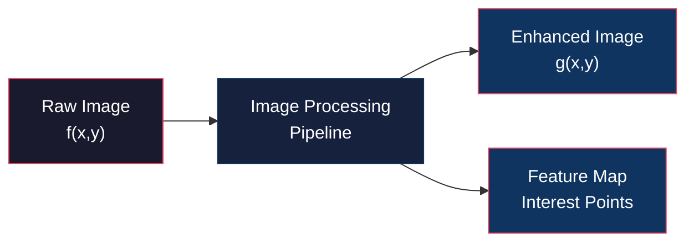
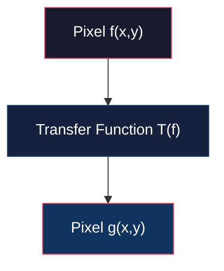
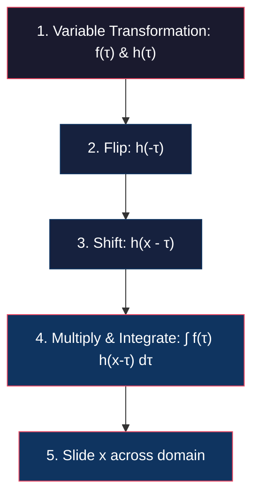
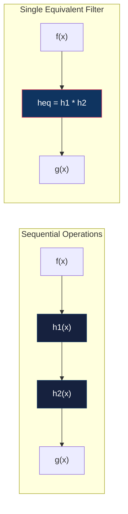

# Pixel Processing, LSIS, and Continuous Convolution

<!-- toc -->

## 1. Overview of Image Processing

Image processing is the transformation of an input image into a new image that is clearer, sharper, or more suitable for visual analysis. In computer vision systems, raw visual data captured by sensors is rarely directly usable; therefore, image processing tools sit "under the hood" of every vision pipeline.

The fundamental motivations for image processing fall into two primary categories:

### 1.1 Image Enhancement
Correcting degradation caused by physical limitations, sensor artifacts, or environment conditions:
* **Noise Removal:** Cleaning up grainy image data captured under low light conditions.
* **Motion Blur Removal:** Correcting the smearing effect caused by rapid object motion during the sensor exposure period.
* **Defocus Blur Removal:** Sharpening blurred images resulting from objects outside the optical camera's depth of field.

### 1.2 Information Recovery
Exposing and highlighting the most critical, distinctive attributes (*salient features*) for downstream analysis or object detection. This includes detecting and enhancing edges, corners, and keypoints.

> **Key Insight:** Image processing alters spatial pixel structures to optimize images for both human perception and downstream algorithmic evaluation.

---

## 2. Pixel / Point Processing

Pixel (or point) processing is the simplest and computationally cheapest class of operations applied to an image. Its core principle is to transform each pixel independently based solely on its own intensity or color value, completely ignoring its spatial coordinates and neighbor values.

In continuous space, an image is defined as an intensity function $f(x,y)$. The point processing transformation is expressed as:

$$g(x,y) = T(f(x,y))$$

where $f(x,y)$ is the input image, $g(x,y)$ is the output image, and $T$ represents the point-wise transfer function. For RGB color images, this transformation can be applied independently across Red ($R$), Green ($G$), and Blue ($B$) channels.

### 2.1 Common Pixel Processing Transformations

#### Darken
Subtracting a fixed intensity constant $C$ from every pixel value:

$$g(x,y) = f(x,y) - C \quad (\text{e.g., } f(x,y) - 128)$$

#### Lighten
Adding a fixed intensity constant $C$ to every pixel value:

$$g(x,y) = f(x,y) + C \quad (\text{e.g., } f(x,y) + 128)$$

#### Image Invert / Negative
Reversing intensity values in an 8-bit image system:

$$g(x,y) = 255 - f(x,y)$$

<figure style="display:flex; justify-content: center; margin: 20px 0;">
  

    
    <figcaption style="margin-top: 0.5em; text-align: center; font-size: 13px; color: #888;"><em>Outputs of Darken (f - 128), Lighten (f + 128), and Image Invert (255 - f) transformations</em></figcaption>
  

</figure>

#### Lower Contrast
Compressing the dynamic range of intensity values (e.g., dividing all pixel values by 2):

$$g(x,y) = \frac{f(x,y)}{2}$$

#### High Contrast
Expanding the dynamic range of intensity values by multiplying pixel intensities by a scale factor:

$$g(x,y) = f(x,y) \times 2$$

> **Warning: Saturation & Clipping Issue**  
> When increasing contrast, pixel values may exceed the maximum allowable dynamic range (255 for 8-bit systems). Any value greater than 255 is clipped directly to 255, resulting in detail loss and overexposed white regions (*saturation*):
>
> $$g(x,y) = \min(255, \max(0, T(f(x,y))))$$

#### Grayscale Conversion
Combining RGB color channels using weights derived from human photopic vision sensitivity curves:

$$g(x,y) = 0.3 \cdot R(x,y) + 0.6 \cdot G(x,y) + 0.1 \cdot B(x,y)$$

<figure style="display:flex; justify-content: center; margin: 20px 0;">
  

    
    <figcaption style="margin-top: 0.5em; text-align: center; font-size: 13px; color: #888;"><em>Low Contrast (f/2), High Contrast with Saturation (f * 2), and Grayscale Conversion</em></figcaption>
  

</figure>

---

## 3. Linear Shift-Invariant Systems (LSIS)

<figure style="display:flex; justify-content: center; margin: 20px 0;">
  

    
    <figcaption style="margin-top: 0.5em; text-align: center; font-size: 13px; color: #888;"><em>Linear Shift-Invariant System (LSIS) basic input-output block diagram</em></figcaption>
  

</figure>

Linear Shift-Invariant Systems (*LSIS*) constitute the foundational system architecture for the vast majority of signal and computer vision algorithms. The transformation of an input $f(x)$ into an output $g(x)$ via an LSIS relies on two fundamental mathematical axioms.

### 3.1 Linearity
The system must satisfy superposition and scaling principles. Assume system response $\text{LSIS}(f_1(x)) = g_1(x)$ and $\text{LSIS}(f_2(x)) = g_2(x)$:

For any linear combination $\alpha f_1(x) + \beta f_2(x)$, the output must equal the exact same linear combination of individual outputs:

$$\text{LSIS}(\alpha f_1(x) + \beta f_2(x)) = \alpha \cdot g_1(x) + \beta \cdot g_2(x)$$

<figure style="display:flex; justify-content: center; margin: 20px 0;">
  

    
    <figcaption style="margin-top: 0.5em; text-align: center; font-size: 13px; color: #888;"><em>LSIS linearity principle: Preservation of superposition and scaling</em></figcaption>
  

</figure>

### 3.2 Shift Invariance
A spatial shift in the input signal must produce an identical spatial shift in the output response:

$$\text{LSIS}(f(x - a)) = g(x - a)$$

<figure style="display:flex; justify-content: center; margin: 20px 0;">
  

    
    <figcaption style="margin-top: 0.5em; text-align: center; font-size: 13px; color: #888;"><em>LSIS shift invariance: Spatial shift by a in the input induces identical shift by a in the output</em></figcaption>
  

</figure>

### 3.3 Physical Example: Ideal Lens System
An ideal lens system provides a clear physical example of an LSIS:
* **Linearity:** Increasing scene illumination linearly scales focused image brightness ($f$) and defocused image brightness ($g$) by the exact same proportion.
* **Shift Invariance:** Shifting an object in the scene laterally or vertically shifts its projected image by the exact same spatial offset in both focused and blurred states.

---

## 4. Continuous Convolution

<figure style="display:flex; justify-content: center; margin: 20px 0;">
  

    
    <figcaption style="margin-top: 0.5em; text-align: center; font-size: 13px; color: #888;"><em>Continuous 1D convolution integral definition and signal plots for f(x) and h(x)</em></figcaption>
  

</figure>

Mathematically, any LSIS performs convolution, and any system performing convolution is an LSIS. The continuous 1D convolution of two functions $f(x)$ and $h(x)$ is defined as:

$$g(x) = f(x) * h(x) = \int_{-\infty}^{\infty} f(\tau) \, h(x - \tau) \, d\tau$$

### 4.1 Geometric Steps of Convolution

Computing continuous convolution geometrically involves 5 steps:

1. **Variable Transformation:** Express functions in terms of integration variable $\tau$ ($f(\tau)$ and $h(\tau)$).
2. **Flip:** Katlanmış function $h(-\tau)$ is obtained by flipping $h(\tau)$ symmetrically about the vertical axis.
3. **Shift:** Shift the flipped function by $x$ to form $h(x - \tau)$.
4. **Multiply & Integrate:** Overlay $h(x-\tau)$ on $f(\tau)$, compute the point-wise product, and integrate to evaluate the output intensity $g(x)$.
5. **Slide:** Sweep $x$ continuously from $-\infty$ to $+\infty$ to map out the entire function $g(x)$.

### 4.2 Convolution Examples

#### Convolution of Two Identical Box Functions
Consider two identical centered rectangular pulses of width 2 and height 1:

$$f(x) = \begin{cases} 1, & |x| \leq 1 \\ 0, & |x| > 1 \end{cases} \quad \text{and} \quad h(x) = \begin{cases} 1, & |x| \leq 1 \\ 0, & |x| > 1 \end{cases}$$

* As $h(x-\tau)$ slides from $-\infty$, overlap begins at $x = -2$.
* Overlap area increases linearly as $x$ moves toward 0.
* At $x = 0$, maximum overlap occurs with peak area equal to $\text{width} \times \text{height} = 2 \times 1 = 2$.
* Overlap decreases linearly until reaching zero at $x = 2$.
* **Result:** A symmetric triangular pulse centered at $x=0$ with height 2 and base width 4.

#### Convolution of a Box and a Triangle
When convolving a centered rectangle with a triangle:
* As the triangle slides into the rectangular region, both base width and overlap height grow linearly with offset $x$.
* **Result:** The resulting overlap integral is quadratic in $x$.

### 4.3 Proof: Convolution is an LSIS

#### 1. Proof of Linearity
Let input signal $f_{\text{in}}(\tau) = \alpha f_1(\tau) + \beta f_2(\tau)$. Output:

$$g(x) = \int_{-\infty}^{\infty} [\alpha f_1(\tau) + \beta f_2(\tau)] \, h(x-\tau) \, d\tau$$

Applying integral linearity:

$$g(x) = \alpha \int_{-\infty}^{\infty} f_1(\tau) \, h(x-\tau) \, d\tau + \beta \int_{-\infty}^{\infty} f_2(\tau) \, h(x-\tau) \, d\tau$$

$$g(x) = \alpha \cdot g_1(x) + \beta \cdot g_2(x)$$

Superposition holds; convolution is **linear**.

#### 2. Proof of Shift Invariance
Shift the input signal by $a$: $f_{\text{new}}(\tau) = f(\tau - a)$. Output:

$$g_{\text{new}}(x) = \int_{-\infty}^{\infty} f(\tau - a) \, h(x - \tau) \, d\tau$$

Substitute $\mu = \tau - a$ ($d\mu = d\tau$ and $\tau = \mu + a$):

$$g_{\text{new}}(x) = \int_{-\infty}^{\infty} f(\mu) \, h(x - (\mu + a)) \, d\mu = g(x - a)$$

Input shift by $a$ produces an identical output shift by $a$. System is **shift-invariant**.

---

## 5. Impulse Response and the Dirac Delta Function

To completely characterize an unknown LSIS ("black box"), a special probe signal is passed through the system: the **Unit Impulse Function** ($\text{Dirac Delta} - \delta(x)$).

### 5.1 Dirac Delta Function Properties
Mathematically, the Dirac delta function represents the limiting case of a rectangular pulse of infinitely narrow width ($2\varepsilon$) and infinitely high amplitude ($1/(2\varepsilon)$) as $\varepsilon \to 0$, such that total area is unity:

$$\int_{-\infty}^{\infty} \delta(x) \, dx = 1$$

The fundamental property of the delta function is the **Sifting Property**:

$$\int_{-\infty}^{\infty} b(\tau) \, \delta(x - \tau) \, d\tau = b(x)$$

The impulse isolates and sifts out the exact function value $b(x)$ at the impulse point.

### 5.2 System Characterization via Impulse Response ($h$)
When unit impulse $\delta(x)$ is applied to an unknown LSIS, the sifting property yields the system's own transfer function:

$$g(x) = \delta(x) * h(x) = h(x)$$

The function $h(x)$ is called the **Impulse Response**. Once $h(x)$ is measured, system behavior for any arbitrary input $f(x)$ is fully determined as $f(x) * h(x)$.

### 5.3 Optical & Biological Application: Human Eye PSF
Because optical lenses form a 2D LSIS, the human eye behaves as a 2D LSIS.
* **Star Example:** Observing a distant star provides a physical 2D point impulse excitation ($\delta(x,y)$).
* The 2D image projected onto the retina by a point source is the **Point Spread Function (PSF)**.
* A healthy eye has an extremely narrow PSF (decaying within $0.05^\circ$), ensuring sharp vision. Broader PSFs cause blurred perception.

<figure style="display:flex; justify-content: center; margin: 20px 0;">
  

    
    <figcaption style="margin-top: 0.5em; text-align: center; font-size: 13px; color: #888;"><em>Human eye Point Spread Function (PSF) measured via distant star point impulse</em></figcaption>
  

</figure>

---

## 6. Fundamental Algebraic Properties of Convolution

### 6.1 Commutative
$$f * h = h * f$$

### 6.2 Associative
$$(f * h_1) * h_2 = f * (h_1 * h_2)$$

### 6.3 Cascaded Systems
For a sequence of filters $h_1$ and $h_2$, cascading permits combining filters into a single equivalent impulse response $h_{\text{eq}} = h_1 * h_2$, reducing computation:

---

## 7. Higher-Dimensional Convolution

Because images are 2D spatial signals, continuous 2D convolution is defined as:

$$g(x,y) = f(x,y) * h(x,y) = \int_{-\infty}^{\infty} \int_{-\infty}^{\infty} f(\tau, \mu) \, h(x - \tau, y - \mu) \, d\tau \, d\mu$$

> **Key Insight:** This formulation extends naturally to 3D volumetric images (e.g., MRI, CT, Ultrasound) by evaluating integrals across 3 spatial dimensions.
