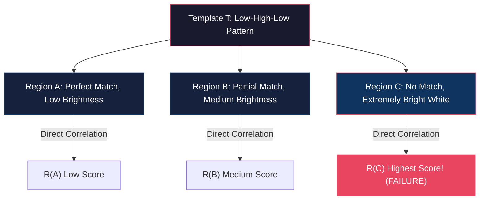

# Template Matching

<!-- toc -->

## 1. The Template Matching Problem

Template matching is the task of identifying the exact spatial location of a small template image $T[u,v]$ (a pattern or patch) within a larger target image $f[x,y]$.

### Physical Scenario
Locating the King face region ($T[u,v]$ template) within an image of a full playing card deck ($f[x,y]$) and returning its bounding coordinates is a standard template matching application.

---

## 2. Sum of Squared Differences (SSD)

The most direct way to measure geometric and color mismatch between a template and an overlapping image patch is by computing the Sum of Squared Differences (SSD).

For a spatial offset $(i,j)$, the error metric $E[i,j]$ is defined as:

$$E[i,j] = \sum_{m} \sum_{n} \left( f[m,n] - T[m-i, n-j] \right)^2$$

> **Key Insight:** As the error metric $E[i,j]$ approaches zero ($E[i,j] \to 0$), the local image region aligns perfectly with the template pattern.

### 2.1 Algebraic Expansion of SSD

Expanding the squared term and distributing summations yields:

$$E[i,j] = \sum_{m}\sum_{n} \left( f^2[m,n] + T^2[m-i, n-j] - 2 \cdot f[m,n] \cdot T[m-i, n-j] \right)$$

$$E[i,j] = \sum_{m}\sum_{n} f^2[m,n] + \sum_{m}\sum_{n} T^2[m-i, n-j] - 2 \sum_{m}\sum_{n} f[m,n] \cdot T[m-i, n-j]$$

<figure style="display:flex; justify-content: center; margin: 20px 0;">
  

    
    <figcaption style="margin-top: 0.5em; text-align: center; font-size: 13px; color: #888;"><em>Template matching on playing card and expansion of SSD equation into Cross-Correlation term</em></figcaption>
  

</figure>

Analyzing the expanded terms:

1. **$\sum \sum T^2$ (Template Energy):** Total energy of the template $T$, which remains constant across all spatial shifts.
2. **$\sum \sum f^2$ (Local Image Energy):** Total energy of the local image patch beneath the template window.
3. **$-2 \sum \sum f \cdot T$ (Cross Term):** Possesses a negative ($-$) sign in the expanded expression.

Minimizing the error metric $E[i,j]$ is algebraically equivalent to **maximizing the third term** ($\sum \sum f \cdot T$). This third term represents the **Cross-Correlation** between the template and the image.

---

## 3. Cross-Correlation

Cross-Correlation ($\otimes$) computes the direct dot product between overlapping image and template pixels:

$$R[i,j] = f[i,j] \otimes T[i,j] = \sum_{m} \sum_{n} f[m,n] \cdot T[m-i, n-j]$$

### 3.1 Convolution vs. Correlation

While similar mathematically, the two operations differ fundamentally:

* **Convolution ($*$):** The kernel is flipped horizontally and vertically before overlaying onto the image:

  $$g[i,j] = f[i,j] * h[i,j] = \sum_{m} \sum_{n} f[m,n] \cdot h[i-m, j-n]$$

* **Correlation ($\otimes$):** The template is applied directly without flipping (*no flipping*):

  $$R[i,j] = f[i,j] \otimes T[i,j] = \sum_{m} \sum_{n} f[m,n] \cdot T[m-i, n-j]$$

---

## 4. Limitation of Unnormalized Cross-Correlation

Direct unnormalized cross-correlation ($R[i,j]$) fails as a standalone matching metric because it is overly sensitive to absolute pixel intensity values.

### 4.1 Counter-Example

Consider a 1D template $T$ evaluated against three candidate image regions ($A$, $B$, $C$):
* **$T$ (Template):** Low-High-Low amplitude pattern.
* **Region $A$:** Structurally identical pattern, but low overall intensity (dim).
* **Region $B$:** Partial pattern match, moderate intensity.
* **Region $C$:** Irrelevant pattern, but extremely high pixel intensity (bright white).

#### Direct Correlation Ranking:
Because raw multiplication scales with absolute pixel values, unnormalized correlation yields:

$$R_C > R_B > R_A$$

<figure style="display:flex; justify-content: center; margin: 20px 0;">
  

    
    <figcaption style="margin-top: 0.5em; text-align: center; font-size: 13px; color: #888;"><em>False positive produced by unnormalized cross-correlation ranking bright Region C above true match Region A</em></figcaption>
  

</figure>

The system falsely flags **Region $C$ as the best match**, despite having zero structural relation to the template.

---

## 5. Normalized Cross-Correlation (NCC)

To eliminate intensity bias, the correlation score is normalized by dividing by the square root of the product of local image energy and template energy:

$$R_{\text{NCC}}[i,j] = \frac{\sum_{m} \sum_{n} f[m,n] \cdot T[m-i, n-j]}{\sqrt{\left( \sum_{m} \sum_{n} f^2[m,n] \right) \cdot \left( \sum_{m} \sum_{n} T^2[m-i, n-j] \right)}}$$

<figure style="display:flex; justify-content: center; margin: 20px 0;">
  

    
    <figcaption style="margin-top: 0.5em; text-align: center; font-size: 13px; color: #888;"><em>Energy normalization via NCC formula and spatial response peak pinpointing King face location</em></figcaption>
  

</figure>

### 5.1 Properties & Robustness of NCC

The denominator normalization provides key advantages:

* **Illumination Invariance:** Robust against changes in ambient lighting or shadows.
* **Gain Independence:** Invariant to linear camera gain and contrast adjustments.
* **Correct Pattern Ranking:** Normalization attenuates raw brightness effects, yielding the true match ranking:

  $$R_{\text{NCC}}(A) > R_{\text{NCC}}(B) > R_{\text{NCC}}(C)$$

> **Key Insight:** The peak correlation response ($R_{\text{NCC}} \to 1.0$) in the NCC output map corresponds precisely to the center spatial coordinates of the matched template.
