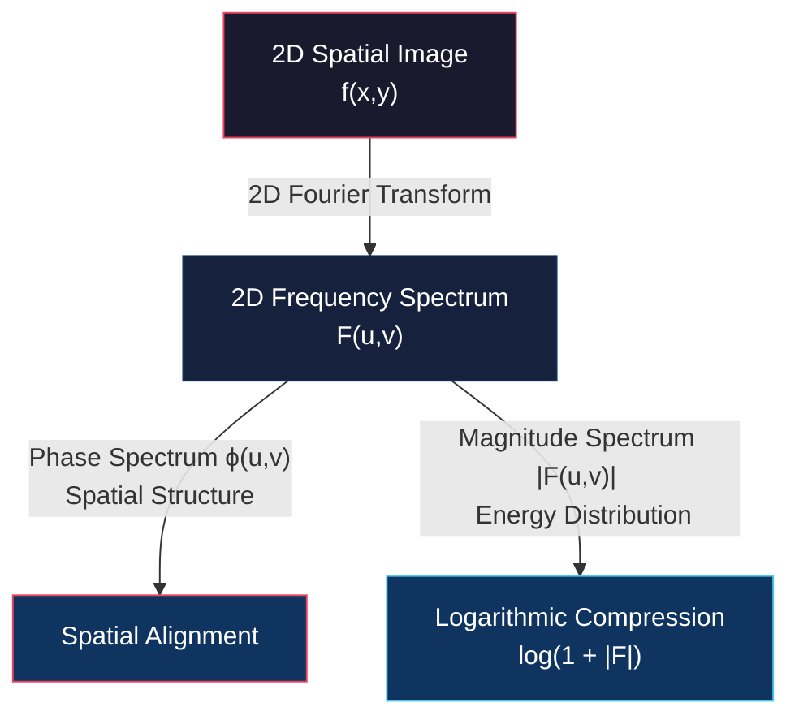
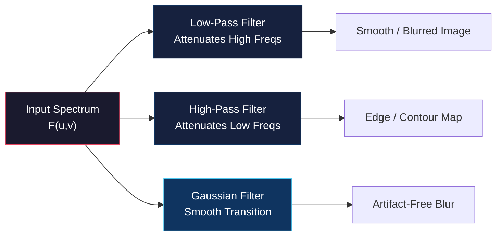
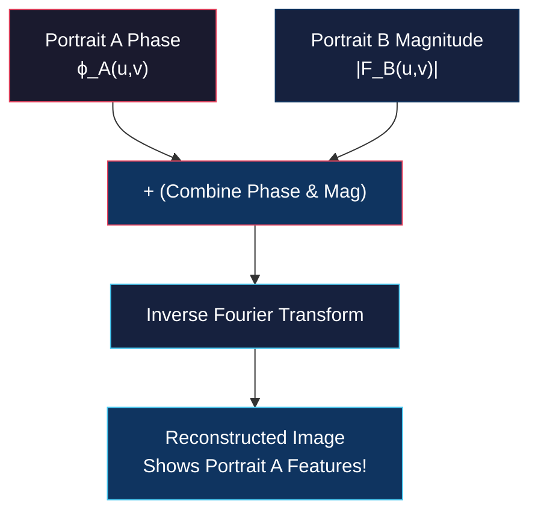
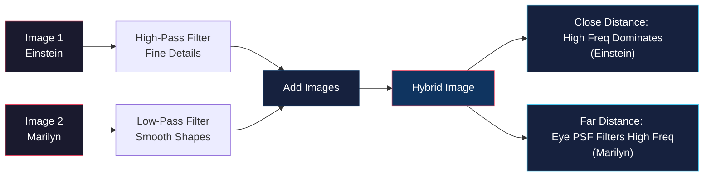
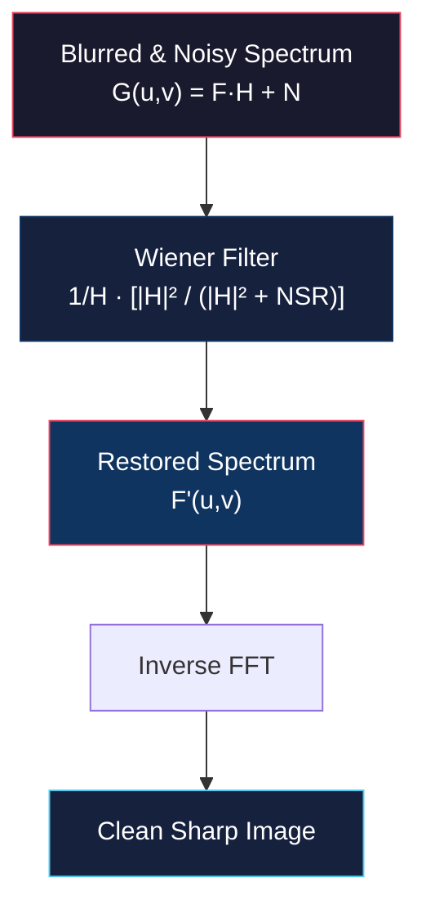

# Filtering in Frequency Domain and Deconvolution

<!-- toc -->

## 1. Two-Dimensional (2D) Fourier Transform

Because images are two-dimensional spatial intensity distributions $f(x,y)$, the 1D Fourier Transform equations are extended to incorporate both horizontal ($u$) and vertical ($v$) spatial frequency components.

### 1.1 2D Continuous Fourier Transform (2D FT)

For a continuous 2D image function $f(x,y)$, the forward 2D Fourier Transform is defined as:

$$F(u,v) = \int_{-\infty}^{\infty} \int_{-\infty}^{\infty} f(x,y) e^{-i 2\pi (ux + vy)} \, dx \, dy$$

### 1.2 2D Inverse Continuous Fourier Transform (2D IFT)

The original continuous image $f(x,y)$ is reconstructed from its frequency spectrum $F(u,v)$ via:

$$f(x,y) = \int_{-\infty}^{\infty} \int_{-\infty}^{\infty} F(u,v) e^{i 2\pi (ux + vy)} \, du \, dv$$

### 1.3 2D Discrete Fourier Transform (2D DFT)

In digital computers, images consist of discrete $M \times N$ pixel matrices. Continuous integrals are transformed into double finite summations. Let $m, n$ denote spatial pixel indices ($0 \le m < M, 0 \le n < N$) and $p, q$ denote discrete frequency indices:

$$F[p,q] = \sum_{m=0}^{M-1} \sum_{n=0}^{N-1} f[m,n] e^{-i 2\pi \left(\frac{pm}{M} + \frac{qn}{N}\right)}$$

### 1.4 2D Inverse Discrete Fourier Transform (2D IDFT)

The discrete spatial image $f[m,n]$ is reconstructed from discrete frequency coefficients $F[p,q]$ via:

$$f[m,n] = \frac{1}{MN} \sum_{p=0}^{M-1} \sum_{q=0}^{N-1} F[p,q] e^{i 2\pi \left(\frac{pm}{M} + \frac{qn}{N}\right)}$$

---

## 2. Visualizing the 2D Frequency Spectrum

Because Fourier coefficients $F(u,v)$ are complex numbers, standard visual display discards the phase component and focuses on the **magnitude spectrum** $|F(u,v)|$.

### 2.1 Logarithmic Dynamic Range Compression
Magnitude values in an image spectrum often span several orders of magnitude (e.g., from $10^0$ to $10^6$). Displaying raw magnitude values directly renders small high-frequency details invisible. To visualize details across the dynamic range, logarithmic compression is applied:

$$D(u,v) = c \cdot \log(1 + |F(u,v)|)$$

where $c$ is a normalization scaling constant.

### 2.2 Spectrum Centering (FFT Shift)
By default, the zero-frequency component $F[0,0]$ resides at the top-left corner of the spectrum matrix. For intuitive interpretation, an FFT shift operation rotates quadrant origins to place $(u=0, v=0)$ directly at the geometric center of the spectrum display. Higher spatial frequencies extend radially outward from the center.

### 2.3 The DC Component
Because digital image intensity values cannot be negative (e.g., 8-bit intensities range from 0 to 255), images have a non-zero average brightness. The central coefficient $F(0,0)$—termed the **DC component** (Direct Current)—represents total average image brightness and appears as a prominent bright spot at the spectrum center:

$$F(0,0) = \sum_{m=0}^{M-1} \sum_{n=0}^{N-1} f[m,n]$$

---

## 3. 2D Spectrum Examples & Physical Interpretations

The orientation and spatial distribution of structures in an image map directly to specific patterns in its 2D Fourier magnitude spectrum:

* **Horizontal Cosine Wave:** A pure horizontal sinusoid produces a central DC spot plus two symmetric impulses located along the horizontal frequency axis at $\pm k$. Summing two cosines generates 5 spectral spots.

<figure style="display:flex; justify-content: center; margin: 20px 0;">
  

    
    <figcaption style="margin-top: 0.5em; text-align: center; font-size: 13px; color: #888;"><em>Horizontal cosine waves ($f, g$) and their sum ($f+g$) generating discrete spectral spots</em></figcaption>
  

</figure>

* **Slit / Rectangular Window & Disk:** A slanted rectangular aperture generates orthogonal high-frequency lines, while a circular disk yields a rotationally symmetric Airy-like spectrum.

<figure style="display:flex; justify-content: center; margin: 20px 0;">
  

    
    <figcaption style="margin-top: 0.5em; text-align: center; font-size: 13px; color: #888;"><em>Slanted rectangular slit (perpendicular frequency lines) and circular disk (rotationally symmetric spectrum)</em></figcaption>
  

</figure>

* **Rubik's Cube & Mandrill Texture:** Images dominated by distinct edge directions generate bright radial rays, whereas complex natural textures produce a diffuse spectral cloud.

<figure style="display:flex; justify-content: center; margin: 20px 0;">
  

    
    <figcaption style="margin-top: 0.5em; text-align: center; font-size: 13px; color: #888;"><em>Rubik's Cube (dominant edge frequency rays) and Mandrill (complex texture spectral cloud)</em></figcaption>
  

</figure>

* **Random Noise:** Noise consists of rapid, uncorrelated spatial fluctuations. It produces a uniform, wideband energy distribution spread evenly across the entire frequency spectrum.

<figure style="display:flex; justify-content: center; margin: 20px 0;">
  

    
    <figcaption style="margin-top: 0.5em; text-align: center; font-size: 13px; color: #888;"><em>Cameraman image (dominant tripod rays) and Random Noise (uniform white noise distribution)</em></figcaption>
  

</figure>

---

## 4. Fundamental Image Filters in Frequency Domain

Frequency domain filtering modifies an image by multiplying its Fourier spectrum $F(u,v)$ by a frequency transfer function $H(u,v)$:

$$G(u,v) = F(u,v) \cdot H(u,v)$$

### 4.1 Low-Pass Filter (LPF)
A Low-Pass Filter suppresses high frequencies beyond a cutoff distance $D_0$ while preserving central low frequencies:

$$H_{\text{ILPF}}(u,v) = \begin{cases} 1 & \text{if } D(u,v) \le D_0 \\ 0 & \text{if } D(u,v) > D_0 \end{cases}$$

* **Visual Output:** Smooths noise and fine textures, producing a blurred image.

<figure style="display:flex; justify-content: center; margin: 20px 0;">
  

    
    <figcaption style="margin-top: 0.5em; text-align: center; font-size: 13px; color: #888;"><em>Low-Pass Filter (LPF) applied to Rubik's Cube with circular frequency cutoff disk</em></figcaption>
  

</figure>

* **Radius Effect:** Decreasing the cutoff radius $D_0$ blocks more high frequencies, resulting in progressively heavier blurring.

<figure style="display:flex; justify-content: center; margin: 20px 0;">
  

    
    <figcaption style="margin-top: 0.5em; text-align: center; font-size: 13px; color: #888;"><em>Severe blurring resulting from a small LPF cutoff radius (narrow frequency window)</em></figcaption>
  

</figure>

* **Ideal Filter Artifacts:** Using a sharp step cutoff (Ideal LPF) causes spatial **ringing artifacts** (Gibbs phenomenon) and blocky patterns due to the spatial Sinc footprint of the sharp frequency boundary.

### 4.2 High-Pass Filter (HPF)
A High-Pass Filter suppresses low frequencies (including the central DC component) while passing high frequencies:

$$H_{\text{IHPF}}(u,v) = 1 - H_{\text{ILPF}}(u,v)$$

* **Visual Output:** Homogeneous background regions turn black, isolating sharp intensity transitions, edges, and fine details.

<figure style="display:flex; justify-content: center; margin: 20px 0;">
  

    
    <figcaption style="margin-top: 0.5em; text-align: center; font-size: 13px; color: #888;"><em>High-Pass Filter (HPF) applied to Rubik's Cube yielding an edge/contour map</em></figcaption>
  

</figure>

* **Computer Vision Role & Radius Effect:** Fundamental edge and corner detection operators (e.g., Sobel, Laplacian) act as high-pass filters. Increasing the cutoff radius refines and sharpens extracted edge lines.

<figure style="display:flex; justify-content: center; margin: 20px 0;">
  

    
    <figcaption style="margin-top: 0.5em; text-align: center; font-size: 13px; color: #888;"><em>Increasing HPF cutoff radius (large central blocking disk) extracts ultra-fine edge lines</em></figcaption>
  

</figure>

### 4.3 Gaussian Smoothing
To eliminate ringing artifacts caused by ideal step filters, a **Gaussian Low-Pass Filter (GLPF)** employs a smooth, continuous exponential decay:

$$H_{\text{GLPF}}(u,v) = e^{-\frac{D^2(u,v)}{2 D_0^2}}$$

By the Convolution Theorem, multiplying by a Gaussian in the frequency domain is equivalent to convolving with a spatial Gaussian kernel.

<figure style="display:flex; justify-content: center; margin: 20px 0;">
  

    
    <figcaption style="margin-top: 0.5em; text-align: center; font-size: 13px; color: #888;"><em>Equivalence between spatial Gaussian convolution ($f * n_\sigma$) and frequency Gaussian multiplication ($F \cdot N_\sigma$)</em></figcaption>
  

</figure>

* **Inverse Scaling Effect:** As the spatial Gaussian mask is widened, the frequency Gaussian narrows, attenuating more high frequencies and producing heavier blur.

<figure style="display:flex; justify-content: center; margin: 20px 0;">
  

    
    <figcaption style="margin-top: 0.5em; text-align: center; font-size: 13px; color: #888;"><em>Wider spatial Gaussian mask producing a narrower frequency Gaussian filter and heavier blur</em></figcaption>
  

</figure>

---

## 5. Critical Importance of Phase Information

While the magnitude spectrum $|F(u,v)|$ indicates *how much* energy exists at each frequency, the **phase spectrum** $\phi(u,v)$ specifies *where* those frequency components align in spatial coordinates.

> **Key Insight: Phase Preserves Structural Identity**  
> Pioneering experiments by Oppenheim, Lim, and Curtis (1983) demonstrated that spatial structure and visual identity are governed predominantly by phase, not magnitude.

### 5.1 The Phase vs. Magnitude Experiment

1. **Magnitude-Only Reconstruction:** If the phase spectrum of a portrait (Marilyn Monroe or Albert Einstein) is set to zero while keeping its original magnitude spectrum, the reconstructed inverse Fourier image becomes an unrecognizable, diffuse, cloud-like blob.
2. **Phase-Only Reconstruction with Swapped Magnitude:** If the original phase spectrum of Marilyn Monroe is combined with the magnitude spectrum of an entirely unrelated scene (e.g., a landscape), the inverse Fourier transform clearly displays the sharp facial contours and recognizable identity of Marilyn Monroe.

<figure style="display:flex; justify-content: center; margin: 20px 0;">
  

    
    <figcaption style="margin-top: 0.5em; text-align: center; font-size: 13px; color: #888;"><em>Phase vs. magnitude experiment on Marilyn Monroe and Albert Einstein: Preserving phase maintains recognizable identity.</em></figcaption>
  

</figure>

---

## 6. Hybrid Images

Developed by Aude Oliva (2006), **Hybrid Images** exploit human visual perception and the spatial Point Spread Function (PSF) of the human eye to create optical illusions that change depending on viewing distance.

<figure style="display:flex; justify-content: center; margin: 20px 0;">
  

    
    <figcaption style="margin-top: 0.5em; text-align: center; font-size: 13px; color: #888;"><em>Hybrid Image construction: Low-pass Marilyn Monroe + High-pass Albert Einstein = Hybrid Image</em></figcaption>
  

</figure>

### 6.1 Construction Pipeline
1. **High-Pass Component:** Apply a High-Pass Filter to an image (Albert Einstein) to extract sharp edge details.
2. **Low-Pass Component:** Apply a Low-Pass Filter to a second image (Marilyn Monroe) to extract smooth background shading.
3. **Superposition:** Sum the two filtered images to produce a single Hybrid Image.

### 6.2 Perceptual Mechanism
* **Close Viewing Distance:** High spatial frequencies are resolved sharply by the retina, causing the observer to perceive the high-pass image (Einstein).
* **Far Viewing Distance:** The angular resolution and defocus PSF of the human eye attenuate high spatial frequencies, leaving only the low-frequency component (Marilyn Monroe).

---

## 7. Deblurring and Deconvolution

During image acquisition, camera motion or defocus blurs an ideal sharp scene $f(x,y)$ via spatial convolution with a degradation function $h(x,y)$ (the **Point Spread Function** or **PSF**):

$$g(x,y) = f(x,y) * h(x,y)$$

**Deconvolution** is the process of reversing this spatial degradation to recover the unblurred scene $f(x,y)$.

<figure style="display:flex; justify-content: center; margin: 20px 0;">
  

    
    <figcaption style="margin-top: 0.5em; text-align: center; font-size: 13px; color: #888;"><em>Blur degradation model: Scene ($f$) * Camera shake PSF ($h$) = Motion blurred image ($g$)</em></figcaption>
  

</figure>

### 7.1 PSF Estimation via Inertial Measurement Units (IMU)
In modern smartphone cameras, physical camera shake $h(x,y)$ is estimated using hardware IMU sensors (accelerometers and gyroscopes). By tracking 3D camera rotation and translation during sensor exposure, the exact motion blur kernel $h(x,y)$ is calculated mathematically.

### 7.2 Naïve Inverse Filtering and Its Collapse

In an ideal noise-free environment, transforming $g(x,y) = f(x,y) * h(x,y)$ into the frequency domain yields:

$$G(u,v) = F(u,v) \cdot H(u,v) \implies F'(u,v) = \frac{G(u,v)}{H(u,v)}$$

Taking the Inverse Fourier Transform $\text{IFT}\{F'(u,v)\}$ recovers $f(x,y)$ perfectly.

<figure style="display:flex; justify-content: center; margin: 20px 0;">
  

    
    <figcaption style="margin-top: 0.5em; text-align: center; font-size: 13px; color: #888;"><em>Simple deconvolution Step 1 in noise-free environment: Frequency spectrum division ($F' = G / H$)</em></figcaption>
  

</figure>

<figure style="display:flex; justify-content: center; margin: 20px 0;">
  

    
    <figcaption style="margin-top: 0.5em; text-align: center; font-size: 13px; color: #888;"><em>Simple deconvolution Step 2 in noise-free environment: Computing IFT of $F'$ to recover unblurred scene ($f'$)</em></figcaption>
  

</figure>

However, all real sensor systems introduce additive noise $n(x,y)$ (photon shot noise, thermal noise, quantization noise):

$$g(x,y) = f(x,y) * h(x,y) + n(x,y) \implies G(u,v) = F(u,v)H(u,v) + N(u,v)$$

Applying naïve inverse filtering to this realistic model yields:

$$F'(u,v) = \frac{G(u,v)}{H(u,v)} = F(u,v) + \frac{N(u,v)}{H(u,v)}$$

> **Warning: Double Mathematical Failure of Simple Inverse Filtering**  
> 1. **Division by Zero:** Motion blur kernels $H(u,v)$ act as low-pass filters whose frequency values drop to zero at higher frequencies. Evaluating $\frac{1}{H(u,v)}$ at these zeros causes division-by-zero singularities ($\infty$).  
> 2. **Severe Noise Amplification:** At high frequencies where $|H(u,v)| \approx 0$, non-zero noise components $N(u,v)$ are multiplied by massive numbers ($\frac{N}{H} \gg 1$). The noise term completely overwhelms the true signal $F(u,v)$, corrupting the restored image with extreme salt-and-pepper noise artifacts.

---

## 8. Wiener Deconvolution

To prevent noise amplification and safely invert degraded signals, **Wiener Deconvolution** incorporates a dynamic frequency weighting factor based on signal and noise power.

### 8.1 Theoretical Wiener Filter Formula

The theoretical Wiener filter minimizes the mean square error between the estimated image $f'(x,y)$ and the true image $f(x,y)$:

$$F'(u,v) = \frac{G(u,v)}{H(u,v)} \cdot \left[ \frac{1}{1 + \frac{\text{NSR}(u,v)}{|H(u,v)|^2}} \right]$$

where $\text{NSR}(u,v)$ represents the spectral **Noise-to-Signal Ratio**:

$$\text{NSR}(u,v) = \frac{|N(u,v)|^2}{|F(u,v)|^2}$$

### 8.2 Working Mechanism
* **High-SNR Frequencies ($|N|^2 \ll |F|^2$):** $\text{NSR} \to 0$, making the bracketed term approach $1$. The filter acts as a standard inverse filter $\frac{G}{H}$.
* **Low-SNR / High-Noise Frequencies ($|H| \to 0$ or $|N|^2 \gg |F|^2$):** $\frac{\text{NSR}}{|H|^2} \to \infty$, driving the bracketed weighting term to $0$. This safely suppresses high-frequency noise amplification and avoids division by zero.

### 8.3 Practical Constant $\lambda$ Approximation

Because true noise $|N(u,v)|^2$ and unblurred scene spectra $|F(u,v)|^2$ are rarely known prior to restoration, practical implementations approximate NSR using a small user-defined constant parameter $\lambda$ (e.g., $\lambda \approx 0.002$):

$$F'(u,v) = \frac{G(u,v)}{H(u,v)} \cdot \left[ \frac{|H(u,v)|^2}{|H(u,v)|^2 + \lambda} \right]$$

<figure style="display:flex; justify-content: center; margin: 20px 0;">
  

    
    <figcaption style="margin-top: 0.5em; text-align: center; font-size: 13px; color: #888;"><em>Restoration of noisy blurred image using Wiener Deconvolution with constant parameter $\lambda = 0.002$</em></figcaption>
  

</figure>

While choosing a fixed $\lambda$ may leave minor ringing artifacts near sharp boundaries, Wiener deconvolution dramatically sharpens blurred, noisy images into clear, visually crisp results.
