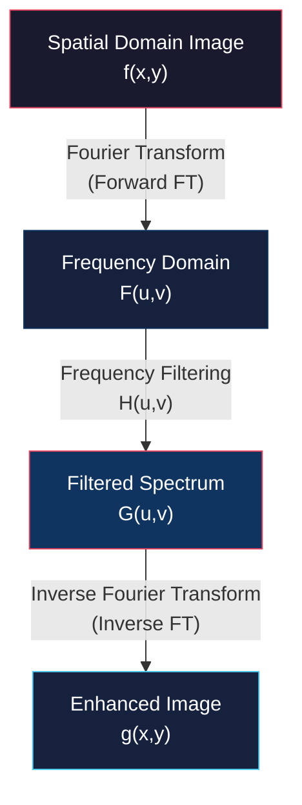

# Overview, Fourier Transform, and Convolution Theorem

<!-- toc -->

## 1. Overview of Frequency Domain

Analyzing images exclusively in the spatial domain (pixel-by-pixel intensity operations) can be computationally expensive and conceptually complex for operations like blurring, sharpening, or deconvolution. The **frequency domain** provides an alternative representation by expressing spatial image structures as a weighted sum of sinusoids (sine and cosine waves) across various spatial frequencies.

Transitioning from spatial coordinates to frequency representation yields three core engineering advantages:

1. **Convolution Efficiency:** Computationally intensive spatial convolution integrals are converted into simple point-wise multiplication in the frequency domain.
2. **Frequency Separation:** High-frequency components (fine details, sharp edges, granular noise) and low-frequency components (smooth backgrounds, slow intensity gradients) are explicitly isolated in separate spectral regions.
3. **Restoration & Deconvolution Stability:** Image restoration, motion deblurring, and inverse filtering become mathematically tractable and stable.

> **Key Insight:** Spatial domain operations observe *where* intensity changes occur, while frequency domain operations analyze *how fast* intensity changes occur across space.

---

## 2. Fourier Transform

The Fourier Transform is named after the French mathematician and physicist **Jean Baptiste Joseph Fourier** (1768–1830).

### 2.1 Historical Background

Fourier introduced his foundational concept while modeling heat diffusion through solid materials. He claimed that any periodic function could be represented as an infinite sum of sinusoidal waves. 

Prominent mathematicians of his era—including Joseph-Louis Lagrange and Leonhard Euler—initially rejected Fourier's work as lacking mathematical rigor. It took nearly eight years for his papers to achieve publication. Today, the Fourier Transform serves as a fundamental pillar across signal processing, computer vision, communications, and physics.

### 2.2 Fundamental Principle: Sinusoidal Building Blocks

At the heart of Fourier analysis lies the **sinusoid**. A continuous 1D sinusoidal signal is mathematically defined as:

$$f(x) = A \sin(2\pi u x + \phi)$$

where:
* **$A$ (Amplitude):** Represents the peak height or maximum power of the wave.
* **$u$ (Frequency):** Dictates the number of oscillation cycles per unit spatial distance.
* **$T = \frac{1}{u}$ (Period):** Represents the spatial distance required for one complete oscillation cycle.
* **$\phi$ (Phase):** Specifies the angular phase shift relative to the origin.

<figure style="display:flex; justify-content: center; margin: 20px 0;">
  

    
    <figcaption style="margin-top: 0.5em; text-align: center; font-size: 13px; color: #888;"><em>Geometric decomposition of a sinusoid showing Amplitude ($A$), Frequency ($u$), Period ($T = 1/u$), and Phase ($\phi$).</em></figcaption>
  

</figure>

---

## 3. Square Wave Construction & Fourier Series

A classic illustration of Fourier theory is constructing a periodic **square wave** by summing simple sine waves at fundamental and harmonic frequencies.

1. **1 Sinusoid:** Adding only the fundamental frequency $u$ yields a coarse, smooth approximation of the square wave.
2. **Successive Odd Harmonics:** Adding odd harmonics ($u, 3u, 5u, 7u, \dots$) with progressively decreasing amplitudes ($\frac{1}{1}, \frac{1}{3}, \frac{1}{5}, \frac{1}{7}, \dots$) flattens the wave crests and steepens vertical transitions.
3. **8 Sinusoids:** Summing the first 8 harmonic terms produces a profile that closely resembles a sharp square wave.
4. **Infinite Terms:** Summing an infinite series of sinusoids yields an exact square wave with perfectly vertical step discontinuities.

<figure style="display:flex; justify-content: center; margin: 20px 0;">
  

    
    <figcaption style="margin-top: 0.5em; text-align: center; font-size: 13px; color: #888;"><em>Fourier Series square wave construction (Sum of first 7 and 8 harmonic sinusoids)</em></figcaption>
  

</figure>

<figure style="display:flex; justify-content: center; margin: 20px 0;">
  

    
    <figcaption style="margin-top: 0.5em; text-align: center; font-size: 13px; color: #888;"><em>Decomposition of a square wave into its Amplitude and Phase ($\phi \in \{-\pi/2, \pi/2\}$) spectra</em></figcaption>
  

</figure>

> **Warning: Ringing Artifacts & Gibbs Phenomenon**  
> Representing an instantaneous spatial step discontinuity (such as the vertical edge of a square wave) requires infinitely high frequencies. Truncating the Fourier series to a finite number of harmonics introduces high-frequency oscillations near sharp boundaries, known as **ringing artifacts** or the **Gibbs Phenomenon**. Additionally, the phase $\phi$ of harmonics in a square wave alternates between $-\pi/2$ and $\pi/2$.

---

## 4. Mathematical Formulation and Proofs

The Fourier Transform maps a continuous spatial signal $f(x)$ to its frequency domain representation $F(u)$ without any loss of information.

### 4.1 1D Continuous Fourier Transform (Forward & Inverse)

The **Forward Fourier Transform (1D FT)** converts a spatial function $f(x)$ into the frequency domain $F(u)$:

$$F(u) = \int_{-\infty}^{\infty} f(x) e^{-i 2\pi u x} \, dx$$

The **Inverse Fourier Transform (1D IFT)** reconstructs the original spatial signal $f(x)$ from its frequency spectrum $F(u)$:

$$f(x) = \int_{-\infty}^{\infty} F(u) e^{i 2\pi u x} \, du$$

where $x$ denotes spatial position and $u$ represents spatial frequency.

<figure style="display:flex; justify-content: center; margin: 20px 0;">
  

    
    <figcaption style="margin-top: 0.5em; text-align: center; font-size: 13px; color: #888;"><em>Forward Fourier Transform (FT) vs. Inverse Fourier Transform (IFT) input-output mapping</em></figcaption>
  

</figure>

> **Mathematical Symmetry Note:** The forward transform uses $-i$ in the complex exponential exponent, whereas the inverse transform uses $+i$.

### 4.2 Derivation of Euler's Formula via Taylor Series

To understand why complex exponentials ($e^{i\theta}$) represent sinusoidal waves ($\cos\theta, \sin\theta$), we use **Euler's Formula**:

$$e^{i\theta} = \cos\theta + i\sin\theta \quad (\text{where } i = \sqrt{-1})$$

<figure style="display:flex; justify-content: center; margin: 20px 0;">
  

    
    <figcaption style="margin-top: 0.5em; text-align: center; font-size: 13px; color: #888;"><em>Mathematical derivation of Euler's Formula ($e^{i\theta} = \cos\theta + i\sin\theta$) using Taylor series expansion</em></figcaption>
  

</figure>

#### Step-by-Step Proof:

The Maclaurin (Taylor series around $x=0$) expansion for $e^x$ is:

$$e^{x} = 1 + x + \frac{x^2}{2!} + \frac{x^3}{3!} + \frac{x^4}{4!} + \frac{x^5}{5!} + \dots$$

Substituting $x = i\theta$:

$$e^{i\theta} = 1 + (i\theta) + \frac{(i\theta)^2}{2!} + \frac{(i\theta)^3}{3!} + \frac{(i\theta)^4}{4!} + \frac{(i\theta)^5}{5!} + \dots$$

Using powers of $i$ ($i^2 = -1, i^3 = -i, i^4 = 1, i^5 = i$):

$$e^{i\theta} = 1 + i\theta - \frac{\theta^2}{2!} - i\frac{\theta^3}{3!} + \frac{\theta^4}{4!} + i\frac{\theta^5}{5!} - \dots$$

Group real terms and imaginary terms separately:

$$e^{i\theta} = \left( 1 - \frac{\theta^2}{2!} + \frac{\theta^4}{4!} - \dots \right) + i \left( \theta - \frac{\theta^3}{3!} + \frac{\theta^5}{5!} - \dots \right)$$

Comparing these series with standard Taylor series expansions:
* $\cos\theta = 1 - \frac{\theta^2}{2!} + \frac{\theta^4}{4!} - \dots$
* $\sin\theta = \theta - \frac{\theta^3}{3!} + \frac{\theta^5}{5!} - \dots$

Substituting both yields Euler's Formula:

$$e^{i\theta} = \cos\theta + i\sin\theta \quad \blacksquare$$

---

## 5. Complex Structure of Fourier Transform

Because a Fourier coefficient $F(u)$ must encode both the **amplitude** (strength) and **phase** (spatial shift) of frequency $u$, $F(u)$ is inherently a complex number ($F(u) \in \mathbb{C}$):

$$F(u) = \Re(F(u)) + i \Im(F(u))$$

### 5.1 Magnitude (Amplitude Spectrum)
The magnitude spectrum $|F(u)|$ measures the power or energy of frequency $u$:

$$|F(u)| = \sqrt{\Re(F(u))^2 + \Im(F(u))^2}$$

### 5.2 Phase Spectrum
The phase spectrum $\phi(u)$ measures spatial alignment or origin offset:

$$\phi(u) = \tan^{-1}\left( \frac{\Im(F(u))}{\Re(F(u))} \right) \quad (\text{computed using } \text{atan2}(\Im, \Re))$$

> **Negative Frequencies:** The integral limits extend from $-\infty$ to $+\infty$. Negative frequencies ($u < 0$) arise naturally from Euler's formula to maintain Hermitian mathematical symmetry for real-valued spatial signals.

---

## 6. Fundamental Fourier Transform Pairs

Below is a reference summary of canonical spatial functions $f(x)$ and their corresponding Fourier transforms $F(u)$:

### 6.1 Cosine Function
A single pure cosine $f(x) = \cos(2\pi k x)$ contains only frequency $k$. Its Fourier transform consists of two symmetric Dirac delta impulses on the real axis at $u = \pm k$:

$$\mathcal{F}\{\cos(2\pi k x)\} = \frac{1}{2} \left[ \delta(u - k) + \delta(u + k) \right]$$

<figure style="display:flex; justify-content: center; margin: 20px 0;">
  

    
    <figcaption style="margin-top: 0.5em; text-align: center; font-size: 13px; color: #888;"><em>Cosine function $f(x) = \cos(2\pi k x)$ and its two symmetric real-axis Dirac delta impulses</em></figcaption>
  

</figure>

### 6.2 Sum of Cosines
A signal composed of two cosines $f(x) = \cos(2\pi k_1 x) + \cos(2\pi k_2 x)$ produces four delta impulses located at $u = \pm k_1$ and $u = \pm k_2$.

<figure style="display:flex; justify-content: center; margin: 20px 0;">
  

    
    <figcaption style="margin-top: 0.5em; text-align: center; font-size: 13px; color: #888;"><em>Sum of two cosines and its corresponding four Dirac delta impulses</em></figcaption>
  

</figure>

### 6.3 Sine Function
$f(x) = \sin(2\pi k x)$ also contains frequency $k$, but its delta impulses lie on the imaginary axis with opposite signs:

$$\mathcal{F}\{\sin(2\pi k x)\} = \frac{i}{2} \left[ \delta(u + k) - \delta(u - k) \right]$$

### 6.4 Constant Function
A constant DC signal $f(x) = 1$ has zero spatial variation (zero frequency). Its spectrum is a single Dirac impulse at the origin $u = 0$:

$$\mathcal{F}\{1\} = \delta(u)$$

<figure style="display:flex; justify-content: center; margin: 20px 0;">
  

    
    <figcaption style="margin-top: 0.5em; text-align: center; font-size: 13px; color: #888;"><em>Constant DC signal $f(x) = 1$ and its zero-frequency Dirac delta impulse</em></figcaption>
  

</figure>

### 6.5 Unit Impulse (Dirac Delta) Function
A point impulse $f(x) = \delta(x)$ requires equal contributions across all frequencies to form its infinite spatial spike. Its Fourier transform is completely flat:

$$\mathcal{F}\{\delta(x)\} = 1$$

<figure style="display:flex; justify-content: center; margin: 20px 0;">
  

    
    <figcaption style="margin-top: 0.5em; text-align: center; font-size: 13px; color: #888;"><em>Spatial unit impulse $f(x) = \delta(x)$ and its flat frequency spectrum $F(u) = 1$</em></figcaption>
  

</figure>

### 6.6 Rectangular Window Function
A spatial boxcar / rectangle function $f(x) = \text{Rect}(x/T)$ of width $T$ transforms into a **Sinc function**:

$$\mathcal{F}\{\text{Rect}(x/T)\} = T \cdot \text{sinc}(Tu) = T \frac{\sin(\pi T u)}{\pi T u}$$

<figure style="display:flex; justify-content: center; margin: 20px 0;">
  

    
    <figcaption style="margin-top: 0.5em; text-align: center; font-size: 13px; color: #888;"><em>Spatial rectangular window $f(x) = \text{Rect}(x/T)$ and its Sinc spectrum</em></figcaption>
  

</figure>

### 6.7 Gaussian Function
A spatial Gaussian $f(x) = e^{-ax^2}$ with variance parameter $a$ transforms into another Gaussian in the frequency domain:

$$\mathcal{F}\{e^{-ax^2}\} = \sqrt{\frac{\pi}{a}} e^{-\frac{\pi^2 u^2}{a}}$$

<figure style="display:flex; justify-content: center; margin: 20px 0;">
  

    
    <figcaption style="margin-top: 0.5em; text-align: center; font-size: 13px; color: #888;"><em>Spatial Gaussian $f(x) = e^{-ax^2}$ and its corresponding frequency Gaussian spectrum</em></figcaption>
  

</figure>

### 6.8 Inverse Scaling Principle
As demonstrated by the Gaussian and Rect-Sinc pairs, stretching a signal spatially causes it to contract in the frequency domain, and vice versa:

$$f(ax) \iff \frac{1}{|a|} F\left(\frac{u}{a}\right)$$

---

## 7. Fundamental Properties of Fourier Transform

<figure style="display:flex; justify-content: center; margin: 20px 0;">
  

    
    <figcaption style="margin-top: 0.5em; text-align: center; font-size: 13px; color: #888;"><em>Fundamental transformation properties table between spatial and frequency domains</em></figcaption>
  

</figure>

| Property | Spatial Domain ($f(x)$) | Frequency Domain ($F(u)$) | Technical Description |
| :--- | :--- | :--- | :--- |
| **Linearity** | $\alpha f_1(x) + \beta f_2(x)$ | $\alpha F_1(u) + \beta F_2(u)$ | Superposition and scaling principles hold in both domains. |
| **Scaling** | $f(ax)$ | $\frac{1}{\|a\|} F\left(\frac{u}{a}\right)$ | Spatial expansion causes frequency compression. |
| **Shifting** | $f(x - a)$ | $F(u) e^{-i 2\pi u a}$ | Spatial translation alters phase without affecting magnitude. |
| **Differentiation** | $\frac{d^n f(x)}{dx^n}$ | $(i 2\pi u)^n F(u)$ | Taking spatial derivatives amplifies high frequencies (sharpening). |

---

## 8. Convolution Theorem

Continuous 1D spatial convolution ($*$) between an image signal $f(x)$ and a system filter $h(x)$ is defined as:

$$g(x) = f(x) * h(x) = \int_{-\infty}^{\infty} f(\tau) h(x - \tau) \, d\tau$$

Graphically, spatial convolution involves flipping the filter kernel $h(\tau) \to h(-\tau)$, shifting it by offset $x$, multiplying by $f(\tau)$, and integrating the overlapping area. For example, convolving two identical rectangular boxcars produces a symmetric triangle function.

### 8.1 Theorem Statement

The **Convolution Theorem** links spatial operations to frequency operations:

$$\mathcal{F}\{f(x) * h(x)\} = F(u) \cdot H(u)$$

$$\mathcal{F}\{f(x) \cdot h(x)\} = F(u) * H(u)$$

<figure style="display:flex; justify-content: center; margin: 20px 0;">
  

    
    <figcaption style="margin-top: 0.5em; text-align: center; font-size: 13px; color: #888;"><em>Convolution Theorem: Spatial convolution corresponds to frequency multiplication, and spatial multiplication corresponds to frequency convolution.</em></figcaption>
  

</figure>

* **Spatial Convolution $\iff$ Frequency Multiplication:** Convolving two signals in space is equivalent to point-wise multiplying their Fourier transforms in frequency.
* **Spatial Multiplication $\iff$ Frequency Convolution:** Point-wise multiplying two signals in space is equivalent to convolving their Fourier transforms in frequency.

### 8.2 Mathematical Proof of Convolution Theorem

We evaluate the Fourier transform $G(u)$ of the spatial convolution output $g(x) = f(x) * h(x)$:

$$G(u) = \int_{-\infty}^{\infty} g(x) e^{-i 2\pi u x} \, dx$$

Substitute the spatial convolution integral into $g(x)$:

$$G(u) = \int_{-\infty}^{\infty} \left[ \int_{-\infty}^{\infty} f(\tau) h(x - \tau) \, d\tau \right] e^{-i 2\pi u x} \, dx$$

Exchange integration order and expand the complex exponential by introducing $+u\tau - u\tau$:

$$e^{-i 2\pi u x} = e^{-i 2\pi u (x - \tau)} e^{-i 2\pi u \tau}$$

Reorganizing the inner and outer integrals:

$$G(u) = \int_{-\infty}^{\infty} f(\tau) e^{-i 2\pi u \tau} \left[ \int_{-\infty}^{\infty} h(x - \tau) e^{-i 2\pi u (x - \tau)} \, dx \right] d\tau$$

Apply change of variables $y = x - \tau$ (hence $dy = dx$). Because $\tau$ is finite, integration limits remain $[-\infty, \infty]$:

$$G(u) = \left( \int_{-\infty}^{\infty} f(\tau) e^{-i 2\pi u \tau} \, d\tau \right) \cdot \left( \int_{-\infty}^{\infty} h(y) e^{-i 2\pi u y} \, dy \right)$$

The first integral is the exact definition of $F(u)$, and the second integral is $H(u)$:

$$G(u) = F(u) \cdot H(u) \quad \blacksquare$$

### 8.3 Computational Efficiency and Engineering Impact

Convolving an $N \times N$ image with a large spatial filter kernel has $O(N^2)$ computational complexity per pixel. By leveraging the Convolution Theorem and the Fast Fourier Transform (FFT):

  

    <figure style="margin: 0;">
      
      <figcaption style="margin-top: 0.5em; font-size: 13px; color: #888;"><em>Fourier transforms ($F(u)$ and $N_\sigma(u)$) of noisy signal ($f(x)$) and Gaussian kernel ($n_\sigma(x)$) and point-wise multiplication</em></figcaption>
    </figure>
  

  

    <figure style="margin: 0;">
      
      <figcaption style="margin-top: 0.5em; font-size: 13px; color: #888;"><em>Inverse Fourier Transform of filtered spectrum ($F(u)H(u)$) yielding smoothed output signal $g(x)$</em></figcaption>
    </figure>
  

1. Compute $F(u) = \mathcal{F}\{f(x)\}$ and $H(u) = \mathcal{F}\{h(x)\}$ using FFT ($O(N \log N)$).
2. Perform element-wise multiplication $G(u) = F(u) \cdot H(u)$ ($O(N)$).
3. Compute the Inverse FFT $g(x) = \mathcal{F}^{-1}\{G(u)\}$ ($O(N \log N)$).

This reduces computational complexity from $O(N^2)$ to $O(N \log N)$, providing enormous acceleration for large filter kernels and offering clear visual insight into which spatial frequencies a filter attenuates or passes.
