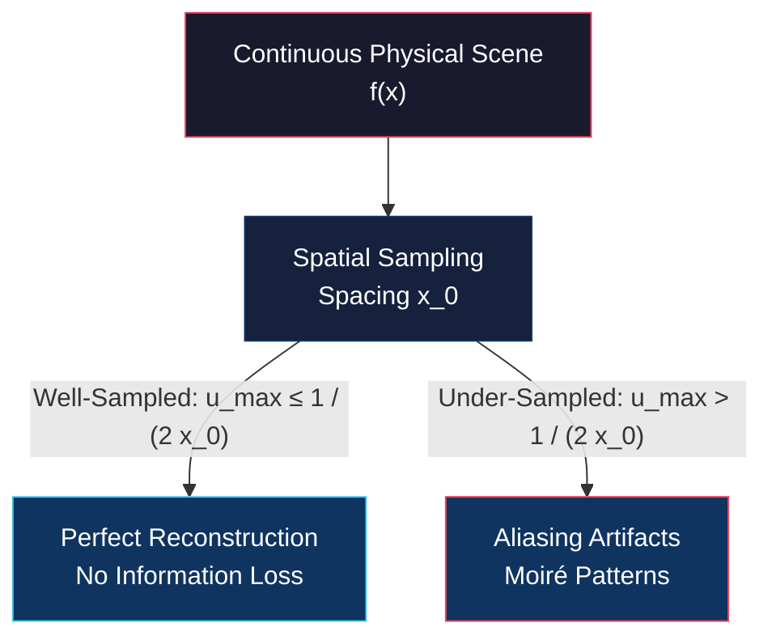
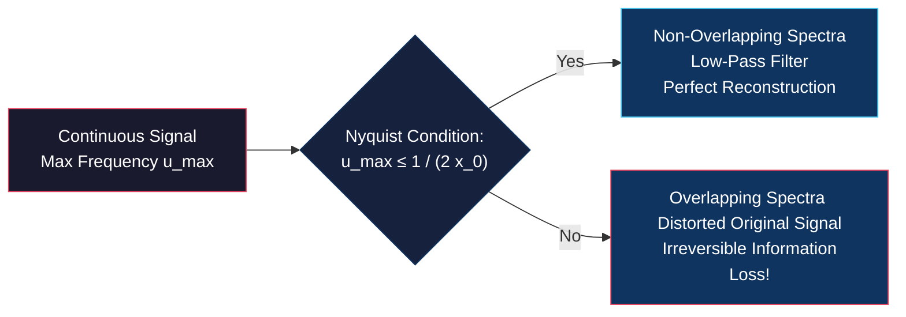

# Sampling Theory and Aliasing

<!-- toc -->

## 1. Digitization and the Sampling Problem

Converting a continuous physical scene into a digital image requires spatial **sampling**—discretizing continuous space into a grid of pixel intensity samples. This poses a fundamental engineering question: *How densely must we place pixels to preserve all visual information from a continuous scene without any loss?*

<figure style="display:flex; justify-content: center; margin: 20px 0;">
  

    
    <figcaption style="margin-top: 0.5em; text-align: center; font-size: 13px; color: #888;"><em>Continuous spatial signal $f(x)$ vs. digital signal $f_s(x)$ sampled via discrete delta impulses</em></figcaption>
  

</figure>

### 1.1 Under-Sampling and Information Loss
If a high-frequency continuous signal (a fast-oscillating sinusoid) is sampled too coarsely:
* Connecting the discrete sample points via linear interpolation produces either a completely flat line or an entirely spurious low-frequency sinusoid that never existed in the original continuous scene.
* The creation of false, low-frequency artifacts caused by inadequate spatial sampling is called **Aliasing**.

<figure style="display:flex; justify-content: center; margin: 20px 0;">
  

    
    <figcaption style="margin-top: 0.5em; text-align: center; font-size: 13px; color: #888;"><em>Sampling low vs. high frequency signals: Under-sampling high frequencies generates spurious low frequencies (Aliasing).</em></figcaption>
  

</figure>

### 1.2 Visual Manifestation: Moiré Patterns
In digital photography and computer vision, aliasing manifests visually as **Moiré Patterns**—spurious wavy bands, ripples, or rainbow halos appearing on fine repetitive structures such as brick walls, pinstriped shirts, or tight radial grids.

<figure style="display:flex; justify-content: center; margin: 20px 0;">
  

    
    <figcaption style="margin-top: 0.5em; text-align: center; font-size: 13px; color: #888;"><em>Well-sampled image (left) vs. under-sampled image exhibiting wavy Moiré pattern artifacts (right)</em></figcaption>
  

</figure>

---

## 2. Mathematical Model of Sampling (Shah Function)

Mathematically, sampling a continuous 1D signal $f(x)$ at regular spatial intervals $x_0$ is modeled as multiplying $f(x)$ by an infinite train of Dirac delta functions, known as the **Shah Function** (or impulse train) $s(x)$.

<figure style="display:flex; justify-content: center; margin: 20px 0;">
  

    
    <figcaption style="margin-top: 0.5em; text-align: center; font-size: 13px; color: #888;"><em>Continuous signal $f(x)$ multiplied by Shah function $s(x)$ yielding sampled signal $f_s(x) = f(x)s(x)$</em></figcaption>
  

</figure>

$$s(x) = \sum_{n=-\infty}^{\infty} \delta(x - n x_0)$$

The sampled signal $f_s(x)$ is defined as:

$$f_s(x) = f(x) \cdot s(x) = f(x) \sum_{n=-\infty}^{\infty} \delta(x - n x_0)$$

### 2.1 Fourier Transform of the Shah Function
The Fourier Transform of a spatial Shah function with period $x_0$ is another Shah function in the frequency domain with spacing $\frac{1}{x_0}$:

$$\mathcal{F}\{s(x)\} = S(u) = \frac{1}{x_0} \sum_{n=-\infty}^{\infty} \delta\left(u - \frac{n}{x_0}\right)$$

<figure style="display:flex; justify-content: center; margin: 20px 0;">
  

    
    <figcaption style="margin-top: 0.5em; text-align: center; font-size: 13px; color: #888;"><em>Spatial Shah function $s(x)$ (spacing $x_0$) and its frequency counterpart $S(u)$ (spacing $1/x_0$)</em></figcaption>
  

</figure>

### 2.2 Sampling in Frequency Domain (Convolution Theorem)
By the Convolution Theorem, **multiplication** in the spatial domain corresponds to **convolution** in the frequency domain:

$$\mathcal{F}\{f_s(x)\} = F_s(u) = F(u) * S(u)$$

$$F_s(u) = F(u) * \left[ \frac{1}{x_0} \sum_{n=-\infty}^{\infty} \delta\left(u - \frac{n}{x_0}\right) \right] = \frac{1}{x_0} \sum_{n=-\infty}^{\infty} F\left(u - \frac{n}{x_0}\right)$$

<figure style="display:flex; justify-content: center; margin: 20px 0;">
  

    
    <figcaption style="margin-top: 0.5em; text-align: center; font-size: 13px; color: #888;"><em>Convolution of band-limited spectrum $F(u)$ with impulse train $S(u)$ ($F_s(u) = F(u) * S(u)$)</em></figcaption>
  

</figure>

> **Key Insight: Periodic Spectrum Replication**  
> Spatial sampling replicates the original continuous frequency spectrum $F(u)$ infinitely along the frequency axis at steps of $\frac{1}{x_0}$.

---

## 3. Nyquist-Shannon Sampling Theorem

The fundamental cornerstone of digital signal processing and computer vision—the **Nyquist-Shannon Sampling Theorem**—defines the exact condition required for perfect signal reconstruction without information loss.

### 3.1 Theorem Statement
To recover a band-limited continuous signal with maximum frequency $u_{\max}$ without error, the spatial sampling interval $x_0$ must satisfy:

$$u_{\max} \le \frac{1}{2 x_0} \quad \iff \quad \frac{1}{x_0} \ge 2 u_{\max}$$

* **Nyquist Frequency ($u_N = \frac{1}{2x_0}$):** The maximum spatial frequency that can be represented unambiguously by a pixel grid of spacing $x_0$.
* **Nyquist Rate ($2 u_{\max}$):** The minimum sampling frequency required to digitize a continuous signal losslessly.

<figure style="display:flex; justify-content: center; margin: 20px 0;">
  

    
    <figcaption style="margin-top: 0.5em; text-align: center; font-size: 13px; color: #888;"><em>When $u_{\max} \le \frac{1}{2x_0}$, spectral replicas ($F_s(u)$) repeat without overlapping.</em></figcaption>
  

</figure>

### 3.2 Spectral Overlapping (Aliasing in Frequency Domain)
If sampling is inadequate ($u_{\max} > \frac{1}{2x_0}$), adjacent spectral replicas spaced by $\frac{1}{x_0}$ overlap.

<figure style="display:flex; justify-content: center; margin: 20px 0;">
  

    
    <figcaption style="margin-top: 0.5em; text-align: center; font-size: 13px; color: #888;"><em>When $u_{\max} > \frac{1}{2x_0}$, adjacent spectra overlap, corrupting original frequency content (Aliasing).</em></figcaption>
  

</figure>

High-frequency components fold back across the Nyquist frequency boundary and masquerade as false low-frequency energy. Once aliasing occurs, isolating the original spectrum $F(u)$ becomes mathematically impossible.

---

## 4. Signal Reconstruction (Perfect Recovery)

When the Nyquist condition is met ($u_{\max} \le \frac{1}{2x_0}$), the original spectrum $F(u)$ is isolated from periodic replicas $F_s(u)$ using an ideal **Low-Pass Reconstruction Filter** $C(u)$ (a boxcar function):

$$C(u) = \begin{cases} x_0 & \text{if } |u| < \frac{1}{2x_0} \\ 0 & \text{otherwise} \end{cases}$$

$$F(u) = F_s(u) \cdot C(u)$$

<figure style="display:flex; justify-content: center; margin: 20px 0;">
  

    
    <figcaption style="margin-top: 0.5em; text-align: center; font-size: 13px; color: #888;"><em>Isolating the central spectrum via boxcar filter $C(u)$ and computing IFT to recover continuous signal $f(x)$</em></figcaption>
  

</figure>

In the spatial domain, the frequency boxcar function $C(u)$ corresponds to a **Sinc** function:

$$c(x) = \mathcal{F}^{-1}\{C(u)\} = \text{sinc}\left(\frac{x}{x_0}\right)$$

$$f(x) = f_s(x) * c(x) = \sum_{n=-\infty}^{\infty} f(n x_0) \cdot \text{sinc}\left(\frac{x - n x_0}{x_0}\right)$$

This formula (the Whittaker-Shannon Interpolation Formula) proves that a continuous signal can be reconstructed perfectly from discrete samples using **Sinc Interpolation**.

---

## 5. Anti-Aliasing Techniques

Real-world optical scenes contain sharp boundaries and fine textures with infinitely high frequency components. Thus, no physical image sensor can satisfy the strict Nyquist condition natively without pre-filtering.

<figure style="display:flex; justify-content: center; margin: 20px 0;">
  

    
    <figcaption style="margin-top: 0.5em; text-align: center; font-size: 13px; color: #888;"><em>Natural scene power spectrum and Moiré pattern artifacts caused by frequencies exceeding sensor Nyquist limit</em></figcaption>
  

</figure>

Digital camera systems employ two hardware strategies to prevent aliasing:

### 5.1 Physical Sensor Strategies

<figure style="display:flex; justify-content: center; margin: 20px 0;">
  

    
    <figcaption style="margin-top: 0.5em; text-align: center; font-size: 13px; color: #888;"><em>Two sensor anti-aliasing strategies: Area-integrating pixel photodiode cells (left) and Optical Low-Pass Filter / OLPF (right)</em></figcaption>
  

</figure>

1. **Pixel Integration Area (Box-Averaging Filter):** Sensor pixels are non-zero area photodiodes rather than mathematical point samplers. Light hitting a pixel surface is integrated over its finite area, acting as a spatial box filter that naturally attenuates ultra-high frequencies.
2. **Optical Low-Pass Filter (OLPF / Anti-Aliasing Filter):** A thin birefringent crystal layer positioned directly in front of the image sensor. It blurs the incoming optical image slightly before light reaches the photodiode array. By attenuating spatial frequencies above the Nyquist limit ($u_N = \frac{1}{2x_0}$), it prevents the generation of Moiré artifacts.
