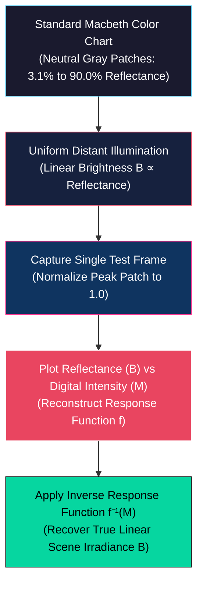
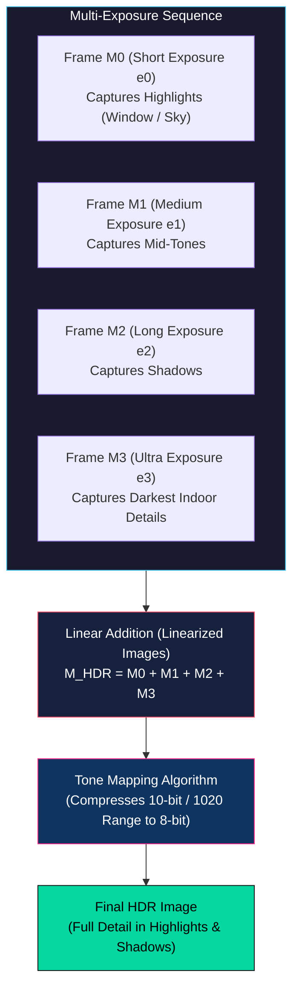
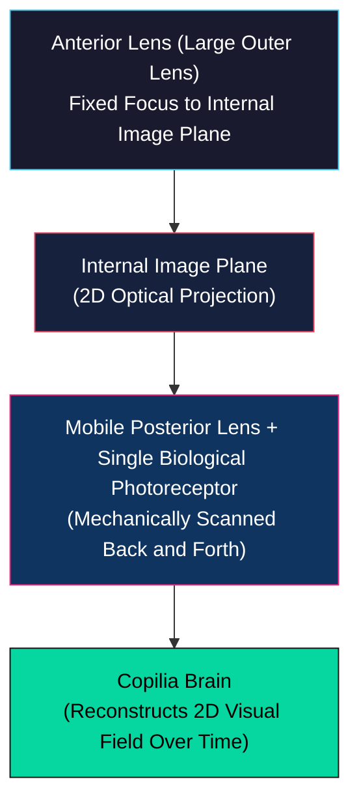

# Camera Response, HDR Imaging, and Nature's Sensors

<!-- toc -->

## 1. Camera Response Function and Radiometric Calibration

While the relationship between the physical photon flux and the generated sensor charge is highly linear, consumer cameras output non-linear pixel intensities.

### 1.1 The Camera Response Function ($f$)

When light strikes a sensor pixel, the relationship between scene brightness and measured image intensity is guaranteed to be monotonic, but is rarely linear.

#### Linear Exposure ($B$)
The raw intensity $B$ inside the pixel is strictly linear with respect to the incoming photon flux $I$ and the total exposure $e$. Exposure is the product of the aperture area $A$ (related to diameter $D$) and the integration time $T$:

$$B = I \times e = I \times (A \times T)$$

#### Electronic Modulation
Before being outputted as a digital measurement $M$, this linear charge $B$ undergoes electron-to-voltage conversion, Analog-to-Digital conversion (ADC), and several digital image signal processing (ISP) operations (such as demosaicing, sharpening, and contrast enhancement).

#### Non-Linear Squeezing (Gamma Curve)
Camera manufacturers intentionally introduce a non-linear mapping function $f$ (known as the Gamma Curve or Gamma Function):

$$M = f(B)$$

> **The Squeezing Principle:** Because digital image formats have a finite dynamic range (typically 8 bits per channel, 0 to 255), mapping linear intensities directly would waste precious numerical bits on bright highlights that the human eye cannot easily distinguish. Instead, $f$ compresses the bright, high-intensity regions (like clouds in the sky) while dedicating much higher numerical resolution to darker values, preserving critical shadow details.

<figure style="display:flex; justify-content: center; margin: 20px 0;">
  

    
    <figcaption style="margin-top: 0.5em; text-align: center; font-size: 13px; color: #888;"><em>A comparison of non-linear camera response functions, often referred to as gamma curves, for various consumer and professional imaging sensors.</em></figcaption>
  

</figure>

### 1.2 Radiometric Calibration

For many quantitative computer vision applications (such as photometric stereo or shape from shading), the true linear scene irradiance must be recovered from the non-linear pixel values $M$. The process of finding and inverting this non-linear function $f$ is called **radiometric calibration**.

#### Calibration Steps Using a Macbeth Chart
1. **Chart Selection:** A standard Macbeth Chart contains a bottom row of neutral gray patches with precisely known physical reflectance values, spanning from 3.1% (dark patch) to 90.0% (bright patch).
2. **Uniform Illumination:** The chart is illuminated using distant light sources, ensuring a perfectly uniform illumination over the entire surface.
3. **Reflectance Proportionality:** Because illumination is constant, the true linear image brightness $B$ of each gray patch is directly proportional to its known physical reflectance, scaled by an unknown constant factor $k$ (which depends on light source intensity, camera gain, etc.):
   $$B \propto \text{Reflectance}$$
4. **Plotting and Inversion:** A single image of the chart is captured. The brightest patch's linear intensity is normalized to 1.0 to eliminate the unknown scale factor $k$.
5. **Curve Reconstruction:** By plotting the known linear reflectances on the x-axis ($B$) and the measured digital pixel values on the y-axis ($M$), we reconstruct the camera's response curve $f$.

Once $f$ is calibrated, we can linearize any subsequent image captured by the camera by passing the pixels through the inverse function $f^{-1}$, recovering true scene brightness up to a single scale factor:

$$B = f^{-1}(M)$$

<figure style="display:flex; justify-content: center; margin: 20px 0;">
  

    
    <figcaption style="margin-top: 0.5em; text-align: center; font-size: 13px; color: #888;"><em>The radiometric calibration process maps measured pixel values to known surface reflectance values of a Macbeth chart to linearize the camera's response.</em></figcaption>
  

</figure>

---

## 2. High Dynamic Range (HDR) Imaging

Real-world environments exhibit an enormous range of light intensities that far exceed the 72 dB dynamic range of consumer sensors.

### 2.1 Exposure Bracketing

Exposure bracketing combines multiple frames of a static scene captured at different integration times to synthesize an image with a wider dynamic range.

#### Multi-Exposure Sequence
The camera captures a sequence of pictures with varying exposure times $e_0 < e_1 < e_2 < e_3$.

#### Mathematical Slices
For a scene point with true brightness $P$, the measured value in frame $i$ is capped at the sensor's maximum saturation limit of 255:

$$M_i = \min(e_i \cdot P,\ 255)$$

- **Short Exposure ($e_0$):** Prevents highlights (such as a bright sky or window) from saturating, but leaves shadows completely black and noisy.
- **Long Exposure ($e_3$):** Floods the sensor with photons, capturing details in dark indoor shadows, but completely washes out and saturates outdoor regions.

<figure style="display:flex; justify-content: center; margin: 20px 0;">
  

    
    <figcaption style="margin-top: 0.5em; text-align: center; font-size: 13px; color: #888;"><em>Multi-exposure bracketing captures a sequence of images at different exposure times to record details in both the highlight and shadow regions of a high dynamic range scene.</em></figcaption>
  

</figure>

#### Linear Addition
Assuming the camera response has been linearized ($f^{-1}$ applied), we sum these four exposures to generate an aggregate image:

$$M_{\text{HDR}} = M_0 + M_1 + M_2 + M_3$$

The combined response function of this aggregate virtual camera compresses high scene intensities while maintaining high sensitivity in dark regions, yielding a maximum numerical value of 1020 ($4 \times 255$).

#### Tone Mapping
A tone mapping algorithm compresses this high-fidelity 10-bit output back down to standard 8-bit display formats, rendering both indoor shadows and outdoor skies with rich detail.

<figure style="display:flex; justify-content: center; margin: 20px 0;">
  

    
    <figcaption style="margin-top: 0.5em; text-align: center; font-size: 13px; color: #888;"><em>The aggregate response of bracketed exposures produces a high dynamic range image that is tone-mapped to compress the dynamic range for standard displays while preserving details.</em></figcaption>
  

</figure>

> **The Ghosting Artifact:** Exposure bracketing works exceptionally well for static scenes but fails in dynamic environments. If an object (such as a bicyclist or pedestrian) moves during the multi-exposure capture sequence, it is recorded at different spatial coordinates in each frame. Adding these frames results in semi-transparent, duplicated overlapping copies in the final image, known as **ghosting**.

### 2.2 Single-Shot HDR via Assorted Pixels

To capture HDR images of moving objects without ghosting, the entire dynamic range must be recorded in a single exposure. This is achieved using spatially varying pixel exposures (SVE), commonly referred to as **Assorted Pixels**.

- **Pixel-Level Sensitivity Modulation:** Instead of a uniform sensor where all pixels have identical sensitivity, an assorted pixel sensor features adjacent photodiodes with unequal light sensitivities.
- **Optomechanical Implementation:** This spatial variation is implemented by depositing micro-shades of varying optical transparencies directly over adjacent pixels or driving neighboring pixels with different integration times.
- **Spatial Interpolation Pipeline:**
  - If a highly sensitive pixel saturates (clips to 255) under bright light, its less-sensitive (shaded) neighbor will not saturate and will successfully record the highlight detail.
  - If a shaded pixel is too dark, its unshaded neighbor will capture clean, high-SNR details in the shadows.
  - An interpolation algorithm then processes this patterned checkerboard image, predicting missing high-exposure and low-exposure values from neighboring pixels.
- **Result:** This single-shot HDR architecture produces full-color, high-contrast images with no motion artifacts and is widely used in modern smartphone camera modules.

<figure style="display:flex; justify-content: center; margin: 20px 0;">
  

    
    <figcaption style="margin-top: 0.5em; text-align: center; font-size: 13px; color: #888;"><em>The assorted pixel architecture utilizes adjacent photodetecting sites with varying sensitivities or exposure times to capture high dynamic range data in a single shot.</em></figcaption>
  

</figure>

---

## 3. Nature's Image Sensors and Biological Vision

Over millions of years of evolution, nature has engineered visual systems that solve complex sensing challenges with elegant, non-traditional configurations.

### 3.1 Copilia's Mechanical Scanning Eye

The marine crustacean *Copilia* (a microscopic plankton-like creature) possesses an eye that operates as an optomechanical scanner.

- **Optics:** Each eye contains two lenses. A large, static outer anterior lens focuses light to form a two-dimensional image inside the head.
- **Mechanical Scanning:** Positioned behind this image plane is a mobile posterior lens paired with a single biological photoreceptor (a single-pixel sensor).
- **Operation:** Instead of utilizing a dense grid of millions of receptors, *Copilia* mechanically scans this posterior lens-receptor assembly back and forth across the anterior lens's focal plane. By scanning the single pixel spatially over time, *Copilia*'s brain reconstructs a complete two-dimensional image of its environment.

### 3.2 Brittle Star (*Ophiocoma wendtii*): The Lens-Covered Body

<figure style="display:flex; justify-content: center; margin: 20px 0;">
  

    
    <figcaption style="margin-top: 0.5em; text-align: center; font-size: 13px; color: #888;"><em>A scanning electron microscope image showing the array of calcitic microlenses covering the body of the brittle star, functioning as a distributed, flexible eye.</em></figcaption>
  

</figure>

The Brittle Star (*yılan yıldızı*) is a marine creature with no brain and no traditional focal eyes. For decades, biologists were puzzled by its ability to navigate complex crevices and evade predators.

- **The Discovery:** Around 2001, scanning electron microscopy revealed that the entire calcitic skeletal body of the brittle star is covered with millions of tiny, highly transparent calcite crystal bumps.
- **Optical Precision:** Each crystal bump is an optically perfect microlens, measuring approximately 1/20 of a millimeter in diameter.
- **The Flexible Camera:** These calcitic microlenses focus light onto a bundle of nerve fibers running directly underneath them. The brittle star's entire skeletal body effectively functions as a massive, flexible, curved image sensor, allowing it to perceive spatial distributions of light and shadow across its entire body.

### 3.3 Octopus Camouflage and Chromatophores

The skin of the octopus is a dynamic biological display and sensor array.

- **Chromatophores:** The skin contains millions of microscopic pigment-filled sacs called chromatophores.
- **Neural Control:** These sacs are directly controlled by surrounding muscle fibers. When the brain sends a neural impulse, the muscles contract or expand, changing the physical shape and surface area of the pigment sacs.
- **Camouflage:** By precisely modulating which colors are exposed, the octopus can match the texture, color, and reflectance of surrounding coral reefs or plants. This real-time camouflage is so perfect that the octopus remains completely invisible to predators even at close distances.

### 3.4 The Human Eye Blind Spot

In the human eye, the biological wiring of the retina creates a unique optical defect.

- **The Optic Disk:** All nerve impulses generated by the rods and cones travel along axons that gather at a single point on the retina: the optic disk.
- **Zero Receptor Density:** At this exit point, the optic nerve passes through the retinal layer to travel to the visual cortex of the brain. Because the nerve occupies this space, there is a physical patch on the retina that is completely devoid of rods and cones. This is the **blind spot**.

> **Neural Inpainting:** We do not notice a physical hole in our daily field of view because our brain performs real-time spatial "inpainting" (interpolation), filling in missing visual information based on surrounding texture, color, and context.
