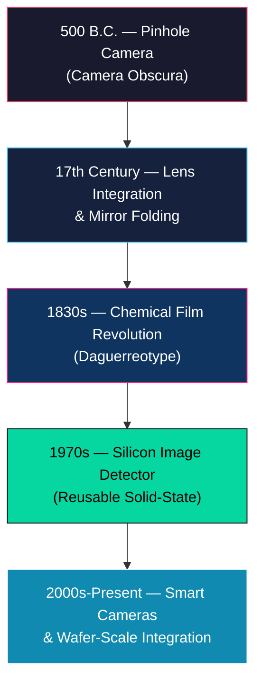
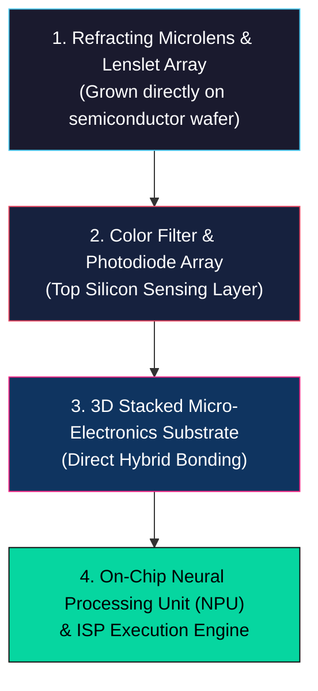
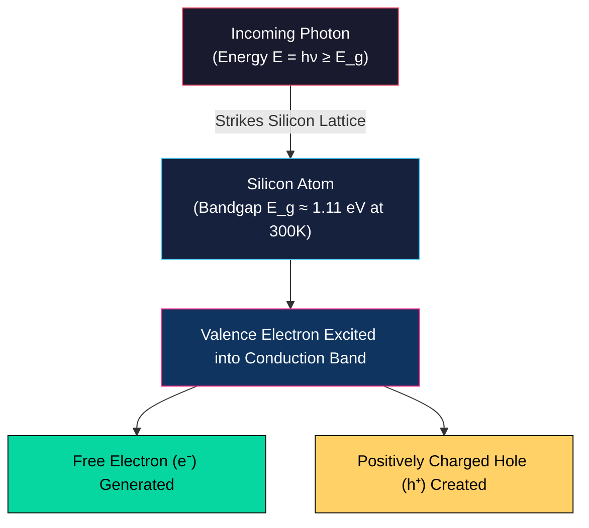
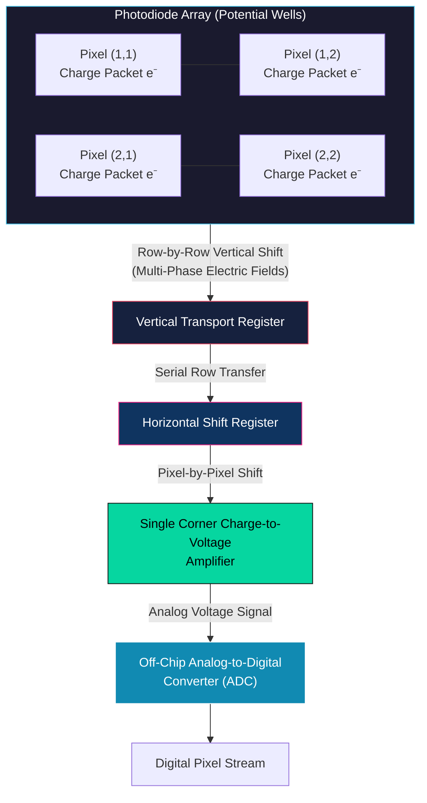
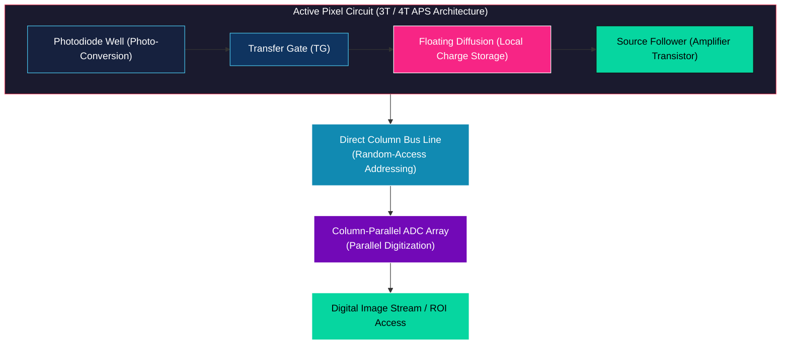
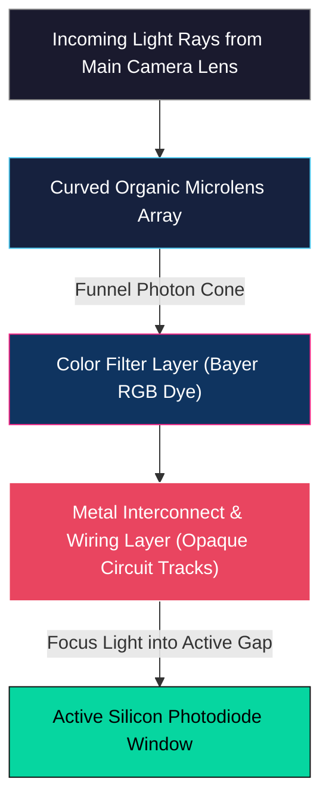

# Overview, History, and Image Sensor Types

<!-- toc -->

## 1. Overview

Image sensing is the physical process of capturing electromagnetic radiation (light) emitted or reflected by a three-dimensional (3D) scene and converting it into a persistent, measurable two-dimensional (2D) representation. While optics (lenses and apertures) govern the *geometry* of projection, image sensing governs the *photometric conversion* — mapping incoming photon flux into measurable physical changes, such as chemical reduction in film or electrical charge in solid-state silicon.

Understanding the evolution and physics of image sensors is fundamental to computer vision: every algorithm operating on digital pixels implicitly relies on the optoelectronic properties, sampling limits, dynamic range, and noise characteristics of the underlying sensor architecture.

> **Key Insight:** Optics determine *where* light rays land on a plane; sensing determines *how* photon energy is transduced into countable signals (charges or voltages).

---

## 2. A Brief History of Imaging

The journey of capturing light and projecting the physical world onto a two-dimensional surface spans centuries of scientific and artistic evolution, moving from passive optical projection to chemical storage, and ultimately to digital silicon architectures.

### 2.1 The Pinhole Camera (Camera Obscura)

The foundational concept of image formation dates back to 500 B.C., documented by Chinese philosophers who wrote about the principles of the pinhole camera. Around 1000 A.D., Arabian scholar Ibn al-Haytham (Alhazen) analyzed the optical properties and geometric projection of the pinhole camera in rigorous detail.

It was not until the 16th century that the concept gained widespread popularity in the West, particularly among artists. As illustrated in the 1544 sketch by Dutch mathematician Gemma Frisius:
1. A minuscule pinhole in a dark room's wall projects a 3D scene onto an opposing flat wall, creating an inverted 2D image.
2. An artist could step into the camera obscura loop, trace the projected image on the wall, and generate geometrically accurate perspective drawings of the 3D scene.

> **Optics Limitation:** While a pinhole camera produces sharp images across infinite depths, its aperture is mathematically tiny, collecting very few photons. The resulting projected images are extremely dim and require dark adaptation to observe.

### 2.2 Lens and Mirror Integration

To resolve the photon starvation of the pinhole, 17th-century designers replaced the tiny pinhole with a refractive convex lens. The lens successfully focused a significantly larger cone of light, producing dramatically brighter projections.

During the 18th century, optomechanical designs prioritized artist ergonomics:
- The vertical light cone projected by the lens was folded by a $45^\circ$ mirror.
- This redirected the light upward onto a horizontal, translucent sheet of tracing paper.
- The artist could sit comfortably, look downward, and trace the scene — establishing the optomechanical layout that later inspired the Single-Lens Reflex (SLR) viewfinder.

<figure style="display:flex; justify-content: center; margin: 20px 0;">
  

    
    <figcaption style="margin-top: 0.5em; text-align: center; font-size: 13px; color: #888;"><em>18th Century Box Camera Obscura: An optomechanical design using a 45-degree folding mirror to project images onto tracing paper.</em></figcaption>
  

</figure>

### 2.3 The Chemical Film Revolution

The most profound cultural leap in imaging occurred in the 1830s with Louis Daguerre’s co-invention of the **Daguerreotype camera**. Still-life photographs taken in 1837 demonstrated that a scene could be physically recorded on a permanent chemical medium with a single button press, completely removing the human artist from the capture loop.

<figure style="display:flex; justify-content: center; margin: 20px 0;">
  

    
    <figcaption style="margin-top: 0.5em; text-align: center; font-size: 13px; color: #888;"><em>Louis Daguerre - Still Life (1837): One of the earliest permanent chemical photographic captures in human history.</em></figcaption>
  

</figure>

#### Chemical Process of Black-and-White Film
1. **Emulsion:** Film is coated with a microscopic layer of light-sensitive silver halide crystals ($\text{AgX}$, where $\text{X} = \text{Br, Cl, I}$).
2. **Exposure:** Photon absorption triggers localized reduction of silver ions to metallic silver:
   $$\text{Ag}^+ + e^- \xrightarrow{h\nu} \text{Ag}^0$$
   The total exposure energy $E$ obeys the reciprocity law:
   $$\text{Exposure } (E) \propto \text{Irradiance } (I) \times \text{Integration Time } (T)$$
3. **Development:** A chemical bath amplifies this latent metallic silver image, forming a stable, high-resolution photographic negative.

#### Transition to Color Film (1880s)
Capturing the full visible spectrum required sophisticated multi-layer chemistry. In 1887, Louis Ducos du Hauron captured early color photographs by stacking three separate emulsions with dye couplers containing Red, Green, and Blue pigments. 

<figure style="display:flex; justify-content: center; margin: 20px 0;">
  

    
    <figcaption style="margin-top: 0.5em; text-align: center; font-size: 13px; color: #888;"><em>Louis Ducos du Hauron - View of Angoulême (1877/1887): Early color landscape photograph captured with multi-layer RGB emulsions.</em></figcaption>
  

</figure>

By the 1920s, consumer cameras like the Ernemann camera entered mass production with slogans like *"What you can see, you can photograph,"* establishing visual recording as a ubiquitous medium of human expression.

<figure style="display:flex; justify-content: center; margin: 20px 0;">
  

    
    <figcaption style="margin-top: 0.5em; text-align: center; font-size: 13px; color: #888;"><em>Ernemann Folding Plate Camera: Iconic 1920s consumer camera advertised with "What you can see, you can photograph."</em></figcaption>
  

</figure>

### 2.4 The Silicon Image Detector (Silicon Detector)

While chemical film revolutionized visual culture, its fundamental limitation was its single-use consumable nature. In the 1970s, the invention of the silicon image detector fundamentally shifted the paradigm:

- Unlike chemical film, a silicon sensor is a **reusable solid-state device** capable of capturing an infinite sequence of images without chemical processing.
- It took nearly 20 years (until the early 1990s) for silicon manufacturing to mature to consumer viability, yielding early consumer digital cameras such as the Nikon COOLPIX.
- Early digital devices captured resolutions around $640 \times 480$ pixels ($\approx 0.3\text{ MP}$), consumed substantial power, and lacked fast storage, but definitively proved the viability of digital image processing.

### 2.5 Smartphone Cameras and AI Catalysis

The late 20th and early 21st centuries saw the integration of camera modules into mobile phones, driving unprecedented miniaturization and optical engineering.

- The launch of smartphones in 2007 catalyzed a second digital camera revolution.

<figure style="display:flex; justify-content: center; margin: 20px 0;">
  

    
    <figcaption style="margin-top: 0.5em; text-align: center; font-size: 13px; color: #888;"><em>Apple iPhone 1 (2007) Rear View: The milestone of mobile camera miniaturization that catalyzed modern computer vision.</em></figcaption>
  

</figure>

- This explosion of mobile cameras birthed global visual communication platforms and generated petabytes of daily image data.
- Crucially, this massive influx of digital imagery served as the core dataset and computational catalyst for modern computer vision and deep learning algorithms.

### 2.6 Century-Scale Comparison: Kodak Brownie vs. Modern Smartphone Camera

| Specification / Feature | Kodak Brownie Model 1 (1900) | Modern Smartphone Camera Module |
| :--- | :--- | :--- |
| **Retail Price** | $1.00 USD (Approx. $30.00 adjusted) | Highly optimized mass-production cost |
| **Optics Geometry** | Single spherical glass lens element | Multi-element, ultra-thin molded aspherical plastic/glass lenses |
| **Focusing Mechanism** | Fixed-focus system (no adjustment) | Dynamic autofocus via micro voice coil motor (VCM) with micron precision |
| **Aperture Control** | Slide-in metal plate with discrete holes | Miniaturized micro-diaphragm arrays or fixed low F-number apertures ($f/1.5 - f/1.8$) |
| **Viewfinder & Feedback** | Small reflective corner mirror (no sensor feed) | Real-time digital display showing live electronic sensor feed |
| **Medium / Latency** | Silver halide roll film; mailing required; weeks of latency | Silicon sensor; on-board ISP; instant visualization and zero-shutter-lag capture |

### 2.7 Future Outlook: Wafer-Scale Integration

The next paradigm shift in sensor design involves **Optics-on-Wafer** and **3D-Stacked Sensor** technology:

- Instead of mounting separate molded plastic lenses over a finished sensor, refracting lens elements are grown directly on top of the silicon wafer at the semiconductor foundry.
- 3D stacked electronics are fabricated directly into the silicon substrate beneath the sensing layer.
- This places the Image Sensor, Color Filter, Microlenses, and digital micro-neural processors on a single unified chip — transitioning the camera from a passive capture device into an autonomous single-chip vision system.

---

## 3. Types of Image Sensors and Solid-State Physics

### 3.1 The Physics of Silicon Photo-Conversion

The fundamental mechanism of digital image sensing relies on the optoelectronic properties of crystalline silicon ($\text{Si}$).

<figure style="display:flex; justify-content: center; margin: 20px 0;">
  

    
    <figcaption style="margin-top: 0.5em; text-align: center; font-size: 13px; color: #888;"><em>Silicon Photo-Conversion Physics: Photon striking silicon atom, exciting a valence electron and creating an electron-hole pair.</em></figcaption>
  

</figure>

1. **Bandgap Energy ($E_g$):** The bandgap of silicon is approximately $E_g \approx 1.11\text{ eV}$ at room temperature ($300\text{ K}$). When an incoming photon with energy $E = h\nu \ge E_g$ strikes the silicon lattice, it excites a valence electron across the bandgap into the conduction band.
2. **Electron-Hole Pair Generation:** This excitation creates a free conduction electron ($e^-$) and leaves behind a positively charged vacancy (hole, $h^+$).
3. **Quantum Equilibrium:** Under continuous illumination, a steady state is established between incoming photon flux and generated electron flux. Measuring this accumulated electron charge allows us to quantify the light intensity striking that specific spatial coordinate:
   $$Q = \int_{0}^{T} \frac{\eta \cdot q \cdot P(t)}{h\nu} \, dt$$
   where $\eta$ is quantum efficiency, $q$ is electron charge, $P(t)$ is optical power, and $T$ is integration time.

> **Engineering Challenge:** Silicon performs the optical-to-electrical conversion natively. The primary engineering challenge is reading out these delicate, localized packets of electrons across millions of pixels without introducing noise, signal degradation, or cross-talk.

### 3.2 Miniaturization Limits and Moore's Law

Modern high-density sensors pack tens of megapixels into tiny mobile formats, with individual pixel pitches as small as $1.25\ \mu\text{m}$ or below. However, pixel scaling cannot follow Moore's Law indefinitely due to fundamental optical diffraction limits:

- **Visible Wavelength Spectrum:** Visible light ranges from $\lambda \approx 400\text{ nm}$ (violet) to $\lambda \approx 700\text{ nm}$ (red).
- **The Diffraction Limit:** When a pixel's physical dimension $d$ shrinks to approximately half a micrometer ($d \approx 0.5\ \mu\text{m}$), it approaches the wavelength of light:
  $$d_{\text{limit}} \approx \frac{\lambda}{2}$$
- Below this boundary, optical diffraction dominates. Light waves bend around pixel aperture boundaries, causing severe spatial optical cross-talk between adjacent pixels and preventing any further increase in spatial resolution.

> **Key Takeaway:** To increase resolution beyond diffraction limits, sensor designers must scale the physical area of the silicon chip itself rather than shrinking individual photo-sites.

### 3.3 CCD (Charge Coupled Device) Architecture

Introduced in 1969 by Willard Boyle and George E. Smith, the **Charge-Coupled Device (CCD)** acts as an analog shift register.

#### Readout Mechanism: The "Bucket Brigade"
1. **Potential Wells:** Each pixel operates as a potential well (photodiode) that accumulates photo-generated electrons during integration.
2. **Row-by-Row Vertical Shift:** Upon completion of exposure, charges are not converted to voltage at the pixel. Instead, multi-phase clocking voltages applied to electrode gates shift entire rows of charge downward step-by-step into adjacent potential wells.
3. **Horizontal Shift & Amplification:** The bottom row enters a horizontal shift register, which shifts charges horizontally one pixel at a time into a single, high-precision charge-to-voltage amplifier located at the corner of the array.
4. **Digitization:** The corner amplifier converts each charge packet into a voltage signal, which is digitized by an off-chip ADC.

> **Bucket Brigade Analogy:** CCD charge transport resembles a line of firefighters passing buckets of water down a line. Because CCDs use a single output amplifier, they achieve exceptional pixel-to-pixel uniformity and low noise, but suffer from high power consumption, slow readout speeds, and susceptibility to blooming.

<figure style="display:flex; justify-content: center; margin: 20px 0;">
  

    
    <figcaption style="margin-top: 0.5em; text-align: center; font-size: 13px; color: #888;"><em>CCD Charge Transfer "Bucket Brigade": Row-by-row vertical shift and horizontal transfer into a single corner readout amplifier.</em></figcaption>
  

</figure>

### 3.4 CMOS (Complementary Metal-Oxide Semiconductor) Architecture

The **CMOS Active-Pixel Sensor (APS)** represents the dominant modern imaging architecture.

#### Readout Mechanism: Local Conversion & Random Access
- **On-Pixel Charge Conversion:** Unlike CCDs, every individual CMOS pixel contains its own dedicated charge-to-voltage conversion circuitry (typically 3-Transistor or 4-Transistor active pixel design) directly inside the pixel cell.
- **Direct Addressability:** CMOS sensors use row-select and column-readout bus lines, enabling random-access readout similar to system RAM.
- **Region of Interest (ROI):** This architecture allows sensors to read out arbitrary sub-windows (ROIs) at extremely high frame rates while skipping unneeded pixels.

<figure style="display:flex; justify-content: center; margin: 20px 0;">
  

    
    <figcaption style="margin-top: 0.5em; text-align: center; font-size: 13px; color: #888;"><em>CMOS Active-Pixel Readout: Dedicated on-pixel charge-to-voltage amplifier circuit with direct column bus-line random access.</em></figcaption>
  

</figure>

| Architecture Comparison | CCD (Charge-Coupled Device) | CMOS (Active-Pixel Sensor) |
| :--- | :--- | :--- |
| **Charge Conversion** | Off-pixel (Single corner amplifier) | On-pixel (Transistor in every pixel) |
| **Readout Type** | Serial charge transfer ("Bucket Brigade") | Parallel voltage readout (Random access) |
| **Power Consumption** | High (Requires multi-phase high-voltage clocks) | Low (Standard CMOS digital voltage supply) |
| **Readout Speed** | Limited by serial transfer bottleneck | Extremely high (Column-parallel ADCs) |
| **Fill Factor** | $\approx 100\%$ (No on-pixel transistors) | Reduced (Transistor circuitry occupies pixel area) |

### 3.5 Micro-Optics: The Microlens Array

To overcome the fill factor reduction caused by on-pixel transistor circuitry in CMOS sensors, semiconductor manufacturers integrate a **Microlens Array** above the sensor surface.

- **Operation:** A curved organic micro-lenslet is fabricated directly over each pixel.
- **Photon Funneling:** Rather than allowing light rays to strike non-sensitive transistor metal tracks, the microlens collects photons across the entire pixel pitch area and refracts them directly onto the active photodiode area.

<figure style="display:flex; justify-content: center; margin: 20px 0;">
  

    
    <figcaption style="margin-top: 0.5em; text-align: center; font-size: 13px; color: #888;"><em>3D Microlens and Filter Array Model: Organic light-gathering microlenses, Bayer RGB color filters, and silicon photodiode wells.</em></figcaption>
  

</figure>

- **Micro-Layer Stack:** Scanning Electron Microscopy (SEM) reveals a micro-stack height of only $\approx 9.6\ \mu\text{m}$ from the top microlens apex to the silicon substrate:
  1. *Top Layer:* Curved organic microlens array
  2. *Intermediate Layer:* Color filter array (RGB dye)
  3. *Base Layer:* Silicon substrate with photodiode wells, floating diffusion, and metal interconnects.

<figure style="display:flex; justify-content: center; margin: 20px 0;">
  

    
    <figcaption style="margin-top: 0.5em; text-align: center; font-size: 13px; color: #888;"><em>Image Sensor SEM Cross-Section: Scanning Electron Microscopy micrograph revealing the 9.6-micrometer stacked layer structure.</em></figcaption>
  

</figure>
