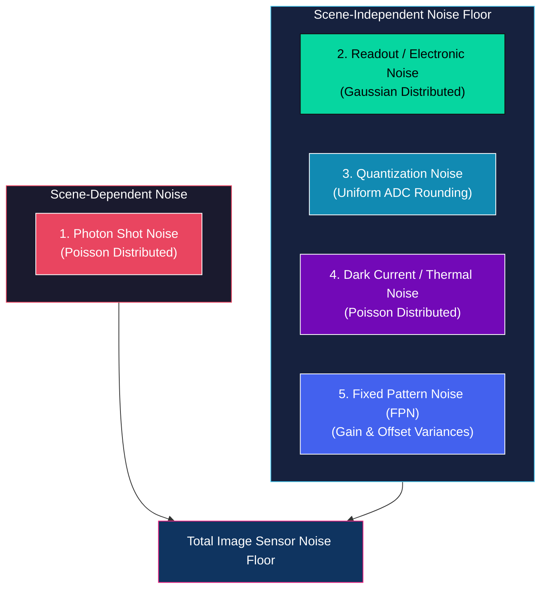
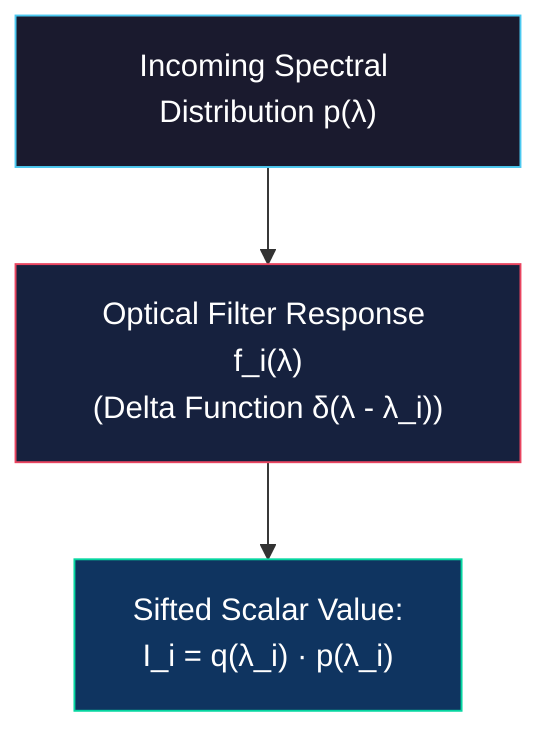
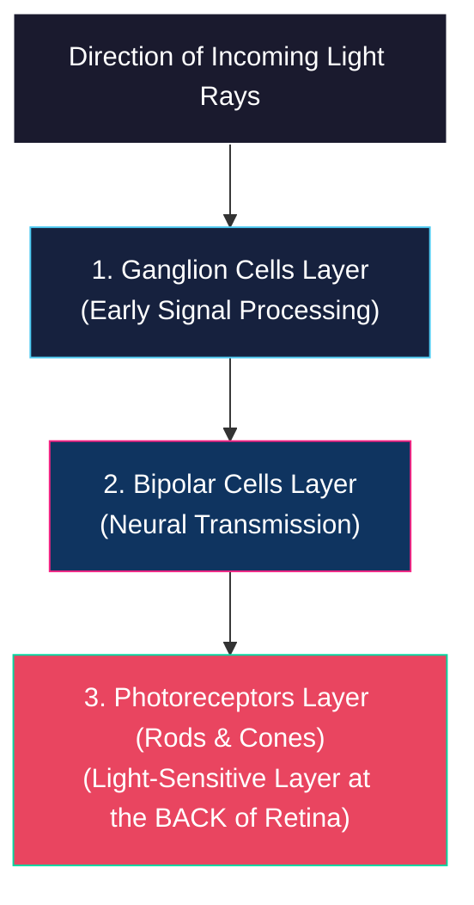
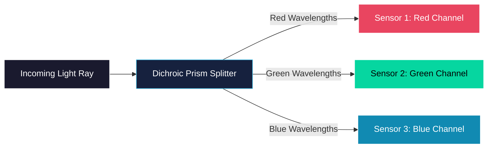

# Resolution, Noise, Dynamic Range, and Color Sensing

<!-- toc -->

## 1. Resolution, Noise, and Dynamic Range

An image sensor's performance is mathematically and physically constrained by its geometric resolution, electronic noise floor, and dynamic range limit. Understanding these parameters is essential for designing robust computer vision pipelines.

### 1.1 Resolution Trends

From the mid-1990s to the early 2010s, sensor resolution underwent rapid growth, shifting from sub-megapixel formats (typically $640 \times 480$ pixels) to standard consumer formats exceeding 16 megapixels. While early sensors suffered from high power draw and severe thermal limitations, modern semiconductor nodes produce low-power, high-density sensors with extremely low noise figures, often yielding resolutions (e.g., 50 megapixels) that exceed the requirements of standard computer vision applications.

> **Key Insight:** Modern sensor manufacturing has largely decoupled pixel density from readout speed, shifting the primary bottleneck in computer vision from spatial resolution to data transmission bandwidth and real-time processing throughput.

### 1.2 Mathematical Formulations of Sensor Noise

Noise represents an unwanted modification of the optical signal introduced during its capture, electronic conversion, digital processing, transmission, or storage. Digital imaging systems suffer from five primary noise sources, categorized as scene-dependent or scene-independent:

#### 1.2.1 Photon Shot Noise (Scene-Dependent)

Photon shot noise arises directly from the quantum and discrete nature of light. Light photons arrive at a pixel's aperture randomly over time, analogous to raindrops falling into a bucket. This arrival sequence is modeled mathematically using the Poisson Distribution:

$$P(k) = \frac{\lambda^k e^{-\lambda}}{k!}$$

<figure style="display:flex; justify-content: center; margin: 20px 0;">
  

    
    <figcaption style="margin-top: 0.5em; text-align: center; font-size: 13px; color: #888;"><em>Photon Noise Poisson Distribution Curves: Probability distributions $P(k)$ for varying mean photon arrival rates $\lambda$.</em></figcaption>
  

</figure>

where:
- $\lambda$ is the expected average photon flux incident on the pixel during the integration period (representing true scene brightness).
- $k$ is the actual number of photons captured during a specific exposure window.

##### Mathematical Property
A fundamental property of the Poisson distribution is that its variance ($\sigma^2$) is equal to its mean ($\lambda$):

$$\text{Var}(\text{Signal}) = \sigma^2 = \lambda$$

$$\text{Standard Deviation } (\sigma) = \sqrt{\lambda}$$

##### Scene Dependence & SNR
Because variance is tied directly to true brightness $\lambda$, shot noise is heavily scene-dependent. Under high-intensity illumination (large $\lambda$), the absolute noise standard deviation increases, but the Signal-to-Noise Ratio (SNR) improves because the signal grows faster than the noise:

$$\text{SNR} = \frac{\text{Signal}}{\text{Noise}} = \frac{\lambda}{\sqrt{\lambda}} = \sqrt{\lambda}$$

##### Gaussian Convergence
For relatively bright regions where $\lambda \ge 10$, the Poisson distribution mathematically converges to a standard symmetric Gaussian curve.

#### 1.2.2 Readout Noise (Scene-Independent)

Readout noise represents the electronic noise introduced during the physical conversion of accumulated photo-electrons into an analog voltage and its subsequent pre-amplification. It is modeled as an additive Gaussian Distribution:

$$P(x) = \frac{1}{\sigma \sqrt{2\pi}} \exp\left( -\frac{(x - \mu)^2}{2\sigma^2} \right)$$

where:
- $\mu$ is the true signal value (mean electron count converted to voltage).
- $\sigma$ is the standard deviation representing the thermal and electronic noise floor of the readout circuitry.

> **Quality Factor:** High-quality scientific sensors feature a narrow Gaussian spread (low $\sigma$), whereas low-cost sensors exhibit a wide spread (high $\sigma$). Readout noise is entirely independent of scene brightness.

<figure style="display:flex; justify-content: center; margin: 20px 0;">
  

    
    <figcaption style="margin-top: 0.5em; text-align: center; font-size: 13px; color: #888;"><em>Readout Electronic Noise Gaussian Distribution: Symmetric Gaussian distribution curve representing sensor pre-amplification noise.</em></figcaption>
  

</figure>

#### 1.2.3 Quantization Noise (Scene-Independent)

Quantization noise occurs when continuous analog voltage is mapped to a discrete integer value during Analog-to-Digital Conversion (ADC).

If the quantization step (the voltage interval between two consecutive digital gray levels) is denoted as $\Delta$, the rounding error is uniformly distributed between $-\frac{\Delta}{2}$ and $+\frac{\Delta}{2}$.

##### Quantization Variance
The variance ($\sigma^2_q$) of this uniform error distribution is given by:

$$\sigma^2_q = \frac{\Delta^2}{12}$$

<figure style="display:flex; justify-content: center; margin: 20px 0;">
  

    
    <figcaption style="margin-top: 0.5em; text-align: center; font-size: 13px; color: #888;"><em>Quantization Noise Step Function: Uniform error rounding distribution between $-\Delta/2$ and $+\Delta/2$ during ADC conversion.</em></figcaption>
  

</figure>

For modern high-performance sensors offering 12-bit to 14-bit intensity resolution, the step size $\Delta$ is extremely small, rendering quantization noise mathematically negligible.

#### 1.2.4 Dark Current / Thermal Noise (Scene-Independent)

Even when the camera lens is covered by a light-tight lens cap, thermal energy within the silicon substrate excites valence electrons into the conduction band, accumulating spurious charge in the potential wells.

- **Characteristics:** This thermally generated dark current follows a Poisson distribution and accumulates linearly over integration time.
- **Relevance:** It is negligible in standard consumer photography due to short exposure times. However, in scientific applications requiring long integrations (e.g., astronomy or extreme low-light imaging), dark current accumulates rapidly, drowning out dim optical signals.
- **Mitigation:** To suppress dark current, scientific cameras are cooled to cryogenic temperatures using liquid nitrogen or thermoelectric Peltier coolers.

<figure style="display:flex; justify-content: center; margin: 20px 0;">
  

    
    <figcaption style="margin-top: 0.5em; text-align: center; font-size: 13px; color: #888;"><em>Dark Current Thermal Noise and Fixed Pattern Noise: Thermal electron accumulation over integration time and spatial FPN pixel variations.</em></figcaption>
  

</figure>

#### 1.2.5 Fixed Pattern Noise (Scene-Independent)

Fixed Pattern Noise (FPN) refers to spatial variations in pixel responses under completely uniform illumination.

- **Origin:** It is caused by unavoidable manufacturing tolerances that result in microscopic differences in potential well capacities, photo-site geometries, and pixel-level amplifier gains.
- **Mitigation:** Unlike random electronic noise, FPN is static over time. It can be calibrated out by capturing a flat-field frame (a uniform grey image), calculating a localized scale-and-offset correction factor for each pixel, and applying these gain factors to all subsequent captured frames.

### 1.3 Dynamic Range (DR)

Dynamic range defines the sensor's capacity to measure extreme contrast variations within a single scene. It is mathematically defined as:

$$\text{DR} = 20 \log_{10} \left( \frac{b_{\max}}{b_{\min}} \right)\ \text{dB}$$

where:
- $b_{\max}$ is the Full-Well Capacity (saturation limit) of the pixel, representing the maximum number of electrons the potential well can hold before saturating. Any additional photons striking a saturated pixel overflow into neighboring pixels (blooming) and do not increase the output value.
- $b_{\min}$ is the Minimum Detectable Photon Energy, determined by the noise floor of the system. If the signal amplitude is lower than the standard deviation of the noise ($\text{Signal} < \sigma_{\text{Noise}}$), the optical signal is mathematically indistinguishable from noise.

#### Comparative Dynamic Range Performance

| Imaging System | Dynamic Range Ratio | Dynamic Range (dB) |
| :--- | :--- | :--- |
| **Human Eye** | 1,000,000 : 1 | 120 dB |
| **High Dynamic Range (HDR) Display** | 200,000 : 1 | 106 dB |
| **Consumer Digital Camera (Still)** | 4,096 : 1 | 72.2 dB |
| **Standard Photographic Film** | 2,948 : 1 | 66.2 dB |
| **Standard Digital Video Camera** | 45 : 1 | 33.1 dB |

> **Video Limitation:** Digital video sensors suffer from heavily compressed dynamic ranges. To maintain standard frame rates (e.g., 30 fps), the maximum integration (exposure) time is limited to a fraction of a second (e.g., $30\text{ ms}$). This brief exposure limits total accumulated photon energy ($b_{\max}$ cannot be reached for mid-tones), reducing the overall SNR while electronic readout noise remains constant.

---

## 2. Sensing Color

Color is not a physical property of light; rather, it is a human psycho-physical and neuro-chemical response to specific electromagnetic wavelengths.

### 2.1 The Mathematics of Spectral Integration

When an incoming light wave carrying a continuous spectral photon distribution $p(\lambda)$ strikes a silicon photodiode, the sensor collapses this continuous spectral curve into a single scalar value representing electron flux.

#### Quantum Efficiency of Silicon ($q(\lambda)$)
The ratio of generated electron flux to incident photon flux as a function of wavelength ($\lambda$) defines silicon's quantum efficiency ($q(\lambda)$):

<figure style="display:flex; justify-content: center; margin: 20px 0;">
  

    
    <figcaption style="margin-top: 0.5em; text-align: center; font-size: 13px; color: #888;"><em>Silicon Quantum Efficiency $q(\lambda)$ Curve: Spectral response curve of silicon showing 1.0 peak at 1000 nm and drop-off below 400 nm.</em></figcaption>
  

</figure>
- **Near-Infrared Peak:** At wavelengths around $\lambda \approx 1000\text{ nm}$, silicon exhibits an almost perfect quantum efficiency of 1.0, meaning nearly every incident photon releases an electron.
- **Ultraviolet Cutoff:** As wavelengths decrease below $400\text{ nm}$, $q(\lambda)$ drops rapidly to zero.
- **Transparency:** Consequently, silicon behaves as a virtually transparent medium for wavelengths above $1000\text{ nm}$ and becomes highly opaque for wavelengths below $400\text{ nm}$.

#### The Integration Equation
For a pixel under continuous illumination from a light source with spectral distribution $p(\lambda)$, the total generated electron flux $I$ is mathematically represented as:

$$I = \int_{0}^{\infty} q(\lambda) p(\lambda) \, d\lambda$$

> **Information Loss:** Because $I$ is a single integrated scalar value, it is mathematically impossible to reconstruct the multi-dimensional spectral curve $p(\lambda)$ from $I$ alone. An infinite variety of distinct spectral curves can yield the exact same scalar value $I$.

<figure style="display:flex; justify-content: center; margin: 20px 0;">
  

    
    <figcaption style="margin-top: 0.5em; text-align: center; font-size: 13px; color: #888;"><em>Visible Wavelength Spectrum Gradient: Continuous spectrum from 400 nm (violet) to 700 nm (red) bounded by UV and IR regions.</em></figcaption>
  

</figure>

### 2.2 Reconstructing the Spectrum via Filter Sifting

To reconstruct the spectral curve $p(\lambda)$, optical filters are integrated in front of the pixel array, with each filter $i$ featuring a spectral response function $f_i(\lambda)$.

If we utilize a set of highly idealized, narrow-band filters modeled mathematically as Dirac Delta functions centered at specific wavelengths $\lambda_i$:

$$f_i(\lambda) = \delta(\lambda - \lambda_i)$$

The resulting electron flux equation simplifies due to the sifting property of the Delta function:

$$I_i = \int_{0}^{\infty} q(\lambda) p(\lambda) \delta(\lambda - \lambda_i) \, d\lambda = q(\lambda_i) p(\lambda_i)$$

- **Spectrum Reconstruction:** By measuring $I_i$ across multiple discrete filter wavelengths $\lambda_i$, we can extract individual points along the spectral curve $p(\lambda)$.
- **Finite Filters:** While full spectral reconstruction theoretically requires infinite filters, because physical spectral distributions $p(\lambda)$ in nature are smooth and lack high-frequency variations, a small, finite set of filters is mathematically sufficient to reconstruct the spectrum without loss of information.

### 2.3 Biological Vision: Rods and Cones

The human visual system utilizes the same integration and filtering principles to perceive color.

#### The Retina Architecture
The retina is a curved biological image sensor with a counter-intuitive backwards physical structure:
1. Light enters the eye, passes through the lens, and strikes the front-most layers of the retina containing ganglion cells and bipolar cells.
2. Light must travel through these semi-transparent neural layers before finally reaching the light-sensitive photoreceptors (rods and cones) anchored at the very back of the retina.

#### Rods vs. Cones

##### Rods (Scotopic Vision)
- **Quantity:** Approximately 120 million per retina.
- **Protein:** Contains the light-sensitive protein rhodopsin.
- **Function:** Highly sensitive to low photon densities, enabling monochromatic nighttime vision. Rods do not perceive color, which explains why scenes observed under dim moonlight appear gray and desaturated.

##### Cones (Photopic Vision)
- **Quantity:** Approximately 7 million per retina.
- **Protein:** Contains the protein photopsin.
- **Function:** Requires high photon densities to trigger, enabling sharp, full-color daylight vision.
- **Spatial Distribution:** Cones are highly concentrated at the fovea, the central point of the retina responsible for high-acuity vision. Conversely, rods are completely absent in the center of the fovea, peaking in density in peripheral regions.

<figure style="display:flex; justify-content: center; margin: 20px 0;">
  

    
    <figcaption style="margin-top: 0.5em; text-align: center; font-size: 13px; color: #888;"><em>Spatial Distribution of Rods and Cones on the Retina: High concentration of cones at the fovea (0°) and rod density peaking in the periphery.</em></figcaption>
  

</figure>

### 2.4 Tristimulus Values and Metamers

Humans are trichromats, possessing three distinct types of cone cells (often simplified as Red, Green, and Blue cones). Their respective spectral response curves are known as tristimulus curves:
- $h_R(\lambda)$ (L-cones, sensitive to long wavelengths)
- $h_G(\lambda)$ (M-cones, sensitive to medium wavelengths)
- $h_B(\lambda)$ (S-cones, sensitive to short wavelengths)

#### Tristimulus Integration Equations
For any incident spectral light distribution $p(\lambda)$, the retina collapses this spectrum into exactly three scalar values, known as the tristimulus values ($R, G, B$):

$$R = \int_{0}^{\infty} h_R(\lambda) p(\lambda) \, d\lambda$$

$$G = \int_{0}^{\infty} h_G(\lambda) p(\lambda) \, d\lambda$$

$$B = \int_{0}^{\infty} h_B(\lambda) p(\lambda) \, d\lambda$$

<figure style="display:flex; justify-content: center; margin: 20px 0;">
  

    
    <figcaption style="margin-top: 0.5em; text-align: center; font-size: 13px; color: #888;"><em>Human Tristimulus Sensitivity Curves: L-cone (red), M-cone (green), and S-cone (blue) spectral response functions $h_R(\lambda), h_G(\lambda), h_B(\lambda)$.</em></figcaption>
  

</figure>

#### The Metamerism Phenomenon
Because the human brain receives only these three integrated scalar values ($R, G, B$), it cannot reconstruct the original continuous spectrum $p(\lambda)$. This leads to the phenomenon of **metamerism**:

- **Definition:** Metamers are physically distinct spectral distributions $p_1(\lambda) \neq p_2(\lambda)$ that yield identical tristimulus values ($R_1 = R_2, G_1 = G_2, B_1 = B_2$) when integrated against human tristimulus curves.
- **Result:** Even though the physical light waves are completely different, humans perceive them as the exact same color. For example, multiple distinct spectral distributions can yield the same tristimulus values of $R=115, G=60, B=108$, which the brain perceives as a single unified shade of purple or magenta.

<figure style="display:flex; justify-content: center; margin: 20px 0;">
  

    
    <figcaption style="margin-top: 0.5em; text-align: center; font-size: 13px; color: #888;"><em>The Metamerism Phenomenon: Three physically distinct spectral power distributions $p_1(\lambda), p_2(\lambda), p_3(\lambda)$ integrating to identical tristimulus values.</em></figcaption>
  

</figure>

### 2.5 Young's Color Mixing and Camera Filtering

In his seminal color mixture experiment, Thomas Young demonstrated that projecting and mixing just three primary wavelengths of light (650 nm (red), 530 nm (green), and 410 nm (blue)) in varying intensities can reproduce almost the entire gamut of colors perceivable by humans. This fundamental tri-chromatic discovery enables modern cameras and displays to use only three filters to capture and reproduce natural scenes.

#### Digital Color Capture Architectures

##### Dichroic Prism (3-CCD System)
- **Mechanism:** A complex glass prism splits the incoming image into red, green, and blue spectral components using internal interference coatings. Three independent, perfectly aligned image sensors are mounted on the faces of the prism to simultaneously record $R$, $G$, and $B$ channels at every pixel coordinate.
- **Evaluation:** This system produces ultra-high-fidelity color maps with no spatial aliasing, but is extremely bulky, expensive, and structurally fragile.

<figure style="display:flex; justify-content: center; margin: 20px 0;">
  

    
    <figcaption style="margin-top: 0.5em; text-align: center; font-size: 13px; color: #888;"><em>Dichroic Prism Color Separation System: Internal interference coatings splitting white light into Red, Green, and Blue channels for 3-CCD capture.</em></figcaption>
  

</figure>

##### Color Filter Mosaic (Bayer Pattern)
- **Mechanism:** A single CMOS sensor is coated with a repeating $2\times2$ grid of color filters, commonly the Bayer Pattern (consisting of $50\%$ Green, $25\%$ Red, and $25\%$ Blue filters). Green filters dominate because human vision is most sensitive to green wavelengths.
- **Raw Image:** Each pixel captures only a single color component ($R$, $G$, or $B$), resulting in a mosaiced "raw" image.
- **Demosaicing:** To reconstruct a full-color image where every pixel possesses complete $R, G, B$ values, an interpolation algorithm (demosaicing) analyzes neighboring pixel values to estimate missing color channels.

<figure style="display:flex; justify-content: center; margin: 20px 0;">
  

    
    <figcaption style="margin-top: 0.5em; text-align: center; font-size: 13px; color: #888;"><em>Bayer Pattern Mosaic and Demosaicing Pipeline: RGGB color filter mosaic, raw single-channel image, pixel interpolation, and final reconstructed RGB image.</em></figcaption>
  

</figure>
