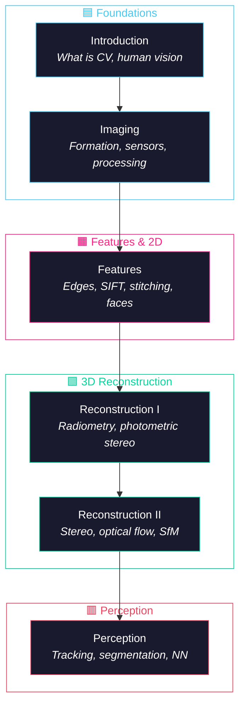

# Introduction to Computer Vision

<!-- toc -->

## 1. What is Computer Vision?

Computer vision is not merely a subset of artificial intelligence; it is a profound multidisciplinary engineering and scientific enterprise. It bridges the physical world and symbolic understanding, drawing upon optics, signal processing, electrical engineering, and computer science.

    

<i>Vision pipeline: light source → scene → camera → Vision Software produces a scene description</i>

The fundamental challenge lies in transforming raw numerical arrays—pixel data—into a meaningful description of the 3D environment.

    

        
        
<i>Raw visual input: two children showering</i>

    

    

        
        
<i>Same scene as a numerical pixel matrix</i>

    

In this field, the definition of the mission often dictates the methodology. Below is a comparison of the three primary philosophical pillars of computer vision research:

| Perspective | Proponent | Core Philosophy |
|-------------|-----------|----------------|
| Vision as Emulation | David Marr | Aimed at automating human visual processes to replicate the sophistication of biological systems |
| Vision as Information Processing | Berthold Horn | Defined as the task of "inverting" image formation—mathematically walking back from a 2D projection to 3D reality |
| Vision as a Functional Tool | Takeo Kanade | Emphasizes that vision is "fun" but, more importantly, "useful," serving as a bridge between pure research and practical application |

### 1.1 The "First Principles" Philosophy

While contemporary deep learning provides powerful tools, a **First Principles** approach—focusing on mathematical and physical underpinnings—is the prerequisite for generalizable and explainable AI. Relying on "black box" models often bypasses the structural understanding required for true innovation.

> **Why First Principles?** Physical phenomena can be described with elegant math, making massive datasets and exhaustive training cycles unnecessary.

We prioritize these fundamentals for four reasons:

1. **Precision and Conciseness** — Physical phenomena can often be described with elegant math, rendering massive datasets unnecessary.
2. **Debugging and Diagnostics** — When a vision system fails, first principles provide the only rigorous framework for diagnosing the failure.
3. **Synthetic Data Generation** — When real-world data collection is impractical or dangerous, mathematical models allow us to synthesize high-fidelity training data.
4. **Scientific Curiosity** — The innate human drive to understand the "why" behind visual phenomena leads to breakthroughs that purely data-driven methods overlook.

---

## 2. The Human Visual System: Biology, Fallibility, and Ambiguity

Studying the human eye is a necessary starting point for designing artificial vision. Even though machines and humans often have divergent goals—qualitative navigation versus quantitative measurement—the eye provides a blueprint for efficient information reduction.

### 2.1 The Biological Pathway

The human visual system is a complex hierarchy designed for rapid analysis:

    

<i>Biological vision pathway: retina → LGN → visual cortex (V1, V2, MT/V5, V8)</i>

### 2.2 Qualitative vs. Quantitative Vision

As engineers, we must recognize that **human vision is a qualitative system**, whereas factory automation, medical imaging, and robotics require quantitative precision. A human can recognize a face instantly but cannot measure the length of a component to the nearest millimeter. For tasks requiring extreme reliability, emulating human biology is often the "wrong" goal; machines must provide the measurable accuracy that biological systems lack.

### 2.3 Case Studies in Visual Illusions

Human vision is more fallible than it appears, often relying on internal assumptions to resolve ambiguity.

 

**Example — Dongary Wave Illusion:** The static leaf pattern below appears to shimmer or move due to involuntary micro-saccades of the eye.

    
    
<i>Static leaf pattern that produces a perception of motion — the Dongary Wave illusion</i>

| Illusion | What It Reveals |
|----------|-----------------|
| **Fraser's Spiral** | Concentric circles misinterpreted as a spiral |
| **Adelson's Checker Shadow** | Brain compensates for illumination — two identical gray patches look different |
| **Dongary Wave** | Perceived motion from a static image due to involuntary eye movements |
| **Ames Room** | Perspective and relative size create an illusion where people appear to grow or shrink |
| **Necker Cube / Faces vs. Vase** | A single 2D image supports multiple 3D or symbolic interpretations |
| **The Crater Illusion** | The "lighting from above" assumption — flipping a mound makes it appear as a crater |
| **Kanizsa Triangle** | The brain "fills in" data (thinking) rather than just processing pixels (seeing) |

> **Key Insight:** While humans *think* through their visual experiences, machines must first learn to *calculate* through the rigorous lens of radiometry and geometry.

---

## 3. Topics Covered: Roadmap

This specialization covers the entire pipeline — from pixels to perception — organized into six modules:

### Module Breakdown

| # | Module | Focus |
|---|--------|-------|
| 1 | **Imaging** | Image formation, sensors, binary images, image processing (convolution, Fourier) |
| 2 | **Features** | Edge/boundary detection, SIFT, image stitching, face detection |
| 3 | **Reconstruction I** | Radiometry, photometric stereo, shape from shading, depth from defocus |
| 4 | **Reconstruction II** | Camera calibration, stereo, optical flow, structure from motion |
| 5 | **Perception** | Object tracking, segmentation, appearance matching, neural networks |

---

## 4. Global Applications: Computer Vision in the Modern World

Vision has evolved from a laboratory curiosity into a thriving global industry across diverse sectors.

 

| Domain | Applications |
|--------|-------------|
| **Industrial / Efficiency** | Factory automation, high-speed visual inspection, OCR for license plates and postal scanning |
| **Security / Identity** | Biometrics using iris patterns (as unique as DNA), robust face recognition |
| **Consumer Tech** | Optical mice (mini-vision systems), gaming (Kinect / PlayStation), AR (Snapchat 3D mesh filters) |
| **Intelligent Marketing** | Vending machines detecting customer demographics (age/gender) to display targeted products |
| **Visual Search** | Instant identification of monuments and objects via mobile devices |
| **Advanced Mobility** | Driverless cars using sensor fusion, Mars Rover terrain mapping |
| **Creative / Medical** | Motion capture for cinema, medical diagnostics (X-ray, MRI, ultrasound) |

---