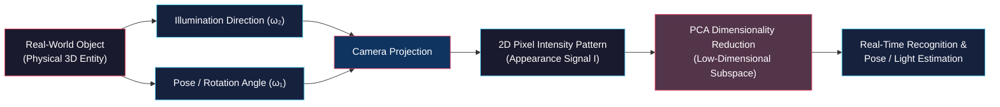

# Appearance Representation and PCA Mathematics

<!-- toc -->

This lecture note covers the paradigm shift in computer vision from geometric modeling to signal-based appearance modeling, visual representations in high-dimensional pixel space, data acquisition and brightness normalization pipelines, and the linear algebraic heart of dimensionality reduction: **Principal Component Analysis (PCA)** with full step-by-step Lagrange multiplier derivations, based on the curriculum from the Columbia University CAVE Lab (Prof. Shree K. Nayar).

---

## 1. Overview and Introduction

In computer vision, traditional approaches to object recognition and pose estimation focused on reconstructing explicit three-dimensional (3D) geometric models of objects and matching them against 3D sensor data. However, the hardware complexity, computational cost, and sensitivity to noise of 3D acquisition led researchers to explore directly using 2D visual intensity patterns (signals) captured by cameras.

**Appearance Matching** is a powerful computer vision paradigm that models objects not by explicit 3D geometry, but by the holistic visual patterns produced across varying viewpoints (poses) and lighting conditions (illumination).

The primary objective is to compress massive visual data from a high-dimensional pixel space (e.g., $200 \times 200 = 40,000$ dimensions) into a much lower-dimensional mathematical subspace while retaining maximum discriminative variance.

<figure style="display:flex; justify-content: center; margin: 20px 0;">
  

    
    <figcaption style="margin-top: 0.5em; text-align: center; font-size: 13px; color: #888;"><em>Figure 1: Appearance-based recognition problem: An unknown input image and an extensive library of object appearance templates across poses and lightings.</em></figcaption>
  

</figure>

---

## 2. Shape vs. Appearance Representations

### 2.1 Explicit 3D Geometry Representations

In computer graphics, CAD/CAM, and manufacturing, objects are represented using explicit 3D mathematical descriptions:

1. **Voxel Representation:** The 3D volumetric generalization of 2D pixels (**volume element**). Space is discretized into 3D grids storing occupancy binary or density values.
2. **Surface Primitives:** Defines boundaries of opaque objects using planar polygon meshes, spheres, or parametric patches.
3. **Superquadrics:** Analytical geometric primitives capable of expressing a continuous spectrum from sharp corners to smooth cylindrical and spherical bodies with a single compact formula:

$$|x|^r + |y|^s + |z|^t = 1$$

Here, $r, s, t$ are real parameters. Varying these exponents morphs the shape between cubes, cylinders, cones, and ellipsoids.

<figure style="display:flex; justify-content: center; margin: 20px 0;">
  

    
    <figcaption style="margin-top: 0.5em; text-align: center; font-size: 13px; color: #888;"><em>Figure 2: Explicit 3D Geometric Models: Left: Voxel representation (dragon model); Right: Analytical superquadrics family ($|x|^r + |y|^s + |z|^t = 1$).</em></figcaption>
  

</figure>

4. **Constructive Solid Geometry (CSG):** Constructs complex industrial parts by combining basic primitives (spheres, cubes, cylinders) via Boolean set operations: **Union**, **Difference**, and **Intersection**.

<figure style="display:flex; justify-content: center; margin: 20px 0;">
  

    
    <figcaption style="margin-top: 0.5em; text-align: center; font-size: 13px; color: #888;"><em>Figure 3: Constructive Solid Geometry (CSG) Operations: Union, Difference, and Intersection between a cube and a sphere.</em></figcaption>
  

</figure>

### 2.2 Challenges of 3D Shape Modeling in Computer Vision

While geometric models are ideal for manufacturing and rendering, they present significant hurdles for vision-based recognition:

* **Explicit Model Acquisition Overhead:** Requires laborious manual CAD modeling or high-precision structured light/laser range scanning for every single object in the database.
* **Online 3D Depth Sensing Requirement:** At runtime, the scene must be scanned with depth sensors (e.g., LiDAR, RGB-D) to generate noisy 3D point clouds.
* **Alignment and Search Complexity:** Matching 3D point clouds or CAD meshes (e.g., via ICP) is computationally expensive, prone to local minima, and fragile against occlusion.

### 2.3 Appearance-Based Approach

The appearance-based approach bypasses explicit 3D geometry by directly modeling the 2D optical intensity map captured by the sensor. An observed image is a combined function of two parameter categories:

$$\text{Visual Appearance} = \mathcal{F}(\text{Intrinsic Parameters}, \text{Extrinsic Parameters})$$

1. **Intrinsic Parameters:** Inherent, observer-independent physical properties of the object that remain invariant over time. These include 3D shape and surface reflectance (**BRDF - Bidirectional Reflectance Distribution Function**).
2. **Extrinsic Parameters:** Observer-dependent variables that change continuously in real time, including 3D pose relative to the camera (**Pose $\boldsymbol{\omega}_1$**) and illumination direction/strength (**Illumination $\boldsymbol{\omega}_2$**).

> **Core Insight:** Rather than explicitly recovering 3D geometry and BRDF, we directly learn the low-dimensional manifold formed by all 2D image variations produced across extrinsic parameters ($\boldsymbol{\omega} = [\omega_1, \omega_2]^T$).

---

## 3. Learning Appearance and Preprocessing

The machine learning methodology for appearance modeling mirrors human visual cognition. When humans inspect an unfamiliar object, they rotate it in their hands under various light sources to form an internal visual representation across orientations.

<figure style="display:flex; justify-content: center; margin: 20px 0;">
  

    
    <figcaption style="margin-top: 0.5em; text-align: center; font-size: 13px; color: #888;"><em>Figure 4: Emulating Human Perception: Rotating and inspecting an object across orientations and viewpoints.</em></figcaption>
  

</figure>

### 3.1 Acquiring the Object Image Set

To automate and standardize this process, a controlled laboratory apparatus is used:

* **Turntable (Pose Parameter $\omega_1$):** The object is placed on a motorized turntable in one of its stable configurations. The table rotates $360^\circ$ to sample pose angles $\omega_1$ at discrete intervals (e.g., every $5^\circ$).
* **Robotic Lighting Arm (Illumination Parameter $\omega_2$):** A light source mounted on a robotic manipulator traverses a hemisphere around the object, systematically varying the illumination angle $\omega_2$.
* **Stationary Camera:** For each $(\omega_1, \omega_2)$ state, a high-resolution image is acquired, producing a comprehensive **Object Image Set**.

<figure style="display:flex; justify-content: center; margin: 20px 0;">
  

    
    <figcaption style="margin-top: 0.5em; text-align: center; font-size: 13px; color: #888;"><em>Figure 5: Appearance Acquisition Setup: Turntable (Pose $\omega_1$), robotic arm with light source (Lighting $\omega_2$), and stationary camera.</em></figcaption>
  

</figure>

### 3.2 Preprocessing Pipeline

To ensure all captured images are directly pixel-wise comparable (**metric comparability**), three preprocessing stages are applied:

1. **Segmentation:** Objects are imaged against a uniform dark background, which is segmented out and set to zero intensity to eliminate background clutter.
2. **Canonical Resizing:** The bounding box of the segmented object is computed, and the object is normalized to a fixed canonical resolution (e.g., $128 \times 128$ or $200 \times 200$ pixels).
3. **Vectorial Brightness Normalization:** To prevent lamp fluctuations, sensor sensitivity, or exposure shifts from distorting distances, the image matrix $I$ is reshaped into a vector and divided by its $L_2$ norm:

$$\hat{\mathbf{I}} = \frac{I}{\|I\|} = \frac{I}{\sqrt{\sum_{x,y} I(x,y)^2}}$$

This projects every image vector onto a high-dimensional **Unit Sphere**, decoupling appearance representation from absolute light energy.

---

## 4. Principal Component Analysis (PCA)

### 4.1 High-Dimensional Pixel Space

Each preprocessed canonical image contains $P \times Q = N$ pixels. By unrolling the 2D image matrix column-wise (or row-wise), we obtain an $N \times 1$ **Feature Vector ($\mathbf{f}'$)**.

<figure style="display:flex; justify-content: center; margin: 20px 0;">
  

    
    <figcaption style="margin-top: 0.5em; text-align: center; font-size: 13px; color: #888;"><em>Figure 6: Image Vectorization: Unrolling a $P \times Q = N$ image into an $N \times 1$ feature vector $\mathbf{f}'$.</em></figcaption>
  

</figure>

Each image is thus represented as a single point in an $N$-dimensional Euclidean space:

* Each coordinate axis corresponds to the intensity of a specific pixel location.
* The standard basis vectors $\{\mathbf{i}_1, \mathbf{i}_2, \dots, \mathbf{i}_N\}$ form an orthonormal basis:

$$\mathbf{i}_1 = \begin{bmatrix} 1 \\ 0 \\ \vdots \\ 0 \end{bmatrix}, \quad \mathbf{i}_2 = \begin{bmatrix} 0 \\ 1 \\ \vdots \\ 0 \end{bmatrix}, \quad \dots, \quad \mathbf{i}_N = \begin{bmatrix} 0 \\ 0 \\ \vdots \\ 1 \end{bmatrix}$$

<figure style="display:flex; justify-content: center; margin: 20px 0;">
  

    
    <figcaption style="margin-top: 0.5em; text-align: center; font-size: 13px; color: #888;"><em>Figure 7: $N$-Dimensional Space: Standard orthonormal basis $\{\mathbf{i}_1, \dots, \mathbf{i}_N\}$ and the image point $\mathbf{f}'$.</em></figcaption>
  

</figure>

### 4.2 Equivalence Between Image SSD and $N$-D Euclidean Distance

The classic Sum of Squared Differences (**SSD**) metric between two images $I_1$ and $I_2$ is mathematically identical to the squared $L_2$ Euclidean distance between their corresponding feature vectors in $N$-dimensional space:

$$\text{SSD} = \sum_{p=1}^P \sum_{q=1}^Q \left( I_1[p,q] - I_2[p,q] \right)^2 \equiv d^2 = \|\mathbf{f}'_1 - \mathbf{f}'_2\|^2$$

<figure style="display:flex; justify-content: center; margin: 20px 0;">
  

    
    <figcaption style="margin-top: 0.5em; text-align: center; font-size: 13px; color: #888;"><em>Figure 8: Equivalence between pixel-space SSD and the squared Euclidean distance ($d^2 = \|\mathbf{f}'_1 - \mathbf{f}'_2\|^2$) in $N$-D space.</em></figcaption>
  

</figure>

### 4.3 Curse of Dimensionality and Visual Redundancy

For a $200 \times 200$ image, $N = 40,000$. Performing exhaustive template matching across thousands of objects in a 40,000-dimensional space is computationally intractable.

<figure style="display:flex; justify-content: center; margin: 20px 0;">
  

    
    <figcaption style="margin-top: 0.5em; text-align: center; font-size: 13px; color: #888;"><em>Figure 9: The high-dimensional template matching challenge: Comparing an input image against discrete templates in $N$-D space is prohibitively expensive.</em></figcaption>
  

</figure>

However, sequentially sampled turntable images exhibit immense **visual redundancy (correlation)** between neighboring frames:

<figure style="display:flex; justify-content: center; margin: 20px 0;">
  

    
    <figcaption style="margin-top: 0.5em; text-align: center; font-size: 13px; color: #888;"><em>Figure 10: Smooth pixel transitions across neighboring views demonstrate that image points are confined to a compact subspace.</em></figcaption>
  

</figure>

Because neighboring pixel values change smoothly, the $M$ sample points do not span the entire 40,000-dimensional space, but are tightly clustered within a low-dimensional ($K \ll N$, e.g., $K = 8 \sim 20$) **Linear Subspace (Eigenspace)**.

<figure style="display:flex; justify-content: center; margin: 20px 0;">
  

    
    <figcaption style="margin-top: 0.5em; text-align: center; font-size: 13px; color: #888;"><em>Figure 11: $M$ image points in $N$-D space lying on a $K$-dimensional orthonormal subspace $\{\mathbf{e}_1, \dots, \mathbf{e}_K\}$ where $K \ll N$.</em></figcaption>
  

</figure>

### 4.4 Mean Subtraction and Centering

The first step of PCA is computing the **Average Image Vector ($\mathbf{c}$)** across the $M$ sample images:

$$\mathbf{c} = \frac{1}{M} \sum_{m=1}^M \mathbf{f}'_m$$

Each image is then zero-centered by subtracting this mean vector:

$$\mathbf{f}_m = \mathbf{f}'_m - \mathbf{c}$$

This shifts the dataset centroid to the origin $(0,0,\dots,0)$, ensuring $E[\mathbf{f}] = \mathbf{0}$.

---

## 5. Mathematical Derivation of Principal Components

The 1st Principal Component $\mathbf{e}_1$ is the unit direction vector along which the centered data exhibits **maximum variance**. This corresponds to the best-fitting line in the least squares sense.

<figure style="display:flex; justify-content: center; margin: 20px 0;">
  

    
    <figcaption style="margin-top: 0.5em; text-align: center; font-size: 13px; color: #888;"><em>Figure 12: First Principal Component $\mathbf{e}_1$: Direction of maximum variance and scalar projection $p = \mathbf{e}_1 \cdot \mathbf{f}$.</em></figcaption>
  

</figure>

### 5.1 Step-by-Step Proof via Lagrange Multipliers

#### Step 1: Scalar Projection
The scalar coordinate $p$ of a centered image vector $\mathbf{f}$ along unit direction $\mathbf{e}$ is given by the inner product:

$$p = \mathbf{e} \cdot \mathbf{f} = \mathbf{e}^T \mathbf{f}$$

#### Step 2: Expected Value of Projections
Since the data is zero-centered ($E[\mathbf{f}] = \mathbf{0}$):

$$E[p] = E[\mathbf{e}^T \mathbf{f}] = \mathbf{e}^T E[\mathbf{f}] = \mathbf{e}^T \mathbf{0} = 0$$

#### Step 3: Variance of Projections
From the definition of variance:

$$\text{Var}(p) = E\left[ (p - E[p])^2 \right] = E\left[ p^2 \right] = E\left[ (\mathbf{e}^T \mathbf{f})^2 \right]$$

Expanding the squared scalar using transpose properties:

$$(\mathbf{e}^T \mathbf{f})^2 = (\mathbf{e}^T \mathbf{f})(\mathbf{e}^T \mathbf{f})^T = (\mathbf{e}^T \mathbf{f})(\mathbf{f}^T \mathbf{e}) = \mathbf{e}^T (\mathbf{f} \mathbf{f}^T) \mathbf{e}$$

Pulling the constant vector $\mathbf{e}$ outside the expectation:

$$\text{Var}(p) = \mathbf{e}^T E\left[ \mathbf{f} \mathbf{f}^T \right] \mathbf{e}$$

Here, $E[\mathbf{f} \mathbf{f}^T]$ is the $N \times N$ **Covariance Matrix ($R$)**:

$$R = E[\mathbf{f} \mathbf{f}^T] = \frac{1}{M} \sum_{m=1}^M \mathbf{f}_m \mathbf{f}_m^T$$

Thus, the variance simplifies to a quadratic form:

$$\text{Var}(p) = \mathbf{e}^T R \mathbf{e}$$

#### Step 4: Unit Vector Constraint and Lagrange Multiplier
To prevent $\|\mathbf{e}\| \to \infty$, we enforce the unit norm constraint:

$$\|\mathbf{e}\|^2 = 1 \implies \mathbf{e}^T \mathbf{e} = 1 \implies \mathbf{e}^T \mathbf{e} - 1 = 0$$

Formulating the Lagrangian objective function $\mathcal{L}(\mathbf{e}, \lambda)$:

$$\mathcal{L}(\mathbf{e}, \lambda) = \mathbf{e}^T R \mathbf{e} - \lambda (\mathbf{e}^T \mathbf{e} - 1)$$

#### Step 5: Partial Derivative and Eigenvalue Equation
Setting the gradient with respect to $\mathbf{e}$ to zero:

$$\frac{\partial \mathcal{L}}{\partial \mathbf{e}} = 2 R \mathbf{e} - 2 \lambda \mathbf{e} = \mathbf{0}$$

Dividing by 2 yields the canonical **Eigenvalue/Eigenvector Equation**:

$$R \mathbf{e} = \lambda \mathbf{e}$$

#### Step 6: Equivalence of Variance and Eigenvalue
Substituting $R \mathbf{e} = \lambda \mathbf{e}$ back into the variance formula:

$$\text{Var}(p) = \mathbf{e}^T (R \mathbf{e}) = \mathbf{e}^T (\lambda \mathbf{e}) = \lambda (\mathbf{e}^T \mathbf{e})$$

Since $\mathbf{e}^T \mathbf{e} = 1$:

$$\text{Var}(p) = \lambda$$

> **Fundamental Theorem:** The variance of projected data along direction $\mathbf{e}$ is exactly equal to the eigenvalue $\lambda$. Maximizing variance corresponds directly to finding the **largest eigenvalue ($\lambda_1$)** and its associated **eigenvector ($\mathbf{e}_1$)** of the covariance matrix $R$.

---

### 5.2 Multi-Dimensional Eigenspace Construction

The second principal component $\mathbf{e}_2$ is the eigenvector corresponding to the second largest eigenvalue $\lambda_2$, constrained to be orthogonal to $\mathbf{e}_1$ ($\mathbf{e}_1 \perp \mathbf{e}_2$).

<figure style="display:flex; justify-content: center; margin: 20px 0;">
  

    
    <figcaption style="margin-top: 0.5em; text-align: center; font-size: 13px; color: #888;"><em>Figure 13: Second Principal Component $\mathbf{e}_2$: Orthogonal to $\mathbf{e}_1$ with coordinates $\mathbf{p} = [p_1, p_2]^T$.</em></figcaption>
  

</figure>

Sorting the eigenvectors in descending order of eigenvalues ($\lambda_1 \ge \lambda_2 \ge \dots \ge \lambda_K$), we construct the $N \times K$ **Eigenspace Matrix ($E$)**:

$$E = \begin{bmatrix} \mathbf{e}_1 & \mathbf{e}_2 & \dots & \mathbf{e}_K \end{bmatrix}_{N \times K}$$

<figure style="display:flex; justify-content: center; margin: 20px 0;">
  

    
    <figcaption style="margin-top: 0.5em; text-align: center; font-size: 13px; color: #888;"><em>Figure 14: $K$-Dimensional Subspace Representation: Projecting an $N \times 1$ image vector $\mathbf{f}$ into a compact $K \times 1$ coordinate vector $\mathbf{p}$.</em></figcaption>
  

</figure>

### 5.3 Forward and Back Projection

1. **Forward Projection (Encoding / Compression):** Any centered image vector $\mathbf{f}$ is compressed into a $K$-dimensional coordinate vector $\mathbf{p}$:

$$\mathbf{p} = \begin{bmatrix} p_1 \\ p_2 \\ \vdots \\ p_K \end{bmatrix} = \begin{bmatrix} \mathbf{e}_1 & \mathbf{e}_2 & \dots & \mathbf{e}_K \end{bmatrix}^T \mathbf{f} = E^T \mathbf{f}$$

2. **Back Projection (Reconstruction):** Reconstructing the original $N$-dimensional image from coordinates $\mathbf{p}$:

$$\mathbf{f} \approx \sum_{k=1}^K p_k \mathbf{e}_k = E \mathbf{p}$$

Adding back the mean image reconstructs the uncentered image:

$$\mathbf{f}' \approx \mathbf{c} + \sum_{k=1}^K p_k \mathbf{e}_k$$

<figure style="display:flex; justify-content: center; margin: 20px 0;">
  

    
    <figcaption style="margin-top: 0.5em; text-align: center; font-size: 13px; color: #888;"><em>Figure 15: Forward Projection ($\mathbf{p} = E^T \mathbf{f}$) and Back Projection ($\mathbf{f} \approx \sum_{k=1}^K p_k \mathbf{e}_k$).</em></figcaption>
  

</figure>

---

## 6. Summary and Next Steps

| Concept | Mathematical Formulation | Role & Meaning |
| :--- | :--- | :--- |
| **Vector Normalization** | $\hat{\mathbf{I}} = I / \|I\|$ | Normalizes brightness and exposure onto the unit sphere. |
| **Average Image** | $\mathbf{c} = \frac{1}{M}\sum \mathbf{f}'_m$ | Centroid of the dataset in $N$-D space. |
| **Covariance Matrix** | $R = \frac{1}{M}\sum \mathbf{f}_m \mathbf{f}_m^T$ | $N \times N$ matrix capturing inter-pixel variances. |
| **Eigenvalue Problem** | $R \mathbf{e} = \lambda \mathbf{e}$ | Computes principal variance directions ($\mathbf{e}$) and amounts ($\lambda$). |
| **Forward Projection** | $\mathbf{p} = E^T \mathbf{f}$ | Compresses an $N$-D pixel vector into a $K$-D coordinate vector. |
| **Back Projection** | $\mathbf{f} \approx E \mathbf{p}$ | Reconstructs original image with minimal information loss. |

> **Next Lecture:** Computing the eigendecomposition of a massive $40,000 \times 40,000$ matrix $R$ is computationally intractable directly. In the next lecture, we will explore **Singular Value Decomposition (SVD)** to solve this in seconds, fit continuous **Parametric Appearance Manifolds** using cubic splines, and implement real-time **Appearance Matching** algorithms.
