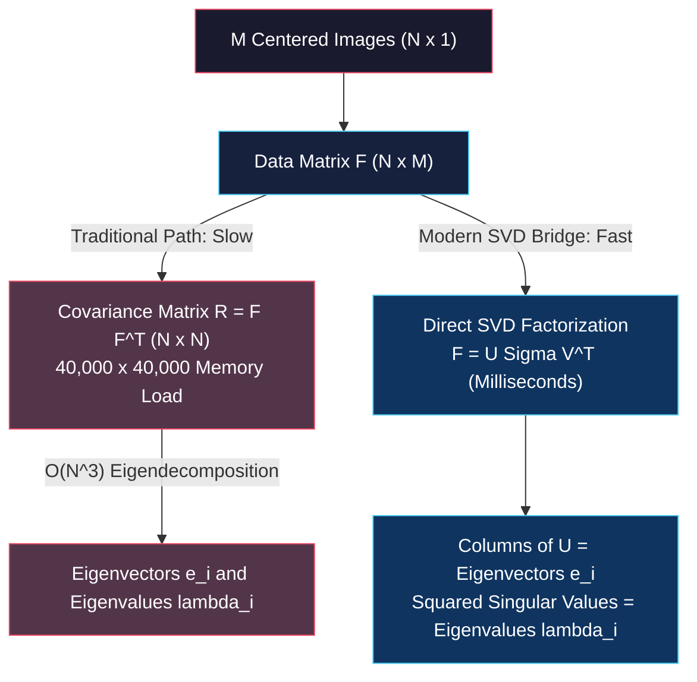
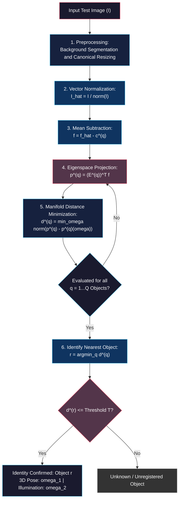

# SVD Optimization, Parametric Manifolds, and Appearance Matching

<!-- toc -->

This lecture note covers the theoretical and linear algebraic bridge of **Singular Value Decomposition (SVD)** to overcome computational bottlenecks in large-scale PCA, the continuous geometric interpolation of **Parametric Appearance Manifolds** on eigenspaces, real-time **Appearance Matching** algorithms, and foundational computer vision applications such as **Eigenfaces**, **Visual Servoing**, and automated quality inspection, based on the curriculum from the Columbia University CAVE Lab (Prof. Shree K. Nayar).

---

## 1. Linear Algebraic Proof of the PCA and SVD Equivalence

In the previous lecture, we established that extracting principal components from $N$-pixel images requires solving an eigenvalue problem ($R \mathbf{e} = \lambda \mathbf{e}$) on an $N \times N$ covariance matrix $R$. However, in practical computer vision applications, this direct approach encounters a severe computational barrier:

* **Dimensionality Explosion:** For typical $200 \times 200 = 40,000$ pixel images, the covariance matrix $R$ is a gigantic **$40,000 \times 40,000$ matrix ($\approx 1.6 \text{ billion floating-point numbers}$)**.
* **Computational Infeasibility:** Allocating $R$ in memory requires $\sim 6.4 \text{ GB}$ of RAM, and standard $\mathcal{O}(N^3)$ eigenvalue solvers freeze processors for extended periods.

To eliminate this bottleneck, we never construct the $N \times N$ covariance matrix explicitly. Instead, we apply **Singular Value Decomposition (SVD)** directly to the raw centered data matrix.

### 1.1 Mathematical Proof Bridge

Let us construct an $N \times M$ Data Matrix $F$ by stacking our $M$ mean-subtracted image vectors column-wise ($M \ll N$, e.g., $M = 360$ sample images, $N = 40,000$ pixels):

$$F = \begin{bmatrix} \mathbf{f}_1 & \mathbf{f}_2 & \dots & \mathbf{f}_M \end{bmatrix}$$

The sample covariance matrix $R$ is expressed as:

$$R = F F^T$$

By the fundamental SVD theorem, any rectangular matrix $F$ can be uniquely factorized into the product of three matrices:

$$F = U \Sigma V^T$$

Where:
* $U$ ($N \times N$) and $V$ ($M \times M$) are orthonormal matrices ($U^T U = I$ and $V^T V = I$).
* $\Sigma$ ($N \times M$) is a diagonal matrix containing non-negative, sorted singular values ($\sigma_1 \ge \sigma_2 \ge \dots \ge \sigma_M \ge 0$) along its main diagonal.

<figure style="display:flex; justify-content: center; margin: 20px 0;">
  

    
    <figcaption style="margin-top: 0.5em; text-align: center; font-size: 13px; color: #888;"><em>Figure 1: Singular Value Decomposition (SVD): $A = U \Sigma V^T$ factorization with diagonal singular values matrix $\Sigma$.</em></figcaption>
  

</figure>

Substituting the SVD representation of $F$ into $R = F F^T$:

$$R = F F^T = (U \Sigma V^T) (U \Sigma V^T)^T$$

Applying the matrix transpose property $(A B C)^T = C^T B^T A^T$:

$$R = (U \Sigma V^T) (V \Sigma^T U^T) = U \Sigma (V^T V) \Sigma^T U^T$$

Because $V$ is orthonormal, $V^T V = I$ simplifies to the identity matrix:

$$R = U (\Sigma \Sigma^T) U^T$$

Defining the diagonal matrix $\Lambda = \Sigma \Sigma^T$ of size $N \times N$:

$$\Lambda = \Sigma \Sigma^T = \begin{bmatrix} \sigma_1^2 & 0 & \dots & 0 \\ 0 & \sigma_2^2 & \dots & 0 \\ \vdots & \vdots & \ddots & \vdots \\ 0 & 0 & \dots & 0 \end{bmatrix}$$

Post-multiplying both sides by $U$ (using $U^T U = I$):

$$R = U \Lambda U^T \implies R U = U \Lambda$$

Examining each column $\mathbf{u}_i$ of matrix $U$:

$$R \mathbf{u}_i = \lambda_i \mathbf{u}_i \quad \text{where} \quad \lambda_i = \sigma_i^2$$

> **Key Linear Algebra Equivalence:**
> 1. The **columns of $U$ ($\mathbf{u}_i$)** resulting from the SVD of the raw data matrix $F$ are exactly the **eigenvectors ($\mathbf{e}_i$)** of the covariance matrix $R$.
> 2. The **eigenvalues ($\lambda_i$)** of the covariance matrix equal the **squared singular values ($\sigma_i^2$)** of $F$.
> 
> Because thin/truncated SVD only computes $\min(N, M) = M$ components, execution time drops from minutes to milliseconds!

---

## 2. Parametric Appearance Representation

### 2.1 Subspace Dimension ($K$) Selection via Energy Criterion

Due to substantial correlation (visual redundancy) across neighboring turntable views, the eigenvalues $\lambda_k$ decay rapidly. Beyond the first few components, subsequent eigenvalues drop close to zero.

<figure style="display:flex; justify-content: center; margin: 20px 0;">
  

    
    <figcaption style="margin-top: 0.5em; text-align: center; font-size: 13px; color: #888;"><em>Figure 2: Appearance eigenspace: 1) Mean image and sequential eigenvectors (1st, 2nd, 3rd, 10th, 20th, 40th, 50th); 2) Steeply decaying eigenvalue curve $\lambda_k$.</em></figcaption>
  

</figure>

To retain $95\%$ of the total data energy (variance), the optimal subspace dimension $K$ is selected via the cumulative eigenvalue ratio:

$$\text{Find smallest } K \text{ such that:} \quad \frac{\sum_{i=1}^{K} \lambda_i}{\sum_{j=1}^{N} \lambda_j} \ge 0.95$$

<figure style="display:flex; justify-content: center; margin: 20px 0;">
  

    
    <figcaption style="margin-top: 0.5em; text-align: center; font-size: 13px; color: #888;"><em>Figure 3: Energy Conservation Criterion: Identifying the smallest $K$ retaining $\ge 95\%$ of cumulative variance.</em></figcaption>
  

</figure>

In practice, a 40,000-dimensional pixel space is compressed into a $K = 8 \sim 20$ dimensional eigenspace, achieving a **$2,000 \times$ to $5,000 \times$ compression ratio** with near-zero perceptual degradation.

### 2.2 Eigenspace Projection and Extrinsic Parameters

An object's observed image is parameterized by intrinsic physical properties and extrinsic observation variables ($\boldsymbol{\omega}$):

$$\boldsymbol{\omega} = \begin{bmatrix} \omega_1 \\ \omega_2 \\ \vdots \\ \omega_T \end{bmatrix} = \begin{bmatrix} \text{Pose Angle} \\ \text{Illumination Direction} \\ \vdots \end{bmatrix}$$

<figure style="display:flex; justify-content: center; margin: 20px 0;">
  

    
    <figcaption style="margin-top: 0.5em; text-align: center; font-size: 13px; color: #888;"><em>Figure 4: Visual Appearance Function: Intrinsic properties (shape, BRDF) and extrinsic parameter vector $\boldsymbol{\omega}$ (pose, lighting).</em></figcaption>
  

</figure>

A normalized image vector $\mathbf{f}'(\boldsymbol{\omega})$ at parameter state $\boldsymbol{\omega}$ is projected into the eigenspace after mean subtraction:

$$\mathbf{p}(\boldsymbol{\omega}) = \begin{bmatrix} \mathbf{e}_1 & \mathbf{e}_2 & \dots & \mathbf{e}_K \end{bmatrix}^T (\mathbf{f}'(\boldsymbol{\omega}) - \mathbf{c})$$

This transforms an entire 40,000-pixel image into a single coordinate point $\mathbf{p}(\boldsymbol{\omega})$ in $K$-dimensional space.

<figure style="display:flex; justify-content: center; margin: 20px 0;">
  

    
    <figcaption style="margin-top: 0.5em; text-align: center; font-size: 13px; color: #888;"><em>Figure 5: Eigenspace Projection: High-dimensional image vectors mapped to discrete points $\mathbf{p}(\boldsymbol{\omega})$ in low-dimensional eigenspace.</em></figcaption>
  

</figure>

### 2.3 Constructing the Continuous Appearance Manifold

Because sample images are recorded at discrete intervals (e.g., every $5^\circ$ or $10^\circ$), the projected points $\mathbf{p}(\boldsymbol{\omega}_m)$ form a discrete trajectory.

1. **Cubic Spline Interpolation:** A low-degree continuous surface interpolation (cubic splines) is fitted across the discrete projection points.
2. **Closed Manifold Geometry:** Because rotating $360^\circ$ returns to the starting orientation, the resulting surface curves back onto itself, creating a smooth, continuous, and **Closed Appearance Manifold**.

<figure style="display:flex; justify-content: center; margin: 20px 0;">
  

    
    <figcaption style="margin-top: 0.5em; text-align: center; font-size: 13px; color: #888;"><em>Figure 6: Continuous Appearance Manifolds: Closed 3D manifold surfaces parameterized by pose angle $\theta_1$ and lighting direction $\theta_2$ for different objects (duck, bird, hen, dog).</em></figcaption>
  

</figure>

---

## 3. Appearance Matching (Online Recognition Pipeline)

Once continuous manifolds $\mathbf{p}^{(q)}(\boldsymbol{\omega})$ are learned for all database objects $q = 1 \dots Q$, runtime recognition proceeds via the following pipeline:

### 3.1 Step-by-Step Recognition & Pose Estimation

1. **Preprocessing:** The test image $I$ is segmented, resized to the canonical frame, and normalized: $\mathbf{f}' = I / \|I\|$.
2. **Subspace Projection:** For object $q$, the mean image $\mathbf{c}^{(q)}$ is subtracted and projected into its eigenspace:

$$\mathbf{p}^{(q)} = (E^{(q)})^T (\mathbf{f}' - \mathbf{c}^{(q)})$$

3. **Distance Minimization:** The minimum Euclidean distance $d^{(q)}$ between $\mathbf{p}^{(q)}$ and the continuous manifold $\mathbf{p}^{(q)}(\boldsymbol{\omega})$ is computed:

$$d^{(q)} = \min_{\boldsymbol{\omega}} \|\mathbf{p}^{(q)} - \mathbf{p}^{(q)}(\boldsymbol{\omega})\|$$

4. **Classification & Pose Recovery:** The object class $r$ with the smallest minimum distance is selected:

$$r = \arg\min_q d^{(q)}$$

If $d^{(r)} \le T$, identity is classified as $r$. The optimal continuous parameter $\boldsymbol{\omega}^* = [\omega_1^*, \omega_2^*]^T$ simultaneously estimates **3D pose** and **illumination direction** with sub-degree precision.

<figure style="display:flex; justify-content: center; margin: 20px 0;">
  

    
    <figcaption style="margin-top: 0.5em; text-align: center; font-size: 13px; color: #888;"><em>Figure 7: Columbia COIL-100 Database: Real-time recognition and continuous pose estimation (Pose = 334°) of a toy car among 100 objects.</em></figcaption>
  

</figure>

### 3.2 Proof of Equivalence Between Eigenspace Distance and SSD

The Euclidean distance in eigenspace is equivalent to the Sum of Squared Differences (SSD) in full pixel space:

$$d^2 = \|\mathbf{p}_1 - \mathbf{p}_2\|^2 = \left\| \sum_{k=1}^{K} p_k^{(1)} \mathbf{e}_k - \sum_{k=1}^{K} p_k^{(2)} \mathbf{e}_k \right\|^2 \approx \|\mathbf{f}_1' - \mathbf{f}_2'\|^2 = \text{SSD}$$

<figure style="display:flex; justify-content: center; margin: 20px 0;">
  

    
    <figcaption style="margin-top: 0.5em; text-align: center; font-size: 13px; color: #888;"><em>Figure 8: Distance preservation: Squared $L_2$ distance in $K$-D eigenspace ($d^2 = \|\mathbf{p}_1 - \mathbf{p}_2\|^2$) closely approximates pixel-level SSD.</em></figcaption>
  

</figure>

---

## 4. Key Real-World Applications

### 4.1 Face Recognition: Eigenfaces (Turk & Pentland, 1991)

The **Eigenfaces** algorithm by Matthew Turk and Alex Pentland pioneered appearance-based recognition:

* Eigenvectors computed across human face datasets resemble ghostly faces (**Eigenfaces**).
* Any face image is represented as a compact linear combination (weighted sum) of these eigenfaces:

$$\text{Face Image} \approx \mathbf{c} + w_1 \mathbf{e}_1 + w_2 \mathbf{e}_2 + \dots + w_K \mathbf{e}_K$$

* Classification is achieved by matching weight vectors $[w_1, \dots, w_K]$ against the database.

<figure style="display:flex; justify-content: center; margin: 20px 0;">
  

    
    <figcaption style="margin-top: 0.5em; text-align: center; font-size: 13px; color: #888;"><em>Figure 9: Eigenfaces (Turk & Pentland, 1991): Training faces, derived eigenfaces, and projecting a test face into subspace coordinates for recognition.</em></figcaption>
  

</figure>

### 4.2 Visual Servoing and Robot Positioning

In automated manufacturing (e.g., *peg-in-hole* insertion), a camera mounted on the robot's end-effector observes the target workpiece:

* Without recovering 3D coordinates, displacement in eigenspace coordinates ($\Delta \mathbf{p}$) directly guides robot joint motor commands ($\text{Appearance} = \mathcal{F}\{\text{Robot Coordinates}\}$).

<figure style="display:flex; justify-content: center; margin: 20px 0;">
  

    
    <figcaption style="margin-top: 0.5em; text-align: center; font-size: 13px; color: #888;"><em>Figure 10: Visual Servoing: Sensor and light mounted on robot gripper for closed-loop visual positioning and trajectory tracking.</em></figcaption>
  

</figure>

### 4.3 Automated Temporal Inspection

For automated quality control of printed circuit boards (PCBs) and assemblies:

* Scanning a golden (defect-free) unit generates a smooth reference trajectory curve in eigenspace.
* When new production boards are scanned, missing chips or soldering anomalies produce immediate deviations from this reference curve, instantly flagging defects.

---

## 5. Summary and Comparison

| Dimension | Classical 3D Geometric Vision | Appearance-Based (PCA + SVD + Manifold) |
| :--- | :--- | :--- |
| **Model Representation** | CAD, Polygon Mesh, Voxel, CSG | Low-dimensional Eigenspace ($K \approx 15$) & Continuous Manifold |
| **Sensor Requirement** | Laser Scanners / Structured Light / RGB-D | Standard 2D Camera |
| **Computational Burden** | Heavy 3D point cloud registration (ICP) | Millisecond $K$-dimensional Euclidean distance minimization |
| **Pose & Light Recovery**| Multiple complex photometric passes | Simultaneous extraction via manifold coordinate $\boldsymbol{\omega}^*$ |
| **Algorithmic Efficiency**| $\mathcal{O}(N^3)$ Covariance Eigendecomposition | $\mathcal{O}(M^2 N)$ Fast Truncated SVD |
