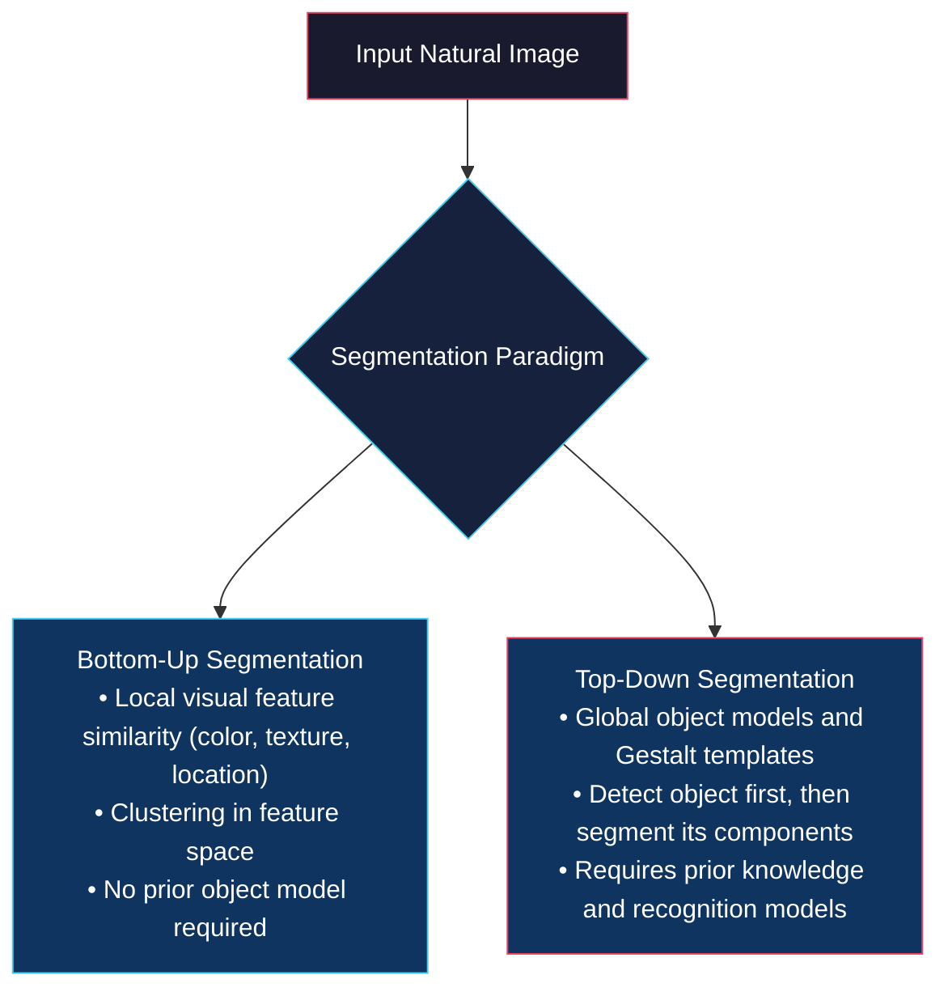
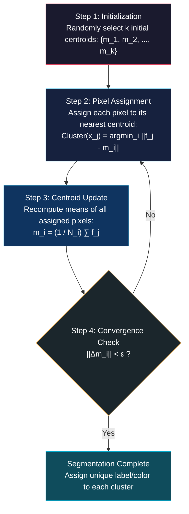

# Image Segmentation Foundations and Clustering Mathematics

<!-- toc -->

This note covers **Image Segmentation**, one of the fundamental and inherently "ill-defined" problems in computer vision; starting from human visual physiology and Gestalt perceptual grouping laws, to clustering in pixel feature space, **k-Means** and **Mean-Shift** algorithms, and spectral graph theory with **Normalized Cuts (NCut)**, following the curriculum of Columbia University's CAVE lab (Prof. Shree K. Nayar).

---

## 1. Overview and Segmentation Strategies

**Image Segmentation** is the process of partitioning a digital image into multiple visually, geometrically, or semantically coherent, homogeneous, and meaningful regions (**segments**). It serves as a critical precursor step for higher-level computer vision tasks such as object detection, object recognition, 3D scene understanding, and image classification.

### 1.1 Primitive Segmentation Approaches

Before establishing the general theory of segmentation, two classic, primitive approaches frequently used in early computer vision are:

1. **Histogram Thresholding:** In simple scenarios where an object rests on a homogeneous, distinct background, the image intensity histogram is computed. By finding the valley between two major peaks in the histogram, a threshold $T$ is selected, and pixels are converted into a binary mask according to $I(x,y) > T$.

<figure style="display:flex; justify-content: center; margin: 20px 0;">
  

    
    <figcaption style="margin-top: 0.5em; text-align: center; font-size: 13px; color: #888;"><em>Figure 1: Histogram Thresholding: 1) Grayscale image $g(x,y)$ and threshold $T$ identified from the histogram valley; 2) The resulting segmented binary image $b(x,y)$.</em></figcaption>
  

</figure>

2. **Active Contours (Snakes):** An approximate initial closed contour is placed around the object. Under the influence of internal elastic tension/bending forces and external image forces (intensity gradients), the contour automatically expands or contracts to snap (**latch**) onto the object's true boundary. However, because it requires manual initialization, it cannot solve the general, fully automated segmentation problem.

<figure style="display:flex; justify-content: center; margin: 20px 0;">
  

    
    <figcaption style="margin-top: 0.5em; text-align: center; font-size: 13px; color: #888;"><em>Figure 2: Active Contours (Snakes): Elastic contour initialized around a coin snapping to the boundary via gradient forces.</em></figcaption>
  

</figure>

### 1.2 The "Ill-Defined" and Subjective Nature of Segmentation

When attempting to perform general segmentation on natural scenes, we encounter the fundamental dilemma that there is no unique, absolute mathematical definition of a "meaningful segment."

* **Example Scenario:** In a photograph of a person wearing a hat, should the hat be segmented together with the person as a single object, or should they be separated into two distinct segments? The answer depends entirely on the downstream task, context, and application.
* **Human Subjectivity:** In psychophysical experiments conducted by Martin et al. (2001), identical natural images were presented to multiple human subjects who were asked to draw meaningful segments. The results showed that one subject divided the image into coarse regions, another traced architectural and facial details, while a third segmented even fine decorative elements. Segmentation is inherently subjective, even for human observers.

<figure style="display:flex; justify-content: center; margin: 20px 0;">
  

    
    <figcaption style="margin-top: 0.5em; text-align: center; font-size: 13px; color: #888;"><em>Figure 3: Subjective nature of segmentation (Martin et al., 2001): Given the same input image, different human subjects (User 1, User 2, User 3) produce substantially different segmentation boundaries.</em></figcaption>
  

</figure>

### 1.3 Two Core Segmentation Paradigms

To formulate algorithmic solutions, two primary paradigms are established:

1. **Top-Down Segmentation:** Pixels group together because they belong to the same global **object model**. The system detects the object first and subsequently segments its parts.
2. **Bottom-Up Segmentation:** Pixels group together because their local visual features (color, brightness, texture, coordinates) are similar. This converts the segmentation task into a well-defined **Clustering problem in Feature Space**.

---

## 2. Segmentation by Humans (Gestalt Psychology)

The most influential psychological framework explaining how the human visual system effortlessly groups and segments complex scenes in milliseconds is **Gestalt Psychology** (German for "form / shape / unified whole"). Its foundational principle states that **we perceive objects in their entirety before their individual parts**, subsequently identifying sub-elements.

> **Dalmatian Dog Experiment:** When looking at an abstract collection of black-and-white splotches, our visual system suddenly perceives the whole Dalmatian dog. Only after recognizing the dog as a whole can we distinguish its legs, head, and tail.

<figure style="display:flex; justify-content: center; margin: 20px 0;">
  

    
    <figcaption style="margin-top: 0.5em; text-align: center; font-size: 13px; color: #888;"><em>Figure 4: Gestalt Psychology: "We perceive objects in their entirety before their individual parts."</em></figcaption>
  

</figure>

Todorovic (2008) and Smith (1988) systematized the core Gestalt grouping principles:

### 2.1 Principle of Proximity

Objects and elements that are spatially closer to one another are automatically grouped together by our visual system. While uniformly spaced dots form a single uniform field, altering the relative distance creates distinct sub-clusters.

<figure style="display:flex; justify-content: center; margin: 20px 0;">
  

    
    <figcaption style="margin-top: 0.5em; text-align: center; font-size: 13px; color: #888;"><em>Figure 5: Principle of Proximity: Closer objects are grouped together into clusters.</em></figcaption>
  

</figure>

### 2.2 Principle of Similarity

Visual elements that share similar appearance features (brightness, color, scale, orientation) are grouped together.

* **Competition:** When similarity and proximity compete (e.g., pairs of different colored dots placed very close together), **proximity usually dominates**, leading us to perceive the closely positioned pairs as units despite differing colors.

<figure style="display:flex; justify-content: center; margin: 20px 0;">
  

    
    <figcaption style="margin-top: 0.5em; text-align: center; font-size: 13px; color: #888;"><em>Figure 6: Principle of Similarity: Similar objects (in lightness, color, size, or orientation) are grouped together.</em></figcaption>
  

</figure>

### 2.3 Principle of Common Fate

Even if visual elements are spatially separated, elements that move in the same direction and at the same velocity (sharing a "common fate") or undergo synchronous appearance changes are immediately unified into a single group.

<figure style="display:flex; justify-content: center; margin: 20px 0;">
  

    
    <figcaption style="margin-top: 0.5em; text-align: center; font-size: 13px; color: #888;"><em>Figure 7: Principle of Common Fate: Objects with similar motion or synchronous change in appearance are grouped together.</em></figcaption>
  

</figure>

### 2.4 Principle of Common Region and Connectedness

Elements enclosed within bounded regions (ellipses/boxes) or physically linked by connecting lines are perceived as unified sub-groups, overriding uniform spatial proximity.

<figure style="display:flex; justify-content: center; margin: 20px 0;">
  

    
    <figcaption style="margin-top: 0.5em; text-align: center; font-size: 13px; color: #888;"><em>Figure 8: Common Region & Connectedness: Connected or bounded objects are grouped together.</em></figcaption>
  

</figure>

### 2.5 Principle of Continuity

Visual features lying on a smooth, continuous geometric curve are perceived as a single coherent trajectory, even across intersections and gaps.

<figure style="display:flex; justify-content: center; margin: 20px 0;">
  

    
    <figcaption style="margin-top: 0.5em; text-align: center; font-size: 13px; color: #888;"><em>Figure 9: Principle of Continuity: Features on a continuous curve ($A-X-B$) are grouped together and distinguished from branching paths ($C-X$).</em></figcaption>
  

</figure>

### 2.6 Principle of Symmetry

Parallel and symmetrical structures (translation or reflection symmetry) produce strong grouping cues. In the physical world, unrelated objects forming accidental symmetry is extremely unlikely; thus, symmetrical structures are strongly bound together by human perception.

<figure style="display:flex; justify-content: center; margin: 20px 0;">
  

    
    <figcaption style="margin-top: 0.5em; text-align: center; font-size: 13px; color: #888;"><em>Figure 10: Principle of Symmetry: Parallel and symmetrical features are naturally grouped together.</em></figcaption>
  

</figure>

---

## 3. Segmentation as Clustering Mathematics

In the bottom-up paradigm, each pixel in an image is represented by a high-dimensional **Feature Vector ($\mathbf{f}_i$)** constructed from measurable and computable visual properties.

### 3.1 Pixel Feature Space

The feature vector $\mathbf{f}\_i$ can incorporate:

* **Measurable Properties:** Pixel intensity ($I$), color channels ($R, G, B$).
* **Spatial Coordinates:** Image plane coordinates ($x, y$).
* **Computable Properties:** Depth ($z$ / $d$) from stereo/ToF/defocus; optical flow motion vectors ($u, v$); local texture descriptors and BRDF reflectance parameters.

$$\mathbf{f}\_i = \begin{bmatrix} R \\ G \\ B \\ x \\ y \\ d \\ \vdots \end{bmatrix}$$

This vector maps each pixel as a discrete point in a high-dimensional **Euclidean Space ($n$-space)**.

<figure style="display:flex; justify-content: center; margin: 20px 0;">
  

    
    <figcaption style="margin-top: 0.5em; text-align: center; font-size: 13px; color: #888;"><em>Figure 11: Euclidean Feature Space: Pixels of the Mandrill image mapped to 3D RGB color distribution with feature vector $\mathbf{f} = [R, G, B, x, y, d, \dots]^T$.</em></figcaption>
  

</figure>

### 3.2 Pixel Similarity and Euclidean Distance

To mathematically quantify visual similarity between two pixels ($i$ and $j$), the $\mathcal{L}\_2$ (Euclidean) distance between their feature representations ($\mathbf{f}\_i$ and $\mathbf{f}\_j$) is computed:

$$\mathcal{L}\_2(\mathbf{f}\_i, \mathbf{f}\_j) = \|\mathbf{f}\_i - \mathbf{f}\_j\| = \sqrt{\sum\_{k=1}^D (f\_{ik} - f\_{jk})^2}$$

According to this metric: **the smaller the distance in feature space, the greater the visual and spatial similarity between the pixels**. Image segmentation thus reduces to running **Clustering algorithms** in this feature space.

<figure style="display:flex; justify-content: center; margin: 20px 0;">
  

    
    <figcaption style="margin-top: 0.5em; text-align: center; font-size: 13px; color: #888;"><em>Figure 12: Segmentation as Clustering: Clusters in RGB feature space mapped back to color-coded segmented image regions.</em></figcaption>
  

</figure>

---

## 4. k-Means Segmentation

**k-Means** is one of the most widely used, straightforward, and efficient clustering algorithms in computer vision, based on Lloyd's algorithm.

### 4.1 Algorithm Steps

To obtain $k$ segments from an $N$-pixel image:

1. **Initialization:** Randomly pick $k$ cluster centers (means) in feature space: $\{m\_1, m\_2, \dots, m\_k\}$.
2. **Assignment:** For each pixel $x\_j$, find the closest mean $m\_i$ and assign the pixel to cluster $i$:
   $$\text{Assign}(x\_j) = \arg\min\_{i} \|\mathbf{f}\_j - m\_i\|$$
3. **Centroid Update:** Recalculate each cluster's mean as the arithmetic average of all pixels assigned to it:
   $$m\_i = \frac{1}{N\_i} \sum\_{j \in \text{Cluster } i} \mathbf{f}\_j$$
4. **Convergence Check:** If the shift in all $k$ centroids is less than a tolerance $\epsilon$, terminate; otherwise, repeat Step 2.

<figure style="display:flex; justify-content: center; margin: 20px 0;">
  

    
    <figcaption style="margin-top: 0.5em; text-align: center; font-size: 13px; color: #888;"><em>Figure 13: k-Means Step 1: Initial random generation of $k=3$ cluster centroids in feature space.</em></figcaption>
  

</figure>

<figure style="display:flex; justify-content: center; margin: 20px 0;">
  

    
    <figcaption style="margin-top: 0.5em; text-align: center; font-size: 13px; color: #888;"><em>Figure 14: k-Means Steps 2, 3, and 4: Voronoi partition assignment, centroid shifting, and iteration until convergence.</em></figcaption>
  

</figure>

### 4.2 Centroid Initialization Methods

Because k-Means is susceptible to local minima, initialization is critical:

* **Method 1 (Random Selection):** Pick $k$ points uniformly at random from data. If two points are too close, resample.
* **Method 2 (Uniform Bounding Box):** Compute the bounding box of all data in feature space and uniformly distribute $k$ grid centroids across it.
* **Method 3 (Subset k-Means - Most Robust):** Randomly sample a small subset (e.g., 100 or 1000 pixels), run k-Means on this subset, and use the resulting stable centers as initial centroids for the full image.

### 4.3 Impact of Cluster Count $k$

The choice of $k$ dictates the granularity of segmentation:

<figure style="display:flex; justify-content: center; margin: 20px 0;">
  

    
    <figcaption style="margin-top: 0.5em; text-align: center; font-size: 13px; color: #888;"><em>Figure 15: Mandrill segmentation in $\{R,G,B\}$-space: Left: $k=2$ (binary quantization); Right: $k=8$ (rich multi-region detail).</em></figcaption>
  

</figure>

### 4.4 Spatial Coherence: RGB vs. RGB-XY Space

* **Pure Color Space (RGB):** Segmenting solely in RGB groups spatially disconnected regions of the same color into the same cluster (**disjoint regions**). For instance, a pepper and distant leaves with similar green tones share one cluster label.
* **Incorporating Spatial Coordinates (RGB-XY):** Expanding the feature vector to 5D ($\mathbf{f} = [R, G, B, x, y]^T$) enforces spatial proximity alongside color consistency, producing continuous, compact object segments.

<figure style="display:flex; justify-content: center; margin: 20px 0;">
  

    
    <figcaption style="margin-top: 0.5em; text-align: center; font-size: 13px; color: #888;"><em>Figure 16: Peppers image ($k=16$): Left: $\{R,G,B\}$-space (disjoint regions merged); Right: $\{R,G,B,x,y\}$-space (spatially coherent, contiguous segments).</em></figcaption>
  

</figure>

> **Key Limitations of k-Means:**
> 1. Requires pre-specifying the exact number of clusters $k$.
> 2. Highly sensitive to initial centroid placement.
> 3. Vulnerable to outliers, which can distort entire cluster centers.

---

## 5. Mean-Shift Segmentation

**Mean-Shift** is a non-parametric, probabilistic **hill-climbing (gradient ascent)** algorithm (Comaniciu & Meer, 2002) that overcomes both key drawbacks of k-Means (no need to specify $k$ in advance and immunity to initialization sensitivity).

### 5.1 Probability Density Peaks and Modes

The distribution of pixels in feature space is modeled as a smooth continuous **Probability Density Function (PDF)**, analogous to a topographic landscape of hills and valleys:

* Each hill represents a distinct **cluster (segment)**.
* The peak (**mode**) of a hill represents the center of that cluster.
* Each pixel climbs the steepest local gradient within its neighborhood (**hill-climbing**).
* **All pixels that converge to the same mode belong to the same cluster.** Consequently, the number of clusters $k$ is discovered organically.

<figure style="display:flex; justify-content: center; margin: 20px 0;">
  

    
    <figcaption style="margin-top: 0.5em; text-align: center; font-size: 13px; color: #888;"><em>Figure 17: Mean-Shift Principle: Feature distribution converted into a continuous density surface; pixels ascend to local modes that define cluster centers.</em></figcaption>
  

</figure>

### 5.2 Mean-Shift Algorithm Steps

Given $N$ points and a circular/spherical analysis window of radius $W$ (**bandwidth**):

1. Set the initial location of pixel $i$ to its feature value: $m\_i^{(0)} = \mathbf{f}\_i$.
2. Place a window of radius $W$ centered at $m\_i$.
3. Compute the weighted center of mass (**centroid**) of all data points inside the window:
   $$m = \frac{\sum\_{\mathbf{x}\_j \in W(m\_i)} K(\mathbf{x}\_j - m\_i) \mathbf{x}\_j}{\sum\_{\mathbf{x}\_j \in W(m\_i)} K(\mathbf{x}\_j - m\_i)}$$
4. Shift the window center to this newly computed centroid ($m\_i \leftarrow m$). This displacement vector is the **Mean Shift Vector**.
5. Repeat Steps 2–4 until the shift magnitude falls below $\epsilon$ (the window reaches the peak/mode).
6. Assign the converged mode as the cluster center; all pixels climbing to the same mode receive the same segment label.

<figure style="display:flex; justify-content: center; margin: 20px 0;">
  

    
    <figcaption style="margin-top: 0.5em; text-align: center; font-size: 13px; color: #888;"><em>Figure 18: Mean-Shift Window: Centroid calculation within window of size $W$ and shifting along the Mean Shift Vector.</em></figcaption>
  

</figure>

<figure style="display:flex; justify-content: center; margin: 20px 0;">
  

    
    <figcaption style="margin-top: 0.5em; text-align: center; font-size: 13px; color: #888;"><em>Figure 19: Mode Convergence: Pixels reaching the same mode are assigned to the identical cluster segment.</em></figcaption>
  

</figure>

### 5.3 Comparison: k-Means vs. Mean-Shift

* **Outliers and Non-Convex Shapes:** While k-Means assumes spherical clusters and gets easily corrupted by outliers and varying densities (e.g., Mickey Mouse distribution), Mean-Shift cleanly isolates the head and both ears without being skewed by noisy points.

<figure style="display:flex; justify-content: center; margin: 20px 0;">
  

    
    <figcaption style="margin-top: 0.5em; text-align: center; font-size: 13px; color: #888;"><em>Figure 20: Complex distribution comparison: Left: Original data with outliers; Middle: k-Means ($k=3$) failure; Right: Mean-Shift success in identifying true non-convex structures.</em></figcaption>
  

</figure>

<figure style="display:flex; justify-content: center; margin: 20px 0;">
  

    
    <figcaption style="margin-top: 0.5em; text-align: center; font-size: 13px; color: #888;"><em>Figure 21: Natural image comparison: k-Means ($k=16$) fractures the background into artificial Voronoi cells; Mean-Shift ($W=21$) preserves clean, holistic object boundaries.</em></figcaption>
  

</figure>

> **Mean-Shift Trade-offs:**
> - **Pros:** Automatic discovery of cluster count, handles arbitrary shapes, robust to outliers.
> - **Cons:** Computationally expensive (hill-climbing performed independently for every pixel), highly sensitive to bandwidth $W$ (too small $\rightarrow$ over-segmentation; too large $\rightarrow$ under-segmentation).

---

## 6. Graph-Based Segmentation

Graph-based segmentation models the image not as an isolated set of points in feature space, but as a densely connected **relational network (graph)**.

### 6.1 Images as Graphs

An image is represented as a weighted undirected graph $G = (V, E)$:

* **Vertices ($V$):** Each pixel is a vertex/node in the graph.
* **Edges ($E$):** Connections between neighboring pixel pairs.
* **Edge Weights ($w(i,j)$):** **Affinity (Similarity)** between pixels $i$ and $j$.

<figure style="display:flex; justify-content: center; margin: 20px 0;">
  

    
    <figcaption style="margin-top: 0.5em; text-align: center; font-size: 13px; color: #888;"><em>Figure 22: Image as a Graph: Pixels as vertices $V$, edges $E$, and edge weights representing affinity $w(i,j)$.</em></figcaption>
  

</figure>

#### Pixel Affinity Formulation

For two pixels with feature vectors $\mathbf{f}\_i$ and $\mathbf{f}\_j$, their affinity $w(i,j)$ is computed via a Gaussian kernel:

$$w(i,j) = A(\mathbf{f}\_i, \mathbf{f}\_j) = e^{-\frac{1}{2\sigma^2} \|\mathbf{f}\_i - \mathbf{f}\_j\|^2}$$

* High similarity ($\|\mathbf{f}\_i - \mathbf{f}\_j\| \to 0$) yields large edge weight ($w(i,j) \to 1$).
* $\sigma$ controls sensitivity to feature differences.

### 6.2 Graph Cuts and Minimum Cut (Min-Cut)

* **Cut:** A partition of vertices $V$ into two disjoint subsets $V\_A$ and $V\_B$ ($V\_A \cup V\_B = V, V\_A \cap V\_B = \emptyset$).
* **Cut-Set:** The set of edges crossing the partition boundary.
* **Cost of Cut:** The sum of weights of all cut-set edges:

$$\text{cut}(V\_A, V\_B) = \sum\_{u \in V\_A, \, v \in V\_B} w(u,v)$$

<figure style="display:flex; justify-content: center; margin: 20px 0;">
  

    
    <figcaption style="margin-top: 0.5em; text-align: center; font-size: 13px; color: #888;"><em>Figure 23: Graph Partitioning: Graph cut $C=(V_A, V_B)$ and cost calculation $\text{cut}(V_A, V_B) = \sum w(u,v)$.</em></figcaption>
  

</figure>

#### The Bias Flaw of Min-Cut

Minimizing $\text{cut}(V\_A, V\_B)$ directly (**Min-Cut**) has a severe structural flaw: **it is heavily biased toward carving out tiny, isolated pixels or corner fragments**.

* *Reason:* The cost of cutting 100 weak edges across a large object boundary is much greater than cutting 1 strong edge connecting a single isolated corner pixel. Min-Cut trivializes the objective by shaving off individual pixels.

### 6.3 Normalized Cut (NCut)

Jianbo Shi and Jitendra Malik (2000) resolved this bias by normalizing the cut cost against the total association of each sub-graph with the entire graph.

#### 1. Subgraph Association

The total connection weight of subgraph $V\_A$ with the full graph $V$ is defined as **Association**:

$$\text{assoc}(V\_A, V) = \sum\_{u \in V\_A, \, v \in V} w(u,v)$$

#### 2. NCut Formulation

The Normalized Cut cost is defined as:

$$\text{NCut}(V\_A, V\_B) = \frac{\text{cut}(V\_A, V\_B)}{\text{assoc}(V\_A, V)} + \frac{\text{cut}(V\_A, V\_B)}{\text{assoc}(V\_B, V)}$$

* If one subgraph is tiny (e.g., $V\_A$ has only 1 pixel), its $\text{assoc}(V\_A, V)$ is minuscule, causing the quotient to explode and heavily penalizing unbalanced cuts.
* The objective reaches its minimum only when both partitions are substantial and balanced.

#### 3. Spectral Solution (Shi & Malik, 2000)

* **NP-Completeness:** Minimizing discrete $\text{NCut}$ is **NP-Complete**.
* **Spectral Relaxation:** Shi & Malik relaxed the discrete indicator vector into continuous domain, transforming it into a generalized eigenvalue problem:
  $$(D - W)\mathbf{y} = \lambda D \mathbf{y}$$
  where $W$ is the affinity matrix and $D$ is the diagonal degree matrix ($D\_{ii} = \sum\_j W\_{ij}$). The eigenvector corresponding to the second smallest eigenvalue (the **Fiedler vector**) provides the optimal continuous partition.

<figure style="display:flex; justify-content: center; margin: 20px 0;">
  

    
    <figcaption style="margin-top: 0.5em; text-align: center; font-size: 13px; color: #888;"><em>Figure 24: Normalized Cut results (Shi & Malik, 2000): Spectral graph segmentation on natural portraits and complex scenes using $\{Brightness, Location\}$ features.</em></figcaption>
  

</figure>

---

## 7. Summary Comparison Matrix

| Algorithm Class | Core Decision / Mathematical Formula | User Parameters | Key Advantage | Primary Limitation / Failure Mode |
| :--- | :--- | :--- | :--- | :--- |
| **k-Means** | $\text{Cluster}(x\_j) = \arg\min\_i \|\mathbf{f}\_j - m\_i\|$ | Cluster count $k$ | Simple, fast, easily parallelizable | Requires predefined $k$, sensitive to initialization, corrupted by outliers |
| **Mean-Shift** | $m\_i \leftarrow \text{centroid}(W(m\_i))$ (Hill-Climbing) | Window radius $W$ (Bandwidth) | Discovers $k$ automatically; handles arbitrary non-convex shapes and outliers | High computational cost per pixel; highly sensitive to bandwidth $W$ |
| **Min-Cut (Graph)** | $\min \sum\_{u \in V\_A, v \in V\_B} w(u,v)$ | None (pure min-cut) | Global optimization of boundary contrast | Severe bias toward peeling off small, isolated single pixels |
| **Normalized-Cut (NCut)** | $\min \left( \frac{\text{cut}(V\_A, V\_B)}{\text{assoc}(V\_A, V)} + \frac{\text{cut}(V\_A, V\_B)}{\text{assoc}(V\_B, V)} \right)$ | Relaxation threshold / Eigenvector cut | Balanced, meaningful object-level segments | NP-Complete; requires spectral continuous eigenvalue relaxation |

