# Multilayer Networks, Gradient Descent, and Backpropagation

<!-- toc -->

This lecture note covers the second and most foundational phase of neural networks: the Multi-Layer Perceptron (MLP) architecture, the multi-dimensional geometry of loss functions, optimization via **Gradient Descent**, and the analytical derivation of the **Backpropagation Algorithm** via the calculus chain rule.

---

## 1. Multi-Layer Perceptrons (MLP)

While single perceptrons and single-layer linear classifiers can only resolve linearly separable tasks, Multi-Layer Perceptrons (MLPs) incorporating one or more **Hidden Layers** can approximate arbitrary continuous non-linear mappings between high-dimensional inputs and discrete or continuous outputs.

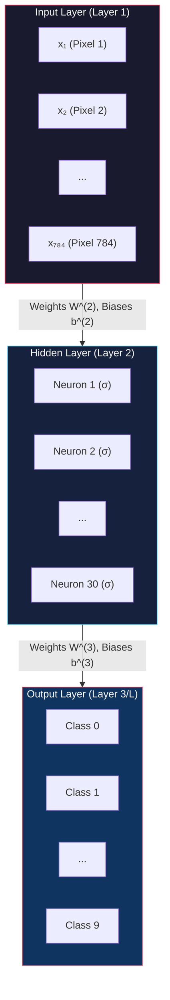

---

### 1.1 MLP Architecture and Parametric Notation

A typical Multi-Layer Perceptron consists of three fundamental structural stages:

1. **Input Layer (Layer 1):** Accepts raw sensory input from the external environment. The nodes perform no mathematical activation; they simply broadcast feature values (e.g., $28 \times 28 = 784$ pixel intensities in an MNIST digit).
2. **Hidden Layers (Layers $2 \dots L-1$):** Intermediate layers containing activation units (such as Sigmoid or ReLU) that progressively extract hierarchically richer semantic representations (edges, textures, corners, parts).
3. **Output Layer (Layer $L$):** Produces the final network prediction. In an MNIST digit recognition task, this layer contains 10 output units representing class categories from $0$ to $9$.

<figure style="display:flex; justify-content: center; margin: 20px 0;">
  

    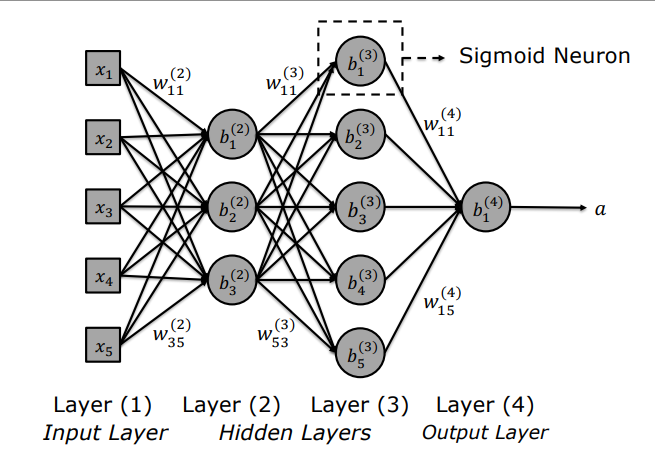
    <figcaption style="margin-top: 0.5em; text-align: center; font-size: 13px; color: #888;"><em>Figure 1: Multilayer Neural Network Anatomy: Input Layer (Layer 1), Hidden Layers (Layers 2 & 3), and Output Layer (Layer 4), where synaptic weights and biases are denoted as $w_{jk}^{(l)}$ and $b_j^{(l)}$.</em></figcaption>
  

</figure>

---

### 1.2 Michael Nielsen's MNIST Classifier Case Study

Michael Nielsen's canonical handwritten digit classification network demonstrates this layered configuration:

<figure style="display:flex; justify-content: center; margin: 20px 0;">
  

    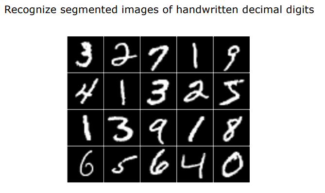
    <figcaption style="margin-top: 0.5em; text-align: center; font-size: 13px; color: #888;"><em>Figure 2: MNIST Benchmark Dataset: Segmented $28 \times 28$ grayscale decimal handwritten digit samples.</em></figcaption>
  

</figure>

- **Input Layer:** 784 neurons ($28 \times 28$ normalized pixel brightness vector).
- **Hidden Layer:** 30 neurons (fully connected).
- **Output Layer:** 10 neurons (one activation for each digit class $0$ to $9$).

<figure style="display:flex; justify-content: center; margin: 20px 0;">
  

    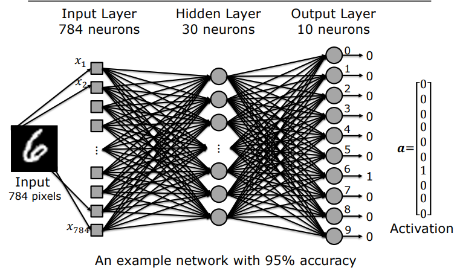
    <figcaption style="margin-top: 0.5em; text-align: center; font-size: 13px; color: #888;"><em>Figure 3: Nielsen's MNIST Network Architecture: For an input image of '6', the 6th output neuron produces $a_6 \approx 1$ while other neurons output near $0$, yielding $>95\%$ classification accuracy.</em></figcaption>
  

</figure>

#### Parameter Count Breakdown:
1. **Weights:**
   - Layer 1 to Layer 2: $784 \times 30 = 23,520$ weights
   - Layer 2 to Layer 3: $30 \times 10 = 300$ weights
   - Total Weights: $23,520 + 300 = 23,820$
2. **Biases:**
   - Hidden Layer: $30$ biases
   - Output Layer: $10$ biases
   - Total Biases: $30 + 10 = 40$
3. **Total Trainable Parameters:**
   $$\text{Total Parameters} = 23,820 + 40 = 23,860$$

---

## 2. Cost Function and Gradient Descent

A newly initialized network with random weights produces arbitrary, uncalibrated activations. Training the network entails adjusting parameters to minimize discrepancy between predicted outputs and ground-truth labels.

---

### 2.1 Desired Activations and the Mean Squared Error (MSE) Cost

For each training image $x$, ground-truth class labels are represented as one-hot encoded target vectors $\hat{\mathbf{a}}(x)$:

<figure style="display:flex; justify-content: center; margin: 20px 0;">
  

    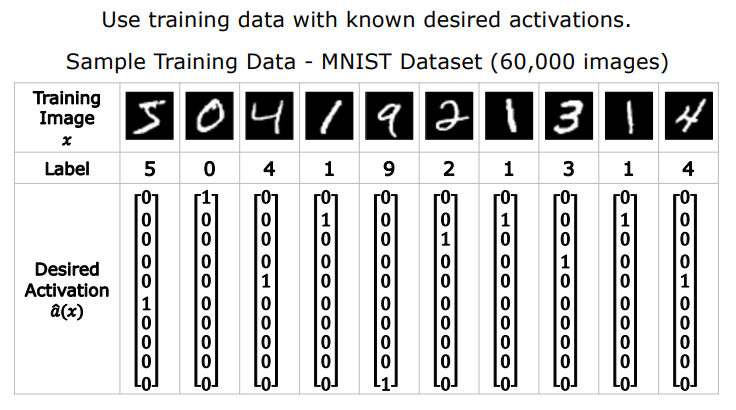
    <figcaption style="margin-top: 0.5em; text-align: center; font-size: 13px; color: #888;"><em>Figure 4: Ground Truth Training Data: MNIST training samples and their corresponding one-hot desired activation vectors $\hat{\mathbf{a}}(x)$.</em></figcaption>
  

</figure>

Prior to training, random initialization yields noisy output distributions far from ground truth:

<figure style="display:flex; justify-content: center; margin: 20px 0;">
  

    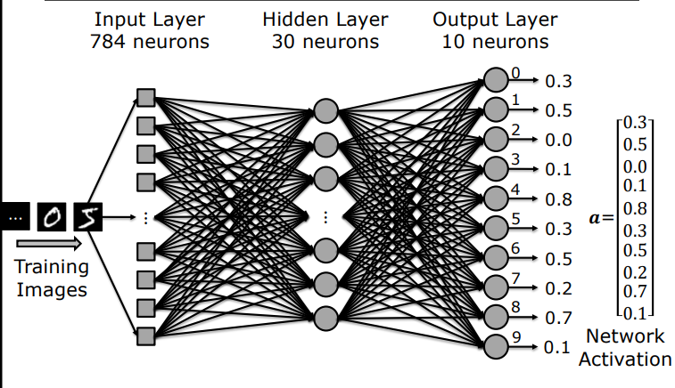
    <figcaption style="margin-top: 0.5em; text-align: center; font-size: 13px; color: #888;"><em>Figure 5: Untrained State: For an input digit '5', the random network generates $\mathbf{a} = [0.3, 0.5, 0.0, 0.1, 0.8, 0.3, 0.5, 0.2, 0.7, 0.1]^T$, diverging heavily from the target $[0,0,0,0,0,1,0,0,0,0]^T$.</em></figcaption>
  

</figure>

#### Mean Squared Error (MSE) Cost Formulation:
For an individual training sample $x$, the quadratic cost $C_x$ measures the squared Euclidean distance between network activations $\mathbf{a}(x)$ and target vector $\hat{\mathbf{a}}(x)$:

$$C_x(\mathbf{w}, \mathbf{b}) = \|\hat{\mathbf{a}}(x) - \mathbf{a}(x | \mathbf{w}, \mathbf{b})\|^2 = \sum_{j} \left( \hat{a}_j(x) - a_j^L(x) \right)^2$$

Averaged across the full training dataset ($n = 60,000$ images):

$$C(\mathbf{w}, \mathbf{b}) = \frac{1}{n} \sum_{x} C_x(\mathbf{w}, \mathbf{b})$$

<figure style="display:flex; justify-content: center; margin: 20px 0;">
  

    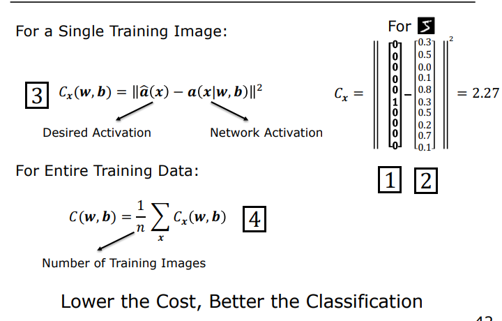
    <figcaption style="margin-top: 0.5em; text-align: center; font-size: 13px; color: #888;"><em>Figure 6: Cost Quantification: Sample loss $C_x = 2.27$ and the dataset-wide mean cost formula. Minimizing cost directly correlates with higher classification accuracy.</em></figcaption>
  

</figure>

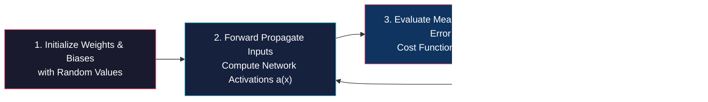

<figure style="display:flex; justify-content: center; margin: 20px 0;">
  

    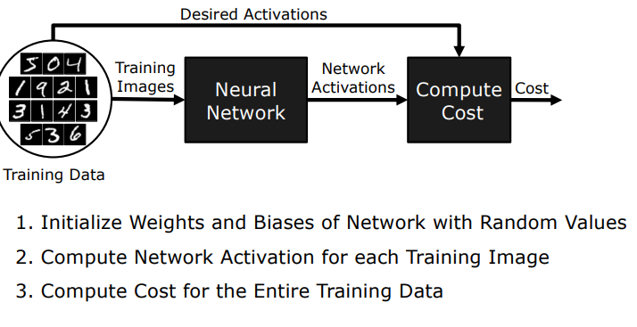
    <figcaption style="margin-top: 0.5em; text-align: center; font-size: 13px; color: #888;"><em>Figure 7: Closed-Loop Training Pipeline: Training Data $\to$ Neural Network $\to$ Compute Cost $\to$ Gradient Updates.</em></figcaption>
  

</figure>

---

### 2.2 Mathematics of Gradient Descent and the Error Surface

The objective is to locate the global or near-optimal local minimum on the 23,860-dimensional cost surface $C(\mathbf{w}, \mathbf{b})$.

<figure style="display:flex; justify-content: center; margin: 20px 0;">
  

    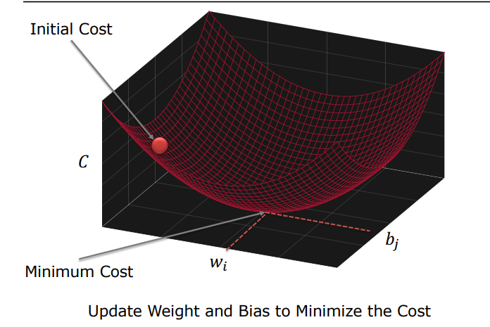
    <figcaption style="margin-top: 0.5em; text-align: center; font-size: 13px; color: #888;"><em>Figure 8: High-Dimensional Loss Surface: Navigating from a high initial random cost point down to the minimum cost basin.</em></figcaption>
  

</figure>

<figure style="display:flex; justify-content: center; margin: 20px 0;">
  

    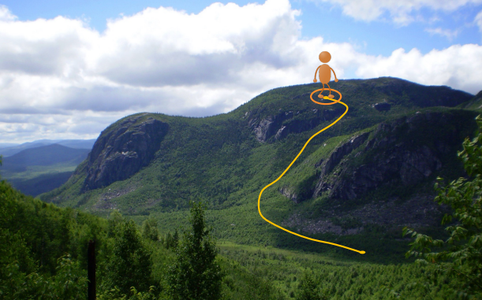
    <figcaption style="margin-top: 0.5em; text-align: center; font-size: 13px; color: #888;"><em>Figure 9: Foggy Mountain Intuition: A hiker trapped in thick fog on a peak cannot see the valley floor, but safely reaches the base by iteratively stepping in the direction of steepest local downward slope.</em></figcaption>
  

</figure>

#### Analytical Steepest Descent Derivation:
A differential parameter displacement $\Delta \mathbf{v} = [\Delta w_1, \dots, \Delta b_1, \dots]^T$ induces a first-order change in cost $\Delta C$:

$$\Delta C \approx \nabla C \cdot \Delta \mathbf{v}$$

Where $\nabla C$ is the gradient vector of partial derivatives:

$$\nabla C = \left[ \frac{\partial C}{\partial w_1}, \frac{\partial C}{\partial w_2}, \dots, \frac{\partial C}{\partial b_1}, \dots \right]^T$$

To enforce maximal decrease ($\Delta C < 0$), Cauchy-Schwarz inequality dictates selecting $\Delta \mathbf{v}$ antiparallel to $\nabla C$:

$$\Delta \mathbf{v} = -\eta \nabla C$$

Where $\eta > 0$ is the **Learning Rate**. Substituting this yields:

$$\Delta C \approx \nabla C \cdot (-\eta \nabla C) = -\eta \|\nabla C\|^2 \leq 0$$

Because $-\eta \|\nabla C\|^2$ is **strictly non-positive**, every gradient descent update step guarantees reducing or maintaining the objective loss!

<figure style="display:flex; justify-content: center; margin: 20px 0;">
  

    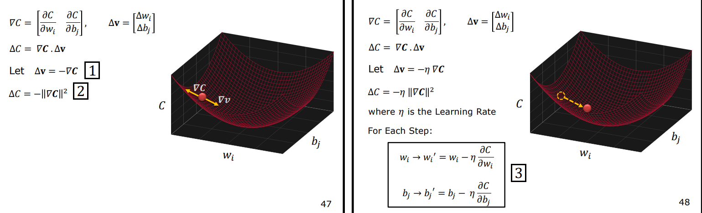
    <figcaption style="margin-top: 0.5em; text-align: center; font-size: 13px; color: #888;"><em>Figure 10: Gradient Descent Formulation: $\Delta \mathbf{v} = -\eta \nabla C \implies \Delta C = -\eta \|\nabla C\|^2$. In each step, weights and biases adjust along the negative gradient.</em></figcaption>
  

</figure>

<figure style="display:flex; justify-content: center; margin: 20px 0;">
  

    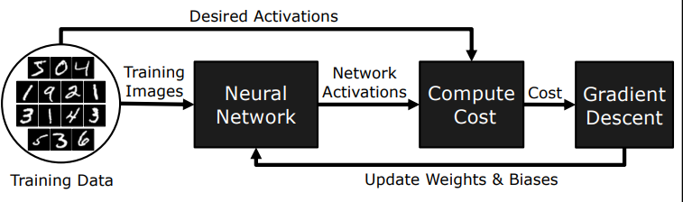
    <figcaption style="margin-top: 0.5em; text-align: center; font-size: 13px; color: #888;"><em>Figure 11: Closed-Loop Parameter Adjustment: The gradient engine iteratively steers network weights and biases toward optimal configurations.</em></figcaption>
  

</figure>

#### Parameter Update Equations:
$$w_i \leftarrow w_i - \eta \frac{\partial C}{\partial w_i}$$
$$b_j \leftarrow b_j - \eta \frac{\partial C}{\partial b_j}$$

---

### 2.3 Computational Collapse of Brute-Force Finite Differences

To execute gradient descent, we must evaluate $23,860$ partial derivatives at every iteration.

<figure style="display:flex; justify-content: center; margin: 20px 0;">
  

    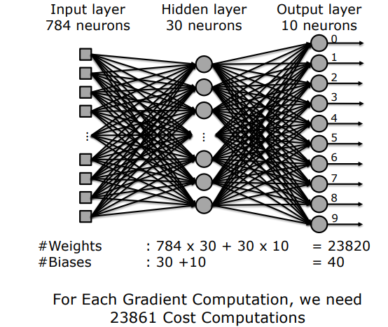
    <figcaption style="margin-top: 0.5em; text-align: center; font-size: 13px; color: #888;"><em>Figure 12: Brute-Force Complexity: Estimating gradient elements via numerical perturbations requires 23,861 complete dataset evaluations per single optimization step.</em></figcaption>
  

</figure>

Using the standard numerical **Finite Differences** approximation:

$$\frac{\partial C}{\partial w_k} \approx \frac{C(\mathbf{w} + \epsilon \mathbf{e}_k, \mathbf{b}) - C(\mathbf{w}, \mathbf{b})}{\epsilon}$$

#### Workload Quantification:
1. One image forward pass: $23,820$ multiplications.
2. Dataset evaluation ($60,000$ images) for one loss calculation $C(\mathbf{w}, \mathbf{b})$:
   $$60,000 \times 23,820 \approx 1.43 \times 10^9 \text{ multiplications}$$
3. Perturbing $23,860$ parameters individually requires evaluating the dataset **23,861 times**:
   $$\text{Workload for 1 Gradient Step} = 23,861 \times (1.43 \times 10^9) \approx \mathbf{3.4 \times 10^{13}} \text{ multiplications!}$$

> **Critical Bottleneck:** On supercomputers executing billions of operations per second, a single step would take days. Brute-force numerical differentiation is completely intractable for deep learning.

---

## 3. The Backpropagation Algorithm

The breakthrough that unlocked scalable neural network training is the **Backpropagation Algorithm**, which slashes gradient computation time by a factor of $10,000$.

---

### 3.1 Analytical Derivation via the Chain Rule

Backpropagation computes exact analytical derivatives in a single backward sweep using calculus chain rule. Let us derive the partial derivative for an output layer weight $w_{11}^{(4)}$:

<figure style="display:flex; justify-content: center; margin: 20px 0;">
  

    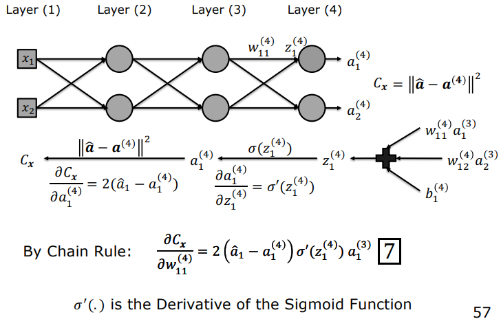
    <figcaption style="margin-top: 0.5em; text-align: center; font-size: 13px; color: #888;"><em>Figure 13: Chain Rule Dependency Path: Loss $C_x \to$ Output Activation $a_1^{(4)} \to$ Net Input $z_1^{(4)} \to$ Synaptic Weight $w_{11}^{(4)}$.</em></figcaption>
  

</figure>

Applying the chain rule:

$$\frac{\partial C_x}{\partial w_{ji}^L} = \frac{\partial C_x}{\partial a_j^L} \cdot \frac{\partial a_j^L}{\partial z_j^L} \cdot \frac{\partial z_j^L}{\partial w_{ji}^L}$$

Evaluating each factor analytically:

1. **Loss with respect to Activation:**
   $$C_x = \sum_k (a_k^L - \hat{a}_k)^2 \implies \frac{\partial C_x}{\partial a_j^L} = 2(a_j^L - \hat{a}_j)$$
2. **Activation with respect to Net Input (Sigmoid Derivative):**
   $$a_j^L = \sigma(z_j^L) \implies \frac{\partial a_j^L}{\partial z_j^L} = \sigma'(z_j^L) = \sigma(z_j^L)(1 - \sigma(z_j^L)) = a_j^L (1 - a_j^L)$$
3. **Net Input with respect to Weight:**
   $$z_j^L = \sum_k w_{jk}^L a_k^{L-1} + b_j^L \implies \frac{\partial z_j^L}{\partial w_{ji}^L} = a_i^{L-1}$$

Combining these terms:

$$\frac{\partial C_x}{\partial w_{ji}^L} = \underbrace{\left[ 2(a_j^L - \hat{a}_j) \cdot a_j^L (1 - a_j^L) \right]}_{\text{Local Gradient } \delta_j^L} \cdot a_i^{L-1}$$

---

### 3.2 Local Gradient ($\delta$) Formulation

The bracketed term defines the **Local Gradient** ($\delta_j^L$) of unit $j$ in layer $L$:

$$\delta_j^L = \frac{\partial C_x}{\partial z_j^L} = 2(a_j^L - \hat{a}_j) \cdot a_j^L (1 - a_j^L)$$

This reduces all parameter derivatives into modular two-factor products:

$$\frac{\partial C_x}{\partial w_{jk}^{(l)}} = \delta_j^{(l)} a_k^{(l-1)}$$
$$\frac{\partial C_x}{\partial b_j^{(l)}} = \delta_j^{(l)}$$

<figure style="display:flex; justify-content: center; margin: 20px 0;">
  

    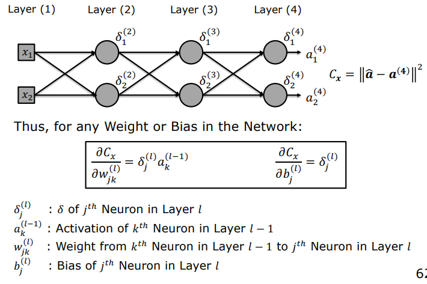
    <figcaption style="margin-top: 0.5em; text-align: center; font-size: 13px; color: #888;"><em>Figure 14: Generalized Backpropagation Equations: Any weight or bias derivative in layer $l$ evaluates as the product of that layer's local error $\delta_j^{(l)}$ and the upstream activation $a_k^{(l-1)}$.</em></figcaption>
  

</figure>

#### Backward Propagation of Errors to Hidden Layers:
Given downstream errors $\delta^{l+1}$, the error $\delta^l$ at hidden layer $l$ propagates backward through the transpose weight matrix:

$$\delta_j^l = \left( \sum_k \delta_k^{l+1} w_{kj}^{l+1} \right) a_j^l (1 - a_j^l)$$

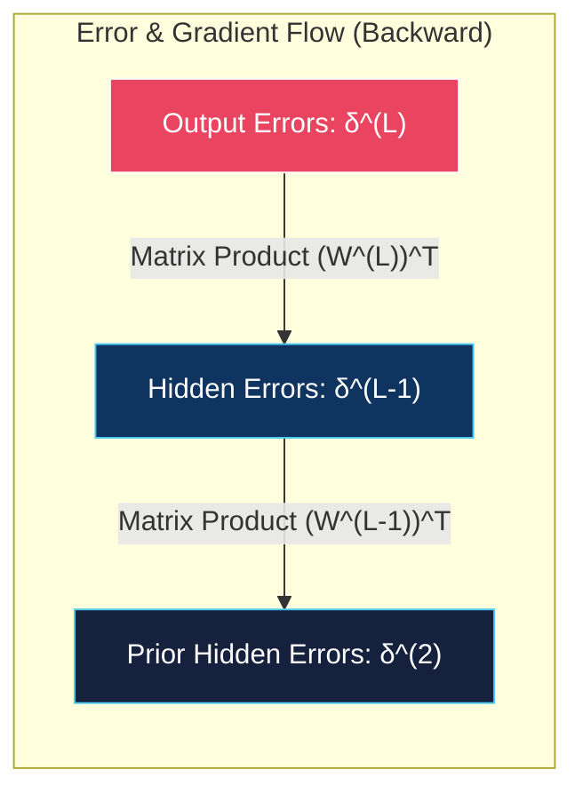

---

### 3.3 Complexity Comparison Matrix

| Optimization Method | Multiplications per Sample | Total Workload for 60,000 Images (1 Iteration) | Relative Speedup |
| :--- | :---: | :---: | :---: |
| **Finite Differences** | $23,861 \times 23,820 \approx 5.68 \times 10^8$ | $\mathbf{3.4 \times 10^{13}} \text{ operations}$ | $1\times$ (Baseline - Intractable) |
| **Backpropagation** | $23,820 \text{ (Forward)} + 24,210 \text{ (Backward)} = 48,030$ | $\mathbf{2.8 \times 10^9} \text{ operations}$ | $\mathbf{\approx 10,000\times \text{ Faster!}}$ |

> **Summary:** Backpropagation slashes gradient complexity by 4 orders of magnitude ($10^4$), turning impossible multi-day computations into sub-second matrix passes.

---

## 4. Example Applications in Computer Vision

---

### 4.1 Handwritten Digit Recognition (MNIST)

Trained MLPs correctly classify heavily stylized and noisy digits with high confidence:

<figure style="display:flex; justify-content: center; margin: 20px 0;">
  

    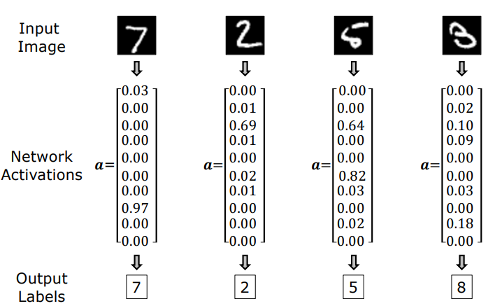
    <figcaption style="margin-top: 0.5em; text-align: center; font-size: 13px; color: #888;"><em>Figure 15: MNIST Classification Performance: Unseen test digits and their corresponding output activation distributions correctly predicting labels 7, 2, 5, and 8.</em></figcaption>
  

</figure>

---

### 4.2 Convolutional Neural Networks (LeNet / CNNs)

In early computer vision, spatial feature extractors (e.g., Sobel or Gaussian filters) were handcrafted. In **Yann LeCun's (1998)** Convolutional Neural Networks:

1. Kernel filter coefficients ($k_1 \dots k_5$) serve as **trainable network weights**.
2. Backpropagation automatically learns optimal spatial visual filters tailored to the visual task.

<figure style="display:flex; justify-content: center; margin: 20px 0;">
  

    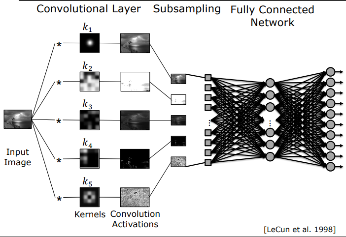
    <figcaption style="margin-top: 0.5em; text-align: center; font-size: 13px; color: #888;"><em>Figure 16: Convolutional Neural Network (CNN): Convolutional Layer with learned kernels $k_1 \dots k_5$, Subsampling/Pooling, and a Fully Connected classification stage [LeCun et al. 1998].</em></figcaption>
  

</figure>

---

### 4.3 Multi-Label Semantic Tagging (Clarifai)

Modern deep networks extract rich multi-concept descriptors from unconstrained visual scenes:

<figure style="display:flex; justify-content: center; margin: 20px 0;">
  

    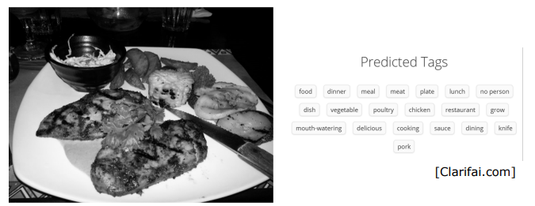
    <figcaption style="margin-top: 0.5em; text-align: center; font-size: 13px; color: #888;"><em>Figure 17: Semantic Tagging: A food scene classified into simultaneous multi-label semantic attributes ('food', 'dinner', 'meat', 'chicken', 'sauce', 'restaurant', etc.) [Clarifai.com].</em></figcaption>
  

</figure>

---

## 5. When to Use Machine Learning?

While deep neural networks are remarkably versatile, applying machine learning to phenomena governed by well-known physical laws introduces unnecessary computational overhead and opacity.

---

### 5.1 First Principles vs. Data-Driven ML

Consider calculating the displacement $s$ of a falling body over time $t$:

- **First Principles (Newtonian Physics):**
  $$s = ut + \frac{1}{2}at^2$$
  Requires zero training data, evaluates instantly, and delivers foundational physical insight ($a = \text{gravity}$).
- **Data-Driven ML:**
  Dropping hundreds of balls, logging noisy time records, and fitting thousands of parameters with stochastic gradient descent.

#### Drawbacks of Pure ML in Closed-Physics Regimes:
1. **Computational & Resource Inefficiency:** Massive data collection and GPU cycles are wasted relearning a known exact formula.
2. **Zero Scientific Insight (Black-Box):** The network models input-output correlation without conveying physical understanding of gravitational mechanics.
3. **The Last Mile Problem:** Pure data models reach $90-95\%$ accuracy quickly, but attaining the $99.99\%$ reliability required by safety-critical vision systems demands increasingly prohibitive data collection.

---

### 5.2 Decision Matrix: First Principles vs. Machine Learning

| Decision Dimension | First Principles (Analytical / Physics) | Machine Learning (Data-Driven) |
| :--- | :--- | :--- |
| **Process Determinism** | Governed by well-defined optical and geometric laws (perspective projection, photometric stereo, camera calibration). | The underlying process exhibits extreme stochastic variation or intractable complexity (handwriting, general faces). |
| **Explainability** | Fully transparent, mathematically provable, and physically interpretable. | Opaque black-box; decisions emerge from millions of distributed weight interactions. |
| **Data Requirement** | Zero training data; analytical formulas execute immediately. | Requires thousands or millions of cleaned, annotated training samples. |
| **Computational Footprint** | Lightweight, runs deterministically on standard CPUs. | Demands intensive GPU/TPU training clusters and long convergence runs. |

> **Golden Engineering Rule (Symbiotic Coexistence):** The most robust computer vision systems leverage first principles as far as analytical modeling permits, and transition to machine learning precisely where hand-crafted physical rules reach their descriptive limit.
