# Foundations of Neural Networks: Perceptron and Activation Functions

<!-- toc -->

This lecture note covers the initial foundation of Neural Networks in computer vision and artificial intelligence—from biological inspirations to Frank Rosenblatt's Perceptron model, the geometry of linear decision boundaries, universality proofs via NAND gates, and the mathematical necessity of non-linear activation functions.

---

## 1. Overview and Biological Inspiration

### 1.1 Limits of Classical Vision and Complex Visual Mappings

In computer vision, many tasks such as edge detection, camera calibration, stereo reconstruction, or photometric stereo can be resolved using deterministic algorithms derived directly from optical and physical first principles. However, tasks that human visual perception solves effortlessly pose immense challenges for hand-crafted deterministic rules:

1. **Handwritten Digit Recognition (MNIST):** Variations across individuals writing the same digit (e.g., "5" or "6") exhibit immense structural diversity in stroke width, slant, ink thickness, and aspect ratio. No static geometric template or fixed linear filter set can reliably generalize across these variations.
2. **General Object Categorization (e.g., Chairs & Human Faces):** All chairs serve the same functional purpose, yet office chairs, dining chairs, and rocking chairs possess completely distinct 3D geometries and 2D pixel projections. Similarly, human faces vary across age, gender, ethnicity, pose, and illumination, making rule-based deterministic parsing intractable.

<figure style="display:flex; justify-content: center; margin: 20px 0;">
  

    
    <figcaption style="margin-top: 0.5em; text-align: center; font-size: 13px; color: #888;"><em>Figure 1: High Visual Diversity: Complex appearance distributions across faces and objects demand learning-based paradigms beyond rigid linear templates (SVM, PCA, etc.).</em></figcaption>
  

</figure>

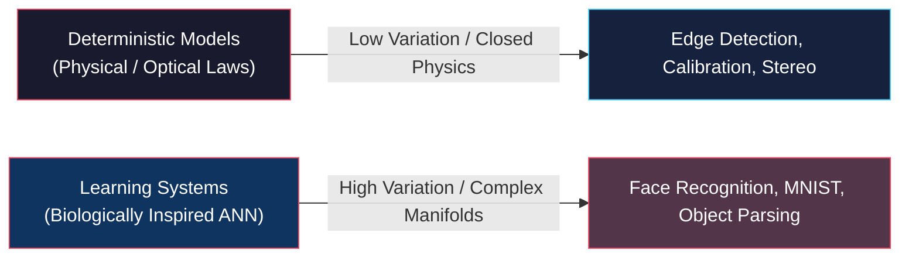

---

### 1.2 Biological Neuron Architecture and the Brain

The human brain processes these complex non-linear visual mappings in fractions of a second. This remarkable capability emerges from a massively parallel interconnected network of billions of biological neurons, each performing simple electrochemical integrations:

- **Human Brain:** Weighs approximately $1.5\text{ kg}$ ($3.3\text{ lbs}$) with a volume of around $1260\text{ cm}^3$.
- **Computational Scale:** Contains roughly **100 Billion ($10^{11}$)** neurons and **100 Trillion ($10^{14}$)** synaptic interconnections.

<figure style="display:flex; justify-content: center; margin: 20px 0;">
  

    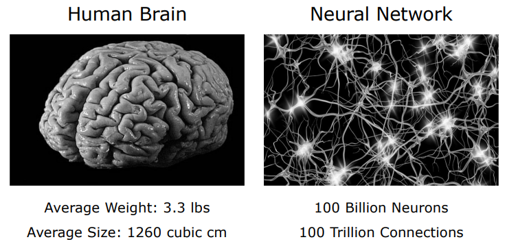
    <figcaption style="margin-top: 0.5em; text-align: center; font-size: 13px; color: #888;"><em>Figure 2: Biological Computing Scale: The human brain structure comprising 100 billion neurons and 100 trillion synaptic connections.</em></figcaption>
  

</figure>

The principal anatomical building blocks of a biological neuron include:

1. **Dendrites & Dendritic Branches:** Receptive branching fibers that collect electrochemical incoming signals from upstream neurons.
2. **Cell Body / Nucleus (Soma):** Aggregates incoming inputs and determines the net membrane potential.
3. **Axon:** A single conductive transmission cable that propagates an electrical action potential (spike) when the internal threshold is exceeded.
4. **Synaptic Terminals (Synapses):** Junction points that modulate signal transmission to target dendrites via neurotransmitters. The conductivity of each synapse defines the connection "strength" (weight).

<figure style="display:flex; justify-content: center; margin: 20px 0;">
  

    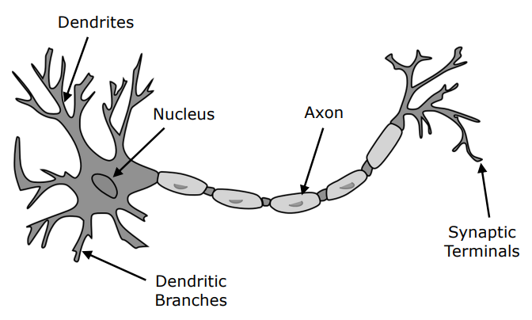
    <figcaption style="margin-top: 0.5em; text-align: center; font-size: 13px; color: #888;"><em>Figure 3: Biological Neuron Anatomy: Dendrites (inputs), Cell Nucleus/Soma (summation/integration), Axon (signal transmission), and Synaptic Terminals (output junctions).</em></figcaption>
  

</figure>

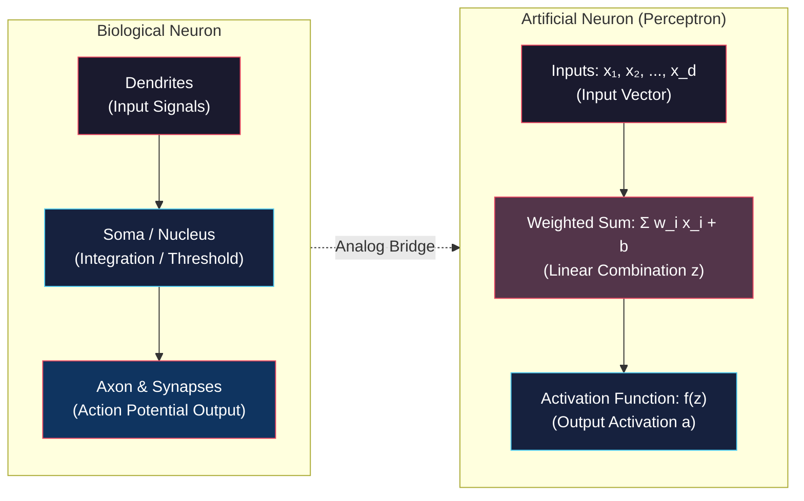

---

## 2. Perceptron (Single-Layer Receiver)

The fundamental computational unit of artificial neural networks is the **Perceptron**. Introduced by **Frank Rosenblatt (1958)** at Cornell Aeronautical Laboratory, it was the first algorithmic model capable of learning binary classification boundaries from sample data.

---

### 2.1 Mathematical Formulation

A perceptron takes $d$ independent inputs $x_1, x_2, \dots, x_d$. Each input is scaled by an associated weight $w_1, w_2, \dots, w_d$, reflecting its relative significance. A constant **bias** term $b$ (or $-\text{threshold}$) is added to provide translational degrees of freedom to the boundary.

<figure style="display:flex; justify-content: center; margin: 20px 0;">
  

    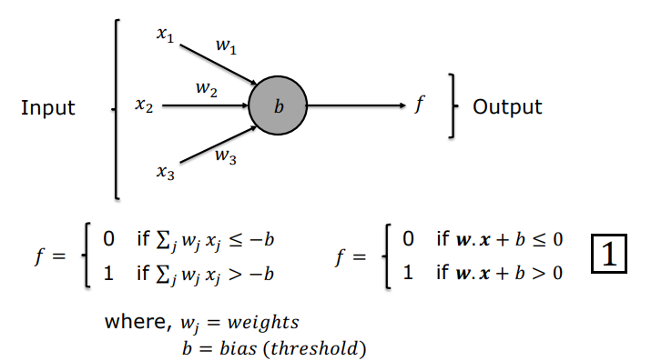
    <figcaption style="margin-top: 0.5em; text-align: center; font-size: 13px; color: #888;"><em>Figure 4: Perceptron Computational Unit: Weighted sum of inputs plus bias passed through a thresholding step function.</em></figcaption>
  

</figure>

The net internal linear aggregation $z$ is formulated as an inner product:

$$z = \sum_{j=1}^d w_j x_j + b = \mathbf{w}^T \mathbf{x} + b$$

Where:
- $\mathbf{w} = [w_1, w_2, \dots, w_d]^T$ : Weight vector.
- $\mathbf{x} = [x_1, x_2, \dots, x_d]^T$ : Input vector.
- $b$ : Bias parameter.

The final output activation $a$ is produced by applying a sharp **Heaviside (Step)** activation function:

$$a = f(z) = \begin{cases} 1, & \text{if } z > 0 \quad (\mathbf{w}^T \mathbf{x} + b > 0) \\ 0, & \text{if } z \leq 0 \quad (\mathbf{w}^T \mathbf{x} + b \leq 0) \end{cases}$$

<figure style="display:flex; justify-content: center; margin: 20px 0;">
  

    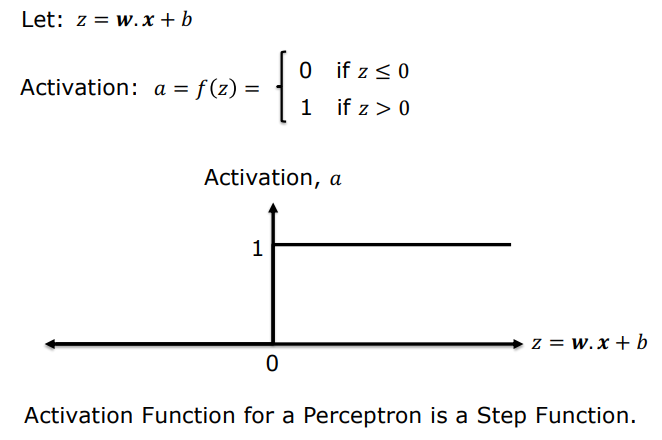
    <figcaption style="margin-top: 0.5em; text-align: center; font-size: 13px; color: #888;"><em>Figure 5: Step (Heaviside) Activation Function: Produces $0$ for $z \leq 0$ and $1$ for $z > 0$.</em></figcaption>
  

</figure>

---

### 2.2 Decision Weighting Scenario (Movie Going Decision)

To demonstrate how weights prioritize competing factors in human decision-making, consider the decision: *"Will you go to the movies?"*

Let the decision depend on three binary conditions:
- $x_1 = 1$ (Weather is good), $x_1 = 0$ (Weather is bad)
- $x_2 = 1$ (A friend joins), $x_2 = 0$ (Alone)
- $x_3 = 1$ (Cinema is nearby), $x_3 = 0$ (Cinema is far away)

<figure style="display:flex; justify-content: center; margin: 20px 0;">
  

    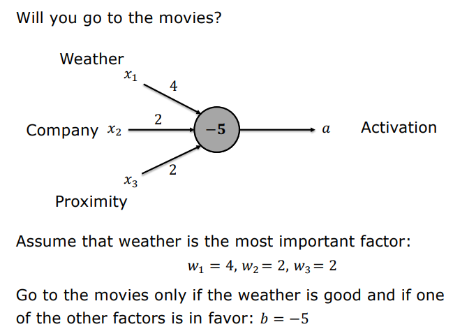
    <figcaption style="margin-top: 0.5em; text-align: center; font-size: 13px; color: #888;"><em>Figure 6: Priority Decision Modeling: If good weather is an absolute requirement, $w_1 = 4, w_2 = 2, w_3 = 2$, and $b = -5$.</em></figcaption>
  

</figure>

Setting weather as the dominant prerequisite implies choosing $w_1$ substantially larger than other weights:

- **Parameters:** $w_1 = 4$ (Weather), $w_2 = 2$ (Company), $w_3 = 2$ (Proximity), $b = -5$.

**Scenario Evaluation:**
1. **Bad Weather ($x_1 = 0$), all other conditions favorable ($x_2 = 1, x_3 = 1$):**
   $$z = (4 \cdot 0) + (2 \cdot 1) + (2 \cdot 1) - 5 = 4 - 5 = -1$$
   $z \leq 0 \implies a = 0$ (Do not go to the movies). Bad weather overrides both company and proximity.
2. **Good Weather ($x_1 = 1$), friend accompanies ($x_2 = 1$), cinema is far ($x_3 = 0$):**
   $$z = (4 \cdot 1) + (2 \cdot 1) + (2 \cdot 0) - 5 = 6 - 5 = +1$$
   $z > 0 \implies a = 1$ (Go to the movies).

---

### 2.3 Decision Boundary Geometry and Linear Separability

Consider a 2D input space $(x_1, x_2)$ with weights $w_1 = -2, w_2 = -2$ and bias $b = 3$.

The net aggregation line equation is:
$$z = -2x_1 - 2x_2 + 3$$

Setting $z = 0$ defines the **Decision Boundary**:

$$-2x_1 - 2x_2 + 3 = 0 \implies x_2 = -x_1 + 1.5$$

<figure style="display:flex; justify-content: center; margin: 20px 0;">
  

    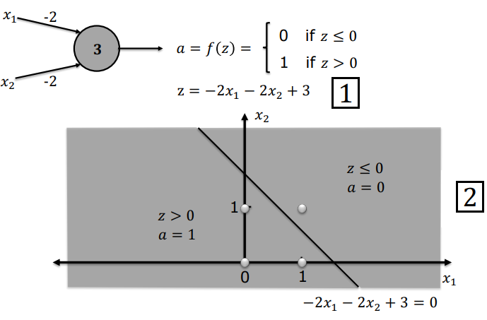
    <figcaption style="margin-top: 0.5em; text-align: center; font-size: 13px; color: #888;"><em>Figure 7: 2D Linear Classifier Geometry: The line $-2x_1 - 2x_2 + 3 = 0$ bisects the plane into two half-spaces ($z > 0 \implies a=1$ and $z \leq 0 \implies a=0$).</em></figcaption>
  

</figure>

- Points lying in the lower-left half-plane yield $z > 0 \implies a = 1$.
- Points lying on or in the upper-right half-plane yield $z \leq 0 \implies a = 0$.

> **Linear Separability Definition:** A single perceptron is fundamentally a **Linear Classifier**, carving a $d$-dimensional space into two halves using a $(d-1)$-dimensional flat hyperplane ($\mathbf{w}^T \mathbf{x} + b = 0$).

---

### 2.4 Minsky & Papert's (1969) XOR Proof and the AI Winter

While single perceptrons easily separate AND, OR, and NAND functions, they cannot separate the **Exclusive-OR (XOR)** pattern.

| $x_1$ | $x_2$ | $x_1 \text{ XOR } x_2$ |
| :---: | :---: | :---: |
| 0 | 0 | **0** |
| 0 | 1 | **1** |
| 1 | 0 | **1** |
| 1 | 1 | **0** |

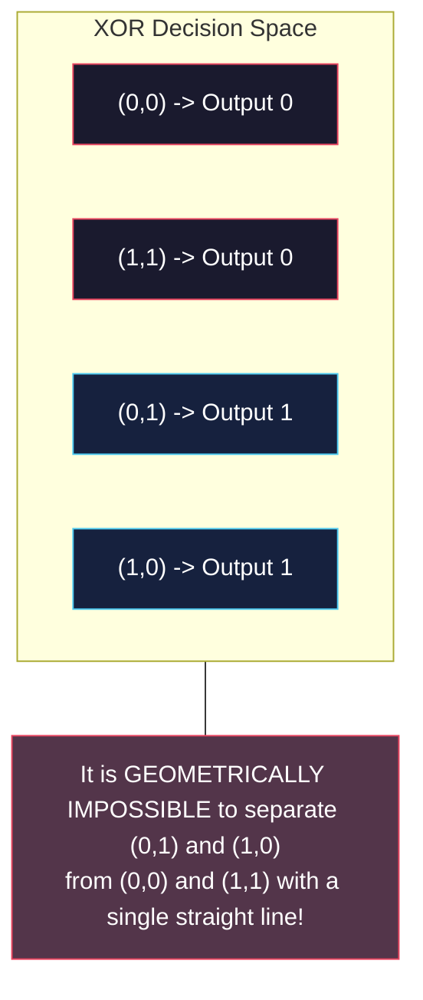

**Analytical Proof of Infeasibility:**
For a perceptron to classify XOR correctly, all four conditions must hold simultaneously:
1. $(0,0) \implies b \leq 0$
2. $(0,1) \implies w_2 + b > 0$
3. $(1,0) \implies w_1 + b > 0$
4. $(1,1) \implies w_1 + w_2 + b \leq 0$

Summing (2) and (3):
$$w_1 + w_2 + 2b > 0 \implies (w_1 + w_2 + b) + b > 0$$

From (1), $b \leq 0 \implies -b \geq 0$. Thus $w_1 + w_2 + b > -b \geq 0$, giving $w_1 + w_2 + b > 0$. This directly contradicts inequality (4) ($w_1 + w_2 + b \leq 0$).

> **Historical Impact (AI Winter):** In 1969, Marvin Minsky and Seymour Papert published *"Perceptrons"*, mathematically formalizing the linear limitations of single-layer models. Because general methods to train multi-layer perceptrons were unknown at the time, funding for neural network research collapsed, precipitating the first **AI Winter**.

---

## 3. Perceptron Networks and Universality

Connecting multiple perceptrons in parallel and hierarchical layers constructs non-linear, multi-faceted decision boundaries.

---

### 3.1 Constructing Complex and Closed Decision Regions

To isolate points inside a closed convex polygonal region in 2D space:

1. **First Layer (Boundary Edges):** Dedicates one perceptron to each boundary line segment (e.g., 4 perceptrons for a quadrangle). Each unit outputs $1$ on the valid side of its bounding line.
2. **Output Layer (Logical AND / Intersection):** The outputs of all 4 edge perceptrons feed into a single output perceptron with weights $\mathbf{w} = [2, 2, 2, 2]^T$ and bias $b = -7$.

<figure style="display:flex; justify-content: center; margin: 20px 0;">
  

    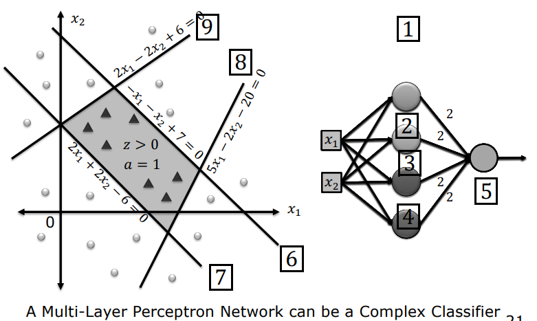
    <figcaption style="margin-top: 0.5em; text-align: center; font-size: 13px; color: #888;"><em>Figure 8: Complex Decision Boundary with Multi-Layer Network: Four linear boundaries combine in a second layer to isolate an interior convex polygonal region.</em></figcaption>
  

</figure>

- If any single edge test fails ($0$), the maximum sum is $2 \times 3 = 6$, giving $z = 6 - 7 = -1 \leq 0 \implies a = 0$.
- Only when all 4 edge perceptrons fire simultaneously ($1$) does the sum reach $8$, yielding $z = 8 - 7 = +1 > 0 \implies a = 1$.

---

### 3.2 Proof of Perceptron as a Universal NAND Gate

Consider a 2-input perceptron with $w_1 = -2, w_2 = -2$, and $b = 3$:

| $x_1$ | $x_2$ | $z = -2x_1 - 2x_2 + 3$ | Output $a = f(z)$ | Logical Equivalent |
| :---: | :---: | :---: | :---: | :---: |
| 0 | 0 | $-2(0) - 2(0) + 3 = +3 > 0$ | **1** | $\text{NAND}(0,0) = 1$ |
| 0 | 1 | $-2(0) - 2(1) + 3 = +1 > 0$ | **1** | $\text{NAND}(0,1) = 1$ |
| 1 | 0 | $-2(1) - 2(0) + 3 = +1 > 0$ | **1** | $\text{NAND}(1,0) = 1$ |
| 1 | 1 | $-2(1) - 2(1) + 3 = -1 \leq 0$ | **0** | $\text{NAND}(1,1) = 0$ |

<figure style="display:flex; justify-content: center; margin: 20px 0;">
  

    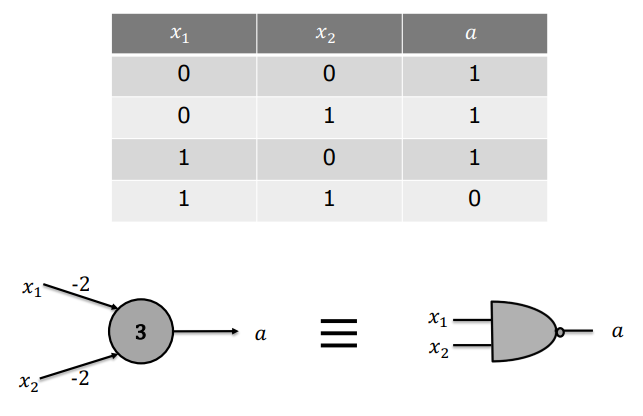
    <figcaption style="margin-top: 0.5em; text-align: center; font-size: 13px; color: #888;"><em>Figure 9: Perceptron as a NAND Gate: Truth table and digital schematic equivalence.</em></figcaption>
  

</figure>

#### Universality of Computation Proof
In digital logic design, the **NAND** gate is a **Universal Logic Gate**. Any combinatorial digital function—including NOT, AND, OR, NOR, and XOR—can be realized purely by wiring NAND gates together.

<figure style="display:flex; justify-content: center; margin: 20px 0;">
  

    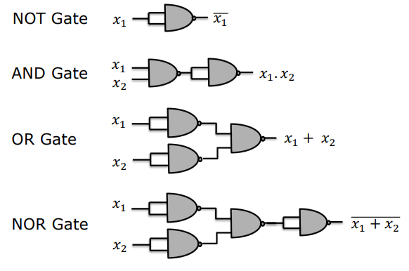
    <figcaption style="margin-top: 0.5em; text-align: center; font-size: 13px; color: #888;"><em>Figure 10: Universality of NAND: Constructing NOT, AND, OR, and NOR gates using only NAND logic.</em></figcaption>
  

</figure>

Because a single perceptron replicates a NAND gate:
1. Any arbitrary digital computing architecture (ALU, registers, CPU) can be mathematically built as a network of perceptrons.
2. For instance, a 1-bit binary adder producing **Sum ($\text{Sum} = x_1 \oplus x_2$)** and **Carry ($\text{Carry} = x_1 x_2$)** bits translates directly into an equivalent perceptron network.

<figure style="display:flex; justify-content: center; margin: 20px 0;">
  

    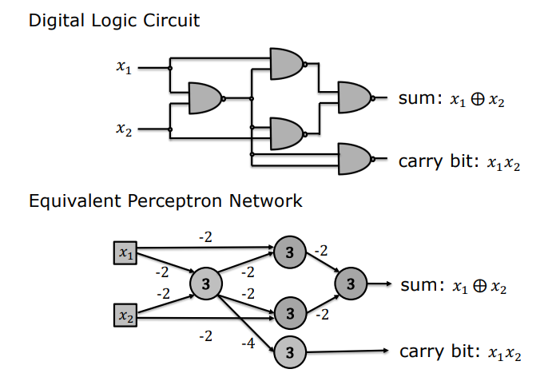
    <figcaption style="margin-top: 0.5em; text-align: center; font-size: 13px; color: #888;"><em>Figure 11: Digital Circuit to Perceptron Network: Equivalence between a standard 1-bit adder circuit and its layered perceptron implementation.</em></figcaption>
  

</figure>

---

### 3.3 Bridge to Multilayer Network Architectures

Although perceptron networks possess theoretical computational universality, training them automatically on real-world continuous data requires structured matrix notations across layers.

<figure style="display:flex; justify-content: center; margin: 20px 0;">
  

    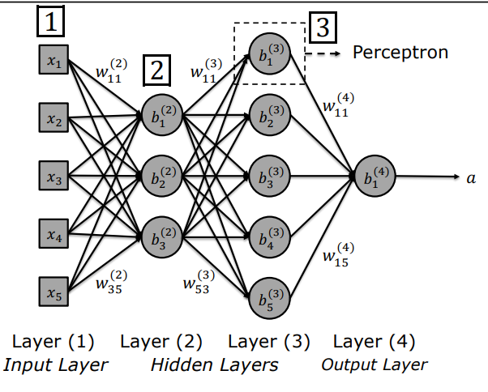
    <figcaption style="margin-top: 0.5em; text-align: center; font-size: 13px; color: #888;"><em>Figure 12: Multilayer Network Architecture: Input Layer (Layer 1), Hidden Layers (Layer 2 & 3), and Output Layer (Layer 4), with weight indices $w_{jk}^{(l)}$ and bias indices $b_j^{(l)}$.</em></figcaption>
  

</figure>

---

## 4. Activation Functions

Despite the theoretical universality of perceptron circuits, training deep networks via gradient-based optimization is impossible with discrete step functions.

---

### 4.1 Step Function Limitations and the Training Crisis

During training, we want small perturbations in parameter values ($\Delta w$ and $\Delta b$) to produce small, measurable changes in output activation ($\Delta a$):

$$\Delta a \approx \frac{\partial a}{\partial w} \Delta w$$

In step-activated perceptrons, this differential feedback is destroyed:

1. **Zero Gradient / Blind Region ($\Delta a = 0$):** If a neuron has $z \leq 0$, perturbing a weight by $\Delta w$ keeps $z + \Delta z \leq 0$, causing zero change in output ($0 \to 0$, hence $\Delta a = 0$). Because the derivative is zero almost everywhere, gradient descent receives zero signal regarding which direction to adjust weights.
2. **Infinite Instability / Step Discontinuity:** At the boundary $z = 0$, an infinitesimal change causes output to violently flip $0 \to 1$. Such discontinuous leaps prevent smooth, gradual parameter convergence.

<figure style="display:flex; justify-content: center; margin: 20px 0;">
  

    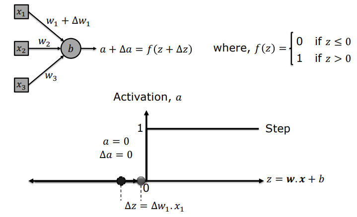
    <figcaption style="margin-top: 0.5em; text-align: center; font-size: 13px; color: #888;"><em>Figure 13: Step Function Training Crisis: A parameter shift $\Delta w$ changes internal sum $\Delta z$ but yields $\Delta a = 0$, completely halting derivative-based learning.</em></figcaption>
  

</figure>

---

### 4.2 The Sigmoid Neuron

To enable continuous gradient-based learning, the discontinuous step function is replaced by the smooth, differentiable **Sigmoid Activation Function** ($\sigma$).

Mathematical Definition:
$$\sigma(z) = \frac{1}{1 + e^{-z}}$$

<figure style="display:flex; justify-content: center; margin: 20px 0;">
  

    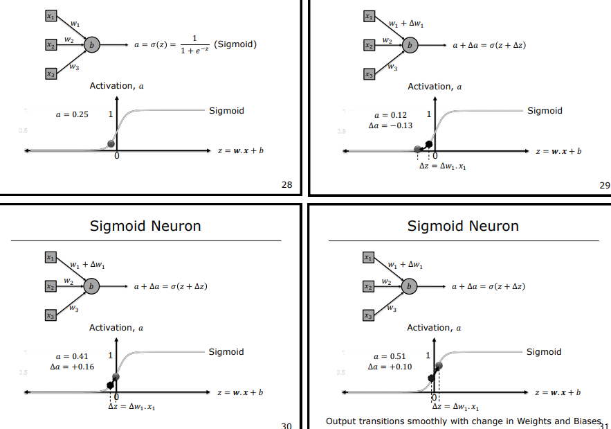
    <figcaption style="margin-top: 0.5em; text-align: center; font-size: 13px; color: #888;"><em>Figure 14: Sigmoid Neuron: Small perturbations in weights and biases produce predictable, smooth continuous shifts in output activation ($\Delta a$).</em></figcaption>
  

</figure>

**Key Properties:**
1. **Continuous Range:** $a \in (0, 1)$, enabling probabilistic interpretations of neuron confidence.
2. **Differentiability:** A small change in weights produces a proportional, first-order Taylor approximation response:
   $$\Delta a \approx \sum_j \frac{\partial \sigma}{\partial w_j} \Delta w_j + \frac{\partial \sigma}{\partial b} \Delta b$$

**Analytical Derivative Derivation:**
$$\sigma'(z) = \frac{d}{dz}\left[(1 + e^{-z})^{-1}\right] = -(1 + e^{-z})^{-2} \cdot (-e^{-z}) = \frac{e^{-z}}{(1 + e^{-z})^2}$$
$$\sigma'(z) = \frac{1}{1 + e^{-z}} \cdot \frac{e^{-z}}{1 + e^{-z}} = \sigma(z) \cdot (1 - \sigma(z))$$

This elegant identity ($\sigma'(z) = \sigma(z)(1 - \sigma(z))$) drastically speeds up backpropagation calculations by reusing forward activation values.

---

### 4.3 Why Non-Linear Activation is Mandatory

It is insufficient for an activation function to merely be continuous; it must be strictly **non-linear**.

**Mathematical Proof (Collapse of Linear Layers):**
Suppose an activation function is purely linear: $f(z) = c \cdot z$. Without loss of generality, let $c = 1$ ($f(z) = z$).

In an $L$-layer network:
- Layer 1: $\mathbf{a}^{(1)} = \mathbf{W}^{(1)} \mathbf{x} + \mathbf{b}^{(1)}$
- Layer 2: $\mathbf{a}^{(2)} = \mathbf{W}^{(2)} \mathbf{a}^{(1)} + \mathbf{b}^{(2)} = \mathbf{W}^{(2)}(\mathbf{W}^{(1)} \mathbf{x} + \mathbf{b}^{(1)}) + \mathbf{b}^{(2)} = (\mathbf{W}^{(2)}\mathbf{W}^{(1)})\mathbf{x} + (\mathbf{W}^{(2)}\mathbf{b}^{(1)} + \mathbf{b}^{(2)})$
- Defining lumped parameters: $\mathbf{W}' = \mathbf{W}^{(2)}\mathbf{W}^{(1)}$ and $\mathbf{b}' = \mathbf{W}^{(2)}\mathbf{b}^{(1)} + \mathbf{b}^{(2)}$.
- Thus: $\mathbf{a}^{(2)} = \mathbf{W}' \mathbf{x} + \mathbf{b}'$

> **Crucial Theorem:** Regardless of having 2 or 1000 hidden layers, linear activations collapse the entire deep network into a **single linear transformation**. Such an architecture cannot solve even the XOR problem. Non-linear activations empower neural networks to warp complex geometric feature spaces into linearly separable configurations (**Universal Approximation Theorem**).

---

### 4.4 Comparative Analysis of Modern Activation Functions

```mermaid
flowchart LR
    Step["Step (Heaviside)\nBinary {0,1}\nDerivative = 0"]
    Sigmoid["Sigmoid σ(z)\nRange (0,1)\nVanishing Gradient"]
    Tanh["Tanh(z)\nRange (-1,1)\nZero-Centered"]
    ReLU["ReLU: max(0,z)\nRange [0, ∞)\nFast / No Saturation"]
    LeakyReLU["Leaky ReLU\nRange (-∞, ∞)\nPrevents Dying Neurons"]

    Step -->|"Smoothing"| Sigmoid
    Sigmoid -->|"Zero-Centering"| Tanh
    Tanh -->|"Deep Network Scale"| ReLU
    ReLU -->|"Negative Slope"| LeakyReLU

    style Step fill:#1a1a2e,stroke:#e94560,color:#fff
    style Sigmoid fill:#16213e,stroke:#4cc9f0,color:#fff
    style Tanh fill:#0f3460,stroke:#e94560,color:#fff
    style ReLU fill:#53354a,stroke:#e94560,color:#fff
    style LeakyReLU fill:#16213e,stroke:#4cc9f0,color:#fff
```

#### 1. Hyperbolic Tangent (Tanh)
- **Formula:** $\tanh(z) = \frac{e^z - e^{-z}}{e^z + e^{-z}} = 2\sigma(2z) - 1$
- **Output Range:** $(-1, 1)$
- **Derivative:** $\tanh'(z) = 1 - \tanh^2(z)$
- **Advantage:** **Zero-centered**, preventing systematic zig-zag gradient dynamics during optimization.
- **Limitation:** Suffers from **Vanishing Gradients** at saturated extremes ($|z| > 3$).

#### 2. ReLU (Rectified Linear Unit)
- **Formula:** $f(z) = \max(0, z)$
- **Output Range:** $[0, \infty)$
- **Derivative:** $f'(z) = \begin{cases} 1, & z > 0 \\ 0, & z < 0 \end{cases}$
- **Advantage:** Constant non-saturating derivative ($1$) in the positive regime, mitigating vanishing gradients and computing with exceptional efficiency.
- **Limitation (Dying ReLU):** Neurons with inputs $z < 0$ produce zero gradients and may permanently deactivate.

#### 3. Leaky ReLU
- **Formula:** $f(z) = \max(\alpha z, z) \quad (0 < \alpha \ll 1, \text{typically } \alpha = 0.01)$
- **Output Range:** $(-\infty, \infty)$
- **Derivative:** $f'(z) = \begin{cases} 1, & z > 0 \\ \alpha, & z < 0 \end{cases}$
- **Advantage:** Maintains a small non-zero slope $\alpha$ in the negative regime, guaranteeing gradient flow and preventing permanently dead units.

---

## 5. Technical Comparison Matrix

| Activation Function | Formula | Output Range | Derivative $f'(z)$ | Key Strength | Primary Limitation |
| :--- | :--- | :---: | :--- | :--- | :--- |
| **Heaviside (Step)** | $f(z) = \begin{cases} 1, & z > 0 \\ 0, & z \leq 0 \end{cases}$ | $\{0, 1\}$ | $0 \quad (\forall z \neq 0)$ | Simple digital gate logic and NAND emulation | Zero gradient everywhere; unsuitable for gradient descent optimization |
| **Sigmoid** | $\sigma(z) = \frac{1}{1 + e^{-z}}$ | $(0, 1)$ | $\sigma(z)(1 - \sigma(z))$ | Smooth differentiability and probabilistic output interpretation | **Vanishing Gradient** in saturated regions; non-zero centered |
| **Tanh** | $f(z) = \frac{e^z - e^{-z}}{e^z + e^{-z}}$ | $(-1, 1)$ | $1 - f(z)^2$ | **Zero-centered** outputs facilitating faster parameter convergence | Saturated extremes cause **Vanishing Gradient** |
| **ReLU** | $f(z) = \max(0, z)$ | $[0, \infty)$ | $\begin{cases} 1, & z > 0 \\ 0, & z < 0 \end{cases}$ | Very fast evaluation; avoids gradient saturation for positive activations | **Dying ReLU** when units become persistently negative |
| **Leaky ReLU** | $f(z) = \max(\alpha z, z)$ | $(-\infty, \infty)$ | $\begin{cases} 1, & z > 0 \\ \alpha, & z < 0 \end{cases}$ | Preserves continuous gradient flow on the negative axis | Hyperparameter $\alpha$ tuning requirement |
