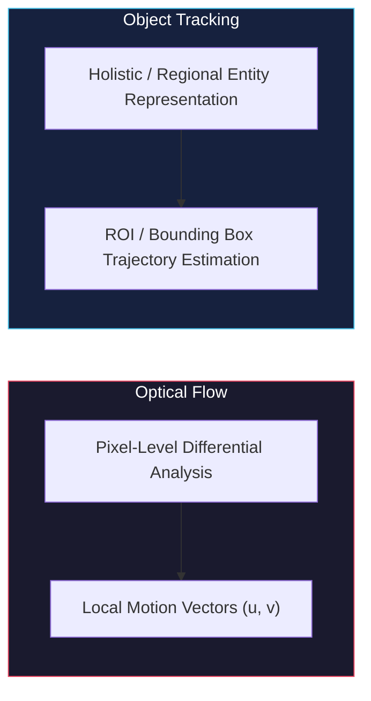
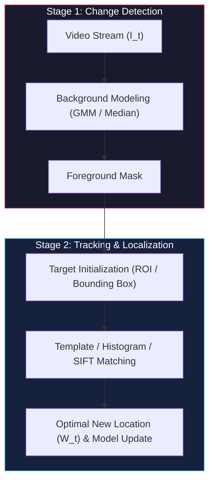
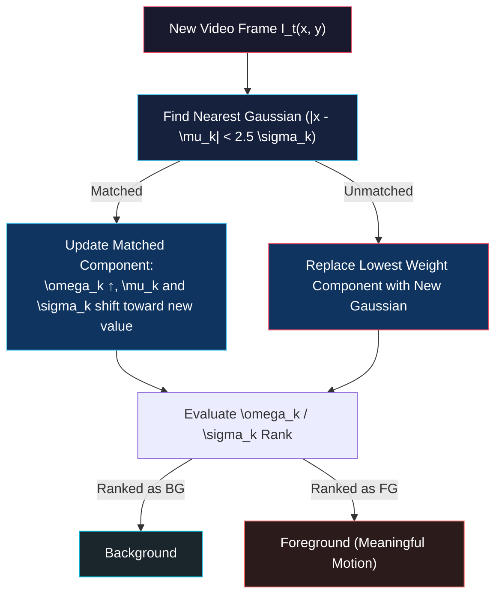

# Object Tracking & Background Subtraction

<!-- toc -->

This lecture note comprehensively covers **Object Tracking** and **Change Detection / Background Subtraction**, two fundamental pillars of dynamic scene analysis and perception in computer vision. Beginning with pixel-level differential motion analysis, it explores statistical and probabilistic **Gaussian Mixture Models (GMM)**, local template and histogram-based tracking methods, and robust SIFT-based **"Bag of Features"** tracking architectures following the curriculum of Columbia University's CAVE Laboratory (Prof. Shree K. Nayar).

---

## 1. Overview

In computer vision, **Object Tracking** is the process of continuously, robustly, and automatically estimating the spatial position, geometric boundaries, scale, and trajectory of a specific target object or **Region of Interest (ROI)** across temporally sequential video frames ($I_1, I_2, \dots, I_T$).

<figure style="display:flex; justify-content: center; margin: 20px 0;">
  

    
    <figcaption style="margin-top: 0.5em; text-align: center; font-size: 13px; color: #888;"><em>Figure 1: Typical object tracking and perception scenarios (Left: Tracking high-speed vehicles on a highway; Right: Tracking pedestrians crossing a walkway).</em></figcaption>
  

</figure>

While **Optical Flow** solves for where every individual pixel moves between consecutive frames at a differential level (dense/sparse vector motion field $\mathbf{u} = [u, v]^T$), object tracking aims to track a **coherent holistic entity** (e.g., a person, vehicle, face, or athlete) as a semantic whole rather than treating pixels independently.

### 1.1 Fundamental Challenges in Object Tracking

In real-world operating environments, tracking algorithms must remain resilient against severe optical, physical, and environmental disturbances:

1. **Illumination Changes:** Sudden changes in pixel intensity and color caused by clouds obscuring the sun, flickering artificial lights, or an object entering shadow cast by buildings or trees.
2. **Scale Changes:** Continuous expansion or shrinkage of the target's image resolution and bounding box footprint as it moves toward or away from the camera.
3. **Rotation & Viewpoint Changes:** Drastic 2D appearance variations caused by out-of-plane 3D rotations of the object (e.g., a car navigating a turn or a person turning their head).
4. **Occlusions:** Partial or full visual disappearance of the tracked target when passing behind static obstacles (poles, trees, traffic signs) or dynamic objects (other pedestrians or cars).
5. **Camera Shake & Dynamic Backgrounds:** Mechanical vibrations and wind-induced camera motion, alongside periodic scene motions such as swaying foliage, rippling water surfaces, or passing precipitation.

<figure style="display:flex; justify-content: center; margin: 20px 0;">
  

    
    <figcaption style="margin-top: 0.5em; text-align: center; font-size: 13px; color: #888;"><em>Figure 2: Irrelevant variations to be filtered: 1) Water surface ripples (Background fluctuations); 2) Precipitation and sensor noise (Rain, snow & turbulence); 3) Dynamic lighting and cast shadows (Illumination changes & shadows).</em></figcaption>
  

</figure>

### 1.2 The Two Primary Stages of Object Tracking

A modular modern visual tracking system is organized into two complementary stages:

1. **Change Detection (Background Subtraction):** Segmenting temporally moving or novel pixels from the static background (**Foreground / Background Classification**).
2. **Motion Tracking and Localization:** Continuously estimating the object's updated bounding box in subsequent frames using appearance templates, color histograms, or local feature matchers.

---

## 2. Change Detection

To initialize or support tracking autonomously in stationary cameras, the system must detect where "meaningful motion" occurs in the scene.

### 2.1 Foreground vs. Background Classification Problem

Change detection formulates a real-time binary decision for each pixel coordinate $(x, y)$:
- **Foreground (FG):** Meaningful dynamic objects of interest (e.g., walking pedestrians, moving vehicles).
- **Background (BG):** Static or repetitive structural components of the scene (roads, buildings, walls, ground).

The core challenge is distinguishing **meaningful changes** from **uninteresting (irrelevant) fluctuations**:

* **Background Fluctuations:** Swaying branches, rustling leaves, or specular highlights on moving water.
* **Sensor Noise:** Random thermal and quantum photon shot noise, particularly prominent in low-light imagery.
* **Weather Effects:** Rapidly transient raindrops, falling snowflakes, or atmospheric heat mirages (turbulence).
* **Moving Shadows:** Dark regions cast on the ground that move coherently with the target but are not physically part of the object geometry.
* **Camera Jitter:** Sub-pixel to multi-pixel rigid translations caused by wind or platform vibrations.

### 2.2 Methods and Evolution of Change Detection

The historical development of change detection has progressed from simple deterministic frame differencing to adaptive probabilistic distributions.

#### 2.2.1 Frame Differencing

The simplest baseline method computes the absolute intensity difference between the current frame ($I_t$) and the immediately preceding frame ($I_{t-1}$), thresholding the result by a constant $\tau$:

$$F(x, y, t) = \begin{cases} 1 & \text{if } |I(x, y, t) - I(x, y, t-1)| > \tau \\ 0 & \text{otherwise} \end{cases}$$

<figure style="display:flex; justify-content: center; margin: 20px 0;">
  

    
    <figcaption style="margin-top: 0.5em; text-align: center; font-size: 13px; color: #888;"><em>Figure 3: Frame Differencing ($F_t = |I_t - I_{t-1}| > T$). Homogeneously colored regions inside moving objects produce zero temporal difference, resulting in a hollow (hole-filled) interior where only high-contrast leading/trailing edges are detected.</em></figcaption>
  

</figure>

> **Critical Drawbacks (The "Hole" Problem):**
> 1. Any minor leaf flutter or sensor noise immediately generates false foreground positives.
> 2. **Interior Cavities (Holes):** If a moving object (e.g., a solid gray car) has a uniform interior surface, the intensity at interior pixels does not change between adjacent frames ($|I_t - I_{t-1}| \approx 0$). Consequently, the detected mask is hollow, showing only leading and trailing edges, making holistic tracking and sizing unreliable.

#### 2.2.2 Average Background Method

To overcome the interior hole problem of frame differencing, a single **Reference Background Image ($B$)** is computed by averaging the first $K$ video frames:

$$B(x, y) = \frac{1}{K} \sum_{i=1}^K I(x, y, i)$$

Subsequent frames are compared directly against this static background:

$$F(x, y, t) = |I(x, y, t) - B(x, y)| > \tau$$

<figure style="display:flex; justify-content: center; margin: 20px 0;">
  

    
    <figcaption style="margin-top: 0.5em; text-align: center; font-size: 13px; color: #888;"><em>Figure 4: Average Background Method ($B = \text{average}\{I_1, \dots, I_K\}$). Using a persistent background allows full interior extraction of moving objects but fails under ambient illumination drift.</em></figcaption>
  

</figure>

> **Drawbacks:**
> 1. If any foreground object moves through the scene during the initial $K$ frames, it gets permanently etched as a "ghost" artifact into the reference model.
> 2. The model is static; it cannot adapt to gradual changes in sunlight, cloud cover, or moving shadows, eventually classifying the entire scene as foreground.

#### 2.2.3 Median Background Method

Rather than computing the arithmetic mean, the statistical median of pixel values across the first $K$ frames is selected as the background model:

$$B(x, y) = \text{median}\{I(x, y, 1), I(x, y, 2), \dots, I(x, y, K)\}$$

<figure style="display:flex; justify-content: center; margin: 20px 0;">
  

    
    <figcaption style="margin-top: 0.5em; text-align: center; font-size: 13px; color: #888;"><em>Figure 5: Median Background Method ($B = \text{median}\{I_1, \dots, I_K\}$). The median operator is highly robust to statistical outliers, filtering out passing vehicles from the initial training frames.</em></figcaption>
  

</figure>

> **Strength of the Median:** The median operator is inherently robust against transient **outliers**. Even if cars pass through a pixel location during training, their transient values occupy the distribution extremes and do not distort the median. However, the static median still fails when the physical environment evolves over time.

#### 2.2.4 Adaptive / Moving Median Method

To track gradual lighting changes, the median model is updated recursively across a sliding temporal window or via an incremental step rule:

$$B_t(x, y) = \begin{cases} B_{t-1}(x, y) + 1 & \text{if } I(x, y, t) > B_{t-1}(x, y) \\ B_{t-1}(x, y) - 1 & \text{if } I(x, y, t) < B_{t-1}(x, y) \\ B_{t-1}(x, y) & \text{otherwise} \end{cases}$$

While effective for slow global lighting drift, the adaptive median maintains only a single scalar intensity per pixel and remains fundamentally unable to model multimodal background distributions (such as rustling leaves or active snowfall).

---

## 3. Gaussian Mixture Model (GMM)

In real-world scenes, a pixel's temporal intensity distribution is often multimodal rather than unimodal. For example, a pixel observing a wind-blown tree branch oscillates between the bright blue sky and the dark green leaves, producing **two distinct peaks (a bimodal distribution)** in its temporal histogram.

### 3.1 Multimodal Nature of Pixel Temporal Distributions

Consider an outdoor surveillance camera monitoring a roadway during heavy snowfall. Observing a single pixel over hundreds of frames reveals a distinct multimodal histogram:

<figure style="display:flex; justify-content: center; margin: 20px 0;">
  

    
    <figcaption style="margin-top: 0.5em; text-align: center; font-size: 13px; color: #888;"><em>Figure 6: Temporal intensity histogram for a single pixel in an active snowfall scene, exhibiting two prominent peaks corresponding to dark road surface and bright passing snowflakes.</em></figcaption>
  

</figure>

Physical decomposition of this temporal distribution reveals three distinct components:

<figure style="display:flex; justify-content: center; margin: 20px 0;">
  

    
    <figcaption style="margin-top: 0.5em; text-align: center; font-size: 13px; color: #888;"><em>Figure 7: Physical components of the pixel histogram: 1) Dark Blue Peak: Static Background Asphalt (BG - Road); 2) Light Blue Peak: Background Snow Precipitation (BG - Snow); 3) Red Floor: Infrequent passing Foreground Vehicle (FG - Vehicle).</em></figcaption>
  

</figure>

1. **Static Background (Road/Asphalt):** Highly frequent, narrow variance peak representing the persistent surface.
2. **Dynamic Background (Falling Snow):** Frequently recurring, broader variance peak representing repetitive weather disturbance.
3. **Foreground Objects (Vehicles):** Rare, transient occurrences with very low supporting evidence/weight.

> **Key GMM Insight:** Foreground objects occupy a given pixel location only rarely. Background and repetitive disturbance states dominate the temporal history of the pixel.

### 3.2 Mathematical GMM Formulation (1D Case)

GMM models the probability density of a pixel intensity $x$ as a weighted mixture of $K$ independent Gaussian distributions ($K = 3, 4, 5$):

<figure style="display:flex; justify-content: center; margin: 20px 0;">
  

    
    <figcaption style="margin-top: 0.5em; text-align: center; font-size: 13px; color: #888;"><em>Figure 8: 1D Gaussian distribution component: $\omega \cdot \eta(x, \mu, \sigma)$ parameterized by Mean ($\mu$), Standard Deviation ($\sigma$), and Scale / Supporting Evidence ($\omega$).</em></figcaption>
  

</figure>

For grayscale imagery, the probability density function is:

$$P(x) = \sum_{k=1}^K \omega_k \cdot \eta(x \mid \mu_k, \sigma_k^2)$$

where:

$$\eta(x \mid \mu_k, \sigma_k^2) = \frac{1}{\sqrt{2\pi}\sigma_k} e^{-\frac{(x - \mu_k)^2}{2\sigma_k^2}}$$

* $\mu_k$ : Mean intensity of the $k$-th Gaussian component (peak center).
* $\sigma_k$ : Standard deviation of the $k$-th component (peak width / variance).
* $\omega_k$ : Weight / Evidence coefficient representing the proportion of time the pixel exhibits this state.

The mixture weights are normalized:

$$\sum_{k=1}^K \omega_k = 1$$

<figure style="display:flex; justify-content: center; margin: 20px 0;">
  

    
    <figcaption style="margin-top: 0.5em; text-align: center; font-size: 13px; color: #888;"><em>Figure 9: Gaussian Mixture Model as a weighted linear combination of $K$ Gaussians ($P(x) \approx \sum_{k=1}^K \omega_k \eta_k$). Combining multiple components accurately captures complex multimodal pixel distributions.</em></figcaption>
  

</figure>

### 3.3 Multidimensional GMM in Color Space (RGB & Covariance Matrices)

In 3D color space ($\mathbf{x} = [R, G, B]^T, d=3$), the multivariate Gaussian formulation is:

$$P(\mathbf{x}) = \sum_{k=1}^K \omega_k \cdot \frac{1}{(2\pi)^{d/2} |\Sigma_k|^{1/2}} e^{-\frac{1}{2}(\mathbf{x} - \boldsymbol{\mu}_k)^T \Sigma_k^{-1} (\mathbf{x} - \boldsymbol{\mu}_k)}$$

* $\boldsymbol{\mu}_k = [\mu_R, \mu_G, \mu_B]^T$ : $3 \times 1$ mean color vector.
* $\Sigma_k$ : $3 \times 3$ covariance matrix.

| Covariance Model | Matrix Structure | Geometric Shape | Computation Speed | Fidelity |
| :--- | :--- | :--- | :--- | :--- |
| **Isotropic / Spherical** | $\Sigma_k = \sigma_k^2 I$ | Sphere in 3D RGB space | Very Fast | Baseline |
| **Diagonal** | $\Sigma_k = \text{diag}(\sigma_R^2, \sigma_G^2, \sigma_B^2)$ | Axis-aligned ellipsoid | Fast | Good |
| **Full Covariance** | $\Sigma_k = \begin{bmatrix} \sigma_{RR} & \sigma_{RG} & \sigma_{RB} \\ \sigma_{GR} & \sigma_{GG} & \sigma_{GB} \\ \sigma_{BR} & \sigma_{BG} & \sigma_{BB} \end{bmatrix}$ | Rotated 3D ellipsoid | Computationally Heavy | Highest |

### 3.4 Classification Rule: Foreground vs. Background ($\omega / \sigma$ Ratio)

To determine which of the $K$ Gaussians represent background states and which represent foreground anomalies, the components are sorted by their fitness score:

$$\text{Component Score} = \frac{\omega_k}{\sigma_k}$$

<figure style="display:flex; justify-content: center; margin: 20px 0;">
  

    
    <figcaption style="margin-top: 0.5em; text-align: center; font-size: 13px; color: #888;"><em>Figure 10: GMM Classification Intuition: High $\frac{\omega}{\sigma}$ ratio $\rightarrow$ Persistent Background; Low $\frac{\omega}{\sigma}$ ratio $\rightarrow$ Transient Foreground.</em></figcaption>
  

</figure>

* **Background Gaussians (High $\omega_k / \sigma_k$):** Persistent presence (large $\omega_k$) and low noise variance (small $\sigma_k$). The top $B$ ranked Gaussians accounting for a cumulative weight threshold $T$ are designated as the background model.
* **Foreground Gaussians (Low $\omega_k / \sigma_k$):** Transient presence (small $\omega_k$) and motion blur / variability (large $\sigma_k$).

### 3.5 Online Adaptive GMM Algorithm (Stauffer-Grimson)

Fitting a full EM algorithm at every pixel in real-time is computationally intractable. **Stauffer and Grimson (1999)** introduced an efficient online recursive update scheme:

1. **Mahalanobis Matching Test:** The incoming intensity $x_t$ is checked against each component. A match occurs if $x_t$ falls within $2.5$ standard deviations of $\mu_k$:
   $$|x_t - \mu_k| \le 2.5 \sigma_k$$
2. **Recursive Parameter Updates:**
   - For the matched component: $\omega_k \leftarrow (1-\alpha)\omega_k + \alpha$
   - Mean shifts: $\mu_k \leftarrow (1-\rho)\mu_k + \rho x_t$
   - Variance shifts: $\sigma_k^2 \leftarrow (1-\rho)\sigma_k^2 + \rho (x_t - \mu_k)^2$
   - Unmatched components decay: $\omega_j \leftarrow (1-\alpha)\omega_j$
3. **Handling Unmatched Pixels:** If no Gaussian matches $x_t$, the component with the lowest $\omega/\sigma$ is replaced with a new Gaussian centered at $x_t$ with high initial variance and low weight.

### 3.6 Performance Comparison: GMM vs. Moving Median

<figure style="display:flex; justify-content: center; margin: 20px 0;">
  

    
    <figcaption style="margin-top: 0.5em; text-align: center; font-size: 13px; color: #888;"><em>Figure 11: Foreground extraction under snowfall: Left: Moving Median method is overwhelmed by false positive snowflake detections; Right: Adaptive GMM seamlessly absorbs snowfall into a secondary background Gaussian, cleanly isolating the true moving vehicle.</em></figcaption>
  

</figure>

---

## 4. Object Tracking using Template Matching

Once a target is localized (via change detection or user initialization), **Template Matching** tracks the object across subsequent video frames by searching for matching image regions.

<figure style="display:flex; justify-content: center; margin: 20px 0;">
  

    
    <figcaption style="margin-top: 0.5em; text-align: center; font-size: 13px; color: #888;"><em>Figure 12: Bounding box initialization (ROI) for tracking a player in a soccer match.</em></figcaption>
  

</figure>

Template matching relies on two primary target representation paradigms:

<figure style="display:flex; justify-content: center; margin: 20px 0;">
  

    
    <figcaption style="margin-top: 0.5em; text-align: center; font-size: 13px; color: #888;"><em>Figure 13: Two fundamental template models: Top: Appearance-Based Template (raw pixel intensity grid); Bottom: Histogram-Based Template (non-parametric color/intensity distribution).</em></figcaption>
  

</figure>

### 4.1 Appearance-Based Tracking

* **Mechanism:** The raw 2D pixel array within the bounding box is saved as an Image Template ($T$). In the next frame $I_t$, this template is shifted across a local search window centered around the target's prior position.

<figure style="display:flex; justify-content: center; margin: 20px 0;">
  

    
    <figcaption style="margin-top: 0.5em; text-align: center; font-size: 13px; color: #888;"><em>Figure 14: Sliding an object template from Frame $I_{t-1}$ across a local candidate search window in Frame $I_t$ to locate the peak similarity response.</em></figcaption>
  

</figure>

* **Similarity Metrics:**
  - **SAD (Sum of Absolute Differences):** $\text{SAD}(u, v) = \sum_{x, y} |I(x+u, y+v) - T(x, y)|$
  - **SSD (Sum of Squared Differences):** $\text{SSD}(u, v) = \sum_{x, y} (I(x+u, y+v) - T(x, y))^2$
  - **NCC (Normalized Cross-Correlation):** Illuminance-invariant normalized dot product.
* **Limitations:** Highly sensitive to target rotation, scale changes, non-rigid deformations, and occlusions, causing tracking failure under geometric transformations.

### 4.2 Histogram-Based Tracking

* **Mechanism:** Represents the target as a color or intensity histogram rather than a rigid spatial pixel matrix.
* **Strengths:** By discarding spatial pixel coordinates, histograms are inherently invariant to 2D in-plane and 3D out-of-plane **rotations** and flexible body deformations.
* **Vulnerability (Background Clutter Contamination):** Rectangular bounding boxes inevitably enclose background pixels at their corners (e.g., grass, road). As the target moves, these extraneous pixels pollute the histogram, causing the tracker to drift into the background.

### 4.3 Spatial Weighting with the Epanechnikov Kernel

To suppress background contamination at bounding box corners, an isotropic **Epanechnikov Kernel** is applied to weight pixel contributions according to their distance from the ROI center:

<figure style="display:flex; justify-content: center; margin: 20px 0;">
  

    
    <figcaption style="margin-top: 0.5em; text-align: center; font-size: 13px; color: #888;"><em>Figure 15: Spatial weighting with the Epanechnikov Kernel: Central pixels receive maximal voting weight (+1.0), whereas peripheral corner pixels are suppressed (+0.4 down to 0), eliminating background contamination.</em></figcaption>
  

</figure>

For a window of size $(2W+1) \times (2H+1)$ centered at $\mathbf{x}_c = [x_c, y_c]^T$, normalized coordinates are:

$$\mathbf{\tilde{x}} = \begin{bmatrix} \frac{x - x_c}{W} \\ \frac{y - y_c}{H} \end{bmatrix}$$

The parabolic Epanechnikov kernel profile is:

$$k(\mathbf{\tilde{x}}) = \begin{cases} 1 - \|\mathbf{\tilde{x}}\|^2 & \text{if } \|\mathbf{\tilde{x}}\| < 1 \\ 0 & \text{otherwise} \end{cases}$$

### 4.4 Histogram Intersection and the Latching Problem

To compare two normalized histograms ($H_1$ and $H_2$), the standard **Histogram Intersection** metric is used:

$$D(H_1, H_2) = \sum_{i=1}^M \min(H_1(i), H_2(i))$$

* **Occlusion Robustness:** Because of the minimum operator ($\min$), partial occlusions only reduce the score proportionally to the obscured area without causing tracking collapse.
* **Latching / Identity Switch Failure Mode:** Since histograms discard all spatial arrangement, if the target (e.g., a basketball player in a red jersey) passes closely beside a teammate wearing the same uniform, the tracker cannot disambiguate them and frequently locks onto the wrong player (**latching / identity switch**).

<figure style="display:flex; justify-content: center; margin: 20px 0;">
  

    
    <figcaption style="margin-top: 0.5em; text-align: center; font-size: 13px; color: #888;"><em>Figure 16: Tracking players in a basketball game. Players sharing the same jersey color create severe ambiguity for histogram-only trackers, risking identity latching.</em></figcaption>
  

</figure>

---

## 5. Tracking by Feature Detection

To overcome the rigid alignment limits of template matching and the spatial ambiguity of histograms, **SIFT-Based "Bag of Features" Tracking (Gu et al., 2010)** models the target as an ensemble of distinctive local invariant features.

<figure style="display:flex; justify-content: center; margin: 20px 0;">
  

    
    <figcaption style="margin-top: 0.5em; text-align: center; font-size: 13px; color: #888;"><em>Figure 17: SIFT Bag of Features Tracking Architecture (Gu et al., 2010): Maintaining and updating distinct Object and Background feature bags across consecutive frames.</em></figcaption>
  

</figure>

### 5.1 Initialization and Bag of Features Construction

At the initial video frame ($t=1$):

<figure style="display:flex; justify-content: center; margin: 20px 0;">
  

    
    <figcaption style="margin-top: 0.5em; text-align: center; font-size: 13px; color: #888;"><em>Figure 18: Initialization at Frame 1: 1) User selects bounding box $W_1$; 2) SIFT keypoints are extracted; 3) Features within $W_1$ form the Object Model ($O_1$), while peripheral features form the Background Model ($B$).</em></figcaption>
  

</figure>

1. **Bounding Box Placement:** A bounding box $W_1$ is positioned over the target.
2. **Feature Extraction:** SIFT detector runs across the entire frame, generating 128-dimensional descriptor vectors ($\mathbf{v}_i$).
3. **Object Model ($O_1$ Bag):** Keypoints falling inside $W_1$ are stored in the **Object Bag ($O_1$)** (Blue points).
4. **Background Model ($B$ Bag):** All keypoints falling outside $W_1$ are stored in the **Background Bag ($B$)** (Red points).

### 5.2 Frame-to-Frame Tracking & Confidence Ratio Test

In each subsequent frame $I_t$:

<figure style="display:flex; justify-content: center; margin: 20px 0;">
  

    
    <figcaption style="margin-top: 0.5em; text-align: center; font-size: 13px; color: #888;"><em>Figure 19: Tracking execution at Frame $t$: 1) SIFT extraction; 2) Nearest-neighbor ratio test ($d_O / d_B &lt; 0.5$) assigns confidence scores ($C(\mathbf{v}_i) = \pm 1$); 3) Candidate window scoring ($\mu(W) = \varphi(W) - \tau(W)$); 4) Optimal window selection; 5) Online model update.</em></figcaption>
  

</figure>

1. **Feature Extraction:** SIFT detects a new set of candidate features $\{\mathbf{v}_1, \dots, \mathbf{v}_K\}$ in frame $I_t$.
2. **Nearest-Neighbor Distance Ratio Test:** For each feature $\mathbf{v}_i$:
   - Distance to nearest match in Object Bag ($O_{t-1}$): $d_O = \min_{\mathbf{u} \in O_{t-1}} \|\mathbf{v}_i - \mathbf{u}\|$
   - Distance to nearest match in Background Bag ($B$): $d_B = \min_{\mathbf{u} \in B} \|\mathbf{v}_i - \mathbf{u}\|$
   
   Confidence score assignment:
   
   $$C(\mathbf{v}_i) = \begin{cases} +1 & \text{if } \frac{d_O}{d_B} < 0.5 \quad (\mathbf{v}_i \text{ belongs to target object}) \\ -1 & \text{otherwise } (\mathbf{v}_i \text{ belongs to background}) \end{cases}$$

### 5.3 Optimal Window Search and Geometric Penalty

Candidate search windows ($W$) are evaluated by translating and scaling around $W_{t-1}$. The tracking objective function is:

$$\mu(W) = \varphi(W) - \tau(W, W_{t-1})$$

* **Window Feature Score:** $\varphi(W) = \sum_{\mathbf{v}_i \in W} C(\mathbf{v}_i)$ (Maximizes inclusion of $+1$ object features while penalizing $-1$ background features).
* **Geometric Shape Penalty:** $\tau(W, W_{t-1})$ penalizes large, abrupt deviations in position, aspect ratio, and scale relative to $W_{t-1}$.

The optimal location is chosen by maximizing $\mu(W)$:

$$W_t = \arg\max_W \mu(W)$$

### 5.4 Online Appearance Model Update

To prevent model drift and adapt to perspective shifts, verified object features in $W_t$ are dynamically appended to the object bag:

$$O_t = O_{t-1} \cup \{\mathbf{v}_i \mid \mathbf{v}_i \in W_t \text{ and } C(\mathbf{v}_i) = +1\}$$

### 5.5 Robustness to Occlusion, Rotation, and Lighting

<figure style="display:flex; justify-content: center; margin: 20px 0;">
  

    
    <figcaption style="margin-top: 0.5em; text-align: center; font-size: 13px; color: #888;"><em>Figure 20: Robust tracking performance: Left: Severe illumination changes; Right: Out-of-plane 3D head rotation against cluttered background.</em></figcaption>
  

</figure>

<figure style="display:flex; justify-content: center; margin: 20px 0;">
  

    
    <figcaption style="margin-top: 0.5em; text-align: center; font-size: 13px; color: #888;"><em>Figure 21: Severe occlusion handling: Left: Subject wearing a hat obscuring upper face; Right: Magazine obscuring half the face. Remaining unoccluded SIFT features maintain correct bounding box alignment.</em></figcaption>
  

</figure>

* **Occlusion Resistance:** When an obstacle (e.g., a hat or magazine) partially occludes the target, new obstacle features fail the ratio test ($C = -1$), preventing window deformation. The remaining unoccluded SIFT keypoints ($C = +1$) keep the tracking window locked onto the target.
* **3D Rotation & Illumination Invariance:** SIFT descriptors provide scale, rotational, and gradient contrast invariance, maintaining tracking throughout complex 3D maneuvers.

---

## 6. Technical Summary & Comparison Matrix

| Method | Core Decision Metric / Formula | Required Input Data | Key Strengths | Primary Failure Mode |
| :--- | :--- | :--- | :--- | :--- |
| **Frame Differencing** | $\lvert I_t - I_{t-1} \rvert > \tau$ | Adjacent frame pair | Extremely fast, simple change detector | Hollow interior holes on uniform objects; sensitive to leaves/noise |
| **Median Background** | $\lvert I_t - \text{median}\{I_1, \dots, I_K\} \rvert > \tau$ | First $K$ video frames | Highly robust against transient outliers during training | Static model; cannot handle ambient diurnal illumination changes |
| **Gaussian Mixture Model (GMM)** | $\frac{\omega_k}{\sigma_k}$ ranking + Mahalanobis test | $K$ Gaussian parameters $(\omega_k, \mu_k, \Sigma_k)$ per pixel | Multimodal backgrounds (snow, rain, swaying trees, camera jitter) | Cannot separate dark moving cast shadows sharing target chromaticity |
| **Appearance Template** | $\min \text{SSD}$ or $\max \text{NCC}$ | Initial raw pixel matrix | Short-term linear translational tracking | Scale change, 3D rotation, or occlusion causes immediate tracking loss |
| **Weighted Histogram** | Epanechnikov weighted histogram intersection | Weighted color distribution of ROI | Invariant to rotation and non-rigid deformations | Ambiguity when crossing identically colored targets (**latching / identity switch**) |
| **Bag of Features (SIFT)** | $\max (\varphi(W) - \tau(W))$ with SIFT ratio test | Object ($O$) and Background ($B$) SIFT feature bags | Severe occlusions, 3D rotations, complex lighting | Completely textureless, featureless objects lacking SIFT keypoints |
