# Overview, Photometric Stereo Systems, and Structured Light Range Finding

<!-- toc -->

In computer vision, cameras are traditionally passive observers that rely entirely on the ambient light available in the scene. However, in industrial automation, robotics, autonomous driving, and quality inspection, controlling illumination actively offers immense advantages. This strategic approach is known as **Active Illumination**.

---

## 1. Overview

Passive vision techniques (such as passive stereo vision and optical flow) rely on natural ambient lighting and surface appearance. Active illumination systems, by contrast, project controlled light energy onto the scene to reveal geometric and radiometric properties that are otherwise difficult or impossible to capture.

### 1.1 Limitations of Passive Vision and Advantages of Active Illumination

- **Textureless Regions:** Passive stereo vision and optical flow algorithms fail on homogeneous or featureless surfaces (e.g., a smooth white wall or uniform plastic housing) because robust correspondences cannot be found across camera views. Active illumination solves this by projecting artificial patterns (high-contrast structured light) onto the surface.
- **Robustness to Ambient Lighting:** In environments with fluctuating, unpredictable, or zero ambient illumination, active systems provide consistent, low-noise measurements using dedicated light sources.
- **Photon Manipulation:** By controlling the wavelength, direction, phase, and time-of-flight of emitted light, active vision systems extract hidden 3D geometric and material reflectance properties.
- **Spectrum Selection (Human Invisibility):** Active patterns can be projected in non-visible spectrums such as Infrared (IR) or Ultraviolet (UV). This allows high-precision 3D data acquisition without distracting humans (e.g., in smartphone facial authentication or night-time autonomous driving).

> **Key Insight:** Active illumination converts ill-posed visual recovery problems into well-posed geometric or radiometric estimates by controlling the illumination field projected onto the scene.

---

## 2. Photometric Stereo Systems

Photometric stereo estimates surface normals by maintaining fixed camera and object positions while systematically varying the direction of illumination across multiple light sources.

<figure style="display:flex; justify-content: center; margin: 20px 0;">
  

    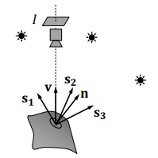
    <figcaption style="margin-top: 0.5em; text-align: center; font-size: 13px; color: #888;"><em>Figure 1: Basic setup of photometric stereo with fixed camera and light sources s1, s2, s3 illuminating a surface with normal n.</em></figcaption>
  

</figure>

### 2.1 Photometric Sampling

Traditional photometric stereo assumes that surface reflectance follows a purely Lambertian (diffuse) model. However, real-world objects display hybrid reflectance containing both diffuse and specular components. The **Photometric Sampling** theory proposed by Nayar (1989) addresses this limitation:

- **Multi-LED Array:** A large array of independently controlled LEDs is arranged on a spherical dome surrounding the object. These LEDs are sequentially triggered in sync with a high-speed camera within milliseconds.
- **Diffuser Dome Integration:** Point light sources cannot resolve pristine specular highlights on glossy or metallic surfaces because reflections appear only at isolated specular points. Placing a semi-transparent diffuser dome between the LED array and the object converts point sources into wide-angle area sources. This produces continuous, overlapping brightness fields, allowing precise extraction of surface normals even for complex metallic objects.

<figure style="display:flex; justify-content: center; margin: 20px 0;">
  

    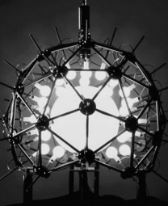
    <figcaption style="margin-top: 0.5em; text-align: center; font-size: 13px; color: #888;"><em>Figure 2: Spherical diffuser dome equipped with distributed light sources for photometric sampling [Nayar 1989].</em></figcaption>
  

</figure>

<figure style="display:flex; justify-content: center; margin: 20px 0;">
  

    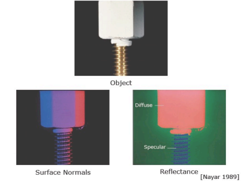
    <figcaption style="margin-top: 0.5em; text-align: center; font-size: 13px; color: #888;"><em>Figure 3: Photometric sampling separation results showing target metallic object, recovered surface normals, and separated diffuse vs specular reflectance maps.</em></figcaption>
  

</figure>

### 2.2 Debevec and "Light Stage" Technology

The principles of photometric sampling were scaled up by Paul Debevec and colleagues to capture human facial geometry and reflectance for film and computer graphics:

- **High-Speed Scanning:** A spherical cage equipped with hundreds of programmable LEDs (the "Light Stage") rapidly cycles through varied lighting patterns at thousands of frames per second. Synchronized cameras capture the subject under dozens of distinct illumination angles in milliseconds.
- **Relighting:** The captured multi-illumination image sequence can be linearly combined to re-illuminate (relight) the subject under any target environment lighting. This process yields 3D surface geometry, pore-level micro-geometry, and separated diffuse and specular reflectance maps simultaneously.

<figure style="display:flex; justify-content: center; margin: 20px 0;">
  

    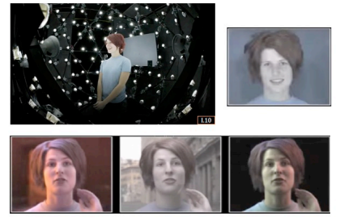
    <figcaption style="margin-top: 0.5em; text-align: center; font-size: 13px; color: #888;"><em>Figure 4: Paul Debevec's Light Stage apparatus featuring a spherical LED array for rapidly capturing facial performance under diverse lighting.</em></figcaption>
  

</figure>

<figure style="display:flex; justify-content: center; margin: 20px 0;">
  

    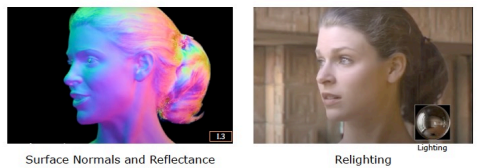
    <figcaption style="margin-top: 0.5em; text-align: center; font-size: 13px; color: #888;"><em>Figure 5: Extracted high-resolution surface normals (left) and final relighting into a target movie environment (right).</em></figcaption>
  

</figure>

---

## 3. Structured Light Range Finding

Structured light systems project known geometric light patterns onto a scene and compute direct depth ($z$) maps using optical triangulation.

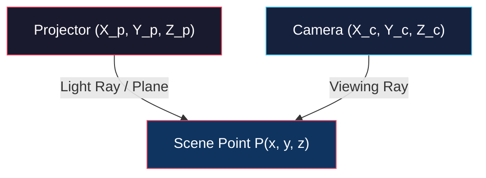

### 3.1 Point-Based Range Finding

- **Operating Principle:** A single laser pointer with precise position and orientation in projector space projects a narrow beam onto the scene, producing a bright spot $(x_i, y_i)$ on the camera sensor.
- **Triangulation:** The 3D line representing the camera viewing ray is intersected with the known 3D laser ray to compute the precise 3D coordinates $P(x, y, z)$ of the scene point.

<figure style="display:flex; justify-content: center; margin: 20px 0;">
  

    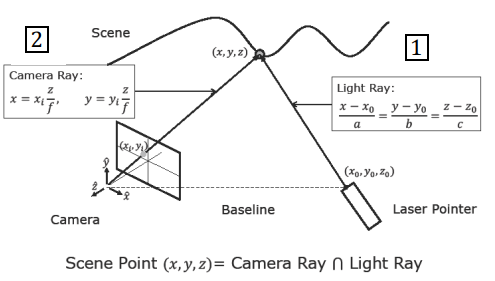
    <figcaption style="margin-top: 0.5em; text-align: center; font-size: 13px; color: #888;"><em>Figure 6: Geometry of point-based range finding: Intersecting camera viewing ray with laser pointer ray.</em></figcaption>
  

</figure>

- **Background Subtraction:** Images taken with and without the laser beam are subtracted to isolate the spot centroid with sub-pixel precision.

<figure style="display:flex; justify-content: center; margin: 20px 0;">
  

    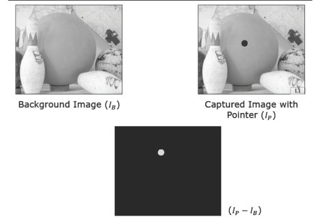
    <figcaption style="margin-top: 0.5em; text-align: center; font-size: 13px; color: #888;"><em>Figure 7: Background subtraction process: Subtracting ambient image I_B from laser pointer image I_P to isolate the spot centroid.</em></figcaption>
  

</figure>

- **Time Constraint:** Since each image yields depth for only one point, capturing a $640 \times 480$ resolution depth map requires over 300,000 sequential images, making point scanning excessively slow for dynamic scenes.

### 3.2 Light Striping (Line-Based Range Finding)

Instead of a single point, a sheet of light (light plane) is generated using a cylindrical lens and projected onto the object, forming a curved stripe.

For each stripe pixel $(x_i, y_i)$ observed in the camera, depth $z$ is directly calculated by intersecting the camera ray with the known light plane equation $A x + B y + C z + D = 0$:

$$z = \frac{-D \cdot f}{A x_i + B y_i + C f}$$

where $f$ is the lens focal length.

<figure style="display:flex; justify-content: center; margin: 20px 0;">
  

    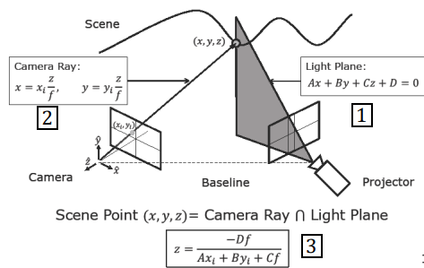
    <figcaption style="margin-top: 0.5em; text-align: center; font-size: 13px; color: #888;"><em>Figure 8: Mathematical geometry of light striping: Intersecting camera viewing ray with projector light plane Ax + By + Cz + D = 0.</em></figcaption>
  

</figure>

<figure style="display:flex; justify-content: center; margin: 20px 0;">
  

    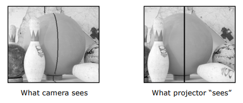
    <figcaption style="margin-top: 0.5em; text-align: center; font-size: 13px; color: #888;"><em>Figure 9: Light striping example: Curved line observed by camera vs straight vertical plane generated by projector.</em></figcaption>
  

</figure>

Sweeping the light plane across the scene with a motorized stage reduces the required frame count for a $640 \times 480$ depth map to just 640 images (~21 seconds at 30 fps).

### 3.3 Multi-Stripe Ambiguity

To achieve real-time speed, multiple stripes can be projected simultaneously in a single frame. However, this introduces **correspondence ambiguity**. On complex 3D surfaces with depth discontinuities or steep cavities, stripe order can swap or stripes can be occluded (shadowing). If the camera cannot uniquely match an observed stripe to its corresponding projector emission line, triangulation fails.

<figure style="display:flex; justify-content: center; margin: 20px 0;">
  

    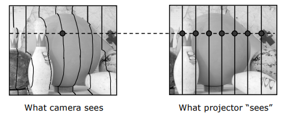
    <figcaption style="margin-top: 0.5em; text-align: center; font-size: 13px; color: #888;"><em>Figure 10: Correspondence ambiguity when projecting multiple stripes simultaneously on complex geometry.</em></figcaption>
  

</figure>

### 3.4 Binary Coded Structured Light

Space-time encoding resolves multi-stripe ambiguity by assigning a unique temporal binary codeword to each projection column:

- **Codeword Logic:** To encode 7 distinct stripes, $\log_2(7 + 1) = 3$ bits are required.
- **Projection Pattern Sequence:**
  1. *Frame 1 (Bit 1):* Stripes with first bit `1` are illuminated; those with `0` remain dark (4 open, 3 dark).
  2. *Frame 2 (Bit 2):* Stripes with second bit `1` are illuminated.
  3. *Frame 3 (Bit 3):* Stripes with third bit `1` are illuminated.
- A camera pixel observing the sequence `On-Off-On` across the 3 frames decodes to binary $101_2 = 5$, establishing unambiguous matching to projector column 5.

<figure style="display:flex; justify-content: center; margin: 20px 0;">
  

    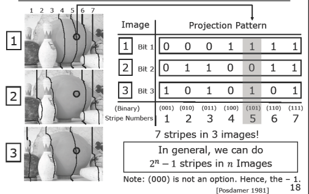
    <figcaption style="margin-top: 0.5em; text-align: center; font-size: 13px; color: #888;"><em>Figure 11: Space-time binary codeword pattern table: Encoding 2^n - 1 stripes into n sequential projection images [Posdamer 1981].</em></figcaption>
  

</figure>

<figure style="display:flex; justify-content: center; margin: 20px 0;">
  

    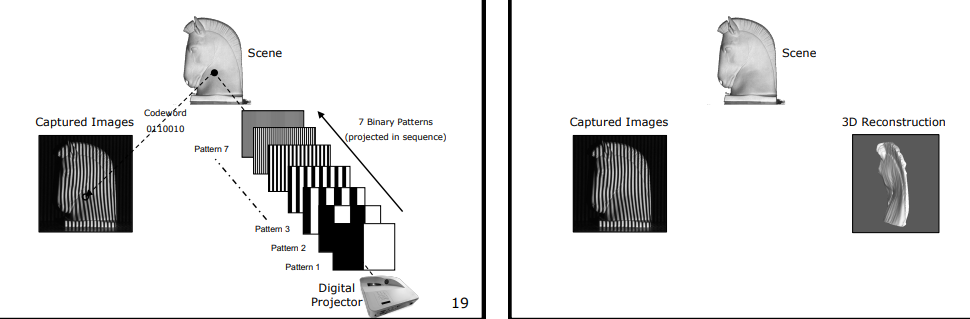
    <figcaption style="margin-top: 0.5em; text-align: center; font-size: 13px; color: #888;"><em>Figure 12: Sequence of binary projection patterns onto a scene object and the resulting 3D reconstruction.</em></figcaption>
  

</figure>

In general, $n$ sequential projection images can encode $2^n - 1$ distinct stripes (excluding `000` which represents total darkness). For instance, 8 images can uniquely encode 255 high-resolution stripes.

### 3.5 Light Bleeding and Gray Coding

- **Light Bleeding Problem:** Due to lens defocus and optical scattering, sharp black-white boundaries blur into continuous grayscale transitions. Thresholding boundary pixels into binary `0` or `1` introduces severe depth estimation errors. Standard binary encoding has many simultaneous bit transitions between adjacent codes.

<figure style="display:flex; justify-content: center; margin: 20px 0;">
  

    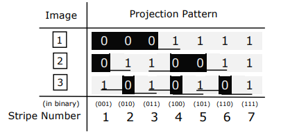
    <figcaption style="margin-top: 0.5em; text-align: center; font-size: 13px; color: #888;"><em>Figure 13: Edge transitions in standard binary coding causing severe thresholding ambiguity due to optical light bleeding.</em></figcaption>
  

</figure>

- **Gray Code Solution (Inokuchi 1984):** Gray coding ensures that adjacent stripes differ by only a single bit. Minimizing bit transitions dramatically reduces boundary thresholding errors caused by light bleeding.

<figure style="display:flex; justify-content: center; margin: 20px 0;">
  

    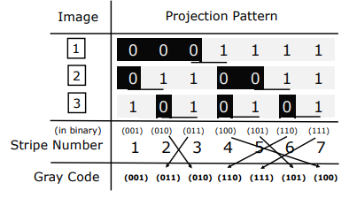
    <figcaption style="margin-top: 0.5em; text-align: center; font-size: 13px; color: #888;"><em>Figure 14: Conversion from standard binary code to Gray Code ensuring only 1 bit changes between adjacent stripes.</em></figcaption>
  

</figure>

### 3.6 Multi-Level and Color Coding (k-ary / Color Coded)

Instead of binary (on/off) coding, using $k$ intensity levels or distinct color channels (e.g., RGB ternary encoding where $k=3$) increases information density per frame:

<figure style="display:flex; justify-content: center; margin: 20px 0;">
  

    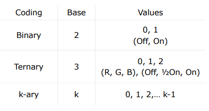
    <figcaption style="margin-top: 0.5em; text-align: center; font-size: 13px; color: #888;"><em>Figure 15: Comparison of encoding bases: Binary (k=2), Ternary (k=3), and general k-ary systems.</em></figcaption>
  

</figure>

- In a ternary system, encoding 7 stripes requires only 2 frames ($\log_3 8 \approx 2$), reducing the required frame count.

<figure style="display:flex; justify-content: center; margin: 20px 0;">
  

    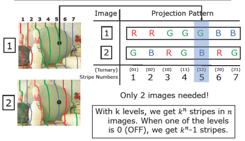
    <figcaption style="margin-top: 0.5em; text-align: center; font-size: 13px; color: #888;"><em>Figure 16: RGB color-coded ternary structured light: Encoding 7 stripes into just 2 images using Red, Green, and Blue patterns.</em></figcaption>
  

</figure>

- In general, $n$ frames with $k$ levels encode $k^n - 1$ distinct stripes.

<figure style="display:flex; justify-content: center; margin: 20px 0;">
  

    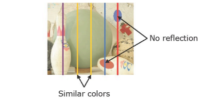
    <figcaption style="margin-top: 0.5em; text-align: center; font-size: 13px; color: #888;"><em>Figure 17: Physical limitations of color coding: Total light absorption on colored regions and color ambiguity.</em></figcaption>
  

</figure>

> **Limitations of Color Coding:** Color crosstalk between camera/projector color channels and surface spectral absorption pose challenges. For instance, projecting a bright red stripe onto a deep blue object results in total light absorption, leaving zero backscatter for the camera. Color-coded structured light requires near-neutral diffuse reflectance (the *gray world assumption*) to operate reliably.
