# Depth from Focus & Defocus

<!-- toc -->

In computer vision, depth and shape recovery methods are generally divided into two main categories: **active methods** (laser scanners, structured light, etc.) and **passive methods** (stereo vision, shape from motion, etc.). Based on optical focus constraints, **Depth from Focus** (DFF) and **Depth from Defocus** (DFD) are passive and powerful depth sensing techniques that leverage the finite depth of field of single-lens cameras as a physical depth cue.

<figure style="display:flex; justify-content: center; margin: 20px 0;">
  

    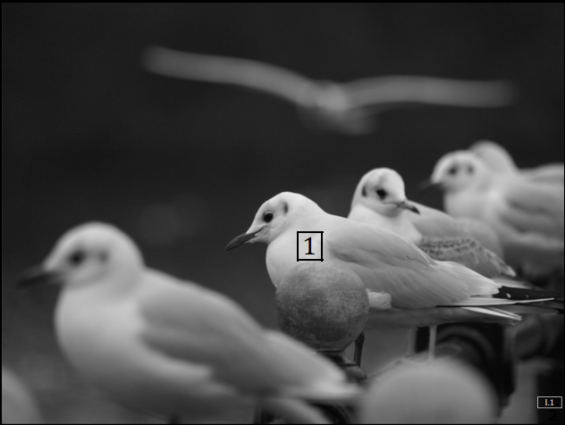
    <figcaption style="margin-top: 0.5em; text-align: center; font-size: 13px; color: #888;"><em>Figure 1: In a shot with shallow depth of field, only objects on the focus plane appear sharp, while objects in front or behind blur due to optical defocus.</em></figcaption>
  

</figure>

---

## 1. Overview

In images captured with a camera having a shallow depth of field, only objects located at the plane of focus appear sharp and crisp; objects in front of or behind this plane become defocused and blurred. According to optical physics, the amount and structure of blur are directly related to the physical distance of the object from the focus plane.

However, estimating local blur amount from a single image is mathematically an **under-constrained** problem. Given a single image patch, it is impossible to distinguish whether it appears blurry because it was captured out of focus or because the object's original surface texture is inherently smooth/blurry. For example, a sharp photo of a smooth white wall looks identical locally to an out-of-focus photo of the same wall.

<figure style="display:flex; justify-content: center; margin: 20px 0;">
  

    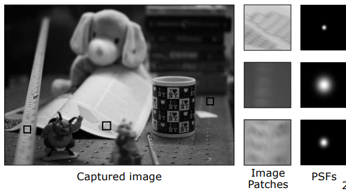
    <figcaption style="margin-top: 0.5em; text-align: center; font-size: 13px; color: #888;"><em>Figure 2: Defocus blur level and corresponding Point Spread Functions (PSFs) across different regions of a captured scene.</em></figcaption>
  

</figure>

To overcome this ambiguity, multiple images taken under different focus settings or camera parameters are required. Two primary paradigms have been developed:

1. **Depth from Focus (DFF):** Sweeps the focus plane step-by-step across the scene to collect a large focal stack. For each pixel coordinate, it searches for the image slice where contrast and sharpness are maximized.
2. **Depth from Defocus (DFD):** Typically captures only two or three images with different focus or aperture settings. It calculates scene depth directly using analytical formulas or optimization techniques by analyzing relative blur ratios between the images.

---

## 2. Point Spread Function (PSF)

To mathematically model defocus blur, the spatial energy distribution formed on the sensor by an ideal point light source (impulse) must be defined. This distribution is called the **Point Spread Function (PSF)**.

### 2.1 Circle of Confusion Geometry

According to the **Gaussian Lens Law**, a scene point at distance $u$ (or $o$) from a lens with focal length $f$ focuses perfectly at distance $v$ (or $i$) behind the lens:

$$\frac{1}{f} = \frac{1}{u} + \frac{1}{v}$$

<figure style="display:flex; justify-content: center; margin: 20px 0;">
  

    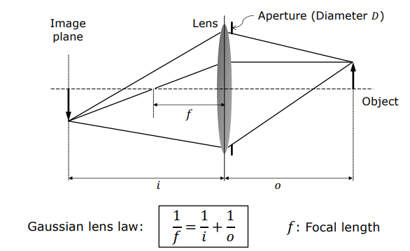
    <figcaption style="margin-top: 0.5em; text-align: center; font-size: 13px; color: #888;"><em>Figure 3: Optical diagram of the Gaussian Lens Law.</em></figcaption>
  

</figure>

If the sensor (image plane) is positioned at distance $s$ instead of the ideal focus distance $v$, focused rays intersect the sensor plane forming a circular light patch. Assuming a circular aperture, this base of the light cone is called the **Blur Circle** or **Circle of Confusion**.

<figure style="display:flex; justify-content: center; margin: 20px 0;">
  

    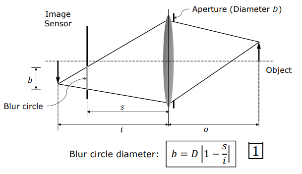
    <figcaption style="margin-top: 0.5em; text-align: center; font-size: 13px; color: #888;"><em>Figure 4: Geometric relationship between blur circle diameter ($b$) and sensor position ($s$).</em></figcaption>
  

</figure>

Using similar triangles, the diameter of the blur circle ($b$) is related to aperture diameter ($D$) as follows:

$$\frac{b}{D} = \frac{|v - s|}{v} \implies b = D \cdot s \left| \frac{1}{s} - \frac{1}{v} \right|$$

This equation demonstrates two physical ways to control defocus blur amount:

1. **Vary Sensor Position ($s$):** Translating the focal plane back and forth across the scene.
2. **Vary Aperture Size ($D$):** Stopping down the lens (reducing $D$) narrows the light cone, shrinking blur diameter ($b$) and increasing depth of field.

<figure style="display:flex; justify-content: center; margin: 20px 0;">
  

    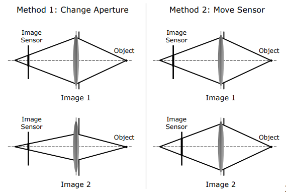
    <figcaption style="margin-top: 0.5em; text-align: center; font-size: 13px; color: #888;"><em>Figure 5: Method 1: Changing lens aperture diameter ($D$); Method 2: Translating sensor position ($s$).</em></figcaption>
  

</figure>

---

### 2.2 Pillbox vs. Gaussian PSF Models

In an ideal, diffraction-free optical system, light distribution across the blur circle can be modeled as a uniform circular disk. This is termed the **Pillbox Function**:

$$h_{\text{pillbox}}(x, y) = \begin{cases} \frac{4}{\pi b^2}, & x^2 + y^2 \leq \frac{b^2}{4} \\ 0, & \text{otherwise} \end{cases}$$

The normalization factor $\frac{4}{\pi b^2}$ enforces conservation of optical energy across expanding blur circles.

<figure style="display:flex; justify-content: center; margin: 20px 0;">
  

    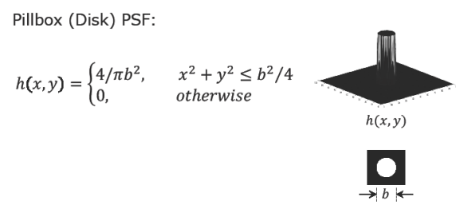
    <figcaption style="margin-top: 0.5em; text-align: center; font-size: 13px; color: #888;"><em>Figure 6: Ideal Pillbox (Disk) Point Spread Function (PSF) model.</em></figcaption>
  

</figure>

In real-world optical systems, diffraction at aperture edges, optical aberrations, surface roughness, and spatial pixel integration prevent sharp-edged pillbox distributions. Consequently, practical PSFs are realistically modeled as smooth **Gaussian Functions**:

$$h_{\text{Gaussian}}(x, y) = \frac{1}{2\pi \sigma^2} e^{-\frac{x^2+y^2}{2\sigma^2}}$$

<figure style="display:flex; justify-content: center; margin: 20px 0;">
  

    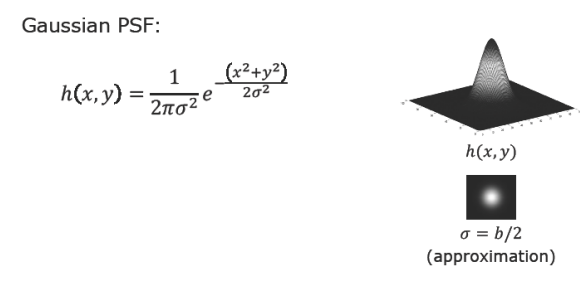
    <figcaption style="margin-top: 0.5em; text-align: center; font-size: 13px; color: #888;"><em>Figure 7: Practical Gaussian Point Spread Function (PSF) model ($\sigma \approx b/2$).</em></figcaption>
  

</figure>

Empirically, Gaussian standard deviation ($\sigma$) relates to blur circle diameter ($b$) as:

$$\sigma \approx \frac{b}{2} \propto D \cdot s \left| \frac{1}{s} - \frac{1}{v} \right|$$

---

### 2.3 Convolution and Low-Pass Filter Equivalence

Assuming depth is locally constant over small patches, defocus imaging behaves as a Linear Shift-Invariant (LSI) system. Under LSI assumptions, the captured blurry image $g(x,y)$ equals the focused image $f(x,y)$ convolved with the PSF $h(x,y)$:

$$g(x, y) = f(x, y) * h(x, y)$$

<figure style="display:flex; justify-content: center; margin: 20px 0;">
  

    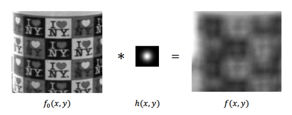
    <figcaption style="margin-top: 0.5em; text-align: center; font-size: 13px; color: #888;"><em>Figure 8: Spatial domain convolution model: Sharp image $f_0(x,y)$ convolved with PSF $h(x,y)$ yields blurred image $f(x,y)$.</em></figcaption>
  

</figure>

In the frequency (Fourier) domain, convolution converts to pointwise multiplication:

$$G(u, v) = F(u, v) \cdot H(u, v)$$

<figure style="display:flex; justify-content: center; margin: 20px 0;">
  

    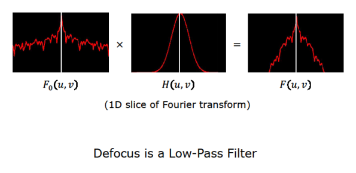
    <figcaption style="margin-top: 0.5em; text-align: center; font-size: 13px; color: #888;"><em>Figure 9: 1D Fourier slice showing that defocus acts as a Low-Pass Filter in frequency domain.</em></figcaption>
  

</figure>

Because the Fourier transform of a Gaussian is also a Gaussian, an expanding PSF in spatial space ($\sigma$ growth) corresponds to a narrower Gaussian filter in frequency space.

Optically, defocus acts as a **Low-Pass Filter**. It preserves low-frequency macro structure while attenuating high-frequency textures, sharp edges, and fine details. Depth algorithms evaluate this high-frequency loss to infer distance.

---

## 3. Depth from Focus (DFF)

**Depth from Focus (DFF)** sweeps the focus plane across the scene in step increments to collect a focal stack, identifying the focal plane slice where high-frequency content peaks for each pixel.

<figure style="display:flex; justify-content: center; margin: 20px 0;">
  

    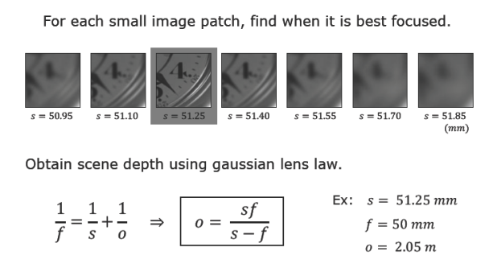
    <figcaption style="margin-top: 0.5em; text-align: center; font-size: 13px; color: #888;"><em>Figure 10: Sampling a focal stack across sensor positions ($s = 50.95 \dots 51.85\text{ mm}$), finding best focus slice ($s = 51.25\text{ mm}$), and computing object depth ($o$).</em></figcaption>
  

</figure>

---

### 3.1 Focus Measure and Modified Laplacian

To evaluate sharpness across a focal stack, a local **Focus Measure** operator is defined. Since defocus suppresses high frequencies, local brightness variations (second derivatives) quantify sharpness.

In standard Laplacian operators, horizontal and vertical second derivatives can have opposite signs and cancel out. To prevent cancellation, the **Modified Laplacian** ($\nabla_M^2$) sums absolute partial second derivatives:

$$\nabla_M^2 I = \left| \frac{\partial^2 I}{\partial x^2} \right| + \left| \frac{\partial^2 I}{\partial y^2} \right|$$

On discrete pixel grids, partial derivatives are approximated by finite difference kernels:

$$\frac{\partial^2 I}{\partial x^2} = I(x+1, y) - 2I(x, y) + I(x-1, y)$$

$$\frac{\partial^2 I}{\partial y^2} = I(x, y+1) - 2I(x, y) + I(x, y-1)$$

The focus measure score $M(x,y)$ is computed by accumulating Modified Laplacian values within a local window (typically $3 \times 3$ or $5 \times 5$):

$$M(x, y) = \sum_{i=x-K}^{x+K} \sum_{j=y-K}^{y+K} \nabla_M^2 I(i, j)$$

<figure style="display:flex; justify-content: center; margin: 20px 0;">
  

    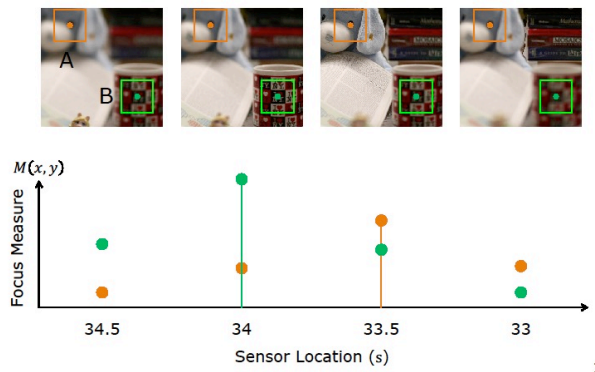
    <figcaption style="margin-top: 0.5em; text-align: center; font-size: 13px; color: #888;"><em>Figure 11: Focus Measure score $M(x,y)$ plotted against sensor location ($s$) for scene points A and B at different depths.</em></figcaption>
  

</figure>

---

### 3.2 Gaussian Interpolation for Smooth Reconstruction

Assigning depth directly to discrete focal stack layer indices causes depth resolution to be constrained by stack size $N$, creating staircase/contouring artifacts on 3D models. Increasing $N$ significantly increases capture time and memory footprint.

<figure style="display:flex; justify-content: center; margin: 20px 0;">
  

    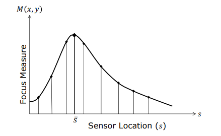
    <figcaption style="margin-top: 0.5em; text-align: center; font-size: 13px; color: #888;"><em>Figure 12: Fitting a continuous Gaussian curve around discrete focus measure samples to find true focus position $\bar{s}$.</em></figcaption>
  

</figure>

To achieve sub-stack precision, the focus measure distribution $M(s)$ near its peak is modeled as a Gaussian bell curve:

$$M(s) = M_p e^{-\frac{(s - \bar{s})^2}{2\sigma_m^2}}$$

<figure style="display:flex; justify-content: center; margin: 20px 0;">
  

    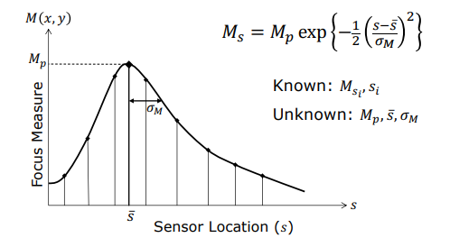
    <figcaption style="margin-top: 0.5em; text-align: center; font-size: 13px; color: #888;"><em>Figure 13: Gaussian Interpolation parameters: known discrete measurements ($M_{s_i}, s_i$) and unknowns ($M_p, \bar{s}, \sigma_M$).</em></figcaption>
  

</figure>

Taking the natural logarithm linearizes the Gaussian model:

$$\ln M(s) = \ln M_p - \frac{(s - \bar{s})^2}{2\sigma_m^2}$$

Selecting the three highest discrete focus scores ($M_1, M_2, M_3$) and equal step size $\Delta s = s_2 - s_1 = s_3 - s_2$, an analytical closed-form solution yields continuous sensor location $\bar{s}$:

$$\bar{s} = s_2 + \frac{\Delta s \left( \ln M_3 - \ln M_1 \right)}{2 \left( 2 \ln M_2 - \ln M_1 - \ln M_3 \right)}$$

Substituting continuous $\bar{s}$ into the Gaussian lens law produces smooth, high-precision 3D depth maps.

<figure style="display:flex; justify-content: center; margin: 20px 0;">
  

    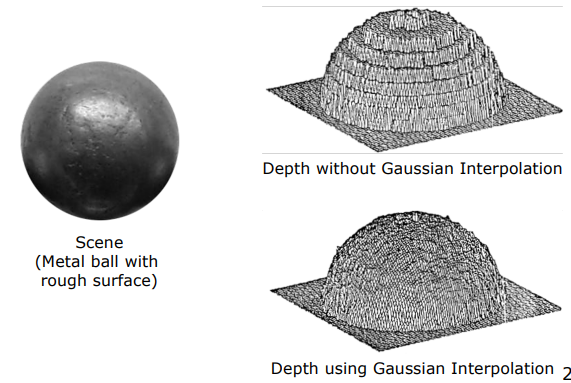
    <figcaption style="margin-top: 0.5em; text-align: center; font-size: 13px; color: #888;"><em>Figure 14: 3D reconstruction of a sphere: Without Gaussian interpolation (discrete steps) vs With Gaussian interpolation (smooth continuous surface).</em></figcaption>
  

</figure>

DFF is extensively applied in microscopy and industrial quality inspection where shallow depth of field lens systems operate at micron scales.

<figure style="display:flex; justify-content: center; margin: 20px 0;">
  

    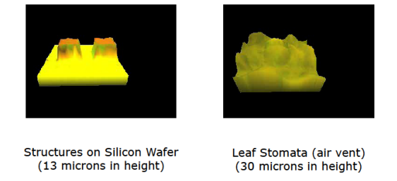
    <figcaption style="margin-top: 0.5em; text-align: center; font-size: 13px; color: #888;"><em>Figure 15: DFF micro-scale reconstructions: Silicon wafer micro-structures ($13\ \mu\text{m}$ height) and Leaf stomata ($30\ \mu\text{m}$ height).</em></figcaption>
  

</figure>

> **Key Limitation:** DFF relies strictly on high-frequency surface texture; smooth, untextured regions cannot produce differential contrast variations across focus steps.

---

## 4. Depth from Defocus (DFD)

While DFF offers high accuracy, collecting tens of images is impractical for real-time video capture (30 FPS). **Depth from Defocus (DFD)** estimates depth rapidly by analyzing relative blur differences between as few as two images.

<figure style="display:flex; justify-content: center; margin: 20px 0;">
  

    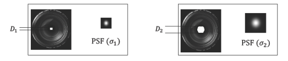
    <figcaption style="margin-top: 0.5em; text-align: center; font-size: 13px; color: #888;"><em>Figure 16: Capturing two images with different aperture diameters ($D_1, D_2$) produces distinct PSF sizes ($\sigma_1, \sigma_2$).</em></figcaption>
  

</figure>

---

### 4.1 Naive DFD Solution (Ratio of Fourier Transforms)

Consider two images ($g_1, g_2$) of scene $f(x,y)$ taken with aperture sizes $D_1, D_2$ resulting in PSF widths $\sigma_1, \sigma_2$. Since aperture settings are hardware-controlled, the ratio of PSF widths is known:

$$\frac{\sigma_1}{\sigma_2} = \frac{D_1}{D_2} \implies \sigma_2 = \sigma_1 \frac{D_2}{D_1}$$

<figure style="display:flex; justify-content: center; margin: 20px 0;">
  

    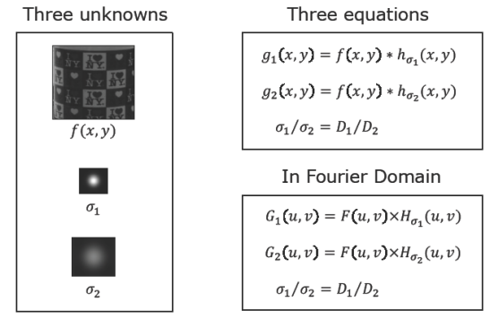
    <figcaption style="margin-top: 0.5em; text-align: center; font-size: 13px; color: #888;"><em>Figure 17: DFD system equations in spatial and Fourier domains.</em></figcaption>
  

</figure>

Writing spatial convolution equations in Fourier space:

$$G_1(u, v) = F(u, v) \cdot H_{\sigma_1}(u, v)$$

$$G_2(u, v) = F(u, v) \cdot H_{\sigma_2}(u, v)$$

Taking the ratio of Fourier transforms cancels the unknown true focused image $F(u,v)$:

$$\frac{G_1(u, v)}{G_2(u, v)} = \frac{H_{\sigma_1}(u, v)}{H_{\sigma_2}(u, v)}$$

Substituting Gaussian PSF formulas and taking logarithms yields an explicit expression for $\sigma_1$:

$$\sigma_1^2 - \sigma_2^2 = \frac{\ln G_2(u, v) - \ln G_1(u, v)}{2 \pi^2 (u^2 + v^2)}$$

Solving for $\sigma_1$ gives blur diameter $b_1 = 2\sigma_1$, from which scene depth $u$ is directly computed.

> **Warning:** The naive Fourier ratio approach is unstable under sensor noise due to high-frequency division ($u^2+v^2$).

---

### 4.2 Reconstruction-Based Stable DFD

To handle noise robustly, Favaro (2003) and Pentland (1987) proposed an optimization-based formulation. The focused image $f$ and blur parameter $\sigma_1$ are estimated jointly by minimizing reconstruction error $E$:

$$E = \iint \left( g_1(x, y) - h_{\sigma_1} * f(x, y) \right)^2 dx dy + \iint \left( g_2(x, y) - h_{\sigma_1 \frac{D_2}{D_1}} * f(x, y) \right)^2 dx dy$$

Setting partial derivatives with respect to parameters to zero ($\frac{\partial E}{\partial \sigma_1} = 0, \frac{\partial E}{\partial f} = 0$) provides stable iterative solutions resilient to image noise.

---

### 4.3 Real-Time (Video-Rate) DFD System Architecture (Nayar 1996)

Nayar designed a dual-sensor optical setup utilizing a beam-splitter prism behind a single lens to split light onto two CCD sensors placed at different optical path lengths.

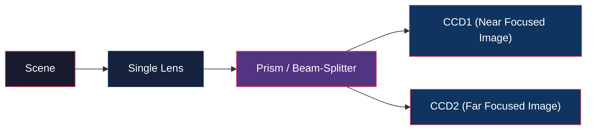

Simultaneous acquisition of near-focused and far-focused views enables real-time 3D depth map computation at 30 FPS.

---

### 4.4 Active Illumination for Textureless Surfaces

Since DFF and DFD rely on high-frequency surface detail, smooth textureless surfaces (such as uniform white walls) lack signal. Projecting a high-frequency artificial contrast pattern (*active illumination mask*) onto the scene provides synthetic texture, enabling real-time depth acquisition even on smooth or moving objects.

<figure style="display:flex; justify-content: center; margin: 20px 0;">
  

    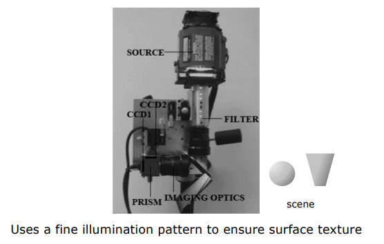
    <figcaption style="margin-top: 0.5em; text-align: center; font-size: 13px; color: #888;"><em>Figure 18: Nayar's real-time active DFD hardware architecture featuring dual sensors and pattern projection.</em></figcaption>
  

</figure>

---

## 5. Technical Comparison Summary

| Feature / Method | Depth from Focus (DFF) | Depth from Defocus (DFD) |
| :--- | :--- | :--- |
| **Number of Images** | Large Focal Stack ($10 \sim 100$ images) | Minimal ($2 \sim 3$ images) |
| **Mathematical Approach** | Local Modified Laplacian ($\nabla_M^2$) & 3-point Gaussian Interpolation | Fourier PSF ratios or iterative reconstruction optimization |
| **Depth Resolution** | Extremely High (Microscopic precision) | Moderate-High (Ideal for video frame rates) |
| **Computation Time** | High (Processes full focal stack) | Low (Analyses relative difference between 2 images) |
| **Texture Requirement** | Essential (Fails on textureless regions) | Essential (Resolved via Active Illumination Pattern) |
| **Hardware Setup** | Motorized focal translation stage | Beam-splitter dual-sensor camera |
| **Primary Applications** | Microscopy, industrial quality control, medical imaging | Mobile cameras, consumer vision, real-time tracking |
