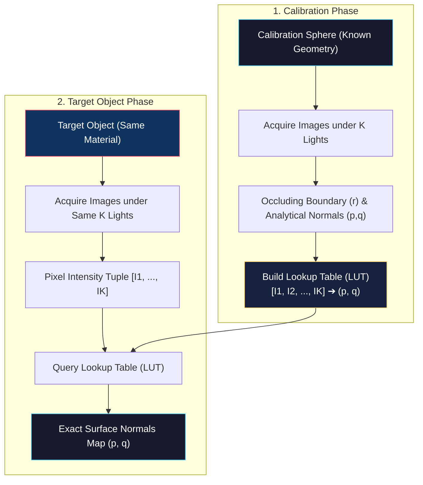
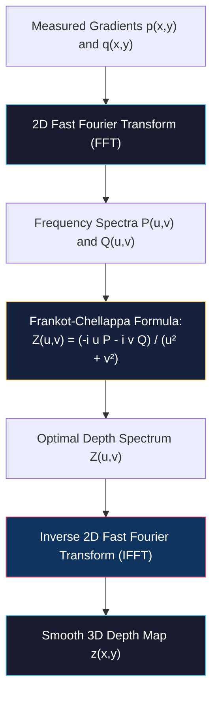
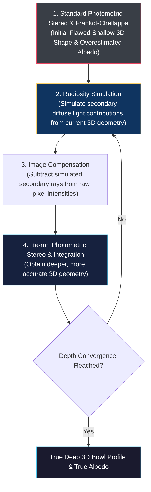

# Calibration-Based Photometric Stereo, Shape from Normals, and Interreflections

<!-- toc -->

## 1. Calibration-Based Photometric Stereo

Many real-world materials (shiny plastics, varnished woods, metals) do not exhibit ideal matte Lambertian reflection; instead, they possess complex combinations of diffuse and specular reflections. Modeling the reflectance maps of such materials with analytical formulas is mathematically intractable.

To overcome this limitation, a data-driven approach called **Calibration-Based Photometric Stereo** is employed.

<figure style="display:flex; justify-content: center; margin: 20px 0;">
  

    
    <figcaption style="margin-top: 0.5em; text-align: center; font-size: 13px; color: #888;"><em>Figure 1: Orientation consistency principle: A calibration sphere and a scene object made of identical material produce identical intensity tuples for matching surface normals under fixed lights.</em></figcaption>
  

</figure>

### 1.1 Orientation Consistency Principle

The core assumption of calibration-based photometric stereo is: **If two distinct objects are fabricated from identical material and share the same surface normal (orientation) under identical light source conditions, they must produce identical pixel intensity combinations in the camera.**

### 1.2 Implementation Steps

1. **Calibration Object:** A **calibration sphere** coated with the exact same material as the target object and possessing known geometry is placed in the scene.
2. **Sphere Image Acquisition:** The sphere is illuminated sequentially by $K$ light sources to acquire $K$ calibration images.

<figure style="display:flex; justify-content: center; margin: 20px 0;">
  

    
    <figcaption style="margin-top: 0.5em; text-align: center; font-size: 13px; color: #888;"><em>Figure 2: Calibration sphere images under K lights, occluding boundary detection (radius r), and analytical surface normals (p,q,1).</em></figcaption>
  

</figure>

3. **Analytical Normal Map:** By detecting the circular occluding boundary of the sphere, exact surface normals ($p, q$) for every sphere pixel are calculated analytically.
4. **Lookup Table (LUT) Construction:** Measured intensity tuples $[I_1, I_2, \dots, I_K]$ serve as table keys, while known surface normals $[p, q]$ serve as table values.
5. **Target Object Estimation:** The target object is illuminated under the same $K$ lights. For each pixel on the target, its measured intensity tuple is looked up in the LUT to retrieve its exact surface normal $[p, q]$.

<figure style="display:flex; justify-content: center; margin: 20px 0;">
  

    
    <figcaption style="margin-top: 0.5em; text-align: center; font-size: 13px; color: #888;"><em>Figure 3: Target object (green bottle) images under K lights and estimated local surface normals via LUT query.</em></figcaption>
  

</figure>

This data-driven technique eliminates the need for analytical BRDF equations, yielding accurate surface normal maps for complex non-Lambertian industrial materials.

<figure style="display:flex; justify-content: center; margin: 20px 0;">
  

    
    <figcaption style="margin-top: 0.5em; text-align: center; font-size: 13px; color: #888;"><em>Figure 4: Hertzmann (2005) implementation: 3D surface reconstruction of a glossy ceramic fish figurine using multiple material calibration spheres under specular highlights.</em></figcaption>
  

</figure>

> **Key Insight:** Calibration-based Photometric Stereo replaces complex analytical BRDF modeling with empirical mapping via a physical calibration sphere, enabling accurate reconstruction of shiny non-Lambertian surfaces.

---

## 2. Shape from Surface Normals

After applying Photometric Stereo, local surface gradient components ($p, q$) are obtained at every pixel. The objective of Shape from Surface Normals is to integrate these partial derivatives to reconstruct the 3D depth map ($z(x,y)$).

<figure style="display:flex; justify-content: center; margin: 20px 0;">
  

    
    <figcaption style="margin-top: 0.5em; text-align: center; font-size: 13px; color: #888;"><em>Figure 5: Differentiation and Integration relationship between gradient map [p, q, 1] and 3D depth map z(x,y).</em></figcaption>
  

</figure>

### 2.1 Naive Path Integration and Noise Breakdown

Theoretically, by setting a reference depth $z(x_0, y_0) = 0$ at the origin, depth at any pixel $(x,y)$ can be calculated by integrating gradients along a path:

$$z(x, y) = z(x_0, y_0) + \int_{x_0}^{x} -p \, dx + \int_{y_0}^{y} -q \, dy$$

<figure style="display:flex; justify-content: center; margin: 20px 0;">
  

    
    <figcaption style="margin-top: 0.5em; text-align: center; font-size: 13px; color: #888;"><em>Figure 6: Integrating from (x0, y0) to (x, y) along two distinct integration paths (Path 1 vs Path 2) on a discrete pixel grid.</em></figcaption>
  

</figure>

In real-world measurements, gradients contain noise. Under noisy gradients, path integration produces different depth values depending on the chosen path (e.g., integrating right-then-down vs down-then-right).

<figure style="display:flex; justify-content: center; margin: 20px 0;">
  

    
    <figcaption style="margin-top: 0.5em; text-align: center; font-size: 13px; color: #888;"><em>Figure 7: Accumulation of gradient noise along rows and columns across image width W and height H.</em></figcaption>
  

</figure>

Errors accumulate progressively, leading to severe surface tearing and distortion.

<figure style="display:flex; justify-content: center; margin: 20px 0;">
  

    
    <figcaption style="margin-top: 0.5em; text-align: center; font-size: 13px; color: #888;"><em>Figure 8: Surface tearing and tearing caused by path dependence when integrating noisy surface gradients.</em></figcaption>
  

</figure>

### 2.2 Frankot-Chellappa Integration Algorithm (Fourier Domain Least Squares)

To prevent noise accumulation, **Frankot and Chellappa (1988)** formulated a global Least Squares error functional that minimizes squared differences between partial derivatives of the target depth map $z(x,y)$ and measured gradients $p, q$ over the entire image:

$$D = \iint \left[ \left( \frac{\partial z}{\partial x} + p \right)^2 + \left( \frac{\partial z}{\partial y} + q \right)^2 \right] dx \, dy$$

Solving this optimization in the Fourier domain transforms derivative operations into algebraic multiplications ($\mathcal{F}\{\frac{\partial z}{\partial x}\} = i u Z(u,v)$), yielding the optimal Fourier depth spectrum:

$$Z(u, v) = \frac{-i u P(u, v) - i v Q(u, v)}{u^2 + v^2}$$

Taking the **Inverse Fast Fourier Transform (IFFT)** of $Z(u,v)$ reconstructs a smooth, noise-resistant, globally consistent 3D depth map $z(x,y)$ in seconds.

<figure style="display:flex; justify-content: center; margin: 20px 0;">
  

    
    <figcaption style="margin-top: 0.5em; text-align: center; font-size: 13px; color: #888;"><em>Figure 9: Frankot-Chellappa Fourier integration: Input surface normals, estimated seamless depth map z = f(x,y), and rendered 3D surface model.</em></figcaption>
  

</figure>

> **Key Insight:** The Frankot-Chellappa algorithm replaces local path integration with a global optimization in the Fourier frequency domain, preventing local gradient noise from destroying surface continuity.

---

## 3. Interreflections

A fundamental assumption in standard photometric stereo is that scene points receive light exclusively from direct light sources. However, for concave geometries (such as bowls, cups, or deep grooves), secondary reflections break this assumption.

<figure style="display:flex; justify-content: center; margin: 20px 0;">
  

    
    <figcaption style="margin-top: 0.5em; text-align: center; font-size: 13px; color: #888;"><em>Figure 10: Interreflections in concave surfaces: A surface point receives direct light as well as secondary bounced light reflected from surrounding inner points.</em></figcaption>
  

</figure>

### 3.1 Destructive Effects of Interreflections

1. **Multiple Bounces:** Inner surface points receive secondary and tertiary bounced rays reflected from neighboring concave patches in addition to direct light.
2. **Albedo Overestimation:** Because secondary lighting increases observed brightness, calculated surface albedo ($\rho$) is severely overestimated.
3. **Surface Flattening (Shallower Depth):** Additional light makes normal slope estimates steeper, causing depth integration to reconstruct concavities much **shallower** than their true depth.

### 3.2 Nayar-Ikeuchi-Kanade (1991) Iterative Algorithm

To remove interreflection artifacts, **Nayar, Ikeuchi, and Kanade (1991)** proposed an iterative radiosity-based algorithm:

#### Iterative Steps:

1. **Initial Rough Estimation:** Standard Photometric Stereo is run while ignoring interreflections, yielding an initial shallow shape and flawed albedo map.
2. **Interreflection Simulation:** Using the estimated 3D geometry, secondary diffuse light contributions bouncing between surface points are simulated via radiosity equations.
3. **Image Compensation:** Simulated secondary light components are subtracted from raw image intensities, creating interreflection-compensated images.
4. **Re-reconstruction:** Photometric stereo and Frankot-Chellappa integration are re-run on compensated images to produce a deeper, more accurate 3D surface profile.
5. **Iteration & Convergence:** The process repeats iteratively until the surface depth profile converges to the true deep concavity.

<figure style="display:flex; justify-content: center; margin: 20px 0;">
  

    
    <figcaption style="margin-top: 0.5em; text-align: center; font-size: 13px; color: #888;"><em>Figure 11: Convergence of the Nayar-Ikeuchi-Kanade algorithm: Transition from an initial flawed shallow profile (top line) to the true deep bowl profile (bottom line) via iterative interreflection removal.</em></figcaption>
  

</figure>

> **Key Insight:** Interreflections cause concave surfaces to appear shallower than they are. The Nayar-Ikeuchi-Kanade algorithm iteratively simulates and subtracts bounced light components, converging to the exact deep 3D profile.
