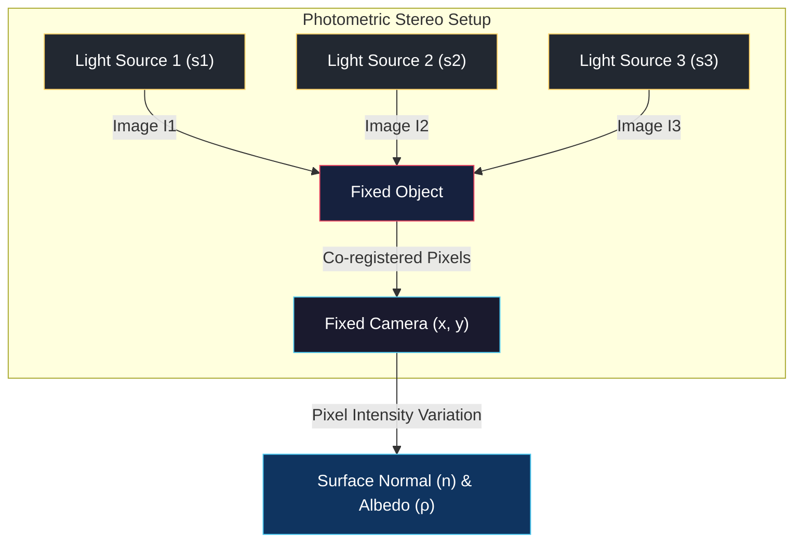
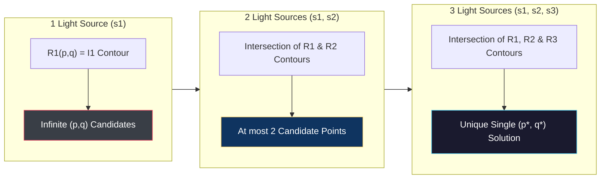
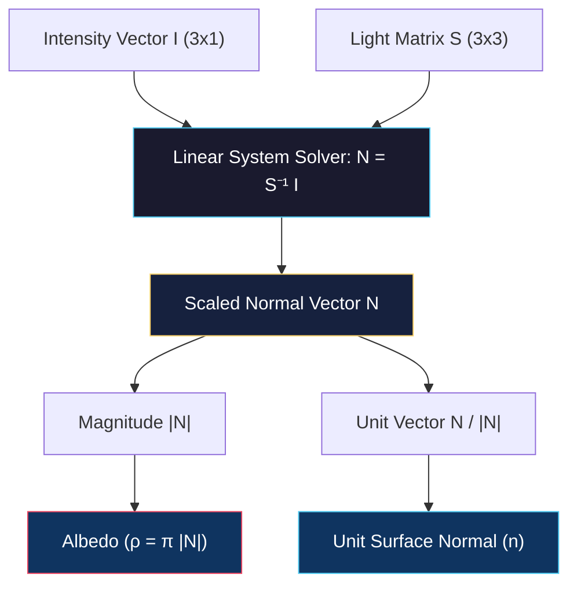

# Overview, Gradient Space, Reflectance Map, and Lambertian Case

<!-- toc -->

## 1. Overview

Interpreting the three-dimensional world from a single two-dimensional image (such as recovering depth) has always been an **under-constrained / ill-posed** problem in computer vision. Single-image approaches like **Shape from Shading** attempt to infer the two-dimensional surface gradient ($p, q$) from a single pixel intensity, yielding an infinite set of candidate solutions (**infinite ambiguity**).

<figure style="display:flex; justify-content: center; margin: 20px 0;">
  

    
    <figcaption style="margin-top: 0.5em; text-align: center; font-size: 13px; color: #888;"><em>Figure 1: Photometric Stereo acquisition setup and pixel intensity equation I = F(Source, Normal n, Reflectance).</em></figcaption>
  

</figure>

To overcome this fundamental limitation, **Photometric Stereo**, introduced by **Robert Woodham (1980)**, presents a revolutionary technique for 3D shape reconstruction in controlled illumination environments (such as industrial scanners and quality control systems).

### 1.1 Core Assumptions and Setup

Photometric Stereo relies on three main physical assumptions to perform reliable 3D shape recovery:

1. **Camera is Fixed:** The camera and object remain perfectly stationary throughout the image acquisition process. Consequently, all pixel coordinates ($x, y$) across multiple images are geometrically **co-registered**.
2. **Light Sources are Variable:** The object is illuminated sequentially (one at a time) by at least 3 distinct light sources whose directions and intensities are precisely known.
3. **Pixel Intensity Variation:** The brightness fluctuations of a fixed pixel under varying light source directions directly encode the direction of the local surface normal vector ($\mathbf{n}$).

> **Key Insight:** By keeping camera geometry fixed and varying only illumination, the pixel correspondence problem is completely eliminated. Intensity changes at each pixel become a direct function of local surface orientation.

---

## 2. Gradient Space and Reflectance Map

To represent surface orientations mathematically and geometrically in photometric stereo, **Gradient Space ($p-q$ plane)** and **Reflectance Map** concepts are employed.

### 2.1 Gradient Space

Consider a continuous 3D surface defined by $z = f(x, y)$. The negative partial derivatives of this surface yield the local surface slopes, known as gradient components ($p, q$):

$$p = -\frac{\partial z}{\partial x}, \quad q = -\frac{\partial z}{\partial y}$$

Under this definition, the unnormalized surface normal vector $\mathbf{N}$ at any point is expressed as:

$$\mathbf{N} = \begin{bmatrix} p \\ q \\ 1 \end{bmatrix}$$

Dividing this vector by its magnitude yields the unit surface normal vector ($\mathbf{n}$) on the unit hemisphere:

$$\mathbf{n} = \frac{\mathbf{N}}{|\mathbf{N}|} = \frac{1}{\sqrt{p^2 + q^2 + 1}} \begin{bmatrix} p \\ q \\ 1 \end{bmatrix}$$

<figure style="display:flex; justify-content: center; margin: 20px 0;">
  

    
    <figcaption style="margin-top: 0.5em; text-align: center; font-size: 13px; color: #888;"><em>Figure 2: Gradient space parameterization on the z = 1 projection plane showing N(p, q, 1) and S(ps, qs, 1).</em></figcaption>
  

</figure>

#### Geometric Interpretation:
Imagine a plane parallel to the image plane located at distance $z = 1$. Extending a surface normal from the origin until it intersects this plane projects the normal to 2D coordinates $(p, q)$, which correspond directly to the surface gradient. This $p-q$ coordinate plane is called **gradient space**.

<figure style="display:flex; justify-content: center; margin: 20px 0;">
  

    
    <figcaption style="margin-top: 0.5em; text-align: center; font-size: 13px; color: #888;"><em>Figure 3: Surface normal N(p, q, 1) under distant light source s and camera viewing direction v = (0,0,1).</em></figcaption>
  

</figure>

Similarly, a distant point light source direction ($\mathbf{s}$) is parameterized in gradient space as:

$$\mathbf{s} = \frac{1}{\sqrt{p_s^2 + q_s^2 + 1}} \begin{bmatrix} p_s \\ q_s \\ 1 \end{bmatrix}$$

### 2.2 Reflectance Map ($R(p,q)$)

Given material reflectance properties (BRDF), light source direction ($\mathbf{s}$), and source brightness, the function mapping surface orientation ($p, q$) to observed pixel intensity ($I$) is defined as the **Reflectance Map ($R(p, q)$)**:

$$I(x, y) = R(p, q)$$

For an ideal matte (Lambertian) surface with normalized radiometric factors, brightness depends solely on the dot product of the unit surface normal and unit light vector (Lambert's Cosine Law):

<figure style="display:flex; justify-content: center; margin: 20px 0;">
  

    
    <figcaption style="margin-top: 0.5em; text-align: center; font-size: 13px; color: #888;"><em>Figure 4: Diffuse reflection behavior on ideal matte (Lambertian) surfaces across incident angles (Example: Clay pot).</em></figcaption>
  

</figure>

$$I = \cos\theta_i = \mathbf{n} \cdot \mathbf{s}$$

<figure style="display:flex; justify-content: center; margin: 20px 0;">
  

    
    <figcaption style="margin-top: 0.5em; text-align: center; font-size: 13px; color: #888;"><em>Figure 5: Incident angle θi between light source vector s and surface normal n under camera view v = (0,0,1).</em></figcaption>
  

</figure>

Expressing this dot product explicitly in terms of gradient space parameters ($p, q$) yields the general Lambertian reflectance map equation:

$$R(p, q) = \frac{p p_s + q q_s + 1}{\sqrt{p^2 + q^2 + 1} \sqrt{p_s^2 + q_s^2 + 1}}$$

<figure style="display:flex; justify-content: center; margin: 20px 0;">
  

    
    <figcaption style="margin-top: 0.5em; text-align: center; font-size: 13px; color: #888;"><em>Figure 6: Reflectance map R(p,q) in gradient space with peak brightness at (ps, qs).</em></figcaption>
  

</figure>

### 2.3 Iso-Brightness Contours

Geometric loci on the reflectance map that produce identical intensity values ($I = C$) are called **iso-brightness contours**.

<figure style="display:flex; justify-content: center; margin: 20px 0;">
  

    
    <figcaption style="margin-top: 0.5em; text-align: center; font-size: 13px; color: #888;"><em>Figure 7: Conic section (iso-brightness contour) formed on the z = 1 plane by surface normals sharing constant angle with light source.</em></figcaption>
  

</figure>

* **Maximum Peak:** When the surface normal points directly toward the light source ($p = p_s, q = q_s$), $\cos\theta_i = 1$, forming the brightest center of the map.
* **Conic Sections:** For Lambertian surfaces, normals sharing a constant angle with the light vector form a cone. The intersection of this cone with the $z=1$ gradient plane forms ellipses, parabolas, or hyperbolas in gradient space.
* **Terminator (Shadow Line):** At the boundary where brightness falls to zero ($I = 0$ or $90^\circ$ incident angle), setting the numerator to zero yields a straight line in gradient space:

$$p p_s + q q_s + 1 = 0$$

<figure style="display:flex; justify-content: center; margin: 20px 0;">
  

    
    <figcaption style="margin-top: 0.5em; text-align: center; font-size: 13px; color: #888;"><em>Figure 8: Iso-brightness contours (0.1 to 1.0) and the θi = 90° terminator line on the reflectance map.</em></figcaption>
  

</figure>

A single intensity measurement at a pixel restricts $(p,q)$ to one of these contours. Because infinitely many $(p,q)$ points lie along a single contour, recovering the surface normal from a single image is mathematically ambiguous.

<figure style="display:flex; justify-content: center; margin: 20px 0;">
  

    
    <figcaption style="margin-top: 0.5em; text-align: center; font-size: 13px; color: #888;"><em>Figure 9: Mapping of a single pixel measurement on image I to an iso-brightness contour, demonstrating single-image ambiguity.</em></figcaption>
  

</figure>

---

## 3. Resolving Ambiguity via Intersection in Photometric Stereo

Photometric Stereo resolves this infinite set of candidate orientations by intersecting iso-brightness contours obtained under controlled lights from different directions:

<figure style="display:flex; justify-content: center; margin: 20px 0;">
  

    
    <figcaption style="margin-top: 0.5em; text-align: center; font-size: 13px; color: #888;"><em>Figure 10: Surface point illuminated sequentially by three distinct light sources (s1, s2, s3).</em></figcaption>
  

</figure>

* **One Light Source ($\mathbf{s}_1$):** Measured intensity $I_1$ defines a contour $R_1(p,q) = I_1$. The true solution is one of infinitely many candidate points along this curve.

<figure style="display:flex; justify-content: center; margin: 20px 0;">
  

    
    <figcaption style="margin-top: 0.5em; text-align: center; font-size: 13px; color: #888;"><em>Figure 11: Iso-brightness contour I1 = 0.9 on R1(p,q) under light s1 yielding infinitely many candidate normals.</em></figcaption>
  

</figure>

* **Two Light Sources ($\mathbf{s}_1, \mathbf{s}_2$):** A second light source yields intensity $I_2$ and contour $R_2(p,q) = I_2$. The two curves intersect at most at two points, reducing candidate normals to two.

<figure style="display:flex; justify-content: center; margin: 20px 0;">
  

    
    <figcaption style="margin-top: 0.5em; text-align: center; font-size: 13px; color: #888;"><em>Figure 12: Intersection of R1 and R2 contours under two light sources (s1, s2) reducing candidate normals to two points.</em></figcaption>
  

</figure>

* **Three Light Sources ($\mathbf{s}_1, \mathbf{s}_2, \mathbf{s}_3$):** A third light source yields intensity $I_3$ and contour $R_3(p,q) = I_3$. Intersecting all three curves pinpoints a **unique single $(p^*, q^*)$ point**, completely resolving the surface normal ambiguity.

> **Key Insight:** Each additional light source introduces an independent geometric constraint in gradient space. While two light sources reduce ambiguity to two points, a third light source uniquely resolves the true local surface normal.

---

## 4. Lambertian Case

When surface reflectance is ideal matte (Lambertian), surface normals can be computed rapidly using linear algebra without explicitly evaluating gradient space contours. Furthermore, spatially varying surface albedo ($\rho$) can be recovered simultaneously.

### 4.1 Linear System Formulation

Sequentially illuminating the scene with unit light sources $\mathbf{s}_1, \mathbf{s}_2, \mathbf{s}_3$ produces three measured pixel intensities according to Lambert's law:

$$I_1 = \frac{\rho}{\pi} (\mathbf{n} \cdot \mathbf{s}_1), \quad I_2 = \frac{\rho}{\pi} (\mathbf{n} \cdot \mathbf{s}_2), \quad I_3 = \frac{\rho}{\pi} (\mathbf{n} \cdot \mathbf{s}_3)$$

We express this system as a compact matrix multiplication:

$$\mathbf{I} = S \mathbf{N}$$

Where:

* $\mathbf{I} = \begin{bmatrix} I_1 \\ I_2 \\ I_3 \end{bmatrix}$ is the $3 \times 1$ intensity vector.
* $S = \begin{bmatrix} \mathbf{s}_1^T \\ \mathbf{s}_2^T \\ \mathbf{s}_3^T \end{bmatrix} = \begin{bmatrix} p_{s1} & q_{s1} & 1 \\ p_{s2} & q_{s2} & 1 \\ p_{s3} & q_{s3} & 1 \end{bmatrix}$ is the known $3 \times 3$ light direction matrix.
* $\mathbf{N} = \frac{\rho}{\pi} \mathbf{n}$ is the albedo-scaled normal vector.

If the light source vectors are linearly independent ($\det(S) \neq 0$), matrix $S$ is invertible, allowing direct computation of vector $\mathbf{N}$:

$$\mathbf{N} = S^{-1} \mathbf{I}$$

Decomposing magnitude and direction of $\mathbf{N}$ isolates albedo and unit surface normal simultaneously:

$$\text{Albedo } (\rho) = \pi |\mathbf{N}|$$

$$\text{Unit Surface Normal } (\mathbf{n}) = \frac{\mathbf{N}}{|\mathbf{N}|}$$

#### Example Reconstruction Results:

<figure style="display:flex; justify-content: center; margin: 20px 0;">
  

    
    <figcaption style="margin-top: 0.5em; text-align: center; font-size: 13px; color: #888;"><em>Figure 16: Photometric Stereo results for a sphere with four albedo quadrants: 5 input images, estimated surface normal needle map, and estimated albedo map.</em></figcaption>
  

</figure>

<figure style="display:flex; justify-content: center; margin: 20px 0;">
  

    
    <figcaption style="margin-top: 0.5em; text-align: center; font-size: 13px; color: #888;"><em>Figure 17: Photometric Stereo applied to a two-tone face mask: input images, needle map (normals), and recovered albedo map.</em></figcaption>
  

</figure>

### 4.2 Singularities

If light vectors are coplanar, matrix $S$ becomes singular ($\det(S) = 0$), rendering the system unsolvable.

<figure style="display:flex; justify-content: center; margin: 20px 0;">
  

    
    <figcaption style="margin-top: 0.5em; text-align: center; font-size: 13px; color: #888;"><em>Figure 13: Coplanar light sources singularity: All light vectors s1, s2, s3 and origin lie on a single plane (det(S) = 0).</em></figcaption>
  

</figure>

For example, when using sunlight variations throughout the day for outdoor photometric stereo, celestial geometry introduces singularities:

<figure style="display:flex; justify-content: center; margin: 20px 0;">
  

    
    <figcaption style="margin-top: 0.5em; text-align: center; font-size: 13px; color: #888;"><em>Figure 14: Equinox singularity: Solar path along the equatorial plane causes all light vectors throughout the day to remain coplanar.</em></figcaption>
  

</figure>

* **Equinox Singularity:** During an equinox, the sun moves along the celestial equator, causing all illumination vectors throughout the day to lie within the same plane ($\det(S) = 0$), making 3D recovery impossible.

### 4.3 Overdetermined Systems ($K > 3$) and Least Squares

To reduce noise sensitivity and eliminate shadow regions, $K$ ($K > 3$) light sources are often used, expanding $S$ to size $K \times 3$. The robust vector $\mathbf{N}$ is computed using **Least Squares**:

$$\mathbf{N} = (S^T S)^{-1} S^T \mathbf{I}$$

### 4.4 Effective Light Source Property

A crucial physical simplification applies specifically to Lambertian surfaces:

Multiple point lights or broad area light sources operating simultaneously (excluding cast shadows and interreflections) behave mathematically and physically as a single **effective point light source ($\mathbf{s}_{\text{eff}}$)** located at their intensity-weighted centroid.

<figure style="display:flex; justify-content: center; margin: 20px 0;">
  

    
    <figcaption style="margin-top: 0.5em; text-align: center; font-size: 13px; color: #888;"><em>Figure 15: Equivalence of multiple point lights (1) or extended area light source (2) to a single effective light source si.</em></figcaption>
  

</figure>
