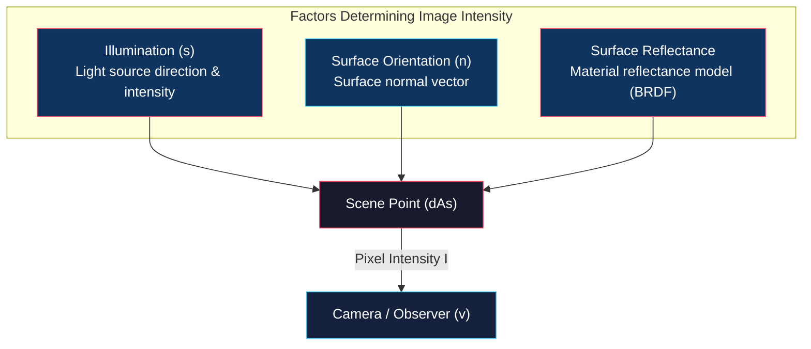
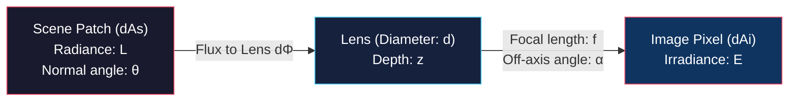
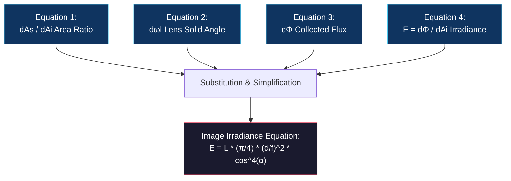
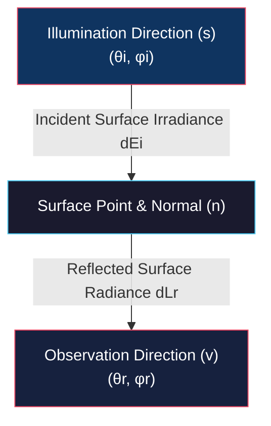

# Overview, Radiometric Concepts, Radiance, and BRDF

<!-- toc -->

## 1. Overview: The Image Intensity Understanding Problem

One of the most fundamental physical questions in computer vision is: **What does the measured intensity value of a single pixel (e.g., brightness 65) tell us about the corresponding physical point in the scene?** This challenge is known as the **image intensity understanding problem**.

<figure style="display:flex; justify-content: center; margin: 20px 0;">
  

    
    <figcaption style="margin-top: 0.5em; text-align: center; font-size: 13px; color: #888;"><em>Figure 1: Computer vision image acquisition pipeline: Illumination illuminates the scene, reflected light enters the camera, feeding the Vision System.</em></figcaption>
  

</figure>

Three main physical factors determine the intensity value of a pixel and make this process complex:

1. **Illumination:** The number, type (point, area, or extended sources like the sky), brightness, and directions of light sources ($\mathbf{s}$).
2. **Surface Orientation:** The three-dimensional surface normal vector ($\mathbf{n}$) at the point of interest.
3. **Surface Reflectance:** The capability of the material to receive light from a specific incident direction and reflect it toward the camera direction (material properties).

<figure style="display:flex; justify-content: center; margin: 20px 0;">
  

    
    <figcaption style="margin-top: 0.5em; text-align: center; font-size: 13px; color: #888;"><em>Figure 2: Key physical factors determining pixel brightness: Illumination, surface normal n, and observer position.</em></figcaption>
  

</figure>

While we have only a single measurement value (pixel intensity $I$) on the image side, we have numerous unknown variables on the scene side (illumination parameters, surface orientation, and reflectance coefficients). Consequently, the image intensity understanding problem is **severely under-constrained**.

> **Key Insight:** Although inferring 3D shape and reflectance from a single pixel brightness seems impossible, applying physical laws of light propagation and surface reflectance constraints renders this under-constrained problem mathematically solvable.

---

## 2. Radiometric Concepts

**Radiometry** is the science of measuring electromagnetic radiation (including visible light). The key radiometric concepts used in computer vision to interpret pixel intensities are defined below:

### 2.1 2D Angle

On a circle, the angle $d\theta$ subtended by an arc length $dl$ from the center is defined as the arc length divided by the radius $r$:

$$d\theta = \frac{dl}{r}$$

<figure style="display:flex; justify-content: center; margin: 20px 0;">
  

    
    <figcaption style="margin-top: 0.5em; text-align: center; font-size: 13px; color: #888;"><em>Figure 3: Geometric definition of a 2D angle (in radians) on a circle.</em></figcaption>
  

</figure>

The unit is **radians (rad)**, which is dimensionless since it is a ratio of two lengths. A full circle subtends $2\pi$ radians.

### 2.2 3D Solid Angle

In 3D space, when viewed from a point $P$, the solid angle subtended by an infinitesimal area $dA$ at distance $r$ considers the slant angle $\theta$ relative to the line of sight. The foreshortened area is calculated as $dA' = dA \cos\theta$.

The solid angle $d\omega$ is defined as:

$$d\omega = \frac{dA'}{r^2} = \frac{dA \cos\theta}{r^2}$$

<figure style="display:flex; justify-content: center; margin: 20px 0;">
  

    
    <figcaption style="margin-top: 0.5em; text-align: center; font-size: 13px; color: #888;"><em>Figure 4: Conical spatial geometry of 3D solid angle (dω) and foreshortened area (dA').</em></figcaption>
  

</figure>

The unit is **steradians (sr)**, which is also dimensionless. Geometric integration yields:
- Total solid angle subtended by a hemisphere: $2\pi \text{ sr}$
- Total solid angle subtended by a full sphere: $4\pi \text{ sr}$

### 2.3 Radiant Flux ($\Phi$)

Radiant flux is the total electromagnetic power emitted by a light source or received by a surface per unit time. Its unit is **Watts (W)**:

$$\Phi = \frac{dQ}{dt}$$

<figure style="display:flex; justify-content: center; margin: 20px 0;">
  

    
    <figcaption style="margin-top: 0.5em; text-align: center; font-size: 13px; color: #888;"><em>Figure 5: Radiant flux dΦ emitted from point light source J through solid angle dω.</em></figcaption>
  

</figure>

### 2.4 Radiant Intensity ($J$)

Radiant intensity is the flux emitted by a point light source per unit solid angle in a specific direction $d\omega$:

$$J = \frac{d\Phi}{d\omega}$$

Measured in **Watts per steradian (W/sr)**, this quantity represents the directional brightness of a point light source.

### 2.5 Surface Irradiance ($E$)

Surface irradiance is the total radiant flux incident per unit surface area:

$$E = \frac{d\Phi}{dA}$$

Its unit is **Watts per square meter ($\text{W/m}^2$)**. For a point source of radiant intensity $J$ at distance $r$ with surface normal inclined by angle $\theta$, surface irradiance is given by:

$$E = \frac{J \cos\theta}{r^2}$$

This equation expresses two fundamental physical laws:

1. **Inverse Square Law ($1/r^2$ Fall-off):** Irradiance decreases inversely with the square of the distance from the light source.
2. **Cosine Dependence (Lambert's Cosine Law):** As the slant angle $\theta$ increases, the effective area capturing the flux shrinks and irradiance decreases. Irradiance is maximal when light hits perpendicularly ($\theta = 0^\circ$) and drops to zero at glancing incidence ($\theta = 90^\circ$).

### 2.6 Surface Radiance ($L$)

Surface radiance measures the brightness of light emitted, reflected, or transmitted from a surface point in a specific direction. To remove geometric artifacts such as sensor distance (shrinking solid angle) and expanding surface patch area, radiance is defined as **the flux per unit solid angle per unit foreshortened area**:

$$L = \frac{d^2\Phi}{d\omega \cdot \cos\theta_r \, dA}$$

<figure style="display:flex; justify-content: center; margin: 20px 0;">
  

    
    <figcaption style="margin-top: 0.5em; text-align: center; font-size: 13px; color: #888;"><em>Figure 6: Definition of surface radiance (L) per unit foreshortened area and per unit solid angle.</em></figcaption>
  

</figure>

Measured in **$\text{W} / (\text{m}^2 \cdot \text{sr})$**, radiance depends on the observation direction ($\theta_r$) and varies directionally according to the material's reflectance properties.

---

## 3. Scene Radiance & Image Irradiance Relationship

One of the fundamental physical formulations in computer vision links the scene radiance ($L$) emitted by a scene patch to the image irradiance ($E$) received at the corresponding pixel on the image plane.

<figure style="display:flex; justify-content: center; margin: 20px 0;">
  

    
    <figcaption style="margin-top: 0.5em; text-align: center; font-size: 13px; color: #888;"><em>Figure 7: Solid angle relationship between image pixels and scene surface patches in a thin-lens camera model.</em></figcaption>
  

</figure>

Consider a single-lens camera system with effective focal length $f$ and lens diameter $d$. A pixel of area $dA_i$ on the image plane views a surface patch of area $dA_s$ in the scene along rays passing through the optical center. The surface normal makes an angle $\theta$ with the line of sight, while the line of sight makes an angle $\alpha$ with the optical axis. The depth of the patch is $z$.

Four fundamental equations are established in this geometry:

### Equation 1: Solid Angle Equality
The solid angles subtended by the pixel and scene patch at the lens center are equal ($d\omega_i = d\omega_s$):

$$\frac{dA_i \cos\alpha}{(f / \cos\alpha)^2} = \frac{dA_s \cos\theta}{(z / \cos\alpha)^2} \implies \frac{dA_s}{dA_i} = \frac{z^2 \cos\alpha}{f^2 \cos\theta}$$

### Equation 2: Lens Solid Angle
The solid angle subtended by the lens when viewed from the scene point is the projected lens area over distance squared:

$$d\omega_l = \frac{\frac{\pi d^2}{4} \cos\alpha}{(z / \cos\alpha)^2} = \frac{\pi d^2 \cos^3\alpha}{4 z^2}$$

<figure style="display:flex; justify-content: center; margin: 20px 0;">
  

    
    <figcaption style="margin-top: 0.5em; text-align: center; font-size: 13px; color: #888;"><em>Figure 8: Solid angle dωL subtended by lens diameter d as seen from a scene point.</em></figcaption>
  

</figure>

### Equation 3: Radiant Flux Collected by Lens
The radiant flux emitted by the scene patch and captured by the lens is expressed using the radiance definition:

$$d\Phi = L \cdot dA_s \cos\theta \cdot d\omega_l$$

### Equation 4: Image Irradiance
Since all flux entering the lens falls on the corresponding pixel area, image irradiance is flux over pixel area:

$$E = \frac{d\Phi}{dA_i}$$

### The Image Irradiance Equation

Substituting and simplifying these four equations yields the fundamental **Image Irradiance Equation**:

$$E = L \cdot \frac{\pi}{4} \left(\frac{d}{f}\right)^2 \cos^4\alpha$$

> **Critical Physical Takeaways:**
> 1. **Linearity:** Image irradiance ($E$) is directly proportional to scene radiance ($L$) ($E \propto L$).
> 2. **Vignetting ($\cos^4\alpha$ Fall-off):** As the angle $\alpha$ off the optical axis increases, image irradiance drops by $\cos^4\alpha$. This physical drop-off is mitigated via compound lens design or digital calibration.
> 3. **Depth Independence:** The depth parameter $z$ does not appear in the final equation! Moving the camera further away increases the scene area $dA_s$ viewed by a pixel proportional to $z^2$. Simultaneously, the solid angle $d\omega_l$ of the lens shrinks proportional to $1/z^2$. These two effects cancel out perfectly, making **image irradiance completely independent of scene depth**.

<figure style="display:flex; justify-content: center; margin: 20px 0;">
  

    
    <figcaption style="margin-top: 0.5em; text-align: center; font-size: 13px; color: #888;"><em>Figure 9: Depth independence of image irradiance: Increased distance enlarges viewed scene area as z^2 while lens solid angle shrinks as 1/z^2.</em></figcaption>
  

</figure>

<figure style="display:flex; justify-content: center; margin: 20px 0;">
  

    
    <figcaption style="margin-top: 0.5em; text-align: center; font-size: 13px; color: #888;"><em>Figure 10: Complete radiometric pipeline flow: Light source → Surface Irradiance → Scene Radiance L → Camera → Image Irradiance E.</em></figcaption>
  

</figure>

---

## 4. Bidirectional Reflectance Distribution Function (BRDF)

The manner in which a surface reflects incoming light depends on atomic and structural material properties. To model this in a general mathematical framework, the **BRDF (Bidirectional Reflectance Distribution Function)** is used.

<figure style="display:flex; justify-content: center; margin: 20px 0;">
  

    
    <figcaption style="margin-top: 0.5em; text-align: center; font-size: 13px; color: #888;"><em>Figure 11: 4D geometry of the BRDF function specified by spherical zenith (θ) and azimuth (φ) angles.</em></figcaption>
  

</figure>

BRDF is parametrized using a bidirectional geometry:
- **Incident (illumination) direction:** $(\theta_i, \phi_i)$
- **Reflected (observation) direction:** $(\theta_r, \phi_r)$

These directions are specified using **zenith angle ($\theta$)** and **azimuth angle ($\phi$)**.

### 4.1 Mathematical Definition

The BRDF ($f$) is a **4-dimensional function** defined as the ratio of reflected surface radiance ($L$) in the observation direction to the incident surface irradiance ($E$):

$$f(\theta_i, \phi_i, \theta_r, \phi_r) = \frac{L(\theta_r, \phi_r)}{E(\theta_i, \phi_i)}$$

Its unit is **$\text{sr}^{-1}$ (inverse steradians)**.

### 4.2 Key Physical Properties of BRDF

The BRDF function satisfies three key physical principles:

1. **Non-Negativity:** Since energy cannot be negative, BRDF is strictly non-negative:
   $$f \ge 0$$

2. **Helmholtz Reciprocity:** Swapping the light source and observer positions leaves the BRDF value unchanged:
   $$f(\theta_i, \phi_i, \theta_r, \phi_r) = f(\theta_r, \phi_r, \theta_i, \phi_i)$$

3. **Isotropy vs. Anisotropy:**
   - **Isotropic:** Homogeneous materials (such as matte paint or ceramic) do not change brightness when rotated around the surface normal. For these materials, BRDF dimensionality reduces to 3D as it depends only on the azimuth angle difference:
     $$f(\theta_i, \theta_r, \phi_r - \phi_i)$$
   - **Anisotropic:** Materials with oriented microstructures (brushed metals, velvet fabric, butterfly wings, peacock feathers) exhibit directional behavior. Rotating the surface about its normal changes its brightness dramatically, so their BRDF remains 4-dimensional.

<figure style="display:flex; justify-content: center; margin: 20px 0;">
  

    
    <figcaption style="margin-top: 0.5em; text-align: center; font-size: 13px; color: #888;"><em>Figure 12: Visual comparison of isotropic BRDF (left) and anisotropic BRDF (right) rendered spheres.</em></figcaption>
  

</figure>
