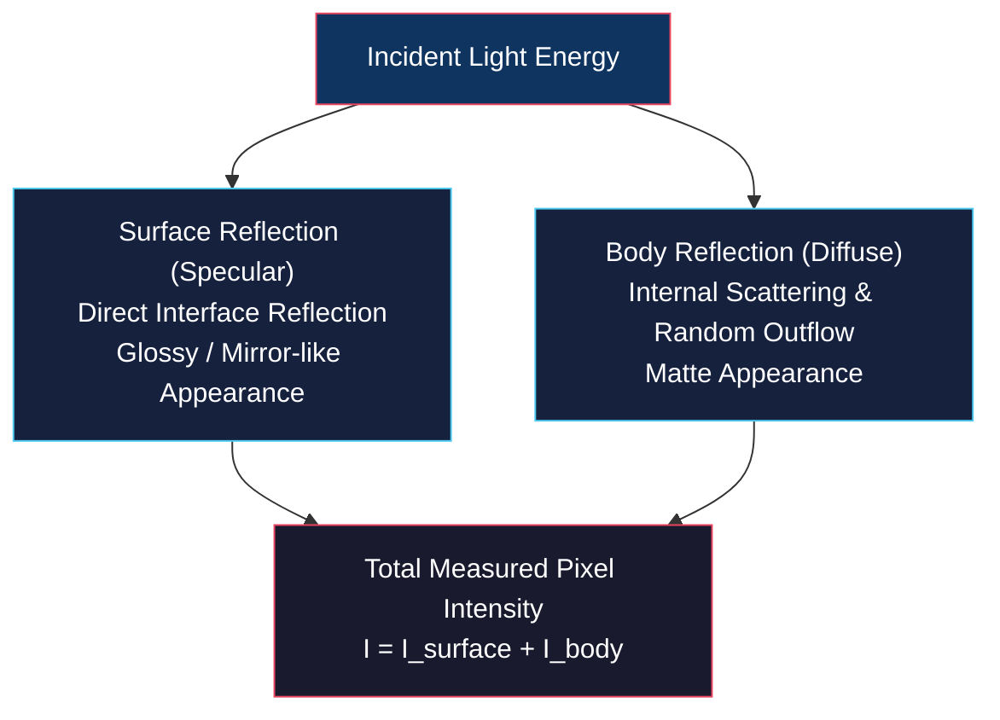
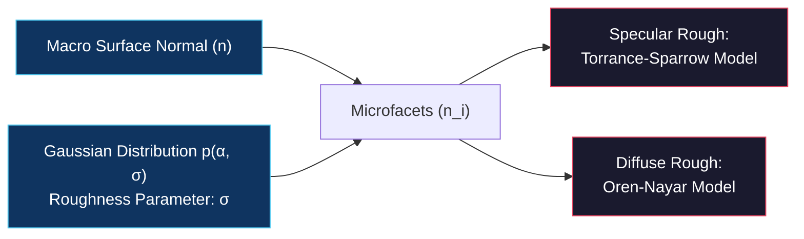

# Reflectance Models, Rough Surfaces, and Dichromatic Model

<!-- toc -->

## 1. Reflectance Models

Reflection processes in nature are explained primarily by the combination of two physical mechanisms:

1. **Surface (Specular) Reflection:** Light reflects directly at the material interface without entering the bulk medium. It dominates on smooth metals, glass, and mirrors, giving objects a glossy appearance.
2. **Body (Diffuse) Reflection:** Light penetrates the surface, undergoes multiple internal refractions and scattering off heterogeneous particles inside the material, and exits in random directions. It dominates on clay, plaster, and paper, producing a matte appearance.

<figure style="display:flex; justify-content: center; margin: 20px 0;">
  

    
    <figcaption style="margin-top: 0.5em; text-align: center; font-size: 13px; color: #888;"><em>Figure 1: Physical mechanisms of Surface (Specular) and Body (Diffuse) reflection processes.</em></figcaption>
  

</figure>

<figure style="display:flex; justify-content: center; margin: 20px 0;">
  

    
    <figcaption style="margin-top: 0.5em; text-align: center; font-size: 13px; color: #888;"><em>Figure 2: Real-world materials showcasing Body (clay pot), Surface (chrome sphere), and Hybrid (varnished wood, paint can) reflection.</em></figcaption>
  

</figure>

### 1.1 Lambertian Model (Body Reflection)

Modeling ideal matte surfaces, the Lambertian model assumes that a surface appears equally bright regardless of the viewing direction (radiance is independent of observation angle). Its BRDF is constant:

$$f_{\text{Lambertian}} = \frac{\rho_d}{\pi}$$

where $\rho_d$ is the material **albedo** ($0 \leq \rho_d \leq 1$; 0 for perfectly black, 1 for perfectly white).

The radiance equation for a Lambertian surface is given by:

$$L = \frac{\rho_d}{\pi} E = \frac{\rho_d}{\pi} \frac{J}{r^2} (\mathbf{n} \cdot \mathbf{s})$$

<figure style="display:flex; justify-content: center; margin: 20px 0;">
  

    
    <figcaption style="margin-top: 0.5em; text-align: center; font-size: 13px; color: #888;"><em>Figure 3: Hemispherical scattering on a Lambertian surface varying with light incidence angle (n · s).</em></figcaption>
  

</figure>

where $\mathbf{s}$ is the unit vector pointing toward the light source and $\mathbf{n}$ is the surface normal unit vector. Radiance is independent of viewing direction, depending only on the cosine of the illumination angle ($\mathbf{n} \cdot \mathbf{s}$).

### 1.2 Ideal Specular Model

Modeling perfect mirrors, this system reflects all incident light energy into a single reflection direction ($\mathbf{r}$). An observer views light only when the viewing direction ($\mathbf{v}$) perfectly aligns with this direction ($\mathbf{v} = \mathbf{r}$).

The BRDF is expressed using Dirac Delta functions:

$$f_{\text{Specular}} = \frac{\delta(\theta_r - \theta_i) \delta(\phi_r - (\phi_i + \pi))}{\cos\theta_i \sin\theta_i}$$

where the denominator term serves as a normalization factor to satisfy energy conservation.

<figure style="display:flex; justify-content: center; margin: 20px 0;">
  

    
    <figcaption style="margin-top: 0.5em; text-align: center; font-size: 13px; color: #888;"><em>Figure 4: Rendered sphere comparison: Lambertian sphere with smooth shading (top) vs. Ideal Specular sphere with a single bright mirror highlight q (bottom).</em></figcaption>
  

</figure>

---

## 2. Reflection from Rough Surfaces

Real-world surfaces are not perfectly smooth. At the pixel micro-scale, a surface consists of microscopic planar facets (**microfacets**) facing various directions. Microfacet normal orientations ($\alpha$ angles) are modeled using a Gaussian distribution $p(\alpha, \sigma)$ with standard deviation roughness parameter $\sigma$.

<figure style="display:flex; justify-content: center; margin: 20px 0;">
  

    
    <figcaption style="margin-top: 0.5em; text-align: center; font-size: 13px; color: #888;"><em>Figure 5: Microscopic microfacet geometry underlying a macro surface patch viewed by a camera pixel.</em></figcaption>
  

</figure>

<figure style="display:flex; justify-content: center; margin: 20px 0;">
  

    
    <figcaption style="margin-top: 0.5em; text-align: center; font-size: 13px; color: #888;"><em>Figure 6: Microfacet distribution variation as Gaussian roughness parameter σ increases (0, 0.1, 0.3, 0.6).</em></figcaption>
  

</figure>

### 2.1 Specular Rough Surfaces: Torrance-Sparrow Model

Assuming that each microfacet acts as an ideal mirror, the overall surface BRDF is derived as:

$$f_{\text{Torrance-Sparrow}} = \frac{\rho_s}{(\mathbf{n} \cdot \mathbf{s})(\mathbf{n} \cdot \mathbf{v})} p(\alpha, \sigma) G(\mathbf{s}, \mathbf{n}, \mathbf{v})$$

- $\rho_s$: Microfacet reflectance capacity.
- $p(\alpha, \sigma)$: Gaussian roughness distribution.
- $G(\mathbf{s}, \mathbf{n}, \mathbf{v})$: Geometrical attenuation factor accounting for inter-facet shadowing and masking.

<figure style="display:flex; justify-content: center; margin: 20px 0;">
  

    
    <figcaption style="margin-top: 0.5em; text-align: center; font-size: 13px; color: #888;"><em>Figure 7: Broadening of a sharp mirror point into a specular lobe/highlight as roughness σ increases in the Torrance-Sparrow model.</em></figcaption>
  

</figure>

As roughness ($\sigma$) increases, a point specular reflection spreads out into a blurry **specular lobe / highlight**. For very rough surfaces, the shift of peak brightness away from the perfect specular angle (**off-specular peak**) is mathematically explained by this model.

<figure style="display:flex; justify-content: center; margin: 20px 0;">
  

    
    <figcaption style="margin-top: 0.5em; text-align: center; font-size: 13px; color: #888;"><em>Figure 8: Progression of real-world environment reflections from sharp mirror reflections to blurry highlights under increasing surface roughness.</em></figcaption>
  

</figure>

### 2.2 Diffuse Rough Surfaces: Oren-Nayar Model

Assuming each microfacet is an ideal Lambertian diffuse surface, the model reduces to pure Lambertian when $\sigma = 0$.

<figure style="display:flex; justify-content: center; margin: 20px 0;">
  

    
    <figcaption style="margin-top: 0.5em; text-align: center; font-size: 13px; color: #888;"><em>Figure 9: Prevention of rapid limb darkening on spherical objects as roughness σ increases in the Oren-Nayar model.</em></figcaption>
  

</figure>

However, as roughness ($\sigma$) increases, rapid brightness drop-off near object edges is prevented, causing spherical objects to appear like flat discs (**flat disc phenomenon**).

<figure style="display:flex; justify-content: center; margin: 20px 0;">
  

    
    <figcaption style="margin-top: 0.5em; text-align: center; font-size: 13px; color: #888;"><em>Figure 10: Physical explanation of the Full Moon phenomenon: Extremely rough dust layers make the Moon appear as a flat disc of uniform brightness rather than a shaded sphere.</em></figcaption>
  

</figure>

> **Key Insight:** The physical and mathematical explanation for why the full moon appears as a flat disk with uniform brightness up to its limbs—rather than a shaded sphere—is provided by the **Oren-Nayar Diffuse Roughness Model**.

---

## 3. Dichromatic Model

Proposed by Shafer (1985), the Dichromatic Model accounts for light-material color interactions on hybrid dielectric surfaces.

<figure style="display:flex; justify-content: center; margin: 20px 0;">
  

    
    <figcaption style="margin-top: 0.5em; text-align: center; font-size: 13px; color: #888;"><em>Figure 11: Body (Diffuse: Light x Object color) and Surface (Specular: Light color) spectral reflection components in the Dichromatic Model.</em></figcaption>
  

</figure>

1. **Surface (Specular) Color Component ($\mathbf{C}_s$):** Since light reflects directly at the interface without selective wavelength absorption, specular reflection retains the color of the light source.
2. **Body (Diffuse) Color Component ($\mathbf{C}_b$):** Light entering the medium interacts with pigments, absorbing specific wavelengths. Thus, diffuse reflection color equals the product of illumination color and material pigment color.

The total measured RGB pixel color vector is expressed linearly as:

$$\mathbf{C} = m_b \mathbf{C}_b + m_s \mathbf{C}_s$$

- $\mathbf{C}_b$: Diffuse (body) color vector.
- $\mathbf{C}_s$: Specular (surface) color vector.
- $m_b, m_s$: Geometric weighting parameters.

<figure style="display:flex; justify-content: center; margin: 20px 0;">
  

    
    <figcaption style="margin-top: 0.5em; text-align: center; font-size: 13px; color: #888;"><em>Figure 12: The Dichromatic Plane spanned by Cb and Cs vectors in RGB color space.</em></figcaption>
  

</figure>

### 3.1 Dichromatic Plane & "Skewed-T" Distribution

For an object composed of a single homogeneous material, all pixel color values must lie within the **dichromatic plane** spanned by $\mathbf{C}_b$ and $\mathbf{C}_s$ in RGB space.

<figure style="display:flex; justify-content: center; margin: 20px 0;">
  

    
    <figcaption style="margin-top: 0.5em; text-align: center; font-size: 13px; color: #888;"><em>Figure 13: Skewed-T distribution in RGB histogram for a sphere illuminated by blue light.</em></figcaption>
  

</figure>

Mapping pixels in color space forms a characteristic **"Skewed-T" distribution**: one line extending from shadow toward pure body color, and a second line bending toward the light source color at specular highlights.

<figure style="display:flex; justify-content: center; margin: 20px 0;">
  

    
    <figcaption style="margin-top: 0.5em; text-align: center; font-size: 13px; color: #888;"><em>Figure 14: Real-world experiment with plastic cups under yellow light showing dichromatic plane clusters in RGB space.</em></figcaption>
  

</figure>

### 3.2 Klinker Highlight Separation Algorithm

By analyzing this Skewed-T geometry in RGB space, algorithms developed by Klinker (1990) separate image pixels into a pure diffuse shading image and a pure specular highlight image.

<figure style="display:flex; justify-content: center; margin: 20px 0;">
  

    
    <figcaption style="margin-top: 0.5em; text-align: center; font-size: 13px; color: #888;"><em>Figure 15: Klinker algorithm separation results: Original input (top-left), RGB histogram (top-right), pure diffuse shading (bottom-left), and pure specular highlights (bottom-right).</em></figcaption>
  

</figure>

> **Key Insight:** The Klinker highlight separation algorithm eliminates misleading 3D shape artifacts caused by specular highlights, enabling robust recovery of true object geometry and albedo in computer vision.
